# 58集团大规模微服务集群的智能运维实践

> 来源：未核验 · 类型：分享 · 状态：draft


## 主要内容框架

本次分享主要围绕四个方面展开：

1. **智能运维概述** - 智能运维的背景和关注点
2. **多维异常检测** - 如何实现智能化的异常检测
3. **监控告警治理** - 告警收敛和合并策略
4. **智能故障根因分析** - 自动化的故障定位和分析

---

## 1. 智能运维概述

### 1.1 产生背景

随着互联网发展，运维环境面临以下挑战：

- 服务器规模越来越大
- 应用功能越来越丰富
- 服务关联越来越复杂
- 故障原因多样化
- 涉及团队和人员增多

单纯依靠人力解决和分析问题已非常困难，需要引入人工智能技术协助。

### 1.2 智能运维关注的核心方面

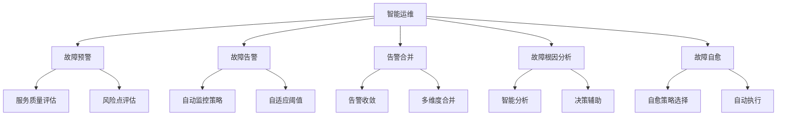

### 1.3 智能运维目标

- **故障前**: 提前给出服务质量和风险点评估，实现故障预警
- **监控自动化**: 无需人工添加监控策略，系统自动设置合适阈值
- **多维异常检测**: 无论哪个地方出现问题都能发现异常
- **告警优化**: 通过有效告警收敛和多维度合并
- **智能分析**: 通过智能对告警进行根因分析，辅助决策
- **故障自愈**: 选择合适的自愈策略并自动执行

---

## 2. 多维异常检测

### 2.1 异常检测的三种指标类型

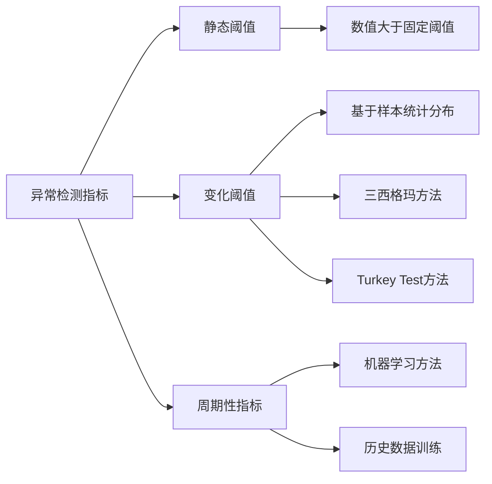

#### 2.1.1 静态阈值

- **特点**: 当指标数值大于某个固定阈值时为异常
- **实现**: 通过CMDB系统同步集群和服务器IP列表，自动添加监控策略

#### 2.1.2 变化阈值（自适应阈值）

- **特点**: 数值会产生变化，需要自适应性阈值
- **方法**:
  - **三西格玛方法（3-Sigma）**:
    - 基于样本统计分布，使用均值±几倍西格玛的方式排除异常值
    - 基本思路：观察最近一段时间的样本点分布
    - 分布集中的点为正常点，离群点为异常点
  - **Turkey Test方法**:
    - 避免少量特别异常的值影响均值或标准差计算
    - 能够保证更好的检测效果

#### 2.1.3 周期性指标

- **特点**: 无固定阈值，随用户访问低峰高峰变化
- **典型指标**: 每日PV/UV、网络出口流量、业务流量、集群访问量、订单量、交易额等
- **解决方案**: 引入机器学习方法

### 2.2 机器学习异常检测架构

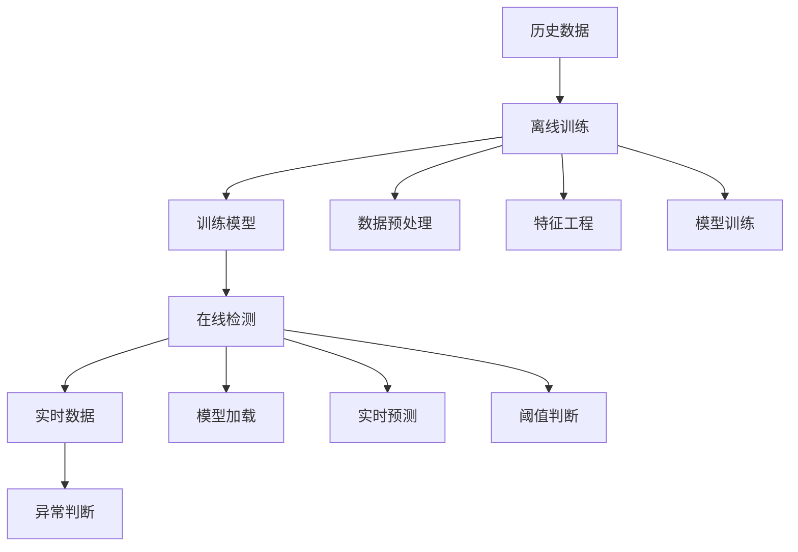

### 2.3 监控自动添加机制

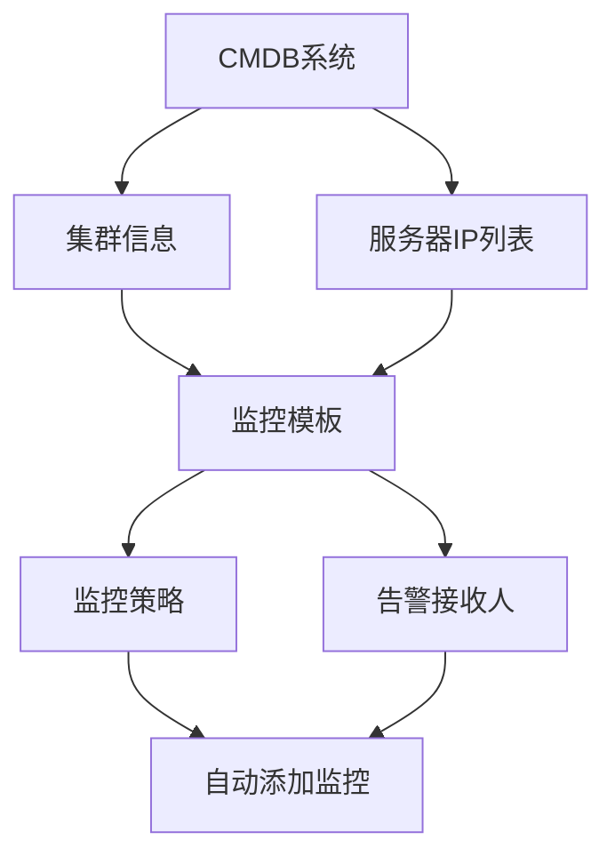

**核心原则**: 以集群为核心维护监控模型

- 服务器列表（物理机/虚拟机/容器）与集群关联
- 监控模板与集群关联
- 告警接收人与集群关联

### 2.4 异常检测效果

系统能够识别三种异常类型：

- **普通异常**: 数据轻微偏离正常区间
- **严重异常**: 持续偏离，可能是运营活动或系统故障
- **陡变异常**: 突然变化，如系统严重异常或网络攻击

---

## 3. 监控告警治理

### 3.1 告警治理目标

- **精准告警**: 减少告警数量，提升告警信息含量
- **告警收敛**: 尽可能减少告警数量
- **精准性**: 确保告警的准确性

### 3.2 告警发送策略控制

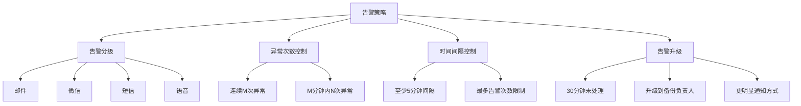

### 3.3 告警合并策略

#### 3.3.1 合并窗口

- **时间窗口**: 1分钟（兼顾合并效果和时效性）
- **合并条件**: 相同用户、相同告警状态、相同告警方式

#### 3.3.2 合并维度

- 集群维度
- IP维度
- 网段维度
- 异常种类维度
- 物理机和虚拟机关系维度

#### 3.3.3 告警合并树算法

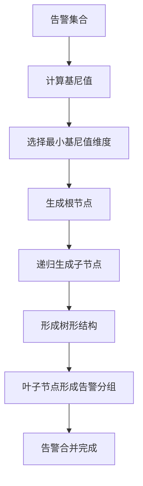

**算法原理**: 基于基尼值最小化的方式自动选择告警合并维度，类似决策树生成算法。

### 3.4 告警合并效果

- **告警数量减少**: 合并后告警数量减少约90%
- **信息汇总**: 提供合并概况和详细信息
- **根因提示**: 通过合并维度提供浅层根因分析

#### 3.4.1 告警合并案例展示

**案例1：集群+指标维度合并**
```
告警概况：[集群A] 22条宕机告警
当前集群服务器异常比率：84.62%（22/26）
说明：26台机器的集群，已有22台宕机，大范围故障，需紧急处理
```

**案例2：服务器+指标维度合并**
```
告警概况：[服务器 192.168.1.100] 5条JVM内存过高告警
说明：单台服务器的多个JVM进程内存异常
```

**案例3：集群+指标维度合并（磁盘空间）**
```
告警概况：[集群B] 6条磁盘空间不足告警
当前集群服务器异常比率：21.43%（6/28）
说明：28台机器中6台磁盘空间不足，需关注扩容
```

**案例4：宿主机+指标维度合并（浅层根因分析）**
```
告警概况：[机房C] 若干条虚拟机宕机告警（由宿主机宕机引起）
根因提示：宿主机宕机导致其上虚拟机全部宕机
价值：直接给出故障原因，无需人工逐层排查
```

**案例5：网段+指标维度合并**
```
告警概况：[机房D] 16条宕机告警（疑似网络设备故障）
异常服务器对应网段：10.10.10.0/24
异常比率：100%
根因提示：网段内机器全部宕机，网络设备故障可能性极高
```

**案例6：集群+服务器+指标三维度合并**
```
告警概况：[集群E] [192.168.2.50] 3条CPU负载过高告警
说明：特定集群的特定服务器的特定指标异常
```

**告警合并的价值**：
- 信息汇总更像人与人之间的交流方式
- 自动计算异常比率，快速判断故障影响范围
- 提供浅层根因分析（如宿主机、网段问题）
- 大幅减少告警噪音，提高运维效率

---

## 4. 智能故障根因分析

### 4.1 根因分析目标

- **自动定位故障**: 无需人工干预
- **故障概况描述**: 提供清晰的故障描述
- **辅助决策数据**: 提供相关数据支持决策

### 4.2 运维知识图谱构建

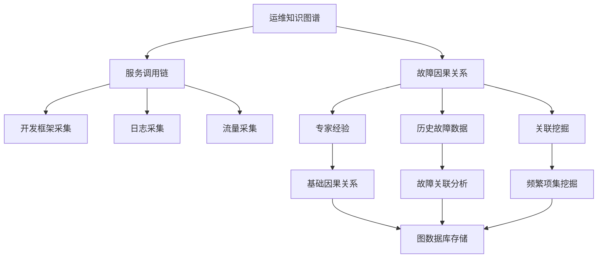

### 4.3 数据收集与整合

#### 4.3.1 基础数据

- **监控配置**: 告警策略、阈值、接收人
- **历史告警**: 告警事件历史
- **CMDB数据**: 集群、服务器IP、负责人、机型配置、机房信息

#### 4.3.2 系统打通

- **发布变更系统**: 线上服务发布和变更操作
- **基础数据层**: MySQL、Redis、MongoDB等数据库异常
- **多监控平台**: 统一多个监控系统的告警数据

### 4.4 关联挖掘算法

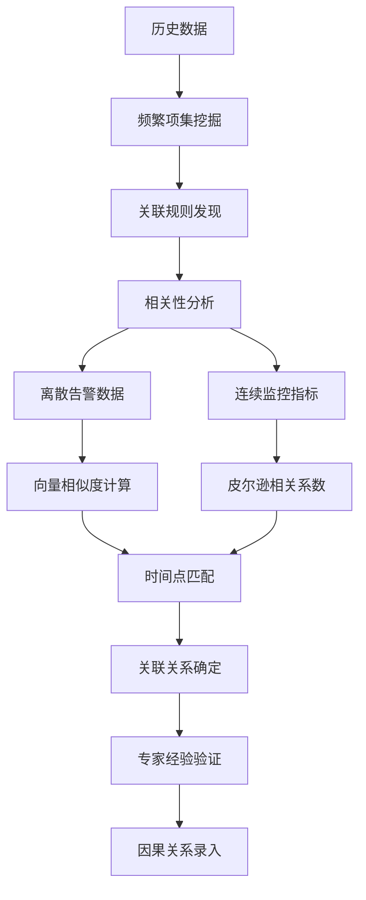

#### 4.4.1 指标关联分析方法

**离散告警数据的向量化**：
- 无告警时定义为0，有告警时定义为1
- 将离散点看成一条曲线
- 每个指标视为一个向量
- 计算多个向量之间的相似程度
- 在相同或相近时间点发生变化说明相关性强

**连续指标数据的相关性**：
- 使用皮尔逊相关系数计算连续曲线的相似度
- 判断不同指标、不同告警之间的关联关系

#### 4.4.2 指标关联图案例

典型的故障因果链：

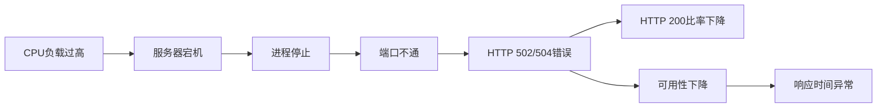

**具体场景说明**：
1. **CPU/IO负载过高** → 可能导致服务器宕机
2. **服务器宕机** → 进程和端口监控异常
3. **进程端口异常** → 上层服务收到502/504错误（如Nginx集群）
4. **502/504错误比率高** → HTTP 200比率下降
5. **200比率下降** → 整体可用性下降
6. **可用性下降** → 响应时间异常

通过知识图谱保存这些因果关系，当某个告警触发时，系统可以：
- 向前追溯：查找可能引起当前问题的根本原因
- 向后推导：预测可能产生的影响
- 结合调用链：跨服务分析故障传播路径

### 4.5 根因分析行为树

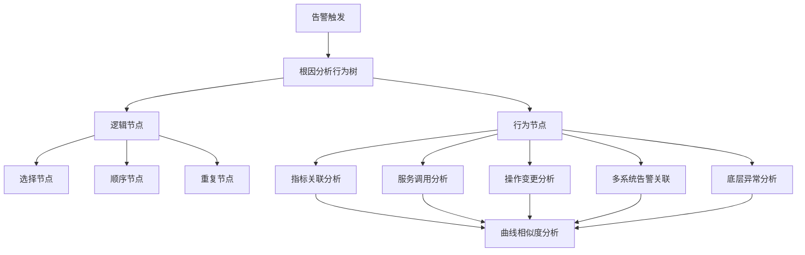

### 4.6 典型故障场景分析

#### 4.6.1 物理机宕机场景


#### 4.6.2 服务调用链故障


#### 4.6.3 网络设备故障


### 4.7 根因分析结果展示

#### 4.7.1 文字描述

提供类似工程师交流的自然语言描述，说明故障的因果关系。

#### 4.7.2 可视化视图

- **节点表示**: 圆圈代表告警或指标异常
- **关系表示**: 箭头表示故障影响关系
- **颜色区分**: 红色表示主干节点，蓝色表示分支节点
- **相似度排序**: 根据相似度计算，最相关的指标排在最前面
- **一页展示**: 所有排查需要的视图和数据集中在一个页面

#### 4.7.3 根因分析案例详解

**案例1：宿主机宕机引发的连锁故障**

```
文字描述：
宿主机 [10.10.1.50] 宕机，导致虚拟机 [10.20.1.10] 和 [10.20.1.11] 宕机，
进而引起集群A出现HTTP 504状态码异常比率升高，
最终影响集群A的可用性和响应时间。

故障链路：
宿主机宕机（蓝色节点）
  → 虚拟机1宕机（蓝色节点）
  → 虚拟机2宕机（蓝色节点）
  → 集群A HTTP 504异常比率升高（红色主干节点）
  → 集群A可用性下降（红色主干节点）
    → 实例IP1可用性异常（蓝色节点）
    → 实例IP2可用性异常（蓝色节点）
  → 集群A响应时间异常（红色主干节点）
```

**案例2：访问量激增导致的性能问题**

```
文字描述：
集群B访问量升高，导致该集群响应时间异常。

故障链路：
集群B访问量上升（红色主干节点）
  → 集群B QPS升高（红色主干节点）
  → 集群B响应时间异常（红色主干节点）

分析：
属于容量问题，非故障，需要扩容或限流。
```

**案例3：发布变更引发的故障**

```
文字描述：
集群C由于上线操作，导致其HTTP 200状态码比率异常。

故障链路：
集群C上线操作（红色主干节点）
  → HTTP 504状态码比例升高（红色主干节点）
  → HTTP 200比例下降（红色主干节点）

分析：
变更操作与告警时间高度相关，疑似发布导致的故障，
建议回滚或检查新版本代码。
```

**根因分析的核心价值**：
1. **快速定位**: 从告警洪流中快速找到根本原因
2. **可视化展示**: 清晰的图形化故障传播路径
3. **辅助决策**: 提供相关数据和分析结果
4. **减少MTTR**: 大幅缩短故障平均修复时间

---

## 5. 技术实现细节

### 5.1 技术栈

- **开发语言**: Python、Go
- **图数据库**: Neo4j
- **存储**: MySQL、Redis
- **Web框架**: 自研Web平台
- **调用链可视化**: 基于Neo4j语法自研

### 5.2 系统架构

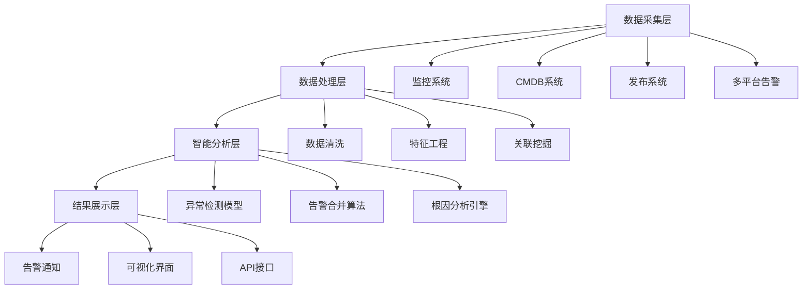

---

## 6. 实践效果与价值

### 6.1 量化效果

- **告警数量减少**: 90%左右
- **监控覆盖率**: 大幅提升
- **故障定位时间**: 显著缩短
- **运维效率**: 明显提升

### 6.2 业务价值

- **稳定性保障**: 提前预警，快速定位
- **运维成本**: 减少人工干预
- **服务质量**: 提升用户体验
- **团队效率**: 释放运维人员精力

---

## 7. 未来发展方向

### 7.1 故障自愈

- **分阶段实施**: 从简单场景开始
- **风险控制**: 人工确认机制
- **预案自动化**: 制定和执行应急预案

### 7.2 资源调度

- **负载均衡**: 基于资源使用率调度
- **自动扩容**: 云平台自动扩容机制
- **弹性伸缩**: 根据负载动态调整

### 7.3 开放平台

- **低代码开发**: 类似蓝鲸的开放平台
- **共建模式**: 各部门接入开放平台
- **通用与个性**: 兼顾通用需求和特殊需求

---

## 8. Q&A 环节精选

### 8.1 故障自愈实施策略

**Q: 故障自愈的思路怎么做？**

**A:** 故障自愈具有一定风险性，需要分阶段实施：

#### 8.1.1 低风险场景（优先实施）

- **磁盘空间不足**:
  - 自动删除预定义目录中几天前的旧文件
  - 风险低，可自动执行

- **进程/端口异常**:
  - 进程不存在时自动重启
  - 端口不通时重启相关进程
  - 风险可控

#### 8.1.2 高风险场景（谨慎处理）

**实施步骤**：
1. **制定应急预案**: 针对特定场景制定标准化处理流程
2. **预案自动化**: 将人工处理步骤转化为自动化脚本
3. **充分测试**: 在测试环境验证预案有效性
4. **人工确认机制**:
   - 在微信告警中提供根因分析视图
   - 展示多个应急预案选项
   - 由人工确认后执行
5. **逐步自动化**: 当效果验证良好后，转为全自动执行

**关键原则**：
- 安全第一，宁可慢不可错
- 建立回滚机制
- 保留人工干预入口
- 持续监控自愈效果

---

### 8.2 运维数据中台建设

**Q: 有运维的数据中台吗？**

**A:** 58集团采用"统一+分散"的数据中台模式：

#### 8.2.1 统一中台（通用部分）

- **职责**:
  - 建设通用的运维数据平台
  - 提供标准化数据采集和处理能力
  - 实现跨部门数据共享

#### 8.2.2 分散建设（个性化部分）

- **背景**: 不同业务部门需求多样化
- **解决方案**:
  - 业务部门可自建监控系统（特别是业务数据监控）
  - 中台提供数据接入标准

#### 8.2.3 整体规划

**在进行根因分析和故障自愈时**：
- **逻辑上**: 构建统一的数据中台视图
- **物理上**:
  - 通用需求由中台统一实现
  - 个性化需求由各部门完善
  - 通过标准接口实现数据互通

**价值**: 既保证通用性，又兼顾特殊性和灵活性

---

### 8.3 资源调度与弹性伸缩

**Q: 现在有根据运维监控的资源使用率来进行资源调度吗？**

**A:** 58集团在多个层面实现了资源调度：

#### 8.3.1 负载均衡层

- **调度策略**: 根据底层各服务实例当前资源使用率
- **动态调整**: 灵活在不同实例间进行流量分配
- **目标**: 确保负载均衡，避免单点过载

#### 8.3.2 云平台层

- **自动扩容**:
  - 监控集群/服务负载压力
  - 压力大时自动触发扩容
  - 基于预设阈值和策略

- **弹性伸缩**:
  - 根据实时负载动态调整资源
  - 支持定时扩缩容策略
  - 成本与性能的平衡

---

### 8.4 技术选型与架构

#### 8.4.1 图数据库选型

**Q: 使用的是什么图数据库？**

**A:** Neo4j

**高可用方案（针对社区版单机限制）**：
- **问题**: Neo4j非商业版为单机版
- **解决方案**:
  - 双写策略：同时写入两个Neo4j实例
  - 保证可用性：单机宕机不影响服务
  - 保证数据安全：避免数据丢失
  - 性能优化：增加缓存策略

**其他可选方案**：
- JanusGraph
- 各有优劣，目前没有明显最优选择

#### 8.4.2 调用链可视化

- **实现方式**: 自研Web平台
- **数据源**: 通过Neo4j语法查询
- **展示**: 自定义可视化组件

#### 8.4.3 技术框架

- **开源技术**: Nginx、Python、Go基础框架、MySQL、Redis
- **自研部分**: 业务逻辑代码、智能算法、可视化平台
- **开放平台**: 类似蓝鲸的低代码平台，支持各部门共建

---

### 8.5 容器技术对智能运维的影响

**Q: 容器方面对智能运维有什么影响？**

**A:** 容器技术为智能运维带来诸多便利：

#### 8.5.1 资源归属清晰

**传统问题**：
- 物理机/虚拟机上多服务混部
- 难以区分各服务的资源占用
- 监控数据难以准确归因

**容器化优势**：
- 一个容器通常运行单一主应用
- 资源隔离，归属清晰
- 监控数据准确可靠

#### 8.5.2 快速扩展和迁移

- **横向扩展**: 快速增加容器实例
- **故障迁移**: 宿主机异常时快速迁移到其他节点
- **快速扩容**: 自动化扩容流程简单高效

#### 8.5.3 环境快速构建

**Q: 包含主机、中间件、应用等组成的一套环境如何快速搭建？**

**传统方式痛点**：
- 申请物理机/虚拟机耗时
- 搭建中间件复杂
- 分配流量配置繁琐
- 整体耗时长（可能需要数小时甚至数天）

**容器化方案**：
1. **云平台快速创建**: 利用云平台技术快速拉起容器实例
2. **服务发现**: 自动注册到服务注册中心
3. **负载均衡**: 自动配置流量分发
4. **预热机制**:
   - 服务启动后进行缓存预热
   - 确保达到最佳状态后才接入线上流量
5. **时间目标**: 分钟级别环境搭建（相比传统方式大幅提升）

**容器IP漂移策略**：
- **58集团实践**: 容器漂移到其他宿主机时IP保持不变
- **优势**:
  - 方便追查问题
  - 方便查询日志
  - 保持技术人员使用习惯一致

---

### 8.6 系统部署与使用情况

**Q: 这套系统需要多少钱？是否对外销售？**

**A:**
- **使用范围**: 58集团内部及旗下多个子公司
- **商业化**: 目前不对外销售
- **定位**: 内部运维支撑平台

---

## 9. 总结

58集团通过构建智能运维体系，实现了：

1. **自动化监控**: 从手动配置到自动添加监控策略
2. **智能异常检测**: 基于机器学习的多维度异常检测
3. **告警治理**: 通过合并和收敛大幅减少告警噪音
4. **根因分析**: 基于知识图谱的智能故障定位

这套体系为大规模微服务集群的运维提供了强有力的技术支撑，显著提升了运维效率和系统稳定性。

---

