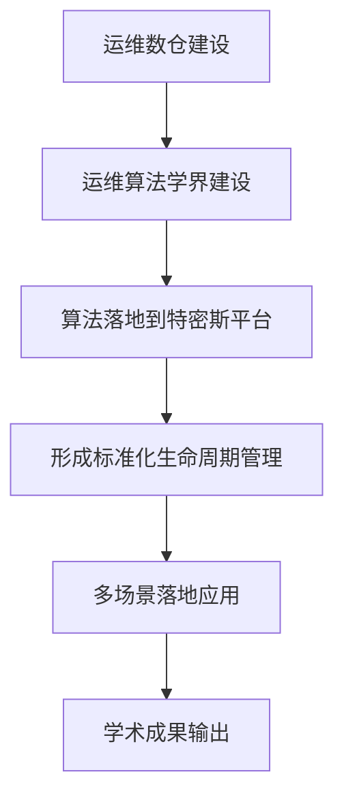
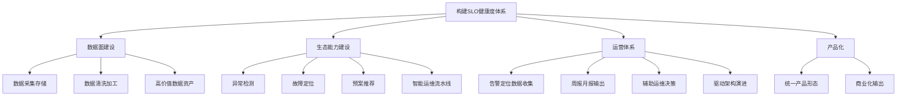
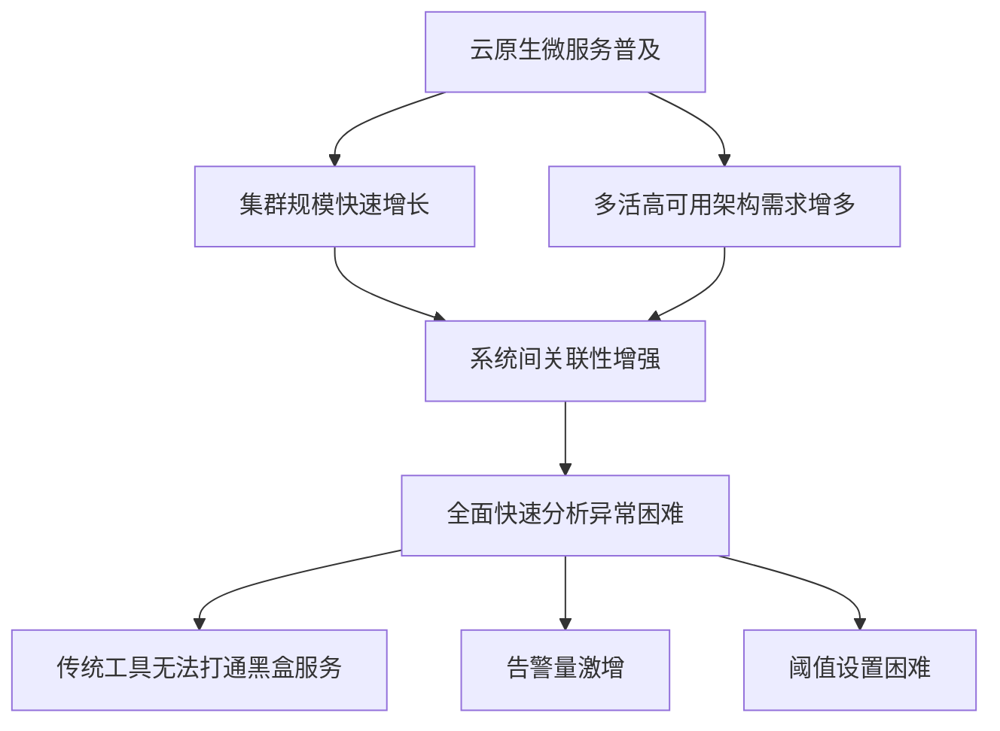
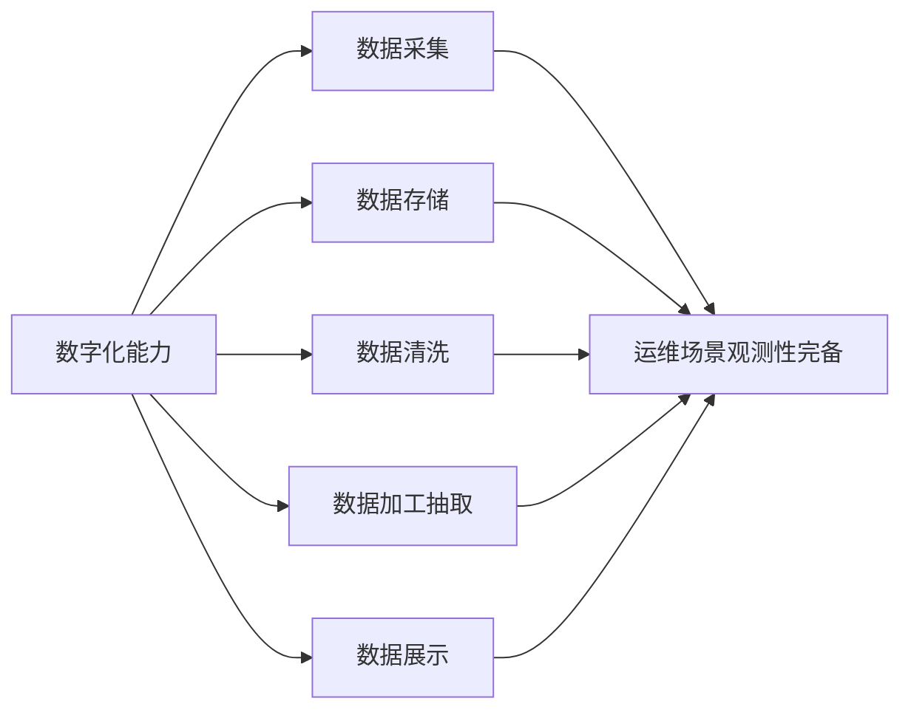
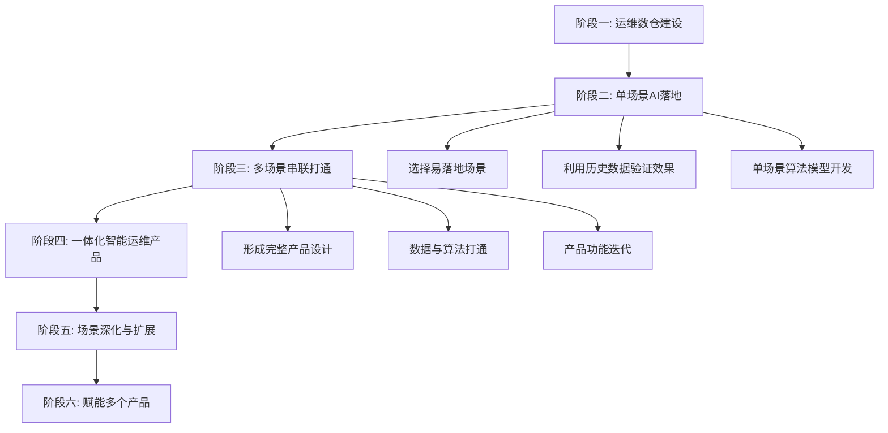
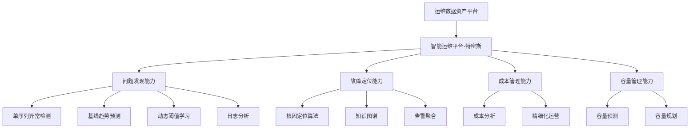
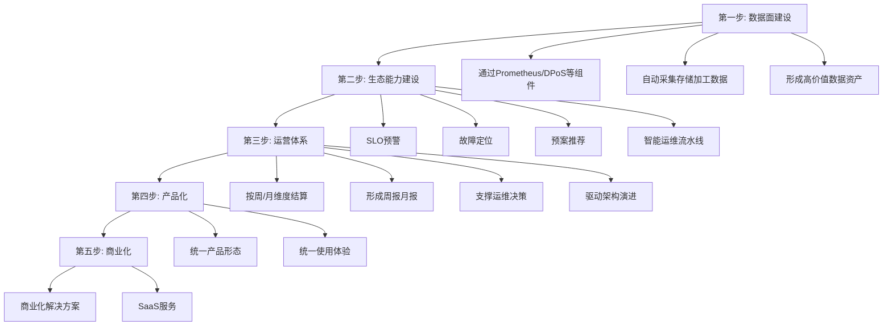
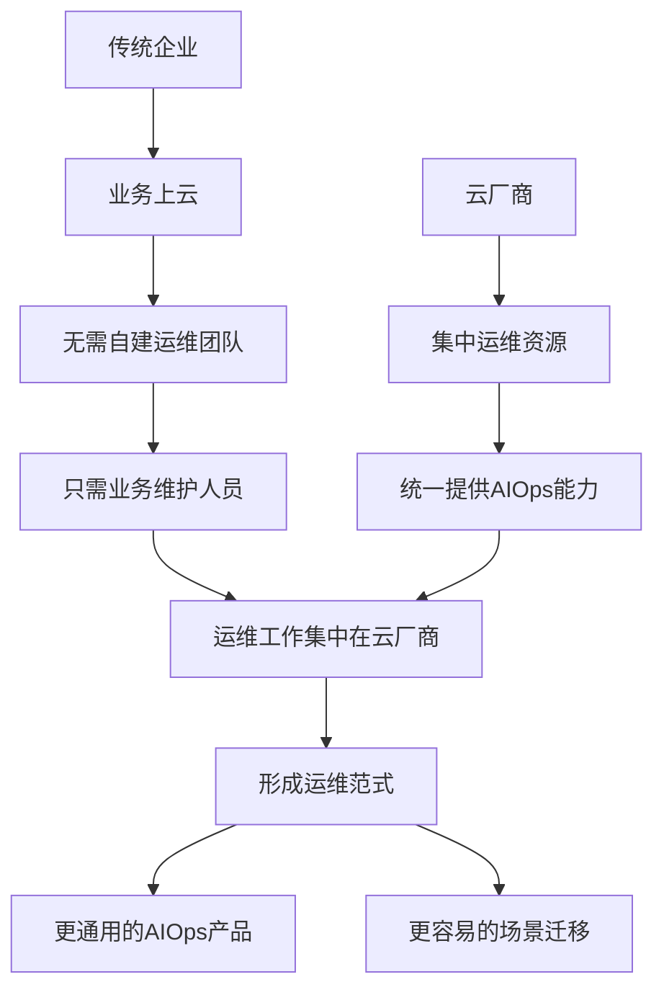

# 智能运维AIOps难落地呼声极高，如何破局

> 来源：未核验 · 类型：分享 · 状态：draft · 原始线索：分享人 张静

## 分享嘉宾

### 张静 - 京东科技智能运维算法负责人
- 硕士毕业于东北大学
- 智能运维算法领域深耕4年
- 负责京东科技智能运维算法研发与迭代
- 在监控、数据库、网络、资源调度等多个场景实现算法落地
- 发明专利30余项，ICSE国际会议收录6篇论文

### 徐新荣 - 蚂蚁集团AIOps技术专家
- 毕业于复旦大学，研究方向为信号处理
- 负责基础设施团队SLO健康度体系建设、产品能力建设及商业化输出
- 围绕SLO生态开展异常检测、故障定位、预案推荐等AIOps实践
- 曾就职于携程技术保障中心，在应用运维领域有丰富实践经验

---

## 一、企业AIOps实践现状

### 1.1 京东科技AIOps实践

#### 建设历程
京东科技从2018年开始建设智能运维，基于一线运维经验，以人工智能与大数据技术为抓手，形成了以应用为中心的一体化智能运维解决方案。

#### 建设路径

#### 核心成果

**异常检测领域**
- 自研10套异常检测算法
- 5套场景化异常检测算法
- 赋能多个监控产品

**故障定位领域**
- 积累5种以上算法缺陷
- 构建运维知识图谱（30万+节点，90万+关系）
- 平均准确度达到80%以上

**日志分析领域**
- 从2020年开始深度分析运维日志
- 迭代5套日志模板、聚类、分类算法

**数据积累**
- 利用历年大促数据进行算法训练与优化
- 在监控、数据库、网络、资源调度等场景落地

### 1.2 蚂蚁集团AIOps实践

#### 核心理念
从数据源头构建高价值数据资产，围绕SLO健康度体系展开AIOps实践。

#### 实践背景
- 基于容量场景、应急场景、智能变更场景
- 重点解决数据质量问题
- **核心观点**：数据质量决定算法效果上限，算法只是在逼近这个上限

#### SLO健康度体系

#### 核心优势
- 在数据产出源头融入专家经验
- 数据携带更多有效信息
- 减少事后数据挖掘成本
- 提升算法泛化能力和迁移能力

---

## 二、云原生与微服务带来的运维挑战

### 2.1 三高挑战

#### 学习成本高
- 云原生、微服务结合容器技术和K8s编排能力
- 软件交付和运行方式发生巨大变化
- 运维人员需要不断学习新技术
- 存量工程师面临时间精力分散问题

#### 迁移成本高

**基础设施层面**
- 网络、存储、计算资源需要适配新架构
- 调度体系需要重新设计

**平台侧改造**
- PaaS、CI/CD流程需要重新设计和编排
- 从面向过程式运维转向面向状态式交互模式
- 监控采集方式、脚本、指标需要相应调整

**业务层面**
- 应用调用方式发生改变
- 从域名或中间件调用转向微服务互访互调

#### 维护成本高
- 系统架构越来越庞大和臃肿
- K8s集群需要团队协作维护
- 除了四件套（API Server、etcd、Controller、Scheduler）外，还有大量自研组件
- 元数据系统需要打通
- 面向状态式资源交付相比传统面向过程式更难排查故障

### 2.2 系统复杂度提升

---

## 三、企业落地AIOps的前置条件

### 3.1 建设初期关键要素

#### 1. 明确目标和验收标准
- 确定具体场景和需求
- 定义清楚问题：AI要为运维场景赋予什么功能
- 明确期望达到的效果
- 制定验收标准
- **避免为了做AIOps而过度投入**

#### 2. 数字化能力建设

**核心要点**
- 运维场景的观测性完备是基础
- 算法的输入必须是数据
- 数据来源于运维场景的观测性
- 优先收集真正有用的监控数据，避免全量收集导致存储和查询成本过高

#### 3. 自动化能力
- 前期可能不具备，但后期需要逐步建设
- 与产品研发形成相互促进的过程
- AIOps开发需要不断调试和训练
- 技术栈可能与业务研发不同（Python vs Java/Go）
- 良好的自动化交付体系可以极大缩短产品研发周期

#### 4. 算法能力
- 可以先上一版算法快速验证效果
- 算法来源：自研或引入开源能力
- 快速运转起来，让效果呈现
- 达到验收标准后再进行后续迭代

#### 5. 协同工作机制

**多角色协同**
- 运维专家：定义运维目标，明确需要解决的问题
- 算法工程师：进行场景数据抽象，判断是否可通过算法达成
- 研发工程师：将算法能力通过程序设计部署到生产环境
- 产品经理：协调各方，负责产品设计和交互

### 3.2 数据治理的重要性

#### 数据治理优先级

**第一步：运维数仓建设**
- 确定哪些数据是真正有用的
- 需要上监控的数据
- 避免全量收集导致存储量巨大
- 减少访问和查询耗时

**第二步：场景与数据匹配**
- 盘点部门内部故障场景
- 识别耗时且让运维工程师头痛的场景
- 将场景与收集的数据进行匹配
- 场景和数据缺一不可

**第三步：算法研发与验证**
- 基于场景和数据研发算法学界
- 先做阈值监控验证数据覆盖度
- 如果不能覆盖故障现象，说明数据治理仍有欠缺
- 补齐能够反馈故障快照现象的监控数据

### 3.3 逐步迭代的建设路径

---

## 四、传统运维转型与团队建设

### 4.1 组建智能运维研发小组

#### 核心角色配置
- **资深运维专家**（多名）：最核心角色，提供需求和业务场景
- **算法工程师**：研发和优化智能运维算法
- **大数据开发专家**：负责数据治理和数仓建设
- **前后端开发工程师**：实现平台化功能

#### 角色重要性说明
- 运维专家是需求方和业务方，永远是核心
- 所有功能和算法落地都要贴合运维专家需求
- 根据建设阶段选择优先配置的角色
  - 数据治理阶段：大数据开发工程师优先
  - 算法研发阶段：算法工程师优先
  - 平台化阶段：前后端开发工程师优先

### 4.2 运维专家与算法工程师的协作

#### 常见问题
- 算法工程师习惯用数学语言表达，运维工程师难以理解
- 运维工程师的需求描述难以转换为算法语言
- 两个角色背景不同，认知需要拉齐

#### 解决方案

**算法工程师侧**
- 将算法知识转换为运维语言
- 定期进行培训和知识分享
- 采用学习讨论会或内部培训形式
- 坐在运维工程师旁边，手把手沟通
- 通过深入交流碰撞出更多火花

**运维工程师侧**
- 收集日常工作中的需求痛点
- 提供日常和大促场景下的故障场景
- 参与算法培训，理解AI能力边界
- 通过反馈修正算法标签

**协作机制**
- 让双方坐在一起，感受彼此痛点
- 反复多次沟通打磨
- 耐心进行磨合
- 建立闭环反馈机制

### 4.3 经验总结

#### 张静老师的转型经验
- 从算法研发逐渐转向运维语言
- 学会用运维团队能理解的方式沟通
- 通过反复沟通找到最佳表达方式

#### 团队建设关键点
- 运维领域专家经验沉淀是宝贵资源
- AIOps重点还是落在运维上
- 双方认知拉齐是达成目标的重要条件
- 定期培训可以激发运维工程师的AI需求

---

## 五、团队内部推进AIOps的建设思路

### 5.1 京东科技建设思路

#### 整体架构

#### 建设阶段

**第一阶段（2018年）：基础建设**
- 收集一线运维经验和痛点
- 总结场景需求
- 建设标准化运维数据资产平台
- 实现数据接入和打通

**第二阶段：单场景落地**
- 选择易落地且能解决运维问题的场景
- 利用历年大促数据验证效果
- 验证网络层、数据库层监控数据的准确度
- 建立明确的验收标准
- 单场景算法模型开发（3天可完成一套模型）

**第三阶段：多场景串联**
- 形成一体化智能运维产品
- 完成产品设计
- 实现数据与算法打通
- 各功能模块逐步追加

**第四阶段：能力赋能**
- 算法能力封装
- 赋能内部多个监控产品
- 明确产品定位
  - 特密斯：偏向业务智能监控和故障定位
  - 数据库团队：以数据库实例为中心的智能运维

**第五阶段：商业化**
- 内部场景做深做透
- 大促期间设定里程碑
- 提升系统稳定性监控能力
- 外部商业化输出

#### 核心能力模块

**异常发现与故障定位**
- 时序指标异常检测
- 日志异常分析
- 根因定位
- 告警聚合

**成本与容量管理**
- 从2022年开始发力
- 成本分析与优化
- 容量预测与规划
- 精细化运营

### 5.2 蚂蚁集团建设思路

#### 发展路径

#### 核心特点

**数据源头精加工**
- 在数据产生源头融入专家经验
- 构建相对高价值的数据资产
- 数据携带更多有效信息
- 减少事后挖掘成本

**SLO健康度体系**
- 找到通用的、泛化能力强的数字化指导方案
- 适配基础设施测的异构系统（K8s、网关、PaaS、中间件、大数据）
- 关注服务维度而非实例维度
- 携带丰富的维度信息用于故障定位和预案推荐

**生态能力组装**
- 将散装能力组装成智能运维流水线
- 形成应急场景下的AIOps能力流水线
- 实现从发现到定位到推荐的闭环

---

## 六、AIOps适用场景分析

### 6.1 什么场景适合使用AIOps

#### 核心判断标准

**1. 自动化无法解决的问题**
- 自动化运维能解决的问题优先用自动化
- 自动化已经做到三个九或四个九的场景无需上AI
- 涉及数据分析、需要数据产出信息或智慧来辅助决策的场景适合AI

**2. 高频次场景**
- 频繁出现的运维问题
- 一次性工作不建议直接上AIOps（投入成本高）

**3. 人力成本高的场景**
- 运维压力大、耗时长的工作
- 不知道如何维护、维护成本特别高的场景
- 可以通过模型学习数据规律，节省运维压力

**4. 复杂度超出人力范围**
- 通过人力已经很难实现的场景
- 需要借助人工智能手段的场景

#### 场景定义要点
- 明确定义问题和场景
- 清楚需要AIOps的什么能力
- AIOps是一个能力集合，不是单一功能
- 场景定义需要基于专家经验

### 6.2 算法的本质理解

#### 算法是复杂的规则集

**传统规则的局限**
- 固定阈值无法适应不同场景
- 同一阈值在不同场景下需要调整
- 白天和晚上波峰波谷需要不同阈值

**算法的优势**
- 通过数学变换预测基线
- 与观测值做差并归一化处理
- 使用三西格玛准则等统计方法
- 一个归一化阈值可适用一类异常检测
- 具有较强的泛化能力

**算法与专家经验的结合**
- 算法需要学习运维专家经验
- 纯AI没有人为干预可能无法达到预期效果
- AI与专家经验结合效果更好
- 短期内（3天）可开发完成一套模型并投入使用

---

## 七、AIOps与人工运维的关系

### 7.1 AIOps的定位

#### 辅助而非替代
- AIOps主要是辅助运维工程师
- 将运维工作从被动转变为主动
- **不能完全替代运维工程师**
- 运维工程师是核心业务方，提供场景和方向

#### 专家经验传承
- AI能够学习运维专家经验
- 帮助新手快速成长
- 让刚入职的运维工程师也能发现问题
- 帮助新员工快速熟悉历年大促场景和故障快照

#### 环境适应
- 帮助跨环境工作的运维人员快速适应
- 将前一环境的经验与新环境结合
- 降低学习曲线

### 7.2 "大部分智能都是用人工换的"

#### 观点解读
- 这是一个客观存在的现实
- 不同背景的人对AIOps理解不同
- 纯运维背景可能更认同这个观点

#### 人工与智能的关系

**运维中的不确定性**
- 运维场景必须是可描述的
- 不确定性在运维领域大部分是可枚举的
- 不确定性需要能够量化和数字化
- 数字化完备性是实践AIOps的前提

**AI中的确定性**
- 找到运维中的不确定性
- 找到AI能提供的确定性
- 将两者有效搭配
- 让AI产出辅助运维决策的能力

**数据质量的重要性**
- 人工缺失时，智能也会缺失
- 专家经验是AI的重要输入
- 数据质量决定算法效果上限

### 7.3 智能运维的价值体现

#### 应急场景
- 异常检测
- 故障定位
- 决策辅助信息输出
- 最终实现故障自愈

#### 成本管理
- 分时调度
- 资源优化
- 精细化运营

#### 效率提升
- 减少重复性工作
- 快速发现问题
- 降低运维压力

#### 理想状态
- 从发现问题到定位问题
- AI产出决策智慧
- 实现故障自愈
- 机器具备运维意识
- 不需要工程师参与

---

## 八、关于"AIOps是伪命题"的讨论

### 8.1 争议的由来

2022年曾有知名公众号转发文章，认为智能运维是伪命题，难以落地，难以实现规模化，服务成本大于平台建设价值。

### 8.2 两位专家的回应

#### 徐新荣老师的观点

**理解差异**
- 不同背景的人理解不同
- 纯运维背景可能更认同这个观点
- AIOps的价值不容易被理解
- 很多时候把AI神化了

**关键是找到匹配点**
- 找到运维中的不确定性
- 找到AI中的确定性
- 将两者有效搭配
- 超出人类范围的不确定性才需要AI

**场景化的现状**
- 目前实践都是基于场景化的
- 没有形成行业标准化
- 没有形成整体产品形态
- 运维人员需要的是完整闭环（发现-定位-自愈）

**用实践回应质疑**
- 所有技术演进都会有不同声音
- 用实际效果呈现是最好的回应
- 需要把整个闭环打通
- 让机器具备运维意识，实现自愈

#### 张静老师的观点

**不同角色认知不同**
- 不同角色对AIOps的认知和作用不同
- 需要理解各方立场

**专家经验传承**
- AIOps能够将运维专家经验传承
- 帮助新手快速成长
- 让不同经验层次的运维人员都能发现问题

**业界共识**
- 各大公司都在投入AIOps建设
- 学术界也在深入研究
- 工业界和学术界都在做深做透
- 投入的专家越来越多

**实践证明价值**
- 京东和蚂蚁都有多场景落地
- 能够发现大促场景下的核心问题
- 得到内部运维工程师认可
- 未来值得投入精力去做

### 8.3 理性看待争议

#### 客观存在的问题
- 场景定制化严重，泛化能力不足
- 不同场景需要调试和适配
- 投入产出比在单个企业可能不高
- 准确度难以量化（因场景而异）

#### 发展的必然性
- 云原生和微服务带来的复杂度需要AI解决
- 传统运维方式难以应对规模化挑战
- 业界投入持续增加
- 学术成果频繁涌现
- 认可度逐渐提高

---

## 九、智能运维未来发展预测

### 9.1 当前发展状况

#### 积极信号
- 各大公司AIOps团队越来越多
- 工业界和学术界成果频繁涌现
- 智能运维产品和学术成果不断涌现
- 建设意识和认可度逐渐提高

#### 发展路径
- 充分挖掘运维场景
- 走精细化、场景化为主的路径
- 逐步形成标准化能力

### 9.2 未来十年展望

#### 运维工作的演进

#### 徐新荣老师的预测

**企业侧变化**
- 大部分非互联网企业未来可能没有运维工程师
- 业务都上云后，不需要投入底层运维资源
- 只需要业务层面的维护人员
- 运维投入会减少

**云厂商侧变化**
- 运维SRE工作集中在云厂商
- 基础设施维护集中在云厂商
- 云厂商统一提供AIOps产品能力

**AIOps发展优势**
- 场景变成高频次（多企业共享）
- 运维范式形成标准
- 迁移能力更强
- 更通用的云产品形态
- 更容易销售和推广

#### 张静老师的预测

**发展范围扩大**
- 智能运维发展范围更广
- 部分场景实现智能运维与自动化运维打通

**主动发现问题**
- 运维工程师主动发现更多线上问题
- 主动解决问题

**运维专家角色转变**
- 通过AI能力让运维专家成为运维算法的掌舵人
- 从执行者转向决策者和指导者

---

## 十、关键问题解答

### 10.1 根因定位准确率

**张静老师回答**
- 根据不同场景评估，准确度不同
- 一套算法学界可能只适配某一个场景
- 核心场景（如大促相关的网络场景）重点发力
- 有的场景能达到80%以上
- 平均准确度在80%左右
- 根据历年故障进行场景匹配和准确度评估

### 10.2 算法反馈修正机制

**京东科技实践**
- 将各层监控数据统一收集到数据中心
- 自研10套异常检测算法
- 不同场景下选择最优算法组合
- 异常告警发送给运维工程师
- 运维工程师通过链接点击修正标签
- 平台内部实现闭环迭代
- 积累不同场景下的异常快照标签
- 评估哪组算法更适配哪个场景

### 10.3 SLO拆分规则

**徐新荣老师回答**
- SLO是服务水平等级，关注服务层面
- 首先明确服务的主体和客体（谁调用这个服务）
- 弄清楚服务是什么
- 确定衡量服务的指标
  - 服务成功率
  - 服务可用性
  - 服务正确性
  - 服务耗时
- 一个服务可以存在多个SLO
- 对指标进行分析后设定目标
- 涉及SLA等相关概念

### 10.4 运维数仓建设建议

**张静老师回答**
- 将在12月2日DMS峰会详细讲解
- 内容包括：
  - 运维数仓在京东科技的搭建方式
  - 运维算法模型的搭建流程
  - 场景适配性
  - 落地实践
  - 平台化建设

---

## 十一、核心观点总结

### 11.1 数据是基础

1. **数据质量决定算法效果上限**
   - 算法只是在逼近效果上限
   - 从源头构建高价值数据资产
   - 数据携带更多有效信息

2. **数字化完备性是前提**
   - 运维场景的观测性必须完备
   - 算法的输入必须是数据
   - 数据来源于运维场景的观测

3. **数据治理优先于算法**
   - 先建设运维数仓
   - 确定有用的监控数据
   - 避免全量收集

### 11.2 场景是关键

1. **明确场景定义**
   - 清楚要解决什么问题
   - 定义验收标准
   - 避免为了AI而AI

2. **场景与数据匹配**
   - 场景和数据缺一不可
   - 盘点耗时且头痛的场景
   - 确保数据能覆盖故障现象

3. **逐步迭代落地**
   - 从单场景开始
   - 快速验证效果
   - 逐步扩展到多场景

### 11.3 协同是保障

1. **多角色协同**
   - 运维专家是核心
   - 算法工程师提供技术能力
   - 研发工程师实现平台化
   - 产品经理协调各方

2. **认知拉齐**
   - 算法语言转换为运维语言
   - 定期培训和知识分享
   - 深入沟通碰撞火花

3. **闭环反馈**
   - 建立标签修正机制
   - 持续迭代优化
   - 形成良性循环

### 11.4 定位是明确

1. **辅助而非替代**
   - AIOps辅助运维工程师
   - 从被动转向主动
   - 不能完全替代人工

2. **专家经验传承**
   - 学习专家经验
   - 帮助新手成长
   - 降低学习曲线

3. **人机协同**
   - 找到运维的不确定性
   - 找到AI的确定性
   - 有效搭配产生价值

---

## 十二、实践建议

### 12.1 建设初期

1. **评估现状**
   - 评估数字化能力
   - 评估自动化水平
   - 识别痛点场景

2. **明确目标**
   - 定义清楚问题
   - 制定验收标准
   - 避免过度投入

3. **快速验证**
   - 选择易落地场景
   - 快速上线一版
   - 验证效果后迭代

### 12.2 建设中期

1. **数据治理**
   - 建设运维数仓
   - 确保数据质量
   - 实现数据打通

2. **算法研发**
   - 开发算法学界
   - 场景化适配
   - 建立反馈机制

3. **平台化**
   - 产品设计
   - 功能模块开发
   - 用户体验优化

### 12.3 建设后期

1. **能力扩展**
   - 从单场景到多场景
   - 从发现到定位到自愈
   - 形成完整闭环

2. **能力赋能**
   - 封装算法能力
   - 赋能多个产品
   - 统一能力输出

3. **商业化**
   - 内部做深做透
   - 外部商业化输出
   - SaaS服务提供

---

## 十三、参考资料

### 13.1 相关会议

**第八届DMS中国数据智能管理峰会**
- 时间：2022年12月2日
- 地点：线下活动

**分享议题**
1. 张静：《京东科技全链路故障诊断智能运维实践》
2. 徐新荣：《运维数据价值升级-基于SLO健康度体系探索与实践》

### 13.2 核心产品

**京东科技**
- 特密斯（Themis）智能运维平台
- 内部昵称"特没意思"

**蚂蚁集团**
- 基于SLO的健康度体系
- 智能运维流水线

### 13.3 技术关键词

- AIOps（智能运维）
- SLO（服务水平目标）
- 异常检测
- 根因定位
- 知识图谱
- 运维数仓
- 算法学界
- 人机协同
- 云原生
- 微服务
- 数据治理

---

## 结语

智能运维AIOps的落地确实面临诸多挑战，但从京东科技和蚂蚁集团的实践来看，通过明确目标、夯实数据基础、选择合适场景、建立协同机制、逐步迭代优化，是可以实现价值落地的。

**核心要点**：
- 数据质量是基础
- 场景选择是关键  
- 人机协同是方向
- 逐步迭代是路径
- 实践验证是答案

未来随着云原生的普及和运维工作的集中化，AIOps将有更广阔的发展空间。从精细化场景化走向标准化产品化，从单个企业实践走向云厂商统一服务，智能运维必将在数字化时代发挥越来越重要的作用。

---

**文档整理**：基于2022年9月技术分享直播内容
**分享嘉宾**：张静（京东科技）、徐新荣（蚂蚁集团）
**整理时间**：2025年
