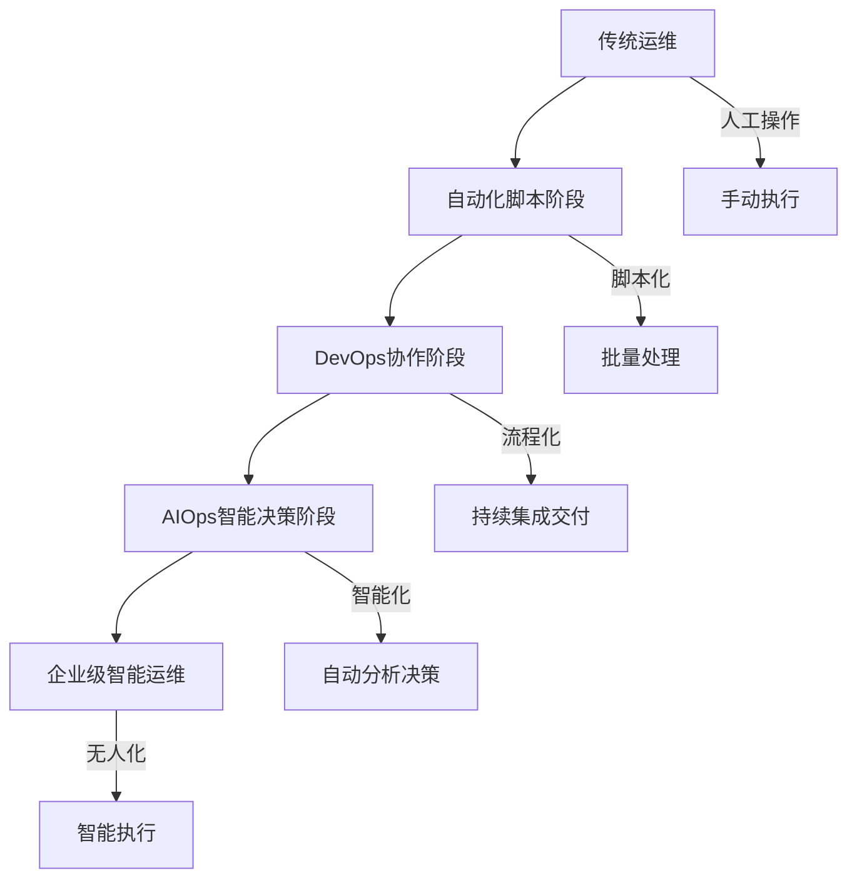
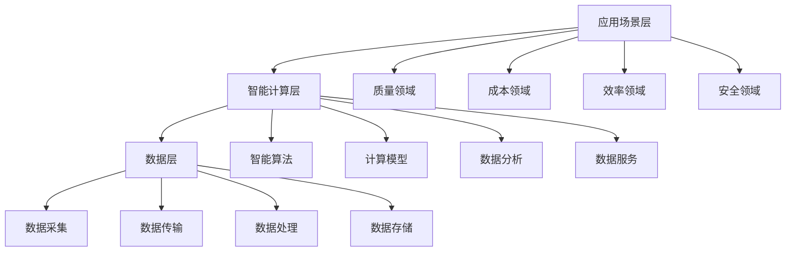
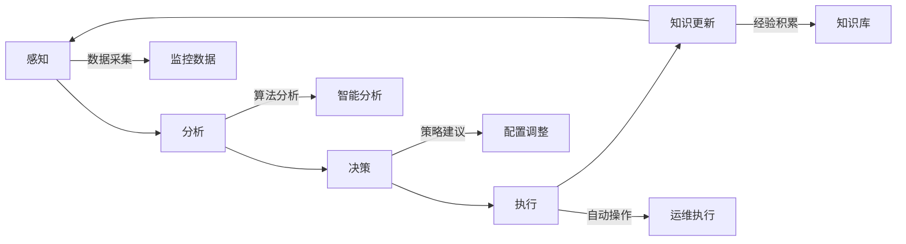
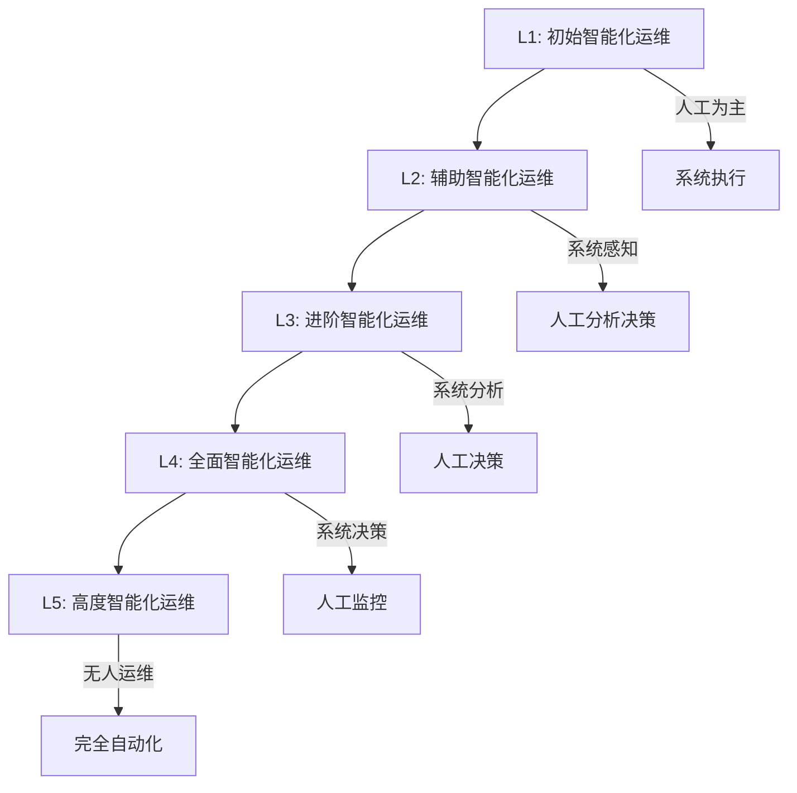
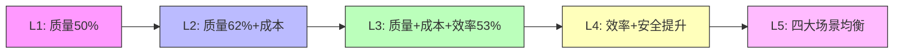
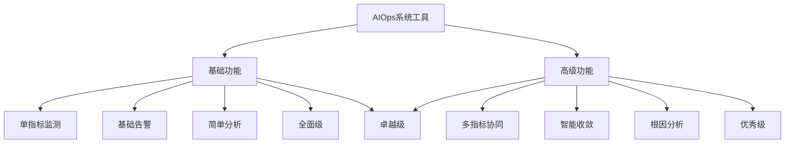
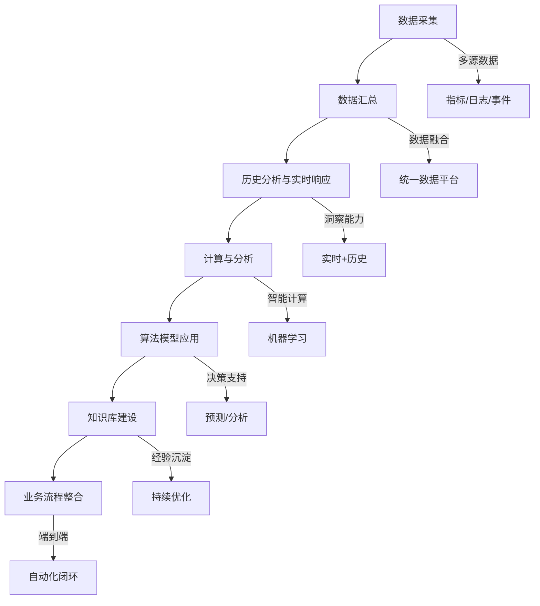

# 智能化运维AIOps能力成熟度模型系列标准权威解读

> 来源：未核验 · 类型：分享 · 状态：draft

> 分享嘉宾: 张文成 - 中国信息通信研究院云计算与大数据研究所审计与治理部  
> 目标受众: SRE、运维及稳定性保障工程师

## 目录

- [一、AIOps背景与发展现状](#一aiops背景与发展现状)
- [二、AIOps能力成熟度模型标准解读](#二aiops能力成熟度模型标准解读)
- [三、AIOps能力评估体系](#三aiops能力评估体系)
- [四、建设实践与展望](#四建设实践与展望)

---

## 一、AIOps背景与发展现状

### 1.1 AIOps概念演进

**概念起源**
- **2016年**: AIOps概念首次提出，定义为 "Algorithmic IT Operations"（基于算法的IT运维）
- **现阶段**: 演变为 "Artificial Intelligence for IT Operations"（人工智能运维）

**发展阶段**

### 1.2 国内外发展趋势

**国际实践**
- **领先厂商**: Google、Microsoft、IBM等已有成熟实践
- **技术方向**: 以深度分析能力为主，快速洞察大量高度异构数据
- **Gartner预测**: 到2025年，75%的产品和平台团队将应用AIOps技术

**国内政策支持**
- 《十四五数字经济发展规划》
- 国家发改委平台经济相关意见
- 大力支持企业数字化发展建设及运维保障

### 1.3 行业应用现状

**各行业应用比例**（已建立智能运维平台）

| 行业 | 应用比例 | 特点 |
|------|---------|------|
| 科技行业 | 49.64% | 平台体系完善 |
| 互联网 | 37.96% | 对外产品服务为主 |
| 银行 | 中等 | 面向内部使用 |
| 电信 | 中等 | 内外兼顾 |

**运维模式分类**
1. **面向内部使用**: 银行等金融机构（合规要求）
2. **对外产品服务**: 科技、互联网企业
3. **内外兼顾**: 电信行业

### 1.4 典型行业应用场景

#### 通信行业
- 运维流程由多轮人工交互转向机器自动化执行
- 故障处理: 业务场景和流程编排重组，形成端到端自动化处理
- 建立故障场景全覆盖的能力链矩阵

#### 金融行业
- 首要任务: 确保重要业务运营中断后快速恢复
- 多种基础设施监控，发现潜在运营风险
- 提升故障检测效率，支持根因分析、异常检测等场景

#### 互联网行业
- 应对业务急剧膨胀和服务类型复杂多样
- 在自动化运维基础上增加机器学习"大脑"
- 支持大量业务场景，实现高效异常发现和智能资源调整

#### 电力行业
- 构建安全能力中台，聚焦多维度安全需求
- 安全能力服务化，形成安全服务目录
- 通过关联规则、统计建模、情报建模等提供安全分析能力

---

## 二、AIOps能力成熟度模型标准解读

### 2.1 标准体系架构

**技术框架三层结构**

**四大应用领域**

1. **质量领域**
   - 监控与智能告警
   - 故障处理（异常检测、日志定位、根因分析、故障预测）

2. **成本领域**
   - 容量预测
   - 成本优化

3. **效率领域**
   - 知识库管理
   - 智能变更
   - 运营决策

4. **安全领域**
   - 威胁感知
   - 安全运营

### 2.2 标准系列组成

#### 第一部分: 通用能力要求

**面向对象**: 企业智能运维整体能力建设  
**关注重点**: AIOps整体能力建设，应用场景层能力

**五个维度评估**

**能力维度说明**
- **感知**: 数据输入和采集过程
- **分析**: 对收集数据进行分析
- **决策**: 根据分析结果形成决策建议（配置、策略调整等）
- **执行**: 基于决策做出相应运维操作
- **知识更新**: 基于过往经验或新业务场景进行知识覆盖和迁移

#### 第二部分: 系统和工具技术要求

**面向对象**: 智能运维系统和工具能力  
**关注重点**: 系统工具的功能性实践

**应用场景划分**

| 领域 | 功能模块 | 技术要求 |
|------|---------|---------|
| 质量 | 智能发现、智能分析、智能处置 | 异常检测、故障预测、告警收敛 |
| 成本 | 智能成本与容量管理 | 容量分析、容量预测 |
| 效率 | 智能变更、运营决策、用户体验 | 系统评估、智能部署、智能变更 |
| 安全 | 智能风险感知、智能安全运营 | 风险可视化、威胁感知、安全知识图谱 |

### 2.3 能力成熟度分级

**五级成熟度模型**

**各级别特征对比**

| 级别 | 感知 | 分析 | 决策 | 执行 | 知识更新 | 系统参与度 |
|------|------|------|------|------|---------|-----------|
| L1 | 人工 | 人工 | 人工 | 系统 | 人工 | 低 |
| L2 | 系统 | 人工 | 人工 | 系统 | 人工 | 中低 |
| L3 | 系统 | 系统+人工 | 人工 | 系统 | 人工 | 中 |
| L4 | 系统 | 系统 | 系统+人工 | 系统 | 系统+人工 | 中高 |
| L5 | 系统 | 系统 | 系统 | 系统 | 系统 | 高 |

**级别详细说明**

**L1 - 初始智能化运维**
- 以人工为主，系统仅在执行阶段参与
- 建立半自动化历史数据库
- 实现数据可视化和基础统计分析

**L2 - 辅助智能化运维**
- 系统参与数据感知和采集
- 系统针对单个场景进行初步分析
- 运维人员结合经验进行决策
- 系统自动完成部分操作

**L3 - 进阶智能化运维**
- 系统结合多种场景进行协同分析
- 支持跨场景数据共享和分析
- 拓展功能到更多业务场景
- 人工仍负责最终决策

**L4 - 全面智能化运维**
- 系统负责主要分析和决策工作
- 人工主要负责监控和辅助
- 实现流数据提取和预测分析
- 支持复杂问题的根因定位

**L5 - 高度智能化运维**（理想阶段）
- 完全无人运维
- 系统全流程自主运行
- 预计5-10年或更长时间实现

### 2.4 能力要求示例: 异常检测

**L2级别要求**
- **感知**: 系统软件对数据进行处理
- **分析**: 系统针对单个场景（异常检测）进行初步分析
- **决策**: 运维人员查看分析结果，结合经验进行操作
- **执行**: 系统软件自动完成操作
- **知识更新**: 人员进行知识积累和更新

**L3级别要求**
- **感知**: 同L2
- **分析**: 系统结合多种场景（异常检测+告警收敛+根因分析）协同分析
- **决策**: 同L2
- **执行**: 同L2
- **知识更新**: 同L2

**主要区别**: L3在分析阶段支持多场景协同分析能力

### 2.5 行业现状数据分析

**整体能力水平分布**
- 51.74%的企业处于L1-L2阶段（初始化和辅助智能化）
- 主要集中在L2级别（系统辅助分析，人工决策）
- 领先企业可达到L3级别
- L4-L5是未来发展方向和目标

**各阶段场景关注度变化**

**建设路径规律**
1. **初期**: 聚焦质量场景（50%）
2. **发展期**: 质量场景持续投入（62%），开始建设成本场景
3. **成熟期**: 质量和成本已有实践，重点转向效率场景（53%）
4. **高级阶段**: 效率和安全场景投入增加
5. **理想阶段**: 质量、成本、效率、安全四大场景均衡发展

**领域关注度排名**
1. **质量领域**: 14.79%（最高）
   - 异常检测和告警收敛最受关注
2. **成本领域**: 
   - 20.59%企业尚未涉及
3. **效率领域**:
   - 系统评估、智能部署、智能变更
4. **安全领域**:
   - 风险可视化、智能威胁感知、安全知识图谱

---

## 三、AIOps能力评估体系

### 3.1 系统工具评估标准

**功能分级**

**评估级别**
- **全面级**: 满足基础功能要求
- **优秀级**: 满足部分高级功能要求
- **卓越级**: 满足基础功能和高级功能要求

### 3.2 功能模块要求示例

#### 异常检测模块

**基础功能**
- 支持在线运维指标实时监测
- 支持多种数据类型的异常检测
- 单指标告警

**高级功能**
- 通过规则算法识别虚假告警
- 特殊日期适配（节假日、业务高峰期）
- 多维度综合分析

#### 故障预测模块

**基础功能**
- 提供多指标故障预测模型
- 基于告警数据的故障预测

**高级功能**
- 支持预测结果评估
- 预测结果标注和反馈机制
- 预测准确度持续优化

#### 告警收敛模块

**基础功能（通用能力要求）**
- 使用固定规则对单个指标告警数量收敛

**高级功能（通用能力要求）**
- 基于告警数量自动找到合适维度
- 自动完成多个场景的告警收敛

**技术功能（系统工具要求）**
- 自动压缩相同/相似告警
- 历史告警多维度分析

**高级功能（系统工具要求）**
- 基于算法自动识别告警风暴
- 提供相应处理策略

### 3.3 评估开放模块

**已开放8个评估模块**
1. 异常检测
2. 故障预测
3. 告警收敛
4. 根因分析
5. 故障预防
6. 容量分析
7. 容量预测
8. 知识构建

**评估成果**（截至2023年7月）
- 10家企业的13个项目通过评估
- 代表国内领先水平
- 成为行业标杆

### 3.4 评估价值

**对企业的意义**
1. **认证价值**: 被认定为国内领先水平，成为行业标杆
2. **自我诊断**: 了解自身发展状况，发现问题，查漏补缺
3. **方向指引**: 明确未来持续优化方向
4. **行业对标**: 对比行业实践，取长补短，共同进步
5. **落地支持**: 帮助更好地实践落地

---

## 四、建设实践与展望

### 4.1 AIOps建设常见误区

**误区一: 必须使用机器学习算法才叫AIOps？**
- ❌ 错误认知: 算法有高低之分
- ✅ 正确理解: 算法没有高低，只有更适合业务场景的算法
- 建议: 结合实际业务场景选择合适的算法

**误区二: 必须先建设DevOps才能建设AIOps？**
- ❌ 错误认知: AIOps依赖DevOps
- ✅ 正确理解: DevOps和AIOps不冲突，可并行发展
- 建议: 
  - 有DevOps基础: 建设过程更顺畅
  - 无DevOps基础: 可从运维场景智能化入手，单个场景→多个场景→平台化

**误区三: 智能运维会替代传统监控？**
- 长远看: 智能运维将逐步替代传统监控
- 目前阶段: 更多是赋能原有运维能力
- 作用: 
  - 事件集中和智能管理
  - 整合多种监控指标、日志、异常等
  - 解决系统间协同性不足问题

### 4.2 AIOps建设路径

**数据驱动的建设思路**

**建设步骤**
1. **数据源收集**: 采集不同对象、不同类型的数据
2. **数据汇总**: 对采集数据进行统一汇总
3. **分析响应**: 历史数据分析 + 实时响应和洞察
4. **计算分析**: 使用计算和分析方法处理数据
5. **算法应用**: 根据分析结果引入技术算法
6. **知识整合**: 结合IT用户、业务流程进行知识积累
7. **持续优化**: 形成闭环，持续改进

### 4.3 实践模式

**场景类实践**
- 依托特定业务场景
- 实现特定能力: 异常检测、故障预测、容量预测、趋势预测等
- 适合: 初期建设，快速见效

**平台类综合实践**
- 提供增强分析和面向行动的数据
- 监控工具提供跨领域数据采集、分析和可视化
- 通过数据流发送到AIOps平台进行跨领域综合分析
- 适合: 成熟阶段，全面覆盖

### 4.4 发展阶段规划

**阶段一: 被动响应阶段**
- 建立半自动化历史数据库
- 实现数据可视化
- 部署统计分析能力

**阶段二: 评估阶段**
- 选择少量核心业务应用
- 评估现有技能
- 清理数据源

**阶段三: 扩张阶段**
- 功能拓展到更多业务场景
- 与IT运营以外数据进行跨领域共享
- 业务流程数据分享和分析

**阶段四: 主动响应阶段**
- 流数据提取
- 使用预测数据进行分析
- 加入复杂问题根因定位和分析

### 4.5 当前挑战与未来方向

**主要挑战**
1. 新场景建设周期较长
2. 模型效果难以维持，持续优化成本高
3. 数据标准化成本高
4. 跨部门协同困难

**改进方向**

**安全场景**
- 企业关注度提升
- 需要加强投入

**质量场景**
- 缺少故障处理流程
- 需要流程标准化

**成本场景**
- 缺少系统健康度评估
- 需要建立评估体系

**效率场景**
- 舆情信息未纳入运营分析
- 需要扩展数据源

**总体趋势**
1. 不断优化现有场景能力，提升稳定性和适用性
2. 持续探索智能运维新场景
3. 加强人员和技术方面投入
4. 推动国内外AIOps产业健康有序发展

### 4.6 国际标准化进展

**首个智能运维国际标准**
- **时间**: 2021年7月
- **牵头单位**: 中国信息通信研究院
- **意义**: 
  - 代表AIOps标准在国际方面的领先地位
  - 推进各方对智能运维能力体系架构达成共识
  - 促进智能运维领域技术应用有效落地
  - 推动国内外AIOps产业健康有序发展

**参与单位**
- 涉及银行、证券、保险、互联网、通信等众多行业领域
- 汇聚行业专家和领先实践企业

---

## 五、总结与建议

### 5.1 核心要点总结

1. **AIOps是运维发展的必然趋势**
   - 从传统运维→自动化→DevOps→AIOps→无人运维
   - 预计到2025年，75%的团队将应用AIOps技术

2. **标准体系已经成型**
   - 第一部分: 通用能力要求（面向整体能力建设）
   -第二部分: 系统工具技术要求（面向功能实现）
   - 五级成熟度模型清晰可执行

3. **建设应循序渐进**
   - 从单一场景到多场景
   - 从工具到平台
   - 从质量到成本、效率、安全全面覆盖

4. **评估体系助力落地**
   - 8个模块已开放评估
   - 提供行业对标和认证
   - 帮助企业明确优化方向

### 5.2 建设建议

**对于初期企业**
- 从质量场景入手（异常检测、告警收敛）
- 选择核心业务进行试点
- 建立数据采集和分析基础

**对于发展期企业**
- 扩展到成本和效率场景
- 推动多场景协同分析
- 建设统一的AIOps平台

**对于成熟期企业**
- 完善安全场景能力
- 实现四大领域均衡发展
- 向L4-L5级别迈进

### 5.3 关键成功因素

1. **数据基础**: 完善的数据采集、存储、处理能力
2. **算法选择**: 根据业务场景选择合适算法，而非追求复杂度
3. **组织协同**: 打通各部门，实现数据和能力共享
4. **持续优化**: 建立知识库，不断积累和更新经验
5. **人才培养**: 加强人员和技术方面投入

---

## 附录

### 相关资源

**标准文档**
- 《智能化运维能力成熟度模型 第一部分: 通用能力要求》
- 《智能化运维能力成熟度模型 第二部分: 系统和工具技术要求》

**调查报告**
- 《中国AIOps现状调查报告》
- 下载方式: 关注"CICT数字化治理"公众号，后台发送"智能运维"

**评估咨询**
- 联系中国信息通信研究院
- 参与AIOps能力成熟度评估

### 关键术语

- **AIOps**: Artificial Intelligence for IT Operations（人工智能运维）
- **DevOps**: Development and Operations（开发运维一体化）
- **SRE**: Site Reliability Engineering（站点可靠性工程）
- **根因分析**: Root Cause Analysis（故障根本原因分析）
- **告警收敛**: Alert Convergence（告警聚合和降噪）

---

> **分享总结**: 本次分享系统介绍了AIOps能力成熟度模型标准体系，为企业建设智能运维提供了清晰的路径和可执行的标准。通过五级成熟度模型和四大应用领域的划分，帮助企业明确自身定位，循序渐进地提升智能运维能力。标准的落地和评估体系的建立，将有力推动国内AIOps产业的健康发展。

