# 在确定性和不确定性中探索 AIOps 的适用性

> 来源：未核验 · 类型：分享 · 状态：draft


> 分享嘉宾: 许新龙 - 蚂蚁技术风险部门
> 
> 议题背景: 本次分享从运维的不确定性和AI的确定性两个维度，深入探讨AIOps的适用场景与实践方法，重点介绍蚂蚁基础设施基于SLO健康度体系的探索成果。

## 目录

- [一、运维中的不确定性](#一运维中的不确定性)
- [二、AI中的确定性](#二ai中的确定性)
- [三、AIOps场景适用性思考](#三aiops场景适用性思考)
- [四、蚂蚁基于SLO健康度体系的实践](#四蚂蚁基于slo健康度体系的实践)
- [五、总结与展望](#五总结与展望)

---

## 一、运维中的不确定性

### 1.1 运维的定义与本质

**运维的本质**是网络服务器、服务生命周期各个阶段的运营维护，在成本、效率、稳定性上面达到一致可接受的状态。

**运维的使命**：保障网站7×24小时不宕机

**现代称谓**：运维工程师现在普遍被称为**网站可用性工程师(SRE - Site Reliability Engineer)**

### 1.2 运维的分类

按照业务或系统层级划分，自下而上分为三类：

| 分类 | 职责范围 | 说明 |
|------|----------|------|
| **基础设施类** | 基础硬件设备、网络等 | 类似二层的基础维护 |
| **平台类** | 中间件、开箱即用服务 | 类似PaaS层的维护 |
| **业务类** | 业务服务和应用 | 保障业务正常运行 |

### 1.3 运维面临的挑战

#### 1.3.1 规模演进带来的复杂性

从早期的单体应用到现在的分布式微服务架构，伴随着网站规模的扩展，复杂度不断提升，给运维带来了诸多不确定性。

**典型案例**：机房掉电事故

- **问题描述**：某互联网机房掉电，UPS未能撑住电网切换，导致机房全部服务器重启
- **影响范围**：虽然部署了多数据中心容灾，但由于应用间存在大量跨机房调用，未实现单元化运行
- **关键问题**：电力恢复后，服务启动的先后次序决定了应用能否正常启动和恢复
- **解决方案**：
  - 实现高可用架构改进
  - 真正做到业务和应用的单元化运行和部署
  - 通过常态化演练机制，确保高可用策略的有效性

#### 1.3.2 运维场景中常见的不确定性

运维是一个"活久见"的职业，常见的不确定性包括：

- 硬件故障(服务器、网络设备、存储)
- 网络问题(带宽、延迟、丢包)
- 软件bug和配置错误
- 容量不足和性能瓶颈
- 人为操作失误
- 外部依赖故障
- 突发流量冲击

### 1.4 运维方式的演进

伴随着软件交付容器化、云原生架构的演进，软件生命周期的治理和运维方式发生了多次迭代：

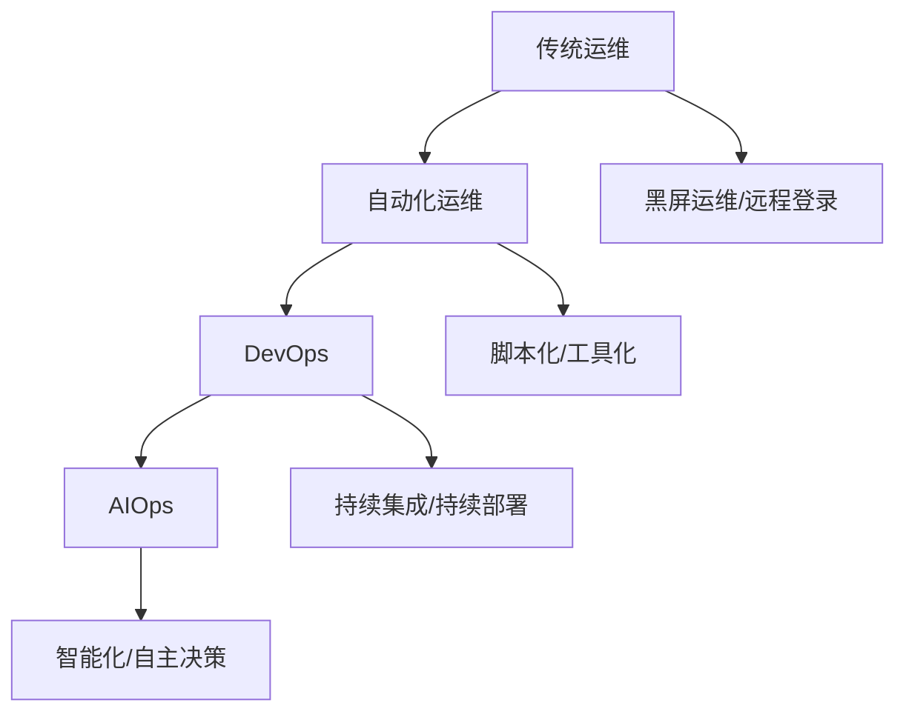

### 1.5 运维的两大核心挑战

| 挑战 | 描述 | 应对策略 |
|------|------|----------|
| **系统复杂度** | 微服务架构、云原生组件众多 | 构建统一的观测体系 |
| **数据体量** | 海量监控指标、日志、trace数据 | 从数据中分析和挖掘价值 |

**解决思路**：单靠堆人力已不现实，需要训练机器智慧，让部分场景具备自主决策能力，最终实现无人值守状态。

### 1.6 云原生场景下的系统复杂度

云原生技术栈包含众多服务和组件，涵盖：

- 容器编排(Kubernetes、Docker)
- 服务网格(Istio、Linkerd)
- 监控观测(Prometheus、Grafana、Jaeger)
- 日志聚合(ELK、Loki)
- 存储方案(Ceph、MinIO)
- CI/CD工具链(Jenkins、GitLab CI、Argo CD)
- 消息队列(Kafka、RabbitMQ)
- 数据库(MySQL、PostgreSQL、MongoDB、Redis)

**思考**：能说出10%以上服务和组件用途的从业者，已经具备较好的技术广度。从事互联网技术和运维行业，学习和提升的空间还很大。

---

## 二、AI中的确定性

### 2.1 人工智能的定义与范畴

**人工智能(AI)、机器学习(ML)、深度学习(DL)的关系**：

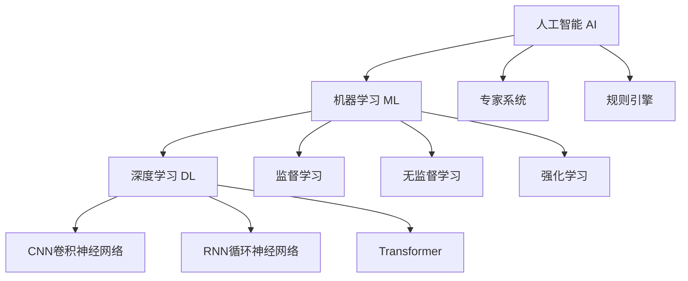

- **人工智能(AI)**：范围最广，用来逼近人的智慧
- **机器学习(ML)**：通过算法从数据中学习模式
- **深度学习(DL)**：基于深层神经网络的机器学习方法

**现状认知**：人工智能目前还没有超出人的智慧，本质是"人工+智能"，**有多少人工投入，就有多少智能收获**。

### 2.2 实践好人工智能的五个条件

引用中国科学院张钹院士的观点(清华朱丹教授在AIOps介绍中多次引用)：

| 条件 | 说明 | 在运维场景的体现 |
|------|------|------------------|
| **充足的数据和知识** | 数据是AI的原材料 | 监控指标、日志、trace数据 |
| **完全的信息** | 样本空间可以表征整体数据空间 | 需要全面的可观测性体系 |
| **明确的场景定义** | 问题的输入输出要清晰 | 异常检测、容量预测、根因定位 |
| **可预测性** | 模型或场景按规律演进，具备解释性 | 时间序列具有弱平稳性 |
| **单领域应用** | 聚焦特定场景 | 语音识别、图像识别、围棋等 |

### 2.3 机器学习算法框架

#### 2.3.1 机器学习的主要类型

**推荐学习路径**：Scikit-learn算法工具包的数据处理路线

**按功能分类**：

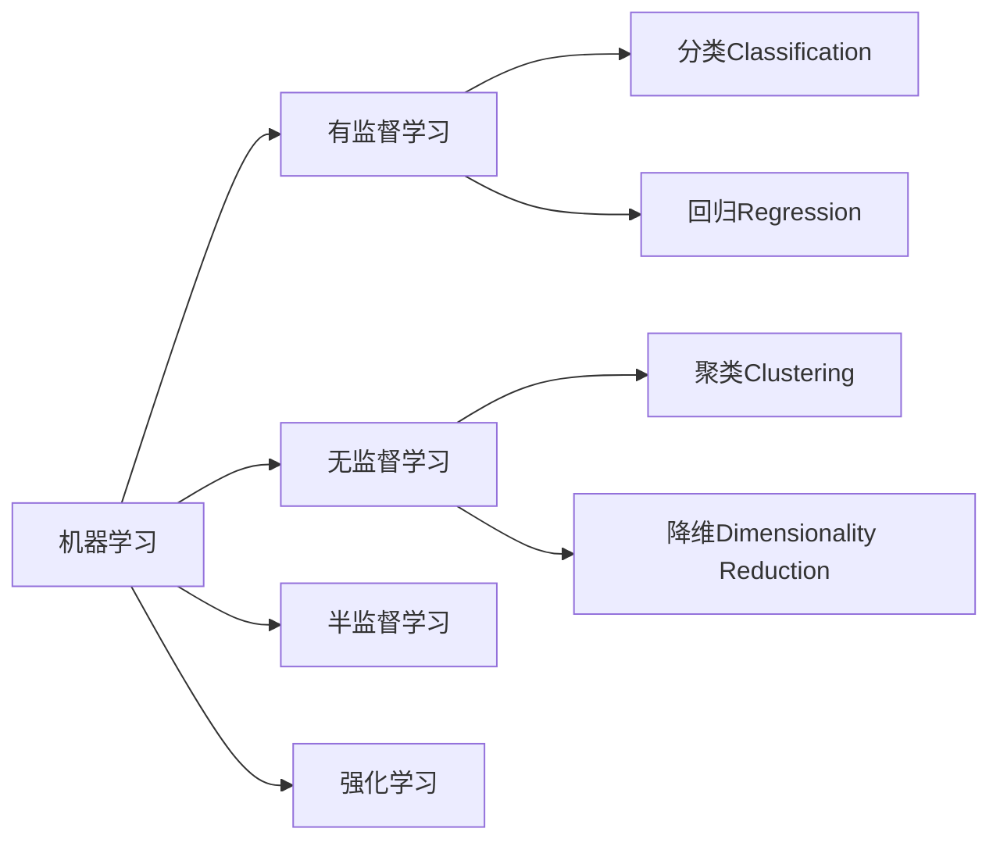

| 类型 | 主要算法 | 应用场景 |
|------|----------|----------|
| **分类** | 逻辑回归、决策树、SVM、随机森林 | 告警级别分类、故障类型识别 |
| **聚类** | K-means、DBSCAN、层次聚类 | 日志模式挖掘、异常用户分组 |
| **回归** | 线性回归、岭回归、LASSO | 性能预测、容量规划 |
| **降维** | PCA、t-SNE、LDA | 高维指标降维、特征提取 |

#### 2.3.2 深度学习

**原理**：基于人工神经网络，通过训练数据拟合一个黑盒函数

**特点**：
- 网络结构或网络层次较深(因此称为"深度"学习)
- 需要定义学习目标，使代价函数达到最小
- 一般采用梯度下降算法作为优化策略
- 以监督式和半监督式算法为主
- 神经元个数越多，模型携带的智慧越多

**在运维中的应用**：相对传统机器学习，深度学习在AIOps中应用较少，主要因为：
- 需要大量训练数据
- 黑盒特性，解释性差
- 训练成本高

#### 2.3.3 自然语言处理(NLP)

**在AIOps中的应用场景**：

- 从日志或文本中提取关键实体
- ChatOps智能机器人对话
- 识别用户意图
- 运维操作指令理解

**核心任务**：
- 分词与词性标注
- 命名实体识别(NER)
- 文本分类
- 情感分析
- 意图识别
- 知识图谱构建

#### 2.3.4 时间序列处理

**应用领域**：金融、气候变化、地质勘探、运维监控

**核心问题**：预测

**分析方法**：

| 分析域 | 方法 | 常用算法 |
|--------|------|----------|
| **时域分析** | 基于时间序列本身的统计特性 | ARIMA、Prophet、指数平滑 |
| **频域分析** | 基于频率成分 | FFT、小波变换 |

**最广泛应用**：趋势预测

**在AIOps中的重要性**：时间序列处理是AIOps应用最广泛的领域，几乎所有监控指标都是时间序列数据。

### 2.4 常用算法工具包

| 工具包 | 主要功能 | 适用场景 |
|--------|----------|----------|
| **Scikit-learn** | 传统机器学习算法 | 分类、回归、聚类、降维 |
| **TensorFlow/PyTorch** | 深度学习框架 | 神经网络模型训练 |
| **Prophet** | 时间序列预测 | 趋势预测、季节性分析 |
| **statsmodels** | 统计建模 | ARIMA、假设检验 |
| **NLTK/spaCy** | 自然语言处理 | 文本分析、实体提取 |

**使用建议**：
1. 清晰定义问题(输入输出)
2. 按照工具包要求加工数据集
3. 调用对应算法
4. 调参优化(需要专业支持)

### 2.5 让AI产出更确定的建议

为了更好地让AI赋能场景，管理好用户预期：

| 建议 | 说明 | 实践要点 |
|------|------|----------|
| **清晰的场景描述** | 明确定义输入输出 | 避免模糊的问题定义 |
| **良好的解释性** | 选择可解释的模型 | 避免纯黑盒逻辑 |
| **关注数据质量** | 数据质量决定效果上限 | 算法只是在逼近这个上限 |
| **理性看待AI** | AI不是万能的 | 不盲目崇拜，结合业务场景 |

---

## 三、AIOps场景适用性思考

### 3.1 AIOps的核心观点

**核心理念**：让AI产出足够支撑运维决策和驱动运维演进的数据

**AIOps实践范式**：


这是一个相对精细的范式定义，相比以往简单的"运维+算法"模式，更强调：
- 数据质量的重要性
- 特征工程的价值
- 决策闭环的建立
- 持续优化的机制

### 3.2 异常检测：AIOps最广泛的应用

#### 3.2.1 异常检测的原理

**统计学视角**：通过统计原理发现样本中的离群点或异常值

**抽象模式**：

```
异常检测 = 比较(|实际观测 - 预期值|, 判断阈值)

if |实际观测 - 预期值| > 判断阈值:
    异常
else:
    正常
```

#### 3.2.2 异常检测的两个核心部分

**1. 预测(Prediction)**

- **定义**：基于t时刻之前的数据，预测t时刻或未来一段时间的数据趋势
- **前提假设**：数据满足弱平稳性
- **本质**：从历史数据中提取规律和确定性，基于规律进行数据外推
- **应用场景**：成本预测、容量规划、性能预测、故障预警

**反例**：股票市场、彩票等场景难以预测，因为破坏了弱平稳性假设

**2. 检验(Validation)**

基于统计原理的假设检验：

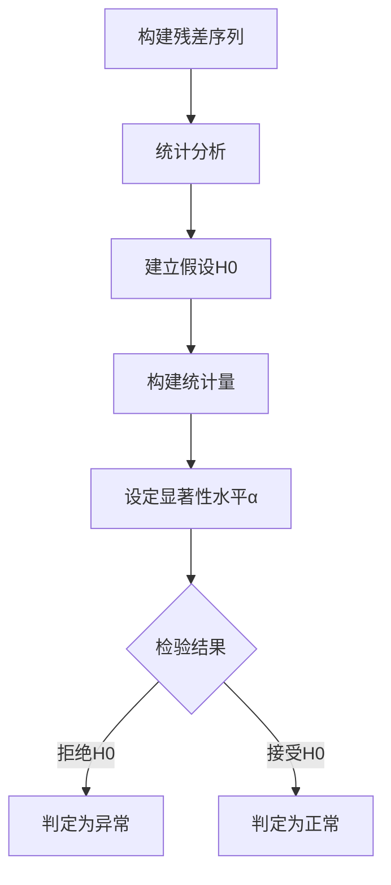

**常见检验准则**：

| 准则 | 说明 | 适用场景 |
|------|------|----------|
| **3σ准则(拉依达准则)** | 超过3倍标准差视为异常 | 正态分布数据 |
| **箱线图准则** | 基于四分位数 | 非正态分布数据 |
| **格拉布斯检验** | 检测单个离群值 | 小样本数据 |
| **狄克逊检验** | 检测极端值 | 小样本快速检验 |

#### 3.2.3 异常检测的效果展现

**两种主要形式**：

1. **动态阈值**：
   - 阈值随时间变化
   - 适应数据的周期性和趋势性
   - 表示为：`阈值 = 预测值 ± n × 标准差`

2. **残差序列规范化**：
   - 计算残差：`残差 = 实际值 - 预测值`
   - 进行规范化：`标准化残差 = 残差 / 标准差`
   - 在规范化后的序列上设置固定阈值

**优势**：
- 极大提升阈值设定的泛化能力
- n倍标准差相比固定阈值具有更强的适应性
- 具有较好的可控性和解释性

### 3.3 故障定位：AIOps的重要方向

#### 3.3.1 故障定位的目的

- 挖掘运维事件与事件之间的关联程度
- 基于统一的打分策略进行量化
- 结合专家经验进行因果推理
- 推荐可能的根因

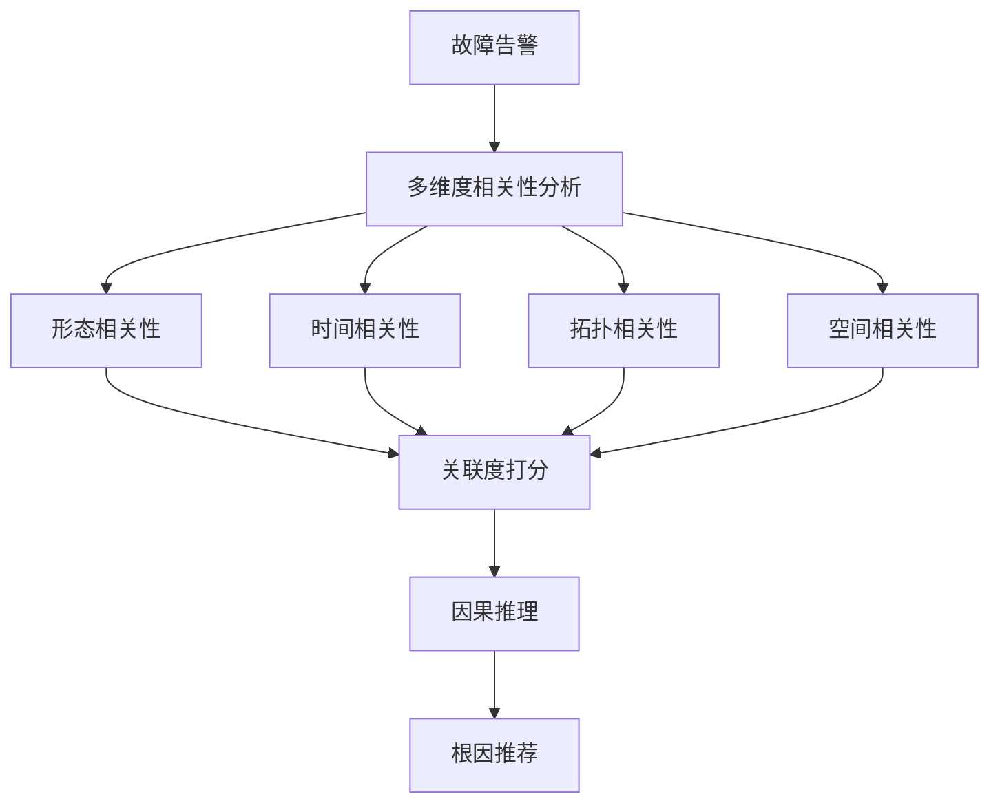

#### 3.3.2 形态相关性

**目的**：检验不同时间序列之间的相似程度

**要求**：序列长度和时间点需要对齐

**主要计算方法**：

| 方法 | 公式特点 | 优势 |
|------|----------|------|
| **Pearson相关系数** | 度量线性相关性，结果在[-1,1] | 归一化，适合关联性打分 |
| **余弦距离** | 度量向量夹角 | 不受量纲影响 |
| **欧氏距离** | 度量空间距离 | 直观简单 |

**Pearson相关系数**最常用，计算公式：

```
r = Σ[(Xi - X̄)(Yi - Ȳ)] / √[Σ(Xi - X̄)² × Σ(Yi - Ȳ)²]
```

#### 3.3.3 时间相关性

**应用场景**：异常发生时间点与运维事件之间的关联程度

**设计思路**：以时间间隔为自变量，设计经验函数，随着时间间隔增加，关联程度递减

**推荐策略**：使用Sigmoid函数构造柔性打分策略

```
相关性得分 = 1 / (1 + e^(k×Δt))
```

其中：
- Δt：时间间隔
- k：衰减系数

**优势**：
- 相比二值开关，能更精细地区分候选事件的关联程度
- 平滑过渡，符合实际业务逻辑

#### 3.3.4 多维融合

对于多维时序异常检测，结合时间点进行相关性判断时：

**融合策略**：调和平均

```
H = n / (1/x₁ + 1/x₂ + ... + 1/xₙ)
```

**优势**：
- 对极端值不敏感
- 能综合考虑多个维度
- 适合用于综合评分

#### 3.3.5 服务依赖拓扑的相关性定位

**依赖**：领域知识和专家经验

**关键工作**：提前梳理系统上下游依赖关系

**应用价值**：
- 基于知识图谱快速定位故障
- 追踪故障在调用链上的传导
- 缩小故障范围

**典型场景**：Kubernetes调度系统

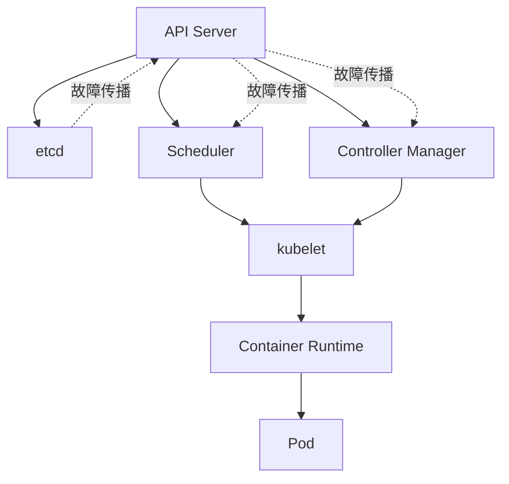

在K8s这样复杂的系统中，快速定位故障根因需要：
- 清晰的组件依赖关系
- 故障可能传播链路
- 结合监控数据的智能推断

#### 3.3.6 空间相关性

**关注点**：从物理拓扑视角挖掘信息

**数据来源**：CMDB或PaaS系统中的资产信息

**关键维度**：
- 机房(IDC)
- 机柜(Cabinet)
- 机架(Rack)
- 网络布线
- 电源链路

**应用场景**：
- 同机柜多台服务器同时故障 → 可能是交换机问题
- 同一电源链路设备异常 → 可能是供电问题
- 同一网络分区服务不可达 → 可能是网络故障

#### 3.3.7 因果推断与知识库

**挑战**：从"谁出了问题"到"什么导致了问题"

**解决方案**：构建故障知识库

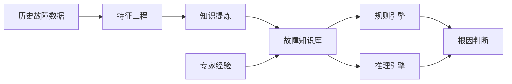

**实践难点**：
- 需要长时间积累历史故障数据
- 需要专业的领域知识梳理
- 知识库的持续更新和维护

**价值**：
- 沉淀垂直领域知识
- 实现故障自动诊断
- 提升定位效率和准确率

### 3.4 AIOps适用性总结

| 方面 | 关键点 | 实践建议 |
|------|--------|----------|
| **跨领域协同** | 需要运维、算法、产品多角色协作 | 培养复合型人才，加强跨团队沟通 |
| **场景聚焦** | 避免简单问题复杂化 | 评估投入产出比，选择高价值场景 |
| **数据质量** | 数据质量决定效果上限 | 从源头建设高质量数据资产 |
| **可解释性** | 算法需要具备可解释性 | 优先选择白盒或灰盒模型 |
| **持续迭代** | AIOps是长期工程 | 建立反馈机制，持续优化 |

---

## 四、蚂蚁基于SLO健康度体系的实践

### 4.1 背景与挑战

#### 4.1.1 运维场景特点

蚂蚁基础设施层存在众多异构系统，为上层业务应用和服务提供依赖。考虑到不同系统之间的技术栈、架构部署等因素，需要找到一种：

- 相对通用
- 泛化能力强
- 数字化的方案

来指导和构建整个基础设施域内的健康度体系。

#### 4.1.2 建设历程

**时间**：2019年左右开始

**目标**：从零到一建设蚂蚁基础设施层的SLO健康度体系

**核心理念**：在相对统一、相对标准的框架下，指导和驱动服务质量的数字化建设，形成对组织更有价值的数据资产和流程。

### 4.2 SLO体系核心概念

#### 4.2.1 三大核心概念

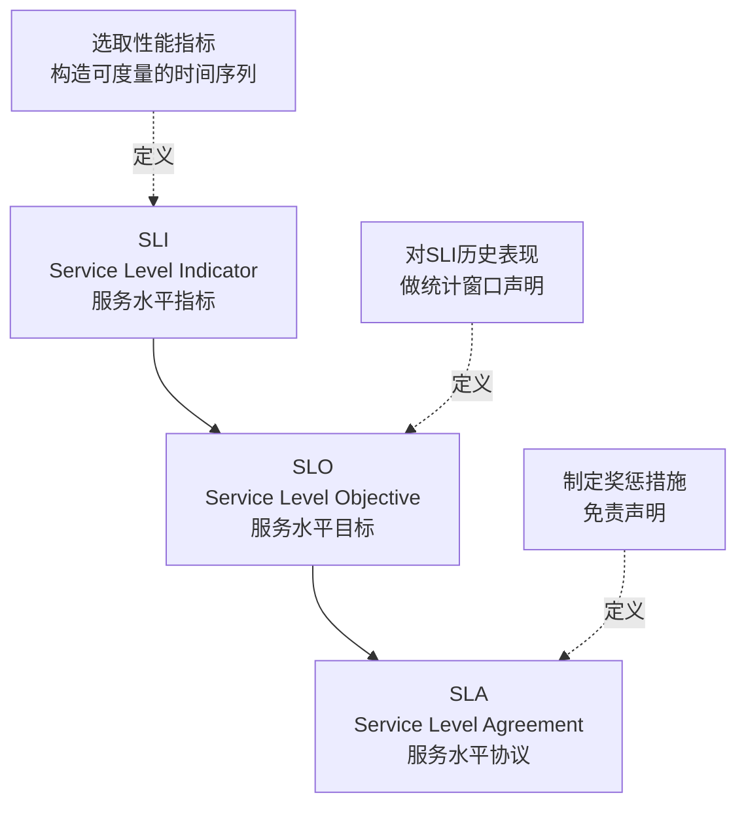

**详细说明**：

| 概念 | 定义 | 示例 |
|------|------|------|
| **SLI** | 选取服务性能相关的指标，构造普遍有解释性、可度量的服务质量时间序列 | 请求成功率、响应时间、可用性 |
| **SLO** | 对SLI过往表现和数据分析，在统计窗口内做一定的声明 | 某服务的请求成功率达到99.99%(4个9) |
| **SLA** | 为了约束和监督服务方对SLO承诺的履行，制定的奖惩措施或免责声明 | 可用性低于99.9%时，赔偿服务费的10% |

#### 4.2.2 SLO数据 vs 传统Metric数据

| 对比维度 | SLO数据 | 传统Metric数据 |
|----------|---------|----------------|
| **聚焦度** | 高：关注核心服务质量 | 低：覆盖所有指标 |
| **数量** | 少：每个服务几个到几十个 | 多：每个服务成百上千 |
| **业务相关性** | 强：直接反映用户体验 | 弱：技术指标为主 |
| **可解释性** | 强：面向业务语言 | 弱：面向技术语言 |
| **决策支持** | 直接支持业务决策 | 需要二次加工 |
| **告警质量** | 高：告警即问题 | 低：需要人工判断 |
| **运维效率** | 高：聚焦关键问题 | 低：信息过载 |

**互补关系**：

- **SLO数据**：SRE日常工作重点关注，数量少，质量高
- **Metric数据**：用于发现和定位服务器实体粒度的故障，配合自愈能力进行实体替换

### 4.3 SLO健康度体系架构

#### 4.3.1 整体架构

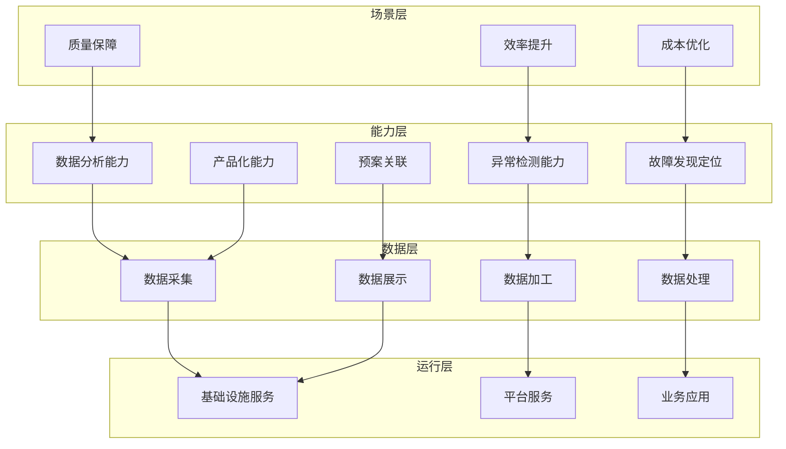

**四层结构说明**：

1. **运行层**：系统运行层次，包括基础设施域内所有服务和应用
2. **数据层**：SLO数据的采集、加工、处理、展示
3. **能力层**：数据分析、检测、故障发现定位、预案关联、产品化等
4. **场景层**：围绕质量、效率、成本等大命题展开

#### 4.3.2 SLO数据模型(基于Prometheus)

**时间序列数据模型**：

```
{
  timestamp: 1234567890,        # 时间戳
  value: 0.9999,               # 监控数值
  labels: {                    # 维度标签
    service: "payment",
    region: "cn-hangzhou",
    env: "production",
    ...
  }
}
```

**Prometheus特点**：
- 单数值数据模型(vs InfluxDB的多值模型)
- 标签即维度
- 支持强大的查询语言PromQL

#### 4.3.3 服务水平影响因子(SLF)

**定义**：在构建SLO数据时，将可能影响服务水平的维度注入到SLO数据中

**目的**：在SLO预警时，遵循相关维度进行信息钻取，快速定位故障信息

**示例维度**：
- 地域(Region)
- 可用区(Zone)
- 集群(Cluster)
- 服务版本(Version)
- 部署环境(Environment)
- 调用方(Caller)

**挑战**：
- 维度过多会导致笛卡尔积数据空间过大
- 消耗大量算力

#### 4.3.4 服务水平依赖(SLD)

**背景**：受限于单条SLO数据所能携带的维度信息数量

**定义**：将SLO运行时数据相关联的指标或其他SLO作为依赖项，构建拓扑关系

**目的**：描述故障可能的传播路径

**应用场景**：
- 通过依赖相关性做定位
- 不同SLO或指标之间通过相同维度传递信息
- 挖掘上下游关系中更多异常信息

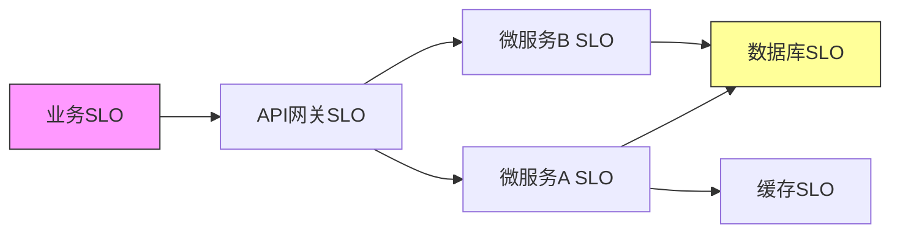

### 4.4 SLO数字化大盘

#### 4.4.1 核心功能

**SLO数字化大盘**是SRE常态化运营机制的重要组成部分：

| 功能 | 说明 | 价值 |
|------|------|------|
| **定期采集** | 自动采集SLO指标 | 减少人工工作 |
| **周期结算** | 按日历周、日历月结算 | 清晰的时间维度 |
| **达标展示** | 不同产品的SLO达标情况 | 一目了然 |
| **颜色标识** | 红色=不达标，绿色=达标 | 视觉直观 |
| **故障关联** | 与故障定位打通 | 快速溯源 |
| **下钻分析** | 支持多维度下钻 | 深入分析 |

#### 4.4.2 运营机制

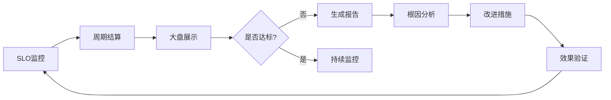

### 4.5 基于SLO的应急响应

#### 4.5.1 告警策略：基于错误预算

**错误预算(Error Budget)**：允许的不可用时间

```
错误预算 = (1 - SLO目标) × 统计周期

例如: SLO目标 = 99.99%, 统计周期 = 30天
错误预算 = (1 - 0.9999) × 30天 × 24小时 × 60分钟
         = 4.32分钟
```

**告警策略**：

```promql
# Prometheus Recording Rule示例
# 计算错误预算消耗速率
- record: slo:error_budget_burn_rate:5m
  expr: |
    (1 - slo:success_rate:5m) / (1 - slo:target)

# 告警规则
- alert: SLOErrorBudgetBurnRateHigh
  expr: |
    slo:error_budget_burn_rate:5m > 14.4  # 消耗速率超过14.4倍
    and
    slo:error_budget_remaining < 0.1       # 剩余预算少于10%
  for: 5m
  labels:
    severity: critical
  annotations:
    summary: "SLO错误预算快速消耗"
```

**优先级设定**：

| 消耗速率 | 剩余预算 | 优先级 | 响应时间 |
|----------|----------|--------|----------|
| >14.4倍 | <10% | P0 | 5分钟 |
| >6倍 | <25% | P1 | 30分钟 |
| >3倍 | <50% | P2 | 2小时 |

#### 4.5.2 故障定位流程

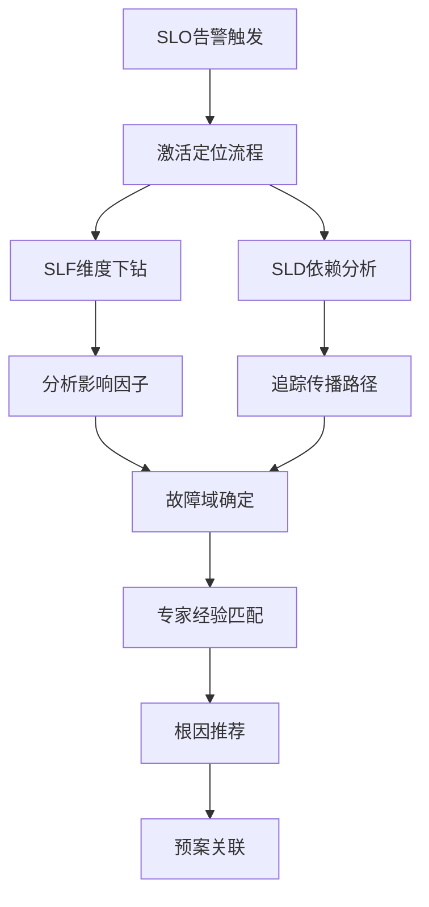

**定位策略**：

1. **基于SLF的维度下钻**：
   - 按照Region、Zone、Cluster等维度
   - 分析哪个维度出现异常
   - 缩小故障范围

2. **基于SLD的依赖追踪**：
   - 沿着依赖关系向下游查找
   - 识别依赖链上的异常节点
   - 确定故障传播路径

3. **结合专家经验**：
   - 匹配历史故障模式
   - 应用领域知识
   - 提供根因假设

### 4.6 预案与自愈

#### 4.6.1 预案体系

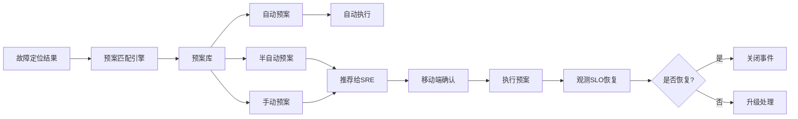

**预案类型**：

| 类型 | 说明 | 示例 |
|------|------|------|
| **自动预案** | 系统自动执行 | 自动扩容、自动重启、流量切换 |
| **半自动预案** | 推荐后人工确认执行 | 发布回滚、配置变更 |
| **手动预案** | 提供操作指导 | 复杂故障处理流程 |

#### 4.6.2 移动端运维(ChatOps)

**核心能力**：
- 掌上告警接收
- 移动端预案执行
- 实时SLO监控
- 变更审批
- 团队协作

**优势**：
- 不受地点限制
- 响应更及时
- 操作更便捷
- 降低运维成本

#### 4.6.3 闭环管理

**关键步骤**：

1. **预案执行**：根据定位结果执行预案
2. **效果观测**：实时监控SLO恢复情况
3. **结果判断**：
   - 恢复 → 关闭事件，记录经验
   - 未恢复 → 升级处理，更新预案
4. **持续优化**：
   - 积累故障案例
   - 优化预案库
   - 提升自愈率

### 4.7 实践成果

#### 4.7.1 关键指标

| 指标 | 说明 | 价值 |
|------|------|------|
| **SLO覆盖率** | 核心服务的SLO定义覆盖比例 | 衡量体系建设完整度 |
| **达标率** | SLO达标的服务比例 | 衡量服务质量水平 |
| **MTTI** | 平均告警识别时间 | 衡量检测能力 |
| **MTTK** | 平均故障定位时间 | 衡量定位能力 |
| **MTTR** | 平均故障恢复时间 | 衡量整体应急能力 |
| **自愈率** | 自动恢复的故障比例 | 衡量智能化水平 |

#### 4.7.2 核心价值

1. **高质量数据资产**：
   - 从源头建设精加工的SLO数据
   - 数据质量决定AI效果上限
   - 为算法提供优质原材料

2. **系统化框架**：
   - 统一的标准和规范
   - 跨系统的泛化能力
   - 可复制的最佳实践

3. **智能化能力**：
   - AI赋能运维场景
   - 提升运维效率
   - 降低人力成本

4. **业务价值**：
   - 提升服务质量
   - 降低故障影响
   - 支撑业务发展

---

## 五、总结与展望

### 5.1 核心要点回顾

#### 5.1.1 运维的不确定性

| 要点 | 关键内容 |
|------|----------|
| **复杂度挑战** | 从单体应用到微服务架构，系统复杂度指数级增长 |
| **规模挑战** | 海量数据和服务，单靠人力无法应对 |
| **职责演进** | 从传统运维到SRE，关注可用性工程 |
| **解决方向** | 智能化、自动化、数据驱动 |

#### 5.1.2 AI的确定性

| 要点 | 关键内容 |
|------|----------|
| **本质认知** | 有多少人工投入，就有多少智能收获 |
| **五大条件** | 充足数据、完全信息、明确场景、可预测性、单领域 |
| **算法框架** | 机器学习、深度学习、NLP、时间序列处理 |
| **工具生态** | Scikit-learn、TensorFlow、Prophet等成熟工具 |

#### 5.1.3 AIOps适用性

| 要点 | 关键内容 |
|------|----------|
| **核心理念** | AI产出支撑运维决策的数据 |
| **重点场景** | 异常检测、故障定位、容量预测、根因分析 |
| **实践要点** | 跨领域协同、场景聚焦、数据质量、可解释性 |
| **避免误区** | 不盲目崇拜AI，不简单问题复杂化 |

#### 5.1.4 蚂蚁SLO实践

| 要点 | 关键内容 |
|------|----------|
| **核心框架** | SLI → SLO → SLA，构建健康度体系 |
| **数据质量** | 从源头建设高质量运维数据资产 |
| **智能能力** | 异常检测、故障定位、预案自愈 |
| **业务价值** | 提升质量、降低成本、支撑增长 |

### 5.2 个人成长建议


**持续循环**：
1. **学习思考**：了解理论知识、算法原理、业界实践
2. **实践应用**：在真实场景中应用，解决实际问题
3. **总结沉淀**：记录经验教训，形成知识积累
4. **模式提炼**：提炼可复用的方法论和最佳实践

### 5.3 关键建议

#### 5.3.1 对于运维工程师

- **拓宽知识面**：学习算法、统计学、数据分析基础
- **培养数据思维**：用数据说话，从数据中发现问题
- **理解业务**：将技术指标转化为业务语言
- **持续学习**：关注新技术，保持学习习惯

#### 5.3.2 对于算法工程师

- **深入运维场景**：了解SRE日常工作，理解真实痛点
- **关注可解释性**：不追求复杂模型，优先考虑可解释性
- **数据质量优先**：参与数据体系建设，从源头保证质量
- **效果可量化**：建立评估体系，量化算法价值

#### 5.3.3 对于技术管理者

- **建设复合型团队**：培养懂运维的算法工程师，懂算法的运维工程师
- **聚焦高价值场景**：评估投入产出比，避免过度投入
- **建立长效机制**：AIOps是长期工程，需要持续投入
- **数据资产建设**：重视数据质量，建设高价值数据资产

### 5.4 行业展望

#### 5.4.1 AIOps发展趋势

| 趋势 | 说明 |
|------|------|
| **大模型赋能** | LLM在日志分析、根因推断、知识问答等场景的应用 |
| **自愈能力提升** | 更高的自动化率，更智能的决策能力 |
| **可观测性融合** | Metrics、Logs、Traces的统一分析 |
| **领域知识沉淀** | 行业知识库、故障案例库的建设和共享 |
| **标准化建设** | SLO等标准在更多企业落地 |

#### 5.4.2 面临的挑战

| 挑战 | 说明 |
|------|------|
| **人才稀缺** | 复合型人才培养需要时间 |
| **数据孤岛** | 跨系统数据整合困难 |
| **解释性问题** | 复杂模型的可解释性不足 |
| **场景碎片化** | 难以形成统一解决方案 |
| **投入产出平衡** | 需要合理评估ROI |

### 5.5 后续分享预告

**DMS中国数据智能管理峰会 - 2025年10月上海站**

更加详细的技术分享：
- 蚂蚁SLO健康度体系的完整架构
- 更多实践案例和经验教训
- 技术细节深度解析
- 现场交流和答疑

欢迎关注和参与！

---

## 附录

### 附录A：常见问题解答

#### Q1: SLO设定好之后，如何保证能够达成目标？各个阶段怎么规划？

**A1**: 

这是一个运营策略问题，建议：

1. **公示与对齐**：
   - SLO制定后需要公示
   - 与研发、业务团队对齐
   - 明确各方责任

2. **定期共建**：
   - 定期Review SLO达标情况
   - 分析未达标原因
   - 制定改进措施

3. **流程驱动**：
   - 将SLO纳入强流程(如发布流程、变更审批)
   - 通过流程确保重视程度
   - 建立不达标的处理机制

4. **动态调整**：
   - SLO不是一次性设定到位
   - 根据实际情况动态调整
   - 持续优化和完善

**核心理念**：不是为了达标而达标，而是通过SLO发现运维中的风险点，持续改进。

#### Q2: 在AIOps系统中，机器学习算法用得多，还是深度学习用得多？

**A2**:

从蚂蚁的实践来看：

**机器学习更常用**：
- 主要应用于时间序列处理和分析
- 算法相对简单，解释性好
- 可控性和可操作性更强

**深度学习较少**：
- 模型解释性相对较弱
- 在运维场景下适用性有限
- 对数据量和算力要求更高

**选择原则**：
- 优先考虑可解释性
- 关注算法的可控性
- 评估维护成本

**建议**：在确定性和不确定性的权衡中，运维场景更需要确定性，因此倾向于选择解释性好的算法框架。

#### Q3: 如何评估AIOps项目的ROI(投入产出比)？

**A3**:

**投入侧**：
- 人力成本(算法、开发、运维)
- 计算资源成本
- 数据存储成本
- 工具和平台建设成本

**产出侧**：
- 故障恢复时间缩短(MTTR下降)
- 人力节省(自动化率提升)
- 故障次数减少
- 用户体验提升(SLO达标率)

**量化方法**：
```
ROI = (节省成本 + 避免损失) / 投入成本

其中:
节省成本 = 人力节省 + 资源优化
避免损失 = 故障时长减少 × 单位时间损失
```

### 附录B：推荐学习资源

#### 书籍推荐

1. **《SRE: Google运维解密》**
   - Google SRE团队经验总结
   - SLO理念的最佳实践

2. **《智能运维：AIOps核心技术与实战》**
   - 清华大学裴丹教授等编著
   - 全面介绍AIOps理论和实践

3. **《统计学习方法》**
   - 李航著
   - 机器学习算法原理

4. **《时间序列分析》**
   - 系统学习时间序列处理方法

#### 在线资源

1. **工具和框架**：
   - Scikit-learn官方文档
   - Prometheus官方文档
   - TensorFlow/PyTorch教程

2. **社区和会议**：
   - GOPS全球运维大会
   - DMS中国数据智能管理峰会
   - AIOps社区

3. **开源项目**：
   - Awesome-AIOps (GitHub)
   - 时间序列异常检测算法集合

### 附录C：术语表

| 术语 | 英文全称 | 说明 |
|------|----------|------|
| **SRE** | Site Reliability Engineering | 网站可靠性工程/工程师 |
| **AIOps** | Artificial Intelligence for IT Operations | 智能运维 |
| **SLI** | Service Level Indicator | 服务水平指标 |
| **SLO** | Service Level Objective | 服务水平目标 |
| **SLA** | Service Level Agreement | 服务水平协议 |
| **MTTR** | Mean Time To Repair | 平均故障恢复时间 |
| **MTTI** | Mean Time To Identify | 平均故障识别时间 |
| **MTTK** | Mean Time To Know | 平均故障定位时间 |
| **CMDB** | Configuration Management Database | 配置管理数据库 |
| **NLP** | Natural Language Processing | 自然语言处理 |
| **TSDB** | Time Series Database | 时间序列数据库 |

---

## 结语

AIOps不是银弹，但在正确的场景、用正确的方法应用，可以显著提升运维效率和质量。关键是：

1. **理解运维的不确定性**，明确需要解决的问题
2. **把握AI的确定性**，选择合适的算法和工具
3. **建设高质量数据资产**，这是AI效果的上限
4. **聚焦高价值场景**，避免过度投入
5. **建立长效机制**，持续优化和迭代

最后，感谢大家周末参加线上分享。如有问题，欢迎在评论区交流，或通过社区渠道继续讨论。

期待与大家在未来的技术分享中再次相遇！

---

*本文档根据蚂蚁技术风险部门许新龙老师的线上分享整理而成*

*分享时间: 2025年*

*整理日期: 2025年10月*

