# B站AIOps建设之根因分析实践

> 来源：未核验 · 类型：分享 · 状态：draft

## 一、B站AIOps整体建设

### 1.1 AIOps整体架构

B站AIOps架构采用三层设计，从底层数据到上层应用形成完整的智能运维体系。

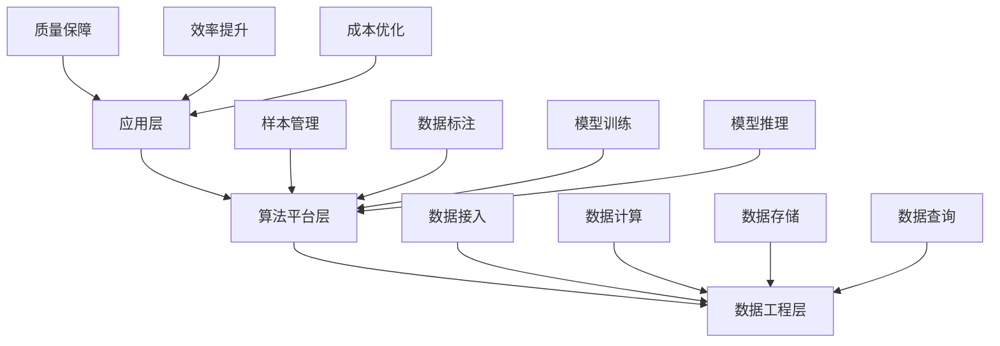

**三层架构说明：**

**1. 数据工程层（底层）**

- 数据接入：多源数据统一接入
- 数据计算：实时和离线计算
- 数据存储：高效存储方案
- 数据查询：快速查询能力

**2. 算法平台层（中层）**

- 围绕不同观测数据类型构建多场景算法
- 提供样本管理、数据标注能力
- 支持模型训练和推理的开放能力

**3. 工程应用层（上层）**

- 围绕质量、效率、成本构建多场景应用
- 结合APM、PaaS等场景
- 赋能可观测平台，提供AIOps能力

### 1.2 AIOps数据集成链路

#### 指标监控

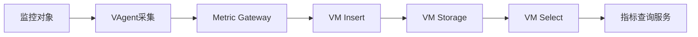

**技术栈：**

- 基于VictoriaMetrics架构
- 通过VAgent采集不同监控对象
- 支持Push模式的指标任务
- 通过Metric Gateway网关写入VM Storage
- 上层封装指标查询场景和服务能力

#### 事件数据

**数据源：**

- 告警平台
- 发布变更平台
- CMDB平台
- 中间件平台
- 基础设施平台

**处理流程：**
消费队列 → 流式计算 → ClickHouse → 事件查询服务

#### 链路追踪

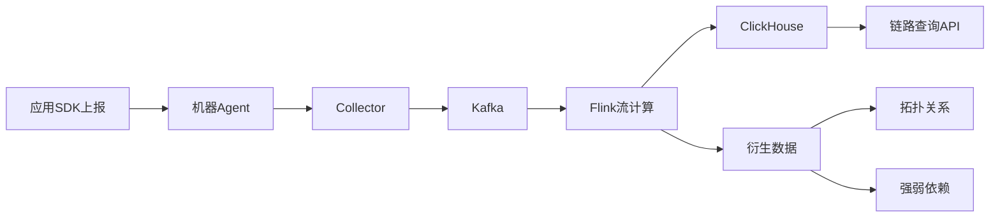

**架构特点：**

- 基于OpenTelemetry架构
- 应用SDK上报到机器Agent
- 通过Collector收集到Kafka
- Flink计算原始数据和衍生数据
- 衍生数据包括：拓扑、强弱依赖关系等

#### 日志数据

**技术方案：**

- 基于ClickHouse方案
- 应用SDK上报日志
- 消费端写入ClickHouse
- 提供日志查询能力

### 1.3 运维知识图谱

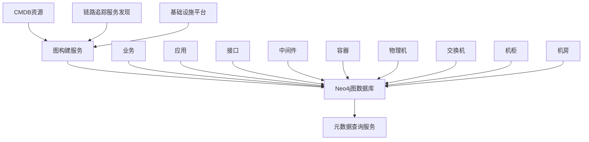

**核心能力：**

- 维护运维实体节点的变更
- 维护运维资源之间的关系
- 构建资源血缘关系
- 支持多类型节点：业务、应用、接口、中间件、容器、物理机、网络设备等

## 二、根因分析背景与概念

### 2.1 什么是根因分析？

**定义：**
在复杂系统事件中，通过一系列方法和技术深入探究并确定问题或故障发生的根本原因。

**实际价值：**

- 根本原因：问题的最深层次原因
- 直接原因：对快速止损有高参考价值
- 传播链路：从根本原因到故障表现的完整链路

### 2.2 为什么需要根因分析？

**B站稳定性目标：1-5-10**

- **1分钟发现**：告警平台支持1分钟内99分位的端到端故障触达
- **5分钟定界定位**：当前瓶颈，需要根因分析提升效率
- **10分钟止损恢复**

**定位挑战：**

1. **依赖专家经验**

   - 故障定位强依赖专家经验
   - 需要多业务线、多团队联合定位
   - 沟通成本高，效率低
2. **系统复杂度高**

   - 数万级微服务复杂调用
   - 几十种基础组件依赖
   - 数万物理机和网络设备的复杂拓扑

**解决方案：**
通过根因分析集成专家经验，智能化推荐原因，提升定位效率，减少运维成本和故障损失。

### 2.3 根因分析能力范围

#### 分析对象

- 故障告警
- 指标突变
- 业务SLO指标告警（最常用）
- 日志告警
- 业务属性告警（通过配置规则模型）

#### 数据范围

- 指标监控
- 链路追踪
- 日志数据
- 告警数据
- 变更数据

#### 实体类型

基于运维知识图谱，覆盖：

- 应用
- 容器
- 中间件
- 物理机
- 机房
- 网络设备

## 三、根因分析设计与实现

### 3.1 知识工程模型

知识工程是沉淀专家经验的底层模型，基于SRE和业务日常定位场景设计。

#### 设计思路

**SRE定位过程：**

1. 收到告警，知道发生了什么异常
2. 基于专家经验分析可能的原因
3. 查看相关监控、日志、链路等数据
4. 判断哪个异常更可能是直接原因
5. 逐级下钻，定位到根本原因

#### 模型定义

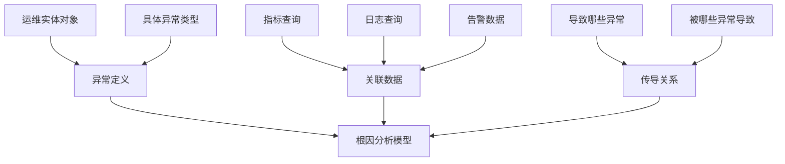

**三部分组成：**

**1. 异常定义**

- 针对哪个运维实体对象
- 发生什么具体异常
- 示例：某应用的SLO下跌、某数据库的慢查询

**2. 关联数据**

- 关联哪些指标、告警、日志
- 通过这些数据分析异常是否触发

**3. 传导关系**

- 该异常可能由哪些异常导致
- 该异常可能导致哪些其他异常

#### 异常传导示例

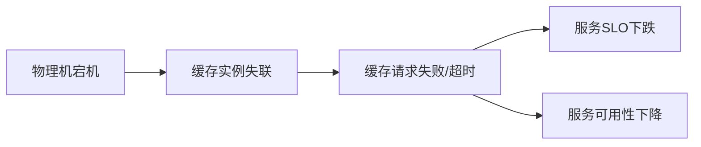

**典型故障场景：**

1. 物理机宕机
2. → 部署在该机器的缓存集群实例失联
3. → 依赖该缓存的服务请求失败或超时
4. → 应用对外服务接口SLO下跌

### 3.2 算法能力

B站AIOps围绕不同数据类型和场景，集成了多种算法和模型。

#### 算法矩阵

| 数据类型       | 场景     | 算法/模型                                    |
| -------------- | -------- | -------------------------------------------- |
| **指标** | 时序预测 | Prophet, LSTM                                |
| **指标** | 异常检测 | Isolation Forest, LightGBM, 3-Sigma, XGBoost |
| **指标** | 时序分解 | STL分解                                      |
| **链路** | 根因定位 | iBottleneck, 根因下钻算法                    |
| **链路** | 错误分析 | 调用链错误分析                               |
| **链路** | 耗时分析 | Uber关键路径分析                             |
| **日志** | 日志分类 | 日志聚类算法                                 |
| **日志** | 根因定位 | 日志根因下钻                                 |
| **事件** | 事件定位 | 事件关联规则挖掘                             |
| **事件** | 关联分析 | GBDT模型                                     |

### 3.3 SLO可用性分析模型

结合知识工程和算法，完成根因推导。

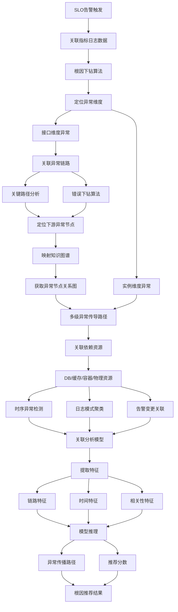

**核心流程：**

1. **告警触发**：SLO告警触发，关联指标和日志数据
2. **维度定位**：通过根因下钻算法定位异常维度（实例/接口/可用区等）
3. **链路分析**：针对接口维度异常，关联异常链路
4. **节点定位**：通过关键路径分析和错误下钻，定位下游异常节点
5. **图谱映射**：映射到知识图谱，获取异常节点和传导关系
6. **资源关联**：关联应用依赖的DB、缓存、容器、物理资源
7. **数据分析**：对关联数据进行时序检测、日志聚类、告警变更关联
8. **特征提取**：提取链路特征、时间特征、相关性特征
9. **模型推理**：通过关联分析模型推理异常传播路径和推荐分数
10. **结果输出**：输出根因推荐结果

## 四、根因分析编排与应用

### 4.1 应用三阶段

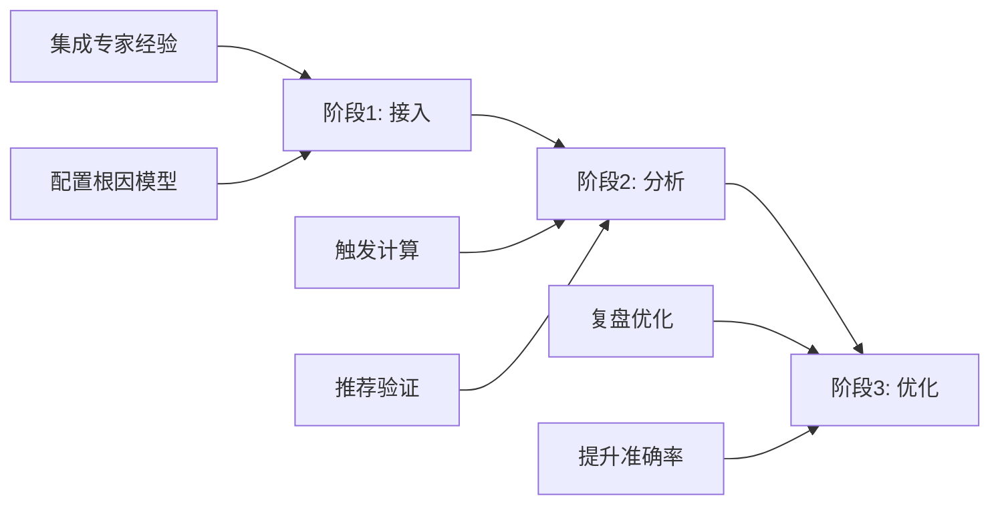

#### 阶段1：根因接入

**前置依赖：**

1. **标准化观测数据**：完整的监控、日志、链路数据
2. **专家经验**：业务和SRE的排障经验

**接入方式：**

**默认接入：**

- 微服务SLO黄金指标
- 通用场景异常
- 基于通用专家经验定义的模型

**自定义接入：**

- 业务自定义场景
- 基于通用模型微调
- 手动配置根因分析模型
- 示例：订单量下降异常的排查经验

#### 阶段2：根因分析

**触发方式：**

- 告警通知触发
- 故障应急触发
- 可观测平台指标看板异常点触发

**计算模式：**

**自动计算：**

- 已接入根因模型的告警
- 后台自动计算
- 告警通知前完成分析
- 点击即可查看结果

**实时计算：**

- 未接入根因分析的告警
- 基于通用模型实时计算
- 95分位耗时：20秒
- 大部分20秒内完成

**推荐内容：**

- 异常对象：具体应用/数据库/机器
- 异常类型：发生了什么问题
- 异常时间：问题发生时间
- 详情数据：验证数据
- 推导路径：异常传播链路
- 推荐分数：越高越可能是真实原因

#### 阶段3：复盘优化

**优化场景：**

- 根因推荐不准确
- 根因未推荐出来
- 真实根因排名靠后
- 场景未覆盖

**优化方法：**

1. **调整权重**

   - 强依赖组件提高权重
   - 弱依赖组件降低权重
   - 示例：Redis弱依赖可降低权重
2. **排除干扰**

   - 排除不影响服务的接口
   - 过滤非异常的错误码
   - 精确化查询条件
3. **新增检查项**

   - 定义新的异常节点
   - 构建异常关系
   - 覆盖新场景
4. **测试验证**

   - 基于历史故障测试
   - 验证优化效果
   - 确认召回和准确率提升

### 4.2 根因模型配置

#### 配置流程

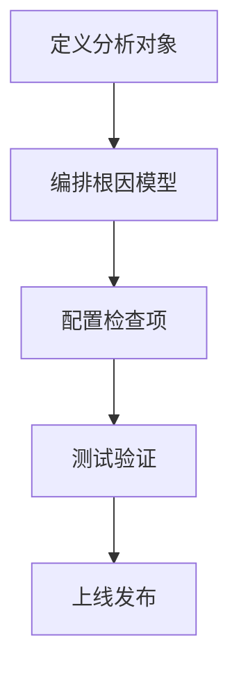

**1. 定义分析对象**

- 针对哪个对象：具体应用/数据库
- 什么异常：哪些告警
- 示例：某应用的SLO告警

**2. 编排根因模型**

- 配置下一级检查项
- 简化配置逻辑
- 只需配置直接下级

**3. 配置检查项**

**检查项包含：**

- **检查对象**：
  - 应用自身
  - 上下游应用（动态拉取）
  - 指定具体服务
- **异常类型**：对应知识工程的异常节点
- **默认权重**：根因推荐权重
- **关联数据**：指标、日志、告警

**4. 测试验证**

- 基于历史告警测试
- 查看推荐结果
- 对比实际根因
- 微调优化模型

### 4.3 根因分析报告

#### 报告内容

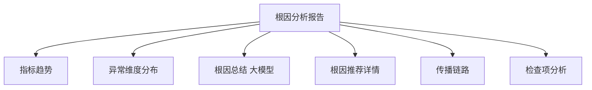

**核心模块：**

**1. 指标趋势**

- 当前异常指标趋势
- SLO当前状态
- 可用性变化

**2. 异常维度分布**

- 接口维度
- 错误码维度
- 实例维度
- 可用区维度

**3. 根因总结（大模型生成）**

- 基于错误维度
- 基于推导路径
- 基于推荐结果
- 便于业务理解的汇总报告

**4. 根因推荐详情**

- 异常对象
- 异常类型
- 推荐分数
- 验证数据

**5. 传播链路**

- 多实体节点间的传播
- 上游应用导致
- 下游中间件导致
- 完整传播路径

**6. 检查项分析**

- 已命中检查项：
  - 异常区间
  - 相关告警
  - 调用链样本
  - 日志模式聚类
- 未命中检查项：
  - 实时数据展示
  - 辅助人工分析

### 4.4 验证能力

**验证场景：**

- 推荐结果不能完全确认
- 真实原因未推荐出来
- 需要人工辅助验证

**验证手段：**

1. 完整报告查看
2. 检查项逐一验证
3. 相关数据详情分析
4. 人工经验判断

## 五、效果与数据

### 5.1 使用数据

| 指标             | 数据   |
| ---------------- | ------ |
| 活跃用户数（周） | 600+   |
| 日均根因分析次数 | 数千次 |
| 召回率           | 93%+   |
| 准确率           | 85.8%  |
| 平均耗时         | 8秒    |
| 95分位耗时       | 20秒   |
| 99分位耗时       | 30秒+  |

**数据说明：**

- 包含大量自动触发的根因分析
- 包含手动触发的未接入场景
- 主要基于告警数量

### 5.2 覆盖范围

**当前覆盖：**

- 应用维度黄金指标
- 应用服务SLO指标告警
- 微服务通用场景

**待扩展：**

- 中间件异常告警（数据库等）
- 网络异常定位
- 系统层异常
- 基础设施异常

### 5.3 典型案例

**案例：Redis故障定位**

**故障现象：**

- 某服务SLO告警触发

**根因推荐：**

1. 服务依赖Redis指标飙升
2. 错误集中在特定维度
3. Redis实例失联
4. 对应物理机失联

**价值：**

- 快速定界定位
- 明确故障范围
- 加速止损恢复

## 六、未来规划与展望

### 6.1 当前重点

#### 1. 开放根因模型编排交互

**解决问题：**

- **黑盒问题**：用户不知道分析了什么
- **准确性未知**：无法判断推荐是否准确
- **无法优化**：推荐不准确时无法改进

**解决方案：**

- 提供模型配置界面
- 支持自定义编排
- 提供测试验证能力
- 支持复盘优化

#### 2. 推进数据规范覆盖

**目标：**

- 提升数据完整度
- 规范数据标准
- 扩大场景覆盖

#### 3. 结合强弱依赖分析降噪

**背景：**

- 5分钟定位瓶颈在验证环节
- 根因分析95分位耗时仅20秒
- 大部分时间用于验证推荐结果

**优化方向：**

- 减少无效推荐
- 降低验证成本
- 提升定位效率

#### 4. 扩展通用异常覆盖

**目标场景：**

- 中间件异常
- 系统异常
- 网络异常
- 影响业务的基础设施异常

**实现方式：**

- 定义通用异常
- 关联业务根因模型
- 联动预案平台
- 自动止损恢复

### 6.2 未来展望

#### 1. 大模型赋能根因分析

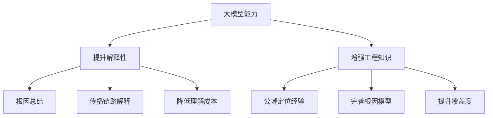

**应用场景：**

**提升解释性：**

- 根因报告总结（已落地）
- 使用B站自研大模型
- 基于推导过程和链路生成报告
- 结合公域定位知识
- 降低用户理解和验证成本

**增强工程知识：**

- 大模型包含公域定位经验
- 补充专家经验
- 完善根因分析模型
- 提升场景覆盖

#### 2. Multi-Agent根因分析

**技术方向：**

- 探索Multi-Agent架构
- 多智能体协作分析
- 跟进业界最新技术
- 持续升级迭代

**参考实践：**

- 业界大厂已有落地
- 下一代根因分析解决方案
- 更智能的协作机制

### 6.3 技术演进路线

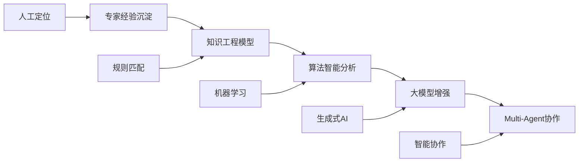

## 七、实施建议与最佳实践

### 7.1 接入建议

**前置准备：**

1. **完善观测数据**

   - 标准化指标采集
   - 完整的日志采集
   - 链路追踪覆盖
   - 告警规范定义
2. **梳理专家经验**

   - 总结典型故障场景
   - 记录排查路径
   - 整理依赖关系
   - 明确传导链路
3. **构建知识图谱**

   - 维护资源拓扑
   - 更新依赖关系
   - 保持数据新鲜度

**接入策略：**

1. 从通用场景开始
2. 逐步覆盖自定义场景
3. 持续优化和迭代

### 7.2 优化建议

**提升召回率：**

- 扩展检查项覆盖
- 补充异常定义
- 完善传导关系

**提升准确率：**

- 调整权重配置
- 排除干扰因素
- 优化算法参数
- 结合强弱依赖

**降低验证成本：**

- 减少无效推荐
- 提供完整验证数据
- 优化报告展示
- 大模型辅助理解

### 7.3 运营建议

**数据统计：**

- 建立反馈机制
- 用户主动打标
- 周期性人工验证（每2个月2周）
- 联动告警和故障处理流程

**持续优化：**

- 定期复盘故障
- 分析未覆盖场景
- 优化根因模型
- 提升算法效果

## 八、Q&A精选

### Q1: 如何确保根因分析模型的灵活性和可扩展性？

**A:**

- 基于通用定位场景设计模型
- 覆盖所有观测数据类型
- 维护运维血缘关系图谱
- 支持服务横向调用和纵向依赖
- 支持业务自定义场景配置
- 可灵活定义异常分析条件

### Q2: 数据链路如何实现高效流转？

**A:**

- 各观测数据有独立集成链路
- 高时效性和高性能设计
- 实时和离线计算结合
- 得益于数据链路性能，根因分析耗时较低

### Q3: 对告警的覆盖率如何？

**A:**

- 当前主要覆盖应用维度黄金指标
- 重点覆盖应用服务SLO指标告警
- 计划扩展中间件、网络、系统层异常
- 需要各组件平台配合增加专家经验

### Q4: 如何保证专家经验数据的新鲜度？

**A:**

- 通用场景专家经验变更频率低
- 服务依赖关系相对稳定
- 上下游关系动态拉取（基于运维拓扑）
- 关联组件动态更新
- 详细数据变更频率低，整体新鲜度高

### Q5: 根因分析对指标、链路、日志的分析有先后顺序吗？

**A:**

- 链路追踪优先级较高，用于定位具体调用
- 指标和日志相对靠后
- 检测持续异常和模式聚类异常
- 基于关联分析模型综合推理
- 考虑异常程度、历史触发情况、时间关联等特征

### Q6: 算法如何编排？自定义检查项如何通用化？

**A:**

- 算法编排在底层自动完成
- 根据数据类型和检测场景动态构建
- 自定义检查项可先针对单个对象配置
- 验证效果后生成模板
- 模板可应用到同类对象

### Q7: 如何确认分析的有效性？

**A:**

- 统计用户主动打标的有效性
- 周期性人工验证（每2个月2周）
- 与业务/SRE确认打标
- 联动告警处理和故障完结流程
- 在完结时提供反馈入口

### Q8: 全部使用实时分析还是也有离线分析？

**A:**

- 大部分是实时分析
- 实时特征：故障时间、异常波动等
- 离线分析场景：
  - 应用依赖关系拓扑（数据量大）
  - 接口调用拓扑
  - 指标模型训练

## 九、总结

B站AIOps根因分析通过以下核心能力，实现了大规模微服务场景下的快速定界定位：

### 核心能力

1. **知识工程模型**

   - 沉淀专家经验
   - 定义异常和传导关系
   - 支持灵活配置和扩展
2. **多算法融合**

   - 时序预测和异常检测
   - 链路分析和根因下钻
   - 日志聚类和事件关联
3. **完整数据链路**

   - 指标、日志、链路、告警、变更
   - 高时效性和高性能
   - 运维知识图谱支撑
4. **大模型赋能**

   - 根因报告总结
   - 提升可解释性
   - 降低验证成本

### 关键成果

- **召回率**：93%+
- **准确率**：85.8%
- **平均耗时**：8秒
- **95分位耗时**：20秒
- **活跃用户**：600+/周
- **日均分析**：数千次

### 核心价值

1. **提升效率**：从依赖专家经验到智能推荐
2. **降低成本**：减少多方沟通和人工排查
3. **快速定位**：支持5分钟定界定位目标
4. **持续优化**：支持复盘和模型迭代

### 未来方向

1. 开放根因模型编排，提升透明度
2. 扩展场景覆盖，包括中间件、网络、系统
3. 大模型深度融合，提升解释性
4. Multi-Agent架构探索，实现智能协作

通过系统化的设计和持续优化，B站AIOps根因分析为大规模微服务稳定性保障提供了有力支撑。
