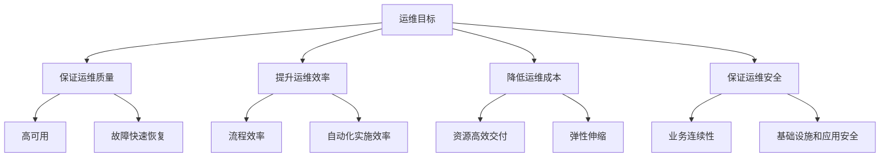
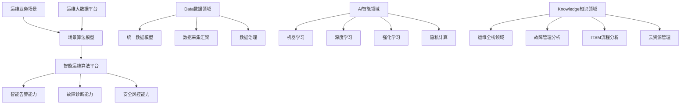
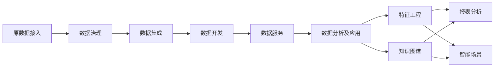
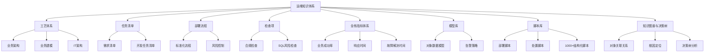
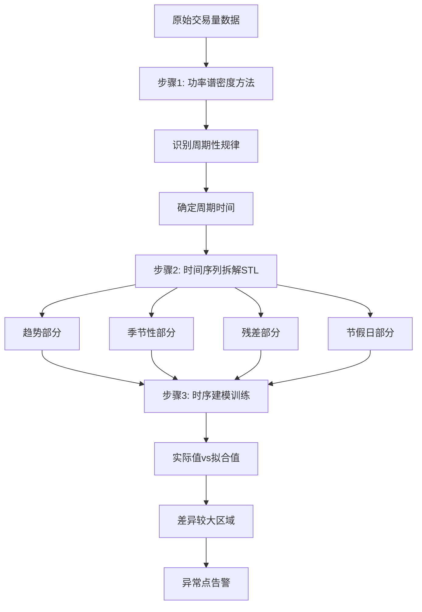
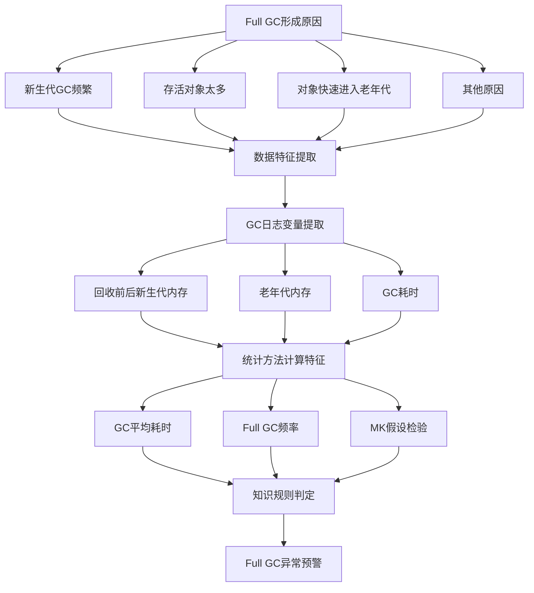
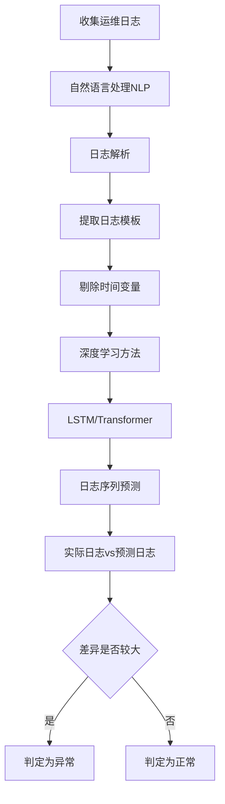
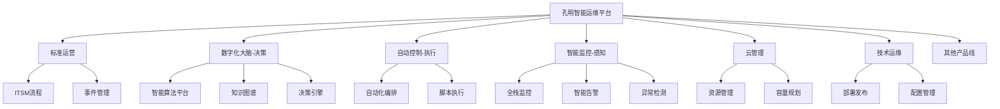
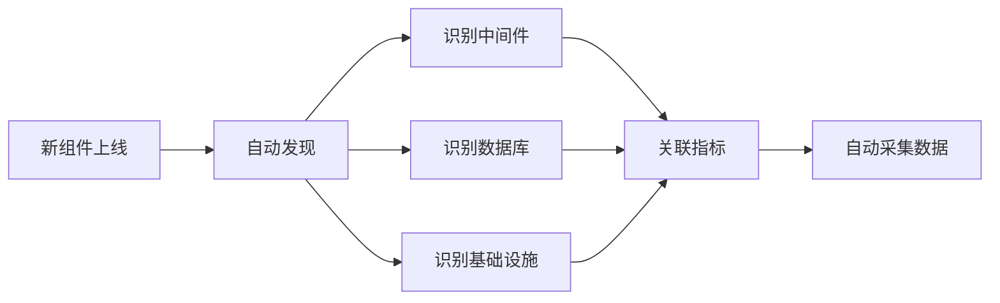
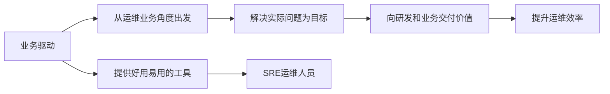

# 金融运维数字化转型中的智能运维DAKOps

> 来源：未核验 · 类型：分享 · 状态：draft

## 分享嘉宾
**金勇** - 建信金科智能云事业部，负责运维业务智能化建设工作

## 公司背景
建信金科是中国建设银行的金融科技子公司，主要职责包括:
- 践行建设银行金融科技发展战略
- 集团IT系统建设和维护
- 对外金融科技能力输出

智能云事业部负责:
- IT运营维护
- 智能运维工具建设
- 对外运维工具产品输出

---

## 一、金融行业运维数字化转型背景与挑战

### 1.1 转型背景

金融行业运维数字化转型主要面临三大背景因素:

#### (1) 新技术层出不穷
- 云计算、人工智能、云原生、物联网等技术快速发展
- 金融行业相比互联网公司处于艰难跟随状态
- 传统行业面临技术革新压力

#### (2) 监管与自主可控要求
- 国家对金融行业监管严格
- 必须保证业务连续性和数据安全
- 美国为首的西方国家加大对我国高新技术制裁
- 信创自主可控成为迫在眉睫的需求

#### (3) 业务快速发展需求
- 金融业务日交易量与日俱增
- 需要处理大规模业务数量和海量业务数据
- 更复杂的业务体系关系
- IT架构需要持续迭代
- 快速业务创新需要敏捷投产上线

### 1.2 面临的挑战

金融行业IT系统特点:
- 庞大的交易量
- 大量的业务系统
- 数以万计的服务器设备
- 系统之间关系错综复杂
- 故障影响面大

**核心要求**: 必须保障系统高可用性以及快速自动响应能力，传统人工运维方式已无法满足新型业务形态需求。

### 1.3 三大挑战详解

数字化运维贯穿研发测试、实施部署、运行到业务反馈的全流程，主要存在三大挑战:

#### 挑战一: 环境多
- 业务和设备数量多
- 纷繁复杂的IT产品
- 各种各样的新技术

#### 挑战二: 数据多
- 大量监控对象(WebLogic、中间件、数据库等)
- 基础设施监控
- 关联领域(资产管理、流程工单、事件管理等)
- 数据分布在各种不同运维工具中
- 存在严重的**数据孤岛**问题

#### 挑战三: 要求高
- 严格的监管合规要求
- 快速恢复的时效性要求
- 极低的容错率(如银行交易绝对不能出错)

### 1.4 运维四大目标

---

## 二、DAKOps运维理念与建设思路

### 2.1 DAKOps理念提出

基于金融行业特性的深刻洞察和对运维业务的深刻认识，在业内倡导的AIOps基础之上，建信金科提出了**DAKOps**运维理念。

#### DAKOps定义
- **D (Data)**: 数据
- **A (AI)**: 智能
- **K (Knowledge)**: 知识(业务知识)

**核心思想**: 智能运维建立在"数据+智能+知识"体系之上

### 2.2 DAKOps架构体系

**成果**: 自主研发了一整套全栈式的**孔明智能运维产品**

**市场影响**: 2021年在上海峰会沙龙分享DAKOps理念，引起较大反响，被十多家媒体转载

### 2.3 建设思路一: Data数据能力建设

基于前沿大数据技术，实现运维数据全栈实时采集。

#### 技术架构
- **基础技术栈**: Hadoop + Flink + ES生态体系
- **数据来源**: 应用监控、基础监控、网络监控等多个监控工具
- **数据流程**: 自底而上

#### 核心能力
- 运维数据全栈实时采集
- 汇聚到运维大数据平台
- 通过特征工程或知识图谱支撑业务需求

### 2.4 建设思路二: AI算法能力建设

基于海量多元化运维数据和建行多年运维知识经验，智能平台拥有丰富的算法库。

#### 算法体系
- 统计方法
- 机器学习
- 深度学习
- 图计算

#### 应用场景
- 趋势预测分析
- 异常告警分析
- 故障根因定位
- 智能处置

#### 生产环境效果
- **告警降噪**: 每天针对类似告警的聚合比率达到 **97.5%**
- **自动化处置**: 对已知故障场景的自动化处置率超过 **65%**

### 2.5 建设思路三: Knowledge业务运维知识体系

基于建行30多年业务经验积累，运维知识体系覆盖全链路。

#### 知识体系八大方面

#### 详细说明

**1. 工艺体系**
- IT系统(尤其是新一代核心业务系统)的完整标准体系和方法
- 业务架构、业务建模、IT架构等

**2. 任务清单**
- 研发过程中的需求清单和开发任务清单
- 结构化、标准化管理

**3. 部署流程**
- 所有版本上线遵循完整规范的制作流程
- 将风险降到最低

**4. 检查项**
- 针对部署流程每个环节的配置检查项
- 合规检查、SQL风险检查等
- 固化产品流程、工艺和配置

**5. 全栈指标体系**
- 衡量各项运维能力
- 业务成功率、响应时间、故障解决时间等

**6. 模型库**
- 每个对象对应的数据模型
- 对象关联属性和告警策略
- 如: WebLogic、Oracle数据库、Linux等关联CPU告警阈值或策略

**7. 脚本库**
- 生产上线部署、处置、事件处置脚本策略
- 目前拥有 **1000+条** 结构化部署和处置脚本策略

**8. 知识图谱与决策树**
- 基于架构师、调用链路积累
- 描述对象和服务之间关联关系
- 用于根因定位
- 基于拓扑关系的决策树分析路径

---

## 三、智能运维实践案例

### 3.1 案例一: 固定阈值漏报检测

#### 问题背景
传统固定阈值方法无法发现某些异常，需要算法检测来弥补不足。

#### 典型场景: 交易量监测
- 每个工作日交易量规律类似，都有较大交易量
- 工作日某时间点交易量突然下降，可能是服务异常
- 基于固定阈值无法发现此类问题
- 属于**周期性交易类指标异常检测**问题

#### 解决方案三步骤

**步骤1**: 利用功率谱密度方法识别周期性规律，确定周期时间(如一周或一个月)

**步骤2**: 利用时间序列拆解方法(STL)，将序列拆解为:
- 趋势部分
- 季节性部分
- 残差部分
- 节假日部分(可选)

**步骤3**: 利用时序建模方法，对数据进行训练建模
- 分别对趋势、季节、其他部分进行建模
- 实际值与拟合值差异较大的区域被认定为异常点
- 进行告警

#### 实施效果
成功识别工作日交易量突然下降的异常点，实现固定阈值无法发现的异常检测。

### 3.2 案例二: Full GC异常预警

#### 问题背景
内存回收过程中出现内存泄漏，可能发生Full GC，需要提前预警。

#### 目标
在业务告警发生之前，识别开始频繁GC的拐点，达到预警目的。

#### 解决方案: 领域知识+算法学习

#### 实现步骤

**步骤1**: 针对GC日志提取相应变量
- 回收前后的新生代内存
- 老年代内存
- GC耗时等

**步骤2**: 利用统计方法计算特征
- GC平均耗时
- Full GC频率
- MK假设检验方法等

**步骤3**: 根据知识规则判定Full GC
- **规则1**: Full GC频率很高 + GC耗时很长 → Full GC异常
- **规则4**: 新生代回收内存越来越少 + GC耗时较高 → Full GC异常

#### 实施效果
- 在业务故障出现之前 **10-20小时** 内给出告警
- 运维人员有充足时间提前做好准备

### 3.3 案例三: 日志异常检测

#### 问题背景
针对运行日志进行自动学习，预先发现日志可能的异常。

#### 核心思路
- 正常情况下，预测的日志符合正常规律
- 实际日志与预测日志差异较大，则可能是异常
- 对已标注的异常日志进行训练，可提前学习异常模式

#### 解决方案

#### 实现步骤

**步骤1**: 利用自然语言处理(NLP)方法对日志进行解析
- 提取日志模板
- 剔除时间变量等(避免影响模型训练效果)

**步骤2**: 利用深度学习方法(如LSTM、Transformer)
- 训练日志序列模型
- 预测日志模式

**步骤3**: 异常判定
- 实际日志与预测日志差异数量较大 → 判定为异常
- 与实际故障情况相符合

---

## 四、孔明智能运维产品体系

### 4.1 产品定位

孔明智能运维产品是融合建行运维实践经验和技术探索的一体化智能运维解决方案。

#### 核心优势
- **全栈式解决方案**: 不同于市面上只满足局部智能运维的产品
- **全方位覆盖**: 覆盖运维全场景
- **平台化+场景化+服务化**: 构建模式
- **积木式结构**: 可整体交付，也可模块化灵活组装

### 4.2 产品架构

#### 产品体系
- **八大产品线**
- **20+运维组件**
- 满足日常运维工作全栈式需要

#### 核心能力闭环
感知 → 执行 → 决策 → 管理 → 资源

### 4.3 产品整体架构

基于运维实战场景构建的丰富运维应用模块，通过运行框架进行模块化拼装，实现产品快速实施交付。

#### 核心特性
- 自发现能力
- 知识能力
- 数字化能力
- 全栈运维能力
- 敏捷高效

### 4.4 产品能力优势

#### 优势一: 自适应的自发现能力

**运维对象自发现**
- 组件上线后自动发现内部中间件、数据库、基础设施
- 自动找到相应指标
- 自动采集对应数据

**实现效果**
- 全链路IT数据实时感知
- 全栈数据集中治理

#### 优势二: 数字化的运维服务能力

**核心特点**
- 各产品模块数据共享
- 场景打通
- 汇聚众智
- 践行运维数字化转型目标

**提供能力**
- 面向技术运营的运维风控
- 异常检测
- 智能处置等成熟化数字化能力

#### 优势三: 共享的专家知识能力

**知识来源**
- 基于建行两地三中心多年数据中心专家经验积累
- 完善的规范制度和流程

**内置资源**
- 丰富的各领域运维脚本编排
- 云服务套餐
- 标准化运维流程

#### 优势四: 面向场景的全栈式能力

**实践积累**
- 面向运维实战场景的丰富数字化实践
- 支撑各类运维工作

**集成能力**
- 丰富的Open API接口
- 支持快速集成

---

## 五、实践总结与思考

### 5.1 核心总结

智能运维实践的两大核心:

#### 核心一: 以业务驱动

**关键点**
- 从运维业务角度出发
- 以解决实际问题为目标
- 向研发和业务交付价值
- 提升运维场景的运维效率
- 给SRE运维人员提供好用易用的运维工具体系

#### 核心二: 践行DAKOps理念

**D (Data) - 数据**
- 数据要完备
- 数据要及时

**K (Knowledge) - 知识**
- 知识要积累
- 知识要迭代
- 在运维过程中注意积累结构化知识
- 形成知识迭代更新机制

**A (AI) - 智能**
- 建立智能化思维
- 具备数据分析思维能力
- 掌握AI理念和机器学习算法

### 5.2 实践要点

#### 1. 业务反馈机制
- 促成业务反馈机制的形成
- 通过业务反馈提炼更多知识
- 优化算法精度

#### 2. 知识体系建设
- 结构化知识积累
- 分类分层管理
- 通用知识可作为SaaS服务对外提供
- 保密级别高的知识作为内部积累

#### 3. 算法模型管理
- 自动化更新迭代机制
- 定期(如一周)自适应迭代
- 根据系统变更、资源变化反馈到模型
- 形成闭环机制

### 5.3 未来演进方向

#### 技术视角
- **云原生智能化**: 将云原生与智能化结合
- **智能运维算法平台**: 构建云原生的智能运维算法平台

#### 业务视角

**1. 业务知识结构化**
- 更加结构化的知识管理
- 分类分层的知识体系
- 通用知识SaaS化服务
- 内部知识保密管理

**2. 业务领域扩展**
- 资源交付
- 运行管理
- 容量管理
- 应急管理
- 安全风控
- 形成整体能力和场景平台

---

## 六、Q&A精选

### Q1: 如何选择机器学习算法解决故障定位?

**A**: 故障根因定位是AIOps领域的难点，需要综合考虑:

1. **数据质量要求高**
   - 调用链是否清晰
   - CMDB是否完备

2. **场景相关性强**
   - 网络故障: 与拓扑关系相关，需要图算法
   - 数据库故障: 不同的分析方法
   - 批处理任务异常: 偏向时间序列和多维因素分析

3. **小场景积累**
   - 从小场景逐步积累
   - 最终形成智能算法平台

### Q2: 如何构建异常检测的数据集?

**A**: 异常样本极少是实际问题，解决方案:

1. **无监督方法**
   - 初期采用无监督算法(如孤立森林)
   - 人工评估异常检测效果
   - 逐步积累异常数据

2. **混沌工程**
   - 通过混沌工程积累更多异常样本
   - 用于算法训练

3. **运维过程积累**
   - 在实际运维过程中积累异常数据
   - 不专门标注异常数据(成本太高)

### Q3: 自适应自发现能力的准确性如何?

**A**: 分两个层面:

1. **对象级自发现**
   - 基于CMDB层的对象自发现
   - 准确率达到95%-99%
   - 自动发现组件、中间件、数据库、基础设施

2. **细粒度数据**
   - 更细粒度的数据需要后续采集
   - 需要持续建设

3. **算法自适应**
   - 定期自动迭代(如一周一次)
   - 根据系统变更、资源变化反馈到模型
   - 形成闭环机制

### Q4: 阈值设置与场景的关系?

**A**: 不同场景需要不同的阈值策略:

- **简单阈值**: 固定值检测(如>80)
- **动态阈值**: 根据历史数据动态调整
  - 前期数据在50左右波动 → 70-80为异常
  - 后期数据在80左右波动 → 90以上为异常
- **复杂场景**: 需要更复杂的算法，而非简单规则

### Q5: 容量管理在AI上的应用?

**A**: 
- 根据需求进行动态容量规划
- 自动生成容量方案
- 达到什么需求需要配置什么资源
- 目前已有实际应用

### Q6: 日志异常检测后如何自动化处理?

**A**: 分两步处理:

1. **预警阶段**
   - 提前7-20小时告知运维人员可能异常
   - 不进行自动化处理(涉及安全风险)
   - 运维人员重点关注和分析

2. **处置阶段**
   - 人工分析确认后再处置
   - 避免自动处理带来的风险

---

## 七、关键数据指标

| 指标项 | 数值 | 说明 |
|--------|------|------|
| 告警聚合比率 | 97.5% | 每天针对类似告警的聚合降噪效果 |
| 自动化处置率 | 65%+ | 已知故障场景的自动化处置率 |
| 结构化脚本数量 | 1000+ | 部署和处置脚本策略数量 |
| 对象自发现准确率 | 95%-99% | CMDB层对象自发现准确性 |
| Full GC预警时间 | 10-20小时 | 业务故障前的预警时间窗口 |
| 产品线数量 | 8条 | 孔明智能运维产品线 |
| 运维组件数量 | 20+ | 覆盖的运维组件模块 |
| 建行运维经验 | 30+年 | 业务运维知识积累年限 |

---

## 八、核心价值与启示

### 8.1 对金融行业的价值
1. 提供了适合金融行业特点的智能运维解决方案
2. 满足监管合规和信创自主可控要求
3. 实现运维数字化转型目标
4. 提升运维质量、效率，降低成本，保障安全

### 8.2 对运维行业的启示
1. **理念创新**: DAKOps = Data + AI + Knowledge
2. **知识重要性**: 领域知识与算法结合是关键
3. **业务驱动**: 以解决实际问题为目标
4. **循序渐进**: 从小场景积累到全栈平台
5. **闭环机制**: 建立业务反馈和知识迭代机制

### 8.3 可借鉴的实践经验
1. 重视数据质量和知识积累
2. 不盲目追求算法复杂度，注重实际效果
3. 建立结构化的知识管理体系
4. 形成自适应的迭代更新机制
5. 提供好用易用的工具体系

---

## 总结

建信金科提出的DAKOps理念，为金融行业乃至整个运维行业的数字化转型提供了宝贵的实践经验。通过"数据+智能+知识"的三位一体建设思路，结合业务驱动和技术创新，构建了完整的智能运维产品体系。

**核心要点**:
- ✅ DAKOps理念: Data + AI + Knowledge
- ✅ 三大建设思路: 数据能力、AI算法、知识体系
- ✅ 实践案例: 固定阈值漏报、Full GC预警、日志异常检测
- ✅ 产品体系: 孔明智能运维八大产品线
- ✅ 关键成果: 97.5%告警降噪、65%+自动化处置率

**未来方向**: 云原生智能化、业务领域扩展、知识体系深化

---

*分享时间: 2021年后*  
*整理时间: 2025年11月*  
*文档版本: v1.0*

