# 虎牙直播AIOps探索与实践

> 来源：未核验 · 类型：分享 · 状态：draft


## 一、背景介绍

虎牙公司是国内知名的直播平台,在直播游戏化技术方面积累了丰富的经验。本次分享主要围绕AIOps在虎牙的落地实践,重点介绍如何在质量、效率和成本三个维度上,通过机器学习和深度学习算法保障线上服务的稳定性。

### 业务挑战

- **业务指标复杂多样**:流量型、成功率型、抖动型、周期性等多种业务指标
- **赛事流量冲击**:英雄联盟全球总决赛等大型赛事带来巨大流量(相当于游戏直播界的双十一)
- **降本增效需求**:在保障稳定性的同时需要优化资源使用成本

## 二、AIOps应用场景概览

虎牙AIOps应用主要聚焦三个方向:

1. **质量保障**:异常检测监控大部分业务场景
2. **效率提升**:直播卡顿的多维下钻分析
3. **成本优化**:AI-HPA智能弹性落地

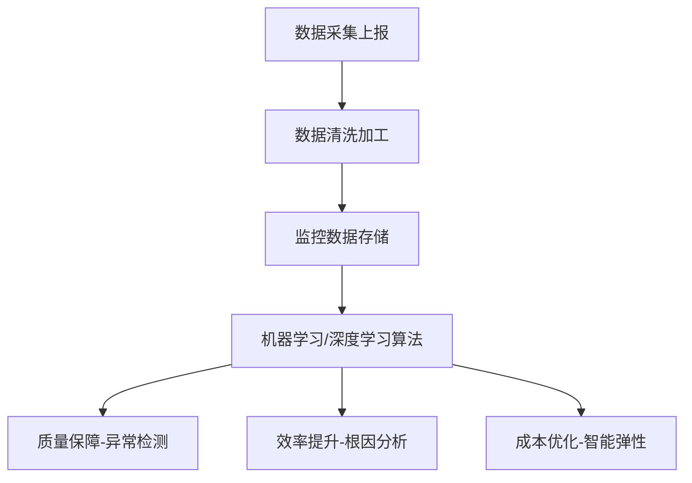

## 三、异常检测:监控业务场景

### 3.1 传统阈值监控的痛点

- **人工管理成本高**:需要为每个业务指标配置合适的阈值
- **维护困难**:版本变更后需要人工调整阈值
- **告警质量差**:阈值设置不合理导致误告和漏告
- **检测能力弱**:无法应对复杂多变的业务场景

### 3.2 异常检测架构演进

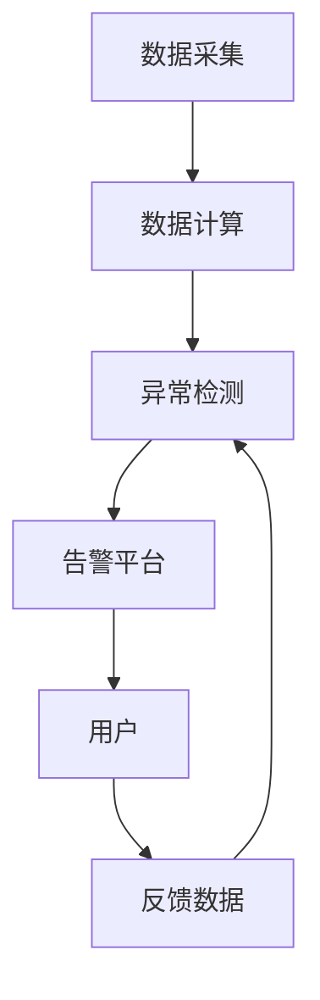

#### 第一阶段:基于预测的异常检测(无监督)

**核心思想**:根据曲线历史信息,预测未来一段时间的安全范围

**技术方案**:

- 使用Facebook的Prophet时间序列模型进行预测
- 为每条曲线计算上界和下界作为安全范围
- 实时检测真实值是否超出安全范围
- 每6小时更新一次安全范围

**实现流程**:

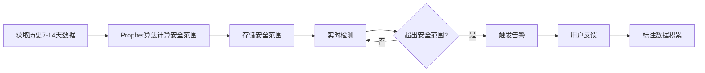

**特点**:

- ✅ 优点:不需要标注数据,快速上线
- ❌ 缺点:每条曲线需要独立模型,资源消耗大,准确率不够高

#### 第二阶段:有监督异常检测

**核心思想**:使用分类器给出异常点的概率

**技术方案**:

- 利用第一阶段积累的标注数据训练有监督模型
- 一个模型适用于所有类型的业务曲线
- 使用LightGBM模型进行二分类

**样本构造**:

- 获取当前时间点前N个小时的数据
- 获取同比N天的历史数据
- 组合成一个训练样本

**特征工程**:

1. **时间特征**:小时、星期、日期等
2. **统计特征**:分位数、四分位距
3. **形态特征**:波峰波谷数量等

**模型训练要点**:

- 选择LightGBM:速度快、准确率高
- ⚠️ 重要:训练集和验证集不能随机划分,验证集样本时间必须在训练集之后(避免数据泄露)

**线上效果**:

- 查准率:**97%**
- 查全率:**95%**
- 平均故障修复时长缩短:**90%**

#### 第三阶段:前置算法过滤

根据用户特定需求,增加前置算法:

- 突增检测
- 突降检测
- 均值漂移检测

最终实现:**不漏告、不误告**,发现原来无法发现的故障。

### 3.3 用户反馈监控

**场景**:某些故障无法在业务指标上体现(如直播回放没有声音)

**解决方案**:监控用户反馈内容

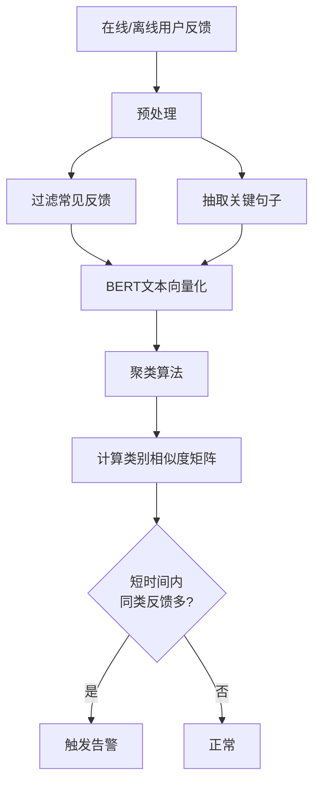

**技术栈**:

- 使用BERT将文本转换为向量
- 使用聚类算法对向量进行分类
- 计算类别内相似度,识别集中反馈

**效果**:

- 查准率:**95%**
- 查全率:接近**100%**

## 四、直播卡顿多维下钻分析

### 4.1 业务背景

**卡顿影响**:

- 主播关注人数下降
- 用户流失(包括VIP和大额充值用户)
- 需要较长时间恢复

**目标**:

1. 快速发现卡顿问题并恢复,减少主播用户流失
2. 统计一段时间内卡顿的头部根因,针对性解决共性问题

### 4.2 卡顿处理策略

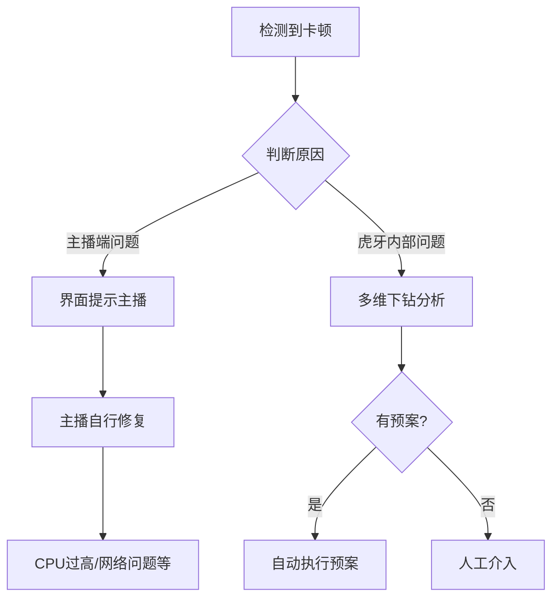

### 4.3 数据特征

卡顿率由多维度数据聚合而成:

- 线路维度
- 码率维度(如1200)
- P2P维度
- 其他多个维度的组合

**挑战**:需要在海量维度组合中定位根因

### 4.4 WARM算法(加权关联规则挖掘)

**联合研发**:虎牙 + 南开大学

**算法架构**:

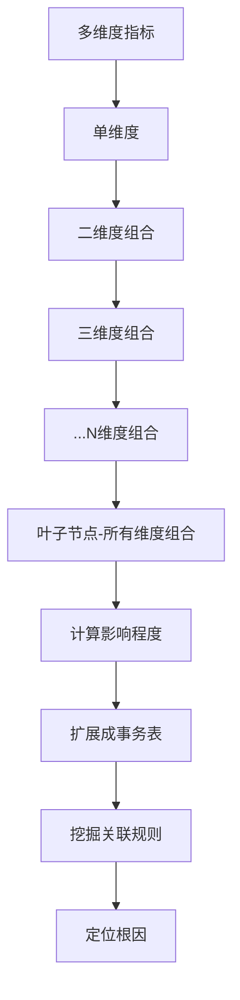

**算法流程**:

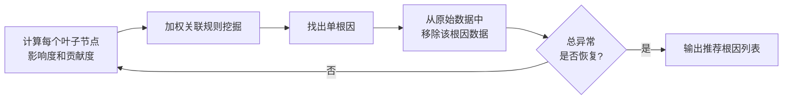

**核心指标**:

- **影响度**:评价维度组合与异常的相关性
- **贡献度**:评价维度组合对异常的贡献程度

**算法特点**:

- 支持多根因定位
- 迭代移除已识别根因,直到异常恢复
- 按原始数据分布排序输出

### 4.5 效果与应用

**准确率**:Top根因准确率达**95%以上**,超过微软Adtributor、HotSpot等算法

**论文发表**:TSC(IEEE Transactions on Services Computing)

**开源地址**:GitHub可下载代码

**产品集成**:

- 植入虎牙PC开播端
- 植入移动开播端
- 主播一键点击卡顿反馈按钮
- 自动分析根因并执行预案

**效率提升**:**80%**(相比人工反馈流程)

## 五、AI-HPA智能弹性落地

### 5.1 业务背景

**成本优化需求**:

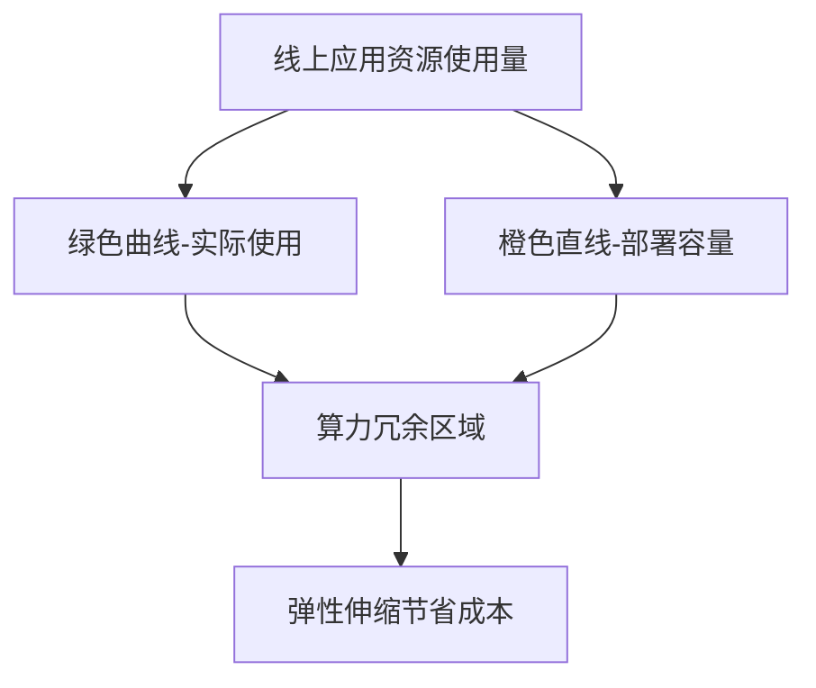

**赛事流量挑战**:

- 赛事带来巨大流量冲击(如S11全球总决赛EDG夺冠)
- CPU使用率突增
- 容量不足导致成功率下降

### 5.2 标准HPA的局限性

**标准HPA工作原理**:

- 基于指标阈值进行伸缩(如CPU > 45%扩容,< 40%缩容)

**存在问题**:

1. **时延问题**:
   - 监控数据采集延迟
   - 数据上报延迟
   - 扩容执行延迟
2. **应对不及时**:负载峰值尖锐时,无法及时扩容
3. **成功率下降**:短时间内应用负载过高,响应时间变慢

**传统解决方案的不足**:

- 部署较高的最小副本数 → 算力浪费
- 定时伸缩 → 人工配置成本高,无法覆盖所有应用

### 5.3 预测弹性伸缩(AI-HPA)

#### 总体架构

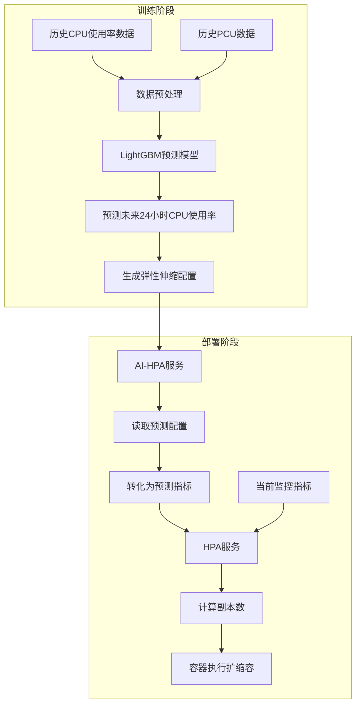

#### HPA计算公式

**标准HPA公式**:

```
副本数 = 当前副本数 × (当前指标值 / 目标指标值)
```

**AI-HPA公式**:

```
副本数 = 当前副本数 × (max(当前指标值, 预测指标值) / 目标指标值)
```

**关键改进**:取当前值和预测值的最大值,实现相互兜底

#### 预测模型实现

**数据预处理**:

- 获取过去14天的CPU使用率和PCU数据
- 采用30分钟滑动窗口最大值
- 目的:使一定时间内的偏差抖动也能被预测

**模型选择**:LightGBM回归模型

**特征工程**:

1. **时间特征**:当前分钟、星期、月份中的天数
2. **业务特征**:PCU(峰值在线人数)数据

**样本构造**:

- X(特征):时间特征 + PCU特征
- y(目标):CPU使用率真实值

**配置生成**:

- 预测未来24小时CPU使用率
- 生成20分钟一段的弹性伸缩配置
- 本质上是智能化的定时伸缩

**性能指标**:

- 单个应用训练+预测时间:< **15秒**
- 典型服务预测准确率:> **90%**

#### 预测效果示例

**场景1:周期性突增**

- 应用每天零点固定CPU使用率突增
- 预测模型提前识别突增模式
- 提前扩容,避免成功率下降

**场景2:频繁抖动**

- CPU使用率频繁抖动
- 预测起到平滑作用
- 避免副本数频繁变化

### 5.4 AI-HPA收益

#### 1. 节省成本

- 整体算力成本节省:**18%**
- 可持续优化:推荐最小副本数、扩缩容阈值、容器规格等

#### 2. 减少副本数震荡

- 避免频繁扩缩容
- 副本数变化更平滑
- 减少对业务指标的影响

#### 3. 提前扩容

- 应对周期性流量突增
- 在突增前完成扩容
- 保障服务质量

#### 4. 监控容错

- 监控数据故障时,预测值兜底
- 避免监控异常导致的误缩容
- 相互保护机制

### 5.5 容量模型:应对赛事流量

#### 核心问题

1. **应用在赛事模式下有什么表现?**
2. **应用在特定PCU下需要多少资源?**

#### 应用分类

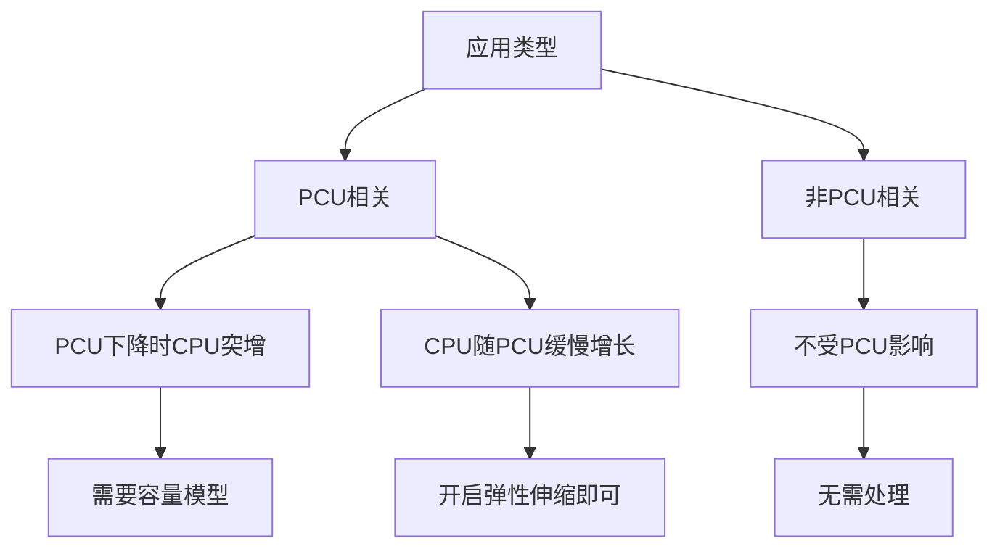

**重点处理**:PCU下降时CPU突增的应用

#### 容量模型定义

**本质**:PCU与应用使用核数之间的关系

**线性回归模型**:

```
核数 = k × PCU + b
```

**可解释性**:每增加1万PCU需要多少核

#### 数据选择策略

**问题**:应用发版会导致趋势变化,不能直接使用全量历史数据

**解决方案**:

- 仅使用上一次赛事的高PCU数据
- 赛事模式下的表现更准确
- 避免日常模式数据的干扰

#### 训练流程

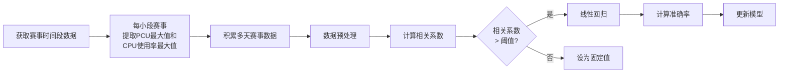

**更新频率**:每周一次

**准确率**:**90%左右**,资源使用越多的应用准确率越高

#### 容量模型 + AI-HPA架构

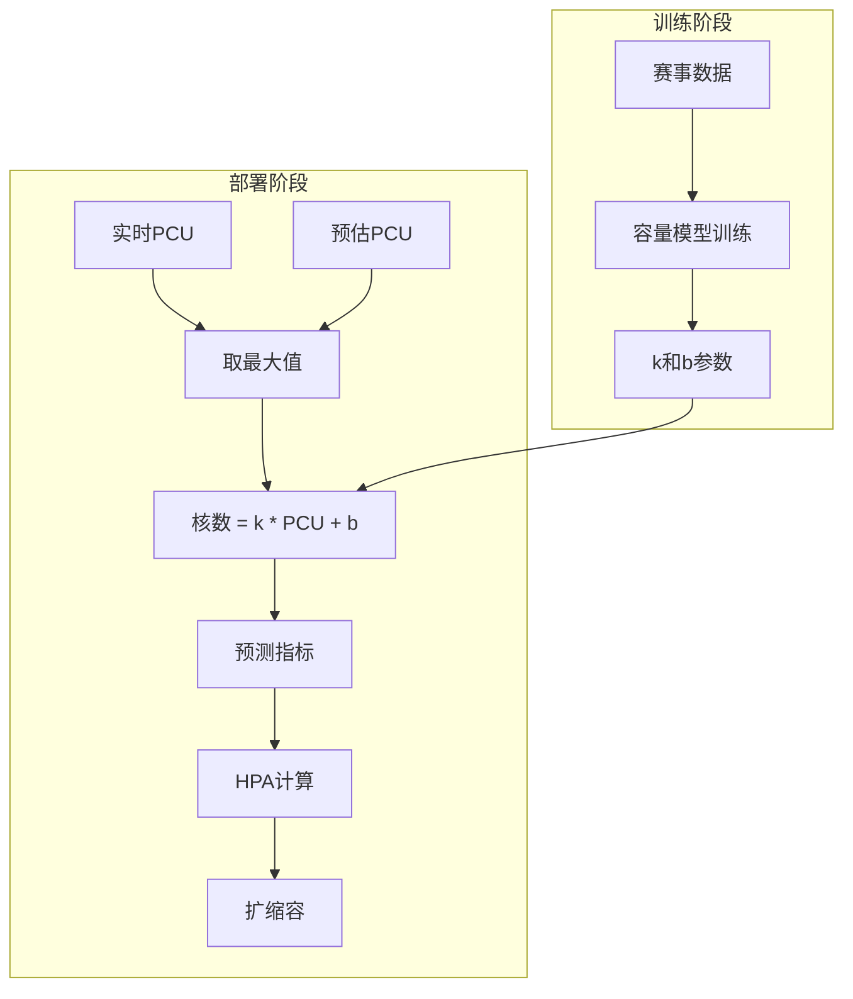

**关键机制**:

- 取实时PCU和预估PCU的最大值
- 大赛事:使用预估PCU提前扩容
- 日常小赛事:使用实时PCU动态保障

#### 额外价值

1. **资源规划**:

   - 估算特定PCU下的资源需求
   - 提前与供应商协调资源准备
2. **演练能力**:

   - 赛前配置预估PCU进行扩容演练
   - 验证容量是否充足
   - 发现潜在问题

#### 效果展示

**赛事期间表现**:

- 流量冲击前提前扩容
- 扩容到足够容量
- 防止成功率下降
- 保障业务稳定

**应用时间**:

- S11(2021年英雄联盟全球总决赛)已上线
- EDG夺冠期间成功保障系统稳定
- 流量巨大但系统容量充足

## 六、总结与展望

### 核心成果

| 模块         | 关键指标                | 业务价值             |
| ------------ | ----------------------- | -------------------- |
| 异常检测     | 查准率97%、查全率95%    | 故障修复时长缩短90%  |
| 用户反馈监控 | 查准率95%、查全率近100% | 第一时间发现前端问题 |
| 多维下钻分析 | Top根因准确率95%+       | 效率提升80%          |
| AI-HPA       | 预测准确率90%+          | 成本节省18%          |
| 容量模型     | 准确率90%               | 保障赛事稳定性       |

### 技术亮点

1. **异常检测演进路径**:无监督 → 有监督 → 前置过滤,逐步提升准确率
2. **WARM算法**:自研多维根因定位算法,论文发表于TSC,代码开源
3. **AI-HPA**:预测 + 弹性伸缩,兼顾成本和稳定性
4. **容量模型**:精确应对赛事流量,支持演练能力

### 实践经验

1. **数据积累**:从无监督开始,逐步积累标注数据
2. **模型选择**:LightGBM在速度和准确率上表现优异
3. **特征工程**:时间特征、统计特征、形态特征的组合
4. **训练技巧**:时序数据不能随机划分训练集和验证集
5. **产品化**:算法模型植入业务端,形成闭环

### 未来方向

1. **成本优化深化**:

   - 推荐最小副本数
   - 推荐扩缩容阈值
   - 推荐容器规格套餐
2. **根因分析增强**:

   - 结合调用链信息
   - 物理层面信息挖掘
   - 自动化故障自愈
3. **覆盖面扩大**:

   - 更多业务场景接入
   - 更多应用类型支持

---

## 附录

### 开源资源

**WARM算法**:

- 论文:发表于IEEE Transactions on Services Computing (TSC)
- 代码:已在GitHub开源
- 应用:可在自有数据集上运行测试

### Q&A精选

**Q: AI-HPA技术在哪些直播活动中应用过?**
A: 已在S11(2021年英雄联盟全球总决赛)中应用,当时EDG夺冠带来巨大流量,系统容量充足,未出现问题。

**Q: AIOps监控在公司的业务覆盖率有多高?**
A: 有监督异常检测模型已覆盖所有线上业务的黄金指标和大量业务指标,研发和SRE可自行配置需要监控的指标。

**Q: 通过异常检测发现故障后,如何实现故障自愈?**
A: 需要根因定位技术配合,包括:

- 多维下钻分析(已开源)
- 调用链信息分析
- 应用过载检测
- 机器和网络层面检查
- 自动执行预案

**Q: 恢复直播一般需要多长时间?**
A: 根据情况不同:

- 有预案可执行:30秒左右(如切流)
- 代码bug:需要较长时间修复

**Q: WARM算法相较于其他算法的优势?**
A:

- 速度快:大数据量下快速定位
- 准确率高:超过微软Adtributor、HotSpot等业界算法
