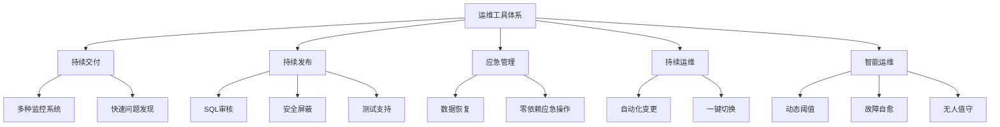
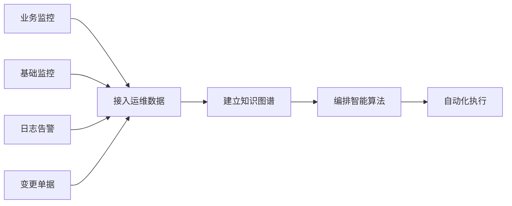
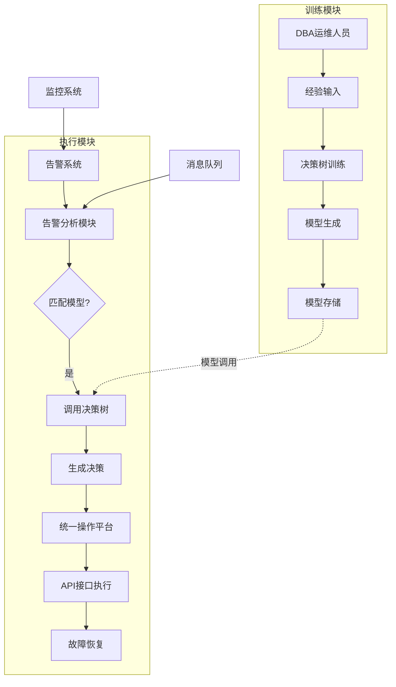
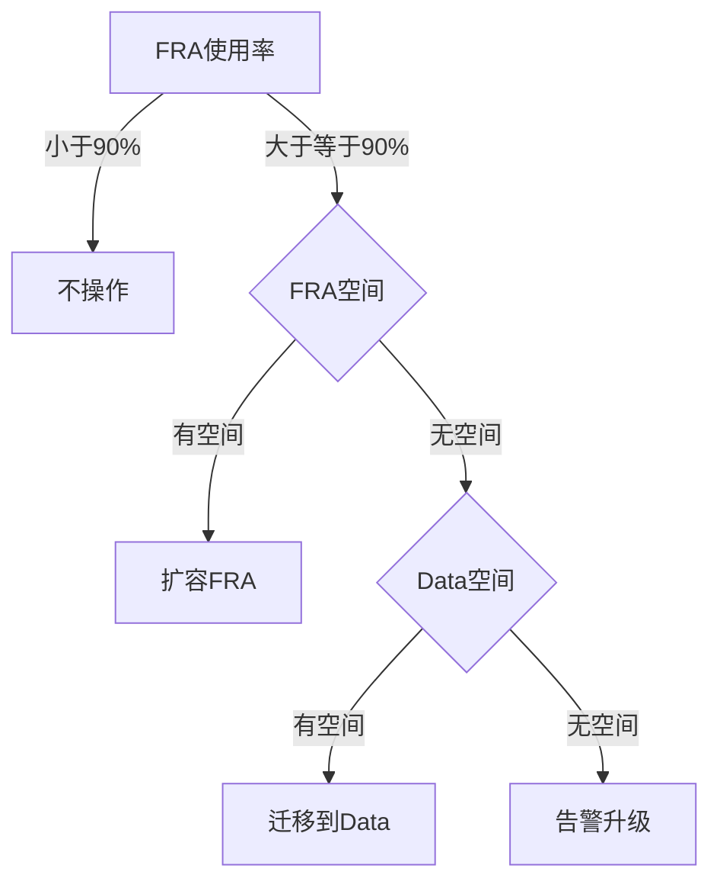
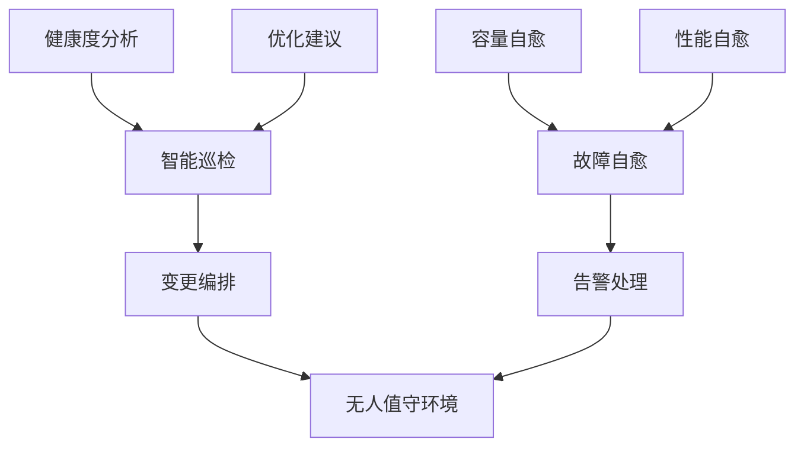

# 智能化运维——故障自愈

> 来源：未核验 · 类型：分享 · 状态：draft

## 分享概述

本次分享主题聚焦于智能化运维在故障自愈场景下的探索与实践。通过2-3年的实践经验,介绍了如何利用智能化技术实现数据库故障的自动感知、分析和恢复,帮助传统运维团队实现智能化转型。

## 一、运维开发的初心与使命

### 1.1 为什么要做运维开发

运维工作面临的核心挑战:

- **内部需求压力大**: 大量环境交付、系统升级、故障处理
- **外部服务需求多**: SQL审核、发版支持等开发团队服务
- **人力资源有限**: 系统数量指数级增长,但人员无法同步扩张
- **故障处理压力**: 节点数增加导致故障概率上升

### 1.2 运维开发的三个出发点

#### 1.2.1 内部保障

- **快速交付**: 提升变更和交付效率
- **质量保证**: 确保交付内容符合标准且安全
- **故障处理**: 缩短故障处理时间
- **高效稳定**: 结合架构改造和高可用方案保障系统稳定

**实施策略**:

- 梳理变更TOP场景(如授权、扩容等)
- 优先实现高频变更的工具化
- 基于工单驱动持续完善工具链

#### 1.2.2 服务优化

**服务对象**:

- 开发团队: SQL审核等需求
- DBA团队: 运维变更工具和平台

**核心理念**:

- 用科技思维解决痛点
- 避免文档和线下交互方式
- 使用系统化方法进行配置校验
- 通过快速迭代提升工具易用性

#### 1.2.3 创新探索

三大创新目标:

**1. 不想背锅 - 故障预感知**

- 更详细的监控体系
- 更快的故障感知能力
- 在故障萌芽阶段消灭问题

**2. 不想值班 - 无人值守**

- 实现7×24无人值守
- 自动化处理变更和故障
- 减少人工干预需求

**3. 不想运维 - 自治自愈**

- 系统自动运行
- 故障自动切换/重启
- 无需人工冲到一线处理紧急问题

### 1.3 已实现的工具体系

## 二、智能运维的理解与实现路径

### 2.1 AIOps定义

**核心要素**:

- 通过机器学习和智能算法
- 从运维数据中自动总结规则
- 做出智能决策
- 以大数据和机器学习为基础
- 增强传统运维能力

**重要依赖**:

- CMDB配置数据
- 各类监控数据
- 带标签的运维数据

### 2.2 智能运维的应用场景

| 应用领域           | 具体场景           |
| ------------------ | ------------------ |
| **质量保障** | 变更分析、故障自愈 |
| **效率提升** | 交易预测、容量预测 |
| **成本优化** | 容量优化           |
| **安全防护** | 入侵检测、行为分析 |

### 2.3 业界实践案例

主要应用方向:

- **智能故障平台**: 趋势分析、快速故障恢复
- **智能流量调度**: 机房故障时自动流量切换
- **告警分析**: 网络拓扑根因分析、告警分类定位
- **告警收敛**: 运维大数据分析

**为什么主要用于告警分析?**

1. **数据来源**: 告警是运维的核心大数据来源
2. **风险可控**: 智能运维处于探索阶段,分析结果即使错误也不影响生产
3. **辅助决策**: 作为辅助分析工具,而非直接操作生产

### 2.4 智能运维实现路径

**四个关键步骤**:

1. **接入运维数据**

   - 业务监控数据
   - 基础监控数据
   - 日志和告警信息
   - 变更流程数据
2. **建立知识图谱**

   - 经验知识沉淀
   - 拓扑关系梳理
3. **编排智能算法**

   - 机器学习模型
   - 监督学习/非监督学习
   - 常用模型: 贝叶斯、神经网络、决策树等
4. **自动化执行**

   - 调用预定义接口
   - 执行恢复操作

### 2.5 为什么选择决策树模型

**决策树的优势**:

- 结果直观明了,呈树状结构
- 易于理解和验证
- 适合金融等需要确定性结果的场景
- 避免概率性结果带来的不确定性

**决策树工作原理**:

- 通过特征选择算法构建树结构
- 包含根节点、叶节点
- 通过剪枝算法优化模型
- 新数据带入即可得到确定结果

**示例**: 贷款审批决策

- 判断收入水平
- 判断房产情况
- 得出贷款/不贷款的明确结论

## 三、故障自愈系统的设计与实践

### 3.1 系统架构设计

**核心模块**:

1. **训练模块** (知识图谱建造 + 智能算法编排)

   - DBA输入运维经验
   - 训练决策树模型
   - 生成并保存模型
   - 支持持续迭代更新
2. **执行模块** (告警处理)

   - 接收告警信息
   - 匹配合适模型
   - 调用决策树
   - 执行恢复操作

### 3.2 实战案例一: FRA区告警自愈

#### 问题场景

- FRA(Fast Recovery Area)归档区空间告警
- 传统处理: 人工登录平台 → 选择系统 → 执行扩容
- 处理时间: 数分钟到十几分钟

#### 决策树训练

**输入条件定义**:

- 使用率百分比
- FRA归档空间是否充足
- Data表空间是否充足

**策略定义**:

- 不做任何操作
- 扩容FRA
- 迁移到Data区

**训练数据示例**:

| 使用率 | FRA空间 | Data空间 | 策略       |
| ------ | ------- | -------- | ---------- |
| <90%   | 有/无   | 有/无    | 不操作     |
| ≥90%  | 有      | 有/无    | 扩容FRA    |
| ≥90%  | 无      | 有       | 迁移到Data |
| ≥90%  | 无      | 无       | 告警升级   |

#### 决策树生成

#### 实施效果

- **处理速度**: 秒级完成(vs 人工数分钟)
- **准确性**: 基于经验规则,结果确定
- **可维护性**: DBA可自主调整策略
- **可扩展性**: 无需修改代码,配置化管理

### 3.3 实战案例二: SQL执行计划自动固化

#### 问题场景

- SQL执行计划突然恶化
- 性能急剧下降
- 会话快速堆积
- 交易受影响

#### 决策条件

- 是否已固化执行计划
- 是否存在更优执行计划
- 性能恶化程度

#### 处理策略

- 绑定更优执行计划
- 固化当前计划
- 回滚到历史计划

#### 实施效果

- **发现速度**: 10秒内发现问题
- **处理速度**: 秒级完成恢复
- **持续监测**: 自动判断恢复情况
- **二次处理**: 未恢复则继续处理

### 3.4 系统特点与优势

#### 1. 直观明了

- 决策树结构清晰可视
- 结果确定性强(非概率性)
- 适合金融等严谨场景

#### 2. 自助调试

- DBA可自主训练模型
- 无需AI专家参与
- 基于实际运维经验
- 支持快速迭代

#### 3. 灵活配置

- 代码复用度高
- 无需重新编码
- 配置化管理
- 新场景快速适配

**vs 传统脚本方式**:

| 对比项   | 决策树方案            | 传统脚本            |
| -------- | --------------------- | ------------------- |
| 代码复用 | 高,一套代码适用多场景 | 低,每个场景独立开发 |
| 维护成本 | 低,配置化调整         | 高,需修改代码       |
| 扩展性   | 强,快速适配新场景     | 弱,需重新开发       |
| 学习成本 | 低,DBA可自主操作      | 高,需开发技能       |

#### 4. 安全可靠

- 明确策略,可预期结果
- 小步快跑,渐进式操作
- 防呆设计(如限制单次扩容量)
- 有效规避概率性风险

### 3.5 适用场景分类

#### 简单场景 - 直接自愈

**特点**: 有明确方案和成熟套路

**应用场景**:

- 容量类告警
  - FRA空间扩容
  - 表空间扩容
  - 卷空间释放
- SQL执行计划固化
- 文件清理

**处理方式**: 自动执行恢复操作

#### 复杂场景 - 智能推荐

**特点**: 原因多样,方案不唯一

**应用场景**:

- 性能问题(多种可能原因)
- 复杂故障分析

**处理方式**: 提供建议方案,人工决策

**当前覆盖率**: 容量类场景80%已实现自动化

## 四、智能巡检与无人值守

### 4.1 智能巡检系统

**技术方案**: 神经网络算法

**功能**:

- 计算系统健康度
- 分析系统状态
- 给出优化建议

**输出**:

- 参数调整建议
- 配置优化建议
- 预防性维护建议

### 4.2 无人值守方案

**实现路径**:

1. **智能巡检** → 发现问题 → 触发变更编排
2. **故障自愈** → 处理告警 → 自动恢复

**效果**:

- 减少值班需求
- 降低人工干预
- 提升响应速度
- 保障系统稳定

## 五、经验总结与最佳实践

### 5.1 核心理念

1. **用户反馈是改进动力**

   - 不要惧怕用户吐槽
   - 问题反馈帮助工具完善
   - 快速迭代提升用户体验
2. **适配性是必然挑战**

   - 任何工具落地都有适配问题
   - 保持信心,持续优化
   - 从吐槽到认可需要过程
3. **创新源于实际痛点**

   - 不为创新而创新
   - 解决运维实际困境
   - 减少背锅和值班压力

### 5.2 技术选型建议

#### 为什么选择决策树而非其他模型?

**决策树优势**:

- ✅ 结果确定性强
- ✅ 易于理解和验证
- ✅ 适合生产环境直接操作
- ✅ DBA可自主维护

**神经网络等模型**:

- ⚠️ 结果概率性
- ⚠️ 黑盒特性,难以解释
- ⚠️ 需要AI专家调参
- ✅ 适合分析和预测场景

**应用建议**:

- 生产变更操作 → 决策树
- 告警分析预测 → 神经网络等

### 5.3 实施建议

#### 1. 团队能力要求

- **不需要**: 专门的AI团队
- **不需要**: 特殊技能的DBA
- **需要**: 找到合适场景
- **需要**: 选择合适方法

#### 2. 技术栈选择

- **主要语言**: Python、Go
- **机器学习**: sklearn等成熟库
- **决策树**: 现成算法包
- **接口开发**: 需要开发能力

#### 3. 实施步骤

1. 梳理高频告警场景
2. 识别明确处理套路
3. DBA输入经验数据
4. 训练决策树模型
5. 验证模型准确性
6. 配置API接口
7. 上线监控效果
8. 持续优化迭代

### 5.4 注意事项

1. **数据质量是基础**

   - 监控数据完整性
   - 配置信息准确性
   - 标签数据规范性
2. **从简单场景入手**

   - 优先容量类场景
   - 选择成熟套路
   - 逐步扩展复杂场景
3. **保持人工监督**

   - 模型结果需DBA验证
   - 保留人工干预能力
   - 建立异常处理机制
4. **防呆设计**

   - 限制单次操作范围
   - 小步快跑策略
   - 异常情况告警升级

## 六、未来展望

### 6.1 技术演进方向

1. **更广泛的场景覆盖**

   - 从容量扩展到性能
   - 从单一场景到复杂场景
   - 从数据库到全栈运维
2. **更智能的决策能力**

   - 多模型融合
   - 自适应学习
   - 预测性维护
3. **更完善的无人值守**

   - 7×24全自动运维
   - 异常自动处理
   - 人工仅做监督

### 6.2 行业趋势

- **智能化是必然趋势**: 从辅助分析到自动操作
- **运维转型在加速**: 从人工操作到智能决策
- **工具平台化**: 从单点工具到体系化平台
- **经验沉淀**: 从个人经验到知识图谱

## 七、Q&A精选

### Q1: 监督学习和非监督学习的区别?

**A**: 区别在于是否告诉模型正确答案。监督学习提供标注数据,非监督学习让模型自主发现规律。目前我们主要使用监督学习,因为有明确的运维经验可以作为标注。

### Q2: 具体参数如何设置?

**A**: 我们通过让DBA验证最终模型的方式,规避了复杂的参数调优。如果模型不符合预期,DBA可以调整输入条件重新训练,而不是调整算法参数。

### Q3: 能实现哪些故障的自动恢复?

**A**:

- **已实现(80%)**: 容量类场景(FRA扩容、表空间扩容、文件清理、SQL执行计划固化等)
- **智能推荐**: 复杂性能问题(多原因、多方案场景)

### Q4: 是否需要专门的AI团队?

**A**: 不需要。我们的方案设计让DBA可以基于自己的经验自主训练模型,无需AI专家参与。关键是找到合适的场景和方法。

### Q5: 使用什么语言开发?

**A**: 主要使用Python和Go,都可以很好地支持机器学习库和运维开发需求。

### Q6: 智能运维只能用于告警分析吗?

**A**: 不是。我们的实践证明,通过决策树等确定性模型,可以直接用于生产变更操作。业界主要用于告警分析是因为早期探索阶段风险可控,但技术上完全可以扩展到自动操作。

## 总结

智能化运维的故障自愈实践,核心在于:

1. **找准场景**: 从高频、明确套路的场景入手
2. **选对方法**: 决策树提供确定性结果,适合生产操作
3. **降低门槛**: DBA可自主训练模型,无需AI专家
4. **持续迭代**: 快速响应用户反馈,不断完善
5. **安全可靠**: 小步快跑、防呆设计、保留人工监督

通过2-3年的实践,已实现容量类场景80%的自动化处理,告警处理从分钟级降低到秒级,有效减少了值班压力,为无人值守打下坚实基础。
