# 货拉拉智能报警建设与思考

> 来源：未核验 · 类型：分享 · 状态：draft


## 一、业务背景与规模

### 1.1 业务概况

货拉拉作为一家全球化的同城货运平台，业务规模如下：

- **覆盖范围**：全球11个市场（中国、东南亚、南亚、南美洲）
- **国内覆盖**：中国内地360个城市
- **用户规模**：
  - 月活司机：90万
  - 月活用户：1050万
- **技术团队**：研发总数超过1000人

### 1.2 技术栈特点

- **开发语言**：Java、PHP、Go、C++等多种语言
- **部署环境**：多云环境
- **开发框架**：多样化框架
- **应用规模**：技术中心3000-4000个应用，监控接入应用1000+个
- **业务场景**：货运、搬家、零担、企业版、跑腿等多种场景

### 1.3 技术挑战

技术中心面临双重任务：
1. 推动业务快速发展
2. 实现技术统一化和规范化

监控和报警在这个过程中发挥着重大作用。

## 二、智能报警的定位与理解

### 2.1 智能报警 vs AIOps

**智能报警**是AIOps的一个组成部分，但两者有明确的区别：

| 维度 | AIOps | 智能报警 |
|------|-------|---------|
| **侧重点** | 在固定场景落地高级算法 | 提供通用化、产品化能力 |
| **目标** | 因地制宜的方案，挖掘可观测性数据价值 | 对传统报警做强化 |
| **服务对象** | 替代常见重复劳动 | 更好地服务技术人员 |

### 2.2 业界智能报警的主要实现方式

#### 2.2.1 指标异常检测

**核心方法**：监督学习

**实现流程**：
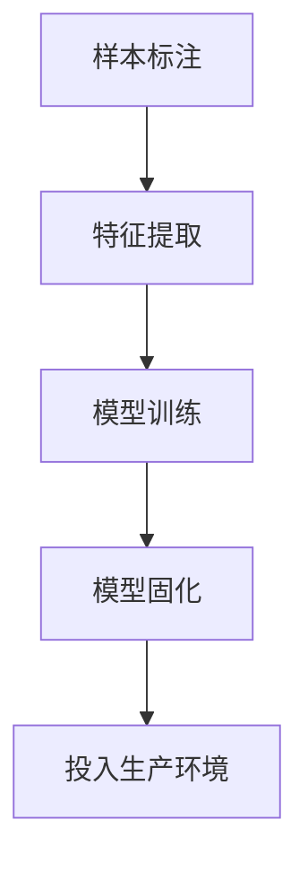

#### 2.2.2 报警归并

**问题场景**：
- 生产环境中业务系统依赖各种服务器、中间件、SOA框架
- 一个系统出现问题导致所有下游系统报警
- 产生报警风暴

**解决思路**：
- 挖掘报警的隐式规律
- 对相同类型和相同源头的报警做聚合收敛
- 减少对运维人员的干扰

#### 2.2.3 根因分析

**分析维度**：

1. **指标维度分析**
   - 使用Adtribution算法
   - 面向SLA型核心指标
   - 示例：下单量下跌 → 分析具体城市、车型

2. **微服务拓扑分析**
   - **横向分析**：多个服务之间的调用关系
   - **纵向分析**：多个应用之间的依赖关系
   - **典型案例**：饿了么InMonitor、阿里云ARMS的跨应用下钻推导

3. **贝叶斯算法**
   - 建立多个服务节点之间的贝叶斯网络关系
   - 根据因果关系推断故障根源

## 三、货拉拉报警平台架构

### 3.1 架构演进

从早期的Prometheus + Alertmanager开源方案，经过几年演进优化成当前架构。

### 3.2 整体架构设计

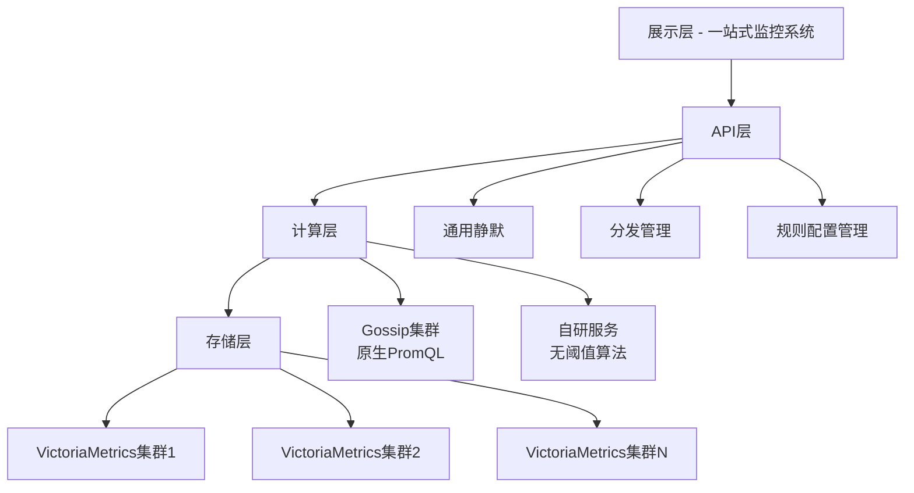

### 3.3 各层详细说明

#### 3.3.1 存储层
- 使用多个VictoriaMetrics指标集群
- 提供高性能时序数据存储

#### 3.3.2 API层
- 集成通用静默功能
- 报警分发管理
- 规则配置管理接口

#### 3.3.3 计算层

**1. Gossip集群（原生PromQL）**
- 替代Prometheus Alert和VM Alert
- 多节点互相同步状态
- 避免短时间抖动导致的误报
- 节点上下线时保证报警稳定性

**2. 自研服务（无阈值算法）**
- 承载无阈值算法的计算任务
- 支持更复杂的报警逻辑

#### 3.3.4 展示层

集成在自研的一站式监控系统中，提供：

- **报警记录**：历史报警查询
- **报警大盘**：全局报警视图
- **订阅组**：控制报警接收人和渠道
- **多种报警类型**：
  - 指标报警（Metric + PromQL）
  - 日志报警（ClickHouse）
  - 事件报警（API报警）
- **高级功能**：
  - 静默管理
  - 同步分发
  - 升级策略（类似PagerDuty）

## 四、核心能力建设

### 4.1 报警模板

#### 4.1.1 设计理念

**"基础架构产品设计要领先业务半步"**

#### 4.1.2 发展历程

**早期（2020-2021年）**
- 背景：PHP转Java，全面SOA化阶段
- 实现方式：独立服务运行代码化检查项
- 效果：保障了业务架构升级，发现了大量线上问题

**当前阶段**
- 应用规模：3000-4000个应用，接入1000+个
- 覆盖范围：140+条模板型报警
- 覆盖维度：应用、基础资源的方方面面

#### 4.1.3 核心特性

**1. 动态订阅组**

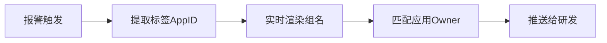

**优势**：
- 自动为全局应用注入无阈值算法报警规则
- 覆盖大多数黄金指标
- 新上线的AppID自动适配
- 报警自动推送给对应的研发Owner

**2. 平台化能力**

各团队利用报警模板实现平台化报警配置：

| 团队 | 应用场景 |
|------|---------|
| MOC团队 | 基础资源监控 |
| 大数据团队 | Flink可观测性报警 |
| XXL-Job | 定时任务报警 |
| 大前端 | 前端项目监控报警 |

**价值**：
- 集中管理报警规则
- 轻松分发给各自用户
- 降低配置成本

### 4.2 无阈值算法

#### 4.2.1 问题背景

传统同环比的局限性：

1. **配置困难**：同时配置多个应用、多种接口时难以找到确定值
2. **噪音问题**：业务曲线白天合理，夜间噪音大
3. **算法选择困境**：

| 算法类型 | 优点 | 缺点 |
|---------|------|------|
| 预测类算法<br/>（如Facebook Prophet） | 检测业务曲线稳定性好 | 只适用核心SLA指标<br/>曲线稍微湿吻就有大量噪音 |
| 无监督学习<br/>（如XGBoost） | 效果较好 | 调参能力弱<br/>不同场景适配困难<br/>可解释性差 |

#### 4.2.2 解决方案

**设计原则**：
- 服务1000+研发，追求通用化能力
- 所见即所得，算法明确，解释力强
- 用户可以理解并向同事解释报警原因
- 支持二次参数调整

**实现思路**：工程化手段优化

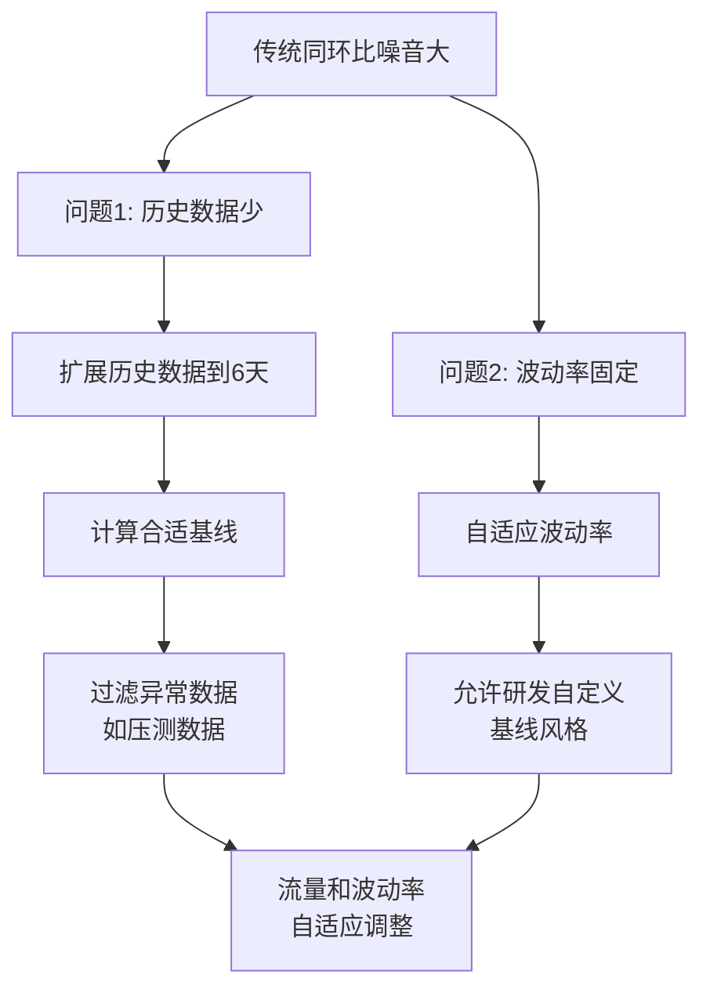

**核心优化**：

1. **历史数据扩展**
   - 从1-2天提升到6天
   - 计算更稳定的基线
   - 过滤明显异常数据（如压测）

2. **自适应波动率**
   - 允许研发对基线风格进行调整
   - 实现流量和波动率的自适应
   - 一次性兼容多种应用、多种特征曲线

**效果**：
- 减少80%以上的无效报警
- 相对于复杂算法更易于理解
- 研发更乐于使用

#### 4.2.3 调试与重放功能

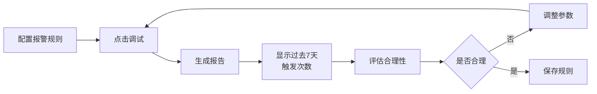

**价值**：
- 快速评估算法效果
- 支持参数二次优化
- 快速将规则调整到最佳状态

### 4.3 发布检测

#### 4.3.1 问题背景

- 生产环境很多隐患由变更引起
- 研发管理的区域和环境众多且复杂
- 人工检查存在遗漏风险
- 每隔几个月出现1-2次典型问题

#### 4.3.2 解决方案

**检测机制**：

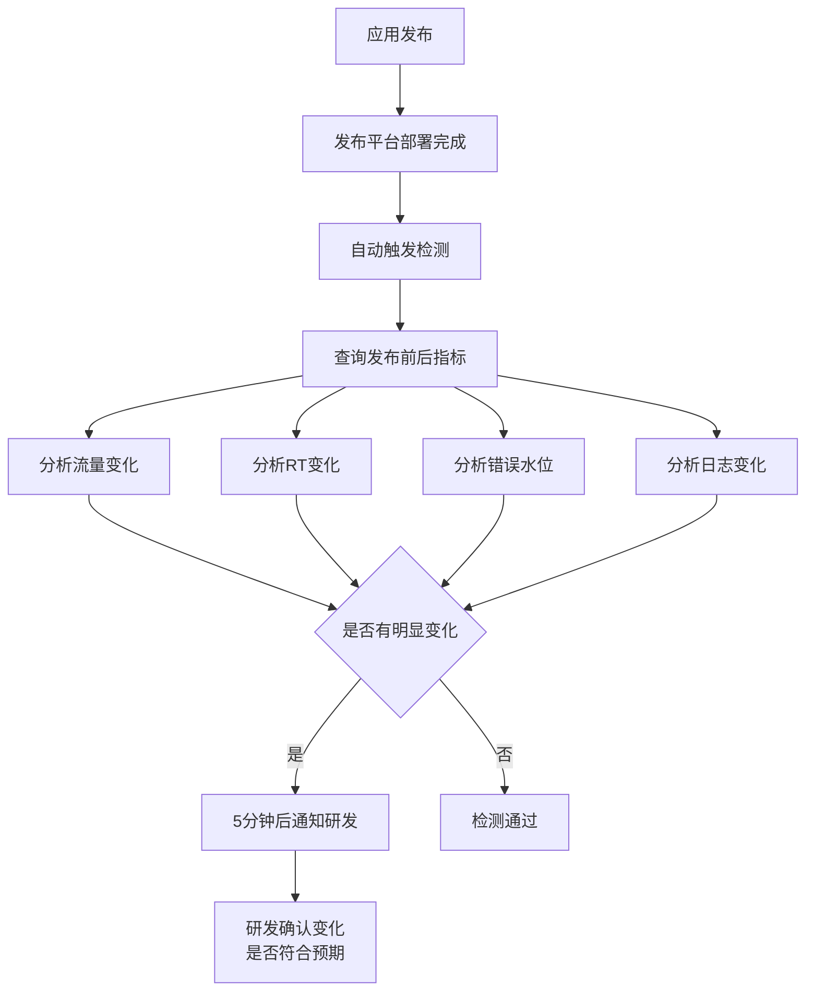

**关键设计点**：

1. **时间窗口选择**
   - 对比发布前5分钟 vs 发布成功后5分钟
   - 1分钟：数据量级太小
   - 10分钟：检测机制滞后
   - 5分钟：相对合理的平衡点

2. **算法特点**
   - 比平时报警算法更敏感
   - 定位：识别变化，而非发现异常
   - 算法实现相对朴素
   - 采集间隔30秒，每条线各20个点（低维数据）

**算法设计**：

| 指标类型 | 算法策略 |
|---------|---------|
| **流量型指标** | 结合离散系数判断抖动<br/>基于总量和曲线相似性<br/>不同波段设计不同波动率 |
| **RT类指标** | 容忍较大波动<br/>考虑启动时RT升高后收敛 |
| **错误和异常** | 只关注总量变化<br/>不关注曲线形态<br/>限制允许上升的数量 |
| **水位计算** | 类似错误异常<br/>只关注上升不关注下降<br/>结合固定阈值判断 |

**覆盖范围**：
- 指标和日志：41个检查项
- 检测内容：流量突增突减、异常错误、RT明显上升

**效果**：
- 准确率：约70%
- 帮助研发识别：300+次问题
- 价值：提前发现问题，避免生产隐患

### 4.4 报警降噪与治理

#### 4.4.1 问题分析

无阈值算法只能解决部分规则的报警治理，全面化的报警降噪需要更系统化的手段。

**业界方案的局限**：
- 基于统计的算法只能对报警风暴时收敛
- 不能整体性提升报警规则质量

#### 4.4.2 非智能化运营手段

**1. 飞书卡片静默能力**

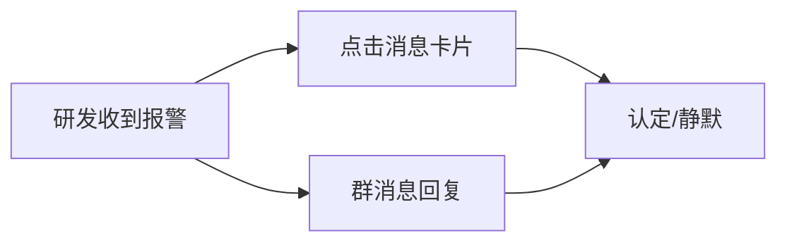

**特点**：
- 操作简单，研发乐于使用
- 降低45%的噪音

**2. 报警大盘**

**功能**：
- 提供总览视角
- 研发评估团队报警质量
- 支持定期规则优化治理

**治理策略**：
- 主动治理频率：每隔几个月一次
- 遵循二八原理：80%的噪音来自20%的规则
- 治理手段：规则调优、配置优化、参数优化
- 效果：降低30%的噪音

**未来规划**：
- 主动巡检代码化
- 提供持续性规则优化和检查机制

#### 4.4.3 报警风暴处理

**场景描述**：
- 正常情况：每天2000-3000条报警
- 压测/故障期间：短时间发出平时1-2天的量
- 问题：研发无法从海量报警中挖掘关键信息

**解决方案：多策略合并机制**

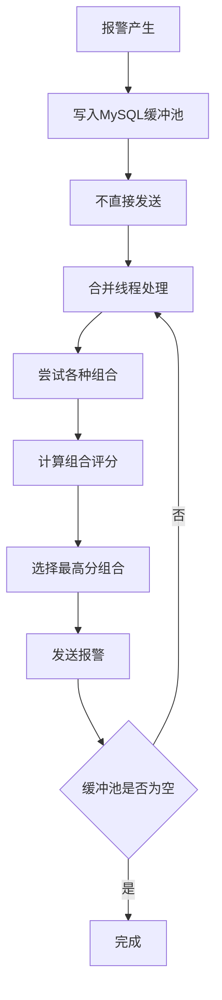

**合并维度**：

| 合并维度 | 观察价值 |
|---------|---------|
| **按规则合并** | 看到哪些接口、哪些IP同时出现问题 |
| **按AppID合并** | 识别应用级别的问题 |
| **按IP合并** | 观察是否某台K8s节点出现问题 |
| **按基础资源合并** | 识别依赖的基础资源问题 |

**实现机制**：
- 报警计算和发送之间增加MySQL缓冲池
- 不同组合策略有不同评分权重
- 优先选择分数最高的组合发送

**效果**：
- 日常运行：降低20%的消息
- 报警风暴：降低50%以上

#### 4.4.4 综合降噪效果

通过多种运营手段组合：

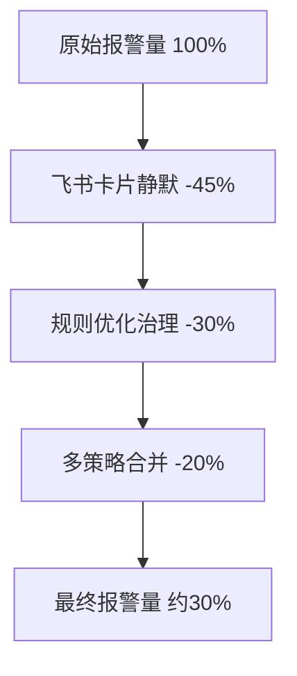

**最终效果**：报警数量控制在治理前的30%左右

### 4.5 指标下钻分析

#### 4.5.1 背景与定位

**与根因分析的关系**：
- 指标下钻分析是实现根因分析的前提条件
- 当前只完成了小部分工作

**选择的技术路线**：
- 业界主流：因果推断 + 指标聚类
- 货拉拉选择：模拟专家系统经验，对指标和链路数据做推导
- 优势：效果更清晰简单

#### 4.5.2 分析思路

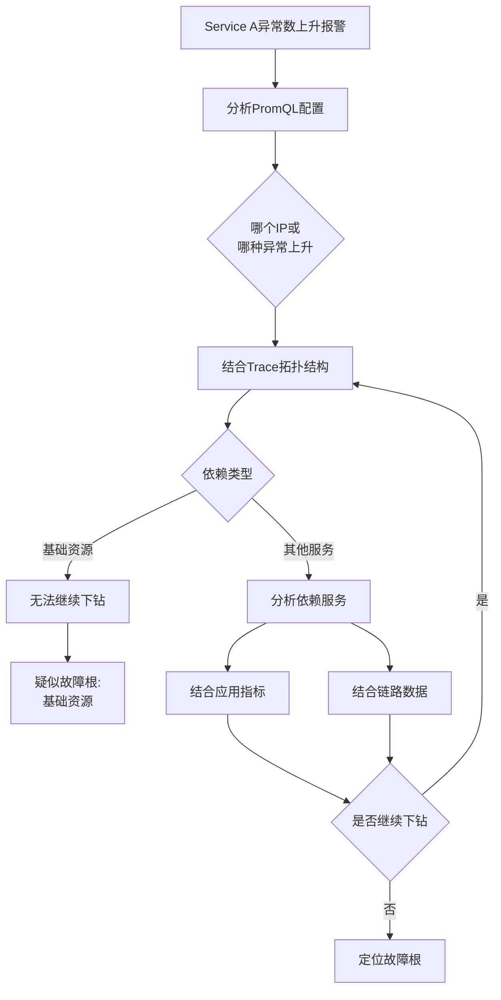

**技术挑战**：
- 分析过程繁琐
- 高度依赖数据完整性
- 需要链路架构升级支持

#### 4.5.3 为什么选择这个方向

**业界方案的局限**：

1. **报警是低维度数据**
   - 真实场景不可能天天出现故障
   - 基于关联推导的方式对大故障识别好
   - 对小范围抖动识别不敏感

2. **用户体验问题**
   - 普通研发体会不到分析推导的严密性
   - 即使论文效果很好，但研发感受不到价值

3. **数据完整性**
   - 业界方案避开直接推导，是因为链路数据不完整
   - 只能在指标数据上做文章

**货拉拉的策略**：
- 先完善链路数据体系
- 再基于完整数据做直接推导
- 提供更清晰的分析结果

#### 4.5.4 应用场景

**典型场景**：

研发配置报警时：
- 关注服务级和服务间调用
- 不会对所有标签做分组查询（噪音太大）
- 当SOA的RT突然上升时，需要细分分析

**下钻分析的价值**：

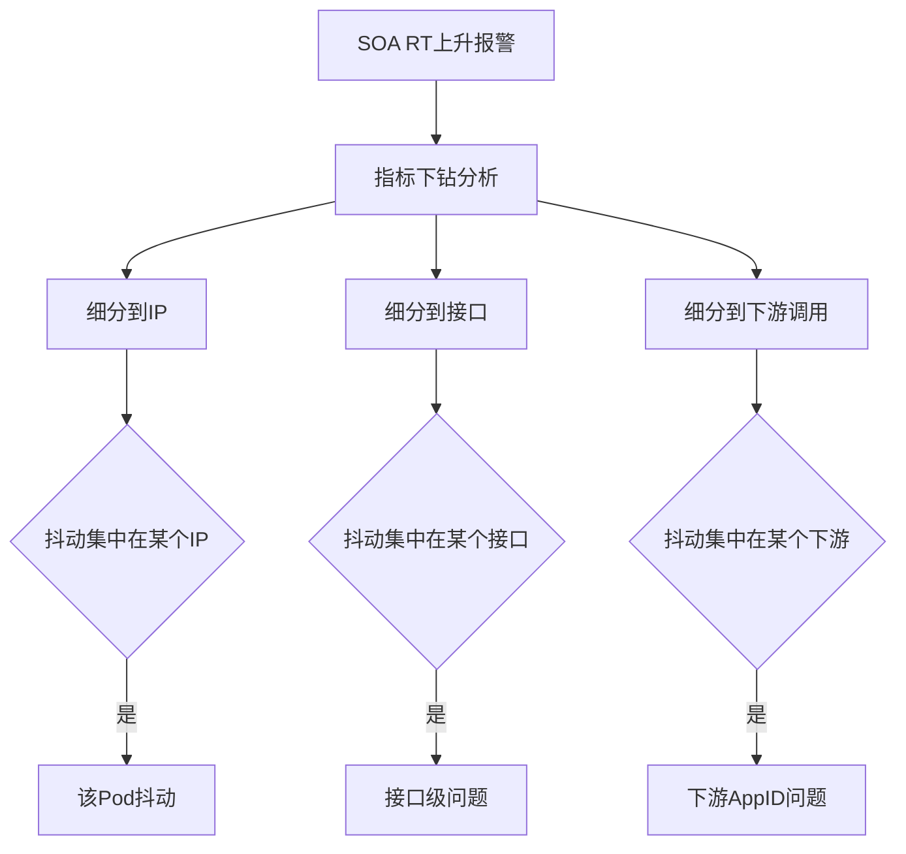

**帮助研发**：
- 更快定位报警触发原因
- 简化排查链路
- 提高问题定位效率

#### 4.5.5 实现流程

**第一步：PromQL分析**

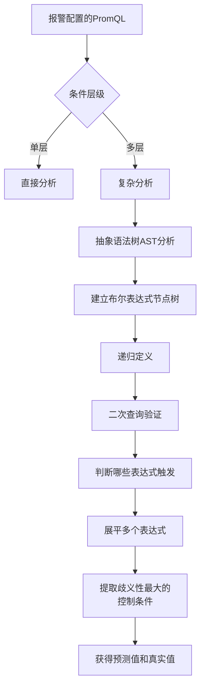

**实现细节**：
- 支持单层、双层、三层甚至更多层级条件
- 多个控制条件可能是AND和OR结合
- 通过AST分析找出最可能导致报警的条件

**第二步：预规划器**

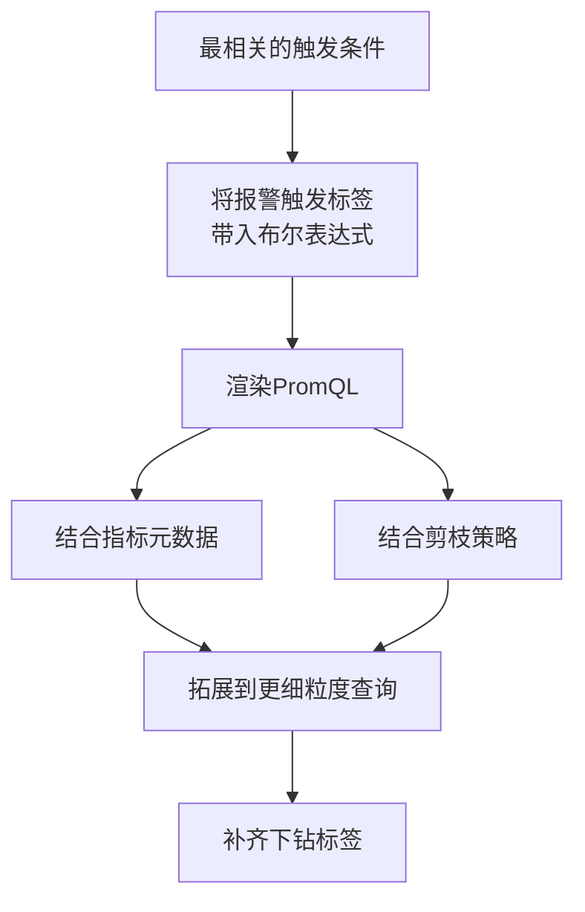

**第三步：分析算法**

基于Adtribution算法的延伸：

**支持的复合指标**：
- Max/Min
- 分位数（P95、P99）
- 分位桶

**实现方式**：
- 通过PromQL的聚合函数判断下钻形式
- 对于分位桶：去掉外层histogram_quantile，转换成原始分桶表达式
- 在应用层计算P95和P99

**第四步：优化器**

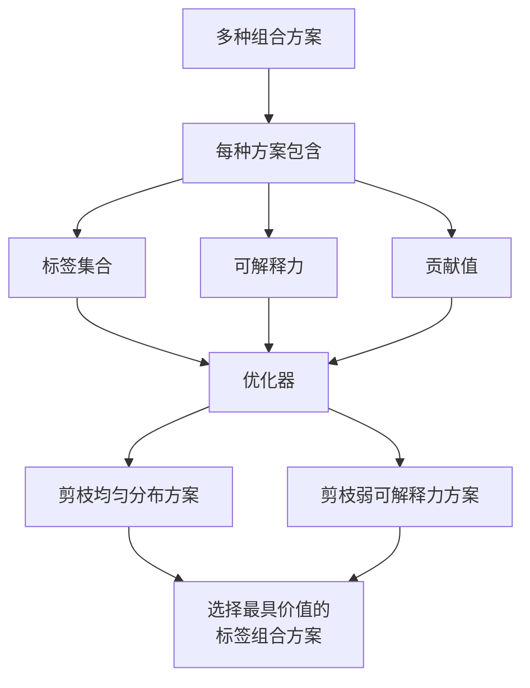

**优化工作**：
- 参考Adtribution算法论文
- 工程化优化
- 剪枝掉分布均匀、可解释力弱的标签方案

**第五步：依赖分析**

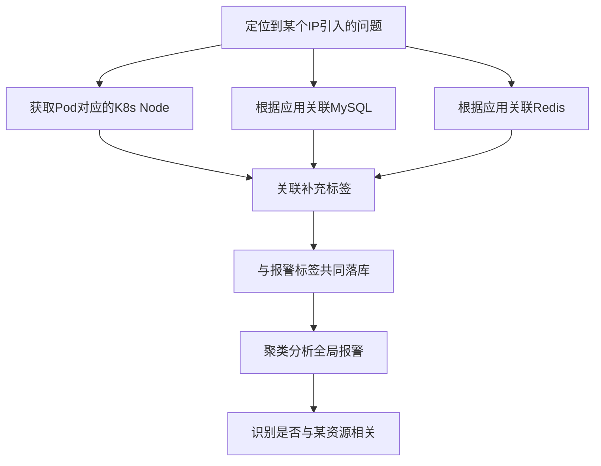

#### 4.5.6 实际案例

**场景**：异常突增报警

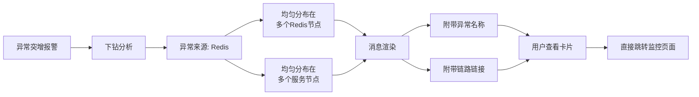

**更复杂场景**：
- 可能包含多种标签组合
- 提供更全面的分析结果

## 五、建设经验与思考

### 5.1 核心理念

**智能报警服务于业务价值**

如果基础没有打好就追求AIOps和算法落地，会导致：
- 与实际业务需求脱节
- 本末倒置

### 5.2 四个关键点

#### 5.2.1 做得快

**依赖的基础能力**：

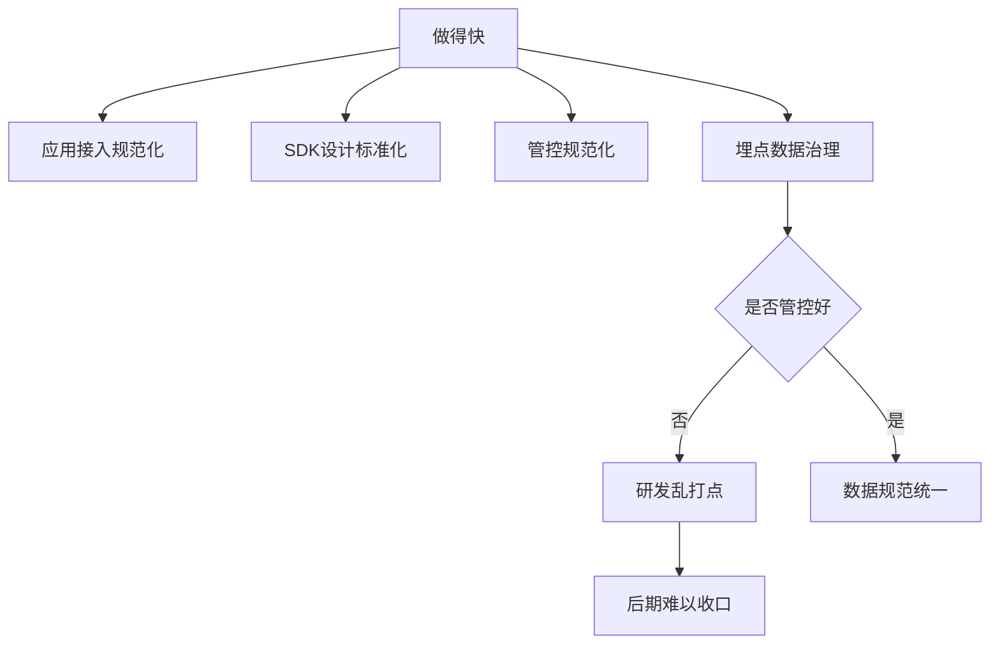

**性能优化实践**：

VictoriaMetrics性能特点：
- 时间线几万以内：比较快
- 时间线几十万：性能恶化明显
- 慢查询显著影响集群性能

**优化手段**：
- 资源组件化
- 采集时对核心指标降维加速

**优化效果**：
- 单次最大查询：10秒左右
- P99查询时间：200毫秒左右

#### 5.2.2 做得多

**提升覆盖率的方法**：

1. **建立专项推动**
   - 通过专项形式推动覆盖率提高

2. **提供兜底规则**
   - 全局报警规则
   - ROI较高的形式

3. **报警模板**
   - 自动为应用注入报警规则
   - 新应用自动适配

#### 5.2.3 做得少

**运营能力建设**：

报警多了之后，噪音必然增加，需要：

1. **降噪和治理**（前文已详细介绍）

2. **追溯能力**

记录的信息：
- 每条报警为什么发送
- 为什么不发送
- 发送给了哪些人
- 发送是否有异常
- 规则被哪些人修改过

**价值**：
- 用户自主排查问题
- 客服工作大幅减少

#### 5.2.4 做得好

**目标**：通过技术化手段，把报警分析工作自动化完成

**实现路径**：


**当前状态**：
- 正在努力实现这个目标
- 希望更好地挖掘已有可观测数据的价值

### 5.3 建设路径总结

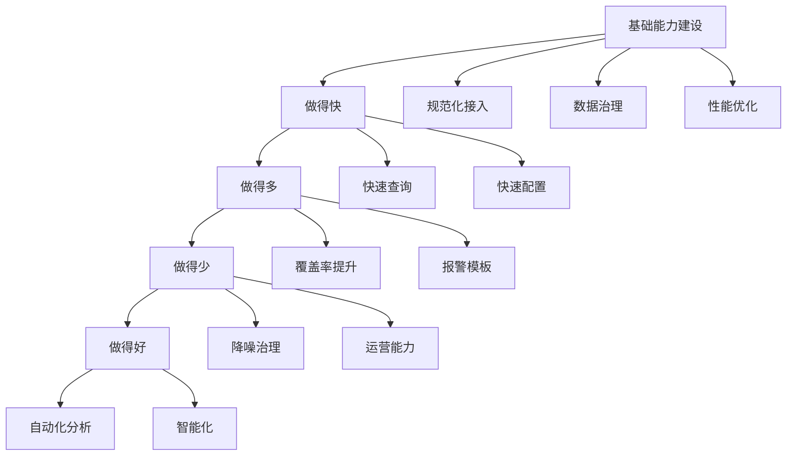

## 六、未来规划

### 6.1 短期目标

1. **完善指标下钻分析**
   - 完成链路数据体系建设
   - 实现更完整的下钻能力

2. **根因分析落地**
   - 基于完整的链路数据
   - 实现自动化根因定位

3. **持续优化算法**
   - 代码化主动巡检
   - 持续性规则优化机制

### 6.2 长期愿景

**终极目标**：让报警系统真正智能化

**实现路径**：
- 技术化手段自动化完成报警分析
- 更好地挖掘可观测数据价值
- 为研发提供更智能的辅助

## 七、Q&A精选

### Q1: 如何控制引入算法的模型成本？

**回答**：
- 高级算法（如XGBoost）成本确实较高
- 作为平台化能力提供方，选择了更简单的配置类算法
- 对于闭环内的报警（如大数据团队自己的监控），可以使用更复杂的算法

### Q2: 怎么进行指标治理？

**回答**：

指标治理不仅是监控团队的事情，需要全部门协同：

1. **源头控制**
   - 服务框架团队配合
   - SDK开发团队配合
   - 在应用SDK中实现时间线控制

2. **采集控制**
   - 控制时间线量级
   - 不要一开始就放开太多限制

3. **协同机制**
   - 监控团队与各语言SDK开发团队交流
   - 共同制定指标规范

### Q3: 数据监控样本过少，怎么配置智能异常检测？

**回答**：
- 当前方案没有侧重这方面
- 建议多看相关论文
- 需要针对具体场景设计方案

### Q4: 监控系统本身有没有做容灾？

**回答**：

采用双向备份机制：

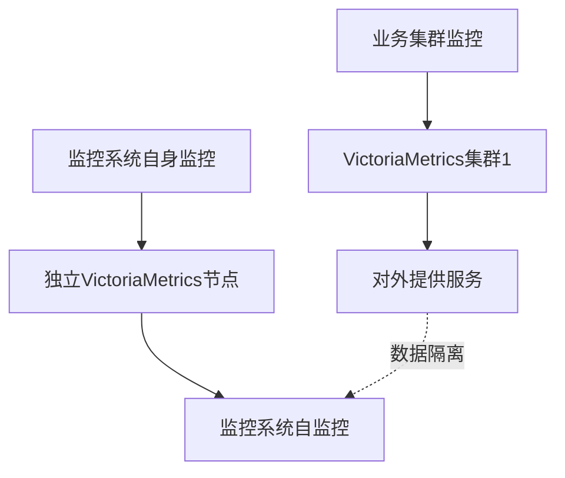

**设计原因**：
- 核心集群出现问题时，自身监控仍然可用
- 避免"一锅端"的情况
- 之前踩过坑，逐渐演进出这个架构

### Q5: 不同时段的时序数据如何配置不同阈值的检测报警？

**回答**：

两种设计方案：

1. **规则时间段控制**（推荐）
   - 在规则上控制运行时间段
   - 对高峰期和低峰期分别配置算法

2. **基于量级的波动率**
   - 波动率跟着量级走，不跟着时间走
   - 适合货运场景：白天量级大，夜间量级小
   - 根据量级自动调整波动率

### Q6: Metric的采集周期最小粒度是多少？

**回答**：
- 业务集群：30秒
- 核心指标：10秒
- 未来规划：核心大屏类指标逐渐提升到10秒精度

### Q7: 持续数据的变化不同，采用的算法是一样的吗？会自动选择吗？

**回答**：
- 面向全体研发，提供的是让研发自主选择的能力
- 不是闭环控制的方式
- 闭环控制的方案可以参考其他团队的分享（如大数据团队）

## 八、总结

货拉拉智能报警建设遵循"领先业务半步"的理念，通过以下路径逐步实现智能化：

### 8.1 核心成果

1. **报警模板**：140+条模板，覆盖1000+应用
2. **无阈值算法**：降低80%以上无效报警
3. **发布检测**：识别300+次问题，准确率70%
4. **综合降噪**：报警量降至治理前的30%
5. **指标下钻**：正在建设中，为根因分析打基础

### 8.2 建设心得

```mermaid
graph LR
    A[基础先行] --> B[快速响应]
    B --> C[广泛覆盖]
    C --> D[精准降噪]
    D --> E[智能分析]
```

### 8.3 关键经验

- **不追求高大上算法**，而是追求实用性和可解释性
- **工程化手段**往往比复杂算法更有效
- **用户体验**比算法先进性更重要
- **数据基础**是智能化的前提
- **循序渐进**，不要本末倒置

### 8.4 未来方向

通过技术化手段实现报警分析自动化，让报警系统真正智能化，更好地服务于业务发展。

---

**分享者**：货拉拉技术团队
**受众**：SRE、运维及稳定性保障工程师
**核心价值**：提供切实可行的智能报警建设经验，强调工程化实践胜于理论算法

