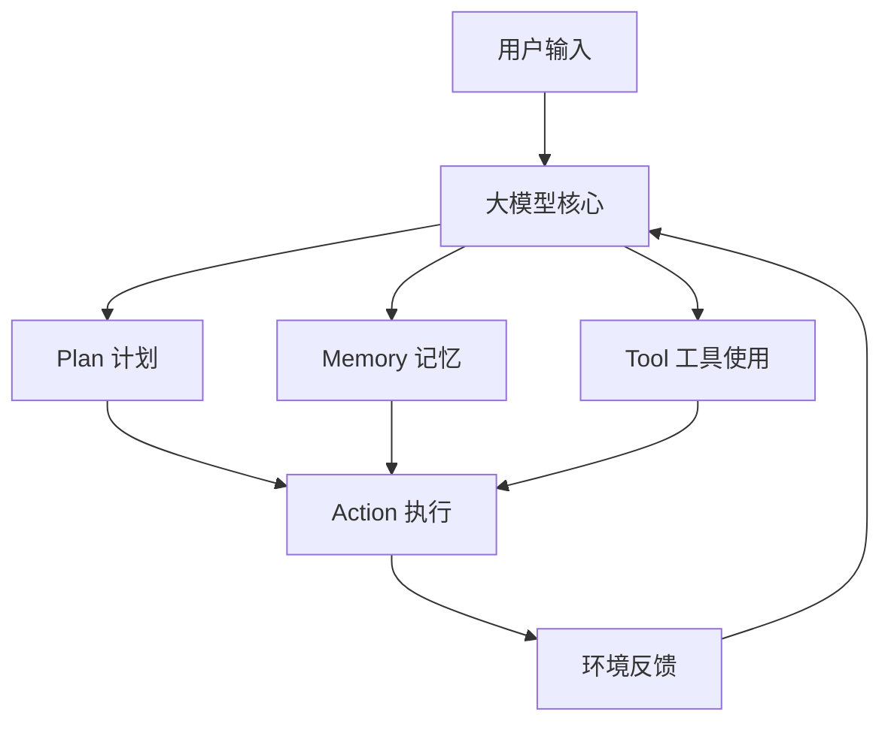
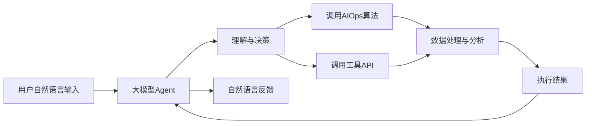
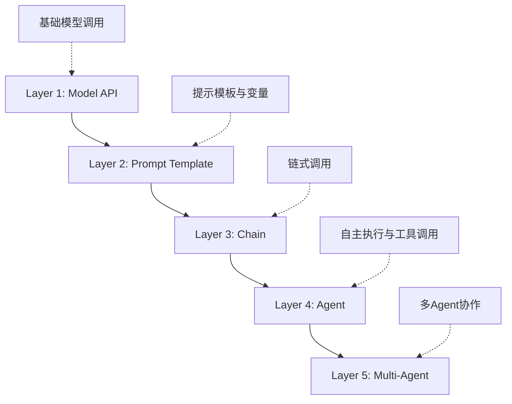
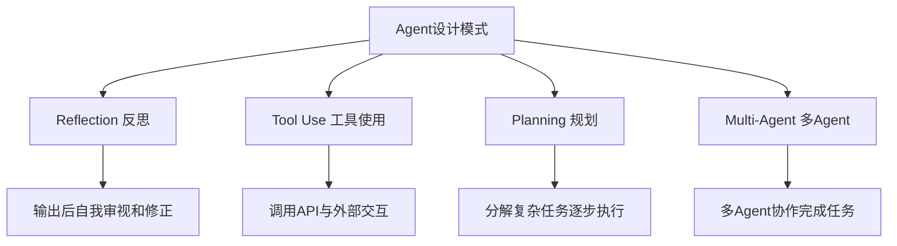
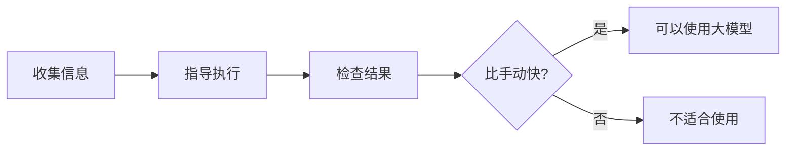
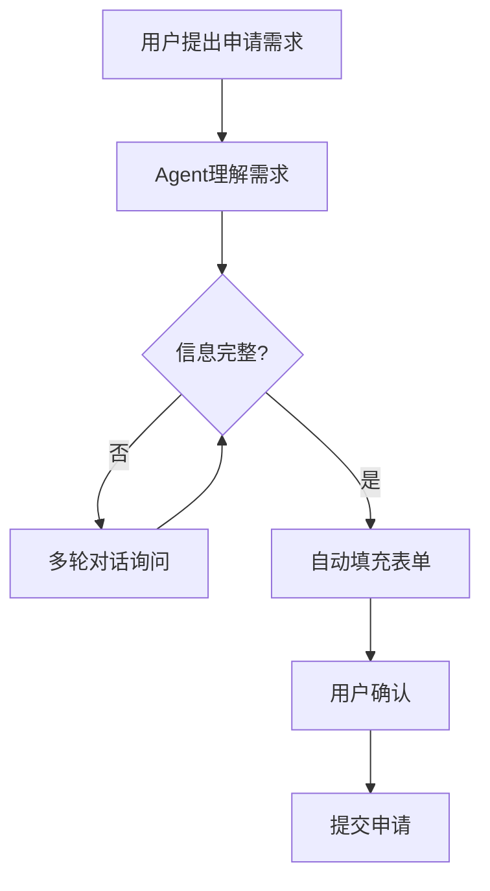
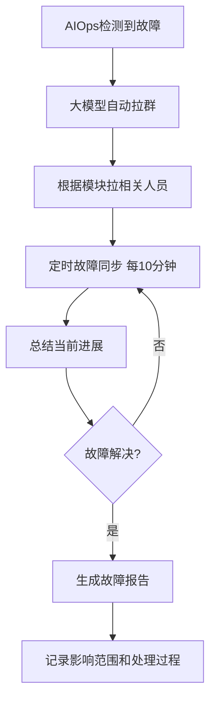
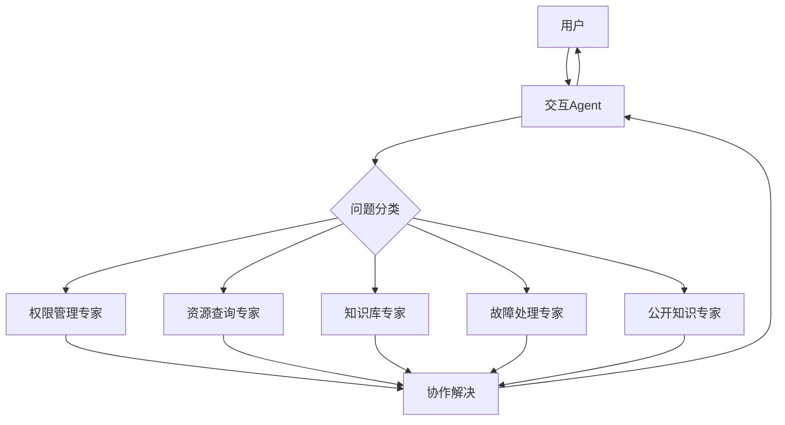
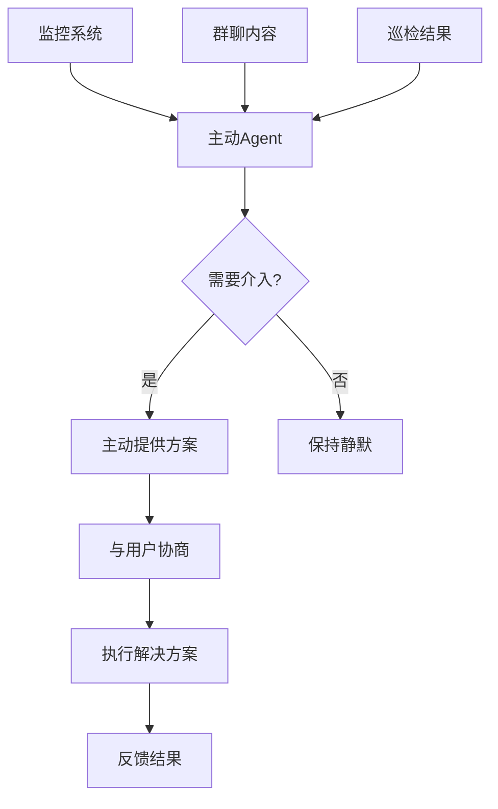
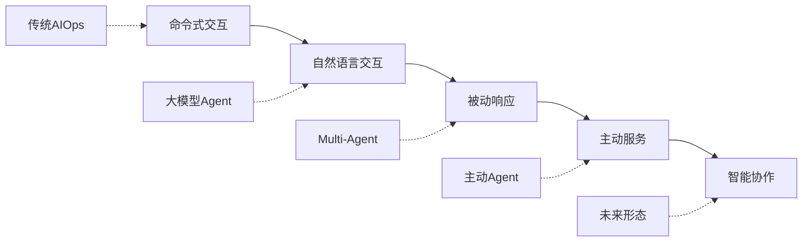

# 大模型Agent在AIOps的探索

> 来源：未核验 · 类型：分享 · 状态：draft


## 一、背景与概述

### 1.1 AIOps的兴起与应用领域

在数字化时代，IT系统日益复杂，可观测数据量急剧增长，传统IT运营方式已难以满足及时性、故障率、MTTR等运营要求。AIOps应运而生，利用人工智能解决运维过程中的数据量和复杂度问题，帮助企业提高IT运营效率、降低成本、提升用户体验。

**AIOps典型应用场景：**

- **性能分析**：根据历史监控数据分析预测资源使用情况及未来资源消耗
- **异常检测**：故障定位、业务/网络/内存/CPU等异常检测
- **根因分析**：微服务系统中复杂依赖关系的分析
- **安全运维**：安全事件告警检测

### 1.2 大模型与Agent简介

**大模型特点：**

- 基于大量数据进行预训练的神经网络底层模型
- 从文本中提取语义，理解语义和单词
- 局限性：被动接受指令后生成文本，无法直接与现实世界交互

**大模型驱动的Agent：**

- Agent概念早已存在，但早期Agent的"大脑"较弱
- 大模型赋予Agent强大的智力，使其能够更好地理解事物和环境
- 能够自主理解和决策，完成复杂任务的智能体
- 通过Memory感知周围环境，通过工具对外部环境做出改变
- 根据外部反馈调整策略（反思策略）

### 1.3 Agent通用架构



**核心组件：**

- **工具使用（Tool）**：决定能做哪些事，大模型通过工具对外部做出改变
- **计划（Plan）**：决定怎么做事，一步步思考还是做一步反思一步
- **记忆（Memory）**：决定对背景知识的感知，支持多轮对话等交互特征
- **执行（Action）**：根据计划使用工具执行具体操作

## 二、大模型Agent与传统AIOps对比

### 2.1 能力对比

| 维度               | 大模型Agent                      | 传统AIOps                      |
| ------------------ | -------------------------------- | ------------------------------ |
| **数据处理** | 擅长非结构化数据（自然语言）     | 擅长结构化数据处理             |
| **决策能力** | 强大的决策能力，具备人类智慧特点 | 需要训练强大模型和大量数据积累 |
| **适应性**   | 通用场景下灵活性高，无需重新训练 | 场景变化需要重新训练           |
| **交互方式** | 自然语言交互                     | 命令式或UI操作                 |

### 2.2 大模型Agent的显著特点

**1. 自主性**

- 自动理解目标并制定计划
- 过程中无需人类过多干预
- 需要信息时主动向人类询问

**2. 交互性**

- 与其他Agent协作，组成多Agent架构
- 与人类协作，感知反馈并做出改变

**3. 适应性**

- 通用场景下具备较强适应能力
- 无需针对每个场景积累大量数据重新训练

**4. 人机交互重塑**

- 从命令式/UI点击交互转变为自然语言交互
- 从贴近机器的工作方式转变为贴近人类的模式

### 2.3 融合方案



将大模型的自然语言理解能力与AIOps的数据处理能力结合，弥补大模型不足，同时为传统AIOps带来新的交互体验。

## 三、AIOps场景下的大模型Agent实践

### 3.1 企业落地的五大支撑准备

#### 1. 知识支撑（上下文）

- **内部知识库**：产品文档、流程、预案知识等
- **传递方式**：通过RAG或微调方式传递给大模型
- **目标**：让大模型理解业务，成为公司内部的"员工"

#### 2. 平台支撑（工具）

- **完整的API体系**：主机申请、权限申请、K8s操作等
- **目标**：让Agent能够通过API对环境做出改变

#### 3. 流程支撑

- **标准化处理流程**：资源申请、故障处理流程等
- **完善的规范和制度**
- **目标**：大模型按照标准化流程一步步解决问题

#### 4. 人才支撑

- **引入者**：清楚了解大模型能做什么、能力边界在哪
- **使用者**：了解大模型能力，有意识地配合和提供足够信息
- **避免两个极端**：
  - 认为大模型什么都能干
  - 认为大模型什么都不能做

#### 5. 安全支撑

- **明确的安全规范**：哪些数据能传给大模型，哪些不能
- **数据使用规则**：避免违反安全规范

### 3.2 构建AI应用的五层基石



**各层说明：**

1. **Model API**：通过API调用各种大模型
2. **Prompt Template**：引入变量，限制模型输出范围，提升精准度
3. **Chain**：链式调用，将多次调用结合，完成更复杂工作
4. **Agent**：根据任务需要主动选择和调用工具
5. **Multi-Agent**：多Agent共享记忆，自主分工协作

### 3.3 大模型开发的五大技术

#### 1. Prompt工程

**核心格式：**

- **指令（Instruction）**：需要完成什么任务
- **上下文（Context）**：完成指令所需的前置条件、依赖、限制等
- **输入输出格式（Format）**：指定输出格式（JSON、YAML等）

**设计模式：**

- **Zero-shot**：不提供任何样例
- **Few-shot**：提供少量样例，让大模型更好地理解输出方式

#### 2. RAG（检索增强生成）

**主流框架：**

- **LlamaIndex**：传统RAG实现方式，包含PDF、Word、Excel等解析方案
- **GraphRAG**：基于图数据库，先用大模型抽取实体和关系，再用图数据库存储

**作用：**

- 将检索的知识作为大模型的上下文背景知识
- 提高生成的准确性

#### 3. Agent开发

**四种设计模式：**



**主流框架：**

- AutoGen
- GPT系列
- LangChain

#### 4. Multi-Agent协作

**特点：**

- **自治性**：每个Agent独立决策
- **本地化**：每个Agent只获得部分环境信息
- **去中心化**：整体集体控制，而非单一Agent控制
- **协作与竞争**：可以协作，也可以竞争后输出最佳结果

**三种协作模式：**

1. **SOP驱动**：按照固定流程（如ChatDev的产品-设计-开发-测试流程）
2. **LLM驱动**：完全由大模型决定Agent如何协作
3. **并行计算**：多Agent并行处理，由上层Agent汇总

#### 5. 微调（Fine-tuning）

**使用场景：**

- 新领域、新脚本语言（大模型不会的）
- 特定领域的专业能力
- RAG和其他技术无法解决的问题

**微调技术分类：**

- **全量微调**：重新训练全部参数，代价高，可能遗忘
- **参数微调**：微调部分参数，减少GPU内存使用
- **人类反馈微调（RLHF）**：如ChatGPT，对人类反馈敏感，更接近人类价值观

### 3.4 实战技巧

#### 技巧1：三步法评估场景



**关键点：**

- 收集：确定完成任务需要哪些信息
- 指导：告诉大模型需要做什么
- 检查：检查输出是否正确（考虑检查成本）

#### 技巧2：从小到大逐步扩展

**落地路径：**

```
具体工序 → 完整流程 → 闭环场景
```

**示例：**

- 工序：故障日志定位
- 流程：完整故障处理流程
- 闭环：故障处理 + 报告生成 + 任务跟进

#### 技巧3：RAG优先，微调慎用

**选择原则：**

- **90%的任务**：用RAG或增强背景知识可以解决
- **微调场景**：
  - 新领域、新脚本语言
  - 特定领域能力（大模型不具备的）
- **RAG场景**：
  - 背景知识、内部知识
  - 大模型不知道的信息

## 四、大模型Agent在AIOps中的落地场景

### 4.1 知识问答

**实现技术：**

- Memory（记忆）
- Tool Use（工具使用）
- RAG（检索增强生成）

**功能特点：**

- 查询内部流程文档
- 告知文档位置和具体流程
- 支持多轮对话
- 可根据反馈调整输出（如精简回答）

### 4.2 资源查询（知识图谱）

**实现方式：**

- 对内部资源进行语义化准备
- 将关系型数据转化为图数据库
- 支持语义化查询

**功能示例：**

- 查询资源关联的数据库
- 查询资源归属关系

### 4.3 表单填写与资源申请

**功能特点：**

- 自动填充表单信息
- 多轮对话引导用户补全信息
- 自动解释字段含义
- 改善用户体验，减少咨询

**流程图：**



### 4.4 问题排查

**实现技术：**

- Tool Use（工具使用）
- AIOps算法
- 日志/事件/监控分析

**功能特点：**

- 观察Pod异常事件和日志
- 分析问题原因
- 提供解决方案
- 一站式查询（事件+日志+监控）

### 4.5 故障助手

**核心功能：**



**特点：**

- 自动创建故障群并拉入相关人员
- 每10分钟自动总结故障处理进展
- 后来者可快速了解当前状态
- 故障结束后自动生成报告

### 4.6 基于Multi-Agent的运维机器人

#### 为什么需要Multi-Agent？

1. **复杂领域分解**：单一Agent无法解决复杂问题
2. **不同场景需求**：不同场景需要不同的任务规划和思维能力
3. **更好的用户体验**：无需用户选择领域，自动路由到合适的专家

#### 架构设计



#### 核心优势

1. **一站式能力**：用户无需知道能做什么，什么都能做
2. **无缝切换**：多Agent之间无缝切换（权限申请→知识库→流程规范）
3. **决策容错**：多Agent互相审查，部分解决幻觉问题

#### 应用场景示例

**场景1：多专家协作解答**

- 用户询问公网IP流量带宽
- 资源查询Agent发现是公网入口但无流量数据
- 给出合理反馈而非简单拒绝

**场景2：私域与公开知识结合**

- 优先查询内部知识库
- 内部知识库无相关内容时
- 自动调用公开领域专家回答
- 提供更好的交互体验

## 五、未来展望

### 5.1 多模态数据支持

**需求背景：**

- 用户反馈问题时常用截图而非文字描述
- 人与人之间的交互本身是多种形态的

**发展方向：**

- 支持图片识别和理解
- 识别用户意图
- 支持更多形态的交互方式

### 5.2 从自动化到智能化

#### 当前模式的局限

- **被动响应**：用户发出指令后AI才执行
- **需要主动@**：在群里需要艾特机器人

#### 主动Agent的新形态



**主动Agent特点：**

- **主动排查**：自动发现并解决问题
- **协商机制**：与用户协商解决结果
- **自主判断**：判断自己能做哪些事
- **无缝融入**：融入现有工作流，无需时刻艾特
- **责任心驱动**：像负责任的员工一样主动回复相关问题

**应用场景：**

- 故障巡检：发现风险主动告知
- 资源调度：主动提供资源优化方案
- 问题解决：在群里看到能解决的问题主动回复

### 5.3 技术演进路线



## 六、实施建议与注意事项

### 6.1 准确性保障

#### 工程化控制

- **人工授权机制**：破坏性操作需要人工授权
- **来源校验**：检查信息来源是否可靠
- **规则控制**：通过工程化规则控制Agent行为
- **不完全依赖大模型**：大模型只负责选择工具，执行由工程化控制

#### 数据质量保障

- **多路召回**：全文检索 + 向量检索
- **重排序（Rerank）**：对召回结果重新排序
- **反馈机制**：建立用户反馈机制
- **优先级规则**：内部知识优先，更新时间晚的优先

### 6.2 性能优化

**响应时间要求：**

- 最慢不超过30秒
- 避免用户等待过久

**优化方案：**

- 简化交互逻辑
- 优化RAG查询性能
- 合理使用缓存
- 并行处理（考虑Token消耗）

### 6.3 成本控制

**考虑因素：**

- Token消耗（尤其是Multi-Agent并发）
- 大模型调用次数
- 开源模型能力不断增强
- 大模型价格持续下降

**建议：**

- 优先使用开源模型
- 合理设计Agent交互次数
- 避免过度并发

### 6.4 评估与迭代

**评估方法：**

- 准备问题集和标准答案
- Human评估（人工评估）
- 对比引入前后效果
- 持续迭代优化

**注意事项：**

- 没有数据集无法评估
- 需要持续收集反馈
- 关注准确率和用户体验

## 七、技术选型建议

### 7.1 大模型选择

- **推荐**：千问2（效果好）
- **考虑因素**：能力、成本、响应速度

### 7.2 Agent框架选择

- **运维领域特点**：
  - 要求准确性高
  - 需要考虑成本
  - 响应速度要快（<30秒）
- **建议**：根据实际需求简化框架，避免过度复杂

### 7.3 RAG vs 微调

- **优先RAG**：90%场景可用RAG解决
- **微调场景**：新领域、新语言、特定能力
- **不建议**：直接使用微调

## 八、总结

大模型Agent为AIOps带来了革命性的变化，主要体现在：

1. **交互方式革新**：从命令式到自然语言，从贴近机器到贴近人类
2. **能力提升**：结合大模型的理解能力和AIOps的数据处理能力
3. **效率提升**：自动化处理流程，减少人工干预
4. **体验优化**：多轮对话、主动服务、无缝协作

**落地关键：**

- 做好五大支撑准备（知识、平台、流程、人才、安全）
- 掌握核心开发技术（Prompt、RAG、Agent、Multi-Agent、微调）
- 遵循实战技巧（三步法、从小到大、RAG优先）
- 注重准确性、性能和成本平衡

**未来方向：**

- 多模态数据支持
- 从被动响应到主动服务
- 更智能的协作方式

通过合理的架构设计和工程化实践，大模型Agent能够在AIOps领域发挥巨大价值，真正实现智能化运维。

---

**Q&A精选：**

1. **GraphRAG效果如何？**

   - 中文语义复杂，需要特殊处理
   - 不仅是简单的实体关系提取
   - 需要大量优化和上下文补充
2. **如何保证RAG准确性？**

   - 数据源要准确
   - 用户提问要清晰
   - 多路召回 + 重排序
   - 建立反馈机制
3. **日志根因定位效果？**

   - 效果很好，能从几万行日志中找到问题
   - 无需特定日志格式
   - 只要日志语义化即可
4. **最容易落地的场景？**

   - 日志根因定位
   - 知识问答
   - 资源查询
5. **如何保证操作安全？**

   - 人工授权机制
   - 工程化控制
   - 规则约束
   - 不完全依赖大模型决策
