# 大语言模型在运维领域的应用探索

> 来源：未核验 · 类型：分享 · 状态：draft

> 分享嘉宾: 白鹭 - 中国信息通信研究院云计算与大数据研究所工程师

## 目录

- [一、大运维现代化保障体系](#一大运维现代化保障体系)
- [二、大模型时代背景与产业现状](#二大模型时代背景与产业现状)
- [三、大模型在研发运营领域的应用实践](#三大模型在研发运营领域的应用实践)
- [四、未来展望与挑战](#四未来展望与挑战)

---

## 一、大运维现代化保障体系

### 1.1 研究背景

随着技术飞速发展和企业数字化转型的不断深入，IT运维面临着越来越大的挑战：

- **基础设施规模扩大**：纳管机器数量急剧增加
- **架构复杂度提升**：微服务、分布式系统带来新挑战
- **稳定性要求提高**：业务连续性保障压力增大

### 1.2 运维演进阶段

运维技术经历了以下几个重要阶段的转变：

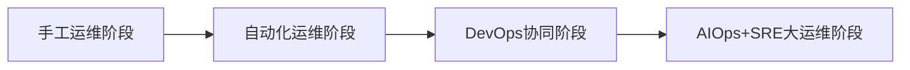

**AIOps + SRE 大运维阶段特点**：
- 运用人工智能技术转型升级传统运维
- 提升运维效率
- 以稳定性为核心目标

### 1.3 运维现代化保障体系架构

该体系关注运维的**稳定性、高效、精细化、安全**四大方面，围绕**质量、成本、效率、安全**四个关键维度展开。

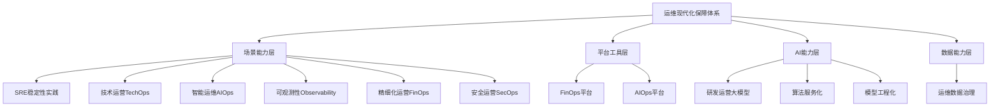

#### 场景能力层核心理念

**1. SRE (Site Reliability Engineering)**
- Google最先提出的稳定性连续性实践
- 关注系统可靠性和稳定性

**2. 技术运营 (TechOps)**
- 运维向运营转变
- 工作左移，与业务研发密切结合
- 提升用户体验感知

**3. 智能运维 (AIOps)**
- 运用机器学习等人工智能技术
- 提升故障定位、根因分析等场景效能

**4. 可观测性 (Observability)**
- 打通底层不同运维数据类型
- 提升系统可读性和透明度
- 让运维数据更好地被观测

**5. 精细化运营 (FinOps)**
- IT资源全生命周期管理
- 成本透明化、容量精细化
- 降本增效

**6. 安全运营 (SecOps)**
- 威胁感知、安全监测、响应处置
- 标准化处理流程
- 提前预防风险

### 1.4 智能运维研究成果

#### 智能运维场景分类

| 维度 | 智能发现 | 智能分析 | 智能处置 |
|------|---------|---------|---------|
| **质量场景** | 异常检测、故障预测 | 告警收敛、根因分析 | 故障自愈 |
| **成本场景** | 资源优化 | 资源预测 | 自动调度 |
| **效率场景** | 智能问答 | 智能变更 | 自动化执行 |
| **安全场景** | 安全知识图谱 | 风险可视化 | 自动响应 |

#### 智能运维能力成熟度分级

智能运维能力通过**执行、感知、分析、决策、支持、更新**五个维度进行评估，分为L1-L5五个等级：

| 等级 | 执行 | 感知 | 分析 | 决策 | 支持更新 | 典型企业 |
|------|------|------|------|------|---------|---------|
| **L1 初始级** | 系统为主 | 人工为主 | 人工为主 | 人工为主 | 人工为主 | - |
| **L2 基础级** | 系统执行 | 部分系统 | 人工为主 | 人工为主 | 人工为主 | 大多数企业 |
| **L3 进阶级** | 系统执行 | 系统执行 | 系统为主 | 人工为主 | 人工为主 | 成熟企业 |
| **L4 高级** | 系统执行 | 系统执行 | 系统执行 | 系统为主 | 人工辅助 | 少数互联网企业 |
| **L5 智能级** | 系统执行 | 系统执行 | 系统执行 | 系统执行 | 系统执行 | 理想状态 |

**现状**：
- 大多数企业处于L2-L3级别
- L3对标成熟企业
- 达到L4的企业极少，主要是头部互联网企业

#### 国际标准化成果

- **2020年**：在国际电信联盟ITU成功立项
- **2022年底**：正式发布全球首个智能运维国际标准

---

## 二、大模型时代背景与产业现状

### 2.1 全球大模型发展概况

#### 预训练模型发布数量

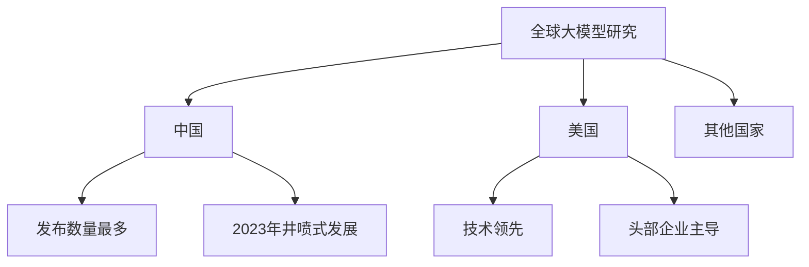

**主要研发主体排名**（按发布数量）：
1. Google（谷歌）
2. Meta
3. Microsoft + OpenAI
4. 清华大学
5. 百度、华为、腾讯、阿里巴巴
6. 上海人工智能实验室

**参数规模**：主要集中在十亿级、百亿级

### 2.2 国家政策支持

| 时间 | 政策/文件 | 核心内容 |
|------|----------|---------|
| **2023年7月** | 《生成式人工智能服务管理暂行办法》 | 鼓励大模型技术在各行业各领域创新 |
| **2023年底** | 数据要素相关新计划 | 支持通用大模型和垂直领域大模型训练 |
| **各省市** | 地方发展政策 | 鼓励大模型产业发展 |

### 2.3 大模型分类体系

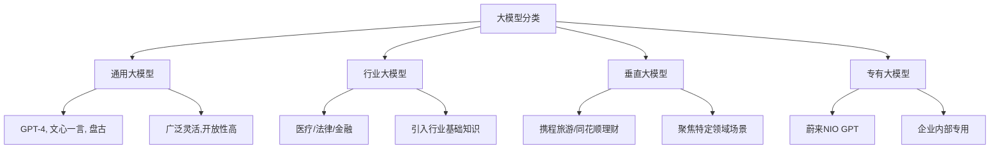

#### 各类大模型特点对比

| 类型 | 特点 | 优势 | 典型应用 |
|------|------|------|---------|
| **通用大模型** | 博古通今、灵活开放 | 通用问题处理能力强 | ChatGPT、文心一言、盘古 |
| **行业大模型** | 行业领域专家 | 专业知识丰富 | 医疗诊断、法律咨询、金融分析 |
| **垂直大模型** | 特定场景聚焦 | 场景针对性强 | 旅游规划、理财建议 |
| **专有大模型** | 企业独有保密 | 数据安全可控 | 企业内部智能助手 |

### 2.4 行业大模型应用案例

#### 医疗行业大模型

**应用场景**：
- 智能问诊
- 个性化康复方案
- 辅助医生分析决策
- 医学影像识别

**典型案例**：
- Google临床医师辅助大模型：问诊、智能分析、历史信息解答
- 多模态大模型：胸部X光片识别

#### 金融行业大模型

**应用场景**：
- 金融咨询
- 投顾分析
- 数据分析
- 专业考试（CPA、CFA）

#### 法律行业大模型

**应用场景**：
- 词条检索
- 案情分析
- 法律文书生成

**典型产品**：
- 北京大学法律大模型
- 复旦大学法律大模型

### 2.5 大模型应用方式

#### 部署模式

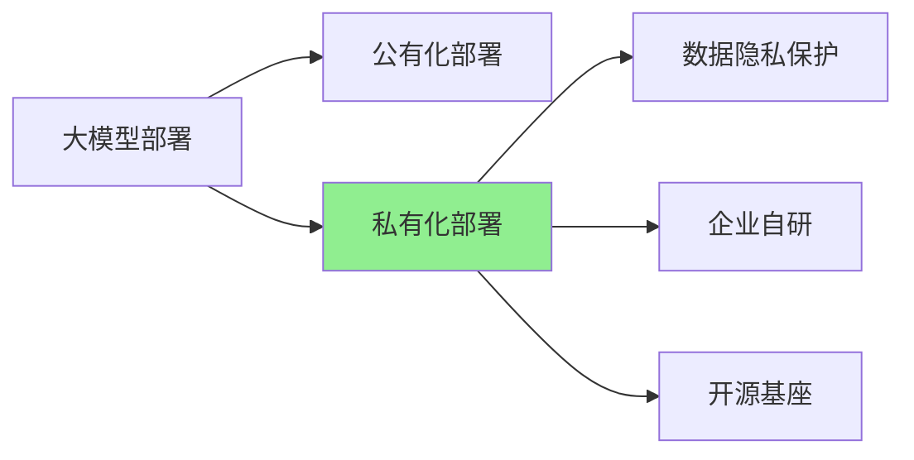

**现状**：
- **私有化部署为主**（考虑数据隐私和敏感性）
- 基于开源大模型基座
- 企业自研或定制化开发

#### 基础设施化趋势

**产品方**：
- 提供模型训练支持
- 模型管理平台（MLOps、LLMOps）

**应用方**：
- 大模型作为基础设施
- 赋能不同应用模块
- 支撑软件系统迭代升级

---

## 三、大模型在研发运营领域的应用实践

### 3.1 研发运营大模型概述

**定义**：软件工程领域的大模型，专注于提升研发、测试、运维全生命周期的效率和质量。

**核心价值**：
- 辅助编码
- 智能测试
- 智能运维
- 提升生产效率

### 3.2 研发运营大模型架构

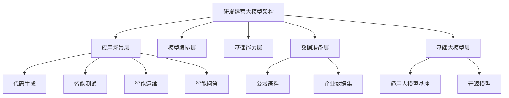

### 3.3 国内外代表性产品

#### 海外产品

| 产品 | 厂商 | 主要功能 |
|------|------|---------|
| **Codex** | OpenAI | 代码生成、自动编写 |
| **Copilot** | GitHub + OpenAI | 代码补全、建议 |
| **Bard** | Google | 代码辅助、问答 |

#### 国内产品

| 产品 | 厂商 | 主要功能 |
|------|------|---------|
| **Comate** | 百度 | 上下文补充、需求生成代码、自动注释 |
| **盘古** | 华为 | 研发运维场景支持 |
| **CodeGeeX** | 清华大学 | 代码生成 |

**行业实践**：
- 金融行业：运维大模型探索
- 运营商：中国移动运维大模型
- 互联网：同创科技 + 复旦大学运维大模型

### 3.4 研发领域应用场景

#### 研发生命周期场景覆盖

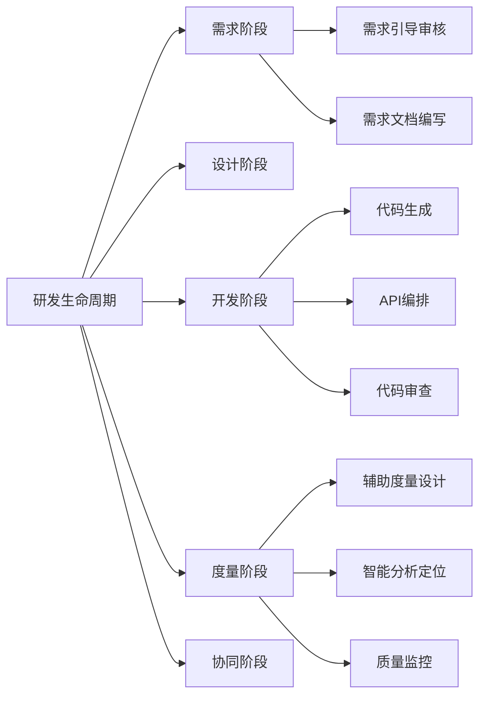

#### 开发阶段核心能力

**代码生成**：
- 根据自然语言描述生成代码
- 上下文感知补全
- 多语言支持

**代码理解与重构**：
- 代码逻辑分析
- 重构建议
- 代码优化

**代码审查**：
- 自动发现潜在问题
- 代码规范检查
- 安全漏洞识别

### 3.5 测试领域应用场景

#### 测试生命周期场景

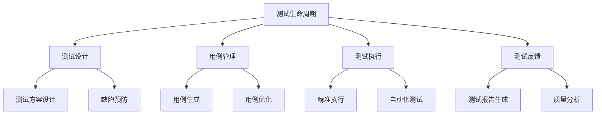

#### 能力演进路线

**短期能力**（当前可实现）：
- 理解代码逻辑和适用规范
- 自动选择回归测试范围
- 生成测试用例

**中期能力**（1-2年）：
- 测试指标异常监控和感知
- 交互式更新异常判断标准
- 智能推荐测试策略

**长期能力**（3-5年）：
- 白盒测试用例可解释性分析
- 多评价指标综合解释分析
- 智能推荐和生成能力提升

### 3.6 运维领域应用场景

#### 运维场景分类

根据运维生命周期，大模型可应用于以下七个领域：

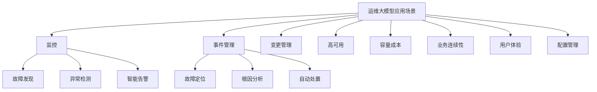

#### 重点应用场景

根据2023年调研数据，企业最期望的运维大模型赋能场景：

**1. 监控与故障管理**（最急迫）
- 故障发现
- 故障定位
- 故障解决

**2. 日志分析**
- 日志文本处理
- 异常模式识别
- 故障检测效率提升

**3. 智能问答 Agent**
- 运维知识库问答
- 历史故障信息查询
- 辅助决策支持
- 新人快速上手

**4. 脚本自动化生成**
- 运维脚本生成
- 自动化任务编排

#### 典型应用案例

**案例1：同创科技 + 复旦大学**
- 共研运维大模型
- 赋能智能运维场景
- 提升故障处理效率

**案例2：中国移动**
- 运维大模型探索
- 异常事件高效解决
- 运维效率提升

### 3.7 研发运维大模型标准体系

**标准定位**：
- 首个研发运维大模型标准
- 聚焦研发、测试、运维场景
- 基于大模型训练框架

**标准架构**：

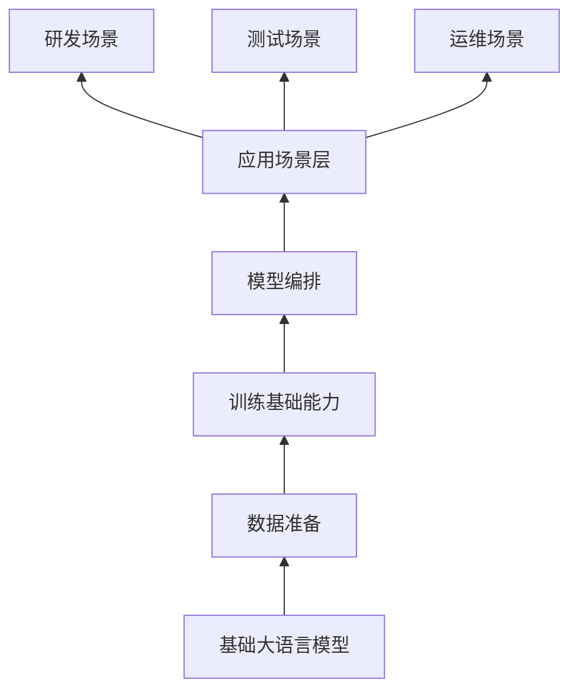

**标准特点**：
- 以应用场景为导向
- 直观展示建设路径
- 指导企业实践落地

---

## 四、未来展望与挑战

### 4.1 核心痛点问题

#### 1. 计算资源紧缺

**问题描述**：
- 大模型训练需要高性能GPU/TPU
- 普通计算资源无法满足需求
- 芯片短缺（英伟达、国产芯片）

**影响**：
- 训练成本高
- 推广受限
- 企业门槛高

#### 2. 数据安全风险

**问题描述**：
- 数据敏感性行业（金融、医疗）担忧
- 用户数据泄露风险
- 敏感信息处理挑战

**解决方案**：
- 私有化部署
- 数据脱敏
- 访问控制

#### 3. 可解释性低（幻觉问题）

**问题描述**：
- "一本正经地胡说八道"
- 对不熟悉场景提供不准确结论
- 影响严肃场景应用

**影响**：
- 准确性存疑
- 无法直接参与决策
- 需要人工验证

**改进方向**：
- 结合知识图谱
- RAG（检索增强生成）技术
- 提高准确率

#### 4. 维护成本高

**成本构成**：
- 计算资源采购成本
- 高能耗运行成本
- 专业人员成本

**挑战**：
- 短期内难以补充专业人才
- 持续投入压力大

#### 5. 难以集成兼容

**问题描述**：
- 与现有系统集成困难
- 技术栈兼容性问题
- 接口标准不统一

#### 6. 难以有效评价

**评价困境**：
- 实际赋能效果不明确
- 投入产出比难以衡量
- 缺乏统一评价标准

### 4.2 痛点问题总结

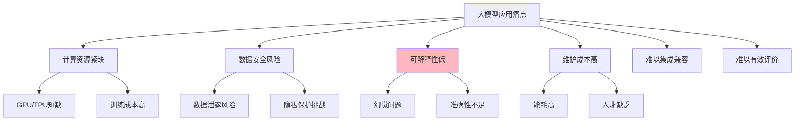

### 4.3 技术改进方向

#### 提升准确性的技术手段

**1. 知识图谱技术**
- 构建领域知识图谱
- 增强语义理解
- 提高特定术语准确性

**2. RAG（检索增强生成）技术**
- 结合外部知识库
- 实时检索相关信息
- 减少幻觉问题

**3. 多模态融合**
- 结合日志、指标、链路数据
- 全面理解系统状态
- 提升分析准确度

#### 数据类型支持

大模型不仅限于日志数据，可处理：
- **非结构化数据**：日志文本（优势领域）
- **结构化数据**：指标数据
- **半结构化数据**：链路追踪数据
- **时序数据**：监控时间序列

### 4.4 未来发展趋势

#### 短期目标（1-2年）

**能力提升**：
- 提高准确率和可靠性
- 降低幻觉问题发生率
- 扩展应用场景

**场景落地**：
- 智能问答Agent普及
- 故障定位效率提升
- 代码生成能力增强

#### 中期目标（3-5年）

**智能化升级**：
- 从"作诗"到"做事"
- 融入生产过程
- 严肃场景应用更准确

**技术融合**：
- 知识图谱 + 大模型
- RAG技术成熟应用
- 多模态能力增强

#### 长期愿景

**理想状态**：
- 大模型成为基础设施
- 全面赋能研发运维
- 实现高度智能化运维（L4-L5级别）

**产业生态**：
- 标准体系完善
- 产品生态丰富
- 行业最佳实践沉淀

### 4.5 企业实践建议

#### 切入点选择

**优先级排序**：
1. **智能问答Agent**（最易落地）
   - 运维知识库问答
   - 历史故障查询
   - 新人培训辅助

2. **故障定位与根因分析**（价值最高）
   - 日志分析
   - 异常检测
   - 根因推断

3. **代码辅助生成**（研发场景）
   - 代码补全
   - 脚本生成
   - 代码审查

#### 实施路径

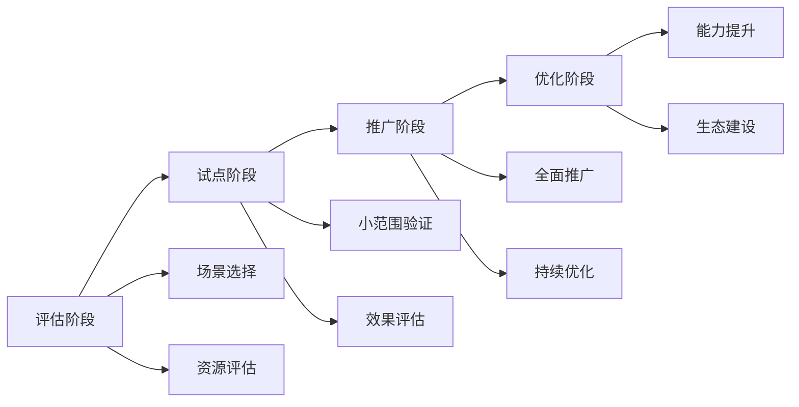

#### 关键成功因素

**技术层面**：
- 选择合适的基座模型
- 准备高质量训练数据
- 持续优化和调优

**组织层面**：
- 组建专业团队
- 建立评估体系
- 推动文化变革

**业务层面**：
- 明确业务价值
- 设定合理预期
- 快速迭代验证

---

## 五、总结

### 5.1 核心观点

1. **运维现代化是必然趋势**
   - 从手工到自动化，再到智能化
   - AIOps + SRE 成为主流方向
   - 大模型为智能化提供新动能

2. **大模型在研发运维领域前景广阔**
   - 代码生成、智能测试已有成熟应用
   - 运维场景（故障定位、日志分析）价值巨大
   - 智能问答Agent是最佳切入点

3. **技术落地需要务实推进**
   - 正视痛点问题（资源、安全、准确性）
   - 采用渐进式实施策略
   - 结合知识图谱、RAG等技术提升效果

4. **标准化建设至关重要**
   - 国际首个智能运维标准已发布
   - 研发运维大模型标准正在制定
   - 为企业实践提供指导

### 5.2 行动建议

**对于企业**：
- 评估自身运维成熟度（L1-L5）
- 选择合适的大模型应用场景
- 采用私有化部署保障数据安全
- 建立效果评估体系

**对于行业**：
- 参与标准制定和最佳实践分享
- 推动开源生态建设
- 加强产学研合作

**对于个人**：
- 学习大模型相关技术
- 关注行业发展趋势
- 提升智能运维能力

---

## 附录

### A. 相关标准与报告

- **中国AIOps现状调查报告（2023）**
- **中国FinOps现状调查报告（2023）**
- **智能运维能力要求标准**
- **IT基础资源运营成熟度模型**
- **ITU智能运维国际标准（2022）**

### B. 参与方式

**智能运维标准研究**：
- 参与单位：70+ 家
- 涵盖行业：互联网、金融、运营商等
- 代表企业：腾讯、阿里、百度、中国移动等

**2024年AIOps现状调查**：
- 重点方向：运维大模型
- 调查内容：应用现状、场景、痛点、实践
- 参与方式：扫描二维码填写问卷

### C. 联系方式

**分享嘉宾**：白鹭
- 单位：中国信息通信研究院云计算与大数据研究所
- 专注领域：DevOps、AIOps、SRE、可观测性、FinOps

---

## 关键术语表

| 术语 | 英文 | 说明 |
|------|------|------|
| **AIOps** | Artificial Intelligence for IT Operations | 智能运维，将AI技术应用于IT运维 |
| **SRE** | Site Reliability Engineering | 站点可靠性工程，Google提出的稳定性实践 |
| **FinOps** | Financial Operations | 金融运营，IT资源精细化管理 |
| **LLM** | Large Language Model | 大语言模型 |
| **RAG** | Retrieval-Augmented Generation | 检索增强生成 |
| **MLOps** | Machine Learning Operations | 机器学习运维 |
| **LLMOps** | Large Language Model Operations | 大语言模型运维 |

---

*本文档整理自白鹭老师在DBA+社群的技术分享，内容涵盖智能运维现状、大模型技术应用及未来趋势。*

*整理时间：2024年*

