# 民生银行的应用运维AIOps实战

> 来源：未核验 · 类型：分享 · 状态：draft


> 分享者：张书伟 | 民生银行生产运营部应用运维团队

## 一、背景介绍

### 1.1 民生银行科技发展趋势

民生银行的科技架构经历了三个重要发展阶段：

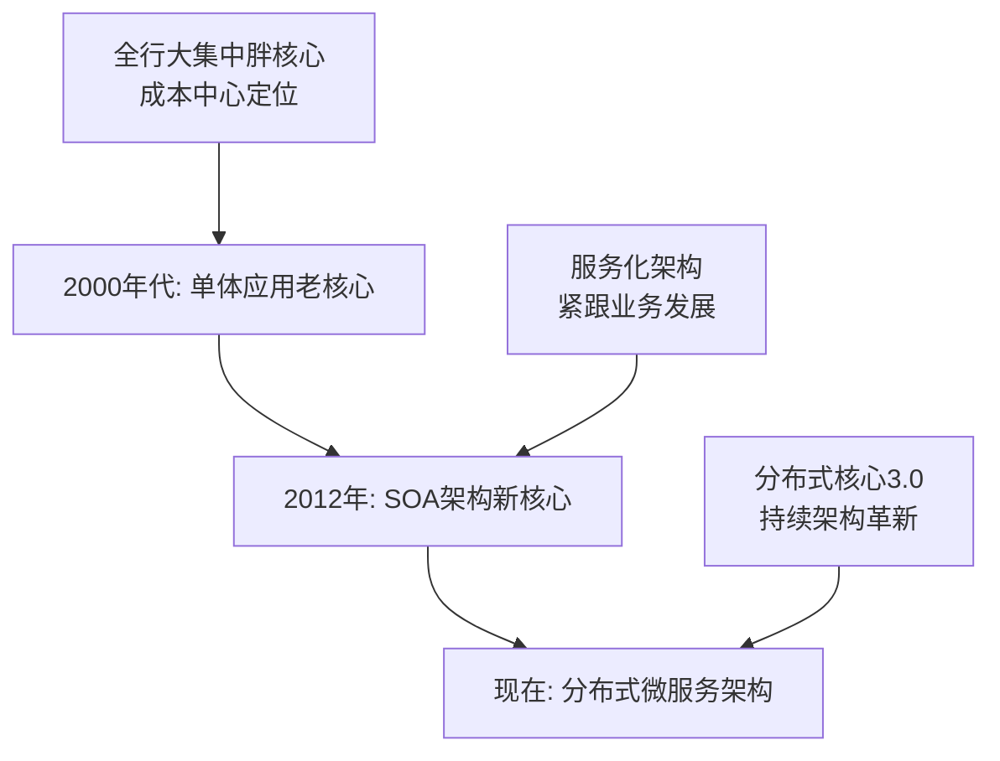

**重要里程碑**：最近上线了分布式核心系统3.0，标志着核心系统全面转向分布式架构。

### 1.2 应用运维团队定位

应用运维（类似SRE）负责全部应用系统的全生命周期管理，是生产系统应急处置的第一责任人。

#### 对外职责

- **面向业务部门**
  - 沟通生产运行情况
  - 提供业务优化反馈
  
- **面向开发测试部门**
  - 支持新项目投产
  - 运维评审能力前置（设计阶段介入）

#### 对内职责

- 作为运维对外窗口，协调内部资源
- 以系统维度推进问题解决
- 驱动系统管理、网络管理、运行监控等团队协作

#### 团队特点

- **80%员工具有开发背景**，是多面手
- 基于SRE理念运作，包括：
  - 服务质量负责制（服务分级、服务依赖）
  - 以发现问题为荣，主动优化
  - 琐事与工具的跷跷板效应
  - 问题跟踪与根因分析
  - 应急管理（优先恢复服务）

## 二、应用运维面临的挑战

### 2.1 整体挑战概述

随着业务创新和技术架构演进，运维面临的复杂度急剧上升：

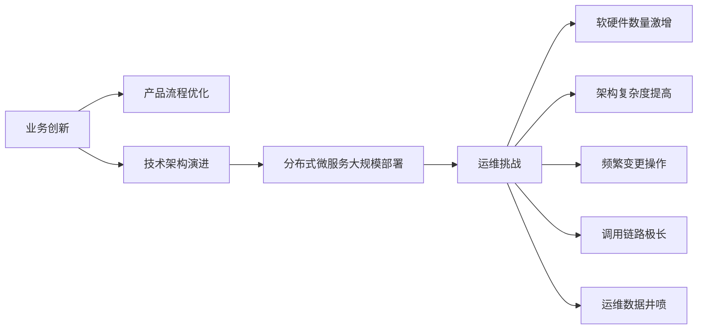

**数据规模**：
- 日志数据：接近20TB/天
- 监控数据：海量
- 交易数据：极大规模

### 2.2 六大核心挑战

#### 1. 基础资源异构

- 新系统采用新架构，老系统使用老架构
- 异构性强，标准化程度低
- 难以统一管理

#### 2. 应用架构不统一

银行应用系统来源多样：
- 基于自研开发平台
- 合作开发
- 直接采购

导致应用架构差异大，难以标准化和复用经验。

#### 3. 调用关系错综复杂

- 调用关系已成网状结构
- 调用链路图完全看不清
- 无人能完全掌握所有调用关系
- 单点故障会蔓延影响多个系统

#### 4. 运维数据井喷

- 各专业条线建立独立运维工具
- 形成数据孤岛
- 专业条线间协作困难
- 数据无法被共享
- 人工无法快速分析海量数据

#### 5. 严重依赖专家经验

- 经验丰富的专家能快速定位问题
- 专家经验难以复用和传承
- 知识主要在专家脑中

#### 6. 频繁变更发布

- 2019年约3000多次应用版本变更发布
- 应用集成关系不断变化
- 新业务新流程不断增加
- 影响分析难以准确进行

### 2.3 故障处理困境

以上挑战导致故障处理过程：
- 非常被动
- 定位困难
- 单纯依靠人力无法解决

## 三、智能运维解决方案

### 3.1 整体架构设计

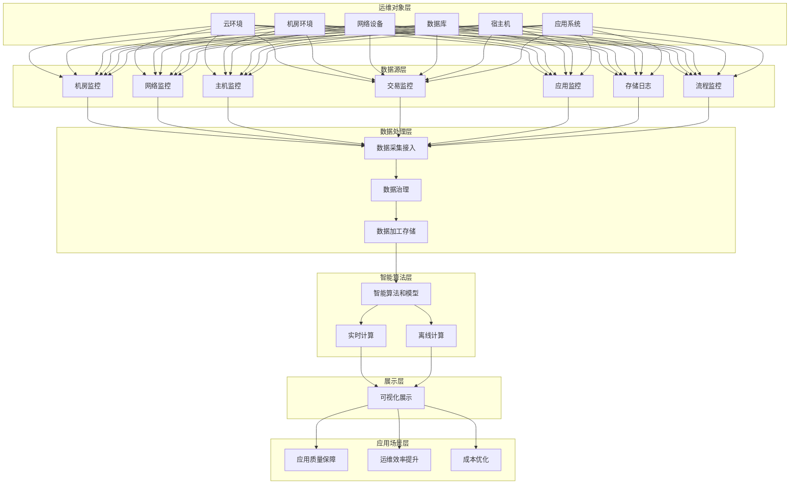

**架构说明**：

- **运维对象层**：真实运行环境中的各类运维对象
- **数据源层**：各类监控工具采集的数据
- **数据处理层**：统一采集、治理、加工和存储
- **智能算法层**：引入算法模型进行分析计算
- **展示层**：可视化展示分析结果
- **应用场景层**：主要聚焦质量保障

### 3.2 运维数据治理

数据是智能运维的基础，数据治理流程：


**关键点**：
- 定义28个标准数据模型
- 通过不断迭代优化数据质量
- 数据质量决定智能运维上限

### 3.3 故障定位方法论

#### 资源拓扑图模型

将数据中心资源整理成图结构，分为横向和纵向两个维度：

**横向维度（交易路径）**：
- 系统间调用关系
- 服务调用关系
- 定位故障系统

**纵向维度（系统内部）**：
- 模块和部署单元
- 操作系统、中间件、数据库
- 监控指标和日志
- 宿主机、网络交换机、存储设备

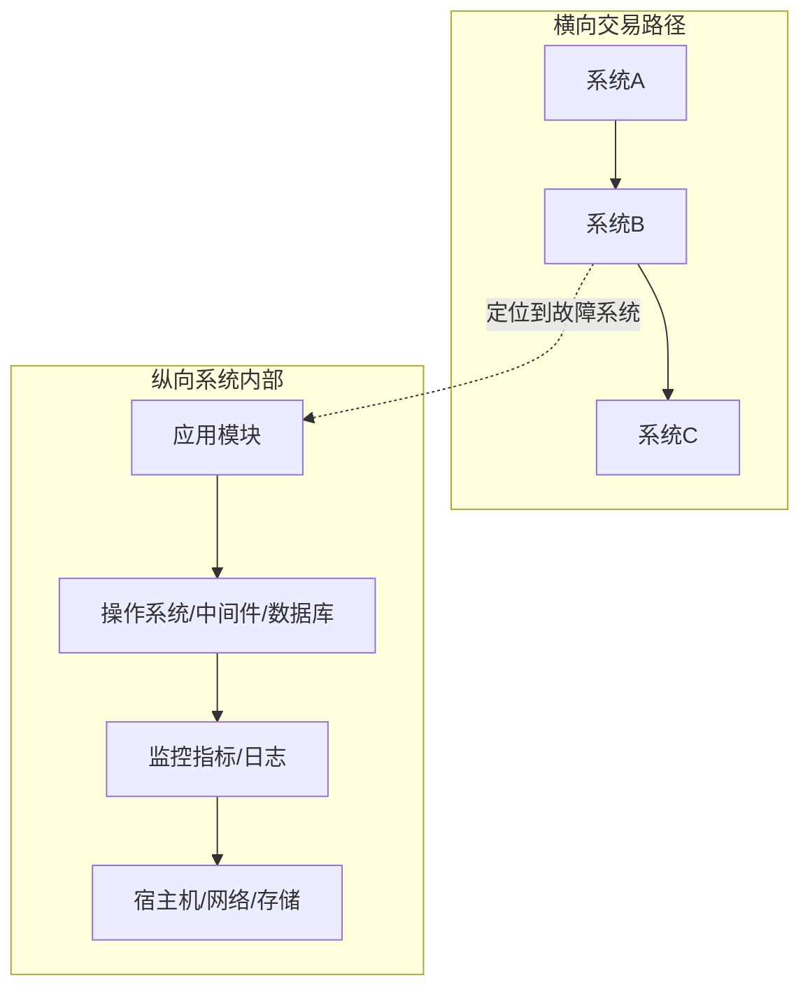

**定位策略**：
1. 先横向定位故障系统
2. 再纵向挖掘故障原因

## 四、故障发现与定位实践

### 4.1 常见故障类型分析

根据统计，故障类型分布如下：

| 故障类型 | 占比 | 主要原因 |
|---------|------|---------|
| 组件性能问题 | 最高 | 交易量突增、应用使用不合理、组件参数设置不当 |
| 基础设施故障 | 较高 | 硬件故障、不合规变更、评估不到位 |
| 调用链路问题 | 较高 | 外部系统引起、故障蔓延 |
| 应用逻辑错误 | 中等 | 设计缺陷、代码缺陷、配置错误 |
| 部分主机故障 | 中等 | 硬件故障、服务假死、内存泄漏 |
| 部分服务故障 | 较低 | 个别服务逻辑或性能问题 |
| 第三方依赖故障 | 最低 | 外部依赖系统故障 |

### 4.2 人工排障经验抽象

借鉴人工排障流程，将经验转化为算法：

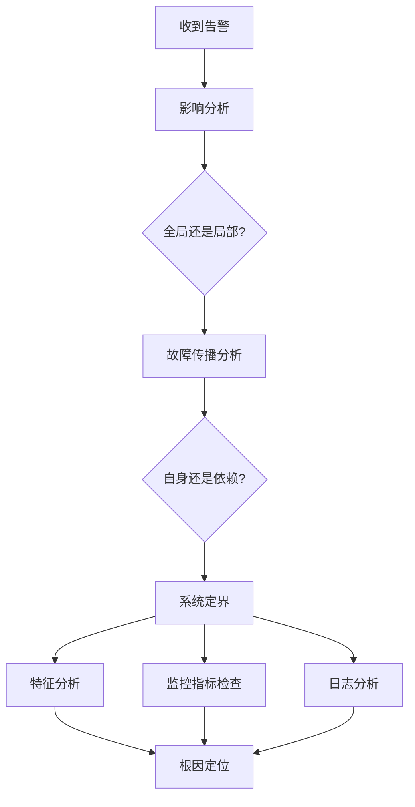

### 4.3 智能运维故障定位流程

将人工流程转化为"数据+算法"形式：

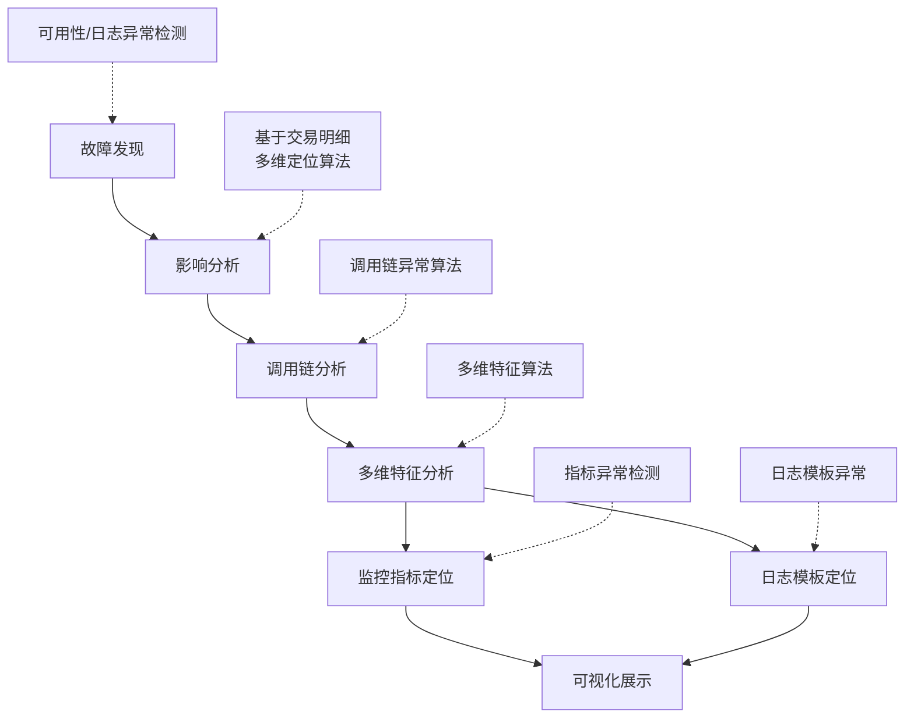

**新增故障发现环节**：
- 传统依赖固定阈值监控或用户反馈
- 新增智能化异常检测，提升及时性

### 4.4 场景一：可用性故障发现

#### 目标

对关键黄金指标进行异常检测：
- 交易量
- 成功率
- 响应率
- 响应时间

#### 挑战

- 同一指标（如成功率）表现形式多样
- 节假日特征与平时不同
- 可能出现规律性尖峰
- 简单算法无法适应复杂场景

#### 解决方案

采用**GBRT（梯度提升回归树）算法**：

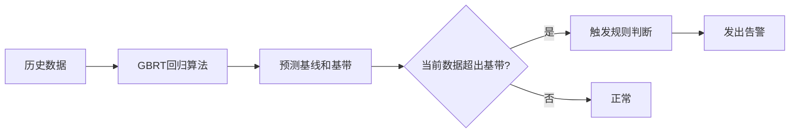

**工作原理**：
1. 根据历史数据预测基线和基带范围
2. 历史数据基本在基带内活动
3. 当前数据超出基带视为异常
4. 结合规则触发告警

#### 实际案例

**内存泄漏导致响应率下降**：
- 比固定阈值方式提前1小时发现问题
- 对于缓慢演进的故障特别有效

### 4.5 场景二：调用链分析

#### 问题背景

- 调用链越来越长，一个服务背后可能有多个系统支撑
- 传统处理方式：逐级排查（"烽火台狼烟"模式）
  - 手机银行出问题 → 查手机银行
  - 发现与第三方支付有关 → 查第三方支付
  - 依次类推，效率低下

#### 目标

提供"上帝视角"，直接定位最可能的故障系统。

#### 数据依赖

- 系统级调用关系
- 服务级调用关系
- 全局流水号（串联每笔交易）

#### 实现方法

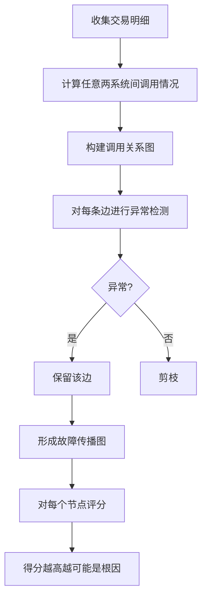

**核心思想**：
1. 构建完整的调用关系图
2. 异常边剪枝，保留异常路径
3. 节点评分，找出最大贡献者

#### 实际案例

多个系统同时报警，通过调用链分析快速定位到底层某个系统，其他系统只需关注影响分析。

### 4.6 场景三：多维特征分析

#### 问题定义

每笔交易由多个维度组成，需要找出故障交易的共同特征。

#### 维度分类

**地理维度**：
- 机房位置
- 分片信息
- 机器编号
- 模块名称

**交互维度**：
- 源系统
- 调用服务
- 返回码
- 响应时间

**业务维度**：
- 对手行信息
- 税务局编号
- 产品编码
- 交易类型

#### 目标

找出异常交易集中在哪些维度或维度组合上。

#### 实现方法

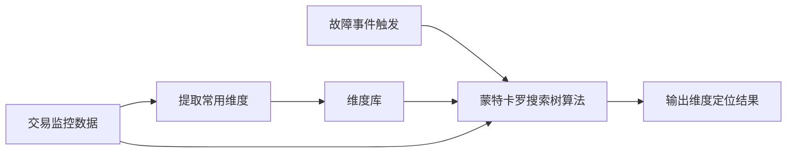

使用**蒙特卡罗搜索树算法**找出问题交易与维度的关联。

#### 实际案例

**案例1：系统成功率降低**
- 定位结果：来自某系统，调用某交易，返回特定返回码
- 价值：快速确定异常来源

**案例2：理财系统交易量增加**
- 定位结果：交易码为"购买产品"，特定产品编码，返回"该产品暂未开放"
- 背景：大额存单抢购活动，产品未开放前客户已开始抢购

**案例3：网银互联成功率低**
- 定位结果：失败交易都与某收款行相关
- 原因：对方行临时签退
- 价值：明确非本行系统问题，无需进一步处理

#### 业务价值

- 运维人员收到告警时能快速了解影响范围
- 减少焦虑感，提升响应信心
- 辅助定位，有经验者可直接看出根因

### 4.7 场景四：监控指标筛查

#### 目标

- 发现传统阈值监控无法发现的问题（如CPU使用率突然下降）
- 快速筛选出与当前故障相关的监控指标
- 辅助根因定位

#### 数据依赖

**CMDB数据**：
- 用于机器分组
- 按分组进行分析和排名

**监控指标层次**：
```
指标类别（如磁盘相关）
  └── 指标类型（如磁盘繁忙率）
      └── 指标实例（如某具体磁盘的繁忙率）
```

运维需求：快速定位到**指标类别**层面。

#### 实现方法

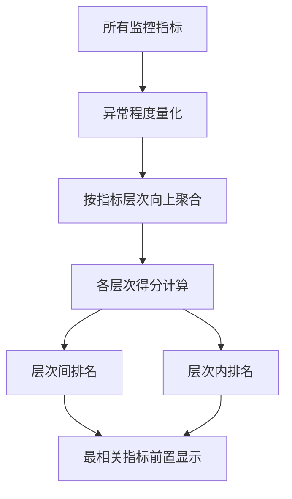

#### 实际案例

**案例1：磁盘繁忙率异常**
- 定位结果：两台机器的多个磁盘繁忙率发生明显变化
- 价值：监控系统未报警，但已影响系统稳定性

**案例2：进程指标异常**
- 定位结果：所有异常都与某进程相关
- 处理：重启该进程后恢复
- 价值：发现细微变化，传统阈值监控难以发现

### 4.8 场景五：日志分析

#### 背景

- 日志内涵丰富，记录系统行为
- 运维工程师非常熟悉日志
- 但日志是非结构化数据，分析难度大
- 数据量巨大（15-20TB/天），人工无法处理

#### 数据规模

- 日志平台：基于ELK
- 日志量：15-20TB/天
- 覆盖范围：200多套应用系统 + 操作系统 + 数据库 + 中间件

#### 实现方法

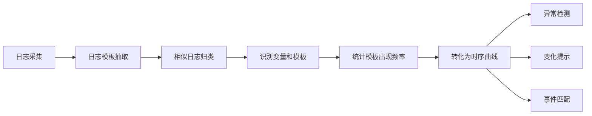

**核心技术**：
1. 日志模板提取：将相似日志归为一类
2. 变量识别：区分变化部分和固定部分
3. 时序分析：将模板出现频率转化为时序数据
4. 异常检测：对时序数据进行异常分析

#### 实际案例

**案例1：文件系统快速增长**
- 现象：日志量激增，文件系统占用快速上升
- 人工分析：花费很长时间未找到原因
- 智能分析发现：
  - 当天日志比前一天多6-7倍
  - 某业务类型日志占比从50%升至75%
  - 某些变量分布发生明显变化
- 价值：快速解释日志异常变化的原因

**案例2：文件句柄过多**
- 定位结果：日志模板包含"too many files open"
- 背景：大集群中的单台机器出现问题
- 价值：大集群中快速定位具体机器

### 4.9 综合案例：响应时间变长

完整的故障定位流程展示：

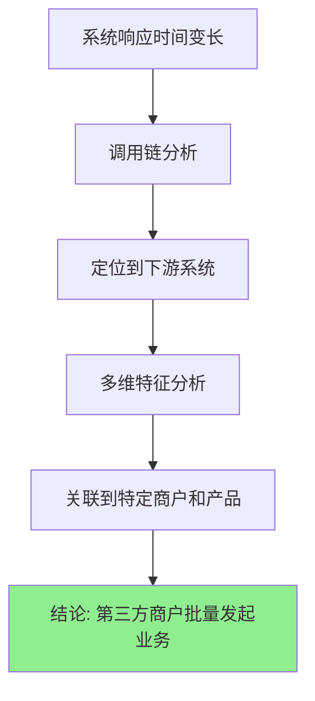

**分析过程**：
1. **问题**：某系统响应时间变长
2. **调用链分析**：指向下游另一个系统
3. **多维特征分析**：与某商户和某产品相关
4. **结论**：第三方商户批量发起业务导致

**价值**：快速定位到外部因素，精准解决问题。

## 五、实践总结与思考

### 5.1 正确认识智能运维

#### 当前阶段定位

- 智能运维处于**初级阶段**，不是万能的
- 仍处于起步阶段，面临诸多挑战
- 需要合理管控预期

#### 面临的挑战

**数据挑战**：
- 问题复杂度高
- 数据复杂度高
- 正常数据占绝大多数，异常数据稀少
- 数据倾斜严重

**算法挑战**：
- 常见机器学习算法主要面向分类问题
- 运维场景直接使用分类算法的场景不多
- 大部分问题需要**无监督学习算法**
- 需要非典型机器学习算法

#### 合理定位

目前主要用于：
- 替代人工流程中**难度大、速度慢、工作量重**的部分
- 提升效率，而非完全自动化

### 5.2 数据质量决定上限

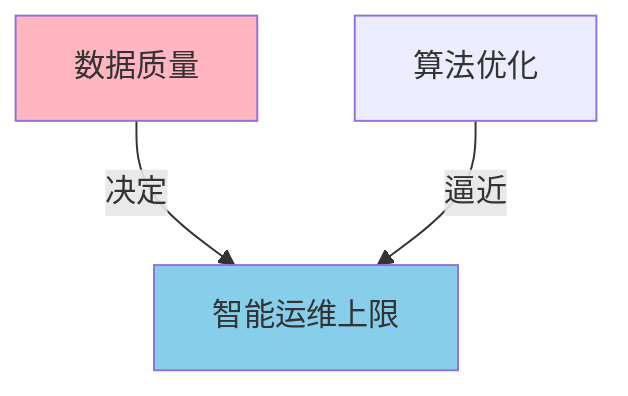

**核心观点**：
- 数据质量决定智能运维能达到的上限
- 好的算法用于逼近数据质量的上限
- 数据质量不高，后续工作无从谈起
- 数据质量高，可通过算法优化提升效果

### 5.3 不要为智能而智能

**黑猫白猫理论**：
- 能解决问题的就是好方法
- 不必迷信算法
- 有些场景用规则也能做得很好
- 不需要强行使用算法

### 5.4 从Demo到产品的鸿沟

**产品化挑战**：
- 从算法Demo到产品存在很大鸿沟
- 产品化过程非常困难
- 需要与现有流程和逻辑融合
- 不要试图颠覆现有体系
- 应该在现有体系上优化和增强

### 5.5 智能运维发展展望

**当前状态**：
- 处于单点突破阶段
- 各个场景独立建设

**未来方向**：
- 将各个场景串联成面
- 解决运维中的常见难题
- 形成体系化能力
- 大有可为

## 六、Q&A精选

### Q1：故障分析的数据源从哪里来？该平台和日志分析平台有什么区别？

**A**：
- **数据源**：多元化
  - 应用监控数据
  - 统一监控数据（服务器、数据库、中间件）
  - CMDB数据
  - 日志数据
  
- **与日志分析平台的区别**：
  - 日志分析平台：采集日志，分析服务运行情况
  - 智能运维平台：在多种数据源基础上，实现故障发现和定位
  - 日志是数据源之一，不是全部

### Q2：基础资源监控中，集群硬件配置不同，如何取健康基线？

**A**：
- 采用**纵向比较**而非横向比较
- 不同机器之间不做比较
- 只看单机自身历史表现
- 例如：
  - 机器A平时CPU在20%-40%，现在飙到60%-80%，判定为异常
  - 机器B平时CPU在60%-70%，现在还在60%-70%，判定为正常

**不足**：方法相对粗糙，后续会优化

### Q3：黄金指标如何采集？

**A**：两种途径
1. **流量镜像方案**：
   - 镜像生产流量
   - 网络抓包
   - 解包分析
   - 提取系统运行情况

2. **自研开发平台**：
   - 类似APM功能
   - 直接输出黄金指标

### Q4：金融行业分布式存储故障自愈和磁盘故障预测，能否借鉴该算法模型？

**A**：
- 存储是相对较窄、较专的领域
- 当前方法论主要面向应用系统
- 存储问题更确定，数据更有限
- 方法论可以借鉴，但算法可能需要更精准的定制化方案

### Q5：海量监控数据如何深度挖掘和利用，实现价值最大化？

**A**：
- **第一步**：数据集中
  - 各监控工具统一输出数据
  - 避免数据孤岛
  - 提高协作能力

- **第二步**：多团队消费
  - 智能运维团队：故障分析
  - 可视化团队：展示分析
  - 专项团队：特定领域分析

- **关键**：数据共享才能发挥最大价值

### Q6：日志异常检测中，模板数量多且新增应用产生新模板告警，如何减少误报？

**A**：
- 前置筛选和过滤
- 接入最关心的日志（如错误日志、异常日志）
- 其他日志暂不接入
- 逐步扩展覆盖范围

### Q7：是否考虑周期性指标异常检测？

**A**：
- 已考虑并实现
- 使用回归算法处理周期性指标
- 算法会自动考虑周期性因素

### Q8：是否考虑不同指标的相关性？

**A**：
- 当前未考虑
- 计划在异常定位阶段引入
- 利用指标间的关系进行辅助定位
- 相关性高的指标组合更可能与故障相关

## 七、关键要点回顾

### 智能运维考虑因素

1. **数据治理是基础**：数据质量决定上限
2. **合理管控预期**：不要期望完全自动化
3. **从人工经验出发**：借鉴人工排障流程
4. **算法选择灵活**：多数场景需要无监督学习
5. **融合现有流程**：不要试图颠覆，而是增强
6. **单点到体系**：从场景化逐步走向体系化

### 实践过程与落地细节

1. **架构分层设计**：从运维对象到应用场景的六层架构
2. **数据模型标准化**：定义28个数据模型
3. **横纵结合定位**：横向定位故障系统，纵向挖掘根因
4. **算法选型多样**：GBRT、蒙特卡罗搜索树、异常检测等
5. **产品化困难重重**：从Demo到产品需要大量工作

### 应用效果

1. **可用性故障发现**：提前1小时发现问题
2. **调用链分析**：从"烽火台"到"上帝视角"
3. **多维特征分析**：快速确定影响范围，降低焦虑
4. **监控指标筛查**：发现传统监控无法发现的细微异常
5. **日志分析**：海量非结构化数据快速提取关键信息

---

**总结**：民生银行的AIOps实践展示了从理论到落地的完整路径。通过合理的架构设计、扎实的数据治理、借鉴人工经验的算法设计，以及在多个场景的实践验证，证明了智能运维在银行应用运维场景中的实际价值。虽然面临诸多挑战，但通过正确认识、合理定位、持续优化，智能运维在提升运维效率、保障系统稳定性方面大有可为。

