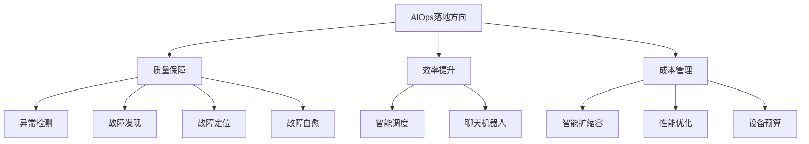
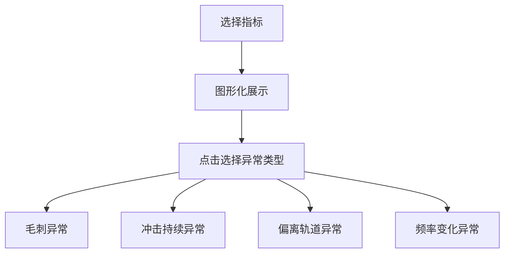
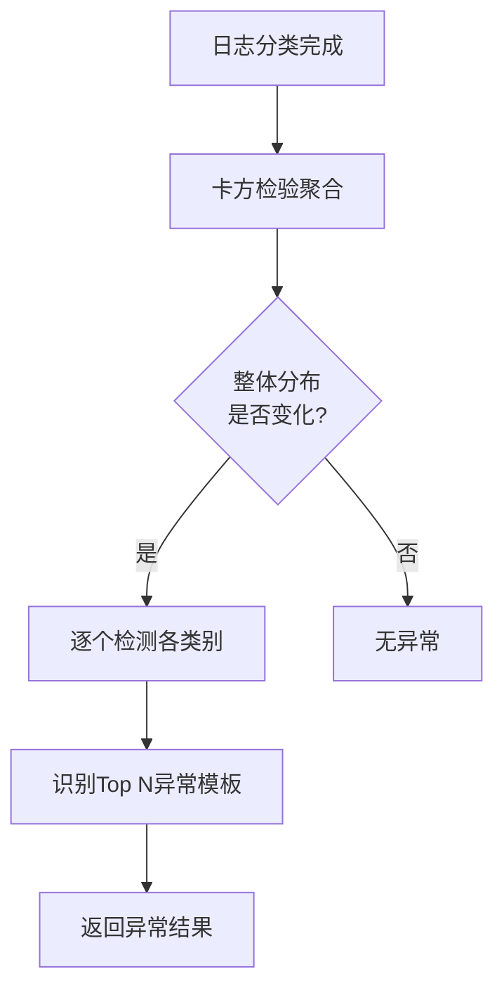
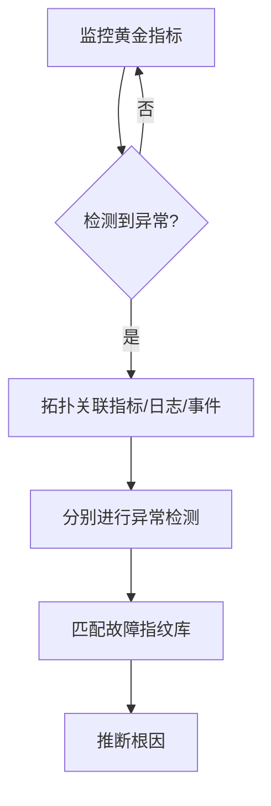
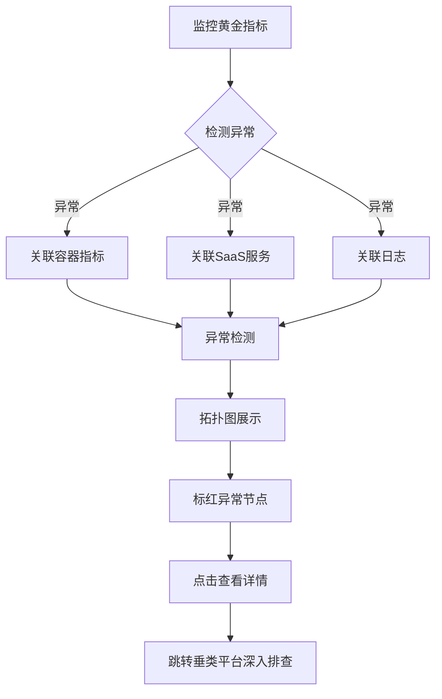
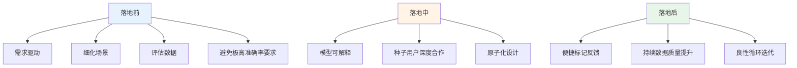

# 网易游戏AIOps落地的普适性路径

> 来源：未核验 · 类型：分享 · 状态：draft


## 分享概述

**分享主题**: AIOps落地的普适性路径与实践

**核心议题**:
- AIOps一般从哪些场景开始落地应用?
- 如何评估某个场景是否适合落地AIOps?
- AIOps在网易互娱的落地路径和成效,包括异常检测、预测、故障定位、日志分析等功能从0到1的落地过程

**内容结构**:
1. 落地可行性分析
2. 已落地的实践案例
3. 经验总结及未来规划

---

## 一、AIOps背景与行业现状

### 1.1 什么是AIOps

AIOps(智能运维)是将人工智能的能力与运维场景相结合,以数据作为生产资料,AI作为分析工具,通过机器学习的方法去提升运维效率。

### 1.2 行业发展趋势

- **2017年**: Gartner提出AIOps概念
- **2020年**: 整体规模达到9-15亿美元
- **2025年**: 预计达到20亿美元规模,增速约19%

业界各大厂都已陆陆续续开展了AIOps相关实践,证明其在运维场景确实具有降本增效的能力。

### 1.3 业界主要落地方向

根据业界白皮书,主要在三个方向有落地场景:



---

## 二、AIOps落地可行性分析

### 2.1 外部行业分析

需要了解业界的落地场景和指导方向,主要关注:
- 质量保障: 异常检测、故障发现、故障定位、故障自愈
- 效率提升: 智能调度、聊天机器人等
- 成本管理: 智能扩缩容、性能优化、设备预算

### 2.2 内部场景评估

**网易游戏业务特点**:
- 多个游戏事业部(阴阳师、大话西游、梦幻西游、第五人格等)
- 丰富的运维平台(监控服务、日志服务、CMDB数据库、容器管理等)
- 业务多、平台多、机会多

**定位**: AIOps作为底层AI组件能力,为各平台提供AI功能,间接支撑上游游戏业务稳定运行。

### 2.3 技术要求评估

AI落地对数据要求非常高,需要从三个维度评估场景:

#### 2.3.1 数据量级

- 样本是模型训练的基础,数据量必须充足
- 数据量少的场景,普通人工规则即可覆盖,模型难以发挥作用

#### 2.3.2 数据类型丰富

以异常检测为例(可看作二分类模型):
- 正负样本要足够且相对对等
- 异常类型要多样化: 频率波动异常、毛刺异常、抬升异常等
- 覆盖多种异常类型才能提升模型泛化性

#### 2.3.3 数据规范

- 数据相对干净可大大减少预处理难度
- 减少数据加工、填充、提纯等工作量

### 2.4 场景优先级评估

通过三个维度对筛选出的场景进行打分:

| 评估维度 | 说明 | 价值 |
|---------|------|------|
| **需求度** | 选择用户认为重要且紧急的场景 | 用户更愿意配合落地,满意度高 |
| **场景通用** | 可快速低成本扩展到其他业务 | 扩大模型影响面和应用面 |
| **成熟方案** | 业界有成熟解决方案 | 证明落地可行性高,干扰少 |

### 2.5 网易游戏的落地路径


**当前成果**:
- ✅ 已完成: 故障发现、预测、定位的落地
- 🔄 计划中: 故障自愈、复盘层面的探索
- 🔄 其他方向: 资源预估、智能调度、智能问答

---

## 三、落地实践案例

### 3.1 案例一: 时序数据异常检测

#### 3.1.1 用户痛点

调研报警平台用户后,发现使用阈值报警时遇到四大难点:

1. **不知道阈值设置多少合适**
2. **业务量变化需要频繁调整阈值** - 业务有周期性波动,不可能每次都手动调整
3. **定期活动触发误报** - ToC产品的拉新、促销活动导致可预期的流量突增
4. **同一指标不同实体阈值不同** - 例如不同服务的容器CPU空闲率阈值不同,无法逐台配置

#### 3.1.2 异常检测1.0版本

**模型设计**:
- 有监督学习: 集成多个模型
- 无监督学习: Three Sigma模型(业界常用)

**效果**: 大部分解决了上述四个问题

#### 3.1.3 新的挑战

使用一段时间后出现六大挑战:

| 挑战 | 具体问题 | 影响 |
|------|---------|------|
| 1. 误报漏报多 | 不同业务/指标对异常定义不同 | 同一模型无法覆盖所有场景 |
| 2. 异常定义差异 | 平滑指标vs波动指标,上升vs下降敏感度不同 | 准确率不足 |
| 3. 配置困难 | 用户不理解模型区别和灵敏度设置 | 理解成本高 |
| 4. 不定期维护误报 | 无法从历史数据学习 | 无法预估 |
| 5. 可解释性差 | 用户不理解为何报警/不报警 | 用户接受度低 |
| 6. 无反馈机制 | 无法及时发现使用问题 | 用户流失 |

#### 3.1.4 异常检测2.0优化方案

**优化措施**:

1. **细分场景** - 将异常细化为四类,分别提供不同模型:
   - 毛刺异常
   - 冲击持续异常
   - 偏离轨道异常
   - 频率变化异常

2. **增加统计学策略** - 提升模型可解释性

3. **图文配置界面** - 优化用户体验



4. **维护/活动标签** - 业务打标签,检测时读取标签避免误报(依赖业务配合)

5. **一键标注入库** - 报警图文中提供一键标注链接,1秒完成数据标注

**落地成果**:
- 多次帮助业务发现QPS、在线人数等业务指标异常
- 准确率平均达到**85%**
- 用户体验和准确性大幅提升

---

### 3.2 案例二: 日志异常分析

#### 3.2.1 用户痛点

调研程序和QA后,发现日志场景的三大难点:

1. **海量报警** - 系统异常时收到大量报警,夸张的项目一天1万多条
2. **影响面不清** - 不清楚有多少问题,是否同一原因导致
3. **新版本变化无感知** - 只关注ERROR/WARNING,INFO日志中的潜在问题易被忽略

**核心问题**: 量级大、格式多、人工难以归类

#### 3.2.2 日志异常分析方案

功能分为两大模块:

**1. 日志智能分类**

使用文本聚类算法,将相似日志合并为一个类,提取公共部分形成日志Pattern。


**示例**:
```
原始日志1: User 12345 login from 192.168.1.1
原始日志2: User 67890 login from 192.168.1.2

合并后Pattern: User <变量> login from <变量>
```

**2. 日志异常检测**

对每个类别的日志数量进行异常检测:
1. 用卡方检验聚合不同模板的日志数量
2. 检查整体分布变化
3. 发现变化时,逐个检测各类别数量
4. 返回异常变化最大的Top N模板



**分布变化示例**:
- 正常: A类20% B类20% C类20% D类20% E类20%
- 异常: A类40%↑ B类5%↓ C类20% D类20% E类15%
- 结果: 返回A类和B类异常

#### 3.2.3 应用场景

**场景1: 异常分析报警**

实际案例: 某项目收到日志报警,人工排查发现GC飙升,需要优化逻辑。

**场景2: 日志报警收敛**

- 原始方式: 每条原始日志报警一次
- 优化后: 使用模板报警
- **效果**: 整体降低日志干扰率约50%,部分规范项目压缩1000+倍

#### 3.2.4 面临的挑战与解决方案

| 挑战 | 解决方案 |
|------|---------|
| **模板多,评估准确率难** | 分层抽取100个模板,不合理点<5个即认为可用 |
| **不同长度日志被强制分类** | 基于一次分类结果做二次聚类 |
| **模板数量持续增加** | 减枝策略: 一个月内无新日志流入的模板自动删除 |

**为何不直接用二次聚类算法?**
- 二次算法可避免长度问题,但计算性能差、耗时长
- 采用两个模型串联,兼顾准确率和效率

---

### 3.3 案例三: 故障预测

#### 3.3.1 设计思路

吸取异常检测教训,一开始就细化场景:
- 根据预测时长分类
- 根据曲线是否有周期性分类
- 为不同场景提供对应模型

#### 3.3.2 应用场景

- 机器磁盘使用量预测
- 资源使用量预测
- 流量预测

---

### 3.4 案例四: 故障定位(根因分析)

#### 3.4.1 需求调研

**使用角色**: 程序员、SRE、QA

**三大痛点**:
1. **架构复杂** - 游戏日志架构复杂,链路长(混合云、微服务)
2. **报警零散** - 故障产生多个报警,依赖经验人员归类和排查根因
3. **经验难复用** - 资深程序1小时排查,新人可能10小时都无法解决,专家经验未沉淀

#### 3.4.2 业界方案对比

**方案一: 聚合分析法**


- **优势**: 数据来源广
- **劣势**: 对数据规范性要求极高

**方案二: 下钻关联分析法**



- **优势**: 检测量级可控,噪声少
- **劣势**: 依赖故障指纹库积累

**故障指纹库**: 保存历史故障现场和根因标签,后续故障通过现场比对匹配根因。

#### 3.4.3 网易游戏的选择

**选择方案二的原因**:
- 内部平台多,业务多
- 同一标签在不同平台的含义和使用习惯不同
- 数据规范性不足以支持方案一

#### 3.4.4 实现方案

**监控对象**: 在线人数、QPS等玩家相关的黄金指标

**分析流程**:



**功能特性**:

1. **拓扑图可视化**
   - 节点代表群组/容器/服务
   - 异常节点标红
   - 点击查看具体指标和日志

2. **体验优化**
   - 支持隐藏正常节点(大型游戏架构复杂时减少干扰)
   - 一键标注根因(沉淀为故障指纹库)

3. **深度排查**
   - 提供链接跳转到专业垂类平台
   - 进行更详细的排查分析

---

## 四、经验总结

### 4.1 落地前的准则

#### 4.1.1 需求驱动

✅ **正确做法**: 内部真实需求驱动

❌ **错误做法**: 看到业界新功能觉得有趣就开始做

#### 4.1.2 明确且细化场景

- 通用性和准确率难以兼得
- 将场景尽量拆分
- 为不同场景提供不同模型以提升准确率

#### 4.1.3 避免极高准确率要求的场景

- 模型很难做到100%准确率
- 如果场景要求必须100%,即使99%的模型在实际场景中也不可用
- 选择对准确率容忍度较高的场景

#### 4.1.4 评估数据质量和数量

落地前必须确认数据是否满足要求(参考2.3节的三个维度)

### 4.2 落地中的要点

#### 4.2.1 模型设计原则

**1. 保证可解释性**
- 用户需要理解模型为何做出某个判断
- 增加统计学策略辅助解释

**2. 深度合作种子用户**
- ❌ 不要一开始就追求推广到10个项目
- ✅ 挑选1-3个愿意合作的种子项目
- ✅ 集中精力做好最佳实践
- ✅ 后期推广更容易

**3. 原子化模型设计**
- 将模型拆分为原子级别
- 后续可灵活组合,支持通用和定制场景

### 4.3 落地后的机制

#### 4.3.1 完善模型优化机制

**1. 便捷的标记功能**
- 提供用户自主标记的地方
- 降低标记成本,提高配合意愿
- 低成本高效收集样本迭代

**2. 持续提升数据质量**
- 观察后续可能使用的关联数据
- 提前布局相关方,提升数据质量
- 形成数据提升→模型优化的良性循环

### 4.4 落地路径总结



---

## 五、未来规划

### 5.1 持续探索方向

在质量、效率、成本三个方向持续探索:

| 方向 | 规划内容 |
|------|---------|
| **质量** | 故障指纹库累积、故障自愈、自动复盘 |
| **效率** | 智能调度、智能问答 |
| **成本** | 变更性能优化、资源预估 |

### 5.2 自愈场景探索

**当前状态**:
- 已实现部分自动化(非智能化)
- 基于人工梳理的规则执行自愈
- 覆盖简单场景: 重启机器等

**未来方向**:
- 从自动化向智能化演进
- 积累更多故障处理经验
- 扩展自愈场景覆盖面

---

## 六、核心要点回顾

### 6.1 AIOps落地场景选择

**三大方向**:
1. **质量保障** - 异常检测、预测、故障定位、自愈(优先级最高)
2. **效率提升** - 智能调度、智能问答
3. **成本管理** - 智能扩缩容、性能优化

### 6.2 场景评估方法论

**数据维度**(必要条件):
- 数据量级充足
- 数据类型丰富
- 数据规范干净

**优先级维度**(打分排序):
- 需求度(重要且紧急)
- 场景通用性
- 成熟方案参考

### 6.3 网易游戏落地成果

| 功能 | 版本演进 | 核心成果 |
|------|---------|---------|
| **异常检测** | 1.0→2.0 | 准确率85%,细分4类异常,图文配置 |
| **日志分析** | 智能分类+异常检测 | 报警收敛50%,部分场景压缩1000+倍 |
| **故障预测** | 细化场景 | 覆盖磁盘、资源、流量预测 |
| **故障定位** | 拓扑关联分析 | 可视化根因分析,沉淀故障指纹库 |

### 6.4 关键成功因素

1. ✅ **需求驱动,而非技术驱动**
2. ✅ **场景细分,提升准确率**
3. ✅ **种子用户深度合作**
4. ✅ **模型可解释性**
5. ✅ **便捷的反馈机制**
6. ✅ **持续的数据质量提升**

---

## 七、Q&A精选

**Q1: 检测到异常后,会对异常进行自动化处理吗?效果如何?**

A: 目前有一些基于人工梳理规则的自动化自愈(非智能化),覆盖简单场景如重启机器等。尚未实现完全智能化的自愈。

**Q2: AIOps在哪些场景下可以实现无人值守运维?**

A: 
- 异常自动发现: 已实现
- 故障自愈: 依赖前期人工经验自动化,仅覆盖简单场景(如机器重启)
- 完全无人值守: 目前还需要人工介入复杂场景

**Q3: 如何减小存储和计算压力?**

A: 从业务层面考虑重要度,例如:
- 日志模板: 一个月无新增的模板可删除
- 根据业务关注点进行数据减枝
- 重点保留业务真正关心的数据

---

## 总结

网易游戏的AIOps落地实践展示了一条**从评估到落地再到优化**的完整路径。其核心经验在于:

1. **科学评估**: 从外部行业、内部场景、技术要求三个维度全面评估
2. **小步快跑**: 从种子用户开始,逐步扩展,避免贪大求全
3. **持续迭代**: 建立反馈机制,不断优化模型和产品体验
4. **场景细分**: 不追求通用模型,而是为不同场景提供专用模型
5. **用户体验**: 注重可解释性和易用性,降低用户使用门槛

这些经验对其他企业落地AIOps具有重要的参考价值,特别是在场景选择、优先级评估、迭代策略等方面提供了可复制的方法论。

---

**分享者**: 网易游戏AIOps团队

**适用对象**: SRE工程师、运维工程师、稳定性保障工程师

**关键词**: #AIOps #智能运维 #异常检测 #故障定位 #日志分析 #根因分析


