# 网易游戏AIOps探索与实践

> 来源：未核验 · 类型：分享 · 状态：draft


> 分享单位：网易游戏技术中心  
> 分享嘉宾：孙望  
> 受众人群：SRE、运维及稳定性保障工程师  
> 核心主题：智能运维平台演进与AIOps落地实践

## 目录

- [一、运维目标与AIOps概述](#一运维目标与aiops概述)
- [二、异常检测实践](#二异常检测实践)
- [三、日志分析实践](#三日志分析实践)
- [四、故障定位实践](#四故障定位实践)
- [五、未来规划](#五未来规划)
- [六、Q&A精选](#六qa精选)

---

## 一、运维目标与AIOps概述

### 1.1 运维目标

**核心目标：**
> 在保证服务质量的前提下，降低成本，提高运维效率。

**支撑体系：**

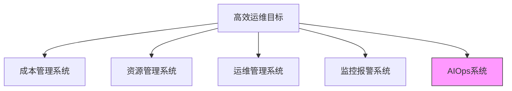

### 1.2 什么是AIOps

**定义：**
> 通过大数据和算法能力提取数据中的信息价值，为后续IT运维管理提供支撑。

**AIOps应用领域：**

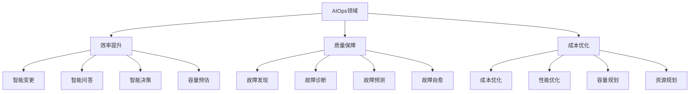

**本次分享重点：质量方面**
- 故障发现
- 故障诊断

### 1.3 网易游戏AIOps演进历程

**时间线：**

| 年份 | 里程碑 |
|------|--------|
| 2016年 | 成立智能监控平台 |
| 2016-至今 | 持续探索与实践 |

**落地模块：**
- 异常检测
- 预测管理分析
- 日志分析
- 运维机器人
- 故障定位
- 故障预警

**本次分享重点模块：**
1. 异常检测
2. 日志分析
3. 故障定位

---

## 二、异常检测实践

### 2.1 为什么需要异常检测

**传统阈值报警的问题：**

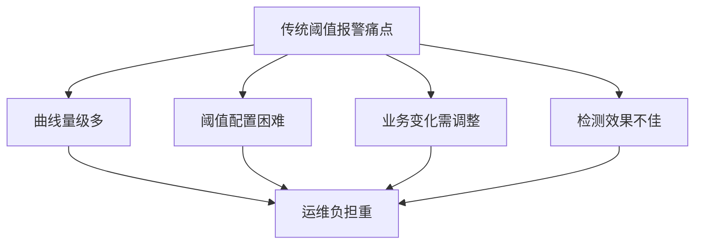

**异常检测的优势：**
- 不需要人工设定阈值
- 灵活贴近业务特性
- 提供更精准的告警
- 结合人工标注自动迭代
- 模型越来越准确

### 2.2 异常检测场景划分

**根据AIOps白皮书定义：**
> 异常检测是通过AI算法自动、实时、准确地从监控数据中发现异常，为后续诊断治愈提供基础。

**三大场景分类：**

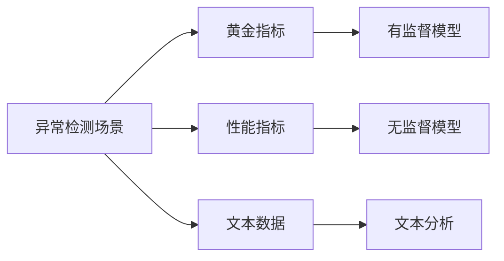

#### 2.2.1 场景一：黄金指标

**特征：**

| 维度 | 特点 |
|------|------|
| 指标类型 | 游戏在线人数、业务SLO等关键指标 |
| 周期性 | 周期性强 |
| 曲线稳定性 | 相对稳定 |
| 量级 | 几千到几万条曲线 |
| 准确率要求 | 非常高，不接受漏报误报 |
| 召回率要求 | 非常高 |

**适用场景：**
- 核心业务指标监控
- 关键SLO监控

#### 2.2.2 场景二：性能指标

**特征：**

| 维度 | 特点 |
|------|------|
| 指标类型 | CPU、内存、网络等 |
| 曲线形态 | 差异非常大 |
| 量级 | 几十万到千万级 |
| 周期性 | 不确定（1天/半天/几小时/无周期） |
| 异常认知 | 不同指标差异大 |
| 准确率要求 | 相对较低 |

**异常认知差异示例：**
- **内存**：关注缓慢增长（泄漏），不关心突增突降
- **其他指标**：可能关注突增突降

**适用场景：**
- 内存监控
- CPU监控
- 消息队列堆积监控

#### 2.2.3 场景三：文本数据

**特征：**

| 维度 | 特点 |
|------|------|
| 数据类型 | 非结构化数据 |
| 数据来源 | 日志、缺陷等 |
| 量级 | 非常大 |
| 性能要求 | 高 |

**适用场景：**
- 错误日志监控
- 日志精简优化

### 2.3 黄金指标：有监督模型

#### 2.3.1 有监督模型特点

**优点：**
- ✅ 高准确率
- ✅ 高召回率
- ✅ 高扩展性

**缺点：**
- ❌ 需要人工标注样本（标注成本高）
- ❌ 可解释性差（黑盒子）
- ❌ 需要持续迭代维护

#### 2.3.2 有监督算法框架

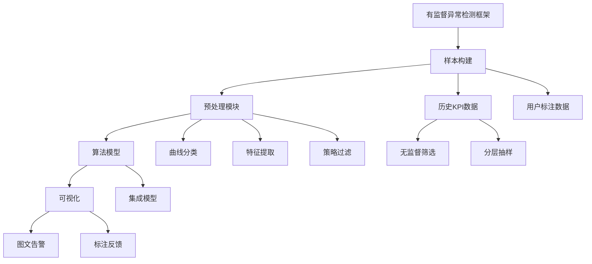

**第一步：样本构建**

**样本来源：**

1. **历史数据KPI**
   ```mermaid
   graph LR
       A[历史数据] --> B[无监督方法]
       B --> C[IForest等]
       C --> D[疑似异常样本]
       D --> E[分层抽样]
       E --> F[人工标注]
       F --> G[训练集/测试集]
   ```

2. **用户标注数据**
   - 项目隔离：每个项目的标注数据独立
   - 千人千面：实现项目定制化
   - 避免交叉影响：A项目标注不影响B项目

**样本比例：**
- 异常样本：正常样本 = **1:4**
- 不需要完全均衡
- 测试验证效果稳定

**第二步：预处理模块**

**1. 曲线分类**
- 对曲线进行分类
- 不同类别采用不同模型
- 差异主要在样本，特征和算法相同

**2. 特征提取**

| 特征类型 | 示例 |
|---------|------|
| 统计特征 | 均值、方差、标准差 |
| 拟合特征 | 趋势拟合 |
| 分类特征 | 类别特征 |
| 滤波特征 | 噪声过滤 |
| 自定义特征 | 业务规则特征 |

**3. 策略过滤**
- 目的：减少计算压力
- 方法：简单无监督模型预过滤
- 效果：明显异常/正常样本直接输出结果

**第三步：算法模型**
- 常见树模型
- 集成学习

**第四步：可视化**

**图文告警方式：**


**效果：**
- 准确率：**90%+**
- 用户反馈：基本符合预期
- 漏报情况：非常少

### 2.4 性能指标：无监督模型

#### 2.4.1 无监督模型特点

**优点：**
- ✅ 训练成本低（不需要预训练）
- ✅ 可解释性强（可以解释为什么报警）
- ✅ 易于迭代（调整参数即可）

**缺点：**
- ❌ 性能要求高（量级大）
- ❌ 不能使用复杂模型（如深度学习）
- ❌ 场景差异大（需要适配不同场景）
- ❌ 曲线千奇百怪

#### 2.4.2 异常类型划分

**四种异常类型：**

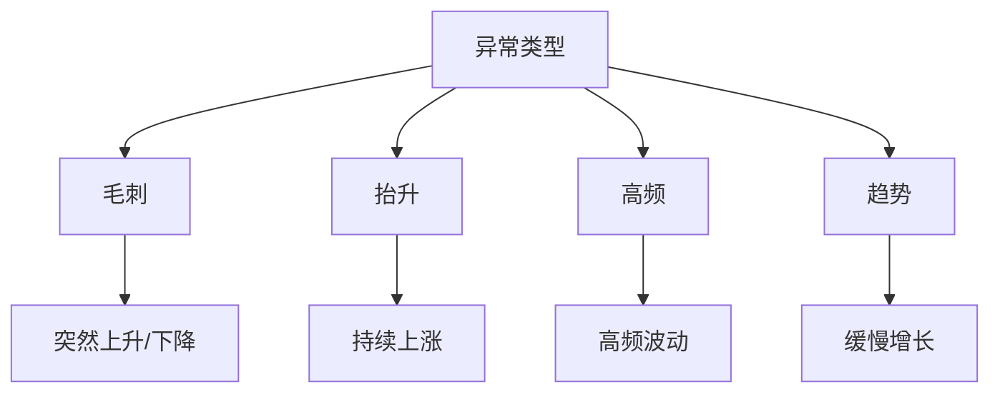

**定制化效果：**
- 用户可选择需要的异常类型
- 实现场景定制化

#### 2.4.3 四种异常检测算法

**1. 毛刺检测**

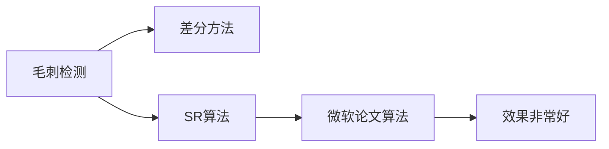

**特点：**
- 最常见的异常类型
- 最容易识别
- 简单差分即可识别
- SR算法效果更好（微软论文）

**2. 抬升检测**

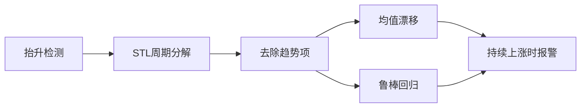

**特点：**
- 与毛刺区分
- 毛刺时不报警
- 持续上涨时才报警

**3. 高频检测**


**特点：**
- 与毛刺相似
- 采用多步差分

**4. 趋势检测**

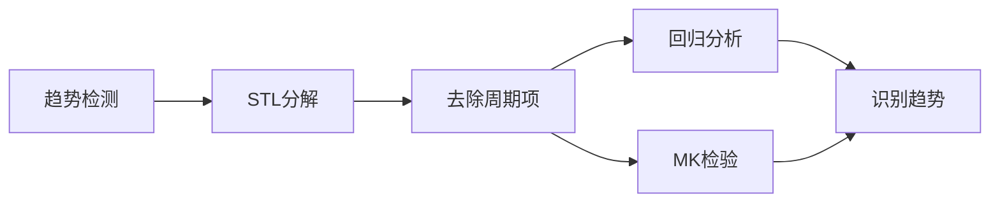

**典型场景：**
- 内存泄漏检测

**周期性抑制：**
- 所有模型都需要周期性抑制
- 屏蔽业务周期性波动
- 避免同一时间重复报警

#### 2.4.4 效果评估

**准确率：80%+**

**用户反馈：**
- 相比固定阈值好很多
- 报警量少很多
- 误报漏报大幅减少
- 基本达到可用状态

### 2.5 案例：在线人数下降

**故障场景：**
- 游戏在线人数下降
- ETCD集群不通
- 某个服务不可用
- 大量玩家掉线

**告警消息特点：**

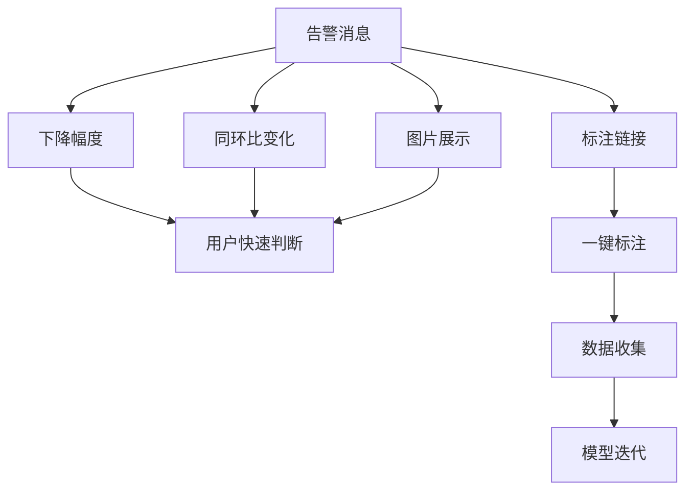

**告警消息包含：**
1. 下降幅度数值
2. 同环比变化
3. 曲线图片
4. 标注链接

**价值：**
- 用户一眼判断准确性
- 完成标注闭环
- 算法持续优化

---

## 三、日志分析实践

### 3.1 日志分析的必要性

**传统日志报警问题：**

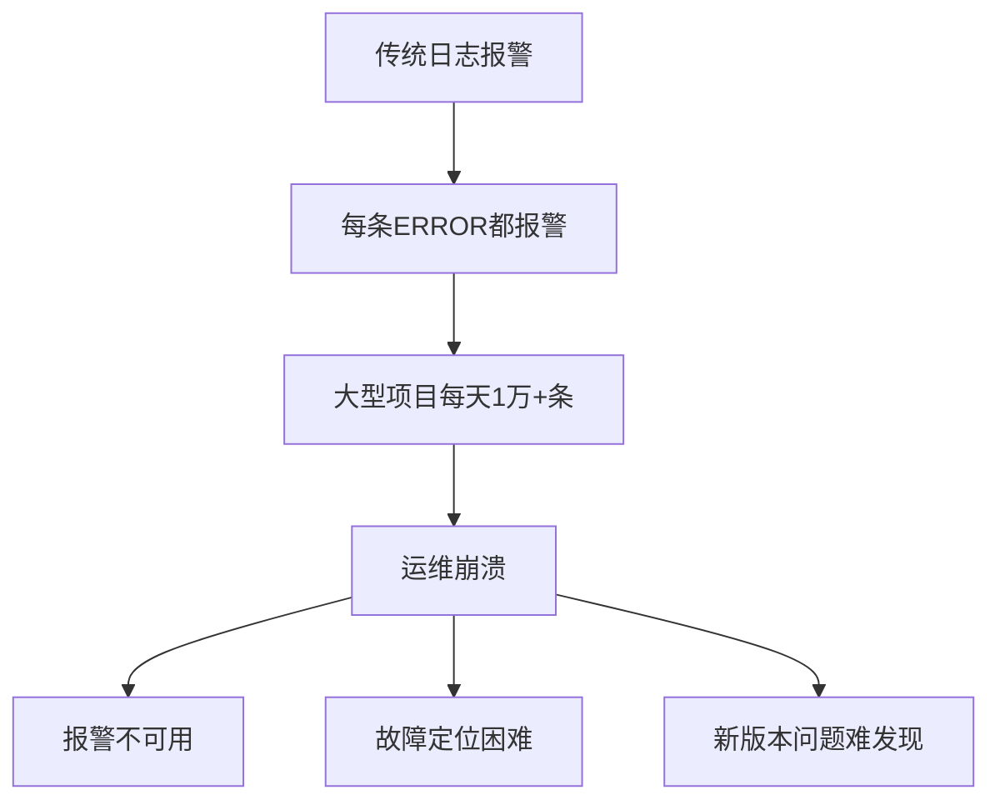

**痛点分析：**
1. **报警泛滥**：每条ERROR日志都报警
2. **大型项目**：每天1万多条日志报警
3. **运维崩溃**：基本不可用
4. **故障定位难**：日志量太大，难以排查
5. **版本上线**：难以发现新版本问题

**目标：**
> 日志精简、归类，以更简单的方式展示日志规律和信息。

### 3.2 日志智能分类

#### 3.2.1 分类原理

**核心思想：**
> 根据日志文本相似性进行归类，将相似日志合并成日志模板。

**示例：**

```
原始日志1: User 123 login failed at 2023-10-01 10:00:00
原始日志2: User 456 login failed at 2023-10-01 10:01:00

日志模板: User * login failed at *
```

**效果：**
- 2条日志 → 1个模板
- 大幅减少需要查看的日志量

#### 3.2.2 分类算法

**两种算法：**

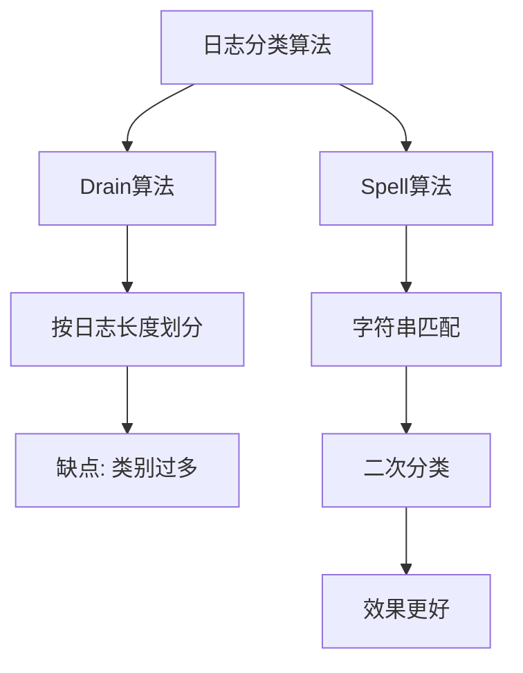

**1. Drain算法**
- 业界常见算法
- 缺点：按日志长度划分
- 问题：不同长度分到不同类，类别过多

**2. Spell算法**
- 二次分类
- 基于字符串匹配
- 不按长度划分
- 效果更好

**算法成熟度：**
- 业界成熟算法
- 可直接参考论文实现

#### 3.2.3 分类效果

**归并效果：**

| 项目 | 原始日志量 | 归并后模板数 | 压缩比 |
|------|-----------|------------|--------|
| 监控系统 | 150万条 | 80+个 | 18750:1 |

**从百万到百：**
- 150万条日志 → 80多个模板
- 大幅降低排查工作量

**可视化展示：**

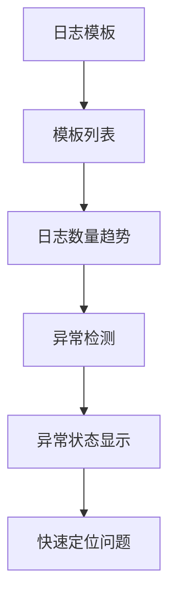

**功能特性：**
- 展示每个模板的日志数量变化
- 通过趋势判断异常
- 集成异常检测功能
- 异常模板状态显示

### 3.3 日志异常检测

#### 3.3.1 更智能的监控

**用户需求：**
> 不需要人工定期查看，直接告警通知，更加智能。

**实现方式：**
- 基于日志数量的异常检测
- 识别日志数量变化

**检测维度：**
- 日志数量异常检测（当前实现）
- 日志Value异常检测（未来）
- 日志模式异常检测（未来）

#### 3.3.2 检测原理

**分布变化检测：**

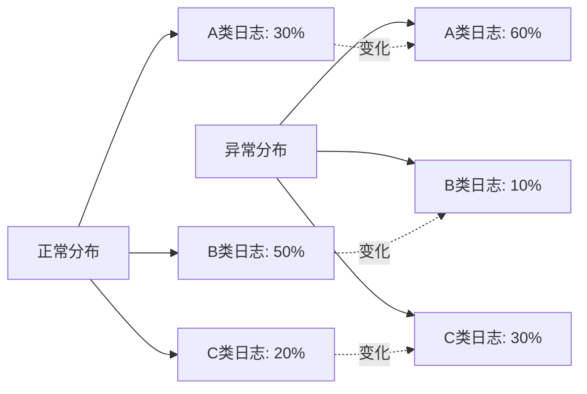

**检测逻辑：**
1. 正常情况：日志模板分布稳定
2. 异常情况：某类日志突然变多/变少
3. 整体分布发生改变

#### 3.3.3 算法实现

**基于机器维度：**

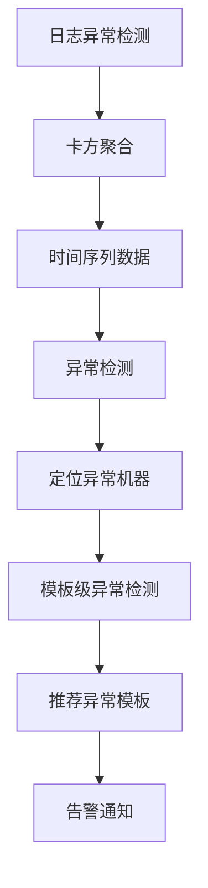

**实现步骤：**
1. **卡方聚合**：将模板聚合成时间序列
2. **异常检测**：对聚合数据进行异常检测
3. **下钻分析**：检测到异常后下钻到模板
4. **异常推荐**：推荐异常模板给用户

**算法选择原因：**
- 机器量大，不能太复杂
- 资源消耗考虑
- 简单高效

### 3.4 案例：大话西游代码Bug

**故障发现：**
- 收到日志异常检测报警
- 程序最初未在意
- 发现CPU也有小幅飙升
- 火焰图显示大量卡顿

**问题排查：**


**根因分析：**
- 某次版本更新
- 玩法设计有Bug
- 玩家触发动作时卡顿
- 产生大量日志

**价值体现：**
> 日志可以发现代码层问题，不仅仅是机器或中间件问题。

**对游戏业务的意义：**
- 很多问题通过日志排查
- 大多是代码Bug导致
- 日志分析至关重要

---

## 四、故障定位实践

### 4.1 故障定位的挑战

**运维面临的困难：**

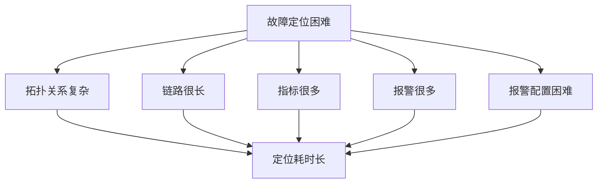

**对游戏业务的影响：**
> 时间就是金钱！故障处理越慢，营收损失越大。

**需求：**
- 快速定位故障的系统
- 辅助运维同学定位

### 4.2 故障定位系统设计

#### 4.2.1 系统定位

**功能定位：**
> 辅助定位功能，推荐可能的故障原因，而非确定性诊断。

**工作流程：**

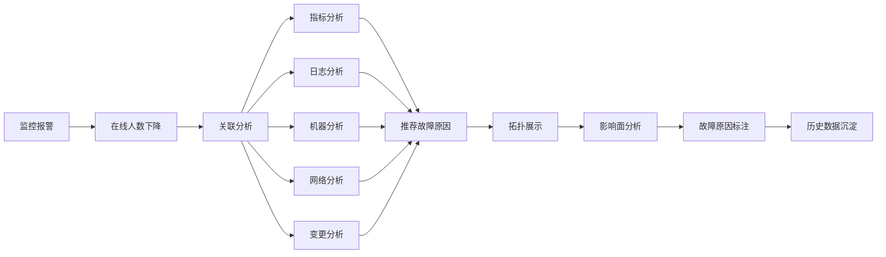

#### 4.2.2 四大分析模块

```mermaid
graph TD
    A[故障定位四大模块] --> B[人为操作]
    A --> C[资源情况]
    A --> D[代码问题]
    A --> E[历史故障]
    
    B --> B1[变更事件]
    B --> B2[发版记录]
    B --> B3[维护操作]
    B --> B4[报警异常]
    
    C --> C1[渠道问题]
    C --> C2[网络问题]
    C --> C3[SLB问题]
    C --> C4[端口异常]
    C --> C5[机器故障]
    
    D --> D1[日志异常]
    D --> D2[代码Bug]
    
    E --> E1[相似度计算]
    E --> E2[历史推荐]
```

### 4.3 资源情况分析

#### 4.3.1 机器层面分析

**检测范围：**
- 20分钟内所有机器指标
- CPU、内存、网络、连接数等
- 机器维度（部分游戏到进程维度）

**推荐原则（三个维度）：**

```mermaid
graph TD
    A[机器异常推荐原则] --> B[时间维度]
    A --> C[严重程度]
    A --> D[异常数量]
    
    B --> E[越早发生越可能是根因]
    C --> F[异常程度越严重越可能]
    D --> G[所有指标都异常可能性大]
    
    E --> H[故障可能性评分]
    F --> H
    G --> H
```

**1. 时间维度**
- 越早发生的异常越可能是根因
- 时间越早，权重越高

**2. 严重程度**
- 异常程度越严重越可能是故障
- 变化幅度越大，权重越高

**3. 异常数量**
- 某台机器所有指标都异常
- 造成故障的可能性越大

#### 4.3.2 网络和渠道分析

**分析维度：**
- 运营商维度
- 区域维度

**分析方法：**

```mermaid
graph LR
    A[网络渠道分析] --> B[下钻分析]
    B --> C[运营商]
    B --> D[区域]
    
    C --> E[中国联通]
    C --> F[中国移动]
    C --> G[中国电信]
    
    D --> H[广州]
    D --> I[北京]
    D --> J[上海]
    
    E --> K[台词排序]
    F --> K
    G --> K
    H --> K
    I --> K
    J --> K
    
    K --> L[Top N推荐]
```

**输出结果：**
- Top N维度
- 例如：广州联通网络问题

#### 4.3.3 SLB和端口分析

**实现方式：**
- 已有完善的报警系统
- 不需要重新定位
- 直接汇总相关报警

**功能定位：**
- 故障信息收集
- 报警信息展示
- 暂无推断功能

### 4.4 代码问题分析

**实现方式：**

```mermaid
graph LR
    A[代码问题分析] --> B[日志异常检测]
    B --> C[异常模板识别]
    C --> D[推荐给用户]
    D --> E[程序排查]
```

**检测流程：**
1. 故障发生后触发日志异常检测
2. 找出异常日志模板
3. 告知用户可能的异常模板
4. 程序员排查确认

### 4.5 人为操作分析

**检测内容：**
- 变更事件
- 发版记录
- 维护操作
- 报警异常事件

**实现方式：**
- 信息展示为主
- 暂无智能推断
- 辅助人工判断

### 4.6 历史故障分析

**核心思想：**
> 计算当前故障与历史故障的相似性，推荐相似故障。

**实现方法：**

```mermaid
graph TD
    A[历史故障分析] --> B[计算相似度]
    B --> C[Jaccard系数]
    
    C --> D{超过阈值?}
    D -->|是| E[推荐历史故障]
    D -->|否| F[不推荐]
    
    E --> G[展示历史根因]
    G --> H[辅助判断]
```

**Jaccard系数：**
- 计算当前故障和历史故障相似性
- 超过阈值且最大值时推荐
- 包含历史故障根因信息

**价值：**
- 如果历史故障有标注根因
- 可推荐给用户参考
- 辅助判断当前故障

### 4.7 案例：梦幻西游公网故障

**故障场景：**

```mermaid
graph LR
    A[在线人数变化] --> B[触发定位]
    B --> C[某台机器异常]
    C --> D[连接数异常]
    D --> E[查看监控]
    E --> F[流量和连接问题]
    F --> G[公网故障]
```

**定位过程：**
1. 收到在线人数变化告警
2. 触发故障定位
3. 定位到某台机器
4. 发现连接数异常
5. 查看监控：流量和连接问题
6. 排查确认：公网故障

**故障记录：**
- 标注故障类型：公网故障
- 保存故障现场（所有指标变化）
- 下次相似故障时推荐

**效果：**
> 下次公网故障时，系统会自动推荐"很可能是公网故障导致"。

### 4.8 故障管理全流程

**AIOps在故障管理中的应用：**

```mermaid
graph TD
    A[故障管理流程] --> B[故障发现]
    B --> C[故障定位]
    C --> D[故障恢复]
    
    B --> B1[异常检测]
    B --> B2[离群检测]
    B --> B3[时序预测]
    B --> B4[故障预测]
    
    C --> C1[故障定位]
    C --> C2[告警收敛]
    C --> C3[告警分级]
    
    D --> D1[故障自愈]
    D --> D2[故障事件落库]
```

**故障发现：**
- 异常检测
- 离群检测（负载均衡监控）
- 时序预测（内存预测）
- 故障预测（硬件预测）

**故障定位：**
- 故障定位系统
- 告警收敛
- 告警分级

**故障恢复：**
- 故障自愈
- 故障事件落库（非常重要）

**故障事件落库的重要性：**
> 没有数据，AIOps就很难发挥价值。无法做到智能推断，需要记录故障事件为后续定位提供帮助。

---

## 五、未来规划

### 5.1 效率方向

**智能变更：**

```mermaid
graph TD
    A[智能变更] --> B[变更风险评估]
    A --> C[变更影响分析]
    A --> D[变更回滚决策]
    
    E[变更故障占比] --> F[27%]
    F --> G[亟需优化]
```

**背景：**
- 业界很多公司在做智能变更
- 调研发现：27%的故障因变更导致
- 需要重点优化

### 5.2 质量方向

**故障预测：**

```mermaid
graph LR
    A[故障预测] --> B[硬盘故障预测]
    A --> C[内存故障预测]
    
    B --> D[刚上线]
    C --> D
```

**当前状态：**
- 硬盘故障预测：已上线
- 内存故障预测：已上线

### 5.3 数据管理方向

**数据安全：**

```mermaid
graph TD
    A[数据管理] --> B[数据分类分级]
    A --> C[敏感数据识别]
    
    B --> D[数据安全]
    C --> D
```

**重要性：**
- 数据安全越来越重要
- 数据分类分级
- 敏感数据识别

### 5.4 成本方向

**集群扩缩容：**

```mermaid
graph LR
    A[成本优化] --> B[集群资源扩缩容]
    B --> C[刚上线]
```

**当前状态：**
- 集群资源扩缩容功能
- 刚上线

### 5.5 平台方向

**AIOps平台建设：**

```mermaid
graph TD
    A[AIOps平台] --> B[模型管理]
    A --> C[特征管理]
    A --> D[交互体验]
    A --> E[算法原子化]
    
    E --> F[用户自定义组合]
    F --> G[实现业务价值]
```

**核心理念：**
> 将各个算法做成原子，用户自己组合，实现自己的功能。

**示例：**
- 异常检测 + 预测 + 日志分析
- 组合实现定制化功能
- 发挥各模块价值

**目标：**
- 更好的数据收集
- 模型管理
- 特征管理
- 交互体验优化
- 算法原子化

---

## 六、Q&A精选

### Q1：如何构建数据集，选择什么样的算法？

**A：异常检测数据集构建**

**Base样本库构成：**

1. **历史数据**
   ```mermaid
   graph LR
       A[历史数据] --> B[异常样本少]
       B --> C[异常生成]
       C --> D[加噪声]
       C --> E[数据变换]
       D --> F[丰富样本]
       E --> F
   ```
   
   **问题：** 历史异常数据很少
   
   **解决：** 异常生成
   - 加噪声
   - 数据变换
   - 丰富异常样本

2. **样本比例**
   - 异常样本：正常样本 = **1:4**
   - 不需要完全均衡
   - 测试验证模型效果稳定

**算法选择：**

1. **基础无监督算法**
   - IForest（Isolation Forest）
   - 计算每个点的异常Score
   
2. **分层抽样**
   ```mermaid
   graph LR
       A[IForest Score] --> B[按0.1分层]
       B --> C[每层抽样]
       C --> D[保证多样性]
       D --> E[人工标注]
   ```
   
   - 按Score分层（如每0.1一层）
   - 每层都抽样
   - 保证样本多样性

---

### Q2：黄金指标、性能指标、文本数据各自的优劣势？

**A：三种场景对比**

#### 黄金指标

**特点：**
- 量级小（几万条）
- 曲线有规律、平滑
- 业务稳定

**业务需求：**
- 非常关心在线人数下降
- 任何变化都要检测
- 不能漏报

**优势：**
- 准确性非常高
- 非常敏感
- 保证不漏报

**适用：**
- 核心业务指标
- 关键SLO

#### 性能指标

**特点：**
- 量级大（机器维度）
- 指标差异大
- 曲线多样

**问题：**
- 不适合有监督（样本构建困难）
- 不知道曲线状态
- 样本难以丰富

**解决方案：**
- 采用无监督
- 计算成本考虑
- 不能用复杂模型

**适用：**
- 机器性能监控
- 资源监控

#### 文本数据（日志）

**优点：**
- 可发现代码层问题
- 不仅是机器问题
- 不仅是中间件问题

**对比：**
- **黄金指标**：只知道业务有问题
- **性能指标**：只知道机器/性能问题
- **文本数据**：可定位代码Bug

**价值：**
> 很多故障都是代码问题，日志可以看到更多的点。

---

### Q3：故障自愈相关情况？

**A：当前实现状态**

**现状：**
- 还未实现智能化
- 基于规则的自愈

**实现方式：**

```mermaid
graph LR
    A[故障发生] --> B[规则匹配]
    B --> C[宕机]
    B --> D[其他异常]
    
    C --> E[重启]
    D --> F[预定义操作]
```

**未闭环原因：**
1. **检测准确率高**：异常检测达到90%+
2. **定位是推荐**：只是推荐，非确定性
3. **无法自动治愈**：不能确定一定是某个问题

**未来计划：**
- 如果定位准确率很高
- 会考虑智能化自愈
- 目前基于规则

---

### Q4：有监督模型的可解释性问题？

**A：黑盒问题**

**用户疑问：**
- 为什么这个报警？
- 为什么那个不报警？

**困难：**
- 算法对用户是黑盒
- 很难解释清楚
- 不知道运行过程

**缓解方法：**
1. **图文告警**
   - 发送图片
   - 用户直观判断
   
2. **一键标注**
   - 快速反馈
   - 持续优化

3. **项目定制化**
   - 用户标注隔离
   - 千人千面

---

### Q5：无监督模型的参数调优？

**A：调优策略**

**优点：**
- 可以解释为什么报警
- 可以告诉用户如何调整

**调整方式：**
- 修改参数
- 调整阈值
- 增加策略

**用户理解成本：**
- 相对较低
- 可以给出明确建议

---

## 七、总结与启示

### 7.1 核心价值

**网易游戏AIOps实践价值：**

```mermaid
graph TD
    A[AIOps价值] --> B[提升效率]
    A --> C[保障质量]
    A --> D[降低成本]
    
    B --> E[异常检测准确率90%+]
    B --> F[日志从百万到百]
    
    C --> G[快速故障定位]
    C --> H[代码层问题发现]
    
    D --> I[减少人工标注]
    D --> J[降低运维负担]
```

### 7.2 关键经验

**1. 场景化分类**
- 不同场景采用不同方法
- 黄金指标：有监督
- 性能指标：无监督
- 文本数据：分类+检测

**2. 闭环设计**
- 图文告警
- 一键标注
- 持续迭代

**3. 数据沉淀**
- 故障事件落库
- 历史故障推荐
- 为AIOps提供数据基础

**4. 循序渐进**
- 从检测到定位
- 从推荐到自愈
- 逐步提升智能化

### 7.3 未来展望

**持续探索方向：**
1. 智能变更
2. 故障预测
3. 数据安全
4. 成本优化
5. 平台化建设

---

## 八、附录

### 8.1 关键术语表

| 术语 | 英文 | 解释 |
|------|------|------|
| AIOps | Artificial Intelligence for IT Operations | 智能运维 |
| SLO | Service Level Objective | 服务水平目标 |
| KPI | Key Performance Indicator | 关键绩效指标 |
| IForest | Isolation Forest | 孤立森林算法 |
| STL | Seasonal and Trend decomposition using Loess | 时间序列分解 |
| MK检验 | Mann-Kendall Test | 趋势检验方法 |
| Jaccard系数 | Jaccard Coefficient | 相似度计算方法 |

### 8.2 算法参考文献

**日志分类：**
1. Drain算法论文
2. Spell算法论文

**异常检测：**
1. SR算法（微软论文）
2. IForest算法

### 8.3 关键数字

| 指标 | 数值 |
|------|------|
| 黄金指标准确率 | 90%+ |
| 性能指标准确率 | 80%+ |
| 日志压缩比 | 18750:1 |
| 异常样本比例 | 1:4 |
| 变更导致故障占比 | 27% |
| AIOps探索年限 | 2016年至今 |

### 8.4 三种场景对比总结

| 维度 | 黄金指标 | 性能指标 | 文本数据 |
|------|---------|---------|---------|
| **方法** | 有监督 | 无监督 | 分类+检测 |
| **量级** | 几千~几万 | 几十万~千万 | 百万级 |
| **准确率** | 90%+ | 80%+ | - |
| **成本** | 高（标注） | 低 | 中 |
| **可解释性** | 差 | 好 | 中 |
| **适用场景** | 核心业务 | 性能监控 | 代码问题 |

---

> **文档说明**  
> 本文档根据网易游戏AIOps实践分享整理而成，详细介绍了异常检测、日志分析、故障定位三大核心模块的实现方法。  
> 核心亮点：黄金指标90%+准确率、日志压缩18750:1、场景化分类方法、闭环设计思想。  
> 适用对象：SRE工程师、运维工程师、AIOps实践者、算法工程师


