# 网易游戏智能运维AIOps落地实践

> 来源：未核验 · 类型：分享 · 状态：draft


## 分享嘉宾

**丁泽** - 网易游戏智能运维平台负责人

## 一、AIOps概述

### 1.1 什么是AIOps

AIOps是Gartner在2016年提出的概念,其核心定义是:

> 通过机器学习、数据仓库、大数据平台及人工智能技术来进行自动化管理运维的事务。

**AIOps的技术基础:**

- **大数据**: 作为AIOps的数据基础
- **机器学习**: 驱动智能化能力
- **运维数据与经验**: 核心依赖要素

AIOps是运维技术、大数据、机器学习、深度学习等多方面的整合体。

### 1.2 为什么需要AIOps

#### 业务规模挑战

- 业务规模不断扩大,用户数量超大规模
- 需要超大规模的在线分布式系统和大数据处理系统
- 运维人员面临的计算规模和机器管理数量呈指数级上升

#### 运维复杂度提升

- 运维规则成倍增长,人工调整成为主要工作
- 据统计,运维人员在规则调整上花费约**50%**的时间
- 需要通过策略和算法实现规则的智能化调整

#### 告警信息爆炸

- 监控维度不断扩大,告警数量和信息种类激增
- 运维人员难以在第一时间理清逻辑,找到核心问题
- 需要通过算法辅助决策,快速定位最重要和最核心的问题

#### 静态阈值局限性

- 传统告警规则依赖固定阈值,依赖运维经验和业务稳定性
- 业务多样化导致大量漏报和误报
- 需要通过机器学习自动调整阈值

**注意:** 并非所有场景都需要AIOps,单点应用或单机部署使用简单的规则+策略方式更高效。

## 二、AIOps发展阶段

根据AIOps企业级实施白皮书,AIOps发展分为五个阶段:

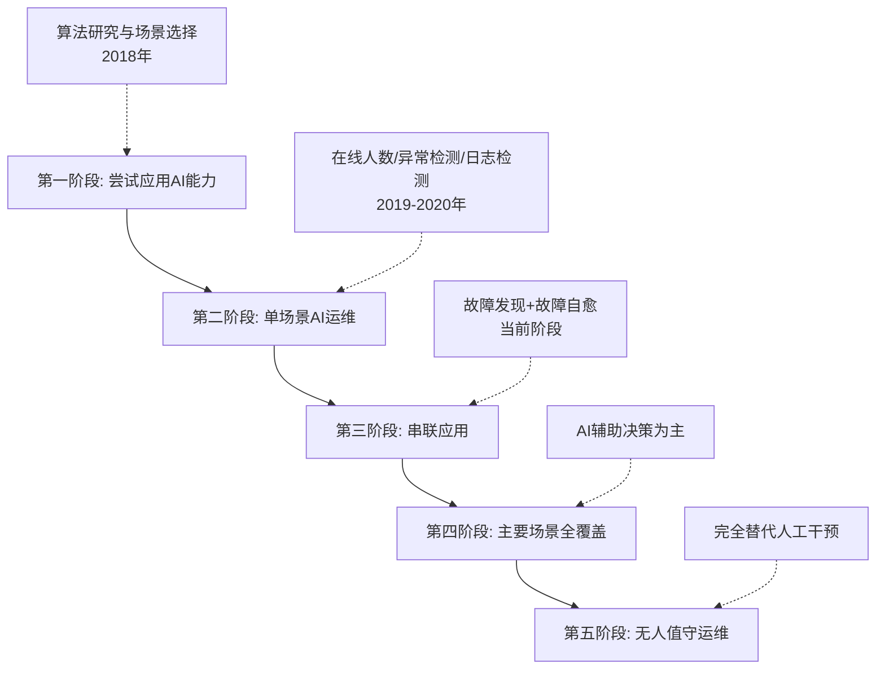

### 网易游戏的发展历程

| 阶段     | 时间        | 特点                                       | 网易实践                             |
| -------- | ----------- | ------------------------------------------ | ------------------------------------ |
| 第一阶段 | 2018年      | 开始尝试AI能力,无成熟单点应用              | 组建智能运维团队,算法研究+场景选择   |
| 第二阶段 | 2019-2020年 | 具备单场景AI运维能力,形成"学件"(模型+规约) | 在线人数、异常检测、日志检测单点突破 |
| 第三阶段 | 当前        | 多个AI模块串联的流程化能力                 | 串联多维度运维信息,实现故障发现+自愈 |
| 第四阶段 | 未来        | 主要运维场景全覆盖                         | 规划中                               |
| 第五阶段 | 愿景        | 无人值守运维,完全替代人工                  | 长期目标                             |

**当前定位:** AIOps更多偏向于**辅助决策**,而非完全免除人工干预。

## 三、团队组织架构

### 3.1 AIOps团队角色构成

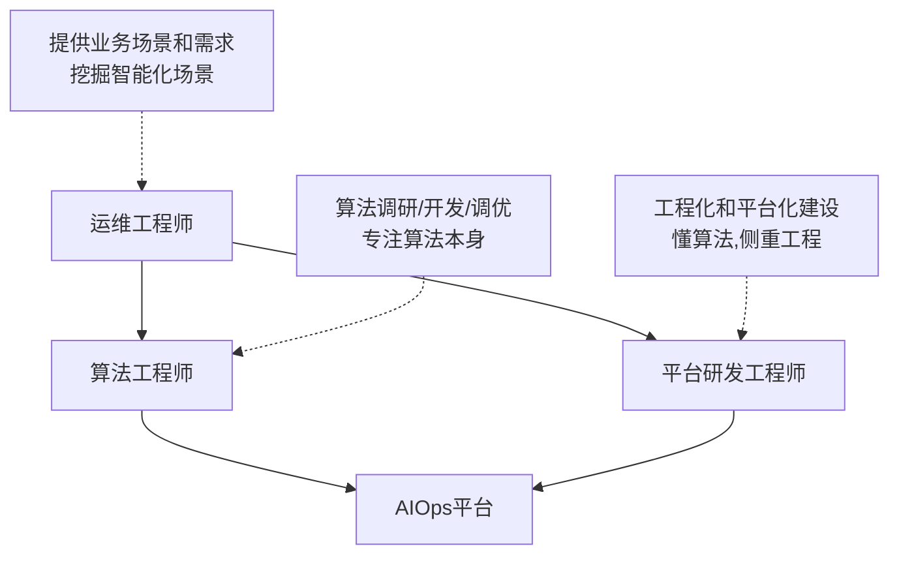

### 3.2 角色职责

| 角色                     | 主要职责                                                                   | 技能要求           |
| ------------------------ | -------------------------------------------------------------------------- | ------------------ |
| **运维工程师**     | - 提供业务场景和需求``- 挖掘潜在智能化场景``- 作为平台用户   | 业务经验、场景理解 |
| **算法工程师**     | - 算法调研、开发、调优``- 专注算法本身``- 不涉及过多工程开发 | 机器学习、算法能力 |
| **平台研发工程师** | - 工程化和平台化建设``- 懂算法但侧重工程``- 平台开发和维护   | 工程能力+算法理解  |

**组织原则:** 术业有专攻,根据公司规模和人员配置灵活调整。

## 四、AIOps业务实践全景

### 4.1 业务实践架构

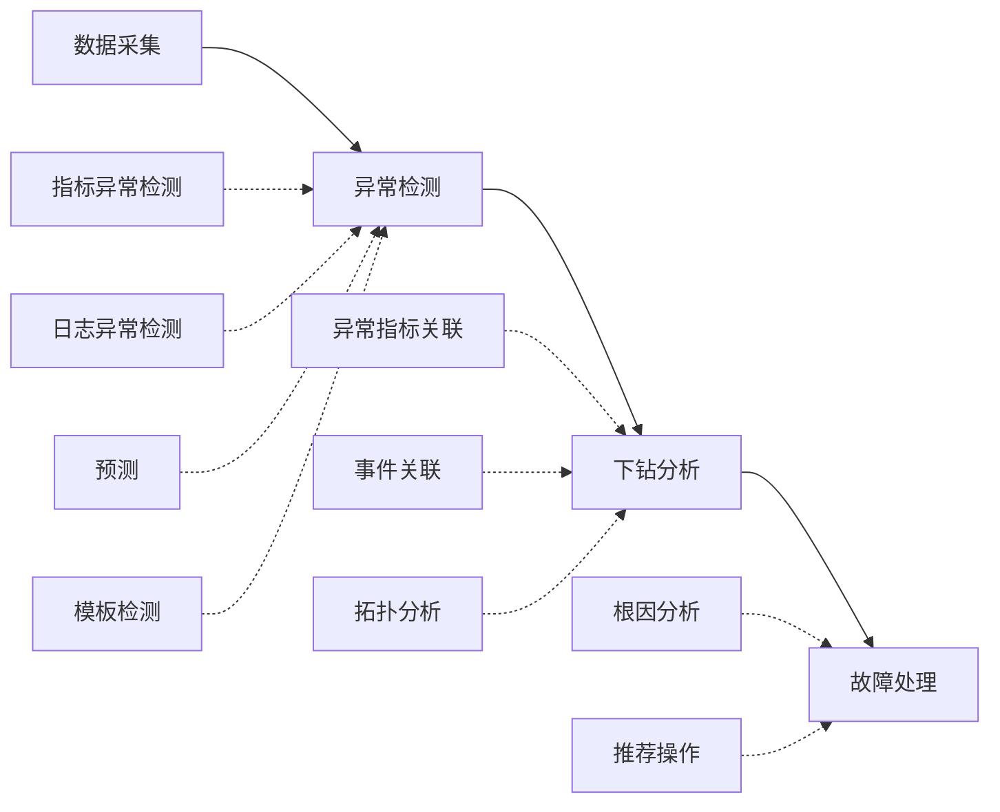

### 4.2 核心能力模块

**1. 异常检测**

- 指标异常检测
- 日志异常检测
- 预测能力
- 模板检测

**2. 下钻分析**

- 异常指标关联
- 事件关联
- 拓扑分析

**3. 故障处理**

- 根因分析
- 推荐操作

**重要发现:** 监控平台是AIOps中非常典型和核心的部分,从数据收集、存储、分析到可视化都有成熟实践。

**建议:** 团队应根据自身业务和ROI,选择合适的切入点探索AIOps。

## 五、异常检测实践

### 5.1 为什么从在线人数检测切入

**业务特点:**

- 游戏业务故障最直观体现是在线人数变化
- 在线人数难以通过固定阈值实现
- 游戏开服期与平稳期数值变化巨大

**解决方案:** 动态阈值方式

### 5.2 静态阈值的局限性

传统静态阈值容易出现:

- ❌ 漏报
- ❌ 误报
- ❌ 报警风暴

### 5.3 典型曲线类型与检测策略

#### 曲线类型一: 平滑曲线偶发下降


**特点:** 静态阈值可以很好识别

#### 曲线类型二: 周期性曲线毛刺异常

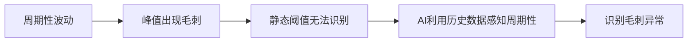

**特点:** 需要AI异常检测,利用历史数据感知周期性波动

#### 曲线类型三: 水平线突变

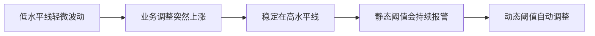

**特点:** 动态阈值随曲线自动调整,无需人工更新

### 5.4 算法模型选择

#### 模型分类

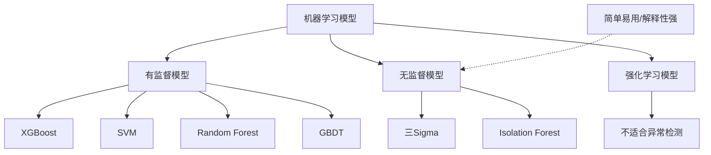

#### 网易游戏使用的模型

| 类型                 | 模型                              | 特点                         |
| -------------------- | --------------------------------- | ---------------------------- |
| **无监督模型** | 三Sigma、Isolation Forest         | 简单易用、解释性强、应用广泛 |
| **有监督模型** | XGBoost、SVM、Random Forest、GBDT | 准确率高、需要标注数据       |

### 5.5 算法优化实践

#### 优化一: 毛刺异常检测

**问题:**

- 曲线在特定时刻出现不具周期性的局部毛刺
- 标准化后KPI本身具有趋势性

**解决方案:**

1. 初期: 使用标准化 + 阈值判断
2. 优化: 使用STL拆分去除趋势项,使异常暴露
3. 补充: SR算法对此类异常有较好检测效果

#### 优化二: 突升突降异常检测

**问题:**

- 曲线出现异常突升或突降
- 可能持续较长时间
- 业务高度关注(如在线人数、CPU使用率)

**解决方案:**

1. 初期: 通过异常点两端窗口均值偏移识别
2. 问题: KPI具有趋势和周期,正常点窗口也可能存在均值偏移
3. 优化: 使用**STL对时间序列分解**,对残差部分进行均值偏移,降低趋势项和季节项带来的误报

#### 优化三: 频率变化异常检测

**特点:**

- 持续性毛刺异常
- 震荡幅度大
- 曲线较少见

**解决方案:** 通过窗口内的异常计数值进行判定

### 5.6 离群报警

#### 概念

离群是指数据相较于其他数据呈现明显波动,适用于集群下某个指标出现大量偏移的不一致性异常。

**应用场景:** 集群或LB下某台机器或某个指标与其他机器出现很大差异

#### 传统方法的问题

传统统计学方法: `均值 ± n倍标准差`

**局限性:**

- ❌ 前提是数据必须符合正态分布
- ❌ 极端值会影响均值计算

#### 改进算法: MAD (Median Absolute Deviation)

**算法步骤:**

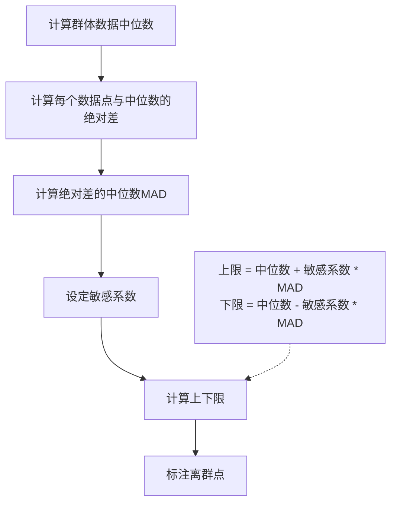

**优势:**

- ✅ 不依赖正态分布假设
- ✅ 对极端值不敏感
- ✅ 敏感系数可根据业务调整

## 六、系统架构设计

### 6.1 面临的挑战

#### 挑战一: 算法与工程边界模糊

- 算法工程师希望专注算法开发和调优
- 不想花太多时间在工程上

#### 挑战二: 算法包与工程强耦合

- 初期算法包嵌入平台,提供固定算法
- 业务增多后算法无法满足需求
- 每次算法调优需要工程配合发版

**目标:** 算法快速迭代 + 工程平台稳定

#### 挑战三: 数据源多样化

不同场景数据格式差异大:

- 指标异常检测: 时序数据
- 日志异常检测: 文本数据
- 模板检测: 模板数据
- 故障定位: 配置数据、CMDB数据、拓扑数据、事件信息等

**需求:**

- 快速接入多种数据源
- 提供多种服务类型
- 统一管理
- 业务和进程相互隔离
- 统一平台调度
- 动态调整算力

### 6.2 整体架构设计

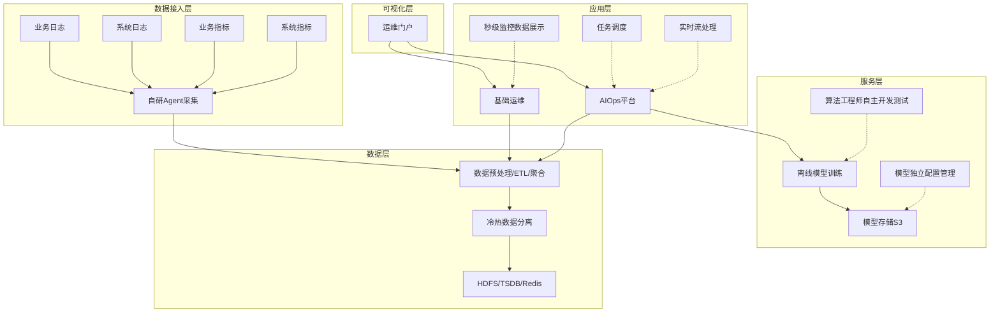

### 6.3 架构分层详解

#### 第一层: 数据接入层

**功能:**

- 实时采集各类监控指标、系统日志、业务日志、业务指标

**采集方式:**

- 自研Agent自动采集
- 自定义数据流接入
- 服务器初始化时自动安装配置

#### 第二层: 数据层

**功能:**

- 数据持久化到HDFS
- 数据预处理、ETL、聚合
- 冷热数据分离

**存储:**

- HDFS: 冷数据
- TSDB: 热数据
- Redis: 缓存

#### 第三层: 服务层

**核心特性:**

- 离线模型训练
- 模型上传到S3存储
- 模型从平台框架抽离,独立配置管理

**优势:**

- ✅ 算法工程师自主完成全链路开发测试
- ✅ 无需平台工程师介入
- ✅ 降低算法与工程耦合
- ✅ 新业务接入时,通过约定接口各自独立开发和上线

#### 第四层: 应用层

**基础运维:**

- 反映真实指标数据波动
- 秒级监控数据展示

**AIOps平台:**

- 实时流处理
- 任务调度
- 调用模型进行算法检测
- 结果展示在可视化运维门户

#### 第五层: 可视化层

运维门户统一展示

## 七、异常检测框架实现

### 7.1 数据流向

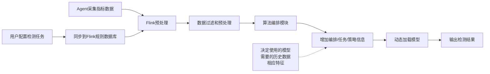

### 7.2 检测框架设计思路

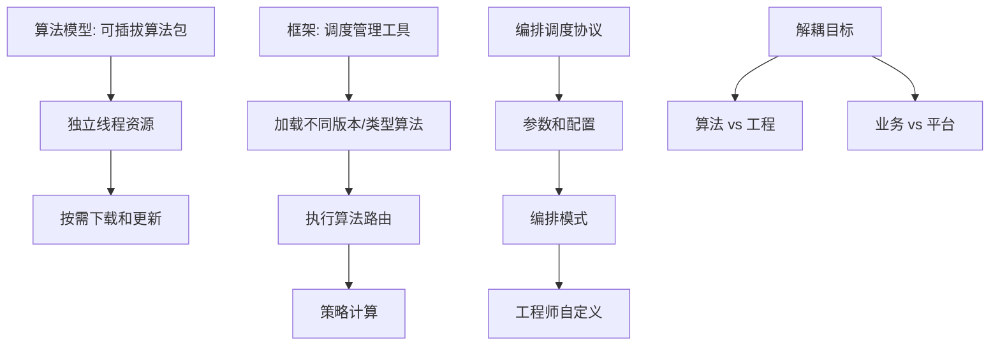

**核心特性:**

- 算法模型作为可插拔算法包管理
- 每个算法包拥有独立线程资源
- 可根据需要下载和更新
- 框架负责调度管理
- 设计完整的编排调度协议
- 参数、配置、编排模式开放给工程师定义

### 7.3 历史数据获取优化

#### 问题

- 业务场景需要大量历史数据(如7-8天)
- 检测数量增加对TSDB压力巨大
- 不同模型需要的输入量不完全相同
- 冷热数据分离或读写分离无法很好解决

#### 解决方案

**平台内部维护历史数据存储:**

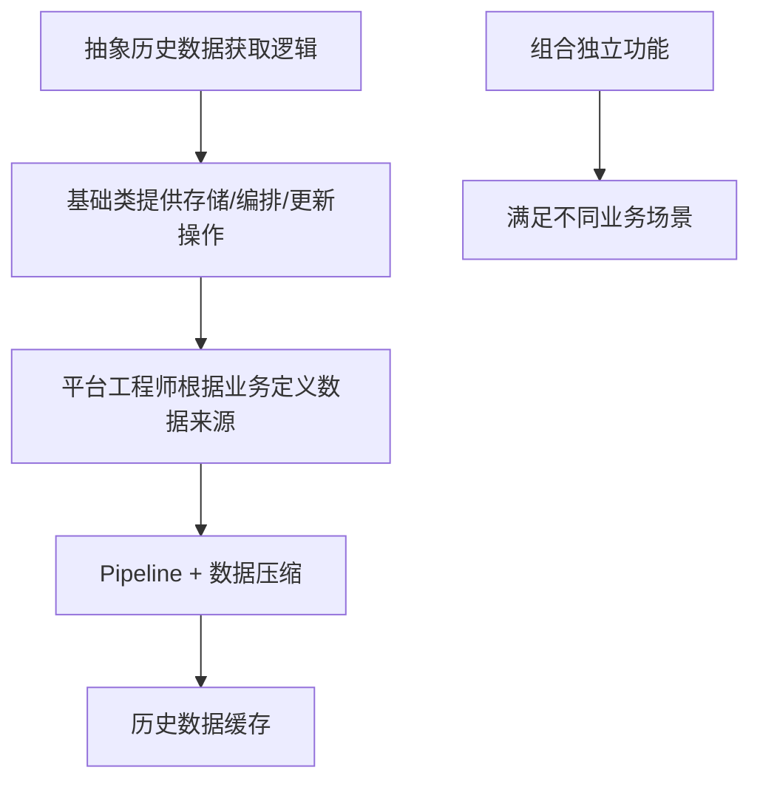

**技术方案:**

- 抽象化历史数据获取逻辑
- 基础类提供存储、编排、更新操作
- 平台工程师根据业务场景自定义数据来源
- Pipeline + 数据压缩方式缓存历史数据

## 八、用户体验优化

### 8.1 异常标注方式改进

#### 传统方式的问题

- 通过事件和同环比形式展示
- 单个事件同环比容易造成误解

#### 网易游戏的方案

**采用Grafana大图形式:**

- ✅ 直观的异常标注和展示
- ✅ 避免单点事件误解
- ✅ 更好的可视化效果

### 8.2 用户反馈机制

#### 用户反馈的重要性

- 决定模型调优方向
- 帮助算法提升准确性
- 用户标注行为至关重要

#### 问题

用户往往会忽略标注

#### 解决方案

**通过内部消息工具(泡泡)主动推送:**


**效果:**

- ✅ 降低用户标注门槛
- ✅ 培养用户标注习惯
- ✅ 提高反馈率

## 九、故障管理智能化

### 9.1 故障管理四大能力

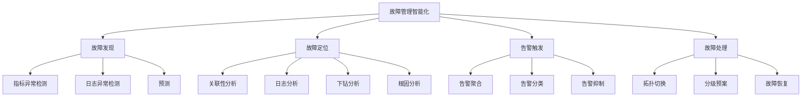

| 能力               | 包含内容                                 | 目标                          |
| ------------------ | ---------------------------------------- | ----------------------------- |
| **故障发现** | 指标异常检测、日志异常检测、预测         | 更精确发现故障                |
| **故障定位** | 关联性分析、日志分析、下钻分析、根因分析 | 精确定位故障根因,降低信息孤岛 |
| **告警触发** | 告警聚合、告警分类、告警抑制             | 减少告警噪音                  |
| **故障处理** | 拓扑切换、分级预案、故障恢复             | 及时恢复故障                  |

### 9.2 游戏业务故障特点

#### 面临的挑战

- 游戏架构越来越复杂
- 故障排查链路越来越长
- 故障引发大量零散告警
- 告警没有规则,依赖经验分类
- 排查过程非常慢
- 经验无法在不同运维人员间复用

### 9.3 故障定位解决方案

#### 整体思路

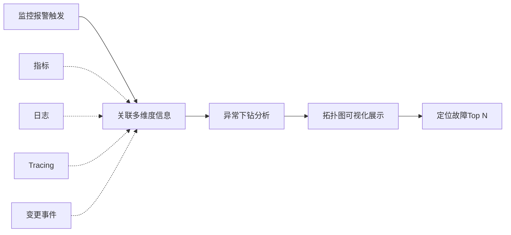

#### 下钻分析维度

**业务粒度:** 群组级别

**四大类下钻维度:**

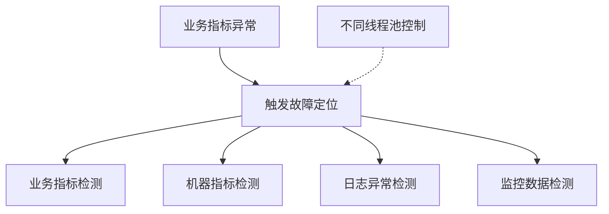

#### 检测流程

1. **业务指标异常触发** → 自动检测对应的日志、机器指标、SARS服务
2. **扫描机器拓扑视图** → 找到故障时间范围内的异常
3. **检测服务端日志** → 识别异常波动的日志类型
4. **查询SARS告警** → 获取相关报警信息
5. **汇总信息** → 在时间范围内进行毛刺异常分析

### 9.4 根因分析算法

#### 异常分数计算

**公式:**

```
根因系数 = 异常系数 × 时间衰减系数
```

**原则:**

- 越早发生的异常,越有可能是根因
- 异常最多的机器作为根因机器展示
- 指标异常根据根因系数排序,输出不同指标根因列表

**注意:** 不同业务的分数计算策略需要根据自身业务制定。

### 9.5 拓扑下钻分析展示

#### 可视化界面

**左侧:** 群组拓扑图

- 标示异常机器

**右侧:** 下钻分析结果

- 对应指标列表
- 可能存在的问题
- 明确的展现方式

**价值:** 运维人员无需花费大量时间统计和整合数据

## 十、其他探索方向

### 10.1 已实践领域

- 卡顿分析
- 告警收敛
- 敏感信息处理

### 10.2 未来建设方向

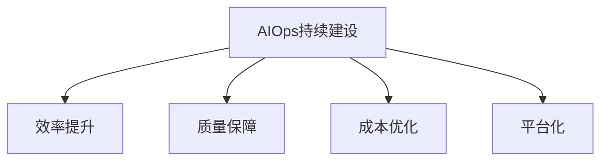

## 十一、关键经验总结

### 11.1 团队配置建议

✅ **推荐配置:**

- 运维工程师: 提供场景和需求
- 算法工程师: 专注算法研发
- 平台工程师: 工程化和平台化

✅ **核心原则:**

- 术业有专攻
- 根据公司规模灵活调整

### 11.2 技术选型建议

✅ **切入点选择:**

- 根据业务ROI选择切入点
- 游戏业务选择在线人数检测
- 监控平台是AIOps的典型核心部分

✅ **算法选择:**

- 无监督模型: 简单易用,解释性强
- 有监督模型: 准确率高,需要标注数据
- 根据业务场景选择合适算法

### 11.3 架构设计原则

✅ **解耦设计:**

- 算法与工程解耦
- 业务与平台解耦
- 模型独立管理

✅ **可扩展性:**

- 支持多种数据源快速接入
- 算法包可插拔
- 统一调度管理

✅ **性能优化:**

- 冷热数据分离
- 历史数据缓存
- 动态算力调整

### 11.4 落地实施建议

✅ **迭代式开发:**

- AIOps是迭代式开发模式
- 持续优化算法和工程

✅ **用户体验:**

- 降低用户使用门槛
- 主动推送检测结果
- 培养用户反馈习惯

✅ **数据驱动:**

- 重视用户反馈和标注
- 用于模型调优
- 提升准确性

## 十二、Q&A精选

### Q1: 智能化运维前期规划有什么建议?

**A:**

- 根据自身ROI进行判断
- 游戏业务关注在线人数等直观指标
- 大数据、拓扑、CMDB等基础设施是必备的
- 可以先从这些方面着手

### Q2: 如何解决运维监控误报率高的问题?

**A:**

- 通过与用户探讨进行算法调整
- 加入自动过滤机制(如防沉迷时段)
- 针对特殊情况设置过滤规则
- 持续优化模型

### Q3: 动态阈值算法如何选型?

**A:**

- 无监督: 三Sigma、Isolation Forest
- 有监督: XGBoost、Random Forest、GBDT、SVM、LR
- 特征: 拆分、偏度、峰度、标准差、方差、波动性、移动平均、预测特征、分类特征、周期性同比
- 根据业务场景选择不同算法和特征
- 加入样本点有效优化模型

### Q4: 告警收敛有哪些思路?

**A:** 网易游戏有专门的算法分享,可以关注公众号或联系交流。

## 十三、联系方式

**公众号:** 网易游戏技术(搜索查看更多算法经验分享)

**个人微信:** 欢迎感兴趣的团队或个人交流探讨

---

## 核心要点回顾

### 1️⃣ 为何转型智能化运维

- 业务规模指数级增长
- 运维复杂度急剧上升
- 静态阈值无法适应动态业务
- 需要算法辅助决策

### 2️⃣ 低耦合高内聚平台设计

- 算法与工程解耦
- 模型独立管理
- 可插拔算法包
- 统一编排调度协议

### 3️⃣ 异常检测系统设计

- 五层架构: 数据接入→数据层→服务层→应用层→可视化层
- 动态阈值替代静态阈值
- STL分解优化检测效果
- MAD算法实现离群检测

### 4️⃣ 快速适配各维度经验

- 迭代式开发模式
- 根据ROI选择切入点
- 重视用户反馈
- 持续优化算法和工程

---

**文档整理:** 基于网易游戏丁泽老师的技术分享
**适用人群:** SRE、运维及稳定性保障工程师
**核心价值:** 提供从0到1构建AIOps平台的完整实践路径
