# 趣丸AIOps探索与实践

> 来源：未核验 · 类型：分享 · 状态：draft


> 分享嘉宾: 罗森 - 趣丸科技高级AIOps开发工程师
> 所属团队: 技术保障部

## 目录

- [一、AIOps基本概念与发展现状](#一aiops基本概念与发展现状)
  - [1.1 什么是AIOps](#11-什么是aiops)
  - [1.2 AIOps的应用场景](#12-aiops的应用场景)
  - [1.3 AIOps发展现状](#13-aiops发展现状)
- [二、趣丸AIOps落地实践](#二趣丸aiops落地实践)
  - [2.1 基于NLP舆情分析的故障识别模型(效率维度)](#21-基于nlp舆情分析的故障识别模型效率维度)
  - [2.2 故障级根因定位算法(质量维度)](#22-故障级根因定位算法质量维度)
  - [2.3 应用资源套餐推荐(成本维度)](#23-应用资源套餐推荐成本维度)
- [三、AIOps未来规划](#三aiops未来规划)
  - [3.1 宏观理念](#31-宏观理念)
  - [3.2 具体落地方向](#32-具体落地方向)

---

## 一、AIOps基本概念与发展现状

### 1.1 什么是AIOps

#### 运维演进历程

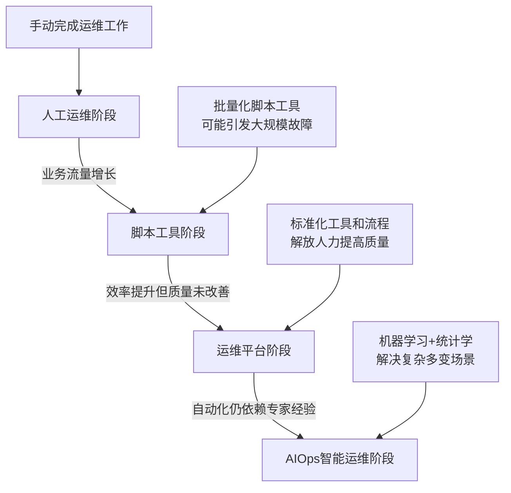

#### AIOps定义

**AIOps(智能运维)** = 人工智能 + 运维领域

- **核心要素1**: 海量运维数据(日志、指标、配置、调用链、告警、文本等)
- **核心要素2**: 机器学习与统计学方法
- **核心价值**: 通过关联分析多模态数据,挖掘传统运维手段难以发现的价值

#### 运维数据特点

- **海量性**: 每天产生大量监控数据
- **高速性**: 实时产生和更新
- **多模态**: 日志、指标、配置、调用链、告警、文本等多种数据类型
- **关联性**: 只有关联分析才能发挥最大价值

### 1.2 AIOps的应用场景

从**质量、成本、效率**三个维度展开:

#### 质量维度

| 应用场景           | 具体实现                     |
| ------------------ | ---------------------------- |
| **智能发现** | 异常检测、故障预测           |
| **智能分析** | 告警收敛、根因分析、根因算法 |
| **智能处置** | 故障自愈、故障预防           |

#### 成本维度

| 应用场景               | 具体实现                            |
| ---------------------- | ----------------------------------- |
| **智能成本管理** | 智能优化、成本评估、预算分析        |
| **资源管理**     | 容器配置管理、资源推荐(HPA/VPA算法) |

#### 效率维度

| 应用场景               | 具体实现                             |
| ---------------------- | ------------------------------------ |
| **智能运维**     | 变更分析、无人值守、智能屏蔽故障节点 |
| **用户体验管理** | 舆情分析、运维知识库                 |

### 1.3 AIOps发展现状

> 数据来源: 新能源发布的《中国智能运维实践报告》(2021-2022年度)

#### 企业AIOps实施阶段分布

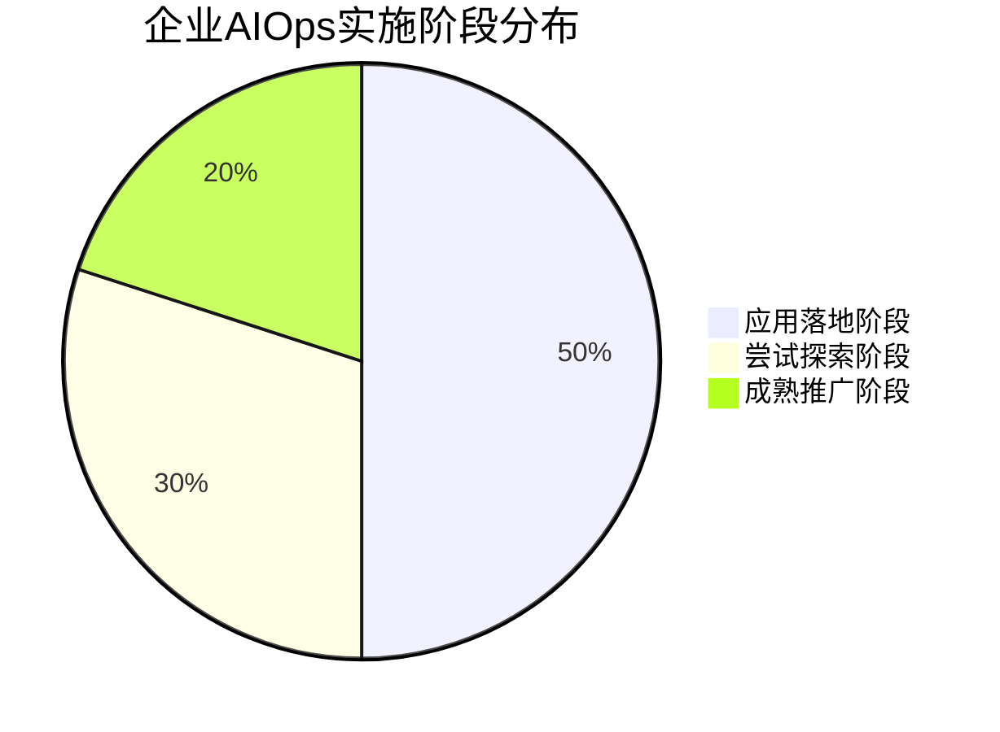

**关键洞察**: 80%的企业处于尝试探索和应用落地阶段,AIOps已进入实践期。

#### AIOps场景应用时间分布(Top 3)

| 排名 | 应用场景              | 占比          |
| ---- | --------------------- | ------------- |
| 1    | 异常检测              | 19%           |
| 2    | 多维度/多层级根因定位 | 18%           |
| 3    | 问题预警              | 11%           |
| -    | **Top 3合计**   | **48%** |

**结论**: 近一半的AIOps落地场景集中在异常检测、根因定位和问题预警三大核心领域。

---

## 二、趣丸AIOps落地实践

### 2.1 基于NLP舆情分析的故障识别模型(效率维度)

#### 项目背景

**Q2故障反馈角色占比分析**:

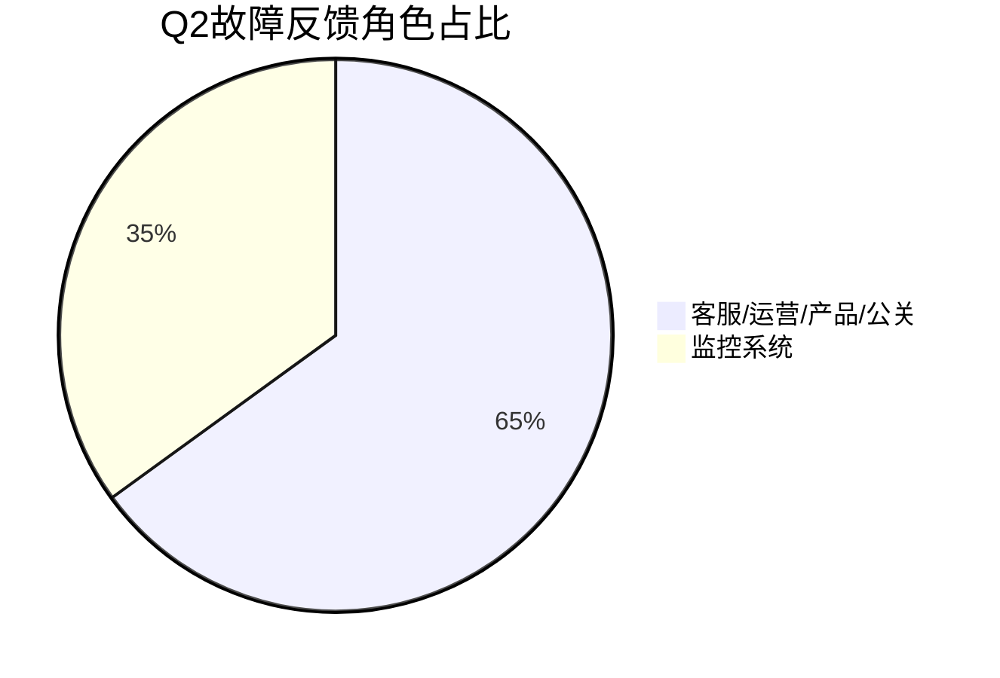

**核心痛点**:

1. **监控系统发现率低**: 仅35%的故障由监控系统第一时间发现
2. **人工反馈局限性**:
   - 无法做到24小时监控(凌晨0-8点盲区)
   - 判断不够精准
   - 响应延迟较大
3. **缺乏自动化智能化感知手段**

#### 面临的四大挑战

| 挑战            | 描述                                                   |
| --------------- | ------------------------------------------------------ |
| **挑战1** | 用户反馈数量多且文本杂乱(UID、视频回放URL、自动回复等) |
| **挑战2** | 如何识别高频且相似的文本反馈                           |
| **挑战3** | 同一时刻可能出现多个故障,如何区分                      |
| **挑战4** | 如何分辨故障文本与正常咨询提问                         |

#### 模型实现思路

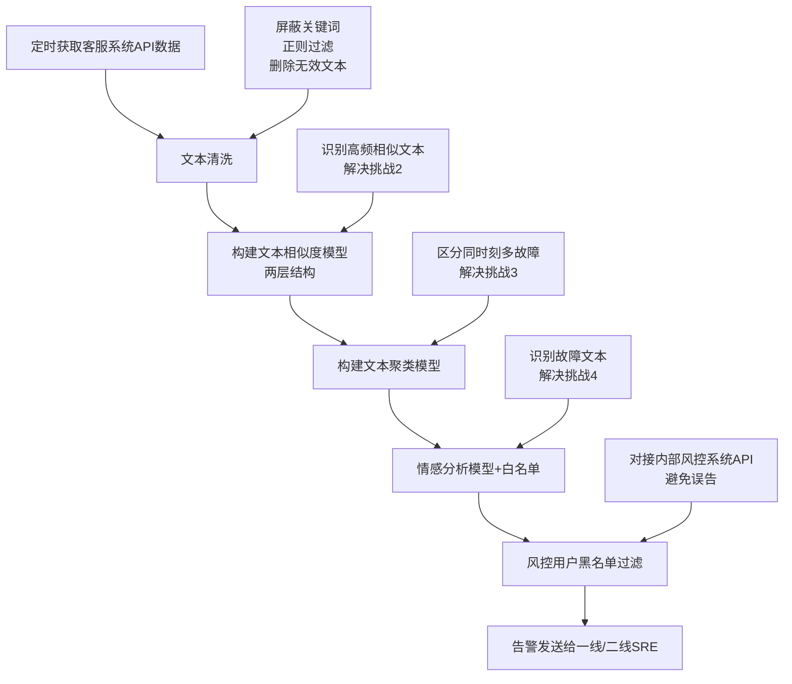

#### 模型技术细节

##### 1. 文本相似度分析

- **向量化方法**: TF-IDF
  - 提供更好的特征表示
  - 降低文本噪声
- **相似度计算**: 余弦相似度
  - 不受文本长度影响
  - 不受词频影响
  - 计算速度快
- **架构设计**: 两层相似度模型
  - 保障两两文本相似度的准确性

##### 2. 文本聚类模型

- **分词工具**: 百度LAC
  - 更适配中文场景
- **降维方法**: PCA
  - DBSCAN对高维数据适配性差,需先降维
- **聚类算法**: DBSCAN
  - 能够识别同一时刻的多个不同故障

**实际效果示例**:

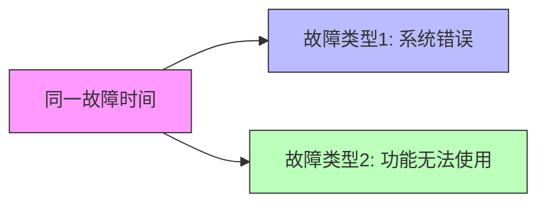

##### 3. 故障文本识别

**业务约束**: 运维告警允许一定程度误告,但**绝对不允许漏告**

- **目标**: Recall接近100%
- **为何不用文本分类**: 无法保证未来数据的泛化性

**解决方案**: 情感分析 + 白名单

- **情感分析**: 输出0-1的得分
  - 越接近1越褒义
  - 故障文本通常较贬义
- **判断逻辑**:
  - 情感得分 > 0.4(相对中性)
  - + 白名单匹配
  - + 高频相似
  - = 故障文本

#### 业务效果

| 指标                       | 优化效果                          |
| -------------------------- | --------------------------------- |
| **一定级故障发现率** | 从38%提升到93.2%                  |
| **监控能力**         | 24小时分钟级实时智能监控          |
| **响应时间**         | 从平均5分钟下降到1分钟            |
| **盲区覆盖**         | 填补凌晨0-8点用户报障无人响应盲区 |
| **准确性**           | 相比人工反馈更快更准确            |

**实际案例**:

- ✅ 识别出充值类故障
- ✅ 识别出"开麦说话听不到声音"故障
- ✅ 识别出"语音房进不去"故障
- ✅ 适配几乎所有用户反馈的故障文本

---

### 2.2 故障级根因定位算法(质量维度)

#### 核心问题

当发生大规模故障时,SRE需要快速回答三个核心问题:

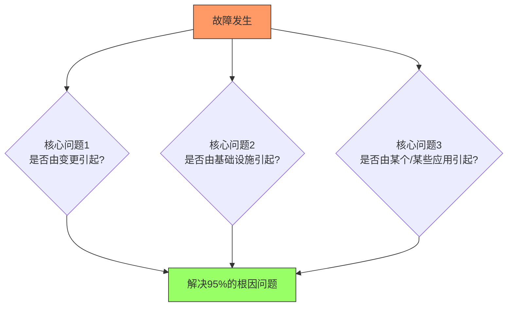

#### 数据收集架构

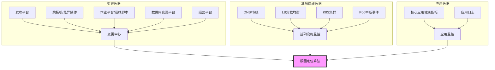

**数据收集难点**: 如何融会贯通多源异构数据

#### 算法七维度模型

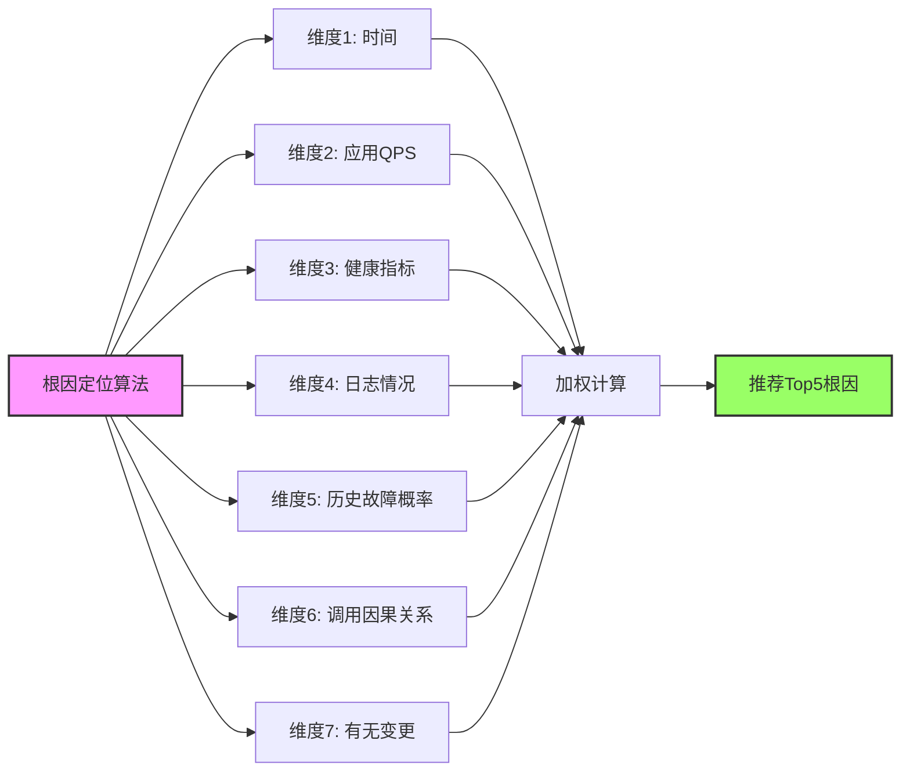

##### 各维度详解

| 维度                   | 说明                                                       | 技术方案         |
| ---------------------- | ---------------------------------------------------------- | ---------------- |
| **时间**         | 越接近故障时间的变更,越可能是根因                          | 时间权重计算     |
| **应用QPS**      | 衡量应用故障影响面``低QPS应用引发大规模故障可能性低 | QPS阈值判断      |
| **健康指标**     | 失败率、P99耗时                                            | 时序异常检测算法 |
| **日志情况**     | 日志错误数量趋势(非全文本)                                 | 时序异常检测算法 |
| **历史故障概率** | 对接故障管理系统历史分类数据                               | 概率统计         |
| **调用因果关系** | 区分是应用本身异常还是下游异常                             | 调用链分析       |
| **有无变更**     | 变更与故障的关联性                                         | 变更事件匹配     |

**时序异常检测**: 采用持续性算法,避免周期性和趋势性误判

#### 实际案例

##### 案例1: 华为客户端入口成功率下降

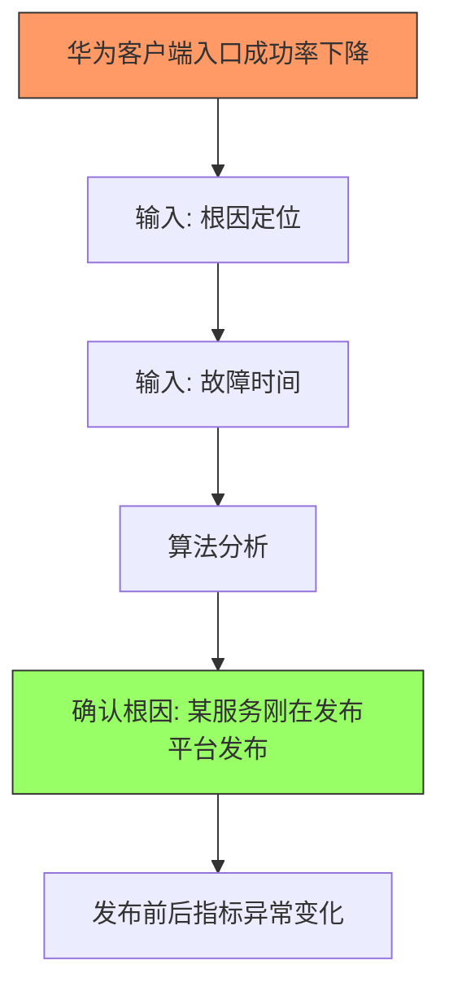

##### 案例2: 凌晨APP卡顿

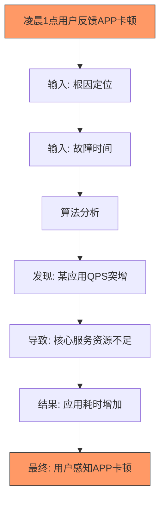

---

### 2.3 应用资源套餐推荐(成本维度)

#### 项目背景

**现状问题**:

1. **研发侧**:
   - 担心资源被占用,习惯性将HPA Request设置过大
   - 造成资源浪费
2. **SRE侧**:
   - 手动调整成千上万个服务的HPA配置
   - 计算项多,效率低,容易不准确

#### 解决方案流程

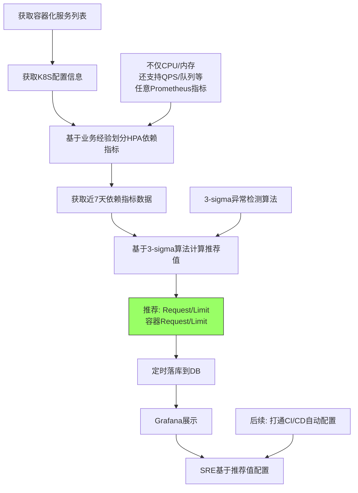

#### 多维度HPA支持

| HPA类型                        | 适用场景       |
| ------------------------------ | -------------- |
| **CPU**                  | CPU密集型应用  |
| **Memory**               | 内存密集型应用 |
| **QPS**                  | 流量驱动型应用 |
| **队列长度**             | 消息队列消费者 |
| **自定义Prometheus指标** | 任意业务指标   |

**核心理念**: 不同应用对CPU/内存的敏感度不同,需要基于业务特点选择合适的HPA指标。

#### 业务效果

| 指标                        | 优化效果                 |
| --------------------------- | ------------------------ |
| **平均CPU资源利用率** | 提升13.4%                |
| **配置准确性**        | 避免人工配置不准确问题   |
| **配置效率**          | 单个应用从5分钟降至1分钟 |
| **覆盖范围**          | 支持成千上万个服务       |

---

## 三、AIOps未来规划

### 3.1 宏观理念

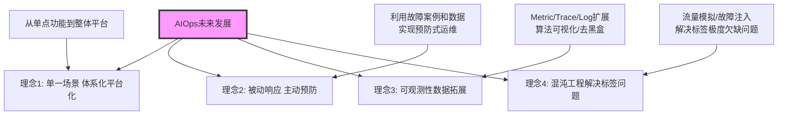

#### 四大核心理念

| 理念                   | 说明                                                     |
| ---------------------- | -------------------------------------------------------- |
| **体系化平台化** | 从单一场景功能向体系化、平台化方向演进                   |
| **主动预防**     | 利用积累的故障案例和数据,从被动响应转向主动预防          |
| **可观测性拓展** | 基于Metric/Trace/Log扩展,解放智能运维活力,实现算法可视化 |
| **混沌工程**     | 通过流量模拟、故障注入解决智能运维标签极度欠缺的痛点     |

### 3.2 具体落地方向

#### 1. 无阈值异常检测模型

**传统监控痛点**:

- 人工配置静态阈值
- 无法适应周期性和趋势性
- 严重依赖SRE业务经验

**解决方案**: 静态阈值 → 动态阈值

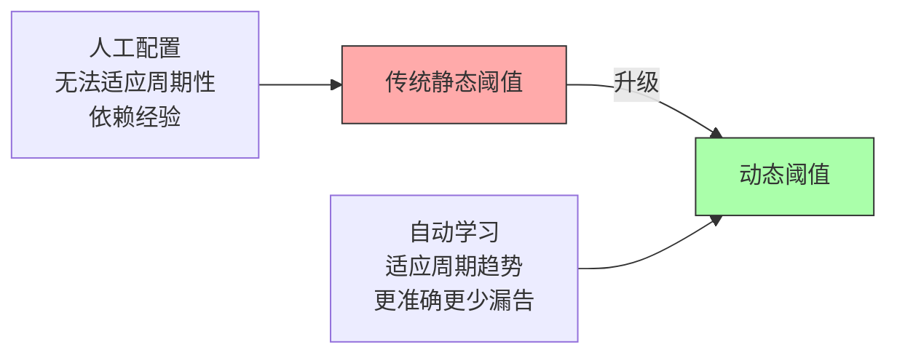

#### 2. 多维度根因定位模型

**与故障级根因定位的区别**:

| 对比项               | 故障级根因定位 | 多维度根因定位           |
| -------------------- | -------------- | ------------------------ |
| **数据量**     | 海量多源数据   | 单一宽表数据             |
| **性能**       | 约2分钟/次     | 更快                     |
| **适用场景**   | 大规模复杂故障 | 多维度指标场景(如崩溃率) |
| **算法复杂度** | 高             | 相对简单                 |

**多维度根因定位流程**:

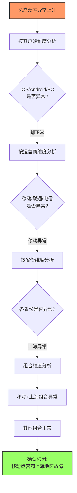

**宽表结构示例**:

| 时间             | 省份 | 运营商 | 客户端版本 | 崩溃率 | ... |
| ---------------- | ---- | ------ | ---------- | ------ | --- |
| 2023-05-01 10:00 | 上海 | 移动   | 3.2.1      | 5.2%   | ... |
| 2023-05-01 10:00 | 北京 | 电信   | 3.2.1      | 0.8%   | ... |

**算法核心**: 模拟人工判断流程,自动进行多维度下钻分析

#### 3. 大活动弹性扩缩容模型

**业务场景**: 趣丸有大量运营活动,需要提前扩容

**传统方式痛点**:

- 基于历史经验或拍脑袋
- 不够智能和自动化

**解决方案**:

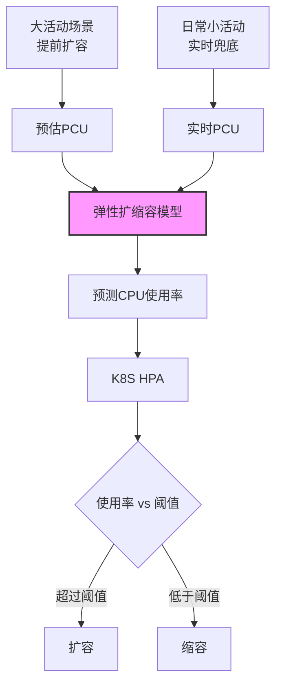

**双模式支持**:

- **大活动**: 配置预估PCU,提前扩容
- **日常小活动**: 使用实时PCU,实时兜底

#### 4. ChatGPT与AIOps结合

**现状**: 已有运维机器人"贾维斯"(命令式交互)

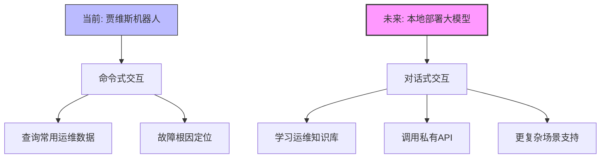

**未来规划**:

1. **开源大模型选型**:

   - Meta开源的LLaMA
   - 清华开源的ChatGLM
   - 其他开源模型
2. **本地化部署**:

   - 学习趣丸运维知识库
   - 调用内部私有API
   - 保障数据安全
3. **理想场景**:

```
用户: "贾维斯,查询一下TT语音系统当前的性能瓶颈"
贾维斯: [自动分析并返回详细报告]

用户: "帮我在登录场景下做一个故障演练"
贾维斯: [自动执行混沌工程实验]

用户: "输出一个详细的运维成本报告,并分析哪里成本不合理"
贾维斯: [生成报告并提供优化建议]
```

**核心优势**: 对话式交互 + 本地部署 + 敏感数据安全

---

## 四、Q&A精选

### Q1: 如果没有变更中心,如何获取那么多指标和数据进行关联分析?

**A**:

1. **API对接**:

   - 优先查看各平台是否有可用API
   - 如无API,分析后台系统接口进行数据爬取
2. **应用健康指标**:

   - 统一存储在Prometheus
   - 便于集中获取和分析
3. **实施建议**:

   - 与各团队沟通开放数据API
   - 寻找替代数据获取方式
   - 逐步建设变更中心(长期目标)

### Q2: 异常检测使用了哪些模型?是否针对每个时序指标建立模型?

**A**:

**当前方案**:

| 场景                   | 模型方法         | 说明                                      |
| ---------------------- | ---------------- | ----------------------------------------- |
| **基础设施指标** | 统计学方法       | 箱线图、3-sigma 、计算性能要求高,效率优先 |
| **应用指标**     | Facebook Prophet | 时序预测模型``每个指标独立建模            |

**未来规划**:

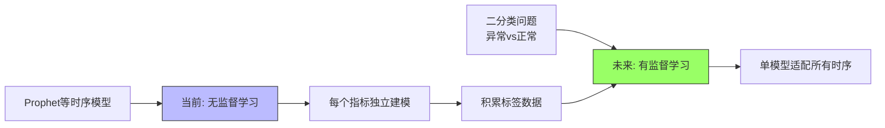

**演进路径**: 无监督(当前) → 积累标签 → 有监督(未来)

---

## 五、总结与展望

### 核心收获

1. **AIOps理念**: 从自动化到智能化,通过机器学习解决复杂多变的运维场景
2. **三大维度实践**:

   - **效率**: NLP舆情分析实现24小时智能故障发现
   - **质量**: 七维度根因定位算法辅助SRE快速定位问题
   - **成本**: 智能资源推荐提升13.4%资源利用率
3. **未来方向**: 体系化、主动化、可观测、大模型融合

### 关键成功因素

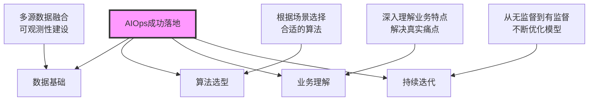

### 实践建议

1. **从小场景切入**: 选择痛点明确、数据完善的场景开始
2. **注重数据质量**: 数据收集和清洗是基础
3. **业务价值优先**: 算法服务于业务,不为技术而技术
4. **持续优化迭代**: AIOps是长期工程,需要不断积累和优化

---

> **分享时间**: 2023年5月
> **受众**: SRE、运维及稳定性保障工程师
> **核心价值**: 从概念到实践,打造完整的AIOps体系
