# 银行业务中台架构设计及实践经验

> 来源：未核验 · 类型：分享 · 状态：draft


## 分享概述

本文基于湖南三湘银行的业务中台建设实践，深入探讨了银行为什么要建中台、如何设计业务中台架构，以及在落地过程中的实践经验。分享内容涵盖中台概念解析、六大核心中心设计、实施方法论等关键内容。

---

## 一、为什么银行要建中台

### 1.1 中台的概念理解

#### 1.1.1 业界对中台的不同理解

- **技术中台**：微服务、AIOps等平台技术
- **业务中台**：用户中心、订单中心等微服务集散地
- **组织中台**：组织架构调整
- **思想中台**：快速聚合后台数据能力的体系

#### 1.1.2 传统定义

> 中台是一个**企业级的能力复用平台**

这个定义包含四个关键要素：
- **企业级**：定义了中台的范围，区分了中台与单系统、服务化、微服务的区别
- **能力**：定义了中台的承载对象，解释了各种中台存在的合理性
- **复用**：定义了中台的核心价值，强调易用性和复用性
- **平台**：定义了中台的主要形式，区别于传统应用系统的拼凑模式

#### 1.1.3 重新定义中台

基于实践经验，提出新的中台概念：

> 中台是基于**企业资源整合**的需要，通过**运营模式变革**、**组织架构调整**或**IT架构重构**的方式，形成**企业级服务复用能力**。

**核心特征：**
- **战略目标**：实现企业资源整合
- **能力体现**：企业级服务复用
- **实现手段**：运营模式变革、组织架构调整、IT架构重构
- **解决问题**：突破组织壁垒、实现资源共享、快速支持业务创新

### 1.2 中台演变案例

以电商公司为例说明中台的演变过程：

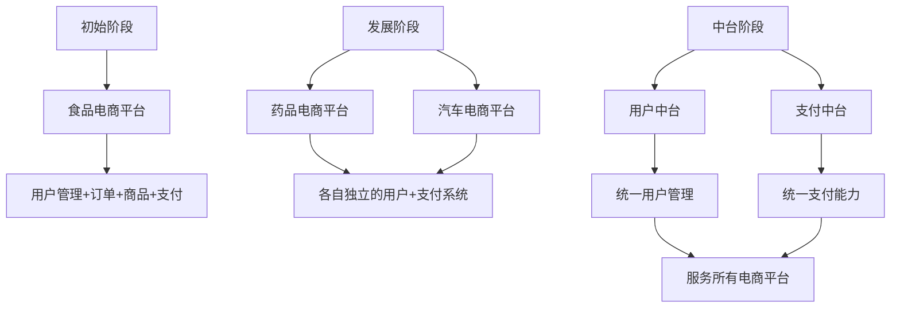

**演变过程：**
1. **初期**：单一业务平台（食品电商）
2. **扩张期**：多个独立平台（药品、汽车电商），能力重复建设
3. **中台期**：建立用户中台和支付中台，统一管理和服务

### 1.3 银行为什么要建中台

#### 1.3.1 银行组织架构现状

银行本身已经具备前中后台的组织架构：

- **前台**：营业部、分支行、金融市场（业务经营机构）
- **中台**：公司部、个人部、风险管理、信贷审批（业务管理部门）
- **后台**：办公室、人力、科技、审计（内部管理机构）

#### 1.3.2 银行IT系统的痛点

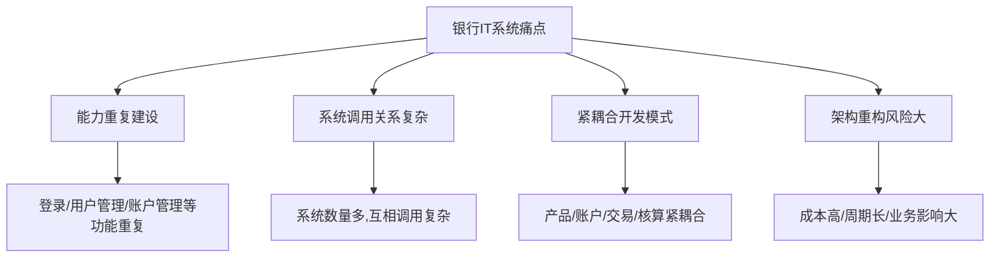

**具体问题：**

1. **能力重复建设**
   - 多个系统从不同厂商采购
   - 登录、用户管理、账户管理等基础能力重复开发

2. **系统调用关系复杂**
   - 系统数量庞大（三湘银行140+个系统）
   - 业务处理需要多系统协同

3. **紧耦合开发模式**
   - 产品、账户、交易、核算紧密耦合
   - 规则变更需要修改代码

4. **架构重构困难**
   - 成本高、周期长、风险大
   - 只能进行局部优化

#### 1.3.3 与互联网金融的差距

| 对比项 | 互联网金融公司 | 传统商业银行 | 大型银行 |
|--------|----------------|--------------|----------|
| 新产品上线周期 | < 1个月 | 3个月以上 | 6-12个月 |

#### 1.3.4 建设驱动力

**核心驱动：科技部门发起**

- 业务部门对中台建设需求不迫切（组织架构已是中台模式）
- 科技部门面临互联网金融竞争压力
- 需要提升需求响应速度和开发效率
- 传统架构难以支持快速响应能力

---

## 二、银行业务中台架构设计

### 2.1 设计目标

业务中台建设的四大目标：

1. **快速支持创新**（首要目标）
   - 快速支持创新产品落地实施
   - 降低整体成本和实施周期

2. **复用现有系统**
   - 不推翻现有架构
   - 降低风险和成本

3. **支持所有业务场景**
   - 不限于特定业务
   - 全业务覆盖

4. **实现平滑过渡**
   - 支持新老架构并行
   - 逐步迁移，降低实施风险

### 2.2 要解决的核心问题

#### 2.2.1 传统架构的问题

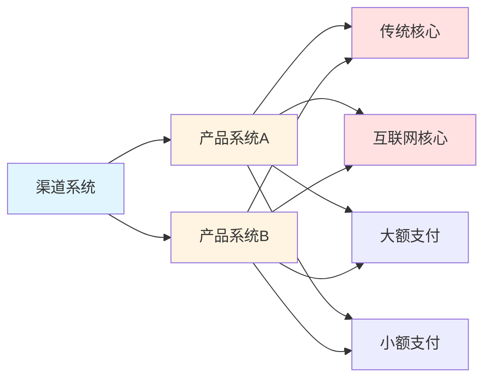

**问题分析：**
- 渠道系统需要对接每个产品系统（接口数量 = 产品数 × 接口类型）
- 产品系统需要对接多个核心和支付系统
- 产品系统需要处理记账和支付异常
- 新产品上线成本高、周期长

### 2.3 六大核心中心设计

三湘银行业务中台包含六个核心中心：

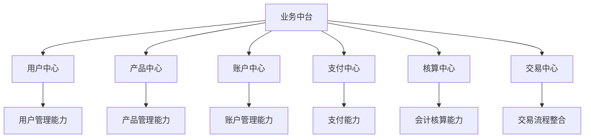

#### 2.3.1 用户中心

**要解决的五大问题：**

1. **客户管理问题**：信息分散在多个系统，存在不一致
2. **生命周期管理**：缺乏对游客、注册用户的管理
3. **电子渠道打通**：多渠道信息未打通
4. **客户信息整合**：无法在一处获取完整客户信息
5. **签约信息管理**：签约信息分散在多个系统

**核心设计：**

##### 用户生命周期管理

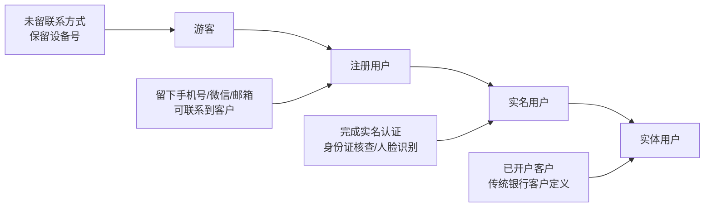

**六大核心功能：**

1. **生命周期管理**：从游客到实体用户的全生命周期
2. **用户信息管理**：统一信息模型，实现信息同步
3. **统一登录**：
   - 支持用户名/手机号/账号/邮箱登录
   - 支持人脸/指纹/手势/扫码登录
   - 支持微信/支付宝等第三方授权登录
4. **统一签约**：所有签约数据统一管理，统一操作
5. **统一视图**：客户360度视图（基本信息、资产、负债、交易流水、行为）
6. **用户成长体系**：用户等级管理、积分体系、权益兑现

**功能架构：**

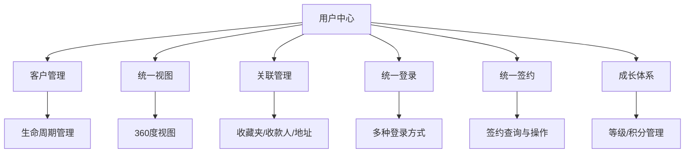

**等同于传统系统：**
- ECIF（企业客户信息系统）
- 实时CIM（客户信息管理）
- 渠道端用户体验支持

#### 2.3.2 产品中心

**要解决的四大问题：**

1. **产品目录管理**：缺乏全行产品清单统一管理
2. **产品管理分散**：不同产品在不同系统管理
3. **产品查询复杂**：渠道需对接多个产品系统
4. **上下架不灵活**：需要上线才能实现，无法实时响应监管要求

**核心概念：**

##### 产品定义

> 产品是控制某一事物流程数量变化操作对应的运营规则集合

- **产品属性**：每个产品的具体运营规则项（利率、存期、结息日期等）
- **属性分类**：
  - **运营属性**：存期、账务处理、购买规则等
  - **销售属性**：销售渠道、限额、客群等
  - **审批属性**：审批流程、审批要求等

##### 产品分类

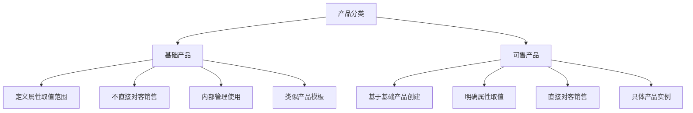

**示例：**
- **基础产品**：存款产品（利率3%-3.5%，存期3/6/12个月）
- **可售产品**：基于基础产品，确定利率3.2%，存期6个月，命名后对客销售

##### 产品中心范围

- **广义**：包含产品管理和产品运营系统（核心系统、贷款系统等）
- **狭义**（三湘实现）：仅产品管理功能（清单管理、属性管理）

**功能架构：**

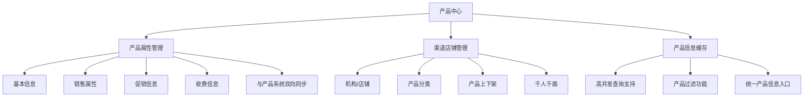

**核心能力：**
1. **产品信息统一管理**：所有产品信息集中管理
2. **高并发查询支持**：产品信息缓存，支持高并发访问
3. **产品过滤**：根据渠道和客户标签自动过滤可售产品
4. **千人千面**：不同客户看到不同产品
5. **灵活上下架**：配置化实现，无需上线

#### 2.3.3 核算中心

**要解决的四大问题：**

1. **核算规则分散**：产品核算在各业务系统实现，无法统一查看
2. **交易与核算耦合**：核算失败导致交易失败
3. **总账不实时**：总账仅支持夜间批次
4. **开发成本高**：核算规则修改需要代码开发

**银行账务处理模式：**

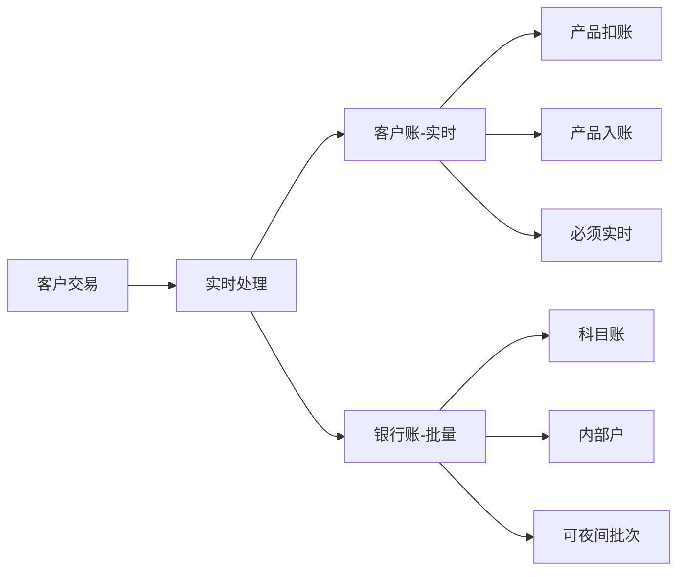

**两类账务：**
- **客户账**：与客户相关，必须实时处理（产品扣账、入账）
- **银行账（总账）**：银行内部核算，可以批量处理（科目账、内部户）

**核心设计：**

##### 三大功能模块

1. **核算规则配置**
   - 科目配置
   - 分录配置
   - 税率配置（价税分离）
   - 交易映射配置

2. **批量过账**
   - 数据解析
   - 银行账生成
   - 借贷平衡检查
   - 总分检查

3. **实时过账**
   - 交易型总账
   - 实时记账支持

##### 核算流程

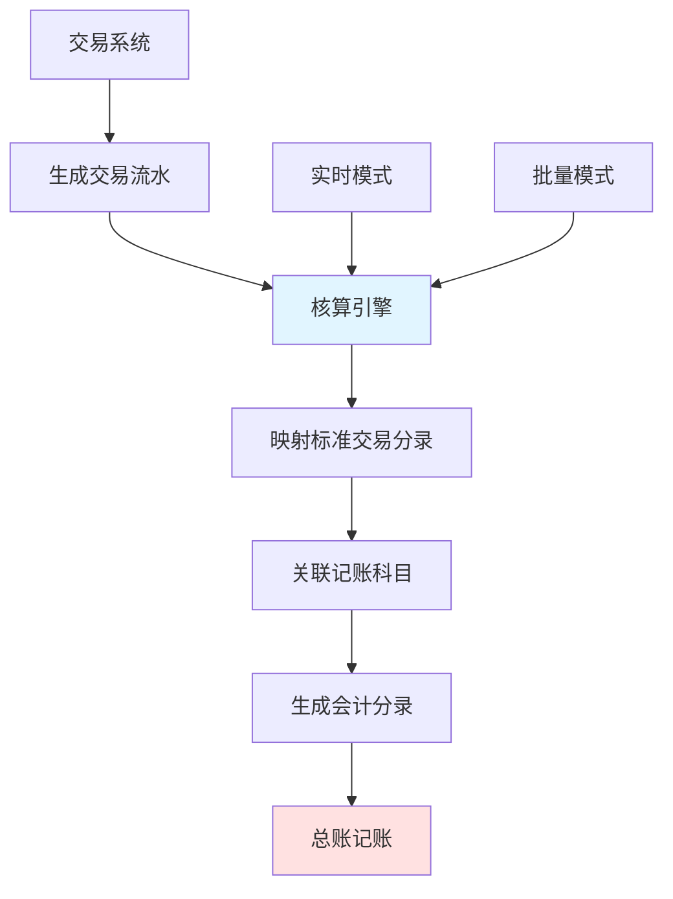

**核心价值：**
- 交易系统无需关心核算规则
- 只需处理客户账，生成交易流水
- 核算引擎统一处理银行账
- 支持实时和批量两种模式

#### 2.3.4 账户中心

**要解决的四大问题：**

1. **账户能力重复建设**：每个产品系统都有账户管理功能
2. **跨系统记账复杂**：需要对接多个产品系统
3. **账户能力参差不齐**：不同系统账户管理成熟度不同
4. **缺乏统一视图**：无法获取客户所有账户信息

**核心概念：**

##### 账户定义

> 账户是用于登记和管理某一事物所留存数量的特殊账号

##### 三大分离原则

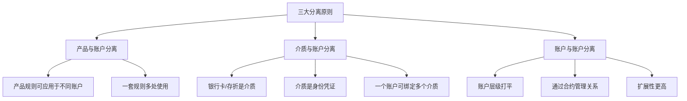

**1. 产品与账户分离**

好处：
- 一套产品规则可应用于多种账户
- 例如：存款计息规则可同时用于一类户、二类户、积分账户

**2. 介质与账户分离**

好处：
- 换卡只需更换介质，账户无需变动
- 一个账户可绑定多个介质（银行卡+存折）

**3. 账户与账户分离**

好处：
- 账户层级打平，通过合约管理关系
- 支持各种账户关系扩展

##### 账户基础模型

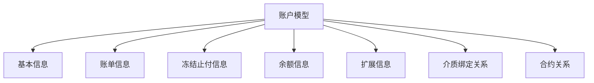

##### 标准化功能

**基础功能：**
- 限额管理
- 合约管理
- 智能路由
- 睡眠户管理

**原子服务：**
- 开户/销户
- 存取（记账）
- 冻结/止付
- 查询

##### 合约管理

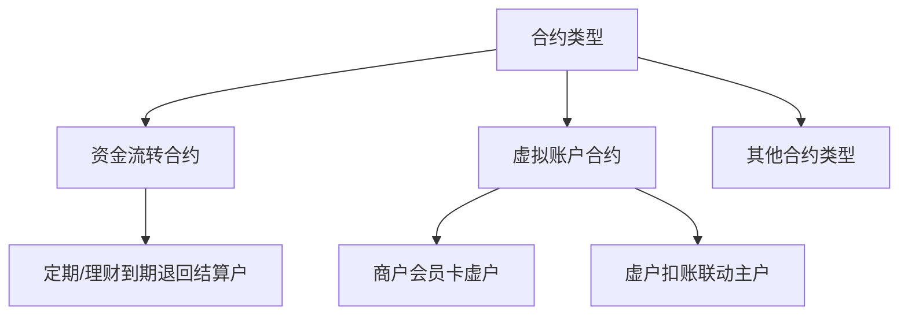

**合约作用：**
- 管理账户间关系
- 控制资金流转流向
- 实现自动联动扣账

##### 渐进式建设

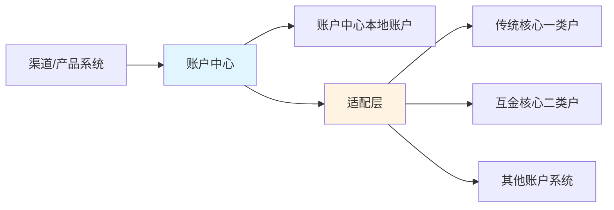

**优势：**
- 无需一次性迁移所有账户
- 通过适配层对接现有系统
- 统一标准服务接口
- 逐步迁移，降低风险

#### 2.3.5 支付中心

**要解决的四大问题：**

1. **缺乏支付通道管理**：各种通道无统一管理
2. **对接复杂**：每个系统对接支付通道成本高
3. **缺乏智能路由**：无法根据费率、实时性选择最优通道
4. **无统一额度控制**：不同支付系统无法统一限额

**核心概念：**

##### 支付通道与工具

- **支付通道**：执行实际支付交易的通道（对接哪个支付系统）
- **通道工具**：区分支付通道的不同支付业务（系统的不同接口）

##### 动账即支付

**创新理念：**

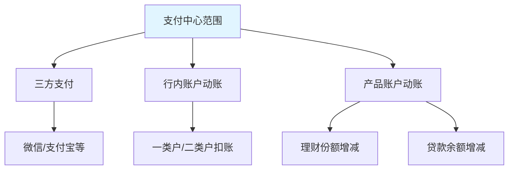

**核心思想：**
- 所有涉及资产变动的操作都通过支付中心
- 不仅是三方支付
- 包括行内账户动账
- 包括产品账户动账

##### 标准化接入

**每个支付通道只需实现三个接口：**
1. 支付接口
2. 冲正接口
3. 状态查询接口

**支付中心负责：**
- 跨通道事务一致性控制
- 支付失败自动回冲
- 保证业务一致性

##### 功能架构

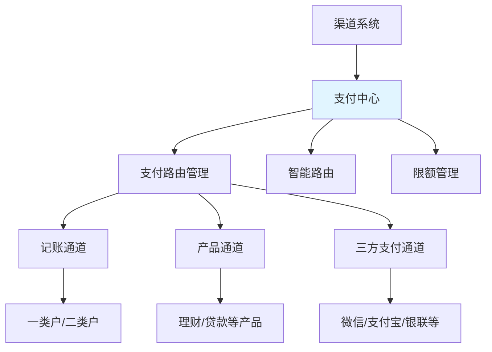

**核心价值：**
- 渠道系统无需对接多个支付系统
- 统一支付接口
- 统一限额控制
- 智能路由选择

#### 2.3.6 交易中心

**要解决的四大问题：**

1. **产品对接复杂**：渠道需对接每个产品系统
2. **不支持多支付工具**：无法用多种方式支付一个产品
3. **异常控制复杂**：异常处理逻辑分散，易出现短款
4. **不支持批量购买**：无法一次购买多个产品

**核心设计：订单模型**

##### 订单模型设计

借鉴电商订单模型，应用于银行交易：

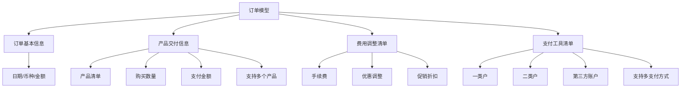

##### 订单处理流程

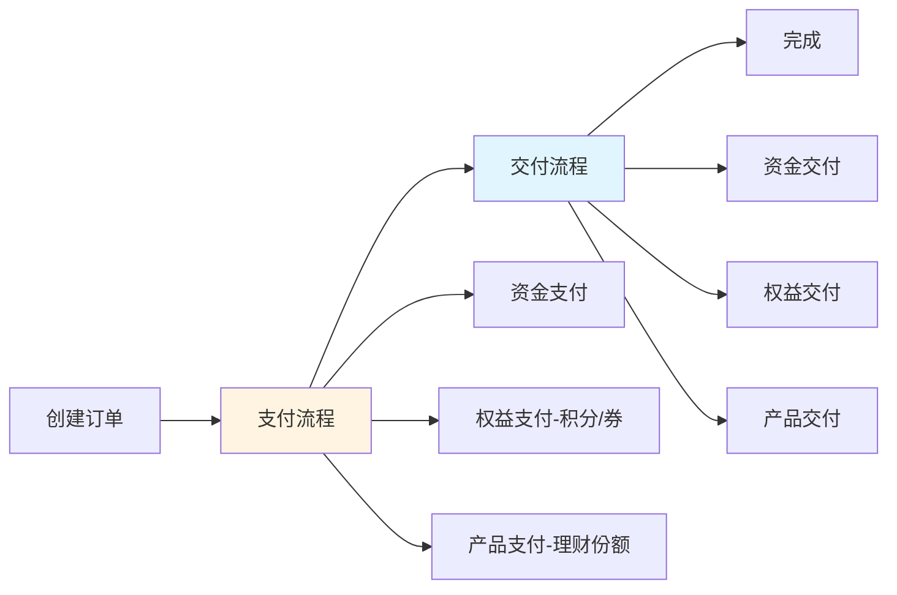

**支付和交付都通过统一支付实现，这就是"动账即支付"的原因**

##### 订单模型的通用性

订单模型可支持银行所有业务：

| 业务类型 | 订单类型 | 客户支付 | 银行交付 |
|----------|----------|----------|----------|
| 理财购买 | 销售订单 | 资金 | 产品份额 |
| 存款购买 | 销售订单 | 资金 | 额度 |
| 理财赎回 | 采购订单 | 产品份额 | 资金 |
| 贷款放款 | 采购订单 | 负债（借据） | 资金 |
| 贷款还款 | 销售订单 | 资金 | 借据（结清） |

**核心价值：**
- 统一的交易处理模型
- 支持多产品批量购买
- 支持多支付工具组合
- 统一异常处理逻辑

### 2.4 整体架构流程

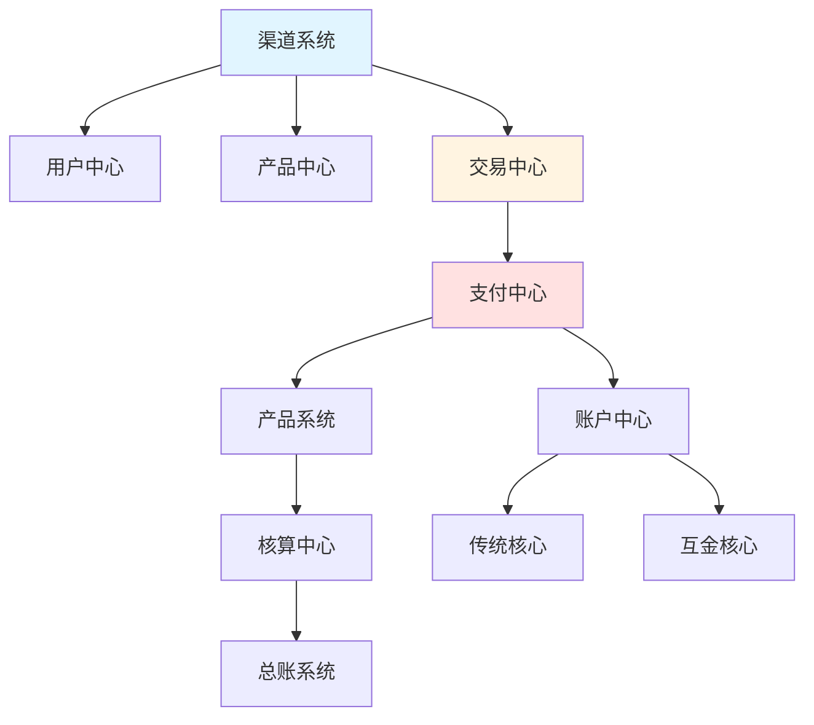

**核心价值：**

1. **渠道与产品解耦**
   - 渠道系统只需对接用户中心、产品中心、交易中心
   - 标准接口，一次对接，永久使用

2. **新产品快速上线**
   - 产品系统实现标准接口
   - 同步产品信息
   - 实现交付接口
   - 实现核算功能
   - 即可被所有渠道访问

3. **三个核心模型**
   - **货架模型**（产品中心）：产品展示和管理
   - **订单模型**（交易中心）：交易流程标准化
   - **支付模型**（支付中心）：动账即支付

---

## 三、实践经验与落地方法

### 3.1 项目概况

#### 3.1.1 建设规模

- **总系统数**：22个系统
  - 业务中台：6个核心系统
  - 渠道中台：若干系统
  - 数据中台：若干系统
  - 公共服务：若干系统

- **基础设施**：部署阿里飞天私有云

#### 3.1.2 项目周期

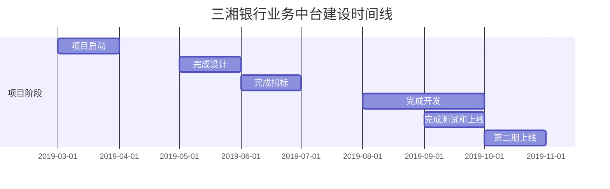

**时间线：**
- 2019年3月：项目启动
- 2019年5月：完成整体设计
- 2019年6月：完成招标
- 2019年8月：完成开发
- 2019年9月：完成测试和上线
- 2019年10月：第二期上线

**项目特点：**
- 三湘银行历史上最大项目
- 周期短、投入相对较小
- 利用外包方式建设
- 证明中台建设不一定需要特别长时间和大投入

### 3.2 核心经验总结

#### 3.2.1 经验一：项目发起策略

**如何说服高层建设中台？**

```mermaid
graph TD
    A[项目发起策略] --> B[联合专业机构评估]
    A --> C[高层和业务访谈]
    A --> D[报行班会和董事会]
    
    B --> B1[外来和尚好念经]
    B --> B2[增强评估可信度]
    
    C --> C1[让高层理解中台价值]
    C --> C2[让业务理解中台理念]
    
    D --> D1[获得正式批准]
    D --> D2[确保资源投入]
```

**三个关键步骤：**

1. **联合专业机构评估**
   - 避免"自说自话"
   - 专业机构评估更有说服力
   - 外部视角更客观

2. **高层和业务访谈**
   - 让高层理解建中台的好处
   - 让业务理解中台理念
   - 获得各方支持

3. **正式审批流程**
   - 报行班会
   - 报董事会
   - 获得正式批准

**输出物：**
- 现状评估报告
- 应用架构整体设计方案（中台框架）

#### 3.2.2 经验二：规范先行

**为什么需要规范？**
- 涉及多个厂商、多个团队
- 功能分散在多个系统
- 必须有统一标准才能整合

**制定的核心规范：**

```mermaid
graph TD
    A[核心规范体系] --> B[流水号规范]
    A --> C[错误码规范]
    A --> D[接口规范]
    A --> E[编码规范]
    A --> F[应用开发规范]
    
    B --> B1[统一流水号]
    B --> B2[系统流水号-业务流水号]
    B --> B3[接口流水号]
    
    C --> C1[全行统一错误码]
    C --> C2[快速确定交易状态]
    
    D --> D1[报文格式]
    D --> D2[交易码规范]
    
    F --> F1[防止短款]
    F --> F2[幂等性处理]
```

**1. 流水号规范**
- **统一流水号**：一笔交易从头到尾不变
- **系统流水号**：每个系统的业务流水号，唯一标识
- **接口流水号**：每次接口调用的流水号

**2. 错误码规范**
- 全行统一错误码定义
- 快速确定交易成功/失败状态

**3. 接口规范**
- 统一报文格式
- 统一交易码规范

**4. 编码规范**
- 各种编码标准化

**5. 应用开发规范**
- 防止短款
- 幂等性处理
- 金融行业特殊要求

**执行要求：**
- 所有人员必须严格遵循
- 保证系统建设不出现偏差

#### 3.2.3 经验三：坚持自主设计

**为什么要自主设计？**

```mermaid
graph TD
    A[自主设计的重要性] --> B[避免厂商产品绑架]
    A --> C[符合自身需求]
    A --> D[掌握核心能力]
    
    B --> B1[厂商按自己产品设计]
    B --> B2[不是银行想要的]
    
    C --> C1[基于实际情况]
    C --> C2[针对性设计]
    
    D --> D1[自主可控]
    D --> D2[持续演进]
```

**坚持原则：**

1. **行方自主完成高阶设计**
   - 功能设计（需求分析）
   - 详细接口设计
   - 虽然人员不多，但设计必须自己做

2. **厂商严格按设计实施**
   - 厂商产品必须适配行方设计
   - 不是行方适配厂商产品
   - 这是银行建中台的必要做法

3. **与厂商协同评审**
   - 可以与厂商同事一起评审
   - 但最终意见由行方决定

**效果：**
- 避免被厂商产品绑架
- 最终系统符合预期
- 整合测试问题少

#### 3.2.4 经验四：严守架构定位

**为什么要严守定位？**

```mermaid
graph TD
    A[严守架构定位] --> B[明确系统边界]
    A --> C[避免功能混乱]
    A --> D[保证整体一致性]
    
    B --> B1[每个系统功能明确]
    C --> C1[不随意调整]
    D --> D1[整合顺利]
```

**执行原则：**

1. **高阶设计确定功能定位**
   - 每个系统的功能边界明确
   - 严格按定位落地

2. **遇到不明确功能**
   - 立即通过评审明确定位
   - 调整定位分工

3. **不接受挑战**
   - 已明确的定位不因开发人员或厂商意见改变
   - 严格按行方要求执行

**价值：**
- 短时间内完成建设的关键
- 整合测试问题少
- 系统边界清晰

#### 3.2.5 经验五：架构并行与平滑过渡

**为什么需要平滑过渡？**
- 建中台期间仍需接常规业务需求
- 科技部门同时做两件事
- 必须保证业务不受影响

**核心策略：**

```mermaid
graph TD
    A[平滑过渡策略] --> B[旁路架构]
    A --> C[尽可能复用已有系统]
    A --> D[逐步迁移]
    
    B --> B1[新架构不阻断原交易]
    B --> B2[两个架构并行]
    B --> B3[交易可在两架构处理]
    
    C --> C1[降低开发成本]
    C --> C2[降低开发风险]
    
    D --> D1[按产品逐个迁移]
    D --> D2[降低迁移风险]
    D --> D3[减少影响范围]
```

**1. 旁路架构**
- 新业务中台是旁路，不阻断原交易
- 新老架构并行
- 所有交易在两个架构都能处理

**2. 尽可能复用已有系统**
- 降低开发成本
- 降低开发风险

**3. 逐步迁移**
- 按产品逐个从老架构迁移到新架构
- 降低整体迁移风险
- 出现问题影响范围小

**价值：**
- 说服业务的关键
- 降低实施风险
- 保证业务连续性

### 3.3 技术选型

#### 3.3.1 分布式框架

**选择：阿里 SOFA（Service-Oriented Fabric Architecture）**

- 分布式服务框架
- 包含注册中心
- 非开源框架

**为什么不用开源框架？**
- 厂商对开源框架能力欠缺
- 阿里框架与私有云配套

#### 3.3.2 数据库方案

**选择：阿里云 RDS（基于 MySQL）+ 分库分表**

- 未使用分布式数据库（OceanBase）
  - 去年成熟度不高
  - 风险较大
  - 今年2.0版本成熟度提升

- 使用阿里 DBP 分库分表中间件
  - 支持高并发
  - 注：DBP已计划淘汰，阿里将推出新中间件

#### 3.3.3 事务一致性

**选择：业务一致性控制（冲正模式）**

- 未使用分布式事务
  - 技术能力限制
  - 阿里分布式事务产品成熟度不高
  - 风险较大

- 通过业务冲正保证一致性
  - 业务补偿机制
  - 成熟可靠

### 3.4 建设效果

#### 3.4.1 业务效果

**达到预期目标：**

1. **新产品上线周期**
   - 建设前：3个月以上
   - 建设后：1个月内

2. **开发成本**
   - 显著降低

3. **后续挑战**
   - 老业务迁移到业务中台成本较大

#### 3.4.2 对中小银行的价值

**为什么中小银行更需要中台？**

```mermaid
graph TD
    A[中小银行痛点] --> B[资源不如大行]
    A --> C[效率不如互联网]
    A --> D[竞争压力大]
    
    E[中台价值] --> F[提升效率]
    E --> G[降低成本]
    E --> H[增强竞争力]
    
    B --> E
    C --> E
    D --> E
```

**核心观点：**
- 大行对成本和效率不太敏感
- 中小银行资源有限，必须提升效率
- 不改变将被淘汰
- 中台是可行方案之一（非唯一）

### 3.5 常见问题解答

#### Q1：哪个厂商能给出中台方案？

**答：目前没有厂商能给出完整的银行中台方案**

- 阿里的中台方案偏互联网，不适合银行
- 建议基于自身情况针对性设计
- 这也是三湘自主设计的原因

#### Q2：中台对中小银行的价值？

**答：价值很大**

- 提升效率、降低成本
- 中小银行资源有限，更需要效率提升
- 不改变会被淘汰
- 中台是可行方案之一

#### Q3：业务架构会考虑微服务吗？

**答：已经是分布式架构**

- 使用阿里SOFA框架，本质是微服务
- 服务拆分粒度还在系统级别
- 未来并发量上升会继续拆分成更细粒度的微服务

#### Q4：旁路架构是否要做很多接口？

**答：接口数量反而减少**

- 基于业务模型设计，接口高度抽象
- 账户中心：传统核心200+接口 → 标准化为开/销/存/取等少量接口
- 订单中心：只有订单创建、执行等标准接口
- 接口不再变化

#### Q5：账户与核算的区别？

**答：**

- **账户（客户账）**
  - 客户账户资金增减
  - 必须实时处理
  - 客户可见

- **核算（银行账）**
  - 银行内部核算规则
  - 科目归属、记账规则
  - 可以批量处理
  - 客户不可见

#### Q6：中台外包能做好吗？

**答：设计不能外包，实施可以外包**

- 设计必须自己做
- 厂商从成本角度考虑，会用自己产品
- 中台必须根据银行特色建设
- 外包管理严格，实施质量可以保证

#### Q7：除了六个中台，还准备做什么？

**答：继续扩展**

- 权益中心
- 营销中心
- 中台概念可以持续扩展

#### Q8：分布式事务和分布式数据库用了吗？

**答：都没用**

- 分布式事务：通过业务冲正实现一致性
- 分布式数据库：使用RDS + 分库分表

#### Q9：大行做业务中台有什么建议？

**答：业务模型是通用的**

- 大行难度在于组织架构复杂、业务量大、风险大
- 强烈推荐旁路架构
- 逐步迁移，不要一次性迁移
- 大行承担不了一次性迁移的风险

---

## 四、架构对比：中台 vs SOA

### 4.1 核心区别

| 维度 | 传统 SOA | 业务中台 |
|------|----------|----------|
| **目标** | 技术层面的服务化 | 企业资源整合 |
| **范围** | IT架构重构 | 运营模式变革 + 组织调整 + IT重构 |
| **驱动** | 技术驱动 | 业务价值驱动 |
| **复用** | 技术复用 | 能力复用 |
| **易用性** | 关注不足 | 核心价值 |
| **业务模型** | 较少涉及 | 核心内容 |

### 4.2 中台的独特之处

```mermaid
graph TD
    A[中台独特价值] --> B[业务模型重构]
    A --> C[运营模式变革]
    A --> D[能力复用平台]
    
    B --> B1[订单模型]
    B --> B2[货架模型]
    B --> B3[支付模型]
    
    C --> C1[动账即支付]
    C --> C2[产品与账户分离]
    C --> C3[介质与账户分离]
    
    D --> D1[企业级能力]
    D --> D2[易用性优先]
    D --> D3[快速创新]
```

**核心差异：**

1. **不仅是技术架构**
   - SOA：主要是技术层面的服务化
   - 中台：涉及业务模型、运营模式变革

2. **业务模型创新**
   - 订单模型：统一交易处理
   - 货架模型：统一产品管理
   - 支付模型：动账即支付

3. **能力复用优先**
   - SOA：技术复用
   - 中台：业务能力复用，强调易用性

---

## 五、关键成功因素总结

### 5.1 战略层面

```mermaid
graph TD
    A[战略成功因素] --> B[高层支持]
    A --> C[明确目标]
    A --> D[合理预期]
    
    B --> B1[董事会/行班会批准]
    B --> B2[资源保障]
    
    C --> C1[快速创新为首要目标]
    C --> C2[降低成本和周期]
    
    D --> D1[不追求完美]
    D --> D2[逐步演进]
```

### 5.2 设计层面

```mermaid
graph TD
    A[设计成功因素] --> B[自主设计]
    A --> C[规范先行]
    A --> D[严守定位]
    
    B --> B1[不被厂商绑架]
    B --> B2[符合自身需求]
    
    C --> C1[统一标准]
    C --> C2[保证整合]
    
    D --> D1[明确边界]
    D --> D2[不随意调整]
```

### 5.3 实施层面

```mermaid
graph TD
    A[实施成功因素] --> B[旁路架构]
    A --> C[逐步迁移]
    A --> D[严格管理]
    
    B --> B1[不影响现有业务]
    B --> B2[新老并行]
    
    C --> C1[按产品迁移]
    C --> C2[降低风险]
    
    D --> D1[严格执行规范]
    D --> D2[严格按设计实施]
```

### 5.4 组织层面

```mermaid
graph TD
    A[组织成功因素] --> B[专业机构协助]
    A --> C[高层业务访谈]
    A --> D[跨部门协同]
    
    B --> B1[增强可信度]
    B --> B2[专业评估]
    
    C --> C1[理解中台价值]
    C --> C2[获得支持]
    
    D --> D1[业务配合]
    D --> D2[科技主导]
```

---

## 六、风险与挑战

### 6.1 主要风险

| 风险类型 | 具体风险 | 应对措施 |
|----------|----------|----------|
| **技术风险** | 新技术成熟度不足 | 谨慎选型，业务补偿 |
| **业务风险** | 影响现有业务 | 旁路架构，逐步迁移 |
| **组织风险** | 跨部门协调困难 | 高层支持，明确分工 |
| **成本风险** | 投入超预期 | 复用现有系统，分期建设 |
| **进度风险** | 周期过长 | 自主设计，严格管理 |

### 6.2 关键挑战

```mermaid
graph TD
    A[关键挑战] --> B[厂商管理]
    A --> C[人员能力]
    A --> D[业务配合]
    A --> E[老系统迁移]
    
    B --> B1[避免产品绑架]
    B --> B2[严格按设计实施]
    
    C --> C1[自主设计能力]
    C --> C2[架构把控能力]
    
    D --> D1[理解中台理念]
    D --> D2[配合迁移]
    
    E --> E1[迁移成本高]
    E --> E2[风险大]
```

### 6.3 经验教训

**成功经验：**
1. 自主设计是关键
2. 规范先行保证整合
3. 旁路架构降低风险
4. 严守定位保证质量
5. 高层支持是前提

**需要注意：**
1. 不要被厂商产品绑架
2. 不要追求技术先进性
3. 不要一次性迁移
4. 不要忽视规范建设
5. 不要低估迁移成本

---

## 七、未来展望

### 7.1 持续演进方向

```mermaid
graph TD
    A[未来演进] --> B[中台扩展]
    A --> C[技术升级]
    A --> D[能力增强]
    
    B --> B1[权益中心]
    B --> B2[营销中心]
    B --> B3[更多中心]
    
    C --> C1[微服务细化]
    C --> C2[分布式事务]
    C --> C3[分布式数据库]
    
    D --> D1[智能化]
    D --> D2[实时性]
    D --> D3[易用性]
```

### 7.2 中台建设建议

**对于准备建设中台的银行：**

1. **充分评估**
   - 明确建设目标
   - 评估自身能力
   - 选择合适时机

2. **自主设计**
   - 不依赖厂商
   - 基于自身特点
   - 掌握核心能力

3. **规范先行**
   - 制定统一标准
   - 严格执行
   - 保证整合

4. **平滑过渡**
   - 旁路架构
   - 逐步迁移
   - 降低风险

5. **持续演进**
   - 不追求完美
   - 逐步优化
   - 持续改进

---

## 总结

银行业务中台建设是一项系统工程，不仅涉及IT架构重构，更涉及业务模型创新和运营模式变革。三湘银行的实践证明：

1. **中台建设不需要特别长时间和大投入**，关键在于自主设计和严格管理
2. **六大核心中心**（用户、产品、账户、支付、核算、交易）构成完整的业务中台体系
3. **三个核心模型**（订单、货架、支付）实现了渠道与产品的解耦
4. **旁路架构和逐步迁移**是降低风险的关键策略
5. **自主设计和规范先行**是保证成功的重要因素

中台建设是一个持续演进的过程，需要根据自身情况选择合适的路径，不断优化和完善。

---

## 附录：核心概念速查

| 概念 | 定义 | 关键点 |
|------|------|--------|
| **中台** | 基于企业资源整合需要，通过运营模式变革、组织调整或IT重构，形成企业级服务复用能力 | 资源整合、能力复用 |
| **产品** | 控制某一事物流程数量变化操作对应的运营规则集合 | 规则集合 |
| **基础产品** | 定义产品属性取值范围，不直接销售 | 产品模板 |
| **可售产品** | 基于基础产品明确取值，直接销售 | 产品实例 |
| **账户** | 用于登记和管理某一事物所留存数量的特殊账号 | 数量登记 |
| **介质** | 证明客户身份的凭证（银行卡、存折） | 身份凭证 |
| **客户账** | 与客户相关的账务，必须实时处理 | 实时、客户可见 |
| **银行账** | 银行内部核算，可批量处理 | 批量、内部使用 |
| **订单** | 借鉴电商模型的交易处理单元 | 支付+交付 |
| **动账即支付** | 所有资产变动都通过支付中心 | 统一支付入口 |

---

**文档版本**：V1.0  
**整理时间**：2025年  
**来源**：湖南三湘银行业务中台建设实践分享  
**适用对象**：SRE、运维及稳定性保障工程师、架构师、技术管理者

