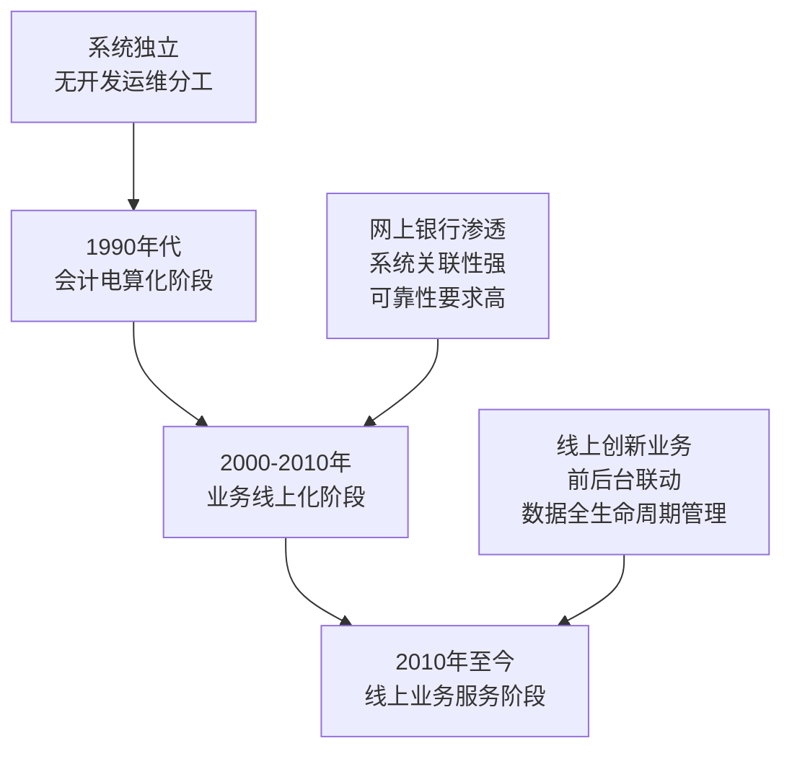
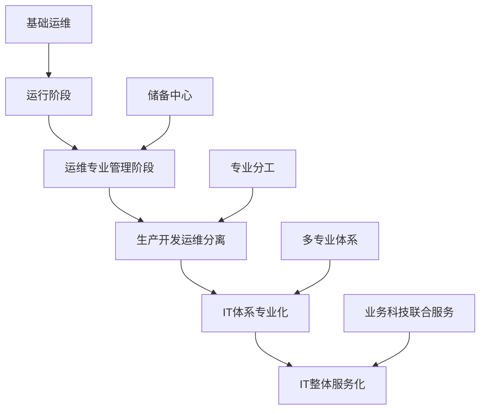
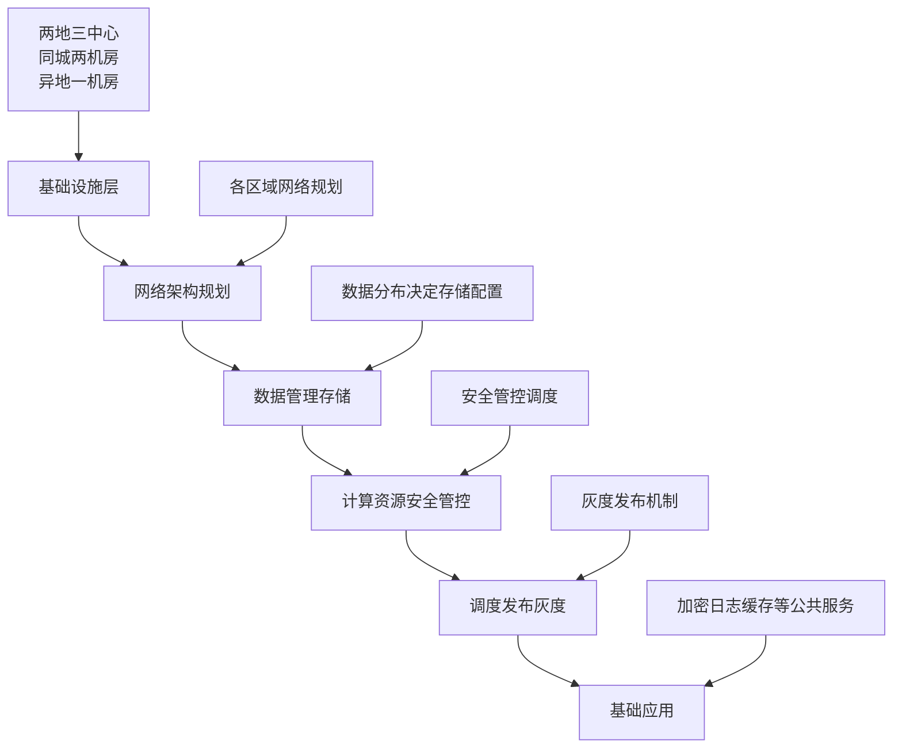
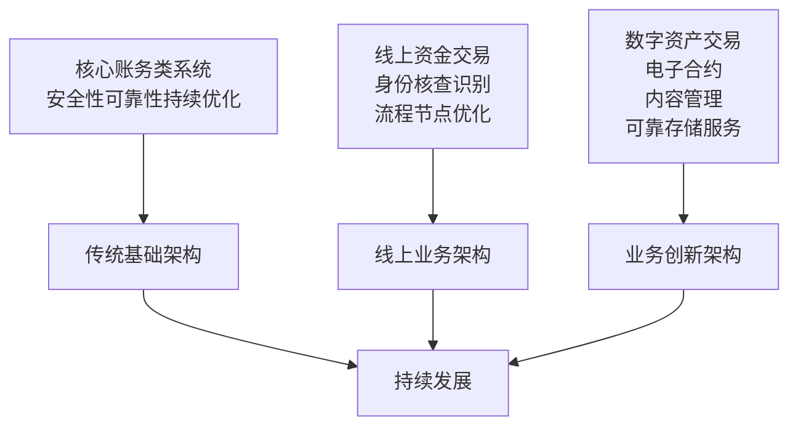
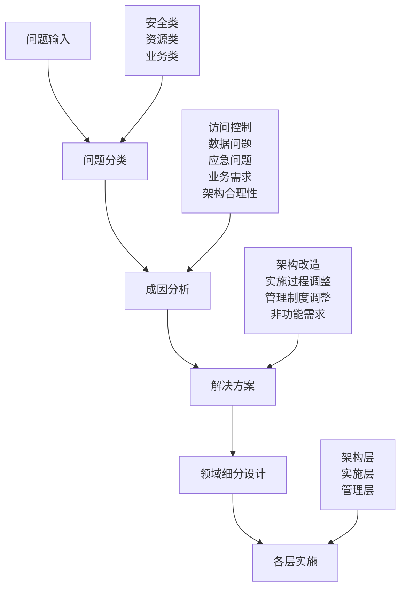
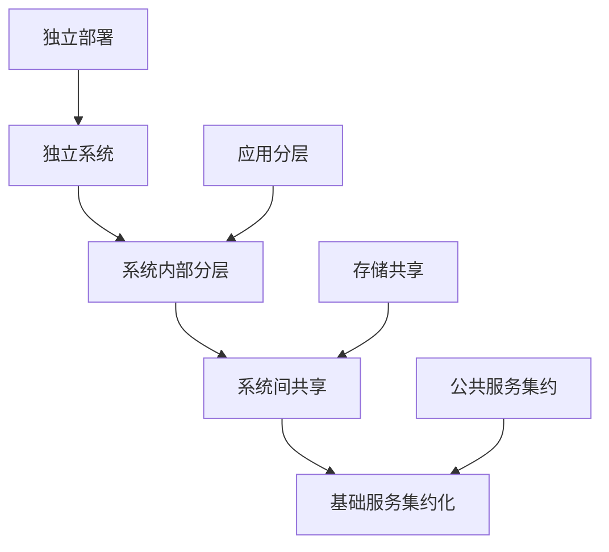

# 围绕银行核心系统架构转型谈新技术选型及管理方法升级

> 来源：未核验 · 类型：分享 · 状态：draft

## 一、银行业务发展历程与技术架构演化

### 1.1 银行业务发展三个阶段

#### 1.1.1 会计电算化阶段（1990年代）

- **特点**: 简单替代银行工作
- **问题**: 系统独立、无开发运维分工

#### 1.1.2 业务线上化阶段（2000-2010年）

- **特点**: 网上银行逐渐渗透
- **要求**: 系统关联性强、可靠性高、IT投入高

#### 1.1.3 线上业务服务阶段（2010年至今）

- **特点**: 线上创新业务、前后台联动
- **挑战**: 可靠性、可用性、数据全生命周期管理

### 1.2 基础模式发展

#### 1.2.1 核心账务类系统

**设计原则**: 简单、可靠、可控、可预期

- 故障恢复时间：10-15分钟内
- 持续优化：账务安全、系统可靠性

#### 1.2.2 线上模式成熟

**特点**: 交易震荡性、业务可靠性、容错容灾机制

- 秒杀等瞬时高峰交易
- 不可控交易场景

#### 1.2.3 业务创新支持

**技术驱动**: 技术手段进步带来新业务模式

- 非结构化数据（影像文件、大数据）
- 三方存证等创新业务

### 1.3 IT体系发展历程

## 二、银行系统架构差异化设计

### 2.1 系统架构分类

#### 2.1.1 服务接入渠道类

**设计原则**:

- **多活**: 必须多活部署
- **可弹性**: 支持弹性扩展
- **灰度发布**: 支持灰度发布

**收益**: 确实比较明显

#### 2.1.2 业务逻辑平台类

**设计原则**:

- **隔离**: 业务逻辑隔离
- **流控**: 流量控制机制
- **松耦合**: 松耦合架构

**应用场景**: 网银线上服务平台、专业服务平台

#### 2.1.3 核心账务类

**设计原则**: 标准、简单、自动化

- 避免数据库集群等复杂技术
- 采用HA方式，切换时间可预期
- 考虑技术人员数量和质量

#### 2.1.4 数据仓库分析类

**设计原则**:

- **计算并发性**: 强并发计算能力
- **调度能力**: 强调度能力
- **数据归档**: 清晰的数据归档策略

**存储策略**: 在线、近线、离线分层管理

### 2.2 新核心系统架构设计

**基础应用标准化**:

- 加密服务
- 日志采集
- 缓存服务
- 提高开发效率
- 提升可靠性、可控性、降低成本

### 2.3 技术架构持续发展

**发展特点**:

- 三类架构不是对立关系
- 各自有发展重点
- 互相穿插、互相辅助

## 三、业务创新发展思考

### 3.1 数字资产发展

#### 3.1.1 实物资产数字化

**应用场景**:

- 线上公证
- 房产证数字化
- 数字资产交易结算
- 数字资产托管

**技术需求**:

- 物联网
- 边缘计算
- 内容管理
- 区块链

#### 3.1.2 非结构化数据管理

**核心问题**:

- 结构化数据与非结构化数据的映射关系
- 一笔交易对应多个非结构化数据
- OCR识别结果管理

**解决方案**:

- 内容管理为主
- 非结构化数据存储
- 与结构化数据关联

### 3.2 架构管理闭环

**闭环过程**:

1. **问题收集**: 业务人员、客户问题
2. **问题分析**: 分布领域、成因分析
3. **解决方案**: 架构调整、质量控制
4. **运营保障**: 推送到前台服务
5. **服务目录**: 形成服务目录
6. **迭代优化**: 发现问题再优化

## 四、新核心系统建设关键问题

### 4.1 架构工作目标

#### 4.1.1 可靠性基础建设

- 利用新核心系统建设机会
- 实现整体可靠性提升
- 可靠性是可用性的必要基础

#### 4.1.2 问题导向改进

**主要问题识别**:

1. **应用层HA集群问题**: 去除应用层HA集群，系统扁平化
2. **建设维护成本过高**: 控制投入产出比
3. **容错容灾并重**: 容错机制与容灾建设并重
4. **监与控并行**: 既要监控又要控制
5. **数据全生命周期管理**: 根据业务数据设计存储架构

### 4.2 技术方案选择

#### 4.2.1 核心系统数据库选择

**选择原则**: 可靠性、可用性、适用性综合考虑

- **HA模式**: 未采用集群模式
- **原因**: 单机性能足够，切换时间可预期

#### 4.2.2 UUID设计

**设计原则**: 前端渠道设置唯一交易标识

- 后端整个链路过程中不做修改
- 保证故障时容易排错
- 知道交易在哪发生故障

**实施效果**: 新核心系统投产后的震荡期，UUID起到关键作用

### 4.3 技术设计管理基础

## 五、基础设施层面改造

### 5.1 系统资源架构变迁

**集约化优势**:

- 资源利用效率高
- 增强系统可靠性
- 提升应用开发效率
- 容错能力多通路

**集约化风险**:

- 更依赖故障发现定位处理能力
- 瘫痪可能影响一大片

### 5.2 网络多平面改造

#### 5.2.1 多平面设计

**网络层面分离**:

- **交易网络**: 交易专用网络
- **NAS网络**: 网络附加存储专用
- **虚拟化管理网络**: 虚拟化和代位管理
- **备份网络**: 备份专用网络

#### 5.2.2 服务器分类配置

**服务器类型**:

- **DB服务器**: 数据库专用配置
- **应用服务器**: 应用服务配置
- **Web服务器**: Web服务配置

**配置原则**: 根据服务器类型配置不同网卡数量和配置

#### 5.2.3 改造效果

- 流量间不互相影响
- 网络访问控制更灵活
- 分区改造更灵活
- 解决批量传输影响交易问题

### 5.3 容错容灾和应急机制

#### 5.3.1 多道防线设计

**设计原则**: 运维最关键的是有多条退路

- 第一道防线：正常运行
- 第二道防线：HA切换
- 第三道防线：容灾切换
- 第四道防线：克隆库切换

#### 5.3.2 容灾建设要点

**资源配置**: 精准合理，不过度浪费
**应用系统改造**: 支持多活和切换
**风险识别**: 想全、想深、想透
**场景设计**: 按场景设计演练
**实操演练**: 真实业务数据演练

#### 5.3.3 标准化工具

**标准化要求**:

- 先标准化再自动化
- 检查、巡检、启停、切换脚本标准化
- 形成一致的目录文档和脚本
- 变更配套跟上
- 监控配套

## 六、业务数据管理与系统架构设计

### 6.1 数据全生命周期管理

#### 6.1.1 数据管理流程

**数据规划要素**:

- 产生原因（账务、监管、客户分析）
- 规范要求（会计准则、审计要求）
- 应用系统归属

#### 6.1.2 系统架构设计

**客户交互层**:

- 临时日志数据
- 横向无关、短时间存在
- 定时清理机制

**前端流水存储**:

- 流水数据存储策略
- 在线交易数据管理

**在线交易部分**:

- **结构化数据**: 客户号、卡号、贷款金额
- **非结构化数据**: 身份证、房产证扫描件
- **映射关系**: 结构化与非结构化数据关联

### 6.2 存储架构设计

#### 6.2.1 存储分层策略

**在线存储**:

- 写优先性能
- 高端存储
- 保留时间：30天-3个月

**近线存储**:

- 读优先性能
- 分布式存储、对象存储
- 低成本、大容量

**离线存储**:

- 备份存储
- 数据仓库分析

#### 6.2.2 数据管理协议

**协议内容**:

- 数据临时性/永久性
- 永久数据保存期限
- 存储位置选择
- 清理策略

**技术实现**:

- 分区表设计
- 历史数据清理
- 数据结构文档化

### 6.3 非结构化数据管理

#### 6.3.1 问题识别

**原有问题**:

- 上传速度慢
- 上传失败全部失败
- 文件丢失
- 无MD5校验

#### 6.3.2 解决方案

**技术架构**:

- 同城双中心同步
- 在线近线存储转移
- 互联网接入优化
- 标准/非标准API

**元数据管理**:

- 索引记录
- 影像文件与交易映射
- 存储路径变更透明化

## 七、应用系统整体质量控制

### 7.1 质量控制工作目标

#### 7.1.1 设计可靠性

- 设计上保证可靠性
- 形成工艺管理思维
- 将IT技术产品用好用透

#### 7.1.2 可用性管理

- 可用性更多是管理能力
- 操控能力建设
- 技术人员工作基本原则

**核心原则**: 技术人员不能为了用技术而用技术

### 7.2 质量控制方法

#### 7.2.1 源头控制

**应用系统设计源头**:

- 与研发配合
- 整体质量控制
- 投产和运维细分

#### 7.2.2 持续改造

**改造原则**:

- 化繁为简
- 小过程拆分
- 简单化控制
- 持续改进

### 7.3 投产技术规范

#### 7.3.1 规范制定原则

**经验借鉴**:

- 借鉴他人经验
- 总结自身教训
- 保证新技术应用
- 运维保障基础建设

#### 7.3.2 规范分类

**阶段规范**:

- 需求阶段规范
- 开发设计阶段规范
- 测试验证阶段规范
- 投产评审规范

**技术领域**:

- 安全类规范
- 监控类规范
- 接口类规范
- 批量类规范

#### 7.3.3 规范实施

**实施流程**:

- 项目管理平台集成
- 各阶段提醒
- 评审过程控制
- 变更发布过程

### 7.4 应用系统拆分

#### 7.4.1 拆分要素

**系统架构**:

- 物理架构
- 逻辑架构
- 数据结构

**模块配置**:

- 系统模块
- 系统配置
- 数据管理协议

**交易协议**:

- 主要交易协议
- 网络报文分析
- APM工具实施

**监控操作**:

- 访问关系
- 监控配置
- 操作流程

#### 7.4.2 拆分结果

**落地实施**:

- 监控配置
- 操作规范
- CMDB配置
- 服务目录

## 八、监与控的定位和实时分享

### 8.1 监与控基础

#### 8.1.1 监控对象拆分

**拆分原则**:

- 清楚监控对象构成
- 细分配件信息
- 指标衡量可用性
- 工具实施监控

#### 8.1.2 指标设计

**指标分类**:

- 可用性指标
- 性能指标
- 健康状态指标

**工具选择**:

- 开源工具（Zabbix、Prometheus）
- 商业工具
- 自研工具

### 8.2 交易链路监控

#### 8.2.1 链路梳理

**链路特点**:

- 银行业务多系统串联
- UUID贯穿整条链路
- 系统入口端设置UUID
- 后续系统不修改UUID

#### 8.2.2 监控重点

**重点内容**:

- 交易链路梳理
- 交易通道监控
- 系统间依赖关系
- 故障定位能力

### 8.3 监控管理流程

#### 8.3.1 监控管理员职责

**职责内容**:

- 分析监控对象基本信息
- 确定监控指标配置
- 标准监控方法制定
- 工单管理

#### 8.3.2 应用系统管理员职责

**职责内容**:

- 维护CMDB内容
- 提供监控对象信息
- 配合监控配置
- 标准指标补充

#### 8.3.3 监控开发人员职责

**职责内容**:

- 标准监控部署
- 策略开发
- 非标监控实施
- 工具配置

### 8.4 监与控整体管理

#### 8.4.1 管理原则

**分类管理**:

- 按渠道分类
- 按场景分类
- 统一处理流程

**处理流程**:

- 发现
- 定位
- 处置
- 验证

#### 8.4.2 信号灯机制

**机制设计**:

- 多路多活系统
- 信号灯设置
- 负载均衡探测
- 故障规避

**实施效果**:

- 故障规避
- 日常投产灵活
- 快速恢复服务

## 九、面向业务的科技运营服务体系

### 9.1 科技运营服务目录

#### 9.1.1 服务目录建设

**建设目标**:

- 按渠道业务场景组装
- 便于前后台沟通
- 统一对话标准
- 接口标准化

#### 9.1.2 服务目录内容

**内容构成**:

- 业务渠道
- 业务场景
- 系统功能
- 服务状态

### 9.2 后端运维质量控制

#### 9.2.1 质量控制要素

**监控效能评估**:

- 发现能力提升
- 定位能力提升
- 覆盖度提升
- 准确性提升

#### 9.2.2 精确匹配

**匹配要求**:

- 前后台精确转换
- 信息传递准确
- 问题定位准确
- 处理效率提升

### 9.3 前台科技运营服务

#### 9.3.1 动态服务目录

**目录特点**:

- 与变更挂钩
- 实时更新
- 服务状态跟踪
- 知识库配套

#### 9.3.2 知识库建设

**知识库内容**:

- 业务操作指南
- 故障处理流程
- 常见问题解答
- 业务功能说明

#### 9.3.3 服务质量跟踪

**跟踪机制**:

- 沟通机制建立
- 问题跟踪
- 服务质量评估
- 持续改进

### 9.4 科技运营数据分析

#### 9.4.1 数据采集

**采集内容**:

- 运维数据
- 运营数据
- 业务数据
- 性能数据

#### 9.4.2 数据分析

**分析维度**:

- 问题分类分析
- 趋势分析
- 根因分析
- 改进建议

#### 9.4.3 数据应用

**应用场景**:

- 业务分析支撑
- 资源调配依据
- 性能优化指导
- 决策支持

## 十、实践案例分享

### 10.1 网点排队优化案例

#### 10.1.1 问题识别

**问题现象**:

- 柜面交易拥堵
- 客户排队集中
- 网点苦乐不均
- 缺乏数据支撑

#### 10.1.2 数据分析

**数据来源**:

- 排队机数据
- 柜面系统交易数据
- 客户等待时间
- 柜员业务量

#### 10.1.3 解决方案

**优化措施**:

- 网点人员调配
- 操作界面简化
- 系统性能优化
- 业务流程优化

### 10.2 双十一秒杀分析案例

#### 10.2.1 性能提升

**提升措施**:

- 承载能力提升
- 性能持续优化
- 系统架构改进

#### 10.2.2 数据分析

**分析维度**:

- 渠道分析
- 交易类型分析
- 客户类型分析
- 营销分析支撑

### 10.3 科技服务台建设案例

#### 10.3.1 线上服务台

**功能特点**:

- 微信渠道服务
- 小视频录制
- 操作过程记录
- 问题快速解决

#### 10.3.2 服务效果

**效果体现**:

- 问题解决效率提升
- 前后台沟通改善
- 服务质量提升
- 客户满意度提升

## 十一、技术选型经验总结

### 11.1 数据库选型

#### 11.1.1 核心系统数据库

**选择原则**:

- 可靠性优先
- 简单可控
- 切换时间可预期
- 技术人员熟悉度

**最终选择**: DB2（技术人员熟悉）

#### 11.1.2 存储选型

**在线存储**: EMC高端存储
**近线存储**: 分布式存储、对象存储
**离线存储**: 磁带、光盘

### 11.2 开源技术使用

#### 11.2.1 使用原则

**监管要求**:

- 交易业务系统严格控制
- 安全风险管理
- 漏洞管理

**选择策略**:

- 商品化小众化产品
- 避免大众化开源产品
- 安全优先考虑

### 11.3 容灾建设

#### 11.3.1 容灾策略

**同城容灾**:

- 双活应用
- 单机HA数据库
- 存储同步

**异地容灾**:

- 数据集级别
- 满足监管最低要求
- 后续应用级改造

#### 11.3.2 容灾效果

**切换时间**: 主中心30毫秒延迟
**业务影响**: 客户无感知
**负载均衡**: 1:3配比

## 十二、监控告警优化

### 12.1 告警收敛策略

#### 12.1.1 监控对象分级

**分级原则**:

- L0: 客户直接使用系统
- L1-Ln: 后端系统逐级递增
- 深度优先判断

#### 12.1.2 二维象限图

**Y轴**: 基础设施优先于应用
**X轴**: 核心系统优先于外围系统
**优先级**: 左下角最高优先级

#### 12.1.3 告警处理

**处理原则**:

- 下面优先于上面
- 左面优先于右面
- 根源优先处理

### 12.2 监控效果提升

#### 12.2.1 发现率提升

**提升过程**:

- 初期发现率不到30%
- 查缺补漏持续优化
- 最终达到98-99%

#### 12.2.2 持续优化

**优化方法**:

- 每周每月补漏
- 策略不断完善
- 工具持续改进

## 十三、故障自愈与规避

### 13.1 故障规避机制

#### 13.1.1 信号灯机制

**机制设计**:

- 多路系统信号灯
- Socket级别探测端口
- 负载均衡探测
- 自动流量切换

#### 13.1.2 多道防线

**防线设计**:

- 主机故障HA切换
- 存储故障容灾切换
- 数据库故障克隆库切换
- 多条退路保障

### 13.2 故障处理流程

#### 13.2.1 处理原则

**处理策略**:

- 故障规避优先
- 快速恢复服务
- 后续问题处理
- 根本原因分析

#### 13.2.2 恢复机制

**恢复方式**:

- 自动切换
- 手动切换
- 应急处理
- 业务恢复

## 十四、未来发展方向

### 14.1 实时数据仓库

#### 14.1.1 建设考虑

**技术架构**:

- 实时数据采集
- 快速加工处理
- 分析参考数据

**应用场景**:

- 实时分析
- 决策支持
- 业务监控

#### 14.1.2 数据区分

**数据用途**:

- 分析参考数据
- 非账务要求
- 准确性要求区分

### 14.2 国产化数据库

#### 14.2.1 推进策略

**分步实施**:

- 非关键系统先行
- 非核心系统试点
- 逐步推广

**技术考虑**:

- 数据库国产化
- 小机暂时保留
- 集群暂不考虑

### 14.3 技术创新

#### 14.3.1 技术趋势

**发展方向**:

- 云原生架构
- 微服务化
- 容器化部署
- 智能化运维

#### 14.3.2 业务创新

**创新领域**:

- 数字资产交易
- 智能合约
- 区块链应用
- 人工智能

## 十五、总结与展望

### 15.1 核心经验总结

#### 15.1.1 架构设计原则

- **简单可靠**: 核心系统简单可靠优先
- **分层设计**: 不同系统类型差异化设计
- **容错容灾**: 容错机制与容灾建设并重
- **数据驱动**: 基于数据全生命周期管理

#### 15.1.2 管理方法升级

- **工艺思维**: 将复杂事物拆分为可控环节
- **问题导向**: 从问题中找成因，从成因中定方案
- **持续改进**: 建立闭环改进机制
- **标准化**: 先标准化再自动化

#### 15.1.3 技术选型经验

- **适用性优先**: 技术服务于业务
- **可靠性优先**: 核心系统可靠性优先
- **人员匹配**: 考虑技术人员能力
- **成本控制**: 平衡投入产出

### 15.2 实践价值

#### 15.2.1 业务价值

- **服务能力提升**: 科技运营服务体系建立
- **故障处理效率**: 秒级故障定位和处理
- **业务支撑能力**: 为业务创新提供技术支撑
- **客户体验改善**: 系统稳定性和可用性提升

#### 15.2.2 技术价值

- **架构优化**: 系统架构持续优化改进
- **技术能力**: 技术团队能力提升
- **工具建设**: 监控运维工具完善
- **标准化**: 技术规范和管理流程标准化

### 15.3 未来展望

#### 15.3.1 技术发展方向

- **云原生**: 向云原生架构演进
- **智能化**: 智能化运维和决策支持
- **实时化**: 实时数据处理和分析
- **国产化**: 关键技术国产化替代

#### 15.3.2 业务发展方向

- **数字化转型**: 全面数字化转型
- **创新业务**: 数字资产和智能合约
- **服务升级**: 科技运营服务能力提升
- **生态建设**: 开放银行生态建设

---

**注**: 本文档基于银行核心系统架构转型技术分享整理，旨在为SRE、运维及稳定性保障工程师提供银行系统架构转型实践指导。

