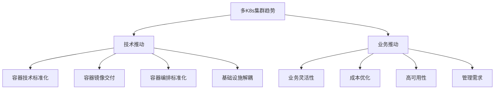
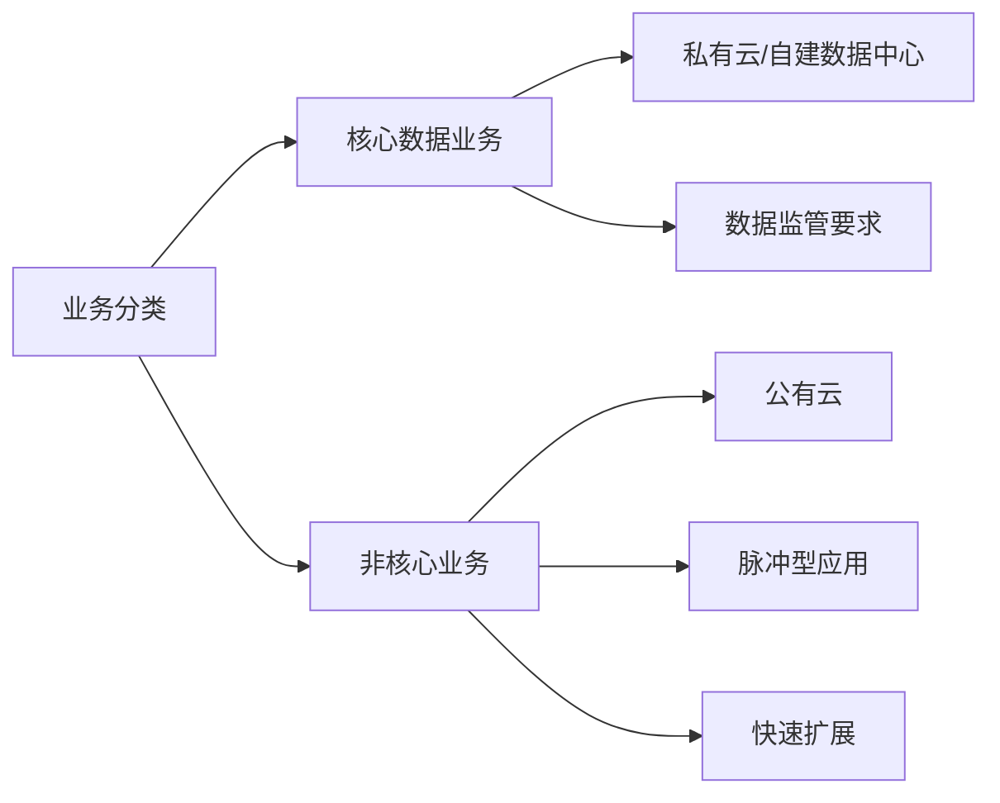
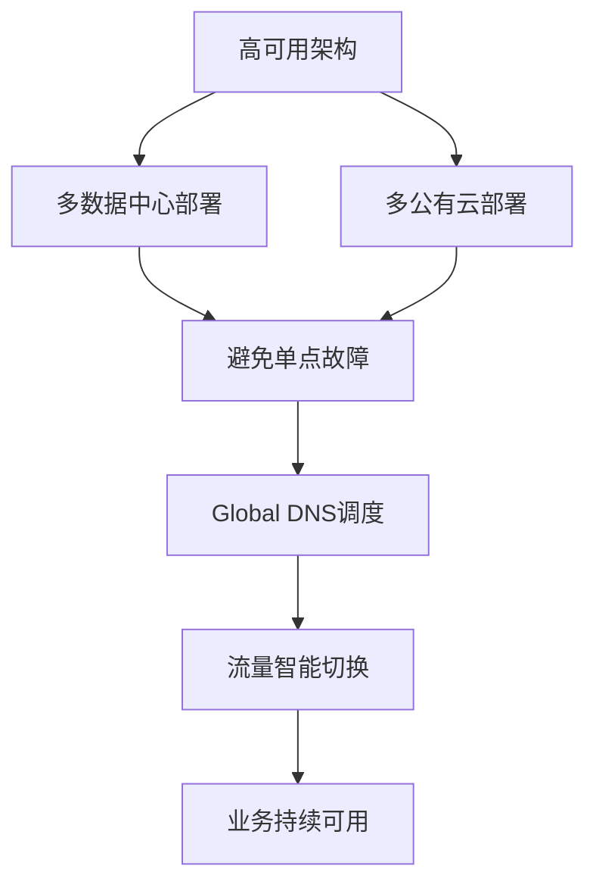
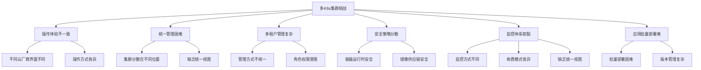
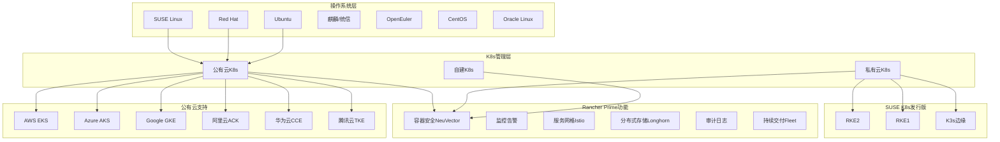
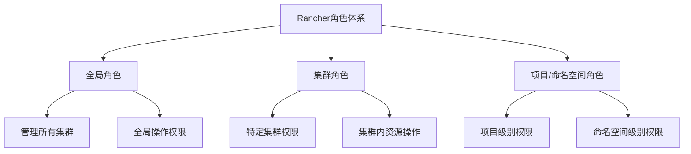
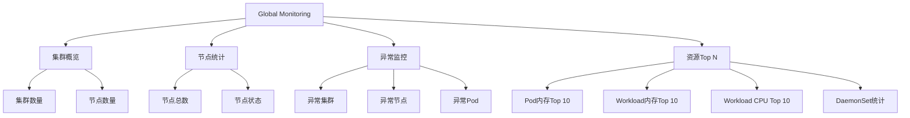
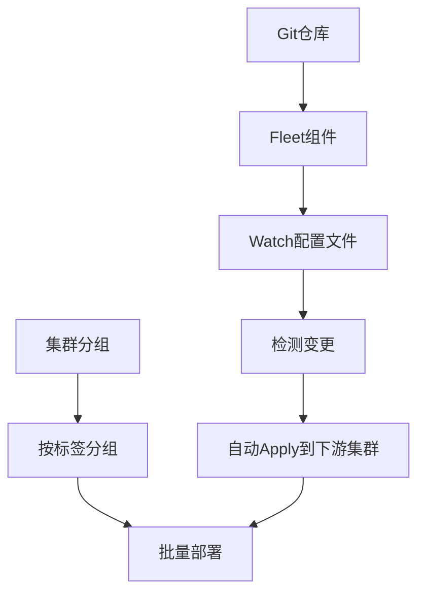

# 混合云下的Kubernetes运维挑战迎刃而解

> 来源：未核验 · 类型：分享 · 状态：draft

## 一、背景与趋势

### 1.1 会议背景

随着业务的多元化、全球化发展，单一云服务商已经难以满足企业经营管理需求。出于云成本和云安全等方面的考虑，越来越多的企业选择了混合云模式进行管理。

**核心问题**：

- 如何部署多个集群并统一管理？
- 如何通过一致的K8s运维提升开发应用效率？
- 如何摆脱多云运维桎梏，提升企业投资回报率？

### 1.2 云原生时代的标准

使用Kubernetes托管服务应对跨公有云和混合IT环境的诸多挑战，已经成为云原生时代事实上的标准。

## 二、混合云和多K8s集群成为必然趋势

### 2.1 驱动因素分析

### 2.2 技术推动

#### 2.2.1 容器技术的标准化

**核心标准化**：

- **容器镜像**：应用交付的最小单元
- **容器运行时**：运维管理的最小单元
- **镜像仓库**：应用分发的标准方式
- **容器编排**：基础设施标准化

**关键价值**：

> 容器引擎和容器编排（K8s）屏蔽了底层基础设施差异，为客户提供了更多选择性。

#### 2.2.2 基础设施灵活性

**多样化部署选择**：

- 自建数据中心：搭建容器编排集群
- 公有云：购买K8s托管服务
- 标准统一：遵循相同的K8s标准

### 2.3 业务推动

#### 2.3.1 业务灵活性

**核心优势**：

- 根据业务属性选择部署方式
- 根据数据监管要求选择部署区域
- 灵活的资源调配

**实践场景**：

**示例**：

- **核心数据**：部署在私有云或自建数据中心（满足监管要求）
- **非核心业务**：部署在公有云（利用弹性能力）
- **脉冲型应用**：借助公有云快速扩展

#### 2.3.2 成本优化

**优势分析**：

**1. 议价权**

- K8s对底层基础设施已做解耦
- 应用遵循K8s编排要求即可
- 可选择不同云服务商
- 主流公有云厂商都提供标准K8s服务（经过CNCF认证）

**2. 开发角度无差异**

- 标准K8s API
- 一致的使用体验
- 降低迁移成本

**3. 成本最优化**

- 性价比对比
- 灵活选择供应商
- 避免厂商锁定

#### 2.3.3 高可用性

**背景**：

- 近半年多次公有云机房宕机事件
- 促使更多用户选择混合云/多云架构

**高可用策略**：

**实现方式**：

- 业务部署在不同数据中心
- 业务部署在不同公有云K8s集群
- 结合Global DNS实现流量调度
- 某云服务商故障时自动切换

**价值**：

> 避免因单一云服务商系统性瘫痪导致业务中断，提高业务安全性。

#### 2.3.4 管理需求

**企业管理场景**：

**1. 功能区域划分**

- 开发环境
- 测试环境
- 生产环境
- 其他功能区域

**2. 金融类客户特点**

- 网络区域划分更细
- 每个区域独立K8s集群
- 严格的隔离要求

**3. 规模化管理需求**

- 集群数量较多
- 管理职能要求高
- 需要统一管理方案

### 2.4 趋势总结

**核心结论**：

> 只要技术路线向K8s迈进，只要有多套业务系统需要隔离，混合云和多K8s集群就是必然趋势。

**适用场景**：

- ✅ 一定规模的企业
- ✅ 多业务系统
- ✅ 需要环境隔离
- ✅ 业务持续迁移到K8s

**发展阶段**：

- 初期：可能只有单集群
- 成长期：业务系统不断迁移
- 成熟期：多集群成为必然

## 三、多K8s集群管理的挑战

### 3.1 挑战概览

### 3.2 操作体验不一致

#### 3.2.1 问题描述

**不同云厂商的K8s操作界面完全不同**：

| 云厂商 | 服务名称 | 特点         |
| ------ | -------- | ------------ |
| 阿里云 | ACK      | 独特操作界面 |
| 腾讯云 | TKE      | 独特操作界面 |
| Azure  | AKS      | 独特操作界面 |

**核心问题**：

- 每个厂商操作风格完全不同
- 需要熟悉多种操作界面
- 学习成本高

#### 3.2.2 公有云K8s服务的定位

**主要目标**：

- ✅ 保障K8s集群稳定性
- ✅ 用户无需自己管理集群
- ✅ 无需担心基础组件运维
- ❌ 不是提供良好操作体验

**实际使用方式**：

- 大部分用户通过 `kubectl`命令行操作
- 通过YAML文件管理资源
- 结合CI/CD工具链
- 很少直接使用公有云提供的操作界面

#### 3.2.3 规模化带来的问题

**小规模场景**：

- 集群数量少
- 影响相对较小

**大规模场景**：

- 上百套集群
- 不知道有多少节点
- 不知道运行多少服务
- 不知道有多少人在使用
- 管理成为巨大负担

**客户反馈**：

> "我现在大概有上百套集群，没有多集群管理产品时，我甚至不知道这些集群目前有多少个节点，上面跑了多少个服务。"

#### 3.2.4 自建集群的复杂性

**自建方式多样**：

- kubeadm部署
- 二进制部署
- 其他部署工具

**问题**：

- 操作方式更加不统一
- 管理复杂度更高

### 3.3 多租户和安全管理

#### 3.3.1 多租户管理问题

**挑战**：

- 每个厂商多租户管理方式不同
- 功能差异大
- 有些功能简单，有些复杂
- 有些功能非常单一

**角色绑定限制**：

- 可绑定的角色种类有限
- 管理颗粒度受限
- 难以满足细粒度权限需求

#### 3.3.2 复杂的管理场景

**企业需求**：

- 统一管理部门负责多个集群
- 需要给不同使用方分配角色
- 需要给不同部门分配权限
- 需要给不同人员分配权限

**问题**：

- 需要制定复杂的多租户管理策略
- 有些需求无法满足

### 3.4 监控体系割裂

#### 3.4.1 监控方式不统一

**问题**：

- 每个云厂商监控方式不同
- 监控颗粒度不同
- 收费模式不同
- 需要额外付费

#### 3.4.2 缺乏统一视图

**核心痛点**：

> 没有一个工具可以统一监控多个云上的K8s集群

**现状**：

- 各家只能顾及自己的监控体系
- 无法与其他云的K8s集群打通
- 管理者无法一目了然看到所有集群情况
- 缺乏统一监控视图

### 3.5 应用批量部署和更新

#### 3.5.1 批量部署需求

**场景**：

- 多个集群需要部署相同应用
- 不同集群组部署不同应用
- 例如：5个集群部署应用A，另5个集群部署应用B

**需求**：

- 批量部署能力
- 批量分发能力
- 集群分组管理

#### 3.5.2 版本化管理

**需求**：

- 基于GitOps进行版本化管理
- 基于DevOps进行版本化管理
- 基础设施即代码（IaC）

**挑战**：

- 集群数量多时管理复杂
- 需要考虑的重要因素

## 四、Rancher Prime解决方案

### 4.1 产品定位

**Rancher Prime**：

- SUSE在容器管理领域的产品
- 2.7版本之后的全新版本
- 专注多云K8s集群管理

### 4.2 整体架构

### 4.3 核心特性

#### 4.3.1 广泛的兼容性

**操作系统兼容**：

- SUSE Linux
- Red Hat
- Ubuntu
- 麒麟、统信（基于OpenEuler内核）
- OpenEuler
- CentOS
- Oracle Linux
- 更多...

**K8s发行版兼容**：

- 兼容所有经过CNCF认证的K8s发行版

**公有云支持**：

**国外公有云**：

- AWS EKS（包括中国区）
- Azure AKS（包括中国区）
- Google GKE
- 其他全球公有云

**国内公有云**：

- 阿里云ACK
- 华为云CCE
- 腾讯云TKE

**私有云支持**：

- RKE2
- RKE1
- K3s（边缘场景）

#### 4.3.2 解耦式功能设计

**设计理念**：

> 所有功能都是解耦式的，用户需要时可以安装，不需要时可以禁用。

**核心功能**：

- 容器安全：NeuVector（一键安装）
- 监控告警：一键部署
- 服务网格：Istio（一键部署）
- 分布式存储：Longhorn
- 审计日志
- 持续交付：Fleet

**优势**：

- 给客户更多选择权
- 不是全家桶式的重产品
- 提升产品稳定性
- 减轻用户负担

### 4.4 一致性运维体验

#### 4.4.1 统一操作界面

**核心价值**：

> 只要导入到Rancher Prime的K8s集群，所有操作风格都是一样的。

**支持的集群类型**：

- Azure AKS集群
- 腾讯云TKE集群
- 阿里云ACK集群
- Rancher自建K8s集群

**优势**：

- 操作风格完全一致
- 屏蔽多集群混合云操作体验不一致问题
- 降低K8s学习门槛

#### 4.4.2 降低使用门槛

**适用人群**：

- K8s初学者
- 业务部门人员
- 业务运维人员（非平台运维）

**使用场景**：

- 简单使用，不需要了解K8s细节
- 查看容器状态
- 查看监控数据
- 查看业务日志
- 操作K8s资源

**友好界面的价值**：

- 降低学习门槛
- 提升工作效率
- 适合非专业K8s用户

### 4.5 完善的多租户体系

#### 4.5.1 用户管理

**创建方式**：

- Rancher界面直接创建用户
- 基于RBAC实现

**灵活性**：

- 根据部门需求创建用户
- 根据人员需求创建用户

#### 4.5.2 角色体系

**三层角色架构**：

**角色分类**：

**1. 全局角色**

- 操作所有集群
- 查看所有集群
- 最高权限

**2. 集群角色**

- 只能操作特定集群
- 只能查看特定集群
- 集群级别权限

**3. 项目/命名空间角色**

- 只能操作特定项目
- 只能查看项目内资源
- 最细粒度权限

#### 4.5.3 权限分配示例

**场景1：管理员**

- 角色：全局管理员
- 权限：操作所有集群，查看所有集群

**场景2：部门用户**

- 角色：集群角色
- 权限：只能看到自己部门的集群

**场景3：项目成员**

- 角色：项目角色
- 权限：只能看到特定项目的资源

#### 4.5.4 内置和自定义角色

**内置角色**：

- Rancher Prime已内置常用角色
- 覆盖大部分使用场景

**自定义角色**：

- 根据需求创建自定义角色
- 指定资源操作权限（Create、Delete等）
- 指定API组
- 灵活配置

#### 4.5.5 统一认证集成

**支持的认证协议**：

- OpenLDAP
- Active Directory (AD)
- Azure AD
- Okta
- Ping Identity
- Keycloak
- 其他基于LDAP、OIDC、SAML协议的认证系统

**集成方式**：

- 与企业已有统一认证体系打通
- 使用已有用户
- 绑定Rancher角色
- 完成多租户体系

### 4.6 统一监控体系

#### 4.6.1 集群级监控

**部署方式**：

- 在Rancher集群工具（Cluster Tools）中
- 一键安装Monitoring组件
- 基于Prometheus

**适用场景**：

- 不使用云厂商监控功能
- 导入集群后直接安装
- 统一监控标准

#### 4.6.2 多集群监控（Global Monitoring）

**功能概览**：

**监控内容**：

- 集群数量统计
- 节点数量统计
- 异常集群识别
- 异常节点识别
- 异常Pod识别
- Pod内存使用Top 10
- Workload内存使用Top 10
- Workload CPU使用Top 10
- DaemonSet统计
- 节点资源展现

**数据来源**：

- 部分数据从Rancher直接抓取（不依赖Prometheus）
- 部分数据从集群Prometheus抓取汇总

**价值**：

> 非常方便地查看通过Rancher管理的所有集群概要信息，帮助掌握集群运营状况。

**应用场景**：

- 日常巡检
- 大屏展示
- 运营监控

### 4.7 应用批量部署（Fleet持续交付）

#### 4.7.1 核心功能

**Fleet持续交付**：

- 同一套应用快速部署到不同集群
- 不同应用部署到不同集群
- 基于Git的配置文件版本化管理
- 批量更新
- 回滚能力

#### 4.7.2 工作原理

**核心机制**：

1. Fleet watch Git仓库配置文件
2. 检测配置文件变更
3. 根据配置自动apply到下游K8s集群
4. 支持集群分组（通过标签）
5. 批量部署和更新

#### 4.7.3 回滚方式

**两种回滚方法**：

1. **Git版本控制回滚**

   - 通过Git commit历史回滚
   - 版本化管理
2. **Rancher UI回滚**

   - 通过界面部分回滚
   - 操作简便

#### 4.7.4 支持的配置格式

**兼容格式**：

- Helm Charts
- 标准YAML文件
- Kustomize
- 其他K8s manifest文件

**应用场景**：

- 应用批量部署
- 配置批量更新
- 甚至可以做K8s集群版本的批量更新

## 五、Demo演示要点

### 5.1 演示环境

**基础环境**：

- AWS上3台机器
- Rancher 2.7.3版本
- Docker方式运行Rancher Server

### 5.2 演示内容

#### 5.2.1 集群管理

**已导入集群**：

- 阿里云ACK集群
- Azure中国区AKS集群

**演示操作**：

1. 导入腾讯云TKE集群
2. 创建私有云RKE集群（自定义方式）

#### 5.2.2 云凭证管理

**配置内容**：

- 阿里云：Access Key和Secret Key
- 腾讯云：对应的Key
- Azure：对应的Key
- AWS：对应的Key

**其他支持**：

- 私有云vSphere
- Harvester
- 其他基础设施云厂商

#### 5.2.3 导入TKE集群流程

**步骤**：

1. 选择"导入已有集群"
2. 选择腾讯云TKE
3. 关联云凭证
4. 选择区域（示例：东京区）
5. 选择集群
6. 点击创建
7. 自动安装Rancher CRD和Cluster Agent
8. 自动配置命名空间

**自动化程度**：

- 全自动配置
- 无需人工干预

#### 5.2.4 创建RKE集群流程

**场景**：模拟私有云环境

**步骤**：

1. 选择"创建"
2. 选择RKE2
3. 选择"自定义"
4. 准备好机器和操作系统
5. 如果使用RKE2/K3s，不依赖Docker
6. 如果使用RKE1，需要预装Docker
7. 选择节点角色（Master、Worker）
8. 复制安装命令到对应机器
9. 自动拉取镜像和安装组件

**离线环境支持**：

- 导入镜像到私有镜像仓库
- 配置私有镜像仓库地址

#### 5.2.5 集群操作

**浏览集群**：

- 点击"浏览"进入集群内部
- 查看监控信息（需预装监控组件）
- 查看概述信息

**工作负载管理**：

- Deployment
- DaemonSet
- Pod
- 选择命名空间查看资源

**应用商店（App Market）**：

- 安装各种应用
- 类似应用市场

**服务发现**：

- Service
- HPA
- Ingress

**存储管理**：

- 创建Storage Class
- ConfigMap
- Secret
- PV/PVC

**策略管理**：

- 网络策略
- Pod中断预算

**集群工具（Cluster Tools）**：

- 部署监控组件
- 部署Istio
- 部署Logging组件
- 部署NeuVector（容器安全）
- GPU监控
- GPU Sharing
- Longhorn存储

#### 5.2.6 集群生命周期管理

**快照管理**：

- 创建ETCD快照
- 快照恢复
- 三个恢复选项

**应用场景**：

- K8s版本升级前创建快照
- 升级有问题时回滚
- 集群配置修改前备份

**导入集群的全生命周期管理**：

- 配置修改
- 节点池配置
- Worker节点配置

#### 5.2.7 审计日志

**多级别审计**：

- 集群管理级别：所有集群操作
- 单集群级别：特定集群操作

**记录内容**：

- 用户操作记录
- 资源操作记录
- 操作时间

#### 5.2.8 多租户演示

**用户创建**：

- ACK用户
- AKS用户
- TKE用户

**权限分配**：

- 将用户添加到集群
- 分配角色（集群所有者、项目成员等）

**权限验证**：

- ACK用户登录：只能看到ACK集群
- 只能操作ACK集群资源
- 可以进一步限制到项目级别

**角色管理**：

- 全局角色
- 集群角色
- 项目角色
- 自定义角色创建

**认证集成**：

- LDAP
- OpenLDAP
- Azure AD
- Free IPA
- OIDC协议
- SAML协议
- Keycloak等

#### 5.2.9 持续交付演示

**Git仓库准备**：

- GitHub上创建public repo
- 放置部署文件（Nginx示例）
- default.yaml：部署nginx:1.24镜像

**Fleet配置**：

1. 添加Git仓库
2. 输入仓库地址
3. 选择public（或配置认证）
4. 选择目标集群（可通过标签分组）
5. 创建

**自动部署**：

- Fleet watch Git仓库
- 自动apply配置到集群
- 所有集群部署成功

**查看部署**：

- 仪表板显示4个集群
- 所有集群Ready
- 显示Git commit ID

**批量更新演示**：

1. 修改Git配置文件
   - 镜像从1.24改为latest
   - Replicas从1改为2
2. 提交commit
3. Fleet自动触发更新
4. 所有下游集群自动更新

**验证更新**：

- 进入任意集群
- 查看Deployment
- 镜像已更新为latest
- Replicas已变为2

### 5.3 容器安全（NeuVector）

#### 5.3.1 部署

**部署方式**：

- 在集群工具中部署NeuVector
- 选择容器运行时（containerd/Docker）
- 快速部署

**多集群支持**：

- NeuVector支持联邦模式
- 一个集群作为主集群
- 其他集群作为联邦集群
- 统一策略制定

#### 5.3.2 功能

**安全能力**：

- 基于零信任技术
- 容器全生命周期安全
- 四层到七层安全
- 网络流向监控
- CVE漏洞扫描

**K8s集群扫描**：

- 基于CVE数据库扫描
- 识别高危漏洞
- 提供修复版本建议

**Pod级别安全**：

- 自动识别Pod
- 识别内部进程
- 文件读写响应规则
- DLP（数据泄露防护）
- WAF（Web应用防火墙）

## 六、核心优势总结

### 6.1 一致性运维体验

**价值**：

- 统一操作界面
- 统一操作风格
- 降低学习成本
- 提升工作效率

### 6.2 多集群统一管理

**能力**：

- 集中管理视图
- 统一监控
- 统一安全策略
- 统一应用部署

### 6.3 完善的多租户体系

**特点**：

- 三层角色体系
- 灵活权限分配
- 统一认证集成
- 细粒度权限控制

### 6.4 强大的扩展性

**兼容性**：

- 支持所有主流操作系统
- 支持所有CNCF认证的K8s
- 支持所有主流公有云
- 支持私有云和自建集群

### 6.5 解耦式架构

**优势**：

- 按需安装功能
- 不是全家桶
- 提升稳定性
- 降低复杂度

## 七、未来发展方向

### 7.1 与Harvester集成

**Harvester**：

- SUSE的超融合基础设施产品
- 一体化版本

**集成能力**：

- Rancher管理Harvester集群
- Rancher管理K8s集群
- 统一管理本地和公有云

### 7.2 UI扩展（UI Extension）

**Rancher 2.7.9新特性**：

- UI Extension能力
- 更好的解耦性
- 与其他开源组件集成
- 通过UI Extension完成

### 7.3 持续功能增强

**方向**：

- 更多安全功能
- 更强大的监控能力
- 更灵活的应用部署
- 更好的用户体验

## 八、Q&A精选

### Q1: Rancher 2.6有必要升级到2.7吗？

**答**：

- **建议升级**
- 2.6已进入EOM（End of Maintenance）阶段
- 不会再有新功能
- 可能有安全修复，但新功能都在2.7
- 2.7有UI扩展等新功能
- 2.7有更多API性能优化
- 2.7.5即将发布（明天）

**Kube-proxy IPVS开启ARP转发配置**：

- 与K8s相关，不是Rancher问题
- 涉及IPVS内核模块
- 两种ARP模式：直接路由模式、严格ARP模式
- 参考K8s官方文档
- 参数：`kube-proxy --ipvs-strict-arp`

### Q2: 多云要搞联邦集群吗？

**答**：

- 看实际应用场景
- 联邦集群概念很早就有（K8s 1.8）
- 从v1到v2版本，一直不温不火
- 适用场景：一个Deployment需要分散到多个集群部署
- 联邦集群需要Host K8s和Member K8s
- Host K8s运行联邦集群CRD
- 如果不够成熟，可能影响下游集群Workload部署
- **SUSE没有走联邦集群技术路线**

### Q3: 监控管理，多个集群告警规则可以一键下发吗？

**答**：

- **目前不支持**
- 每个集群单独部署一套Prometheus CRD
- 无法在Global监控层面统一下发告警规则到所有集群

### Q4: K8s网络存在安全隐患，多云环境如何保证数据安全？

**答**：

**零信任机制**：

- 基于零信任技术
- 防范未知攻击（零日攻击）
- 已知攻击用已知引擎防范

**安全隔离**：

- 不同业务间充分隔离
- 防护外部攻击
- WAF功能
- DLP功能

**容器安全边界**：

- 基于容器和K8s，安全边界越来越小
- Serverless时代，安全边界消失
- 需要专业容器安全方案

**NeuVector优势**：

- 基于零信任技术
- 天然适合K8s环境
- 容器全生命周期安全管控
- 支持多K8s集群
- 支持联邦模式
- 统一安全规则下发

### Q5: 混合云环境下，K8s多次拉取数据的专线成本增加，如何降低？

**答**：

- 需要了解具体环境情况
- 需要沟通详细场景
- 无法直接回答

### Q6: 多集群如何应对数据访问延迟？怎么保障数据同步？

**答**：

- 涉及业务容灾或双活问题
- 看容灾RPO和RTO要求
- 如果要求非常高，网络必须满足延迟标准
- 例如：延迟必须小于多少毫秒
- 如果每个集群跑单独业务，没有太大关系

### Q7: RKE每次升级，Kube-proxy和Ingress配置文件都会被初始化？

**答**：

- 这是售后问题
- Kube-proxy每次升级确实会被覆盖
- Ingress配置也会被覆盖
- **解决方法**：
  - 升级前复制ConfigMap配置
  - 升级后重新应用配置
- 建议考虑SUSE的Rancher官方订阅服务
- 支持工程师会帮助解决

### Q8: K8s多集群对内和对外的网络如何设置？

**答**：

- 如果是联邦集群，Federation有网络配置
- Rancher没有联邦集群概念
- 单个集群的对内对外，就是K8s服务暴露形式
- Service的几种类型：ClusterIP、NodePort、LoadBalancer

## 九、关键技术点

### 9.1 GitOps实践

**核心理念**：

- Git作为单一事实来源
- 声明式配置
- 自动化部署
- 版本化管理

**Fleet实现**：

- Watch Git仓库
- 自动检测变更
- 自动apply到集群
- 支持回滚

### 9.2 零信任安全

**核心概念**：

- 不信任任何内外部流量
- 持续验证
- 最小权限原则
- 微隔离

**NeuVector实现**：

- 容器级别隔离
- 网络流量监控
- 行为分析
- 自动化响应

### 9.3 多租户隔离

**隔离层级**：

1. **集群级别隔离**

   - 物理隔离
   - 最强隔离
2. **命名空间级别隔离**

   - 逻辑隔离
   - 资源配额
3. **RBAC权限隔离**

   - 细粒度权限控制
   - 角色绑定

## 十、最佳实践建议

### 10.1 集群规划

**建议**：

1. **按环境划分**

   - 开发、测试、生产独立集群
   - 避免环境混用
2. **按业务划分**

   - 核心业务独立集群
   - 非核心业务共享集群
3. **按地域划分**

   - 就近部署
   - 降低延迟

### 10.2 监控策略

**建议**：

1. **分层监控**

   - 集群级别监控
   - 应用级别监控
   - 业务级别监控
2. **告警分级**

   - P0：立即处理
   - P1：1小时内处理
   - P2：工作时间处理
3. **监控覆盖**

   - 基础设施监控
   - 应用性能监控
   - 业务指标监控

### 10.3 安全加固

**建议**：

1. **网络安全**

   - 网络策略
   - 服务网格
   - Ingress安全
2. **镜像安全**

   - 镜像扫描
   - 签名验证
   - 私有仓库
3. **运行时安全**

   - NeuVector部署
   - 行为监控
   - 自动响应

### 10.4 应用部署

**建议**：

1. **GitOps实践**

   - 配置版本化
   - 自动化部署
   - 声明式管理
2. **灰度发布**

   - 分批部署
   - 金丝雀发布
   - 蓝绿部署
3. **回滚策略**

   - 快速回滚能力
   - 版本管理
   - 备份恢复

## 十一、总结

### 11.1 核心价值

**Rancher Prime为混合云多K8s集群管理提供**：

1. **一致性体验**

   - 统一操作界面
   - 统一管理方式
   - 降低学习成本
2. **统一管理**

   - 多集群统一视图
   - 集中监控告警
   - 统一安全策略
3. **高效运维**

   - 批量部署应用
   - 自动化运维
   - GitOps实践
4. **安全可靠**

   - 零信任安全
   - 全生命周期安全
   - 多租户隔离

### 11.2 适用场景

**推荐使用Rancher Prime的场景**：

- ✅ 混合云/多云环境
- ✅ 多K8s集群管理
- ✅ 需要统一运维体验
- ✅ 需要多租户管理
- ✅ 需要统一安全策略
- ✅ 需要批量应用部署

### 11.3 关键收益

**企业收益**：

1. **降低成本**

   - 减少运维人力
   - 提升资源利用率
   - 避免厂商锁定
2. **提升效率**

   - 统一管理界面
   - 自动化运维
   - 快速部署应用
3. **增强安全**

   - 统一安全策略
   - 零信任架构
   - 全生命周期安全
4. **提高可靠性**

   - 多云高可用
   - 快速故障恢复
   - 统一监控告警

---

## 附录：关键术语

| 术语   | 全称                                 | 说明                |
| ------ | ------------------------------------ | ------------------- |
| K8s    | Kubernetes                           | 容器编排平台        |
| CNCF   | Cloud Native Computing Foundation    | 云原生计算基金会    |
| RBAC   | Role-Based Access Control            | 基于角色的访问控制  |
| ETCD   | -                                    | K8s的分布式键值存储 |
| CRD    | Custom Resource Definition           | 自定义资源定义      |
| GitOps | -                                    | 基于Git的运维实践   |
| IaC    | Infrastructure as Code               | 基础设施即代码      |
| CVE    | Common Vulnerabilities and Exposures | 通用漏洞披露        |
| WAF    | Web Application Firewall             | Web应用防火墙       |
| DLP    | Data Loss Prevention                 | 数据泄露防护        |
| RPO    | Recovery Point Objective             | 恢复点目标          |
| RTO    | Recovery Time Objective              | 恢复时间目标        |

