# 网易Kubernetes集群运维演进与思考

> 来源：未核验 · 类型：分享 · 状态：draft · 原始线索：分享人 刘伟


> 分享人: 刘伟 (网易杭州研究院)  
> 受众: SRE、运维及稳定性保障工程师

## 目录

- [一、概述](#一概述)
- [二、集群运维演进历程](#二集群运维演进历程)
  - [2.1 初期探索阶段](#21-初期探索阶段)
  - [2.2 自动化运维阶段](#22-自动化运维阶段)
  - [2.3 平台化运维阶段](#23-平台化运维阶段)
  - [2.4 智能化与综合化运维阶段](#24-智能化与综合化运维阶段)
- [三、平台化运维架构设计](#三平台化运维架构设计)
- [四、智能化运维实践](#四智能化运维实践)
- [五、综合化运维管理](#五综合化运维管理)
- [六、经验总结与思考](#六经验总结与思考)

---

## 一、概述

本次分享主要回顾网易杭州研究院在过去几年容器技术运维方向的工作,以及对未来演进方向的思考。整个演进历程参照生产力变革时代划分,经历了**初期探索**、**自动化运维**、**平台化运维**、**智能化与综合化运维**四个阶段。

---

## 二、集群运维演进历程

### 2.1 初期探索阶段

#### 背景与挑战

- **原有架构**: 内部基于 OpenStack 的虚拟化平台
- **痛点**: 逐渐不能满足业务方日益复杂的应用架构需求
- **探索方向**: 与各业务部门共同探索新的业务部署管理架构

#### 技术路线验证

在初期探索过程中,验证了多种容器集群技术路线:

- Docker Swarm
- Mesos
- LXC (Linux Container)
- 早期的 Kubernetes

#### 集群特点

- **分布状态**: 集群分散在各业务部门
- **部署方式**: 开发人员自行搭建部署
- **规模**: 集群数量少、规模小
- **技术路线**: 不统一,使用形态不明确

#### 运维方案

- **方式**: 手工运维
- **工具**: 简易的命令行工具
- **特点**: 零散的集群无法形成统一运维需求

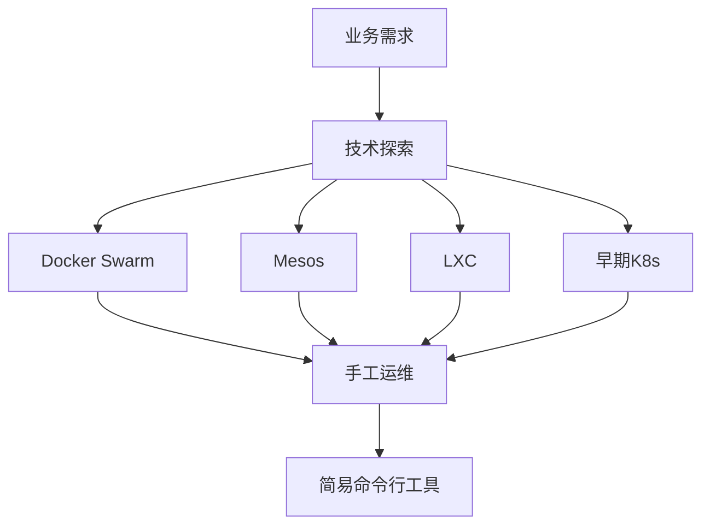

### 2.2 自动化运维阶段

#### 演进驱动因素

1. **技术标准化**: Kubernetes 逐步成为容器应用管理的事实标准
2. **平台统一**: 内部应用逐步统一到 Kubernetes 平台
3. **业务转变**: 从技术探索转向生产部署
4. **自研组件**: 使用内部维护的 K8s 版本及自研插件(CNI、CSI等)

#### 面临的挑战

- **规模增长**: 集群数量从个位数增长到几十上百个
- **配置复杂度**: 集群配置管理复杂度指数级提升
- **人员转变**: 运维工作由开发人员转向专业 SRE 人员
- **效率压力**: 运维人员数量与集群数量不成比例

#### 运维目标

- 实现基本运维操作的自动化
- 降低集群运维复杂度
- 提升运维效率

#### 技术方案

接入已有的自动化运维工具体系:

1. **配置管理工具**: 基于 Puppet 实现
2. **自动化工具链**: 针对集群运维开发的系列工具

#### 典型运维流程

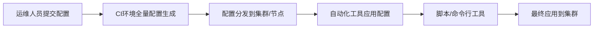

#### 存在的问题

##### 1. 低效的配置管理

- **中心化思路**: 基于 Puppet 的配置管理
- **全量触发**: 每次变更触发全量配置生成
- **效率低下**: 整个流程时间长

##### 2. 配置碎片化

**OpenStack 集群特点**:
- 集群规模大,节点数多(数千节点)
- 配置模板少(十几个模板覆盖整个集群)

**Kubernetes 集群特点**:
- 小集群、多集群(几十上百个集群)
- 单集群节点少(几十上百个节点)
- 配置复杂(根据调度规则划分十几个节点池)
- 运维人员个人风格差异大,配置管理混乱

##### 3. 半自动运维模型

- 配置管理与运维工具分离
- 依赖运维人员手动结合两部分
- 运维经验无法持续积累
- 人员变动导致经验流失

##### 4. 权限管理不受控

- 权限申请流程不规范
- 集群管理员无法追踪权限分配
- 运维操作缺乏审计和追踪
- 多人共用相同用户权限

##### 5. 缺乏统一视图

- 运维人员管理多个集群
- 各集群相互割裂
- 缺少完整的集群管理视图

##### 6. 集群复杂度提升

- 规模持续扩大(从几十到几百节点)
- 异构配置增多(网络方案、存储方案、节点类型)
- 运维工作挑战加大

### 2.3 平台化运维阶段

#### 运维需求

基于自动化阶段的问题分析,整理出新阶段的核心需求:

1. **异构集群统一管理**: 高效管理不同配置的集群
2. **全面自动化**: 降低对运维人力的需求
3. **运维规范化**: 降低对运维人员水平的依赖
4. **精细化管理**: 降低集群综合使用风险

#### 新一代容器集群运维平台

##### 核心特性

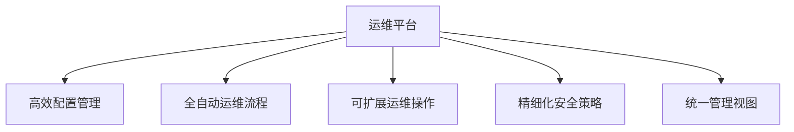

##### 1. 高效的配置管理模型

**配置模板化**:

将集群所有可配置组件抽象为配置模板:

- **控制面组件模板**
  - API Server
  - Controller Manager
  - Scheduler
  - etcd

- **集群插件模板**
  - CNI (容器网络接口)
  - CSI (容器存储接口)
  - 监控组件

- **节点插件模板**
  - Kubelet
  - Docker/containerd
  - 日志采集 (如 Filebeat)
  - 监控 Agent

**Class Version 机制**:

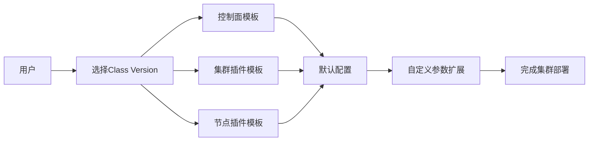

- 通过 Class Version 串联所有模板
- 支持默认配置一键部署
- 支持用户自定义参数扩展
- 配置参数在安全范围内可定制

##### 2. 全自动运维流程

**集群一键部署**:

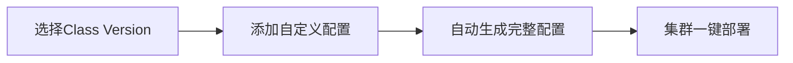

**节点弹性伸缩** (分钟级):

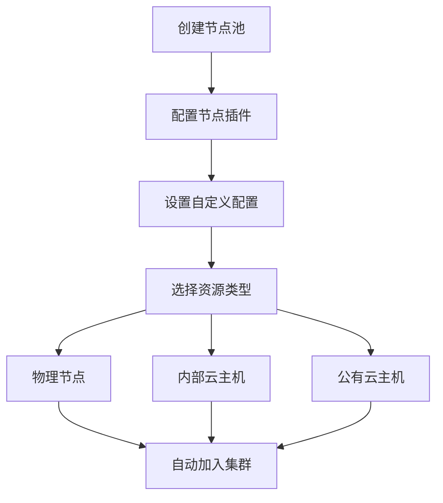

##### 3. 可扩展的模板化运维操作

**运维操作代码化**:

- 将日常运维操作逻辑代码化
- 封装在标准的 Docker Image 中
- 通过平台统一调度执行

**内置运维操作**:

- 控制面部署
- etcd 部署与管理
- 节点弹性伸缩
- 集群配置更新
- 控制面升级
- 节点升级
- 故障恢复
- 备份与恢复

**自定义运维操作**:

- 制定运维模板封装标准
- 用户可自行封装运维操作
- 打包为 Docker Image
- 通过平台应用到集群

**典型运维流程**:

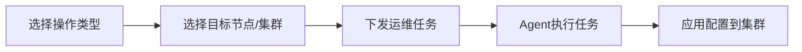

**批量运维能力**:

- 选择多个节点
- 执行多个任务
- 定制开始/结束时间
- 配置执行策略(并发度、失败策略等)

##### 4. 精细化安全策略

**认证体系**:

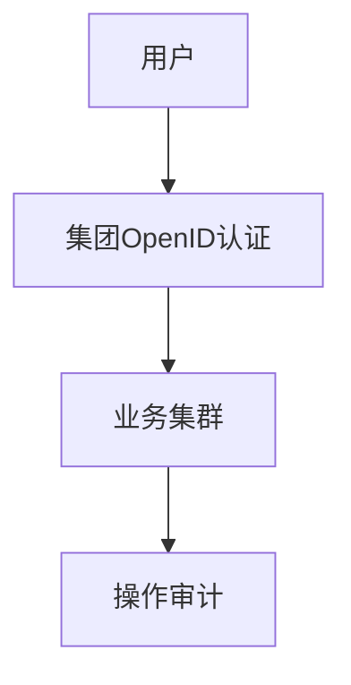

- 所有业务集群接入集团 OpenID 认证
- 基于 OpenID 进行操作审计
- 统一的身份管理

**授权体系**:

- 基于 Kubernetes 原生 RBAC
- 定义多个权限级别
- 运维人员通过平台签发权限证书
- 用户仅在规定权限内操作

**安全策略**:

- 部署 Pod Security Policy (PSP) 插件
- 内置默认安全策略
- 防止特权容器滥用
- 资源配额限制

##### 5. 统一集群管理视图

**统一运维入口**:

- 单一平台管理所有集群
- 统一运维逻辑
- 支持异构配置(网络、存储、节点类型)

**运维历史追踪**:

- 记录所有运维操作
- 操作人、操作时间、操作内容
- 配置变更历史
- 故障处理记录

**平台功能展示**:

- 集群列表与详情
- 集群特性配置
- 节点池管理
- 插件管理
- 运维历史
- 监控告警集成

#### 平台化运维成果

- ✅ 可编程的自动化集群运维
- ✅ 模板化的集群配置管理
- ✅ 精细化的安全策略
- ✅ 统一的集群管理视图
- ✅ 满足当前业务集群基本运维需求

### 2.4 智能化与综合化运维阶段

#### 新的挑战

尽管平台化运维已能满足基本需求,但面临新的挑战:

1. **稳定性需求**: 业务集群对稳定性要求不断提高
2. **精细化使用**: 集群资源需要更精细化管理
3. **成本压力**: 需要持续降低集群运营成本
4. **弹性资源**: 内外部弹性资源使用策略需优化

#### 演进方向

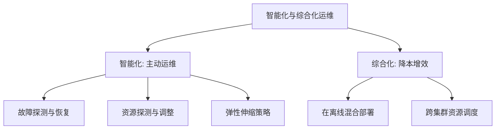

---

## 三、平台化运维架构设计

### 整体架构

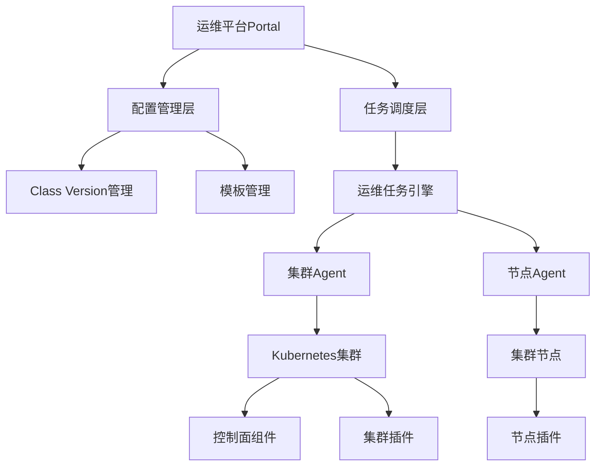

### 配置管理架构

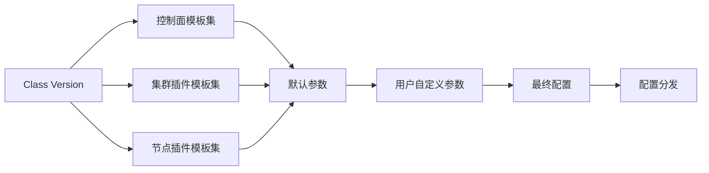

### 运维操作架构

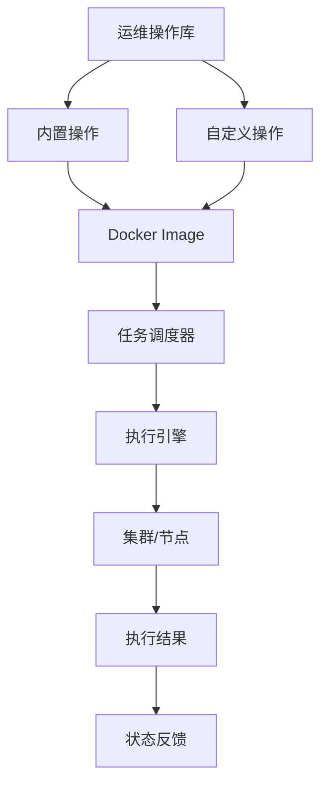

### 安全架构

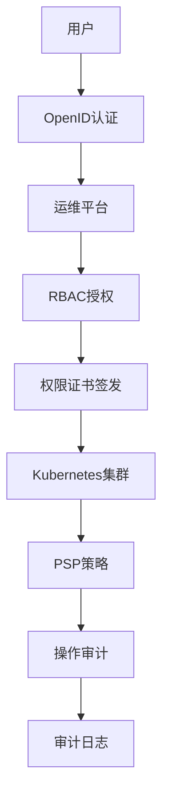

---

## 四、智能化运维实践

### 4.1 故障探测与自动恢复

#### 背景与痛点

- 业务集群存在大量重复出现的故障
- 处理重复故障消耗开发和运维人力
- 影响集群运行稳定性

#### 解决方案: Kube-Detector

**核心理念**:

- 自动化的知识图谱
- 运维经验模板化
- 故障处理流程化

**工作流程**:

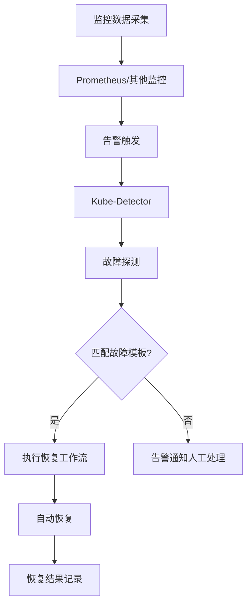

**功能特性**:

- 集成到运维平台,一键部署
- 内置常见故障模板
- 支持自定义故障模板
- 自动执行恢复流程
- 项目已开源

**故障模板示例**:

- 节点 NotReady 自动重启 Kubelet
- Pod CrashLoopBackOff 自动重启
- etcd 集群异常自动修复
- 磁盘空间不足自动清理
- 网络插件异常自动恢复

### 4.2 业务资源探测与自动调整

#### 背景与痛点

- 用户倾向申请超量资源
- 资源申请量与实际使用量差异大
- 造成大量资源浪费

#### 解决方案: 监控告警平台

**核心功能**:

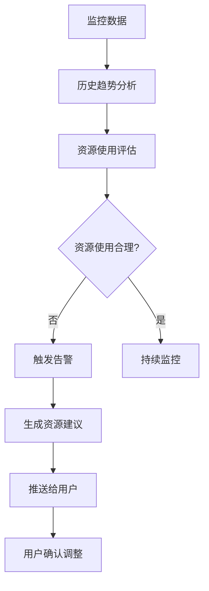

**功能特性**:

1. **监控与告警**
   - 实时监控资源使用情况
   - 基于历史数据趋势分析
   - 不合理使用触发告警

2. **资源建议**
   - 基于实际使用量给出建议
   - 支持用户自定义建议规则
   - CPU、内存、存储等多维度

3. **使用报告**
   - 按业务/应用维度统计
   - 资源申请量 vs 实际使用量
   - 定期生成使用报告
   - 帮助用户优化资源配置

**建议规则示例**:

- CPU 使用率长期低于 30%,建议降低 request
- 内存使用率长期高于 80%,建议提高 limit
- 存储使用量接近配额,建议扩容

### 4.3 弹性资源伸缩策略

#### 背景与痛点

- 弹性资源(内部/外部)使用成本高
- 资源弹出后使用复杂(联动、调度问题)
- 缺乏统一的弹性管理方案

#### 解决方案: 弹性资源自动化管理

**架构设计**:

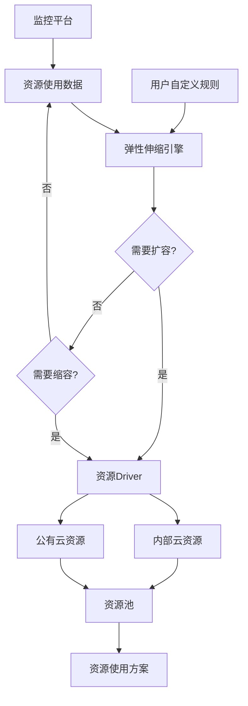

**弹性伸缩能力**:

1. **自定义伸缩规则**
   - 基于 CPU/内存/QPS 等指标
   - 支持定时伸缩
   - 支持预测性伸缩

2. **多资源池对接**
   - 内部云资源 (OpenStack等)
   - 公有云资源 (阿里云、AWS等)
   - 统一的 Driver 接口

**资源使用方案**:

##### 方案一: 混合云管理

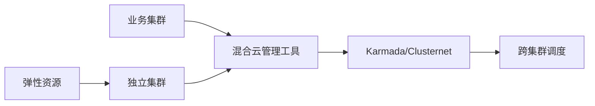

- 弹性资源作为独立集群
- 通过 Karmada、Clusternet 等工具管理
- 实现跨集群调度
- 用户视角: 多集群管理

##### 方案二: Virtual Kubelet (推荐)

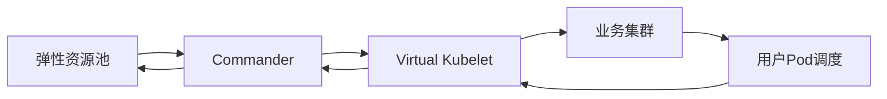

- 基于 Virtual Kubelet (VK) 技术
- Commander 实现一对多适配
- 用户视角: 单集群,调度到虚拟节点
- 网络自动打通,使用简单

---

## 五、综合化运维管理

### 5.1 资源分布问题

#### 时间分布不均衡

**问题描述**:

- 某些集群存在明显的业务高峰/低谷时段
- 整体资源利用率偏低
- 低谷期资源闲置浪费

**解决方案: 在离线混合部署**

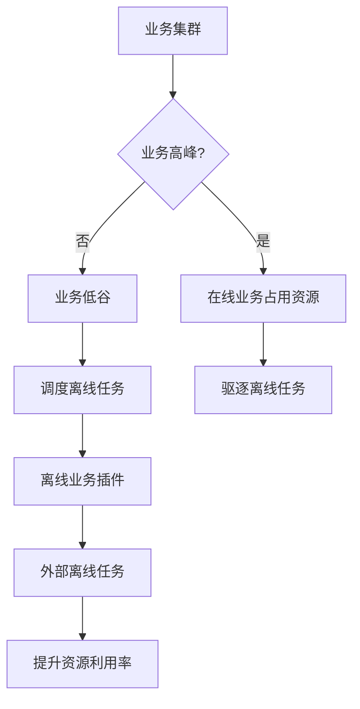

**功能特性**:

- 离线业务部署插件
- 业务低谷期自动调度离线任务
- 业务高峰期自动驱逐离线任务
- 提升整体资源利用率
- 已在内部大规模应用

**典型场景**:

- 电商业务: 夜间低谷运行数据分析任务
- 视频业务: 低峰期运行转码任务
- 游戏业务: 非活动期运行日志处理

#### 空间分布不均衡

**问题描述**:

- 部分集群资源严重缺乏 (AI、转码等)
- 部分集群资源利用率低 (电商平时)
- 资源无法有效共享

**解决方案: Commander 跨集群统一调度**

**架构设计**:

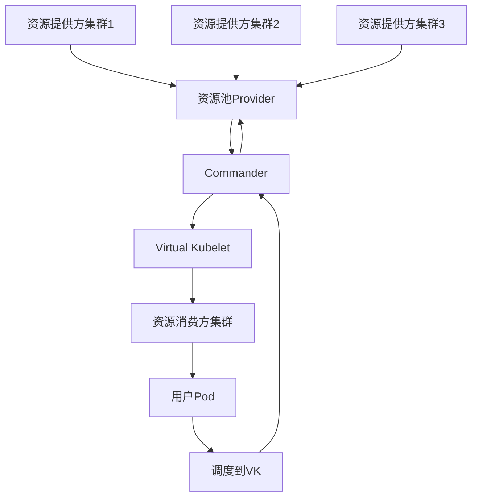

**核心能力**:

1. **资源池管理**
   - 多个资源提供方统一管理
   - 资源状态实时同步
   - 资源配额管理

2. **透明调度**
   - 用户无需关注资源来源
   - 通过 Virtual Kubelet 调度
   - 网络自动打通

3. **混合部署支持**
   - 在线业务: 通过弹性资源池
   - 离线业务: 通过混合部署隔离

**与 Virtual Kubelet 的关系**:

- VK 原生: 一对一对接资源提供方
- Commander: 一对多适配,统一管理多个资源池
- 用户体验: 单集群内调度,无需多集群管理

**使用流程**:

```mermaid
graph LR
    A[用户提交Pod] --> B[调度器]
    B --> C{资源充足?}
    C -->|是| D[本地节点]
    C -->|否| E[Virtual Kubelet]
    E --> F[Commander选择资源池]
    F --> G[远程集群运行]
    G --> H[网络打通]
    H --> I[服务正常访问]
```

### 5.2 综合化运维架构

```mermaid
graph TB
    A[业务集群] --> B[综合化运维平台]
    B --> C[时间维度优化]
    B --> D[空间维度优化]
    C --> E[在离线混合部署]
    D --> F[Commander跨集群调度]
    E --> G[提升资源利用率]
    F --> G
    G --> H[降低运营成本]
```

---

## 六、经验总结与思考

### 6.1 运维经验的积累与沉淀

#### 问题

- 运维经验随人员流动而丢失
- 口口相传效率低且不可靠
- 文档传承理解偏差大
- 个人经验难以标准化

#### 最佳实践

**代码化与流程化**:

```mermaid
graph LR
    A[运维经验] --> B[代码化]
    B --> C[封装为运维模板]
    C --> D[集成到平台]
    D --> E[标准化流程]
    E --> F[持续积累]
```

- ✅ 将运维经验转化为代码
- ✅ 封装为标准化的运维模板
- ✅ 通过平台固化运维流程
- ✅ 经验可持续积累,不随人员流动而丢失

**对应实践**:

- 运维操作 Docker Image 化
- 故障处理模板化 (Kube-Detector)
- 配置管理模板化 (Class Version)
- 运维流程平台化

### 6.2 人在运维中的影响

#### 问题

- 个人风格差异导致配置混乱
- 操作失误引发故障
- 可能触碰安全红线
- 人是不可靠的因素

#### 设计原则

**假定人是不可靠的前提**:

```mermaid
graph TD
    A[运维平台设计] --> B[最小权限原则]
    A --> C[安全策略控制]
    A --> D[有限扩展能力]
    B --> E[权限范围最小化]
    B --> F[权限有效期最小化]
    C --> G[操作审计]
    C --> H[权限管理]
    D --> I[框架内扩展]
    D --> J[禁止不受限扩展]
```

**具体措施**:

1. **最小权限原则**
   - 权限范围最小化: 仅授予必要权限
   - 权限有效期最小化: 临时权限自动过期
   - 基于角色的权限管理 (RBAC)

2. **完善的安全策略**
   - 统一身份认证 (OpenID)
   - 操作全程审计
   - 敏感操作二次确认
   - Pod 安全策略 (PSP)

3. **有限的扩展能力**
   - 在框架内扩展: 自定义运维模板
   - 禁止不受限扩展: 防止绕过安全策略
   - 扩展需经过审核

### 6.3 运维能力与业务需求

#### 发展阶段

```mermaid
graph LR
    A[业务初期] --> B[运维能力滞后]
    B --> C[被动响应需求]
    C --> D[业务成熟期]
    D --> E[业务方向不明确]
    E --> F[运维能力引领]
    F --> G[主动提供建议]
```

#### 策略转变

**初期: 被动响应**

- 业务需求明确
- 运维能力建设滞后
- 快速响应业务需求
- 逐步完善运维体系

**成熟期: 主动引领**

- 业务发展方向不明确
- 运维能力相对完善
- 主动提供最佳实践
- 引导业务高质量使用集群

#### 最佳实践

**为用户提供**:

1. **技术建议**
   - 集群规划建议
   - 资源配置建议
   - 架构优化建议

2. **最佳实践**
   - 高可用部署方案
   - 资源使用规范
   - 安全配置指南

3. **主动服务**
   - 资源使用分析报告
   - 成本优化建议
   - 稳定性改进方案

### 6.4 核心经验总结

| 维度 | 传统做法 | 最佳实践 |
|------|---------|---------|
| **经验传承** | 口口相传、文档 | 代码化、流程化、平台化 |
| **权限管理** | 信任人、高权限 | 最小权限、审计、临时授权 |
| **运维模式** | 被动响应 | 主动服务、智能化 |
| **配置管理** | 手工、碎片化 | 模板化、标准化 |
| **故障处理** | 人工介入 | 自动探测、自动恢复 |
| **资源管理** | 粗放式 | 精细化、智能调度 |

---

## 七、未来展望

### 7.1 技术发展趋势

```mermaid
graph TD
    A[Kubernetes运维] --> B[智能化]
    A --> C[综合化]
    A --> D[服务化]
    B --> E[AIOps]
    B --> F[自愈能力]
    C --> G[多云管理]
    C --> H[成本优化]
    D --> I[运维即服务]
    D --> J[平台化]
```

### 7.2 关键技术方向

1. **智能化运维 (AIOps)**
   - 基于机器学习的故障预测
   - 智能容量规划
   - 自适应弹性伸缩
   - 根因分析自动化

2. **综合化管理**
   - 多云统一管理
   - 成本精细化管理
   - 资源全局调度
   - FinOps 实践

3. **服务化能力**
   - 运维能力 API 化
   - 自助式运维服务
   - 运维市场 (运维模板商店)

4. **安全增强**
   - 零信任架构
   - 供应链安全
   - 合规性自动化

### 7.3 建议

**对于企业**:

- 尽早建设统一的运维平台
- 重视运维经验的沉淀
- 投入智能化运维研发
- 关注成本优化

**对于运维团队**:

- 提升自动化能力
- 学习云原生技术
- 培养平台化思维
- 关注开源社区

**对于个人**:

- 从手工运维转向平台开发
- 掌握 Kubernetes 深层原理
- 学习 Go/Python 编程
- 培养系统性思维

---

## 八、相关开源项目

### Kube-Detector

- **功能**: Kubernetes 集群故障自动探测与恢复
- **特点**: 知识图谱、模板化、自动化
- **状态**: 已开源

### Commander

- **功能**: 基于 Virtual Kubelet 的跨集群资源调度
- **特点**: 一对多适配、透明调度、网络自动打通
- **状态**: 内部使用,计划开源

### 运维平台

- **功能**: 统一的 Kubernetes 集群运维平台
- **特点**: 配置模板化、运维自动化、安全精细化
- **状态**: 内部使用

---

## 九、Q&A 精选

### Q1: Virtual Kubelet 的原理可以再介绍一下吗?

**A**: Virtual Kubelet (VK) 是基于 Kubernetes 社区的 VK 项目实现的。

**原理**:
- VK 本身是一个虚拟的 Kubelet,在 Kubernetes 集群中注册为一个节点
- 调度到这个虚拟节点的 Pod,实际会被转发到后端的资源提供方
- 原生 VK 是一对一的对接关系

**Commander 的增强**:
- 实现一对多的适配,统一管理多个资源提供方
- 用户无需关注具体的资源来源
- 通过 Virtual Kubelet 的 Taint/Toleration 机制实现调度
- 自动打通网络,用户体验与本地节点一致

### Q2: 容器云平台是单独建设,还是通过云管来统一资源调度?

**A**: 我们更倾向于使用 Virtual Kubelet (Commander) 方案。

**原因**:

**多集群方案 (Karmada/Clusternet)**:
- 用户需要在应用层做多集群调度
- 网络、存储配置复杂
- 用户改造成本高

**Virtual Kubelet 方案 (推荐)**:
- 用户视角: 所有资源在同一个集群内
- 调度方式: 只需调度到虚拟节点
- 网络打通: Commander 自动完成
- 用户改造: 几乎无需改造

### Q3: Kube-Detector 跟运维平台是如何结合的?

**A**: Kube-Detector 已经封装为集群插件 (Addon)。

**集成方式**:
- 封装为标准的 Helm Chart 或 Addon
- 包含 Kube-Detector 核心组件
- 集成 Prometheus 监控
- 内置常见故障模板

**使用方式**:
- 用户在运维平台选择 Kube-Detector 插件
- 平台自动部署到业务集群
- 可以在集群管理界面查看配置和告警信息
- 支持自定义故障模板

### Q4: 最终用户和集群管理员的权限是如何区分控制的?

**A**: 权限分为外部权限和内部权限两个层次。

**权限层次**:

1. **运维平台管理员**
   - 管理所有集群
   - 权限范围: 必要的运维操作
   - 控制方式: 平台 RBAC

2. **集群外部管理员**
   - 通过运维平台管理特定集群
   - 权限范围: 集群级运维操作
   - 控制方式: 平台 RBAC

3. **集群内部管理员**
   - 在集群内部管理资源
   - 权限范围: 命名空间/资源级
   - 控制方式: Kubernetes RBAC

**权限同步**:
- 支持平台权限同步到集群内部
- 同步临时权限 (如 1 小时有效期)
- 权限自动过期,降低风险

**权限签发**:
- 运维人员通过平台签发 kubeconfig
- 基于角色的权限模板
- 用户仅在规定权限内操作

---

## 十、总结

网易 Kubernetes 集群运维经历了从**手工运维**到**自动化**,再到**平台化**,最终走向**智能化与综合化**的演进历程。每个阶段都有明确的目标和挑战,通过技术创新和工程实践,逐步构建了完善的运维体系。

**核心要点**:

1. **经验沉淀**: 代码化、流程化、平台化
2. **安全第一**: 最小权限、审计、临时授权
3. **主动运维**: 从被动响应到主动服务
4. **智能化**: 故障自愈、资源优化、成本控制
5. **综合化**: 跨集群调度、混合部署、降本增效

**未来方向**:

- 持续提升智能化水平 (AIOps)
- 深化综合化管理能力
- 强化安全与合规
- 拥抱云原生生态

---

**分享结束,感谢大家!**

*如有问题,欢迎交流讨论。*
