# 趣丸多云基础设施建设

> 来源：未核验 · 类型：分享 · 状态：draft


> 分享嘉宾: 黄金 - 趣丸科技  
> 目标受众: SRE、运维及稳定性保障工程师

## 一、前言

### 1.1 多云的优势

在多云战略实施过程中,企业可以获得以下核心优势:

#### 1. 分散风险
- 有效避免单一云服务提供商停机或故障带来的业务风险
- 提升整体业务连续性保障能力

#### 2. 降低成本
- 根据业务需求灵活选择不同云厂商的产品
- 基于定价策略优化资源配置
- 在性能相同的情况下选择成本更低的方案
- 在成本相同的情况下选择性能更优的方案

#### 3. 区域覆盖
- 支持全球化业务和应用出海需求
- 不受单一厂商区域限制
- 灵活选择厂商和区域满足业务需要

#### 4. 取长补短
- 充分利用各云厂商的差异化产品
- 为应用研发和创新提供更多技术支持
- 助力应用快速发展

### 1.2 多云的挑战

#### 1. 资源管理挑战
- 不同云厂商的资源异构
- 不同的管理界面和账户体系
- API和资源生命周期管理方式各异
- 需要统一管理异构资源的生命周期

#### 2. 数据管理挑战
- 跨平台数据同步和传输
- 不同业务对数据延迟和一致性的要求不同
- 数据安全和合规性问题

#### 3. 运维挑战
- 多云环境下的复杂度显著提升
- 故障切换机制更加复杂
- 对运营团队提出更高要求

#### 4. 安全性挑战
- 数据和账户分布在不同云平台
- 访问控制更加复杂
- 需要统一的安全策略管理

### 1.3 多云使用现状

根据 Gartner 2020年发布的数据显示:
- **企业规模越大,多云使用占比越高**
- 新技术和新平台的出现极大降低了多云使用复杂度
  - Service Mesh 简化多云流量管理
  - Kubernetes 提供统一的容器编排
  - Terraform 等工具支持多云资源编排
- 多云使用呈现持续增长趋势

## 二、多云互联互通

### 2.1 基础网络建设

#### 2.1.1 常见网络拓扑及应用场景

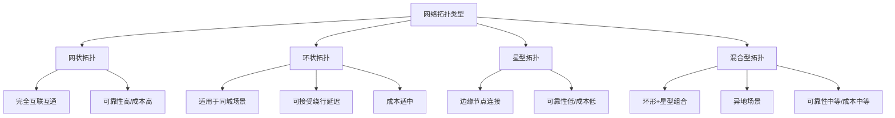

| 拓扑类型 | 应用场景 | 可靠性 | 成本 | 维护复杂度 |
|---------|---------|--------|------|-----------|
| 网状拓扑 | 完全互联互通,任一通道中断不影响访问 | 高 | 高 | 高 |
| 环状拓扑 | 同城场景,可接受绕行延迟 | 较高 | 中 | 中 |
| 星型拓扑 | 边缘节点场景,流动性要求不高 | 低 | 低 | 低 |
| 混合型拓扑 | 异地多集群场景 | 中 | 中 | 中 |

#### 2.1.2 趣丸网络拓扑架构

趣丸采用**混合型拓扑**架构:
- 国内主力北方集群采用**环状拓扑**
- 海外集群和其他地区采用**星型拓扑**连接
- 构建高可靠的混合型网络架构

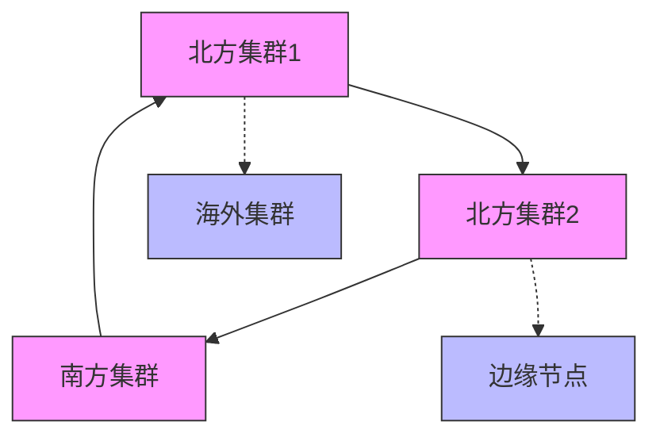

#### 2.1.3 网络连接方式对比

| 连接方式 | 优点 | 缺点 | 适用场景 |
|---------|------|------|---------|
| **公网** | 简单、成本低、按需使用 | 安全性差、不稳定、延迟高、路由变化大 | 数据量小、对安全和稳定性要求不高 |
| **VPN** | 安全性好 | 依然通过公网、不稳定、延迟高 | 数据量小、对安全有要求但对稳定性要求不高 |
| **专线** | 安全、延迟低、稳定性好 | 成本高、需持续付费 | 数据量大、对安全和稳定性要求高 |

#### 2.1.4 专线选择最佳实践

**单条专线要求:**
1. 点到点延迟 < 3ms (同城)
2. 丢包率 < 0.001% (十万分之一)
3. 专线两端接入不同的POP点,避免单点故障

**多条专线要求:**
1. **延迟相近**: 确保业务Pod访问延迟一致,避免业务困惑
2. **不同路由**: 避免经过相同节点,防止单点故障影响所有专线
3. **不同运营商**: 避免控制面故障导致多条专线同时中断

#### 2.1.5 网络域划分

趣丸网络域划分策略:

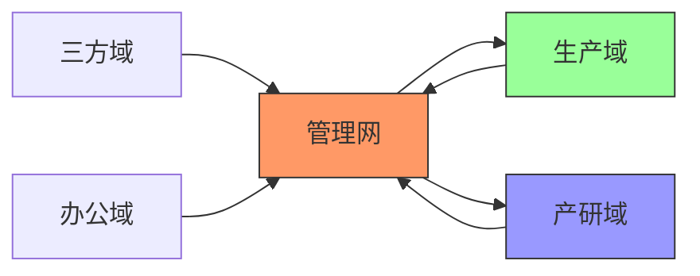

| 网络域 | 说明 | 互联互通 |
|-------|------|---------|
| 三方域 | 第三方通过内网访问服务和数据 | 受限访问 |
| 生产域 | 生产环境 | 与管理网互通 |
| 产研域 | 开发测试环境(通过ACL隔离) | 与管理网互通 |
| 管理网 | 运维系统和全局管理系统 | 可访问生产和产研 |
| 办公域 | 办公网络 | 独立域 |

### 2.2 跨云内网DNS系统建设

#### 2.2.1 为什么需要内网DNS系统

1. **应用集成**: 支持基于DNS的服务发现
2. **安全性**: 屏蔽特定域名和数据访问
3. **简化管理**: 统一配置中心,避免在多个云厂商界面操作
4. **提升稳定性**: 灵活配置DNS TTL,缓存加速公网域名解析
5. **跨云解析**: 实现跨云的内网域名解析能力

#### 2.2.2 内网DNS系统面临的问题

1. **可靠性要求**: DNS是绝大多数网络请求的第一步,不可用将导致大量请求失败
2. **云厂商兼容**: 每个云都有自己的内网DNS系统,需要兼容云服务商的内网域名解析

#### 2.2.3 高可靠内网DNS架构

**技术方案: CoreDNS**

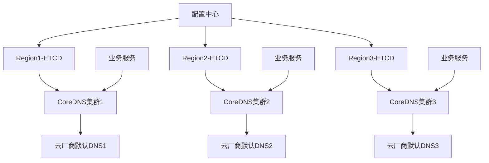

**架构特点:**
1. 每个Region独立部署CoreDNS集群
2. 每个CoreDNS依赖独立的ETCD集群
3. **上游DNS**: 指向本Region云厂商的默认DNS,实现云服务商内网域名解析
4. **配置中心**: 负责同步所有ETCD数据,保证配置一致性
5. **系统类型**: AP系统(可用性优先),非CP系统

**解析流程:**
1. 业务服务发起DNS请求
2. 请求到达本Region的CoreDNS
3. CoreDNS查询本地ETCD缓存
4. 如未命中,转发到云厂商默认DNS
5. 返回解析结果

## 三、多云可靠性建设

### 3.1 专线VPN逃生方案

#### 3.1.1 为什么需要逃生方案

1. **专线故障**: 专线可能发生故障,需要备用通道
2. **成本考虑**: 无法无限制拉取多条专线
3. **稳定性要求**: 专线断开后仍需保证跨云服务访问正常

#### 3.1.2 VPN逃生面临的问题

| 问题 | 说明 |
|------|------|
| VPN带宽限制 | 公有云VPN最大带宽约3Gbps(双向),单向1.5Gbps,远低于专线(10-100Gbps) |
| 路由切换 | 需要自动判断何时走VPN,何时走专线 |
| 公网延迟 | VPN基于公网,延迟较高 |

#### 3.1.3 BGP + ECMP + VPN方案

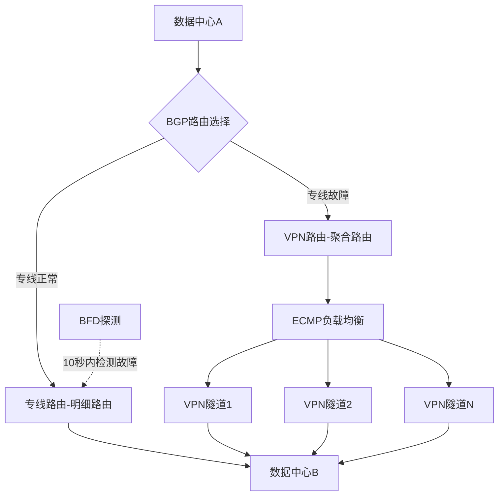

**方案要点:**

1. **ECMP多VPN隧道**: 通过ECMP将流量按五元组分发到多条VPN隧道,突破单VPN带宽限制
2. **BGP路由优先级**:
   - 专线: 明细路由(高优先级)
   - VPN: 聚合路由(低优先级)
3. **BFD快速故障检测**: 10秒内检测专线故障,触发BGP路由切换
4. **自动切换**: 专线故障时自动切换到VPN,专线恢复后自动切回

**方案局限:**
- 单流带宽受限于单条VPN隧道带宽
- 不适用于两台机器间通信带宽超过VPN带宽的场景

### 3.2 内网可观测系统建设

#### 3.2.1 为什么需要内网可观测系统

1. **感知黑盒**: 云环境下底层已成黑盒,需要从上层感知物理网络状态
2. **加速故障定位**: 快速判断是网络故障还是业务故障
3. **优先业务感知**: 在用户感知前发现问题,最小化影响
4. **网络变更校验**: 支持网络变更后的快速验证和回滚
5. **系统优化**: 识别网络瓶颈,针对性优化

#### 3.2.2 现有方案的问题

| 方案 | 问题 |
|------|------|
| **SmokePing** | 大规模场景下需手动配置大量规则,基本不可用 |
| **Blackbox Exporter** | 需手动加入节点,无法感知上层网络配置(如ACL),导致误告警 |

#### 3.2.3 可观测系统设计挑战

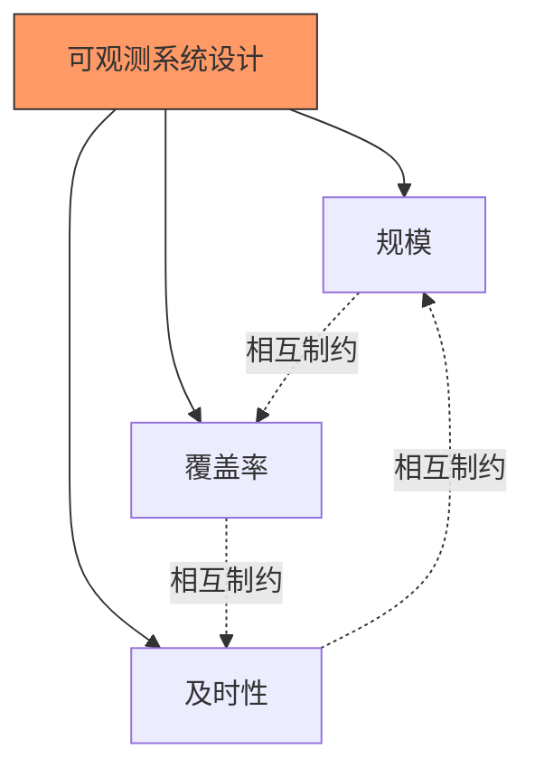

**三角平衡:**
- 规模大 + 覆盖广 + 及时性高 = 探测频率高 → 网络流量过大
- 需要在三者之间找到平衡点

#### 3.2.4 自动化可观测系统架构

**设计原则:**
1. **自注册**: 新机器加入集群自动注册
2. **自发现**: 自动发现对端探测节点
3. **自配置**: 根据规则灵活选择探测节点

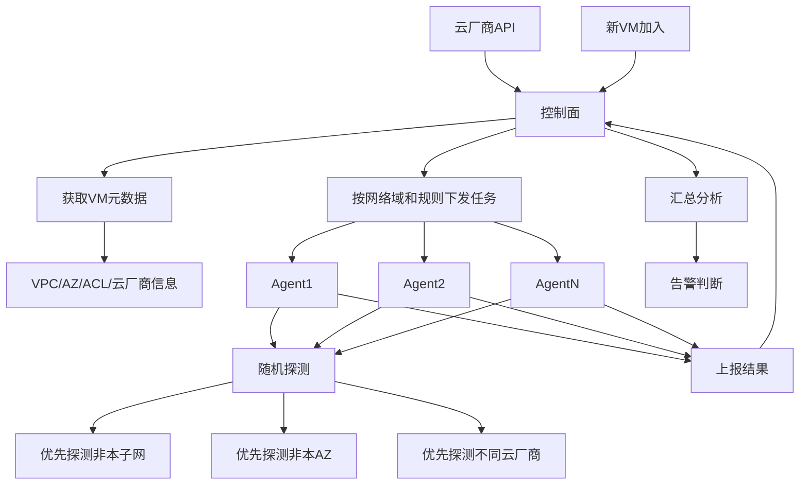

**系统流程:**

1. **VM注册**: 新VM加入时,控制面通过云厂商API获取元数据(VPC、AZ、ACL、云厂商等)
2. **任务下发**: 控制面周期性下发探测任务到选中的Agent
   - **随机任务**: 按网络域随机选择探测目标
   - **指定任务**: 网络变更时指定探测路径
3. **智能探测**: Agent根据规则随机选择探测目标
   - 优先探测非本子网(感知子网间故障)
   - 优先探测非本AZ(感知AZ间故障)
   - 优先探测不同云厂商(感知跨云故障)
4. **结果上报**: Agent上报探测结果(延迟、丢包率等)
5. **汇总分析**: 控制面汇总结果,根据规则判断是否告警

#### 3.2.5 网络质量实时监控

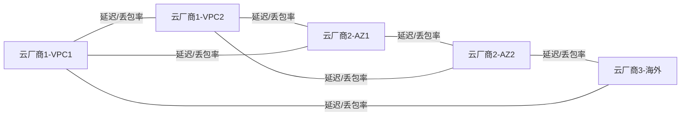

**监控能力:**
- 探测不同厂商、不同VPC、不同AZ之间的连通性
- 每条线路都是一个监控指标(延迟、丢包率)
- **故障感知**: 1分钟内感知网络故障
- **单节点故障**: 5分钟内感知

## 四、多云资源管理

### 4.1 多云资源交付

#### 4.1.1 多云资源交付的困难

1. **资源异构**: 不同云厂商的资源类型和规格不同
2. **流程差异**: 管理逻辑、生命周期各不相同
3. **账户分散**: 每个云服务商都有独立的账户体系
4. **配置不一致**: 即使是相同产品(如主机),配置和内核参数也可能不同

#### 4.1.2 基础设施即代码(IaC)

**为什么选择IaC:**

1. **云无关**: 通过Provider机制实现多云统一管理
2. **生命周期管理**: 统一的资源生命周期管理
3. **环境复制**: 快速实现跨云环境复制和迁移
4. **标准化**: 代码化管理,自动化交付,可视化变更记录

#### 4.1.3 为什么选择Terraform

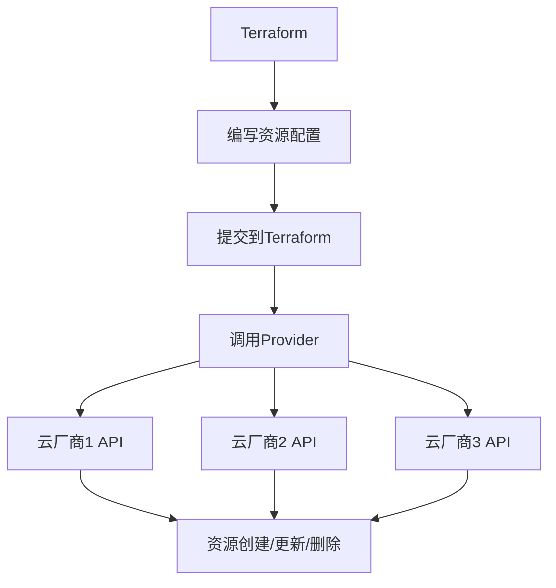

**选择理由:**

1. **高覆盖率**: 支持90%+的资源自动化交付需求
2. **声明式API**: 相比SDK/API方式,更易实现资源部分覆盖
3. **云无关**: 完全不关心云的具体实现,极大降低CMP平台实现难度
4. **生态成熟**: 支持天翼云等多种云厂商

**Terraform资源交付示例:**

```hcl
# EIP资源定义示例
resource "tencentcloud_eip" "example" {
  name                 = "example-eip"
  bandwidth_out        = 100
  internet_charge_type = "BANDWIDTH_PACKAGE"
  
  tags = {
    Environment = "production"
    Team        = "sre"
  }
}
```

### 4.2 全球镜像分发系统

#### 4.2.1 容器镜像的重要性

- Gartner报告: 560万开发者使用Kubernetes
- 容器镜像已成为重要的底层资源
- 镜像存储和分发是基础设施建设的必要环节

#### 4.2.2 现有方案对比

**方案一: 同步推送**

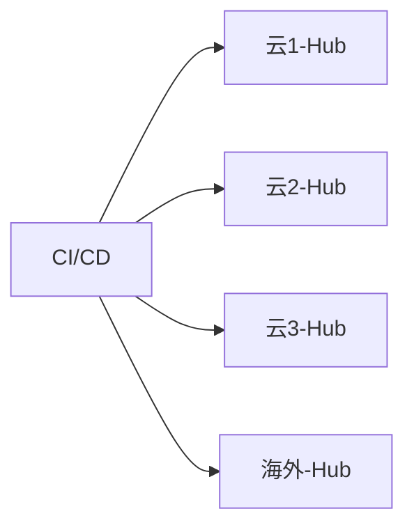

| 优点 | 缺点 |
|------|------|
| 推送完成即可用 | 镜像URL不统一,需要根据云厂商区分 |
| - | 每次推送到多个Hub,占用业务带宽 |
| - | 海外推送复杂,可能超时 |
| - | 权限管理分散,需要在每个云管理 |
| - | 迁移性差,引入新厂商需重新推送所有镜像 |

**方案二: 中心拉取**

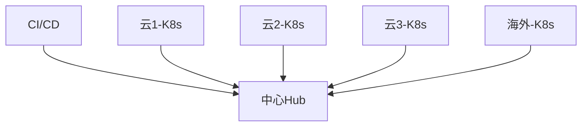

| 优点 | 缺点 |
|------|------|
| 镜像URL统一 | 可靠性差,中心Hub成为单点 |
| 权限管理集中 | 中心Hub成为性能瓶颈 |
| - | 占用云间专线带宽 |
| - | 海外拉取可能超时 |

#### 4.2.3 中心同步+就近拉取方案

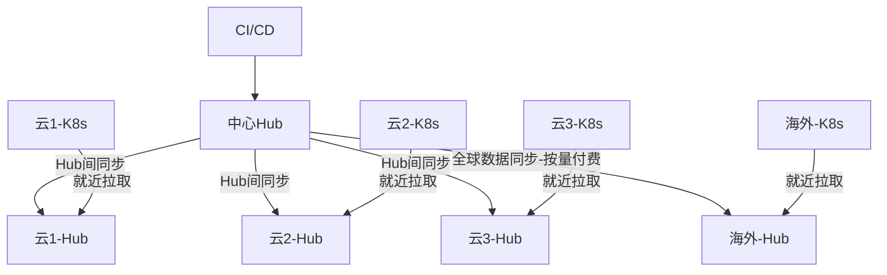

**方案特点:**

1. **中心推送**: 镜像统一推送到中心Hub
2. **Hub间同步**: 通过Hub同步机制分发到各Region Hub
3. **就近拉取**: 各K8s集群从本Region Hub拉取镜像
4. **海外同步**: 使用云厂商全球数据同步服务(按量付费),不占用专线带宽
5. **内网DNS**: 通过内网DNS实现统一镜像URL,不同Region解析到不同Hub

**性能提升:**
- 镜像拉取速度提升**10倍以上**

## 五、未来展望

### 5.1 零信任网络

#### 5.1.1 传统安全边界的问题

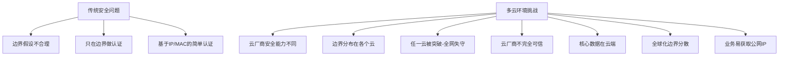

**传统安全的三大问题:**
1. **边界假设不合理**: 内网≠安全
2. **边界认证不足**: 只在边界做认证,内网无认证
3. **认证方式简单**: 基于IP/MAC,易伪造

**多云环境下的安全挑战:**
1. 云厂商安全能力不同
2. 安全边界分布在各个云上
3. 任一云被突破,整个内网安全性不复存在
4. 云厂商不完全可信,无法完全保证数据安全
5. 核心数据在云端,全球化边界分散
6. 业务通过Service/CLB容易获取公网IP

#### 5.1.2 为什么选择零信任

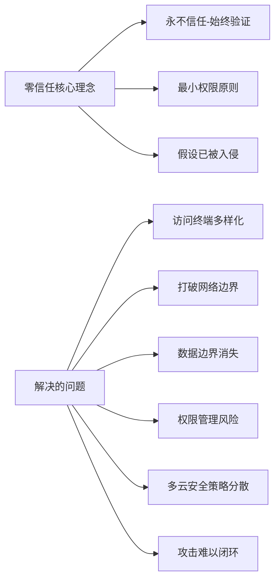

**零信任的关键价值:**

1. **应对终端多样化**: 访问终端多样化打破了传统网络边界
2. **数据边界消失**: 云上数据打破了数据边界,放大权限管理风险
3. **统一安全策略**: 多云安全策略统一管理
4. **全局防御**: 某一云主机受攻击后,可形成全球防御闭环

### 5.2 常态化演练

#### 5.2.1 为什么需要常态化演练

1. **实践检验**: 实践是检验真理的唯一标准
2. **方案验证**: 只有通过演练的方案才能在生产上使用
3. **环境变化**: 客观环境不断变化,需要验证方案是否仍然有效
4. **持续改进**: 在演练中发现问题,不断改进

#### 5.2.2 趣丸演练体系

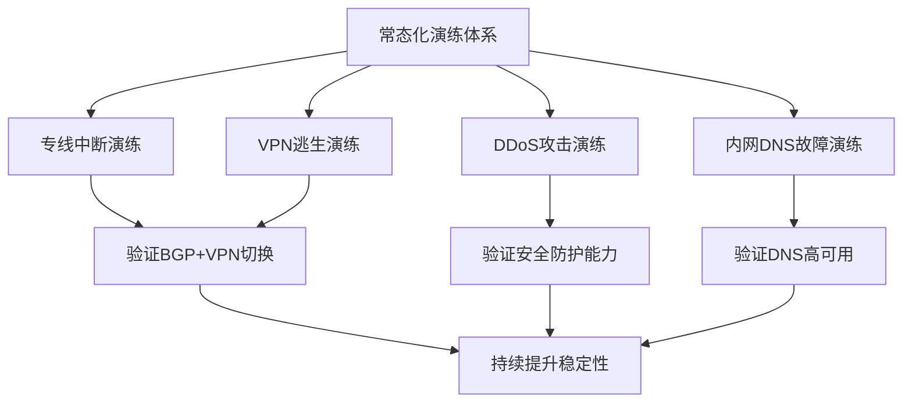

**演练类型:**
1. **专线中断演练**: 验证VPN逃生方案
2. **VPN逃生演练**: 验证流量切换和性能
3. **DDoS攻击演练**: 验证安全防护能力
4. **内网DNS故障演练**: 验证DNS高可用架构

**演练价值:**
- 极大提升系统稳定性
- 发现潜在问题
- 验证应急预案有效性
- 提升团队应急能力

## 六、总结

### 6.1 多云建设核心要点

1. **网络互联**: 选择合适的网络拓扑和连接方式,构建高可靠网络
2. **可观测性**: 建设自动化的内网可观测系统,实现故障快速感知和定位
3. **资源管理**: 采用IaC(Terraform)实现多云资源统一管理
4. **镜像分发**: 中心同步+就近拉取,提升镜像分发效率
5. **安全防护**: 向零信任架构演进,提升多云安全防护能力
6. **持续演练**: 建立常态化演练机制,持续验证和改进

### 6.2 趣丸实践经验

| 领域 | 关键实践 | 效果 |
|------|---------|------|
| 网络建设 | 混合型拓扑+BGP+ECMP+VPN | 专线故障自动切换,10秒内完成 |
| DNS系统 | CoreDNS+ETCD+多Region部署 | 高可用,支持跨云解析 |
| 可观测性 | 自注册+自发现+自配置 | 1分钟感知故障,5分钟感知单节点故障 |
| 资源管理 | Terraform IaC | 90%+资源自动化交付 |
| 镜像分发 | 中心同步+就近拉取 | 性能提升10倍以上 |

### 6.3 关键收获

1. 多云不是简单的多个云,需要系统化的基础设施建设
2. 自动化是降低多云复杂度的关键
3. 可观测性是可靠性建设的基础
4. 演练是验证方案有效性的唯一途径
5. 安全需要从边界防护向零信任演进

---

## Q&A 环节精选

**Q1: 多云建设如何做内网拨测?拨测标准如何定义?**

A: 
- **技术方案**: 采用基于熵增的Gossip协议方案,每台机器安装Agent,通过熵增实现广泛覆盖
- **避免中心瓶颈**: 不采用中心拨测方案,避免中心瓶颈和时效性差的问题
- **标准定义**: 不基于单个Agent判断,采用聚合多个节点数据的方式
  - 某节点探测失败时,触发附近其他节点再次探测
  - 多个节点确认故障后才告警
  - 根据业务情况不断演进告警规则

**Q2: 中心存储的镜像如何实现就近拉取?**

A:
- **核心机制**: 结合内网DNS实现
- **统一URL**: 所有镜像使用统一的域名tag
- **DNS解析**: 不同Region的DNS解析到不同的Hub地址
  - 推送时解析到中心Hub
  - 拉取时解析到本Region Hub
- **Hub同步**: 通过Hub间同步机制自动分发镜像

---

> 本文档整理自趣丸科技黄金老师的技术分享
> 整理时间: 2025年

