# 多云架构下的稳定性保障构建与运维实践

> 来源：未核验 · 类型：分享 · 状态：draft


> 分享嘉宾: 朱少华 - 趣丸科技资深运维架构师
> 工作经验: 10+年运维领域经验,近5年专注企业级容器化部署和云原生架构转型

## 目录

- [一、趣丸多云架构现状](#一趣丸多云架构现状)
- [二、趣丸多云架构实践](#二趣丸多云架构实践)
  - [2.1 多云互联互通的骨干网络构建](#21-多云互联互通的骨干网络构建)
  - [2.2 云原生架构下的多云流量调度](#22-云原生架构下的多云流量调度)
  - [2.3 多云异构的可观测性建设](#23-多云异构的可观测性建设)
- [三、未来展望](#三未来展望)

---

## 一、趣丸多云架构现状

### 1.1 多云时代的来临

根据2024年多云报告显示,**89%的企业已使用多云架构**,多云已成为企业IT基础设施的主流趋势。趣丸科技于2021年开始引入多云,至今已运营两年多时间。

### 1.2 为什么选择多云?

#### 1. 防止供应商锁定

- 在成本上有更多选择空间
- 避免过度依赖单一云服务商

#### 2. 弹性更优

- **更大的资源池**: 单云厂商为企业准备的弹性资源有限,多云环境下底层资源池更大更充足
- **性能最优**: 每个云厂商的机型迭代周期不同,可使用各云最新的计算节点,实现性能最优

#### 3. 故障转移

- 当某个云出现问题时,可将流量切换到其他云
- 确保业务连续性,将影响降到最低

#### 4. 优势互补

- 每个云厂商都有各自的特点和优势产品
- 例如: 某些云商提供AMD计算节点,成本更低

### 1.3 趣丸多云架构部署现状

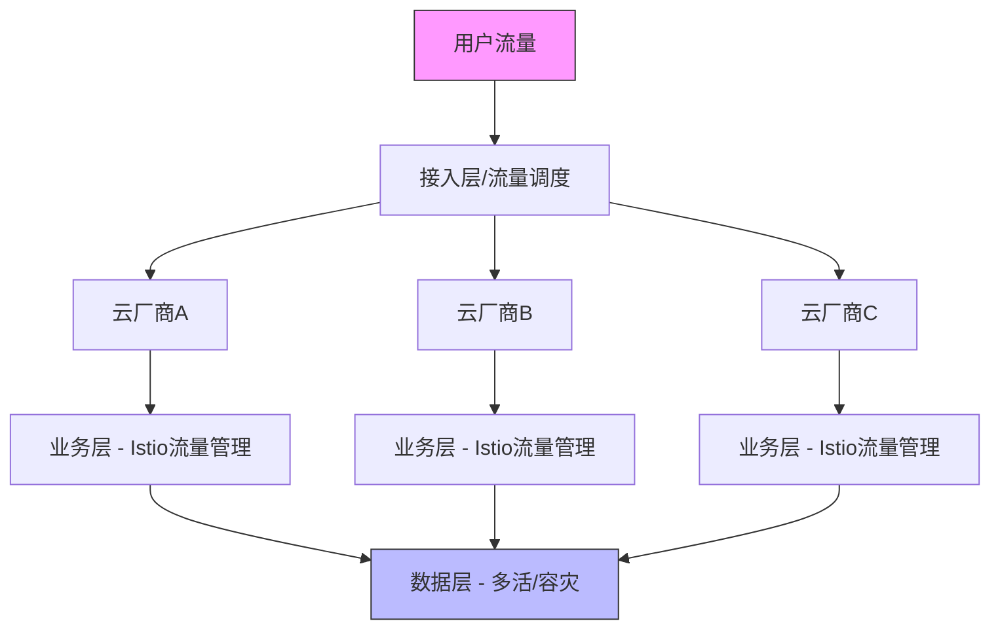

#### 架构特点

**两大核心原则:**

1. **业务层**: 在多个云部署,流量调度到多云
2. **数据层**: 部分数据层实现多活状态

**技术实现:**

- 业务层使用 **Istio** 进行流量管理和故障转移
- 部分业务已完成改造,实现数据层的多云容灾

### 1.4 多云架构带来的挑战

#### 挑战1: 多云网络连通性

单云环境下,云商自动解决网络连通性。多云环境下需要协调云商解决跨云连通性问题。

#### 挑战2: 多云流量调度

- 期望A云进入的流量在A云内闭环
- 避免不必要的跨云流量访问,降低成本

#### 挑战3: 多云异构的可观测性

- 需要屏蔽云商监控系统的差异
- 在上层构建统一的可观测系统

#### 挑战4: 数据层跨云容灾

在未完成单元化之前,多云多活需要解决:

- 数据同步
- 仲裁中心
- 业务切换
- 数据补偿
- 方案复杂度高

---

## 二、趣丸多云架构实践

## 2.1 多云互联互通的骨干网络构建

### 2.1.1 网络架构原则: 全球一张网

趣丸多云网络架构遵循"全球一张网"原则,需满足以下四点:

1. ✅ 构建多云互联互为冗余的骨干网络架构
2. ✅ VPN线路作为逃生通道,专线中断后无缝切换到VPN
3. ✅ VPC到VPC端的动态路由学习和自动收敛
4. ✅ 解决严重依赖单一云商中转或单一云商故障的风险

### 2.1.2 多云骨干网络架构

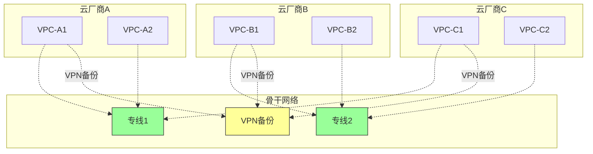

### 2.1.3 构建难点与解决方案

#### 四大难点

| 难点                             | 描述                                 | 影响                   |
| -------------------------------- | ------------------------------------ | ---------------------- |
| **云上专线接入产品不一致** | 每个云厂商专线接入产品名称和特点不同 | 需要了解各云商产品特点 |
| **云商跨云网络能力不一致** | 不同云商网络能力差异大               | 需要与云商协商定制方案 |
| **接入点单点故障风险**     | 云商可能将多条专线接入到同一设备     | ⚠️ 已踩坑,影响非常大 |
| **BGP收敛速度慢**          | BGP协议收敛速度一般需要5分钟         | 需要加速路由收敛       |

#### 解决方案

**1. 采用BFD加速路由收敛**

- BGP默认收敛时间约5分钟
- 通过BFD(双向转发检测)方案加速路由收敛

**2. 与运营商共建**

- 整个网络构建非常复杂,耗时长
- 建议与云商合作共建
- 提出产品需求,拉齐各云商产品能力

**3. 多接入点冗余**

- 要求云商与专线供应商通过不同机房或设备接入
- 防止单点故障导致所有专线中断

### 2.1.4 架构优势与不足

#### ✅ 优势

- 满足"全球一张网"架构原则
- 在任何云开通新VPC,无需网络调整,网络自动互通
- 高可用性: 多专线并行,SLA无限趋近100%

#### ⚠️ 不足与注意事项

**流量QoS问题**

- 受限于云商底层能力,流量QoS目前不完善
- 部分云商底层能力不支持

**VPN带宽规划**

- 多条专线并行时,SLA接近100%
- VPN仅作为逃生通道,无需承担全部流量
- 仅考虑专线全部中断时的管理流量
- 单条VPN带宽约1Gbps,若专线10-20Gbps,不需要过多VPN
- 从成本和稳定性考虑都无必要

---

## 2.2 云原生架构下的多云流量调度

### 2.2.1 基于Kubernetes和Istio的多云流量调度

#### Kubernetes多云集群部署方案

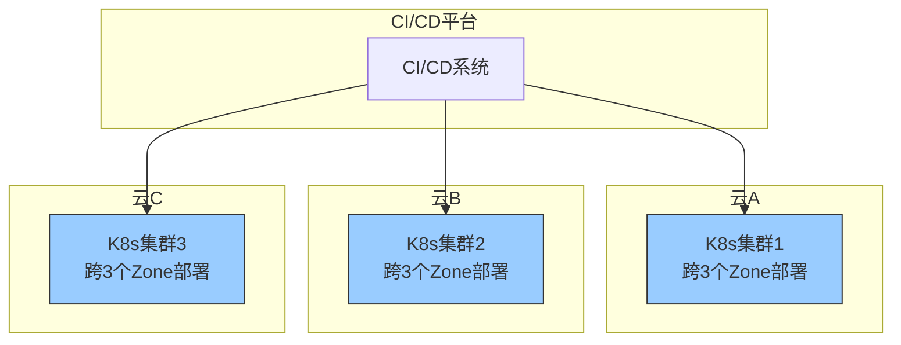

**部署特点:**

1. **集群独立部署**

   - K8s集群相互独立,未做联邦
   - 通过统一CI/CD进行多集群部署
2. **为何不联邦?**

   - 通过Istio多云流量调度已满足跨集群访问需求
   - 多云相互独立有更好的隔离性,防止整个集群全部故障
3. **跨可用区部署要求**

   - 每个集群必须跨3个Zone部署
   - **好处1**: 不会因某个Zone故障影响集群
   - **好处2**: 弹性资源池更大,每个Zone可配置弹性资源池,避免单Zone资源不足

#### 云原生改造实践

趣丸遵循**云原生12要素/15要素**进行业务改造:

- ✅ 微服务化
- ✅ 容器化
- ✅ 不可变基础设施
- ✅ 服务网格(Service Mesh)
- ✅ 通信协议标准化
- ✅ 服务发现机制
- ✅ 服务状态码标准化

实现效果: 应用快速迭代、灵活部署、高可用

### 2.2.2 Istio单一网格多集群架构

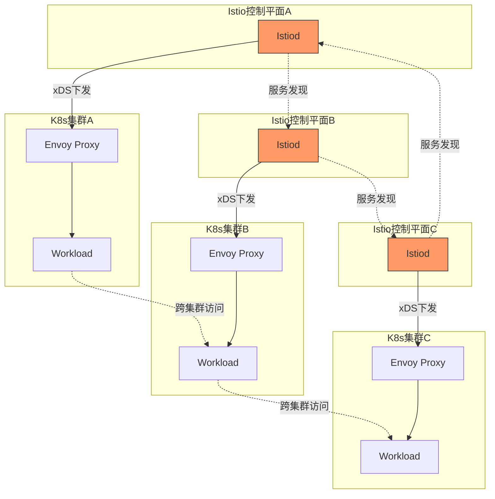

**架构特点:**

采用**单一网格多集群(Single Mesh Multi-Cluster)**部署模式

✅ **优势:**

1. **高可用性**: 每个集群有独立控制面,单个控制面故障不影响整体网格
2. **隔离性好**: 每个控制面可独立配置和升级,不影响其他集群
3. **服务互通**: 每个控制面可发现其他集群的Service和Endpoint
4. **跨集群访问**: 通过xDS下发到Envoy Proxy,实现Workload直接互相访问

⚠️ **前提条件:**

- 所有云商的网络必须打平(Pod IP互通)
- 前期需要做好网络规划

### 2.2.3 架构挑战与优化

#### 挑战1: xDS下发性能瓶颈

**问题描述:**

- 随着规模增大,Istio发现的Service和Endpoint越来越多
- xDS配置非常大,下发形成性能瓶颈

**解决方案:**

| 方案                    | 说明                                    | 成熟度               |
| ----------------------- | --------------------------------------- | -------------------- |
| **Istio资源隔离** | 通过Istio资源做隔离,减少不相关的xDS推送 | ⭐⭐⭐⭐⭐ 最有效    |
| **Delta xDS**     | Istio 1.21版本提供增量xDS功能           | ⭐⭐⭐⭐ 测试中      |
| **第三方方案**    | xDS累积加载,懒加载                      | ⭐⭐ 不够成熟,有问题 |

**最佳实践:**

- 如果服务A不需要访问服务B,就不下发服务B的xDS
- 单云环境也存在此问题

#### 挑战2: 不必要的跨云流量

**问题:**

- 由于Workload可全网互通,引发大量不必要的跨云流量
- 增加专线成本

**解决方案:** 见下节流量调度策略

#### 挑战3: 安全性问题

**问题:**

- Workload可互相访问,无任何验证
- 可访问集群内任何服务,存在安全隐患
- ⚠️ 已发生安全事件: 有人模拟请求给特殊账号添加道具

**解决方案:** 见2.2.5节访问控制

### 2.2.4 流量调度策略

#### 策略1: 本地优先(Locality-based Routing)

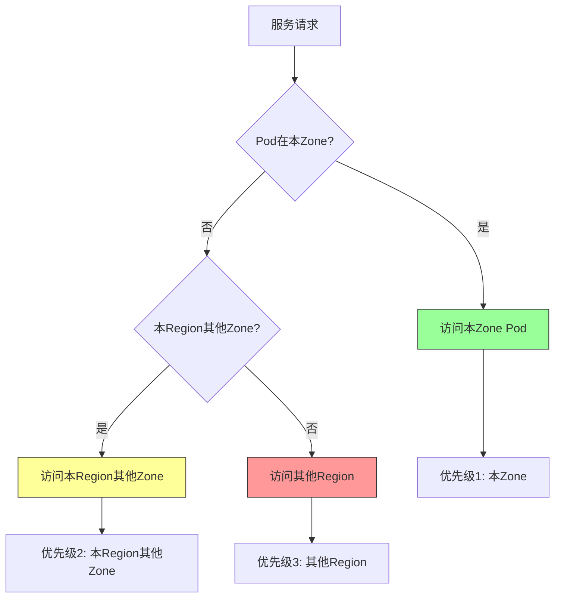

**调度优先级:**

1. **优先级1**: 本云(Cloud) > 本Region > 本Zone
2. **优先级2**: 本云(Cloud) > 本Region > 其他Zone
3. **优先级3**: 其他云 > 其他Region > 其他Zone

**实现原理:**

- Kubernetes本身没有负载均衡配置
- 通过Istio的**FailOver per Priority**(故障转移策略)实现
- Istio可以发现K8s拓扑信息(集群、Region、Zone)

**解决的问题:**

- ✅ 实现业务多活
- ✅ Zone级别容灾能力
- ✅ Region级别容灾能力

⚠️ **注意事项:**

- **Pod必须均匀分布到多个可用区**,否则Pod间负载均衡会出现问题
- 建议使用**K8s拓扑感知调度(Topology Spread Constraints)**

#### 策略2: 故障转移(Outlier Detection)

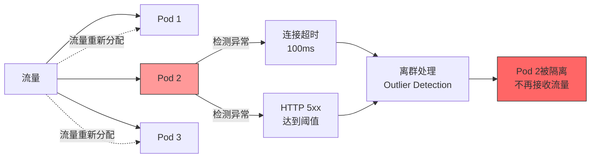

**应用场景:**

**场景1: xDS下发延迟**

- xDS下发存在延迟(通常10秒)
- Pod退出后,Endpoint刷新不及时
- 流量仍然发往已不存在的Pod,导致失败

**场景2: 部分Pod异常**

- 部分Pod因各种原因出现问题(如数据库连接失败)
- 服务看似存活,但无法正常处理请求

**解决方案:**

**1. TCP层面快速失败**

- 设置连接超时为**100ms**
- 云内或专线跨云,100ms内未连接视为异常
- 异常Pod进行**离群处理(Outlier Detection)**

**2. HTTP层面状态码检测**

- 根据HTTP状态码检测(主要是5xx)
- 达到阈值后进行离群处理
- 异常Pod被隔离,不再接收流量

⚠️ **重要注意事项:**

> **必须与研发对齐HTTP状态码规范**
>
> - 参数错误等客户端错误**不能返回5xx**,应返回4xx
> - 否则会导致正常Pod被误踢出服务

**配置位置:**

- Istio的**DestinationRule(DR)**资源
- 配置项: `outlierDetection`

### 2.2.5 金丝雀发布(Canary Deployment)

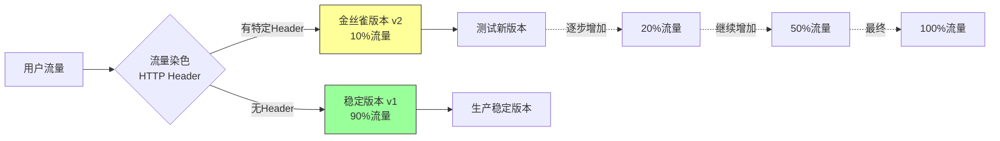

**特点:**

1. **流量染色机制**

   - 通过HTTP Header进行流量标记
   - 有标记的流量路由到金丝雀版本
   - 无标记的流量路由到稳定版本
2. **精确控制流量百分比**

   - 可精确控制金丝雀版本的流量占比
   - 逐步从10% → 20% → 50% → 100%
3. **多维度流量控制**

   - 可根据客户端版本路由
   - 可根据用户ID路由
   - 可根据地域路由
4. **控制爆炸半径**

   - 逐步迁移用户流量
   - 很好地控制更新过程中的故障影响范围

**使用场景:**

- 新功能灰度发布
- 版本A/B测试
- 特定用户群体测试

### 2.2.6 访问控制(Authorization Policy)

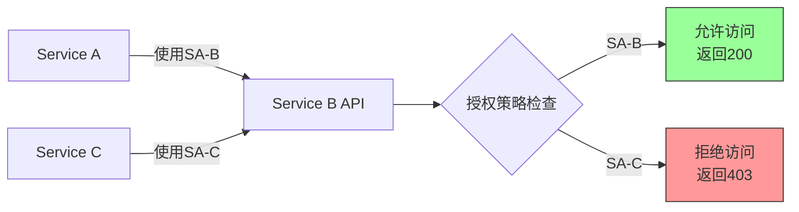

**安全问题:**

- 集群网络打通后,服务间访问无任何验证
- 可以访问集群内任意服务
- ⚠️ 已发生安全事件

**Istio安全防护能力:**

#### 1. mTLS加密(默认开启)

- 网格内所有流量访问都经过**TLS加密**
- 服务间通信安全性保障

#### 2. 基于身份的授权策略

**核心机制:**

- 基于**ServiceAccount(SA)**的身份验证
- 通过**AuthorizationPolicy**精确控制服务间访问

**示例配置:**

```yaml
apiVersion: security.istio.io/v1beta1
kind: AuthorizationPolicy
metadata:
  name: service-b-policy
spec:
  selector:
    matchLabels:
      app: service-b
  rules:
  - from:
    - source:
        principals: ["cluster.local/ns/default/sa/sa-b"]
    to:
    - operation:
        methods: ["GET", "POST"]
        paths: ["/api/*"]
```

**访问控制能力:**

- ✅ 基于ServiceAccount控制
- ✅ 基于Namespace控制
- ✅ 基于请求方法控制
- ✅ 基于API路径控制
- ✅ 基于请求头控制

**效果:**

- 服务A使用正确的SA访问 → ✅ 200 OK
- 服务C使用错误的SA访问 → ❌ 403 Forbidden

---

## 2.3 多云异构的可观测性建设

### 2.3.1 可观测性挑战

**云原生新要素: 遥测(Telemetry)**

- 云原生架构的关键环节
- 保障系统质量的重要手段

**多云环境挑战:**

- 不同云平台监控工具差异大
- 不同云平台日志系统差异大
- 需要统一的数据收集和分析能力

**数据特点:**

- ✍️ **写入量大**: 海量的监控、日志、追踪数据
- 👀 **查询量小**: 主要在故障时查询
- 📊 **日志数据尤其巨大**: 写入多,使用少

### 2.3.2 可观测性架构设计

#### 架构原则

> **就近存储,本地计算,跨专线聚合查询**

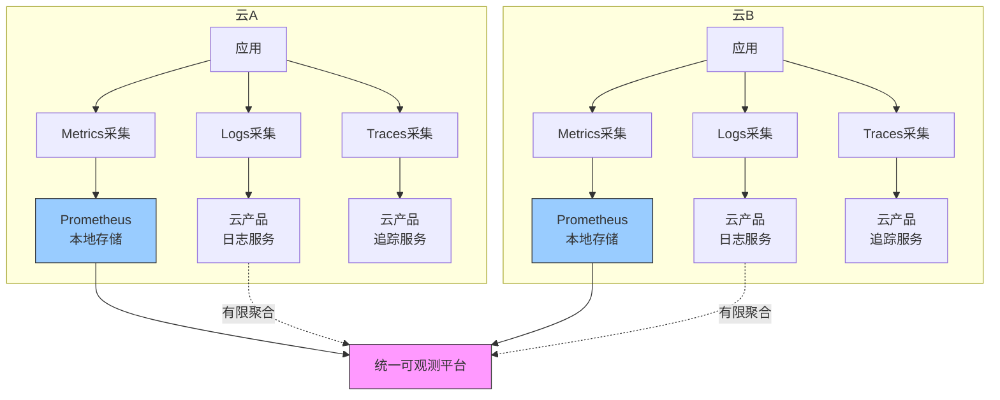

**设计理由:**

- ❌ 大量写入流量走专线不合适(成本高、带宽消耗大)
- ✅ 数据就近存储在各云
- ✅ 本地计算处理
- ✅ 仅在需要时跨专线聚合查询

### 2.3.3 三大支柱统一方案

#### 1. Metrics(监控指标)统一

**实现方式:**

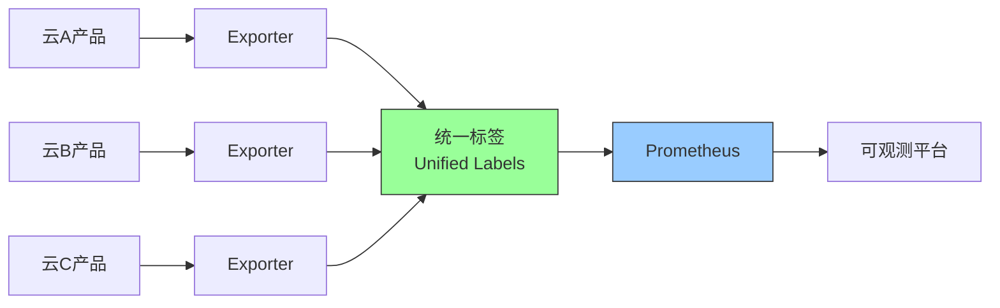

**方案:**

- 开发统一的**Exporter**
- 每种云产品通过**统一标签(Unified Labels)**存储到Prometheus
- 屏蔽底层差异
- 作为可观测平台的数据基础

#### 2. Logs & Traces(日志与追踪链)

**现状:**

- 日志和追踪链使用云产品
- 暂时无法做到就近存储、跨云聚合
- 不同云之间差异非常大

**挑战:**

- 云产品种类繁多
- 不同云之间差异巨大
- 接入新云需要投入大量人力开发Exporter

**期望:**

> 💡 **建议CNCF制定标准**
> 约束云商产品指标暴露规范,降低多云企业接入成本

### 2.3.4 统一可观测平台

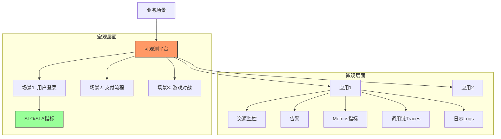

#### 两大特点

**特点1: 从业务场景关注整体质量**

- 将业务划分为各个场景
- 制定SLO(服务等级目标)和SLA(服务等级协议)
- 从用户视角关注服务质量

**场景示例:**

- 用户登录场景
- 支付流程场景
- 游戏对战场景
- 直播推流场景

**特点2: 以应用为中心的一站式平台**

核心理念: **Application-Centric Observability**

**关联内容:**

- 🖥️ 资源监控 (CPU、内存、网络、磁盘)
- 🔔 告警信息
- 📊 Metrics指标
- 🔗 调用链Traces
- 📝 日志Logs

**优势:**

- ✅ 无需在各个平台间跳转
- ✅ 一站式问题排查
- ✅ 数据关联展示
- ✅ 提升故障排查效率

**实现方式:**

- 底层各平台(监控、日志、追踪)保持独立
- 上层统一平台进行数据聚合和关联
- 以应用为中心构建关联关系

#### 质量展示层次

**从宏观到微观:**

1. **业务场景层**: 整体业务场景的SLO/SLA
2. **服务层**: 各个微服务的健康状态
3. **接口层**: 具体API接口的性能指标
4. **实例层**: 单个Pod/容器的详细监控

**效果:**

- 遇到问题时可以更快发现
- 从场景到具体实例层层下钻
- 快速定位问题根因

---

## 三、未来展望

多云架构仍面临诸多挑战,结合业务需求和云原生技术发展方向,总结以下四个演进方向:

### 3.1 接入层演进

**现状:**

- 通过高防 + 智能DNS实现流量入口分流
- 相对传统的做法

**未来方向:**

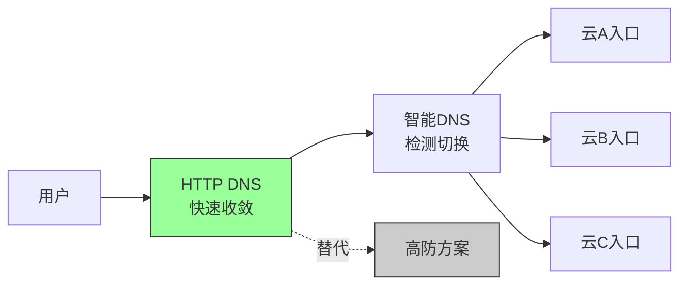

**方案:**

- **HTTP DNS**快速收敛能力
- + **智能DNS**检测切换
- = 实现多入口快速切换
- 替换掉高防方案

**优势:**

- 更快的故障切换速度
- 降低成本
- 简化架构

### 3.2 数据层演进

**现状:**

- 去年做了一些探索
- 部分业务已实现多云容灾
- 但整体处于**停滞状态**

**原因:**

- 数据层跨云容灾方案非常复杂
- 成本考虑
- 规模考虑

**未来思考:**

> 💭 如何通过**云原生能力**解决数据层多活问题?
> 而不是通过传统方式(如数据库复制、仲裁中心等)

**可能方向:**

- 单元化架构
- 分布式数据库(如TiDB、CockroachDB)
- Operator模式的数据库管理
- 云原生存储方案

### 3.3 流量调度层演进: WebAssembly

**Istio + WASM插件能力**

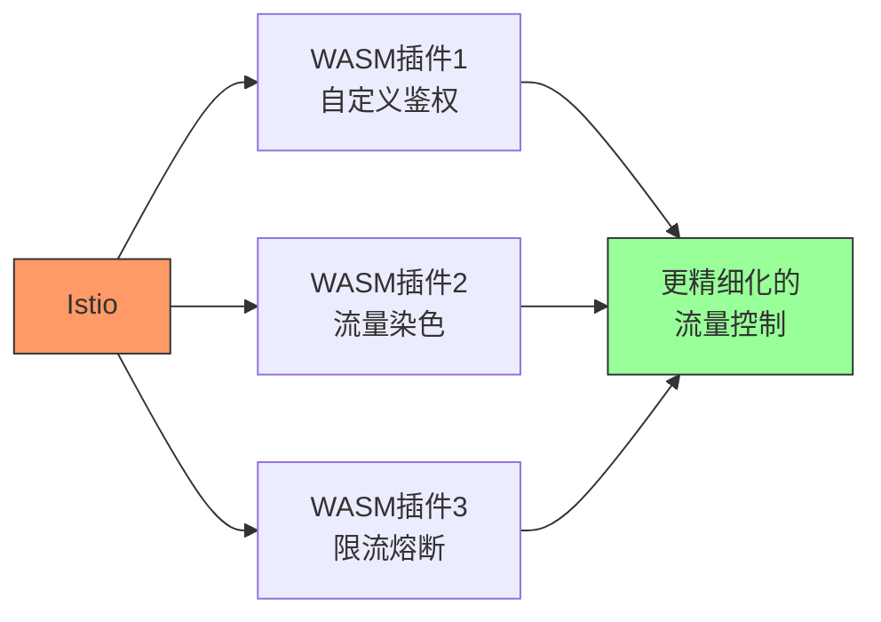

**WASM优势:**

- ✅ 自定义流量控制逻辑
- ✅ 更精细化的流量管理
- ✅ 更多可操作空间
- ✅ 高性能(接近原生性能)
- ✅ 多语言支持(Rust、Go、AssemblyScript等)

**应用场景:**

- 自定义鉴权逻辑
- 复杂的流量染色规则
- 业务级别的限流熔断
- 动态路由规则

### 3.4 可观测性演进: eBPF

**eBPF技术特点**

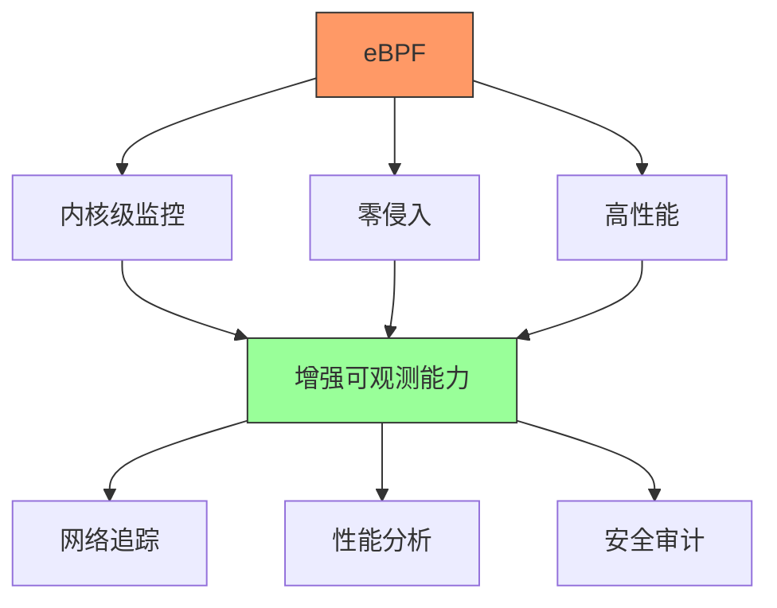

**eBPF优势:**

- 🔥 **最近很火的技术**
- ✅ 内核级别的可观测能力
- ✅ 零侵入(无需修改应用代码)
- ✅ 高性能(在内核层面采集)
- ✅ 更强的可观测性

**应用场景:**

- 网络性能分析
- 系统调用追踪
- 安全审计
- 分布式追踪
- 无侵入的APM

**带来的价值:**

- 更深层次的系统洞察
- 更低的性能开销
- 更多的可观测维度
- 更强的问题排查能力

---

## 总结

本次分享主要围绕**流量调度**和**可观测性建设**两大核心主题展开。

### 核心要点回顾

#### 1️⃣ 网络基础

- 构建"全球一张网"的骨干网络架构
- 专线 + VPN的冗余设计
- BGP + BFD实现快速路由收敛

#### 2️⃣ 流量调度

- 基于Istio的服务网格流量管理
- 本地优先的流量调度策略
- 故障转移与离群检测
- 金丝雀发布与访问控制

#### 3️⃣ 可观测性

- 就近存储、本地计算、跨云聚合
- 统一Metrics、Logs、Traces三大支柱
- 以应用为中心的一站式平台
- 从业务场景到微服务实例的全链路监控

#### 4️⃣ 未来演进

- HTTP DNS + 智能DNS替代高防
- 云原生方式解决数据层多活
- WASM实现更精细化流量控制
- eBPF增强可观测能力

### 关键经验

> ✅ **多云不是银弹**,需要建立稳定性投入产出比模型(ROI Model)
> ✅ **云原生技术栈**(K8s + Istio)是多云架构的最佳实践
> ✅ **自动化**是稳定性保障的核心(从发现、处理到恢复)
> ✅ **与云商共建**比自己造轮子更高效

---

## Q&A精选

### Q1: 如何做到Pod均匀调度到各个Zone?

**A:** 推荐使用**Kubernetes拓扑分布约束(Topology Spread Constraints)**

```yaml
topologySpreadConstraints:
  - maxSkew: 1
    topologyKey: topology.kubernetes.io/zone
    whenUnsatisfiable: DoNotSchedule
    labelSelector:
      matchLabels:
        app: myapp
```

其他方案: HPA、污点(Taints)、亲和性(Affinity),但**拓扑分布约束**是最优选择。

### Q2: 服务请求异常状态码后的离群是怎么做的?

**A:** 使用Istio自身的**异常检测(Outlier Detection)**功能,在DestinationRule(DR)中配置:

```yaml
apiVersion: networking.istio.io/v1beta1
kind: DestinationRule
metadata:
  name: my-service
spec:
  host: my-service
  trafficPolicy:
    outlierDetection:
      consecutiveErrors: 5
      interval: 30s
      baseEjectionTime: 30s
      maxEjectionPercent: 50
```

### Q3: 云服务提供商性能差异怎么应对?

**A:** 采用**差异化HPA配置**

- 不同云商配置不同的HPA策略
- 高性能云商可以设置更高的CPU阈值
- 低性能云商需要更早触发扩容
- 实测发现: 不同云商同配置机型性能可差**30%**

### Q4: 如何利用Istio Gateway管理多云环境流量?

**A:** 两层流量控制

1. **入口层**: 通过智能DNS按百分比分配到各云
2. **云内层**: 每个云的Istio Gateway + VirtualService配置本地路由规则

配合本地优先策略,实现:

- 流量就近访问本集群服务
- 本地服务不可用时,通过Failover策略转移到其他云

### Q5: 动态路由学习是怎么做到的?

**A:** 使用**BGP协议**

- 云商的企业路由器(ER/ENR)产品支持BGP
- 各VPC通过BGP自动学习路由
- 配合BFD实现快速收敛

### Q6: 多云的收益对比人力成本和设施成本,投入产出比如何?

**A:** 需要建立**稳定性ROI模型**

不是简单对比多云vs单云,而是:

1. 评估当前可用性水平(如3个9、4个9)
2. 明确业务要求的目标可用性
3. 计算达到目标的各种方案成本
4. 对比多云、单云、混合等方案的ROI

**何时考虑多云:**

- 业务对可用性要求极高(如4个9以上)
- 单云架构优化已达瓶颈
- 故障影响业务核心指标
- ROI模型显示多云方案更优

### Q7: 如何自动化故障检测和恢复?

**A:** 分为三个阶段

**事前(Prevention):**

- 网络连通性检测(PingMesh工具)
- 覆盖99%以上网络节点
- 风险治理
- SLA建设

**事中(Detection & Recovery):**

- 链式根因定位系统
  - 检测Pod健康状态
  - 检测Pod日志异常
  - 检测上下游服务
  - 检测依赖的数据库和中间件
- 故障自愈脚本
  - HPA达到上限自动扩容
  - 异常Pod自动重启/删除

**事后(Postmortem):**

- 故障复盘
- 预案建设
- 快速恢复机制

---

## 附录

### 相关技术栈

| 类别               | 技术                |
| ------------------ | ------------------- |
| **容器编排** | Kubernetes          |
| **服务网格** | Istio               |
| **监控**     | Prometheus、Grafana |
| **日志**     | 云商日志服务        |
| **追踪**     | 云商追踪服务        |
| **网络**     | BGP、BFD、专线、VPN |
| **CI/CD**    | 统一CI/CD平台       |

### 关键指标

- **SLA目标**: 4个9以上(99.99%)
- **BGP收敛时间**: ~5分钟(优化前)
- **BFD收敛时间**: <1分钟(优化后)
- **xDS下发延迟**: ~10秒
- **连接超时阈值**: 100ms
- **单VPN带宽**: ~1Gbps
- **云商性能差异**: 可达30%

### 参考资料

- Istio官方文档: https://istio.io/
- Kubernetes拓扑感知调度: https://kubernetes.io/docs/concepts/scheduling-eviction/topology-spread-constraints/
- eBPF: https://ebpf.io/
- WebAssembly: https://webassembly.org/

---

> 📌 **分享嘉宾**: 朱少华
> 🏢 **所属公司**: 趣丸科技
> 💼 **职位**: 资深运维架构师
> 📅 **分享时间**: 2024年


