# 业务上云后58到家运维平台演进之路

> 来源：未核验 · 类型：分享 · 状态：draft

## 一、背景介绍

### 1.1 公有云的优势

近几年,公有云已经非常成熟稳定,成为很多中小型互联网公司的首选。

**公有云相比传统IDC的优势:**

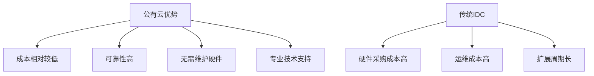

- **成本低**: 按需付费,无需大量前期投入
- **可靠性高**: 成熟的基础设施和容灾能力
- **免维护**: 无需维护硬件设备
- **技术支持**: 专业的技术支持团队

### 1.2 58到家的选择

**2016年初,58到家决定All in公有云**

**背景:**

- 2015年10月获得阿里、平安、KKR两亿美金A轮融资
- 为满足业务高速发展需要
- 技术团队高层决定全面迁移到公有云

## 二、石器时代的那道坎

### 2.1 IDC时代的痛点

**2015年之前的运维模式:**

**主要问题:**

1. **资源申请流程繁琐**

   - 服务器购买
   - 上架部署
   - 资源分配
   - 周期长,效率低
2. **权限管控不灵活**

   - 缺乏统一的权限管理
   - 可控性差
3. **沟通成本高**

   - 多方协调
   - 响应速度慢

## 三、All in公有云的迁移之路

### 3.1 迁移方案

**采用全量部署、逐步切流量的迁移方案**

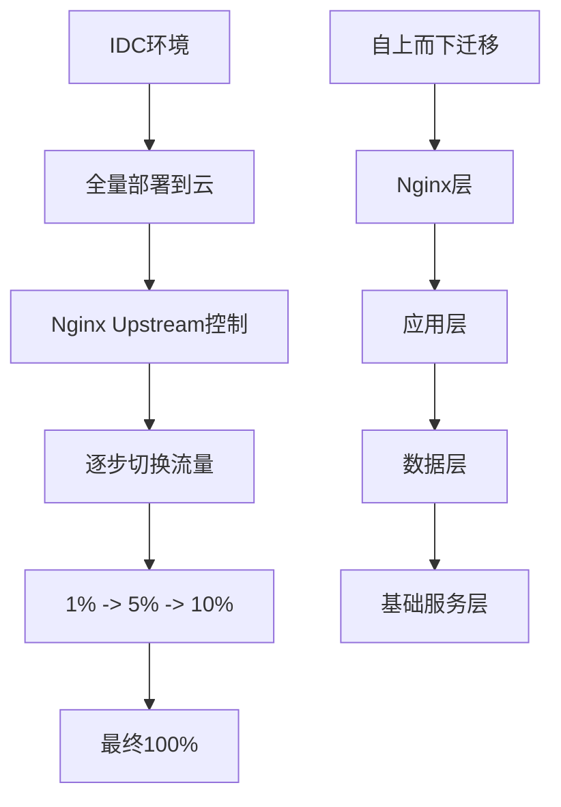

**迁移策略:**

1. **自上而下逐层迁移**

   - 从Nginx层开始
   - 逐步到应用层
   - 最后是底层基础服务
2. **流量控制**

   - 通过Nginx Upstream控制流量比例
   - 解决商业DNS免费版不支持权重调整的问题
   - 避免运营商DNS缓存问题
3. **同步部署**

   - IDC和云环境同时部署
   - 保证随时可回滚

### 3.2 迁移规模

**2016年迁移数据:**

| 项目     | 数量              |
| -------- | ----------------- |
| 迁移服务 | 160+              |
| 数据库   | 70+               |
| 历时     | 114天             |
| 数据量   | 2TB+ (不含大数据) |
| 参与人员 | 全体技术团队      |

**迁移时间线:**

- 2015年底: 决策启动
- 2016年初: 基础设施建设
- 2016年春节前: 搭建专线
- 2016年Q1-Q2: 全面迁移

### 3.3 上云后的挑战

**遇到的主要问题:**

1. **不可控因素**

   - 公有云骨干网出口故障 (影响2小时+)
   - HAVIP产品脑裂 (影响2小时+)
   - 专线断开后无退路
2. **性能瓶颈**

   - BI大数据场景
   - 虚拟机CPU/内存瓶颈明显
   - 需要使用物理机才能解决
3. **成本失控**

   - 预算从10万/月快速增长到20万、30万
   - 购买资源太方便,缺乏管控
   - 老板质疑成本增长
4. **管理混乱**

   - 运维团队仅3人,支撑150+研发
   - 资产不可追溯
   - 机器归属不清
   - 账号密码丢失
   - Excel表格维护,全靠自觉

## 四、第一代运维平台 (2016年10月)

### 4.1 建设背景

**核心痛点:**

- 费用增长无法追溯
- 资源归属不清
- 被动低效的人肉模式
- Excel表格维护困难

### 4.2 平台功能

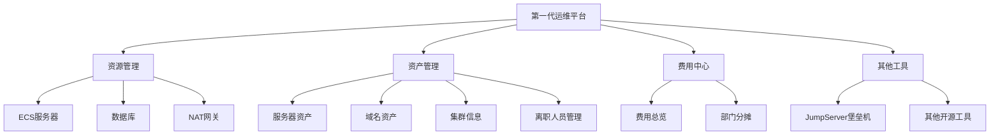

**主要模块:**

1. **资源管理**

   - 调用阿里云API
   - 服务器、数据库、NAT网关展示
   - 资源使用情况
2. **资产管理**

   - 服务器归属查询
   - 集群域名信息
   - 离职人员管理 (重要!)
   - DNS资产管理
3. **费用中心**

   - 费用总览
   - 部门费用分摊
   - 成本可视化
4. **其他功能**

   - 集成JumpServer堡垒机
   - 链接其他运维系统

### 4.3 第一代平台的局限

**技术栈:** 基于PHP开发

**问题:**

- 2018年1月,唯一的PHP开发离职
- 平台进入维护期,无法迭代
- 功能相对简单
- 无法满足日益增长的需求

## 五、第二代运维平台 (2018年6月至今)

### 5.1 整体架构

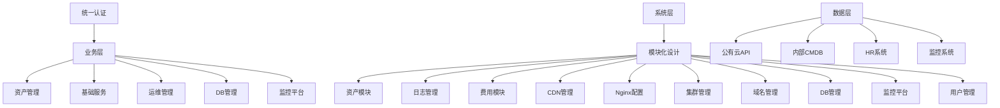

**架构特点:**

1. **统一认证**: 公司级统一认证系统
2. **模块化设计**: 便于扩展和迭代
3. **多数据源**: 公有云、CMDB、HR、监控
4. **底层技术**: 基于Ansible实现自动化

### 5.2 核心功能详解

#### 1. 站点导航

**功能清单:**

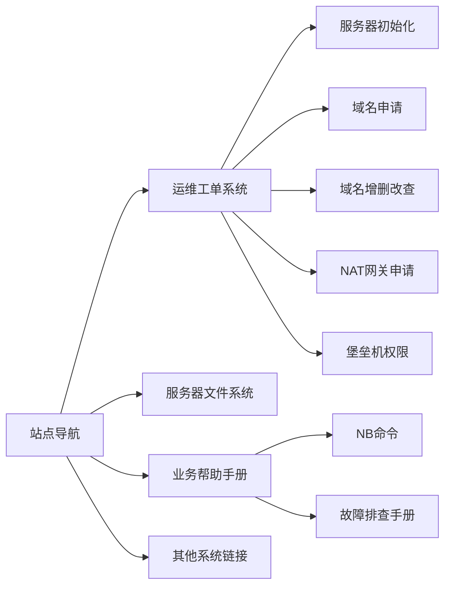

**运维工单系统:**

- 服务器初始化工单
- 域名申请和管理
- NAT网关申请 (VPC环境默认无公网权限)
- 堡垒机权限申请

**权限管理策略:**

- **Root账号**: 仅运维使用
- **Work账号**: 分配给非运维,管理应用
- **只读账号**: 仅查看权限

**安全加固:**

- 阉割JumpServer的Web登录功能
- 禁用Web界面上传下载
- 文件下载通过HTTP链接 + wget方式

**NB命令 (重点功能):**

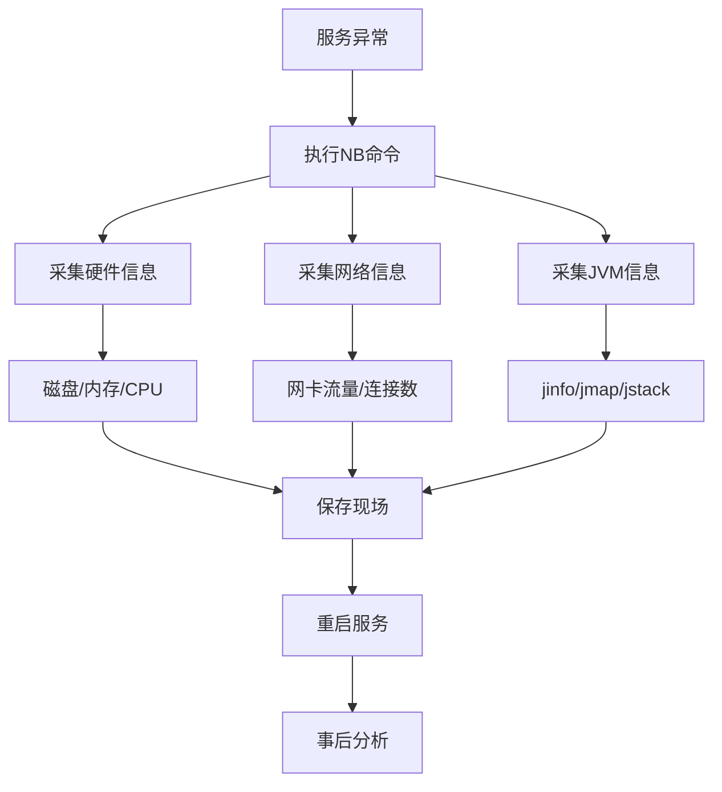

**NB命令作用:**

- 在重启前保存完整现场信息
- 采集硬件、网络、JVM状态
- 耗时约1分钟
- 便于事后问题追溯

#### 2. 资产管理

**功能特点:**

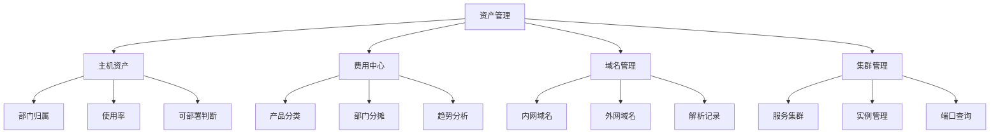

**核心价值:**

- 业务自助查询资产归属
- 快速定位问题服务
- 避免频繁找运维
- 提升协作效率

**重要原则:**

- **必须使用域名,不要用IP+端口**
- 域名可以不变,IP可能变化
- 便于后续迁移和扩展

#### 3. 域名与集群管理

**功能实现:**

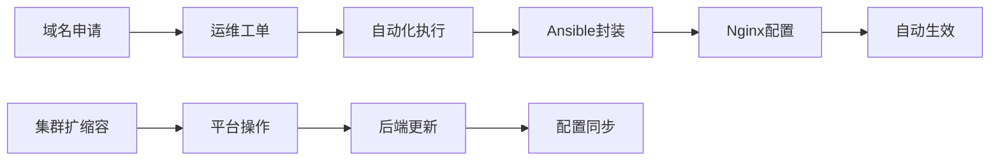

**特点:**

- 从申请到生效全自动化
- 基于Ansible封装
- 无需手动登录机器
- 支持业务自助查询

**业务可见:**

- 查看自己的所有域名
- 查看集群信息
- 根据端口反查域名
- 无权限修改,仅查询

#### 4. Nginx配置管理

**功能:**

- 平台化管理Nginx配置
- 自动化配置下发
- 配置变更记录
- 支持回滚操作

#### 5. 日志管理

**解决问题:**

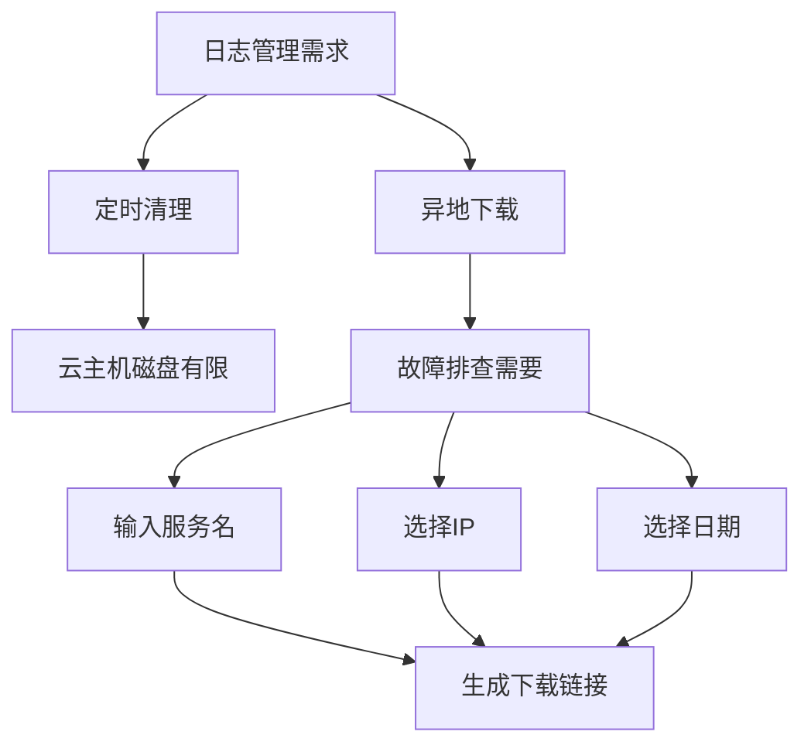

**功能特点:**

- 支持异地日志下载
- 按服务名、IP、日期查询
- 生成HTTP下载链接
- 满足审计要求

**审计要求:**

- 所有变更操作必须有记录
- 域名修改可追溯
- 支持一键回滚
- 操作历史完整保存

#### 6. CDN管理

**功能:**

- 统一管理多家CDN
- 一站式刷新操作
- 无需登录各个平台
- 限制刷新次数 (防止滥用)

#### 7. 域名管理

**特点:**

- 管理多云厂商域名
- 集成内部DNS系统
- 统一入口管理
- 避免频繁切换平台

#### 8. DB管理

**功能:**

- 云数据库资源管理
- 白名单管理
- 资源购买
- 主要面向DBA团队

#### 9. 监控平台

**集成方案:**

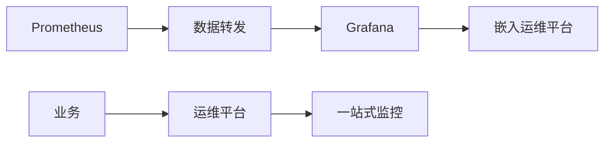

**价值:**

- 业务只需记住运维平台域名
- 一站式访问所有系统
- 降低使用门槛

#### 10. 用户管理与权限

**权限体系:**

- 区分管理员和普通用户
- 模块级权限控制
- 增删改权限细分
- 操作审计日志

### 5.3 运维工单自动化

**当前进展:**

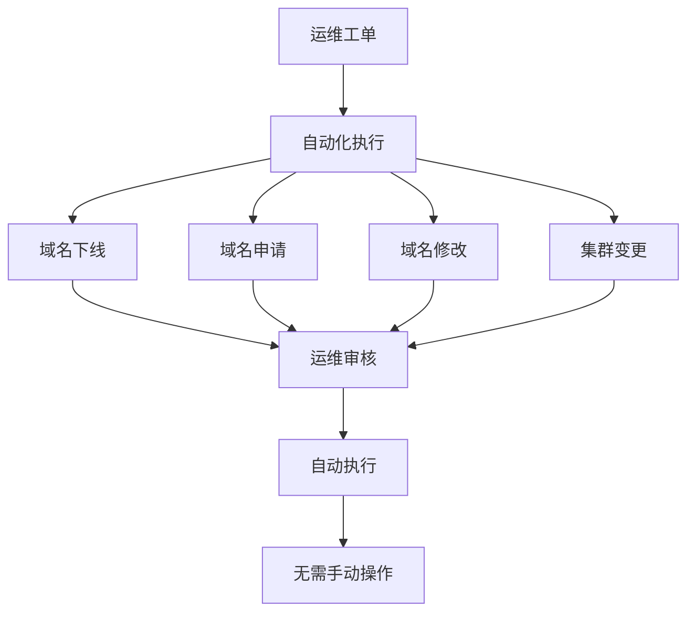

**目标:**

- 工单与平台功能打通
- 运维只需审核
- 自动化执行操作
- 提升效率,减少错误

## 六、持续演进与规划

### 6.1 全链路监控中心

**建设目标:**

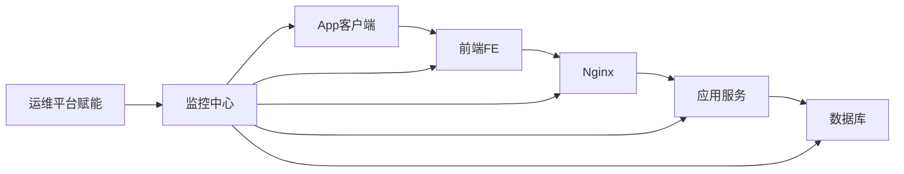

**整合内容:**

- App端监控
- 前端监控
- Nginx监控
- 应用调用链监控
- 数据库监控

**运维平台赋能:**

- 提供资产对应关系
- 提供部门人员信息
- 提供集群域名归属
- 输出接口服务

### 6.2 配置管理中心

**规划方向:**

- 配置变更管理
- 容器化管理
- K8s集成
- 配置版本控制

### 6.3 智能化报表

**目标:**

- 自动生成运营报表
- 成本优化建议
- 资源使用分析
- 趋势预测

### 6.4 容器化

**当前状态:**

- 传统虚拟机模式
- 正在推进容器化
- K8s平台建设

**监控方案:**

- 优先考虑Prometheus
- 避免云厂商按调用次数收费
- 开源方案更可控

## 七、成本优化实践

### 7.1 成本管控策略

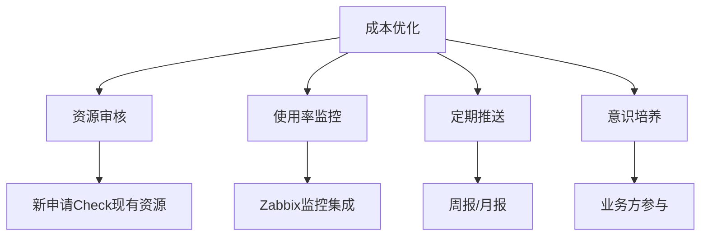

**核心原则:**

1. **申请前审核**

   - 检查现有资源使用率
   - 优先复用空闲资源
   - 新申请需要合理解释
2. **使用率监控**

   - 集成Zabbix监控
   - 近一周/一月数据分析
   - 识别浪费资源
3. **定期推送**

   - 每周/月推送费用报告
   - 部门费用明细
   - 浪费资源提醒
4. **意识培养**

   - 不能只靠运维推动
   - 让业务方有成本意识
   - 知道钱花在哪里

### 7.2 环境优化

**多环境管理:**

- 开发环境
- 测试环境
- 预生产环境
- 生产环境

**优化方向:**

- 非生产环境降配
- 定时启停
- 资源池化
- 按需分配

## 八、安全实践

### 8.1 安全策略

**核心原则:**

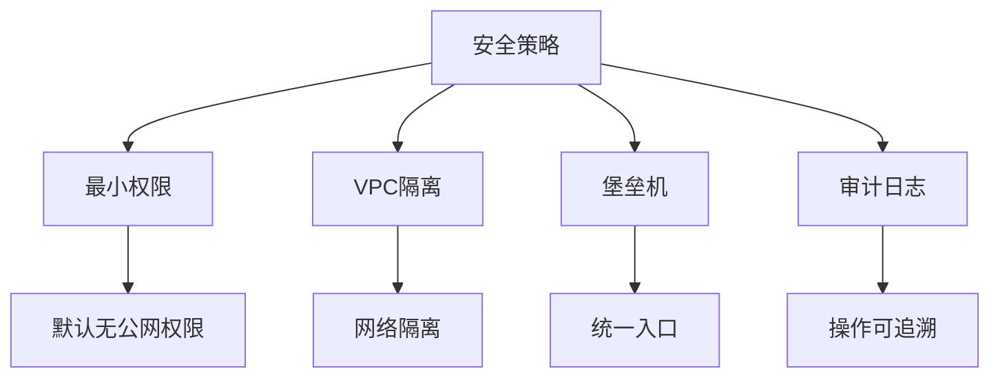

1. **最小权限原则**

   - VPC环境必选
   - 默认无公网权限
   - 按需申请NAT网关
2. **堡垒机管理**

   - 统一登录入口
   - 操作审计
   - 会话录像
   - 满足等保要求
3. **账号分离**

   - Root账号仅运维
   - Work账号给开发
   - 只读账号给查看
4. **审计要求**

   - 所有变更可追溯
   - 操作日志完整
   - 支持回滚
   - 满足上市审计要求

### 8.2 等保合规

**JumpServer优势:**

- 开源免费
- 完全符合等保要求
- 功能完善
- 社区活跃

**建议:**

- 中小型公司优先选择
- 满足等保二级/三级要求
- 降低合规成本

## 九、经验总结与建议

### 9.1 平台建设原则

**核心思想:**

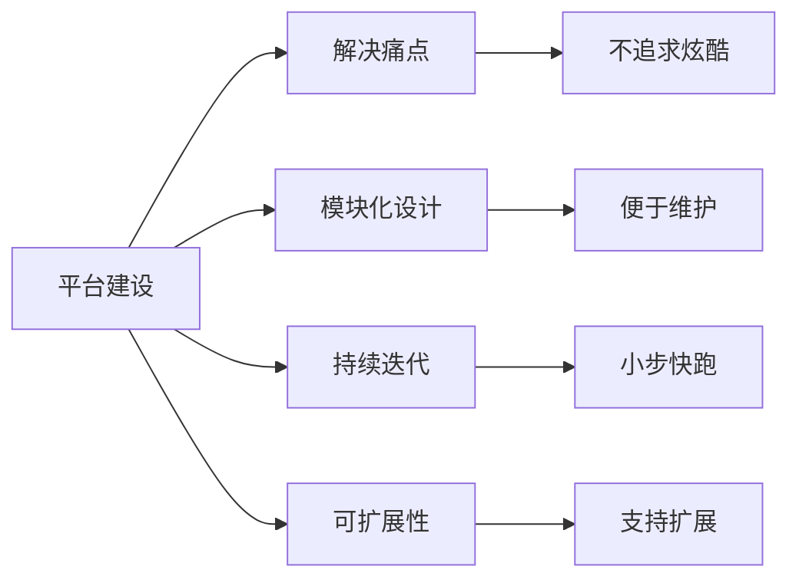

1. **以解决痛点为出发点**

   - 不追求炫酷功能
   - 聚焦实际需求
   - 解决当前问题
2. **模块化设计**

   - 系统模块化
   - 便于扩展
   - 支持小团队迭代
   - 1-2人也能持续开发
3. **持续演进**

   - 从Excel到Web
   - 从简单到复杂
   - 从手动到自动
   - 从被动到主动

### 9.2 团队建设

**人员配置:**

- 2015年: 3人运维支撑150+研发
- 2018年: 增加运维开发
- 当前: 1.5个运维开发

**人才重要性:**

- "21世纪最贵的是人才"
- 关键岗位的人才流失影响大
- 需要合理的人才储备

### 9.3 运维价值观

**改变认知:**

> "学则思,思则变,变则通,通则达"
>
> "运维开发是一家,运维不是背锅侠"

**运维定位:**

- 不是修电脑的
- 不是背锅侠
- 是技术赋能者
- 是效率提升者
- 是成本优化者

### 9.4 多云管理建议

**混合云/多云场景:**

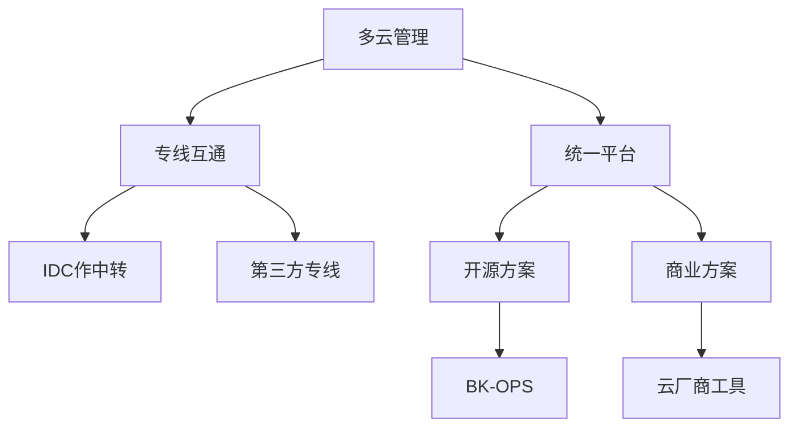

**建议方案:**

1. **网络互通**

   - IDC与云厂商拉专线
   - IDC作为中转节点
   - 第三方专线服务商
   - 避免云间直连
2. **统一管理**

   - 推荐BK-OPS (蓝鲸)
   - 支持多云厂商
   - 开源免费
   - 持续迭代

### 9.5 监控选型

**容器监控:**

- 优先Prometheus
- 避免云厂商按次收费
- 开源方案成本可控

**传统监控:**

- Zabbix成熟稳定
- OpenFalcon轻量级
- 根据场景选择
- 能用一套就不用两套

## 十、Q&A精选

### Q1: 如何打通不同云平台数据?

**A:**

- **网络层**: 通过专线互通,IDC作中转
- **管理层**: 使用BK-OPS等统一平台
- **API层**: 调用各云厂商API统一管理

### Q2: CI/CD如何实现?

**A:**

- 有专门团队负责
- 从立项到上线全流程
- 内部自研平台
- 覆盖测试和生产环境

### Q3: 运维开发有几个人?

**A:**

- 1.5个人 (一个全职+一个兼职)
- 技术团队规模大,运维人员少
- 通过平台化提升效率

### Q4: 容器监控方案?

**A:**

- 计划使用Prometheus
- 云厂商方案前期免费后期收费
- 开源方案更可控

### Q5: 成本优化实践?

**A:**

- 申请前Check现有资源
- 监控使用率
- 定期推送报告
- 培养成本意识
- 业务方和运维共同推动

### Q6: 整合过程最大阻力?

**A:**

- 主要是网络互通问题
- IDC与云专线相对容易
- 云间直连需要第三方
- 技术层面阻力不大

### Q7: 安全与运维如何平衡?

**A:**

- 相辅相成,需要平衡
- 国家安全立法,等保必做
- 涉及用户数据必须重视
- 运维要有安全意识
- 可寻求专业安全公司协助

## 十一、演进时间线总结

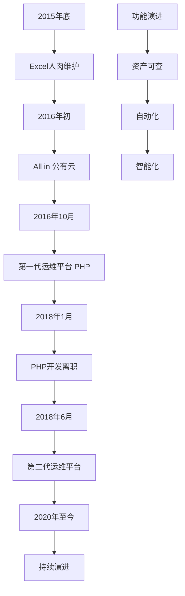

**关键里程碑:**

| 时间       | 事件       | 意义              |
| ---------- | ---------- | ----------------- |
| 2015年底   | Excel维护  | 石器时代          |
| 2016年初   | All in云   | 基础设施现代化    |
| 2016年10月 | 第一代平台 | 从人肉到平台      |
| 2018年6月  | 第二代平台 | 自动化和智能化    |
| 2020年+    | 持续演进   | 全链路监控+容器化 |

## 十二、核心价值与启示

### 12.1 核心价值

1. **效率提升**

   - 从人肉Excel到自动化平台
   - 从被动响应到主动服务
   - 从手动操作到工单自动化
2. **成本优化**

   - 资源使用率可视化
   - 成本归属清晰
   - 避免资源浪费
3. **质量保障**

   - 操作可追溯
   - 变更可回滚
   - 满足审计要求
4. **体验提升**

   - 业务自助查询
   - 一站式服务
   - 降低沟通成本

### 12.2 关键启示

1. **平台建设要循序渐进**

   - 从简单到复杂
   - 解决当前痛点
   - 持续迭代优化
2. **模块化设计很重要**

   - 便于小团队维护
   - 支持灵活扩展
   - 降低技术债务
3. **自动化是方向**

   - 减少人工操作
   - 降低出错概率
   - 提升响应速度
4. **成本意识要培养**

   - 不能只靠运维
   - 业务方共同参与
   - 建立反馈机制
5. **安全合规是底线**

   - 最小权限原则
   - 操作可追溯
   - 满足等保要求

### 12.3 未来展望

**技术方向:**

- 全链路监控
- 容器化和K8s
- 配置管理中心
- AI智能运维

**组织方向:**

- 运维开发一体化
- DevOps文化
- SRE实践
- 平台化赋能

---

**分享总结:**

58到家的运维平台演进之路,展示了从传统IDC到公有云,从人肉运维到平台化、自动化的完整历程。通过持续的技术创新和实践总结,最终构建了一个高效、可靠、易用的运维平台体系,为业务发展提供了有力支撑。

这个案例对于正在进行云化转型和运维平台建设的团队,具有很高的参考价值。

**核心经验:**

- 以解决实际问题为导向
- 模块化设计支持小团队迭代
- 自动化是提升效率的关键
- 成本优化需要全员参与
- 安全合规是不可妥协的底线
