# DevOps在农行合规平台的落地与实战

> 来源：未核验 · 类型：分享 · 状态：draft

## 目录

- [一、农行DevOps研发体系简介](#一农行devops研发体系简介)
- [二、管控平台DevOps实践](#二管控平台devops实践)
- [三、DevOps带来的成效](#三devops带来的成效)
- [四、DevOps未来展望](#四devops未来展望)
- [五、Q&amp;A精选](#五qa精选)

---

## 一、农行DevOps研发体系简介

### 1.1 体系建设背景

中国农业银行紧跟研发管理最新发展趋势，持续引入国际先进、同业认可度高的标准体系：

- **CMMI**：塑形研发过程
- **TMI**：精益测试管理
- **ITIL**：引导运维
- **DevOps**：促进革新

建立了以**DevOps为基础的一体化研发闭环管理体系**。

### 1.2 一体化研发体系架构

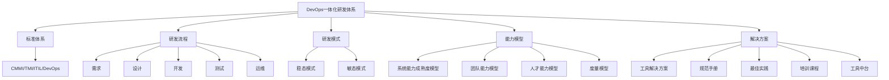

**五大赋能条件：**

1. **流程驱动**：标准化研发流程
2. **工具贯通**：全链路工具集成
3. **数据可视**：度量指标透明化
4. **规范建设**：最佳实践沉淀
5. **文化建设**：DevOps理念推广

### 1.3 稳态与敏态双模式

**稳态模式：**

- 需求明确
- 业务稳定
- 传统瀑布流程

**敏态模式：**

- 需求创新
- 响应市场
- 快速迭代交付

---

## 二、管控平台DevOps实践

### 2.1 业务背景与目标

**管控平台特点：**

- 业务需求非常活跃
- 对持续交付能力要求高
- 需要快速响应市场变化

**核心目标：**

> 实现从需求受理到版本发布的**一站式、可回溯、自动化**处理，达到**发布由业务人员决定，不受IT交付团队限制**的持续交付能力。

### 2.2 DevOps实施全景图

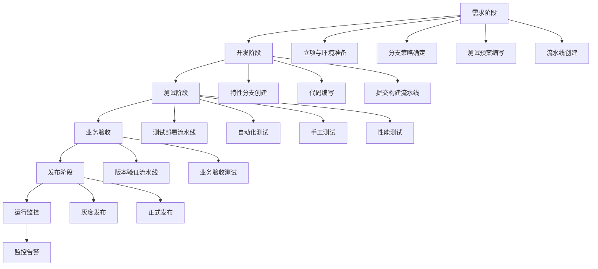

### 2.3 核心实践一：构建敏捷团队

#### 2.3.1 团队组成

**团队结构（17人）：**

| 角色     | 人数 | 职责     |
| -------- | ---- | -------- |
| 项目经理 | 1    | 整体协调 |
| 开发人员 | 9    | 代码开发 |
| 产品经理 | 2    | 需求管理 |
| 测试经理 | 1    | 测试管理 |
| 测试人员 | 3    | 质量保障 |

**效能团队：**

- 项目管理员：1人
- 配置管理员：1人

#### 2.3.2 团队能力成熟度模型

**团队治理维度：**

- 跨职能团队稳定
- 应用团队减少并发
- 迭代关键活动合理
- 容量测试前移
- 风险管理
- 知识沉淀共享

**需求分析维度：**

- 明确愿景目标
- 用户研究
- 产品规划与迭代列表
- 优先级决策
- 用户故事拆分
- 尽早演示
- 小版本交付

#### 2.3.3 关键实践

**1. 业技融合**

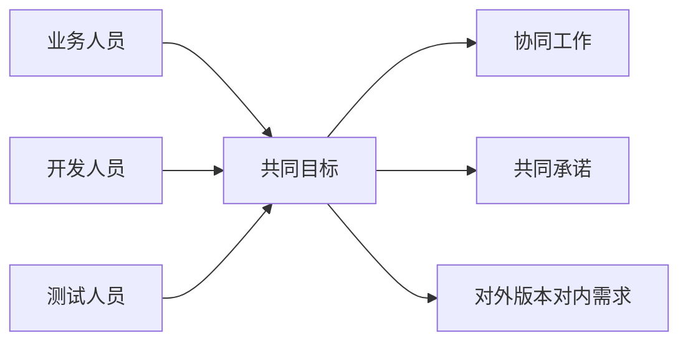

**核心理念：**

- 建立共识，协同工作
- 对外承诺版本，对内呈现需求
- 小批量交付，加速价值流动
- 低成本拥抱变化
- 快速反馈，鼓舞团队士气

**2. 快速迭代**

- **一周一迭代**
- 迭代末进行投产
- 采用电子看板进行任务跟踪

### 2.4 核心实践二：改进配置管理

#### 2.4.1 改进前的问题

**代码管理问题：**

- 代码管理策略不统一
- 分支创建策略不统一
- 持续集成难以落地
- 多版本长期并行开发，合并冲突代价大

**配置管理问题：**

- 数据库变更脚本、测试脚本分散各处
- 各环境依赖配置不统一
- 本地研发环境管理混乱
- 无法实现统一安装

#### 2.4.2 改进方案

**1. 代码管理规范化**

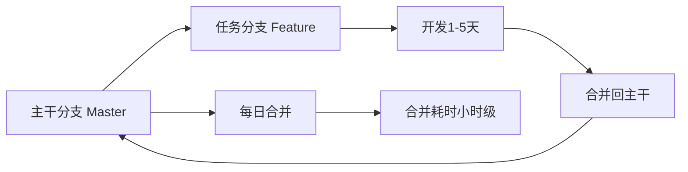

**分支策略特点：**

- 定制适合项目的分支策略
- 每天均有代码向主干分支合并
- 任务分支生命周期：1-5天
- 合并耗时：小时级

**2. 配置管理规范化**

**一切纳入配置管理：**

- 源代码
- 配置文件
- 构建和部署脚本
- 数据库变更脚本
- 测试脚本
- 测试案例

**统一依赖管理：**

- 统一使用制品库管理依赖
- 环境配置文件与应用程序分离
- 本地研发环境一键安装
- 从源头统一研发环境

### 2.5 核心实践三：优化变更过程

#### 2.5.1 优化前的问题

- 代码提交无统一规范
- 代码无法追溯到投产制品、测试报告
- 配置文件、数据库脚本变更后无法追溯
- 源代码变更仅按需进行人工评审
- 未进行代码合规检查、单元测试、安全扫描等自动化质量检查

#### 2.5.2 优化后的效果

**全流程双向可追溯：**

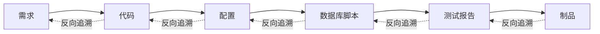

**自动化质量检查：**

- 线上人工评审
- 核心代码双人复核
- 代码合规检查
- 单元测试
- 安全扫描

**工具链贯通：**

- 管理链
- 工具链
- 测试链
- 运维链

### 2.6 核心实践四：建立完善的流水线体系

#### 2.6.1 流水线架构

**四大流水线类型：**

1. 提交构建流水线
2. 持续集成流水线
3. 测试部署流水线
4. 预发布流水线

#### 2.6.2 提交构建流水线

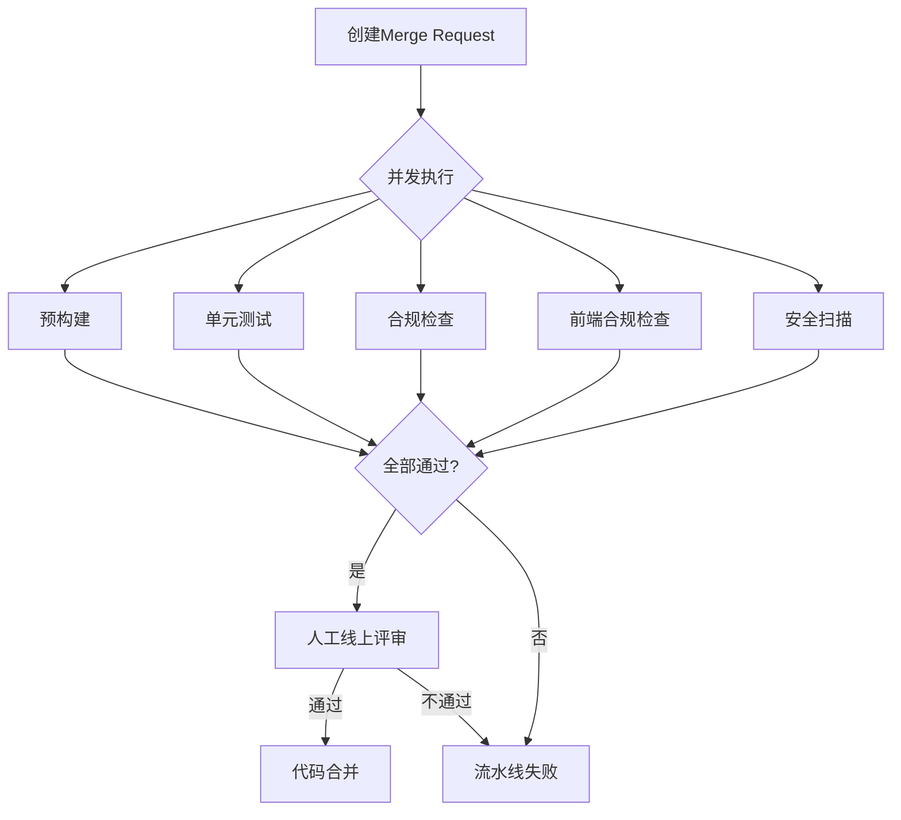

**质量门禁（并发执行）：**

- 预构建
- 单元测试
- 合规检查
- 前端合规检查
- 安全扫描

#### 2.6.3 持续集成流水线

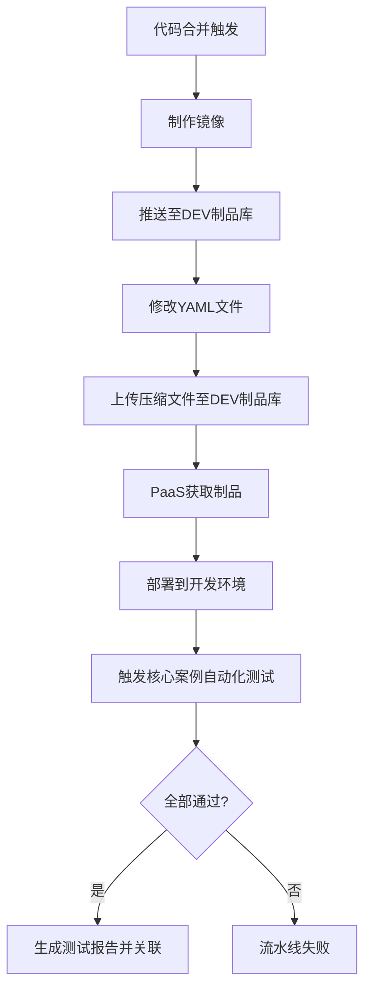

**核心步骤：**

1. 镜像制作
2. 制品推送（DEV）
3. YAML文件更新
4. 制品上传
5. PaaS部署
6. 自动化回归测试
7. 测试报告关联

#### 2.6.4 测试部署流水线

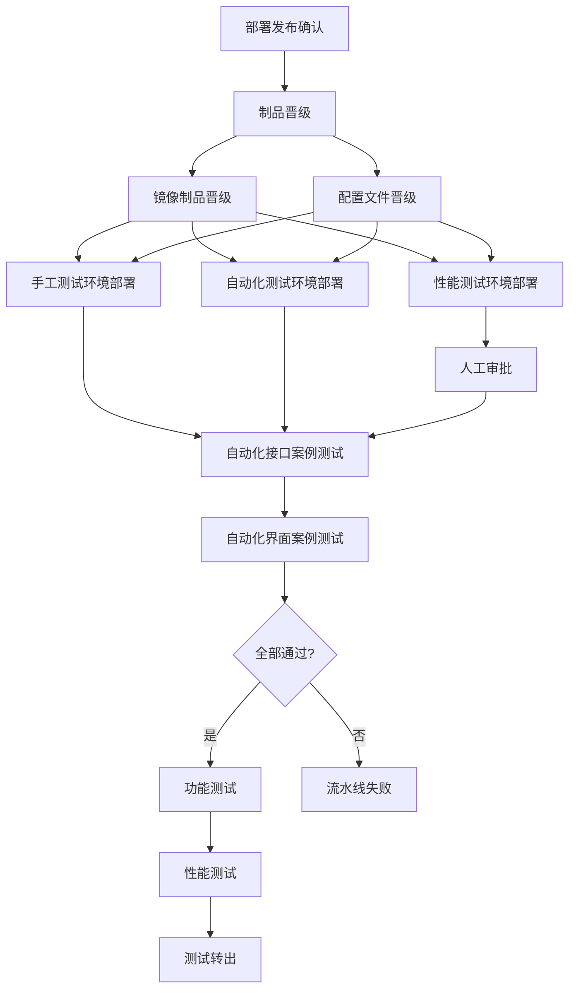

**关键特性：**

- 制品晋级到TEST环境
- 三环境并行部署（手工、自动化、性能）
- 性能测试环境需人工审批（避免打断进行中的测试）
- 全量自动化测试（接口+界面）

#### 2.6.5 预发布流水线

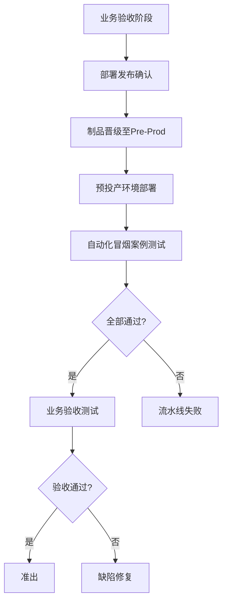

### 2.7 核心实践五：数据变更流水线

#### 2.7.1 数据变更全流程

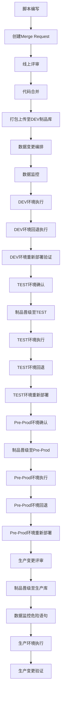

**核心特性：**

- 全流程自动化测试与部署
- 支持数据监控、回滚、验证
- 各环境正反向自动化执行
- 生产执行前二次数据监控（检测危险语句）

### 2.8 核心实践六：全类型覆盖的测试策略

#### 2.8.1 测试体系架构

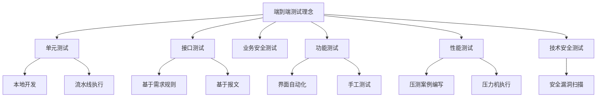

**测试类型详解：**

| 测试类型     | 工具/平台         | 执行方式              | 管理方式    |
| ------------ | ----------------- | --------------------- | ----------- |
| 单元测试     | Maven + JUnit     | 本地执行 + 流水线触发 | TFS版本管理 |
| 接口测试     | 自动化测试平台    | 流水线调起            | TFS案例管理 |
| 业务安全测试 | 手工              | 人工执行              | TFS缺陷跟踪 |
| 功能测试     | 自动化平台 + 手工 | 界面自动化 + 人工     | TFS用例管理 |
| 性能测试     | 压力测试工具      | 压力机执行            | TFS缺陷管理 |
| 技术安全测试 | 安全扫描工具      | 系统扫描              | 漏洞管理    |

#### 2.8.2 自动化测试策略

**自动化测试覆盖：**

- **单元测试覆盖率**：87%
- **测试自动化率**：80%
- **自动化测试通过率**：100%

### 2.9 核心实践七：制定规范的发布策略

#### 2.9.1 版本火车发布模式

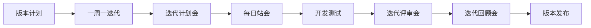

**发布节奏：**

- **迭代周期**：1周
- **投产频率**：每周一次（每月4次）
- **发布方式**：灰度发布

#### 2.9.2 灰度发布机制

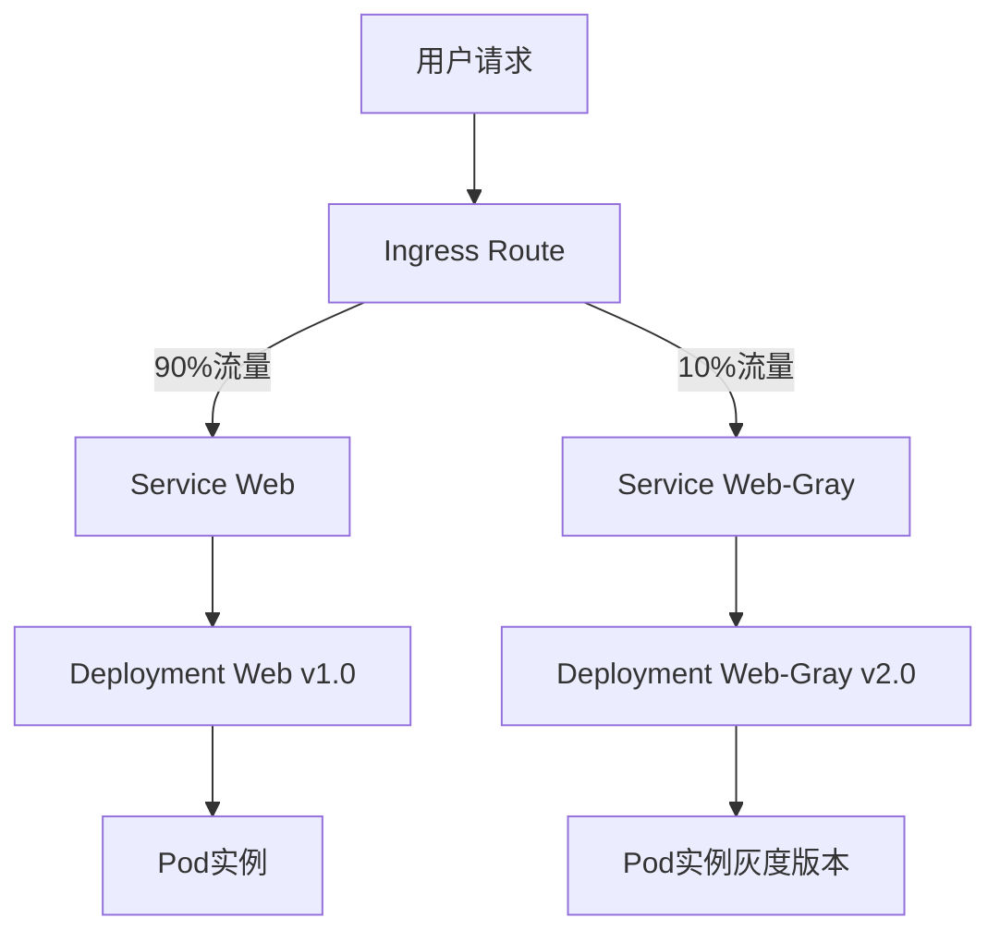

**灰度策略：**

- 利用Route分流机制
- 将流量导入不同版本Service
- 有状态依赖变更（数据库、Redis等）采用向下兼容设计
- 支持新旧两个版本同时运行

#### 2.9.3 发布流程

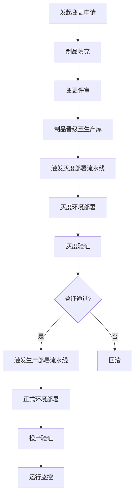

### 2.10 核心实践八：可视化度量驱动改进

#### 2.10.1 度量体系架构

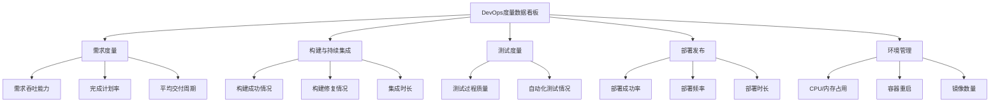

#### 2.10.2 关键度量指标

**需求度量：**

- 需求吞吐量
- 完成计划率
- 平均交付周期
- 开发交付周期
- 测试交付周期
- 开发时间占比

**构建与持续集成：**

- 构建成功次数
- 构建成功率
- 每日合并处理效率
- 构建修复时长
- 每天构建成功修复时长
- 构建集成时长

**测试度量：**

- 测试用例执行力
- 测试用例执行通过率
- 平均测试用例缺陷发现数
- 测试自动化率
- 自动化测试投入分布

**部署发布：**

- 部署成功率
- 部署频率
- 部署时长

**环境管理：**

- CPU/内存占用
- 容器重启次数
- 镜像数量监控

---

## 三、DevOps带来的成效

### 3.1 研发效能显著提升

**核心指标对比：**

| 指标          | 实施前     | 实施后              | 提升幅度        |
| ------------- | ---------- | ------------------- | --------------- |
| 需求交付周期  | 几个月     | 7天                 | **95%+**  |
| 问题修复时长  | 1-3天      | 0.5小时以内         | **95%+**  |
| 构建时长      | 30分钟     | 5分钟               | **83%**   |
| 千行代码Bug率 | 0.8        | 0.02                | **97.5%** |
| 投产频率      | 几个月一次 | 每周一次（每月4次） | **10倍+** |

**质量指标达成：**

- **单元测试覆盖率**：87%
- **测试自动化率**：80%
- **自动化测试通过率**：100%
- **变更成功率**：100%

### 3.2 团队协作能力提升

#### 3.2.1 思想理念转变

**从：** 开发为主，各自为战
**到：** 业务+开发+测试全员参与

**从：** 个人负责
**到：** 团队自治，责任共担

**从：** 面向任务
**到：** 面向交付

#### 3.2.2 需求交付模式转变

**从：** 契约形式
**到：** 协同工作

**具体变化：**

- 业务人员参与开发测试全过程
- 与技术团队有效沟通
- 从单向交付到双向协作

#### 3.2.3 工作方式转变

**实现三个统一：**

1. **目标统一**

   - 一起对迭代目标负责
2. **过程统一**

   - 一起参加项目会议
3. **执行统一**

   - 一起进行需求条目拆分

---

## 四、DevOps未来展望

### 4.1 向两端延伸

**核心目标：**

- 进一步向两端延伸至业务与运营环节
- 深化全职能团队建设
- 业技融合，研策一体
- 全链条密切协作

### 4.2 持续提升

**两大方向：**

1. **提升DevOps工程效率平台服务化水平**

   - 平台化能力增强
   - 服务化程度提高
   - 用户体验优化
2. **提升技术运营能力**

   - 支撑多模式自动化部署
   - 高质量部署保障
   - 运营效率优化

### 4.3 人工智能驱动

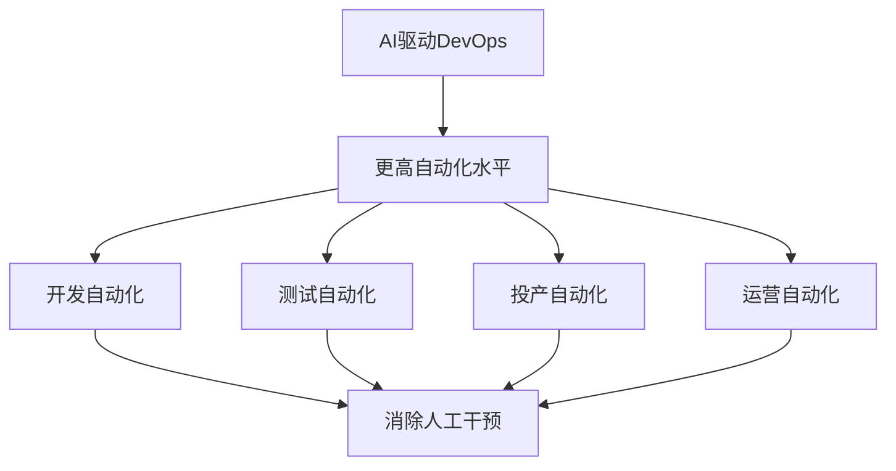

**目标愿景：**

- 消除或降低从开发到投产运营过程中的人工干预程度
- 实现更高程度的自动化
- 智能化决策与执行

### 4.4 安全与敏捷并重

**DevSecOps理念：**

- 进一步将安全性集成到DevOps流程中
- 团队持续监控和修复安全问题
- 提高整体交付质量和速度
- 安全左移，早发现早修复

---

## 五、Q&A精选

### Q1：数据变更流水线用的是什么工具？

**A：** 农行自研的数据变更流水线工具，结合TFS（Team Foundation Server）使用。

---

### Q2：落地DevOps需要具备哪些前置条件？

**A：** 主要包括：

1. **搭建敏捷团队**

   - 跨职能团队组建
   - 角色明确分工
2. **建立DevOps文化**

   - 形成共识
   - 共同目标
   - 协作理念
3. **形成合力推动**

   - 按照DevOps要求推动实施
   - 在推动过程中发现价值
   - 通过效果提升持续改进
4. **工具支撑**

   - 选择合适的工具链
   - 工具集成与贯通

---

### Q3：有哪些DevOps开源工具可以推荐？

**A：** 开源工具非常多，推荐原则：

- 符合DevOps标准
- 能够达到预期效果
- 适合团队实际情况

常见工具类别：

- 版本控制：Git、GitLab
- CI/CD：Jenkins、GitLab CI
- 容器化：Docker、Kubernetes
- 配置管理：Ansible、Terraform
- 监控：Prometheus、Grafana

---

### Q4：怎么解决自动化带来的高成本问题？

**A：** 成本与收益成正比：

**前期投入：**

- 自动化用例开发成本较高
- 工具平台建设成本

**长期收益：**

- 案例积累到一定数量后，新用例开发成本降低
- 回归测试节省大量人力
- 测试效率显著提升
- 质量稳定性提高

**建议策略：**

- 优先覆盖核心业务场景
- 从高频回归场景开始
- 持续积累，循序渐进

---

### Q5：配置管理规范化过程的困难和挑战怎么克服？

**A：** 主要困难与解决方案：

**困难1：分支策略不统一**

- 解决：参考业界最佳实践（如GitFlow、GitHub Flow）
- 根据项目特点定制适合的分支策略
- 管控平台采用版本火车模式，选择支持持续集成的策略

**困难2：配置分散管理**

- 解决：一切纳入配置管理
- 统一版本管理
- 避免配置散落各处

**困难3：环境不一致**

- 解决：本地研发环境一键安装
- 从源头统一开发环境
- 配置文件与应用分离

---

### Q6：介绍一下TFS和流程流转，从开发、测试到生产的控制系统是什么？

**A：** 不是单一系统控制，而是流水线串联：

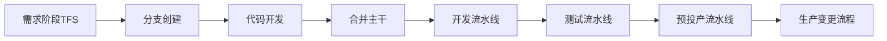

**关键点：**

- TFS用于需求、用例、缺陷管理
- 流水线工具实现自动化编排
- 通过流水线串联整个流程
- 不依赖单一控制系统

---

### Q7：脚本、测试用例、代码、配置使用什么工具统一管理？

**A：**

- **主要工具**：TFS（Team Foundation Server）
- **其他可选**：Git、GitLab、SVN等版本管理工具
- **关键**：统一纳入版本管理，实现可追溯

---

### Q8：整个项目团队中是否有IT运维人员参与？

**A：**

- **投产环节**：运维人员参与
- **生产变更流水线**：由运维人员触发执行
- **转型情况**：IT运维人员转型到项目团队的情况目前还比较少

**农行DevOps覆盖情况：**

- 覆盖范围很广
- 很多系统都在使用

---

### Q9：界面接口自动化测试针对系统是如何实现？

**A：**

**接口自动化测试：**

- 后端系统都会提供接口
- 开发自动化测试用例
- 在自动化测试平台上调起执行
- 各系统实现方式相同

**界面自动化测试：**

- 通过界面录制实现
- 形成界面自动化脚本和案例
- 由自动化平台回放录制的界面
- 相当于自动化的测试过程

---

### Q10：DevOps成功落地可以从哪些方面评估？

**A：**

- 业界有专业评估机构可进行测评
- 关键指标包括：
  - 交付周期
  - 部署频率
  - 变更失败率
  - 平均修复时间（MTTR）
  - 自动化覆盖率
  - 团队协作效率

---

### Q11：智能化故障修复如何实现？

**A：** 主要通过两方面：

**1. 精准通知**

- 故障及时通知到触发人
- 缩短问题发现时间

**2. 快速修复**

- 一周一迭代的短周期
- 大部分问题在几分钟内解决
- 都是简单小问题，快速响应

---

### Q12：灰度控制使用什么工具？

**A：** 类似Istio的商用版本，基于Kubernetes的Service Mesh流量控制能力。

---

### Q13：漏洞扫描如何审查？

**A：**

- **渗透测试**：模拟攻击测试
- **安全漏洞扫描**：使用成熟的安全扫描工具
- **源代码扫描**：静态代码安全分析
- **方法多样**：结合多种工具和手段

---

### Q14：哪些类型系统适合DevOps？

**A：**

- **业务需求活跃**的系统
- 需要**快速交付**的系统
- 需要**持续迭代**的产品
- **市场响应速度**要求高的系统

**特别适合：**

- 互联网类应用
- 敏捷业务系统
- 创新型产品

---

### Q15：可视化监控是通过什么方式实现？

**A：**

1. **定义监控指标**

   - 根据业务需求定义关键指标
2. **数据收集**

   - 从各环节收集指标数据
3. **可视化展示**

   - 通过看板展示
   - 实时更新
   - 趋势分析

---

### Q16：故障的更新和定位如何处理？

**A：**

- **不是通过DevOps解决**
- 根据故障本身情况定位
- 可能是系统问题
- 可能是人为问题
- **前提**：精准通知到故障触发人
- 大多数问题很简单，几分钟内可解决

---

## 六、关键成功要素总结

### 6.1 文化先行

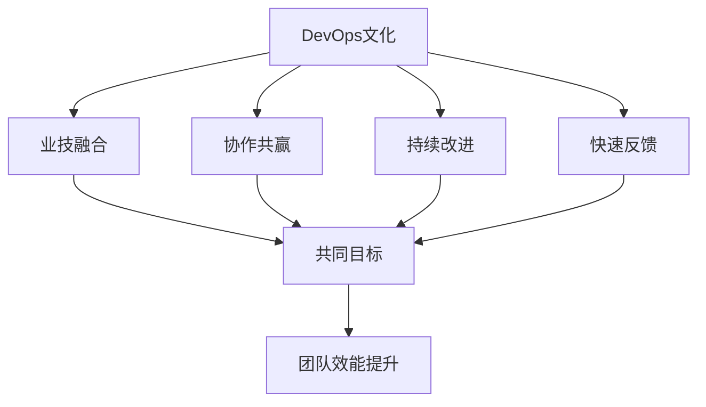

### 6.2 流程规范

- 标准化研发流程
- 配置管理规范
- 分支策略清晰
- 变更流程可追溯

### 6.3 工具赋能

- 工具链贯通
- 自动化流水线
- 可视化度量
- 平台化能力

### 6.4 持续优化

- 数据驱动改进
- 反馈循环机制
- 知识沉淀共享
- 最佳实践推广

---

## 七、附录

### 7.1 关键术语表

| 术语   | 英文                                       | 解释               |
| ------ | ------------------------------------------ | ------------------ |
| DevOps | Development and Operations                 | 开发与运维一体化   |
| CI/CD  | Continuous Integration/Continuous Delivery | 持续集成/持续交付  |
| CMMI   | Capability Maturity Model Integration      | 能力成熟度模型集成 |
| TMI    | Test Maturity Model integration            | 测试成熟度模型集成 |
| ITIL   | IT Infrastructure Library                  | IT基础架构库       |
| TFS    | Team Foundation Server                     | 团队基础服务器     |
| PaaS   | Platform as a Service                      | 平台即服务         |
| YAML   | YAML Ain't Markup Language                 | 配置文件格式       |

### 7.2 流水线模板参考

**提交构建流水线关键阶段：**

1. 创建Merge Request
2. 并发质量门禁检查
3. 人工评审
4. 代码合并

**持续集成流水线关键阶段：**

1. 构建镜像
2. 制品管理
3. 环境部署
4. 自动化测试

**测试部署流水线关键阶段：**

1. 制品晋级
2. 多环境部署
3. 全量自动化测试
4. 手工测试
5. 性能测试

**预发布流水线关键阶段：**

1. 业务验收环境部署
2. 冒烟测试
3. 业务验收
4. 准出评审

---

## 八、总结

### 8.1 核心价值

**对业务：**

- 交付周期从几个月缩短到7天
- 发布频率从几个月一次到每周一次
- 业务需求快速响应

**对质量：**

- 千行代码Bug率从0.8降到0.02
- 自动化测试通过率100%
- 变更成功率100%

**对团队：**

- 协作效率显著提升
- 责任共担，目标统一
- 知识沉淀与传承

### 8.2 关键启示

1. **文化比工具更重要**

   - 建立共识是前提
   - 协作文化是基础
2. **规范先行**

   - 配置管理规范化
   - 流程标准化
   - 可追溯性保障
3. **自动化是核心**

   - 全流程自动化
   - 质量内建
   - 持续反馈
4. **度量驱动改进**

   - 可视化度量
   - 数据说话
   - 持续优化
5. **循序渐进**

   - 不求一步到位
   - 持续迭代改进
   - 价值驱动演进

---

> **文档说明**
> 本文档根据中国农业银行DevOps实践分享整理而成，展示了从需求到发布的完整DevOps落地实践。
> 核心亮点：一周一迭代、87%单元测试覆盖率、80%自动化测试率、需求交付周期缩短至7天。
> 适用对象：SRE工程师、运维工程师、DevOps实践者、技术管理者

