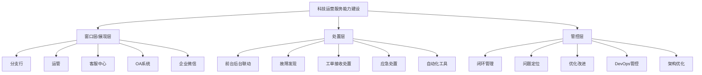
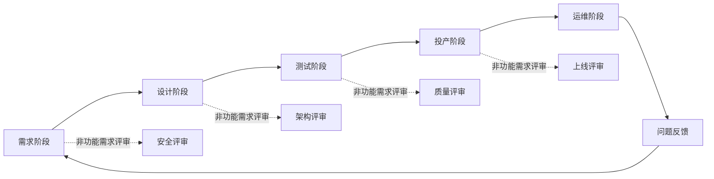
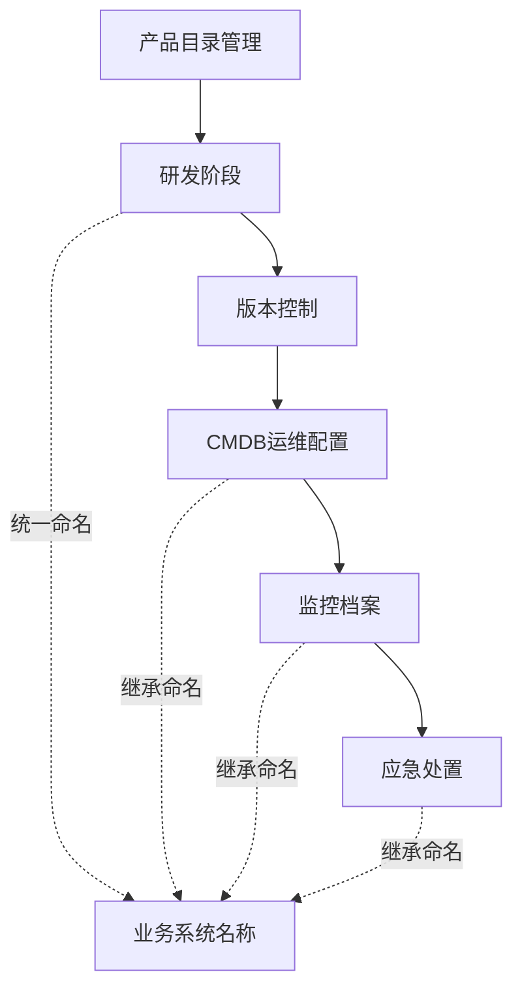
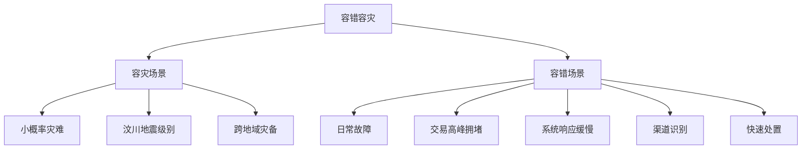
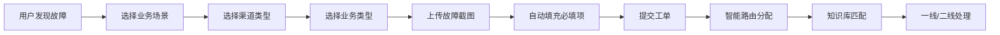
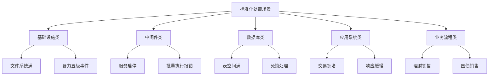
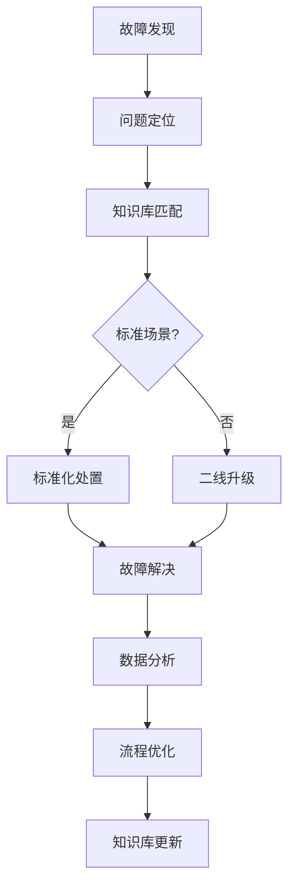
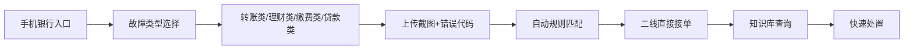
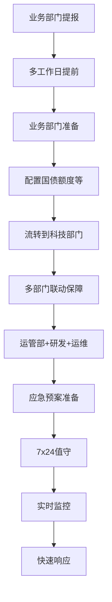
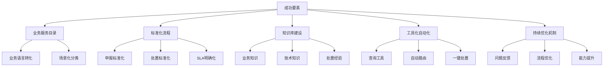

# 银行基于DevOps的科技服务管理实践

> 来源：未核验 · 类型：分享 · 状态：draft · 原始线索：分享人 张海辉|某城商行数据中心

> 分享人：张海辉 | 某城商行数据中心
> 
> 受众：SRE、运维及稳定性保障工程师

## 目录

- [一、背景与挑战](#一背景与挑战)
- [二、科技运营服务能力建设](#二科技运营服务能力建设)
- [三、研发运维一体化管理](#三研发运维一体化管理)
- [四、业务服务目录体系建设](#四业务服务目录体系建设)
- [五、标准化故障处置场景](#五标准化故障处置场景)
- [六、实践案例](#六实践案例)
- [七、总结与答疑](#七总结与答疑)

---

## 一、背景与挑战

### 1.1 核心问题

在银行科技运营过程中，面临以下五大核心痛点：

#### 1. 业务咨询渠道缺失
- **问题描述**：业务类别不明确，缺少业务服务目录
- **现状**：科技服务更多通过电话、找熟人等非正式渠道报障
- **痛点**：原有ITIL服务目录偏向IT部门内部，业务部门无法识别
- **目标**：建立业务人员能够识别和理解的业务服务目录

#### 2. 工单跟踪不透明
- **问题描述**：无法在线持续跟踪工单进度
- **现状**：通过微信工作群或电话查询工单处理进度
- **解决方案**：通过ITIL服务管理和故障管理流程实现工单全生命周期可视化

#### 3. 前后台知识断层
- **问题描述**：知识库建设偏技术化，业务人员难以使用
- **现状**：技术知识库适合IT人员，但业务一线需要业务场景化的知识库
- **案例**：疫情期间岗位轮动，人员输错机构号导致报错，这类简单问题应该通过知识库自助解决

#### 4. 联动保障机制缺失
- **问题描述**：缺少科技与运营的联动保障机制
- **场景**：工资代发代扣、社保代扣、存单票据等周期性重保业务
- **需求**：建立科技与业务部门联合保障机制，应对突发生产事件

#### 5. 数据分析能力不足
- **问题描述**：运维数据无法有效支撑决策
- **场景**：双十一等重要保障节点的数据分析需求
- **内容**：渠道交易量、交易额、成功率、并发数等多维度分析

---

## 二、科技运营服务能力建设

### 2.1 三层架构体系

#### 窗口层（展现层）
- **服务下沉**：将科技服务下沉到分支行、运管、客服中心
- **线上化渠道**：
  - OA系统
  - 企业微信
  - 报障平台
- **标准化流程**：针对标准化故障场景建立处置流程
  - 示例：周三理财销售交易拥堵的系统切换、服务启停

#### 处置层
- **前后台联动**：一线服务台与二线技术支持的协同
- **核心能力**：
  - 故障发现
  - 工单接收处置
  - 应急响应
  - 自动化工具集成
- **目标**：实现一键处置，快速响应

#### 管控层
- **闭环管理**：从发现问题到定位问题再到优化改进
- **DevOps全流程管控**：
  - 需求阶段
  - 设计阶段
  - 测试阶段
  - 投产阶段
- **关键能力**：
  - 风险控制
  - 架构优化
  - 平台管控

### 2.2 平台建设目标

#### 1. 系统稳定运行保障
- 确保核心业务系统高可用
- 实现贴身保障服务

#### 2. 主动运维能力
- 业务知识库建立（类似淘宝、京东的智能化匹配服务）
- 按业务场景提供点击式服务
- 场景示例：
  - 手机银行理财购买问题 → 前台风险评估
  - 微信银行缴费问题 → 区分自身平台还是第三方平台问题
  - 错误代码自动识别与推导

#### 3. VIP客户专属服务
- 分支行大额业务绿色通道
- 提前识别和支持紧急业务需求
- 减少被动应急，提前做好保障准备

#### 4. 周期性业务保障
- 代发代扣保障
- 电子渠道国际业务保障
- 建立专人专岗应急预案

#### 5. 持续体系建设
- 问题导向的持续改进
- 区分问题类型：
  - Bug
  - 系统架构设计问题
  - 监控覆盖问题
  - 安全措施问题
- 不断提升科技服务能力

---

## 三、研发运维一体化管理

### 3.1 DevOps核心理念

**研发运维一体化的本质**：在研发各阶段对非功能需求进行管控，在投产上线前解决问题，而非上线后修复。

### 3.2 非功能需求管控

#### 需求阶段关注点
- 安全性需求
- 性能指标要求
- 可用性目标定义

#### 设计阶段关注点
- **技术架构设计**
- **数据库设计规范**
  - 字符集统一（开发环境与生产环境一致）
  - 连接方式选择（长连接 vs 短连接）
- **中间件选型**
- **日志标准化**
  - 统一日志格式
  - 便于后续监控和分析
- **监控指标设计**
  - 基础监控
  - 个性化监控
- **四A权限管控**
  - 超级管理员权限（root）
  - 应用管理员权限
  - 查询权限（query）

#### 测试阶段关注点
- 功能测试
- 性能测试
- 安全测试（漏洞扫描）
- 兼容性测试

#### 投产阶段关注点
- **投产评审**：
  - 系统漏洞扫描
  - 四A管控确认
  - 监控部署验证
  - 日志标准化检查
  - 自动化工具集成
  - 多节点部署一致性
- **变更管理**：投产变更控制与评估
- **上线管控**：投产包版本控制

### 3.3 配置管理（CMDB）

#### 配置基线建立
- **产品服务目录**：研发阶段建立产品目录
- **统一命名规范**：
  - 研发、运维、数据中心统一业务系统名称
  - 避免不同部门叫法不一致
- **配置项集成**：
  - 研发产品目录 → 运维CMDB → 监控系统 → 应急平台
  - 实现全流程配置信息一致性

### 3.4 可用性管理

#### 可用性目标定义
- **服务时间**：
  - 5×8（工作日8小时）
  - 7×8（全周8小时）
  - 7×24（全天候）
- **可用性等级**：
  - 三个九（99.9%）
  - 四个九（99.99%）

#### 监控策略分层

**标准监控**：
- 操作系统层
- 数据库层
- 中间件层

**个性化监控**：
- 与研发、业务部门确定关键指标
- 示例：ESB-0001错误的严重等级定义
- 持续优化监控阈值

#### 容错容灾场景

**容灾**：针对大规模灾难（如地震）的跨地域备份与恢复

**容错**：日常故障快速处理
- 示例场景：双十一促销活动交易量突增导致拥堵
- 处置方式：渠道识别 → 影响范围分析 → 快速处置（切换、扩容）

---

## 四、业务服务目录体系建设

### 4.1 ITIL服务目录转化

**核心思路**：将IT语言转化为业务语言

#### 传统IT服务目录
- 系统故障
- 网络故障
- 数据库问题

#### 业务服务目录
- **按渠道分类**：
  - 手机银行
  - 网上银行
  - 微信银行
  - 电商渠道
- **按业务类型分类**：
  - 转账业务
  - 理财业务
  - 缴费业务
  - 贷款业务

### 4.2 故障申报优化

#### 申报流程改进

#### 信息收集标准化
- **必填项设计**：根据故障类型动态生成
- **示例**：手机银行转账问题必填项
  - 客户姓名
  - 手机号
  - 身份证号
  - 银行卡号
  - 错误代码
  - 故障截图
- **优势**：
  - 减少来回沟通
  - 提高处置效率
  - 降低无效工单比例
  - 减少服务台咨询量

### 4.3 服务级别协议（SLA）

#### SLA要素定义
- **服务时间**：5×8 / 7×8 / 7×24
- **服务级别**：根据事件级别定义
- **解决时限**：
  - 1天解决（一般问题）
  - 3天解决（复杂问题）
  - 5天解决（重大变更）
  - 根据事件级别动态调整
- **服务内容**：明确服务范围和支持方式
- **满意度调查**：服务质量反馈机制

### 4.4 业务服务场景化

#### 线上渠道知识库
- **手机银行场景**：
  - 理财购买失败 → 风险评估指引
  - 转账失败 → 错误代码解析
  - 登录问题 → 常见解决方案

- **微信银行场景**：
  - 水电缴费 → 第三方平台问题识别
  - 错误代码库 → 自动匹配解决方案

- **信贷全流程场景**：
  - 贷款申请状态查询
  - 还款计划维护
  - 放贷进度跟踪

---

## 五、标准化故障处置场景

### 5.1 处置场景体系

目前已梳理**200+标准化处置场景**，覆盖五级、四级事件。

### 5.2 监控与控制（监与控）

#### "监"- 问题发现
- **基础监控**：
  - 操作系统指标
  - 数据库指标
  - 中间件指标
- **业务监控**：
  - 交易量监控
  - 响应时间监控
  - 错误率监控
- **个性化监控**：
  - 业务错误代码（如：ESB-0001）
  - 严重等级定义
  - 阈值持续优化

#### "控"- 问题处置
- **标准化处置流程**
- **自动化工具集成**
- **应急预案执行**
- **一键处置能力**

### 5.3 处置流程

### 5.4 工具化与自动化

#### 业务查询工具化
将后台查询语句封装为前台工具，减少多层流转：

**原流程**：
- 分支行 → 客服中心 → 科技服务台 → 二线 → 研发三线

**优化后**：
- 分支行 → 自助查询工具 / 一线直接处理

#### 典型工具场景
1. **账户状态查询**：
   - 非柜面交易限制查询
   - 睡眠账户识别
   
2. **业务状态查询**：
   - 理财到账查询
   - 医保签约状态
   - 贷款业务状态
   
3. **客户信息查询**：
   - 客户基本信息
   - 身份证号验证

---

## 六、实践案例

### 6.1 信贷全流程数据维护

#### 背景
- 数据修改需符合监管要求
- 需要相关部门审批
- 需要收集完整信息

#### 解决方案
- **场景标准化**：梳理出8大类维护场景
- **必填项定义**：
  - 客户编号
  - 客户名称
  - 联系人
  - 贷款账号
  - 调整原因
- **流程规范化**：减少信息填写差异，避免重复签字

#### 效果
- 降低一线业务满意度问题
- 减轻客户压力
- 提高处理效率

### 6.2 手机银行故障快速处理

#### 原流程问题
- 客户 → 客服中心 → 科技服务台 → 二线/研发
- 多次流转，效率低下

#### 优化方案

#### 核心改进
- **直达二线**：通过规则自动路由到二线工程师
- **信息完整**：客户信息、错误代码、截图一次性收集
- **知识库支持**：历史处置经验自动匹配

### 6.3 VIP客户专属服务

#### 场景
- 大额票据紧急放贷需求
- 时间紧迫（当天必须完成）

#### 原模式问题
- 业务部门着急 → 电话打到行长
- 层层下压任务
- 科技部门被动应急，处置时间短

#### 改进机制
- **提前申报**：分支行提前提交VIP业务需求
- **预案准备**：科技部门提前制定保障方案
- **专人专岗**：安排专门人员负责
- **主动保障**：变被动为主动

### 6.4 周期性业务保障

#### 典型场景
- **工资代发代扣**：每月固定时间
- **社保代扣**：周期性业务
- **理财销售**：每周三
- **国债销售**：不定期高峰

#### 保障流程

### 6.5 双十一保障数据分析

#### 分析维度
- **渠道分析**：
  - 淘宝
  - 支付宝
  - 微信
  - 其他电商平台
  
- **交易分析**：
  - 交易量
  - 交易额
  - 成功率
  - 成功笔数
  - 并发数
  
- **时间分析**：
  - 不同时间段交易趋势
  - 突发时间点识别
  
- **运营决策支持**：
  - 资源配置优化
  - 容量规划
  - 保障机制优化

### 6.6 网点排队优化

#### 问题发现（2019年）
- 非银行网点排队量大
- 客户满意度下降

#### 数据分析
- 不同网点交易量统计
- 叫号机数量分析
- 线下窗口数量
- 人员支持数量
- 自助设备部署情况

#### 优化方案
- 引导客户使用自助设备
- 理财经理、大堂经理分流
- 线上线下业务分流
- 网点资源优化配置

---

## 七、总结与答疑

### 7.1 核心价值体现

#### 1. 服务范围扩大
- 从IT部门内部扩展到业务部门和分支行
- 服务对象从技术人员扩展到业务人员

#### 2. 服务效率提升
- 工单流转层级减少
- 处理时限缩短
- 客户满意度提高

#### 3. 成本优化
- 减少重复沟通成本
- 降低服务台咨询量
- 提高一次性解决率

#### 4. 知识沉淀
- 200+标准化处置场景
- 业务知识库持续积累
- 处置经验自动化

#### 5. 持续改进
- 问题导向的体系优化
- 从源头设计考虑运维需求
- DevOps闭环管理

### 7.2 关键成功要素

### 7.3 Q&A 精选

#### Q1：非标准故障的定位排查怎样做到精准高效？

**回答**：
1. **监控策略分层**：
   - 标准监控：OS、DB、中间件
   - 非标准监控：与研发、业务确定个性化指标
   - 示例：ESB-0001错误的严重等级和阈值定义

2. **持续优化**：
   - 初始设定四级事件
   - 根据实际影响微调阈值
   - 识别真正影响生产的指标

3. **经验积累**：
   - 非标准故障处置后形成标准化手册
   - 对一线、二线进行培训
   - 逐步扩充标准化场景库（当前200+场景）

#### Q2：数据中心运营能力建设重点考虑哪些问题？

**回答**：
1. **业务服务目录**：
   - 类似餐厅菜单概念
   - 让分支行和业务部门知道科技能提供什么服务
   - 服务内容、范围、时间明确

2. **可衡量性**：
   - 服务可监控
   - 服务可绩效管理
   - 满意度调查评估
   - 体现科技服务价值（ITIL理念）

3. **保障场景识别**：
   - 代发代扣等周期性业务
   - 理财销售、国债销售等高峰业务
   - 多部门联动保障机制（科技+运营+业务）

4. **贴近业务实际**：
   - 精准收集客户信息
   - 建立标准化处置流程
   - 前期不断摸索和完善

#### Q3：体系建设是自研还是第三方开发？

**回答**：
- **混合模式**：自研 + 第三方产品
- **自研部分**：
  - 产品目录管理（研发配置版本管理）
  - 各平台间的集成与打通
  
- **关键点**：
  - 平台与平台之间的关联关系
  - 不同模块间的有效连接
  - 业务系统命名统一（研发、运维、数据中心一致）
  - 配置信息继承关系

#### Q4：银行系统大多非分布式微服务，DevOps相对互联网企业有何特点？

**回答**：
- **业务架构分类**：
  - **核心系统**：银行命脉，不采用敏捷开发模式
  - **线上渠道**：手机银行、网银等，适合DevOps快速迭代
  
- **差异化策略**：
  - 核心系统：稳定优先，严格变更管理
  - 线上渠道：敏捷开发，快速响应业务需求
  - 示例：双十一活动支持，线上渠道快速迭代

#### Q5：效率提高和权限安全保障怎样平衡？

**回答**：
- **权限分级**：
  1. **超级管理员（root）**：系统改造、大版本变更
  2. **应用管理员**：投产、升级、二线管控
  3. **查询权限（query）**：一线故障排查和定位
  
- **设计阶段考虑**：
  - 研发设计时就要考虑三级权限
  - 避免只有root用户的情况
  - 符合合规要求

- **问题案例**：
  - 旧系统只有root权限，运维难度大且不合规

#### Q6：系统异常类问题在需求分析阶段有哪些需要考虑？

**回答**：
- **非功能需求评审技术规范**：
  - 字符集统一（研发环境 = 生产环境）
  - 连接方式（长连接 vs 短连接）
  - 表空间扩容方案
  - 多节点部署一致性
  
- **持续改进机制**：
  - 分支行上报问题分析
  - 生产问题前置到设计阶段
  - 形成技术规范和评估标准

---

## 附录

### A. 技术规范体系

#### 需求阶段
- [ ] 安全性需求定义
- [ ] 性能指标定义
- [ ] 可用性目标定义

#### 设计阶段
- [ ] 数据库设计规范（字符集、连接方式）
- [ ] 技术架构设计
- [ ] 中间件选型
- [ ] 日志标准化
- [ ] 监控指标设计
- [ ] 权限体系设计（三级权限）

#### 测试阶段
- [ ] 功能测试
- [ ] 性能测试
- [ ] 安全测试（漏洞扫描）
- [ ] 兼容性测试

#### 投产阶段
- [ ] 系统漏洞扫描
- [ ] 四A管控确认
- [ ] 监控部署验证
- [ ] 日志标准化检查
- [ ] 自动化工具集成
- [ ] 多节点部署一致性验证

### B. 监控指标体系

#### 基础监控
- 操作系统：CPU、内存、磁盘、网络
- 数据库：连接数、事务数、锁等待、表空间
- 中间件：线程池、连接池、队列长度

#### 业务监控
- 交易量、交易额
- 成功率、失败率
- 响应时间
- 并发数

#### 个性化监控
- 业务错误代码
- 关键业务指标
- 渠道可用性

### C. 故障分级标准

| 级别 | 影响范围 | 响应时间 | 解决时限 | 示例 |
|-----|---------|---------|---------|------|
| 一级 | 核心业务中断 | 5分钟 | 1小时 | 核心系统宕机 |
| 二级 | 重要业务受影响 | 15分钟 | 4小时 | 手机银行部分功能不可用 |
| 三级 | 一般业务受影响 | 30分钟 | 1天 | 某分支行网络问题 |
| 四级 | 局部小范围影响 | 1小时 | 3天 | 个别用户体验问题 |
| 五级 | 预警性问题 | 4小时 | 5天 | 磁盘空间使用率80% |

### D. 联系方式

如有交流需求，欢迎添加微信联系。

---

**文档版本**：v1.0  
**整理时间**：2024年  
**文档状态**：已完成

---

*本文档根据张海辉老师在DBA+社群的技术分享整理而成，内容涵盖银行业基于DevOps的科技服务管理实践经验，适合SRE、运维及稳定性保障工程师参考学习。*
