# 云时代下的运维转型及实现路径

> 来源：未核验 · 类型：分享 · 状态：draft


## 目录

- [一、云时代运维面临的挑战](#一云时代运维面临的挑战)
- [二、CSMO：云服务管理与运维新理念](#二csmo云服务管理与运维新理念)
- [三、可观测性能力构建](#三可观测性能力构建)
- [四、AIOps智能运维实践](#四aiops智能运维实践)
- [五、自动化运维体系](#五自动化运维体系)
- [六、IBM解决方案与实践案例](#六ibm解决方案与实践案例)

---

## 一、云时代运维面临的挑战

### 1.1 云时代的核心特征

云时代最明显的特征是**快速**和**敏捷**：

- 开发频率加快
- 变更频率提升
- 上线时间缩短
- 持续迭代要求高

### 1.2 稳态与敏态共存

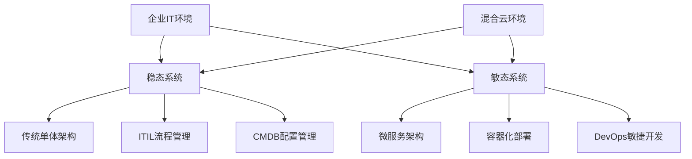

**关键挑战：**

- 并非所有应用都适合上云
- 需要保留传统稳态架构的管理方法
- 同时要兼顾敏态环境下的工具和方法
- 如何在稳态到敏态之间找到平衡点

### 1.3 传统ITIL运维的局限性

**稳态运维特点（基于ITIL）：**

- 完整的流程体系（变更、发布、问题管理）
- 依赖CMDB配置管理
- 重视配置关系和拓扑
- 适合单体架构

**敏态环境的痛点：**

- 配置变化速度快，CMDB跟不上
- 流程审批无法满足快速迭代需求
- 静态配置管理难以追踪动态变化
- 传统运维方式与敏捷开发理念冲突

---

## 二、CSMO：云服务管理与运维新理念

### 2.1 什么是CSMO

**CSMO（Cloud Service Management and Operations）** = 云服务管理与运维

- IBM基于十多年公有云运维经验总结的最佳实践
- 不是推翻ITIL，而是在ITIL基础上的演进
- 涵盖人员组织、角色定位、工具方法、最佳实践

### 2.2 CSMO核心理念

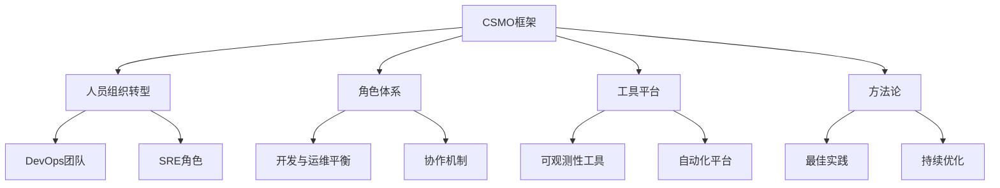

**三大支柱：**

1. **DevOps原则融合**

   - 开发与运维协同
   - 快速迭代发布
   - 自动化流水线
2. **SRE角色引入**

   - 平衡开发速度与系统稳定性
   - 建立错误预算机制
   - 关注可靠性工程
3. **协同运作机制**

   - 打破部门墙
   - 建立协作文化
   - 工具支持协同

### 2.3 IBM Garage方法

IBM通过**Garage（车库）方法**帮助企业找到从稳态到敏态的演进路径：

- 与国内多家银行和企业合作
- 通过工作坊形式进行实践
- 提供方法论和最佳实践指导
- 目前已开展100多次Garage活动

---

## 三、可观测性能力构建

### 3.1 为什么需要可观测性

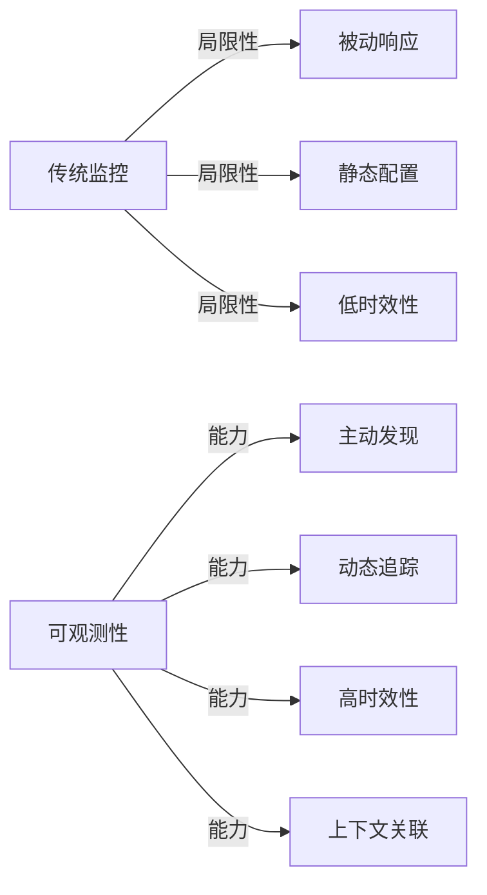

**核心价值：**

- 为AIOps提供高质量、确定性的数据
- 主动获取和理解系统变化
- 提供足够置信度的分析结果
- 避免AI建议带来的风险

### 3.2 可观测性三大核心能力

#### 3.2.1 自动发现能力

**关键特性：**

- 自动发现所有IT要素
- 自动跟踪配置变化
- 支持300+种技术栈
- 无需人工配置

**与传统监控的区别：**

| 维度     | 传统监控             | 可观测性            |
| -------- | -------------------- | ------------------- |
| 部署方式 | 手工配置，针对性部署 | 自动发现，统一Agent |
| 适配能力 | 需要针对不同技术栈   | 内置300+技术栈支持  |
| 变化追踪 | 依赖CMDB手工更新     | 实时自动追踪        |
| 时效性   | 分钟级               | 秒级（1-2秒）       |

#### 3.2.2 全面关联能力

**纵向依赖关系：**

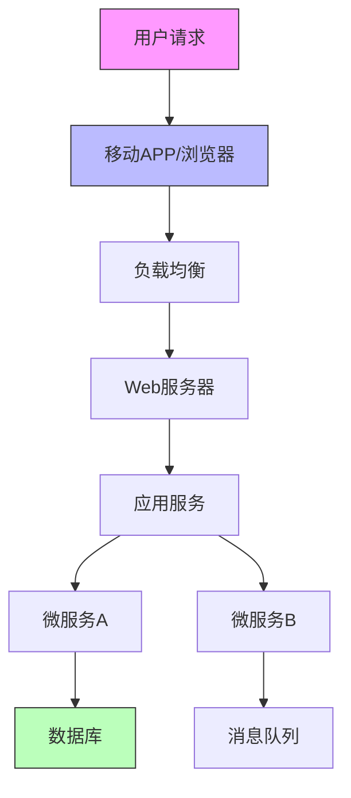

**横向调用关系：**

- 服务间调用链路
- 跨服务事务追踪
- 端到端性能分析
- 全量数据采集（非采样）

#### 3.2.3 融合分析能力

**三类数据融合：**

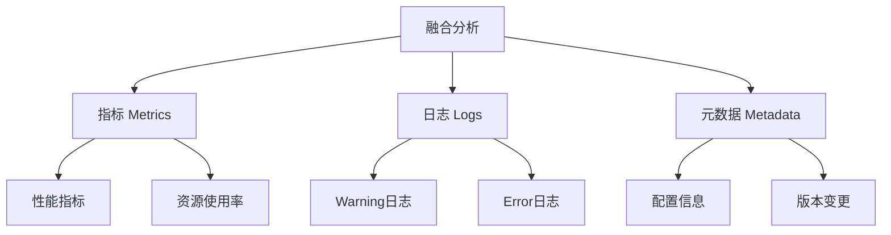

### 3.3 IBM Instana：应用性能可观测

**核心产品：Instana**

**主要功能：**

1. **全栈自动发现**

   - 1秒钟粒度数据采集
   - 主动发现技术栈变化
   - 自动建立依赖关系
2. **端到端追踪**

   - 从移动端到后端全链路
   - 用户体验监控
   - 真实用户监控（RUM）
   - 完整调用链分析
3. **智能分析**

   - 异常信号检测
   - 变更事件关联
   - 根因定位
   - 代码级诊断
4. **高性能架构**

   - 基于Erlang语言
   - 大并发低延迟
   - 单机支持千万级请求追踪

**典型应用场景：**

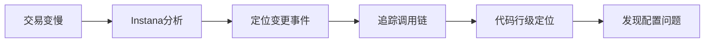

### 3.4 IBM Turbonomic：应用资源管理

**核心产品：Turbonomic**

**解决的问题：**

- 资源配置不合理导致的性能问题
- 超量配置造成的资源浪费
- 动态环境下的资源供需平衡

**工作原理：**

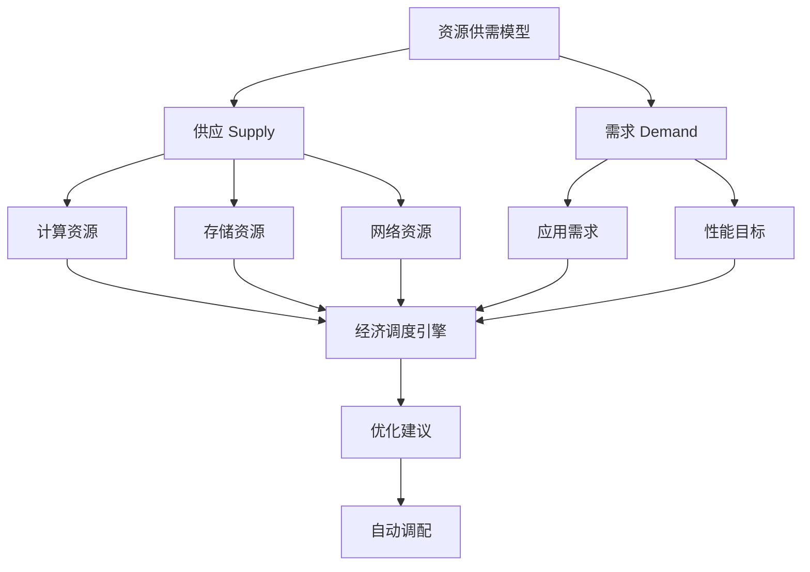

**核心特性：**

1. **全栈资源建模**

   - 物理层（计算、存储、网络）
   - 虚拟化层
   - 容器层
   - 微服务层
2. **经济学模型**

   - 资源定价机制
   - 供需平衡算法
   - 成本优化
   - 资源闲置时价格降低，紧张时价格升高
3. **最佳实践区域**


```
纵坐标：服务延迟
横坐标：资源使用率

目标区域：在保证服务质量的前提下，最大化资源使用率
```

4. **持续优化**
   - 365天×24小时持续跟踪
   - 实时优化建议
   - 自动化执行
   - 反馈循环

**实际效果：**

- 某财富百强企业在Azure公有云上节省**900万美金/年**
- 优化领域：存储、计算、网络全覆盖

---

## 四、AIOps智能运维实践

### 4.1 AIOps的挑战与突破

**传统AIOps的问题：**

- 基于大数据分析，但缺乏上下文信息
- 置信度不足，难以指导下一步操作
- 容易产生误导性建议
- 落地案例少

**IBM的解决思路：**

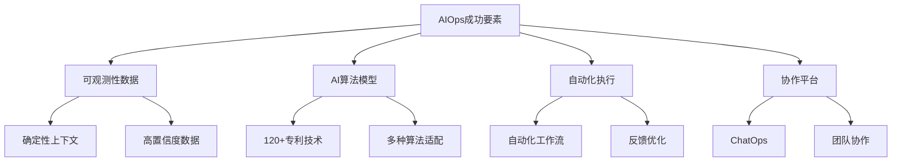

### 4.2 IBM Watson AIOps

**核心能力：**

#### 4.2.1 数据收敛

将海量运维数据收敛为可执行的洞察：

| 数据类型 | 处理方式           | 输出结果            |
| -------- | ------------------ | ------------------- |
| 事件告警 | 因果关联、根因分析 | 根因事件 + 影响链   |
| 日志数据 | NLP自然语言处理    | 关键异常日志        |
| 指标数据 | 异常检测、趋势分析 | 异常指标 + 因果关系 |
| 工单数据 | 相似度匹配         | 历史解决方案        |

#### 4.2.2 智能算法

**内置算法库（120+专利）：**

1. **自然语言处理（NLP）**

   - 日志理解
   - 工单分析
   - 上下文提取
2. **事件关联分析**

   - 告警聚合
   - 因果推断
   - 影响范围分析
3. **异常检测**

   - 指标异常识别
   - 模式挖掘
   - 趋势预测
4. **根因分析**

   - Granger因果检验
   - 相关性分析
   - 反向传播分析

#### 4.2.3 拓扑构建

**动态拓扑能力：**

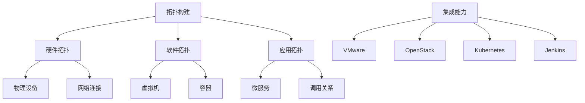

**拓扑特性：**

- 支持50+种配置管理工具集成
- 基于API方式，无侵入
- 时间线追溯能力
- 实时变更记录

**时间回溯功能：**

- 可将拓扑回溯到历史任意时间点
- 对比变更前后差异
- 分析问题发生时的配置状态
- 虚线表示已删除关系，实线表示新建关系

#### 4.2.4 协作平台（ChatOps）

**集成平台：**

- Slack
- Microsoft Teams
- 国内协作工具（适配中）

**协作功能：**

- 问题实时通知
- 多角色协同
- 交互式查询
- 一键执行操作
- 反馈评价机制

### 4.3 运维场景实践

**问题诊断流程：**

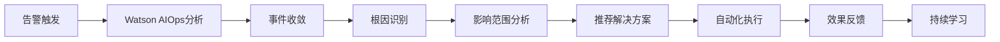

**分析维度：**

1. **事件告警分析**

   - 因果评分（置信度百分比）
   - 根因设备定位
   - 影响路径分析
   - 关联拓扑展示
2. **指标异常分析**

   - 异常指标识别
   - 因子指标关联
   - Granger因果检验
   - 反向传播影响
3. **日志分析**

   - Warning/Error日志提取
   - 与指标/事件关联
   - 时间线对齐
   - 上下文补充

**典型案例：交易失败率上升**

```
现象：交易失败率急剧上升
↓
分析：数据库处理时长增大
↓
关联：消息队列阻塞（变成直线）
↓
影响：交易并发数下降
↓
根因：数据库资源配置不足
↓
方案：优化数据库配置，扩容资源
```

---

## 五、自动化运维体系

### 5.1 自动化的必要性

**传统运维的问题：**

- 问题诊断耗时长
- 需要多工具切换
- 依赖个人经验
- 执行步骤易出错

**自动化价值：**

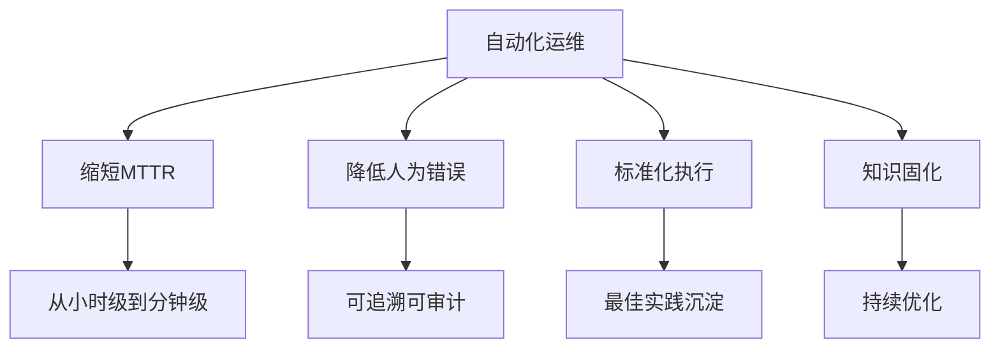

### 5.2 IBM Watson Orchestration

**自动化工作管理平台**

**核心功能：**

1. **工作流管理**

   - 脚本资产管理
   - Ansible Playbook集成
   - 图形化编排
   - 版本控制
2. **执行追踪**

   - 调用历史记录
   - 执行效果统计
   - 满意度评价（五星好评机制）
   - 优化建议
3. **智能推荐**

   - 基于历史工单匹配
   - 自动化操作推荐
   - 一键执行
   - 反馈优化

**工作流程：**

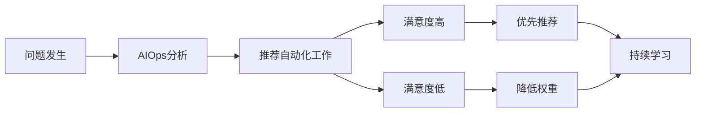

---

## 六、IBM解决方案与实践案例

### 6.1 整体架构

**IBM 敏捷运维现代化方案架构：**

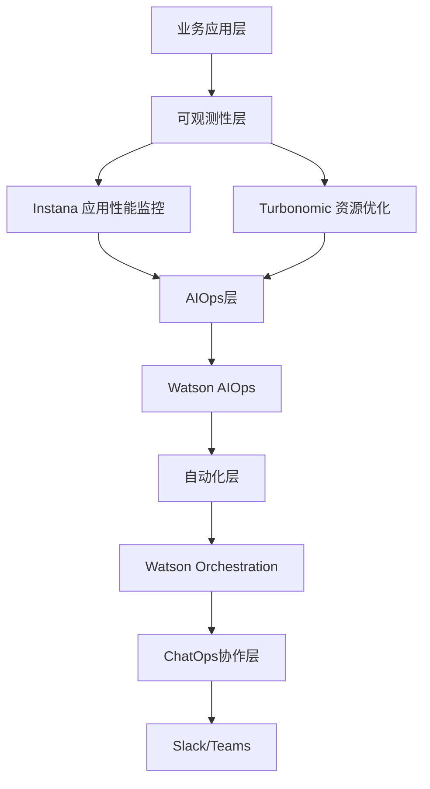

### 6.2 技术特点对比

| 特性         | 传统监控                   | IBM可观测性方案          |
| ------------ | -------------------------- | ------------------------ |
| 部署复杂度   | 高（需针对每个技术栈配置） | 低（单Agent自动发现）    |
| 技术栈支持   | 有限                       | 300+种自动适配           |
| 数据采集粒度 | 分钟级                     | 秒级（1-2秒）            |
| 追踪方式     | 采样                       | 全量                     |
| 性能影响     | 中等                       | 低（资源隔离）           |
| 扩展性       | 中等                       | 高（单机支持千万级交易） |
| AI能力       | 基础                       | 深度（120+专利）         |

### 6.3 实践案例

#### 案例1：全球财富百强企业

**背景：**

- 大量应用部署在Azure公有云
- 资源使用效率低
- 成本压力大

**方案：**

- 部署Turbonomic进行资源优化
- 扫描分析存储、计算、网络资源
- 持续优化建议

**效果：**

- 年度节省：**900万美金**
- 资源使用率提升
- 性能不降反升

#### 案例2：苹果App Store

**背景：**

- 全球App Store基础设施
- 高并发、大流量
- 严格性能要求

**方案：**

- 使用Instana构建全球可观测性
- 端到端性能监控
- 实时问题定位

**效果：**

- 全量追踪所有请求
- 秒级问题定位
- 用户体验提升

#### 案例3：国内银行客户

**部署特点：**

- 单机部署（16核 64GB）
- 支持千万级交易追踪
- 低延迟全采集

**用户反馈：**

- 自动发现能力强
- 部署便利（RPM包安装，SystemD管理）
- Kubernetes环境下DaemonSet自动部署
- 协作能力提升（运维与开发）

### 6.4 安全性保障

**Agent安全机制：**

1. **轻量级设计**

   - 单台服务器仅一个Agent
   - 自动激活需要的Sensor
   - 内存共享机制
2. **数据采集隔离**

   - 字节码注入（Java等）
   - 数据本地处理
   - 异步上传机制
   - 降低运行时干扰
3. **资源限制**

   - 可设置Hard Limit
   - 资源使用上限控制
   - 避免影响生产应用
4. **对比开源方案**

   - 开源：采集+上传在运行时同步进行
   - IBM：采集与上传分离，降低压力
   - 网络中断时不会堆积缓存

---

## 七、实施路径建议

### 7.1 演进路线图

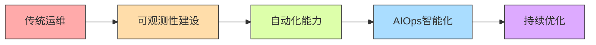

**阶段划分：**

| 阶段     | 目标         | 关键动作                       | 预期效果       |
| -------- | ------------ | ------------------------------ | -------------- |
| 第一阶段 | 构建可观测性 | 部署Instana/Turbonomic         | 看得见、看得清 |
| 第二阶段 | 建立自动化   | 梳理运维场景，编排自动化工作流 | 标准化执行     |
| 第三阶段 | 引入AIOps    | 部署Watson AIOps，数据对接     | 智能分析推荐   |
| 第四阶段 | 持续优化     | 反馈循环，算法优化             | 自动化闭环     |

### 7.2 关键成功因素

1. **循序渐进**

   - 先可观测性，后AIOps
   - 数据质量是基础
   - 不可一蹴而就
2. **数据驱动**

   - 确定性上下文数据
   - 高置信度分析
   - 可追溯可验证
3. **协作文化**

   - 打破部门墙
   - Dev与Ops协同
   - 工具支撑协作
4. **持续反馈**

   - 满意度评价
   - 算法优化
   - 知识沉淀

### 7.3 避坑指南

**常见误区：**

❌ **误区1：直接上AIOps**

- 问题：缺乏高质量数据，结果不可信
- 建议：先建设可观测性能力

❌ **误区2：依赖静态CMDB**

- 问题：敏态环境变化快，CMDB跟不上
- 建议：采用自动发现技术

❌ **误区3：采样式监控**

- 问题：丢失关键数据，分析失真
- 建议：全量采集（Instana支持）

❌ **误区4：忽视资源优化**

- 问题：性能问题反复出现
- 建议：关注资源配置合理性

---

## 八、总结与展望

### 8.1 核心观点总结

1. **稳态与敏态需要并存**

   - 不是非此即彼
   - 需要兼顾两种模式
   - CSMO提供融合框架
2. **可观测性是基础**

   - AIOps的前置条件
   - 提供确定性数据
   - 主动发现与追踪
3. **AI需要正确使用**

   - 不是万能的
   - 需要高质量输入
   - 需要持续优化
4. **自动化是关键**

   - 将洞察转化为行动
   - 标准化执行
   - 知识固化
5. **协作是文化**

   - 工具只是手段
   - 组织文化更重要
   - SRE角色定位

### 8.2 IBM方案价值

**技术价值：**

- 成熟的产品体系（Instana、Turbonomic、Watson AIOps）
- 120+项AI专利技术
- 全球大量成功案例

**业务价值：**

- 降低MTTR（平均修复时间）
- 提升资源使用效率
- 节约运维成本
- 提升用户体验

**组织价值：**

- 知识固化与传承
- 减少对个人经验依赖
- 提升团队协作效率

### 8.3 未来趋势

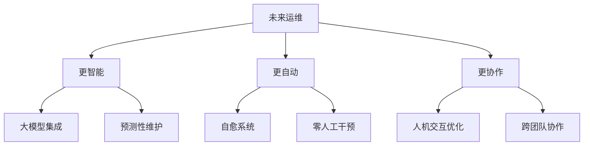

---

## 九、Q&A精选

**Q1：私有云改造如何不做大的改变？**

A：需要结合业务诉求，可选择：

- 虚拟化技术（VMware、KVM）
- PaaS平台云管
- 容器云（Kubernetes）
- IBM提供端到端统一管控方案

**Q2：多云环境下的备份容灾如何统一管理？**

A：IBM Cloud Pak for Multicloud Management：

- 统一纳管多个集群
- 支持公有云、私有云
- 应用级别的迁移与调度
- 一键部署到不同环境

**Q3：Instana Agent的安全性如何保证？**

A：多重保障机制：

- 轻量级设计（单服务器单Agent）
- 数据采集与上传分离
- 资源使用Hard Limit
- 内存共享机制，降低干扰
- 异步架构，避免缓存堆积

**Q4：混合云环境的虚拟流量采集方案？**

A：Turbonomic Network（即将推出）：

- 专门面向动态环境的网络性能监控
- 支持五元组流量分析
- 容器平台流量追踪

---

## 十、参考资源

### 官方资源

- **IBM CSMO官网**: [详细框架文档](https://www.ibm.com)
- **Instana文档**: 多语言支持，快速访问
- **Turbonomic**: 资源优化最佳实践
- **Watson AIOps**: AI算法与案例库

### 联系方式

如需进一步交流或了解详细方案，可通过DBAplus社区联系分享嘉宾。

---

## 附录：关键术语表

| 术语    | 英文                                      | 解释             |
| ------- | ----------------------------------------- | ---------------- |
| CSMO    | Cloud Service Management and Operations   | 云服务管理与运维 |
| SRE     | Site Reliability Engineering              | 站点可靠性工程   |
| ITIL    | IT Infrastructure Library                 | IT基础架构库     |
| CMDB    | Configuration Management Database         | 配置管理数据库   |
| AIOps   | Artificial Intelligence for IT Operations | 智能运维         |
| RUM     | Real User Monitoring                      | 真实用户监控     |
| MTTR    | Mean Time To Repair                       | 平均修复时间     |
| NLP     | Natural Language Processing               | 自然语言处理     |
| ChatOps | Chat Operations                           | 协作式运维       |

---

> **文档说明**
> 本文档根据IBM技术专家的技术分享整理而成，内容涵盖云时代运维转型的挑战、IBM CSMO理念、可观测性建设、AIOps实践等核心内容。
> 整理时间：2024年
> 适用对象：SRE工程师、运维工程师、稳定性保障工程师、技术管理者
