# 核心银行系统DevOps改进以及新工具的应用

> 来源：未核验 · 类型：分享 · 状态：draft


## 📋 分享概述

**分享主题**: 核心银行系统DevOps改进以及新工具的应用  
**目标受众**: SRE、运维及稳定性保障工程师  
**核心内容**: 传统核心银行系统的现代化改造路径、测试中台建设、自动化测试实践

---

## 一、传统核心银行系统的复杂性

### 1.1 技术栈的历史包袱

核心银行系统面临的主要挑战源于其悠久的历史和技术演进：

- **历史悠久**: 香港汇丰最老的系统运行超过50年，其他系统也有20-30年历史
- **多语言混合**: 汇编语言、COBOL、Java等多种语言并存
- **低级别编程**: 
  - 允许直接内存访问和指针操作
  - 使用固定长度文本文件存储数据（类似于把数据库绑定到固定长度的一行文本）
  - 为节省空间，数据甚至进行压缩加密存储

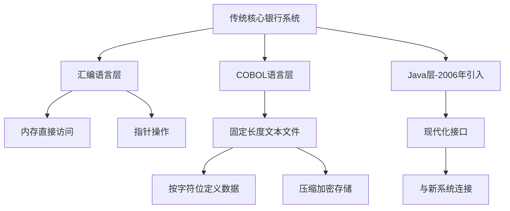

### 1.2 核心挑战

1. **可读性极低**: 面向过程编程，高度耦合，缺乏现代化的面向对象设计
2. **可维护性差**: 历代开发人员的代码积累，原始系统难以理解
3. **复杂度指数增长**: 随着模块增加和耦合度提升，复杂度从量变到质变
4. **数据存储限制**: 
   - 大型机/中型机存储空间昂贵
   - 数据格式特殊（如一行文本按字符位定义字段含义）
   - 部分字段经过压缩加密处理

---

## 二、系统现代化的两种路径

### 2.1 路径一：大破大立（推倒重建）

**类比**: 城中村改造，整片推倒重新规划

**优势**:
- ✅ 一次性解决历史遗留问题
- ✅ 全新的技术栈和架构
- ✅ 完整的文档和良好的可维护性

**挑战**:
- ❌ **可行性存在疑问**
- ❌ 需要大量时间（5-6年）和人力（数百人团队）
- ❌ 风险高，可能只完成系统的一小部分模块
- ❌ 业务支持困难

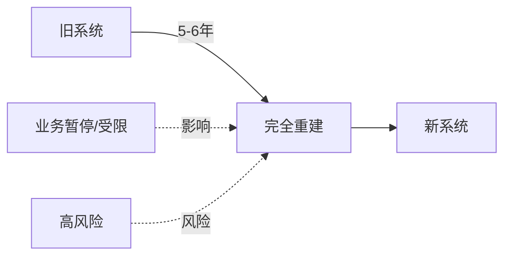

### 2.2 路径二：注入新活力（渐进式改造）⭐

**类比**: 成都太古里改造，保留原有风貌，注入新活力

**核心思路**:
1. **老建筑加固**: 重构核心代码，提升可读性和可维护性
2. **重建隐蔽工程**: API架构接口重建
3. **新存储空间**: 数据上云，迁移到现代数据库
4. **疑难杂症处理**: 持续解决迁移过程中的各种技术问题

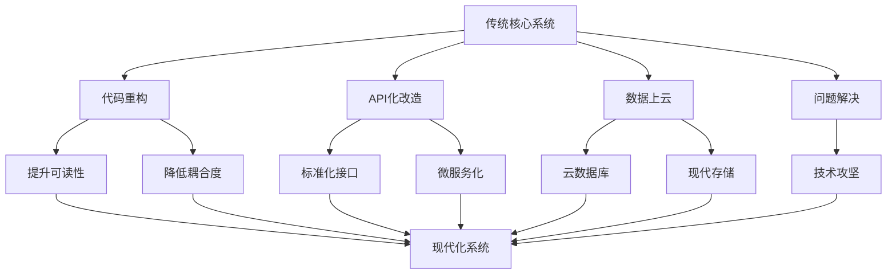

**关键技术突破**: 
- **Java on Mainframe (2006)**: IBM在大型机上支持Java，成为连接传统系统与现代世界的桥梁

---

## 三、测试中台的设计理念

### 3.1 设计思路：产品驱动

测试中台采用**产品化思维**构建，目标是提供一站式测试服务：

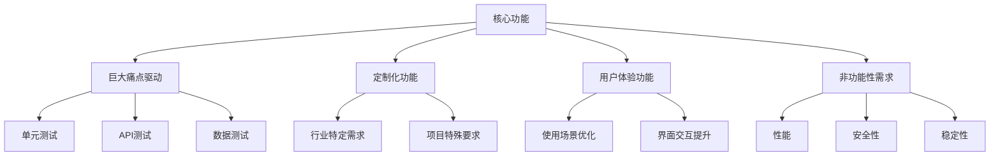

### 3.2 架构设计

测试中台必须支持**双环境并行**（新旧系统同时支持）：

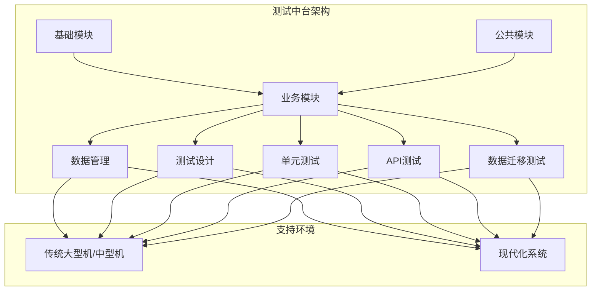

---

## 四、核心案例分析

### 案例一：大型机单元测试

#### 4.1 技术挑战

传统大型机系统特点：
- **面向过程编程**（非面向对象）
- 每个单元包含：输入参数 → 文件/内存处理 → 返回值
- 可以通过指针跳转访问任意内存段
- 缺乏单元测试工具

#### 4.2 解决方案：XaTesting + 自研中台

**商业工具**: XaTesting (基础能力)

**架构设计**:

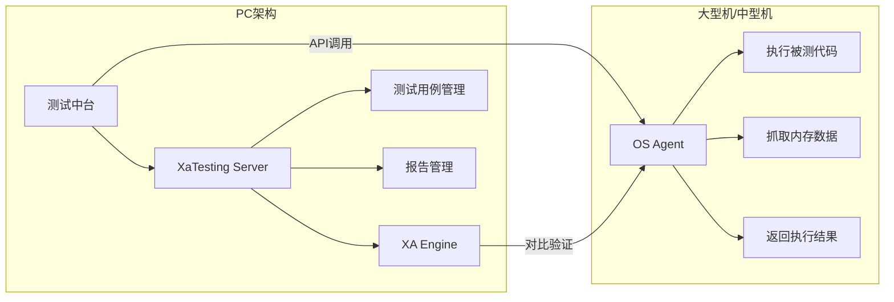

**原生XaTesting的局限**:
- ❌ 配置复杂，不易使用
- ❌ 用例管理困难
- ❌ 缺乏批量执行能力

**中台增强功能**:

1. **双环境并行执行**: 在新旧系统同时执行相同代码，验证结果一致性
2. **批量用例执行**: 原子颗粒度测试，支持大规模用例并发
3. **CI/CD集成**: 
   - 自动汇总多开发者的测试结果
   - 连接到流水线
   - 测试覆盖率分析
4. **高级功能**:
   - 自动生成测试用例（基于可枚举参数的排列组合）
   - 多组件并发执行
   - 测试覆盖率可视化分析

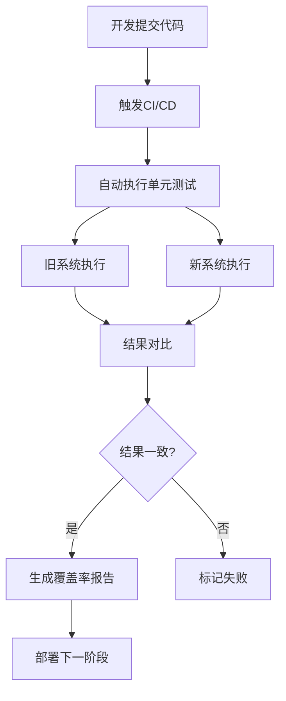

---

### 案例二：API测试一站式平台

#### 4.2.1 技术背景

大型机和中型机均支持将程序转换为标准Web Service API：
- **大型机**: CICS
- **中型机**: IWS、JAS等

#### 4.2.2 超越Postman的核心需求

**传统工具的局限**: Postman只能验证API响应是否正确（如返回200状态码），**无法验证业务数据准确性**

**案例说明**:
```
请求: 查询账户余额
响应: 200 OK, balance: 1000元

问题: 这1000元是否正确？
```

#### 4.2.3 解决方案：穿透式验证

**核心创新**: API测试 + 数据源验证

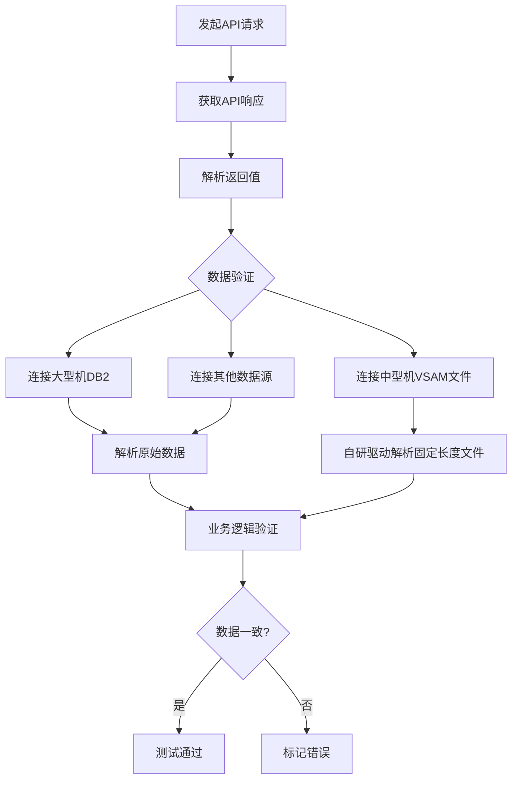

**技术实现**:

1. **多数据源支持**:
   - DB2数据库: 通过JDBC查询
   - VSAM固定长度文件: 自研驱动器解析
   - 需要Copy Book（定义文件）配合解析数据格式
   
2. **自研文件驱动器**:
   ```
   输入: 文件名 + Copy Book定义
   处理: 按格式解析固定长度文本
   输出: 提取指定业务信息
   ```

#### 4.2.4 核心功能

**1. 完整测试链条**:

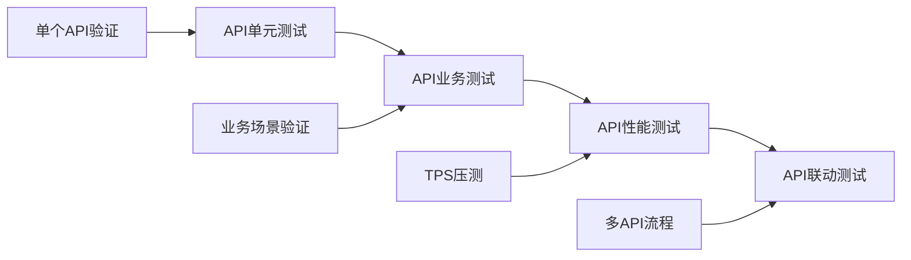

**2. 无代码测试编辑**:
- 关键字封装: 将常用业务逻辑封装为关键字
- 场景组合: 测试人员通过关键字组合完成测试用例
- 示例关键字:
  - `解析银行账号`
  - `查询账户余额`
  - `执行转账交易`

**3. 性能测试与基线建立**:

测试维度：
- **TPS (Transactions Per Second)**: 每秒支持的事务数
- **响应时间**: API调用到返回的时间

**性能数据分析的价值**:

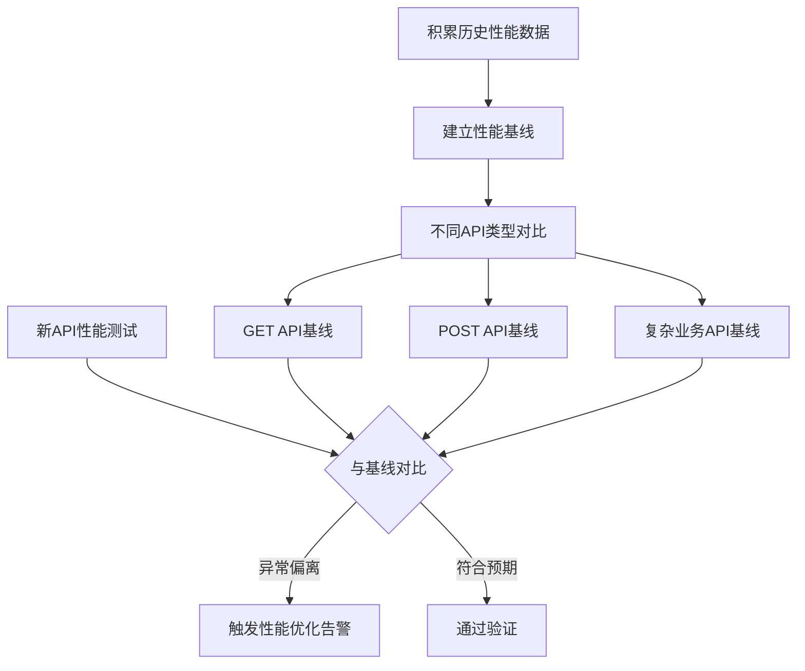

**4. 多API联动测试**:

示例场景：转账流程
```
步骤1: 查询账户余额 (GET /balance) → 返回 1000元
步骤2: 执行转账操作 (POST /transfer) → 转账 50元
步骤3: 再次查询余额 (GET /balance) → 验证 950元
步骤4: 查询收款方余额 → 验证增加 50元
```

**5. 双环境运行**:
- 同时在新旧系统执行相同API调用
- 对比结果确保一致性
- 测试结果自动链接CI/CD流水线

#### 4.2.5 API Mock平台

**应用场景**:

1. **开发阶段**: 依赖API未开发完成时，使用Mock数据
2. **系统联调**: 为兄弟系统提供测试游乐场
3. **演示环境**: 使用固定测试账号演示功能

**价值**: 
- 核心系统已有500+生产API
- 兄弟系统可在Mock环境中测试集成，无需等待环境准备

---

### 案例三：数据迁移测试（数据上云）

#### 4.3.1 业务背景

数据上云是传统系统现代化的关键环节，涉及：
- 从大型机/中型机迁移数据
- 传统DB2 → 云数据库
- 固定长度文件 → 现代数据库表

#### 4.3.2 数据上云流程

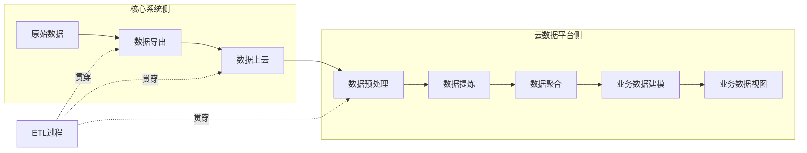

**ETL过程**: Export → Transform → Load

#### 4.3.3 核心挑战

**问题描述**:
- 面对两张百万级数据表（数百列）
- 需要逐行、逐字段对比验证
- 人工测试：采样少、错误率高、覆盖率低

**示例**:
```
原数据库: 100万行 × 100列
目标数据库: 100万行 × 90列 (部分列合并/拆分/转换)
```

#### 4.3.4 解决方案：自动化跨数据库对比

**核心能力**:

1. **跨数据库对比**:

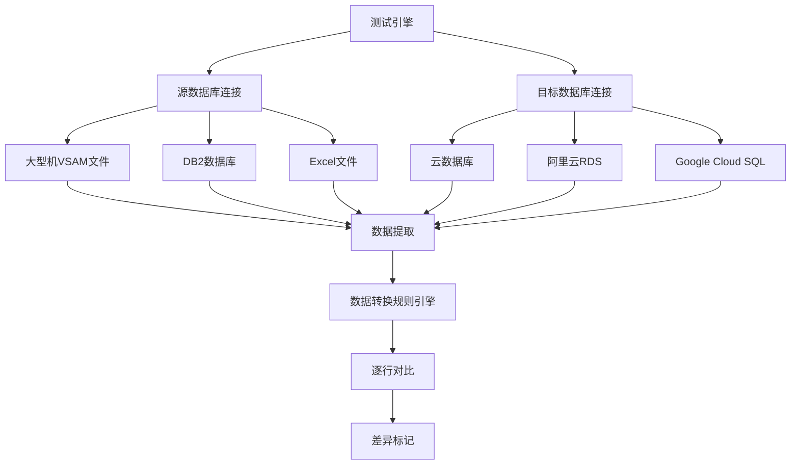

2. **无代码转换规则定义**:

常用规则关键字：
- **文本处理**: trim、concat、substring
- **数字处理**: add、multiply、round
- **日期转换**: `YYYYMMDD` (8位字符) → `DATE` 格式
- **自定义规则**: 
  - 银行账号拼接规则（分行号+账号规则）
  - 业务特定字段转换

3. **百万级数据对比**:
- 自动化对比：无需人工干预
- 行级对比：支持百万级数据量
- 差异高亮：自动标记不一致数据
- 版本备份：支持不同版本数据对比

#### 4.3.5 VSAM文件特殊处理

**VSAM文件特点**:
- 固定长度格式
- 部分字段压缩存储
- 需要Copy Book定义文件配合

**处理流程**:

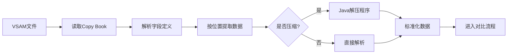

**技术实现**:
- 自研Java解压程序（反编译原有压缩逻辑）
- 模拟Copy Book解析器
- 统一转换为可读格式

#### 4.3.6 支持的数据源

| 数据源类型 | 说明 | 连接方式 |
|----------|------|---------|
| VSAM文件 | 大型机固定长度文件 | 自研驱动 + Copy Book |
| DB2 | 传统关系数据库 | JDBC |
| Excel | 临时数据/对比数据 | POI库 |
| 云数据库 | 阿里云、Google Cloud等 | 原生驱动 |

#### 4.3.7 高级功能

1. **错误定位**:
   - 百万级数据中精确定位错误行
   - 导出差异数据
   - 支持差异数据分析

2. **版本管理**:
   - 数据版本备份
   - 不同版本间对比
   - 回归测试验证

3. **一键生成**:
   - 自动生成表结构映射
   - 默认转换规则（Apple to Apple映射）
   - 仅需手动调整特殊字段（10-20个特殊字段 vs 100个总字段）

**使用场景**:
```
原数据表: 100列
  → 90列直接映射 (自动生成)
  → 10列需要转换 (手动配置规则)
```

---

## 五、DevOps实践要点

### 5.1 自动化测试策略

**四类自动化测试**:

| 测试类型 | 建议覆盖率 | 优先级 | 说明 |
|---------|-----------|--------|------|
| UI层自动化 | 10%-20% | 低 | 成本高、维护难，保留关键场景 |
| **API层自动化** | **100%** | **最高** | 核心重点，微服务架构必备 |
| 单元测试自动化 | 适度 | 中 | 使用工具自动生成，降低开发负担 |
| 数据测试自动化 | 100% | 高 | 数据迁移必须，人工测试覆盖率极低 |

### 5.2 性能测试模型建立

**全新系统的性能基线建立**:

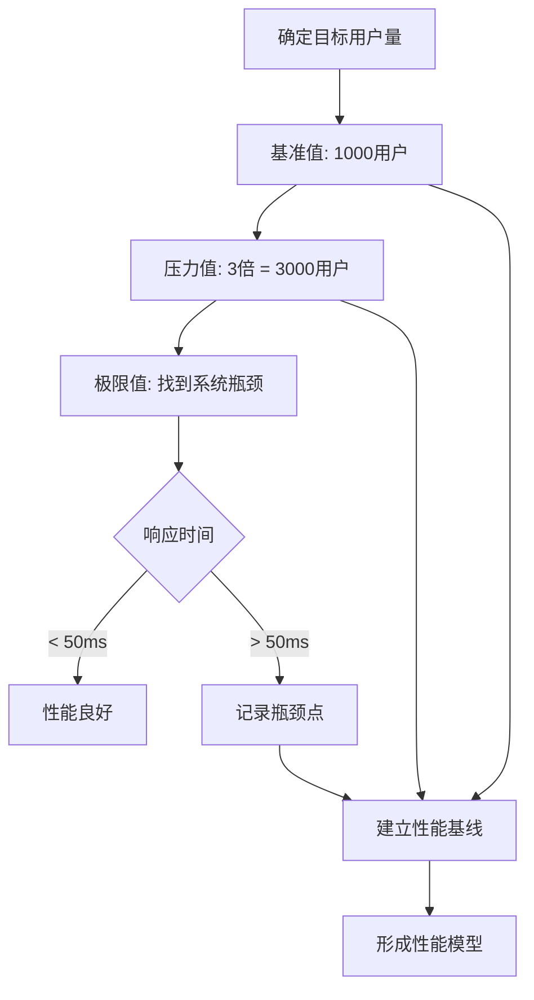

**API级别性能基线**:

1. 创建零业务逻辑API（最简单的Echo API）
   - 不访问数据库
   - 最小化处理逻辑
   - 得出硬件层面性能上限

2. 以此为基线评估所有业务API性能

### 5.3 CI/CD集成要点

**关键原则**:

1. **工具集成**: 测试框架必须能连接到CI/CD流水线
2. **策略定义**: 明确测试覆盖率门禁（如必须达到80%才能继续）
3. **自动触发**: 每次提交自动执行相关测试用例
4. **数据准备**: 
   - 测试数据造数是银行业务最大难点
   - 需要根据成熟度权衡取舍
5. **并发执行**: 支持多用例并发，加速反馈

**VDT (Virtual Desktop) 自动化的特殊考虑**:

优势:
- ✅ 界面稳定（固定行距和位置）
- ✅ 数据提取容易

劣势:
- ❌ 单Console限制（并发能力差）
- ❌ 多屏幕跳转复杂
- ❌ 执行时间长

建议: VDT自动化仅保留少量端到端场景，主要依靠API测试

---

## 六、关键技术突破

### 6.1 Java on Mainframe的意义

**历史节点**: 2006年IBM发布大型机上的第一个Java版本

**价值**:
1. 打开了传统系统的"一扇门"
2. 使现代化工具可以部署到大型机/中型机
3. 成为新旧技术融合的桥梁

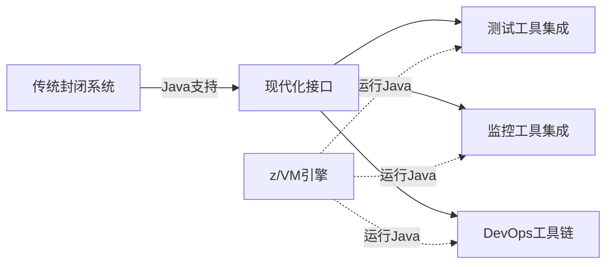

### 6.2 渐进式迁移的核心

**每次API开发的同步动作**:

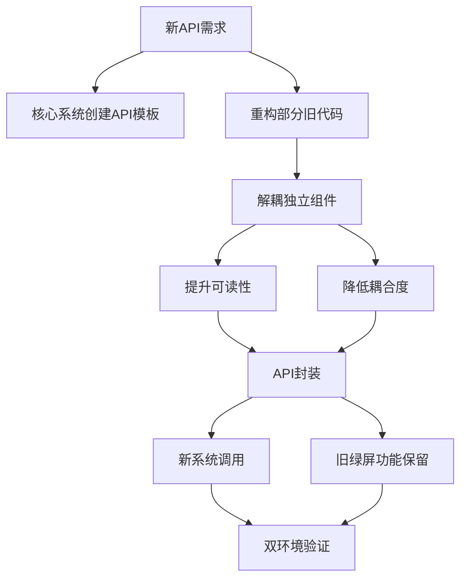

**渐进式改造的优势**:
- 每次只重构小部分代码
- 新旧功能并存
- 持续积累，逐步完善
- 风险可控

---

## 七、经验总结与建议

### 7.1 核心理念

> **"这不是我们刻意选择的路，而是大拆大建有时候连选择的机会都没有"**

**权衡因素**:
- 业务连续性要求
- 风险承受能力
- 时间和人力投入
- ROI（投资回报率）

### 7.2 成功要素

1. **坚定信念**: 
   - 这是一条"难而正确"的路
   - 需要数年甚至十年的持续投入
   - 不能期待立竿见影

2. **产品化思维**:
   - 以产品方式构建测试中台
   - 持续迭代优化
   - 关注用户体验

3. **技术攻坚能力**:
   - 逢山开路，遇水搭桥
   - 技术瓶颈是必然出现的
   - 需要持续解决"疑难杂症"

4. **新旧融合**:
   - 长期并存思维
   - 不追求完全替代
   - 寻找融合点

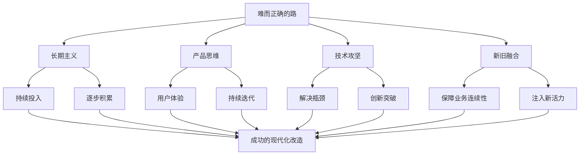

### 7.3 避坑指南

**❌ 常见陷阱**:
1. 期待短期见效
2. 忽视数据造数难度（银行业务特点）
3. 过度依赖UI自动化
4. 忽略性能基线建立
5. 缺乏历史数据积累

**✅ 最佳实践**:
1. 以核心痛点驱动功能开发
2. 优先API层自动化（性价比最高）
3. 数据迁移必须自动化测试
4. 建立完整的性能数据体系
5. 持续积累测试数据和案例

---

## 八、Q&A精选

### Q1: DevOps中自动化测试具体思路？

**四层测试金字塔**:
```
        /\
       /UI\      ← 10-20% (端到端场景)
      /----\
     /  API \    ← 100% (核心重点)
    /--------\
   /  Unit   \   ← 适度覆盖 (工具辅助)
  /----------\
 /   Data     \  ← 100% (数据迁移必需)
```

### Q2: 如何在流水线上提供更好的测试？

**三个关键点**:
1. 框架必须能连接到CI/CD流水线
2. 定义明确的测试策略（如覆盖率门禁）
3. 自动化用例自动触发

**数据挑战**: 银行业务的造数难度远高于执行测试用例

### Q3: ETL用到的DSL工具还是自己写？

**技术选型**:
- 自研驱动引擎
- 基于JDBC连接各类数据源
- 转换规则存储在配置中
- 动态创建Spring Boot实例执行转换逻辑
- 用户在测试中台Web界面配置所有内容

---

## 九、技术架构总览

### 9.1 测试中台整体架构

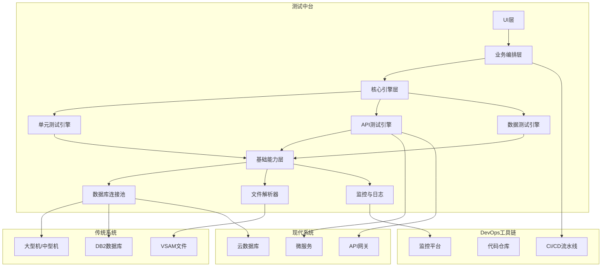

### 9.2 数据流转示意

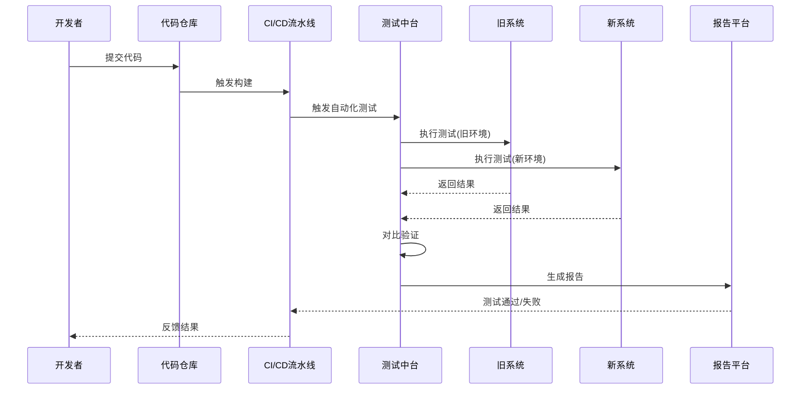

---

## 十、启示与展望

### 10.1 对传统金融IT的启示

1. **现代化改造是长期工程**: 不要期待一蹴而就
2. **渐进式优于激进式**: 在绝大多数场景下更可行
3. **工具化思维**: 构建自己的DevOps工具链
4. **数据是核心资产**: 数据迁移和验证是重中之重

### 10.2 技术发展方向

- 从单纯工具到平台化
- 从手工到自动化再到智能化
- 从孤立系统到生态融合
- 从成本中心到价值创造

### 10.3 文化与组织

> **"多一份热爱、欢喜以及开心"**

技术改造不仅是技术问题，更需要：
- 团队的坚持和热情
- 管理层的长期支持
- 业务部门的理解配合
- 开发、测试、运维的紧密协作

---

## 附录：关键术语

| 术语 | 说明 |
|------|------|
| **Mainframe** | 大型机（如IBM z系列） |
| **Midrange** | 中型机（如IBM AS/400） |
| **COBOL** | 面向商业的古老编程语言 |
| **VSAM** | 虚拟存储访问方法（大型机文件系统） |
| **Copy Book** | COBOL中的数据结构定义文件 |
| **z/VM** | IBM大型机上的Java虚拟机 |
| **CICS** | 大型机事务处理系统 |
| **TPS** | Transactions Per Second（每秒事务数） |
| **ETL** | Extract, Transform, Load（数据抽取、转换、加载） |
| **XaTesting** | 商业化的大型机单元测试工具 |

---

## 结语

核心银行系统的DevOps改造是一场**技术、文化和组织的综合变革**。这不是一条容易的路，但却是一条**难而正确**的路。通过测试中台的建设、自动化工具的应用、渐进式的迁移策略，传统核心系统完全可以在保持业务连续性的前提下，逐步走向现代化。

关键在于：**长期主义、产品思维、技术攻坚、新旧融合**。

---

**分享者**: 汇丰银行核心系统团队  
**整理时间**: 2024  
**适用对象**: SRE、DevOps工程师、测试架构师、银行科技部门

