# 进一步左移——构建持续快速交付的架构安全体系

> 来源：未核验 · 类型：分享 · 状态：draft

> 分享嘉宾：周继海、周一凡（汇丰科技）
> 
> 目标受众：SRE、运维及稳定性保障工程师

## 分享概要

本次分享主要介绍汇丰科技在DevSecOps领域的实践经验，重点讲解如何将安全架构设计进一步左移，构建持续快速交付的架构安全体系。通过汇丰证券技术部与信息安全部门的协作实践，展示了从安全开发到安全架构设计的完整演进路径。

---

## 一、嘉宾介绍

### 周继海
- **职位**：汇丰科技证券技术部门 DevOps负责人
- **背景**：曾在巴克利银行、汇丰银行、腾讯等大型企业从事敏捷与DevOps转型工作
- **成就**：国内首本DevOps书籍作者之一，南京大学软件学院DevOps实验室企业导师

### 周一凡（Frank）
- **职位**：汇丰科技信息安全部门安全风险与威胁控制顾问
- **专长**：系统架构安全顾问、风险评估、威胁建模
- **职责**：协助集团内部各部门进行DevSecOps实施与业务转型

---

## 二、DevSecOps与安全架构设计背景

### 2.1 DevOps的发展与局限

DevOps自2009年提出至今已有15年历史，在许多企业中已经落地实践，有效提高了业务交付的速度和质量，增强了企业竞争力。

**传统DevOps的局限性：**
- 主要关注速度和质量提升
- 对信息安全考虑不足
- 速度与安全之间存在天然矛盾
- 为了快速上线可能忽略安全要求
- 严格的安全审核会影响交付速度

### 2.2 DevSecOps的核心理念

DevSecOps旨在解决速度与安全的矛盾，核心理念是：

> **将信息安全的意识和能力左移给开发团队**

传统模式下，安全工作由专门的安全部门和安全专家负责。DevSecOps希望将部分安全工作交给开发团队，把安全融入到DevOps流程的各个阶段。

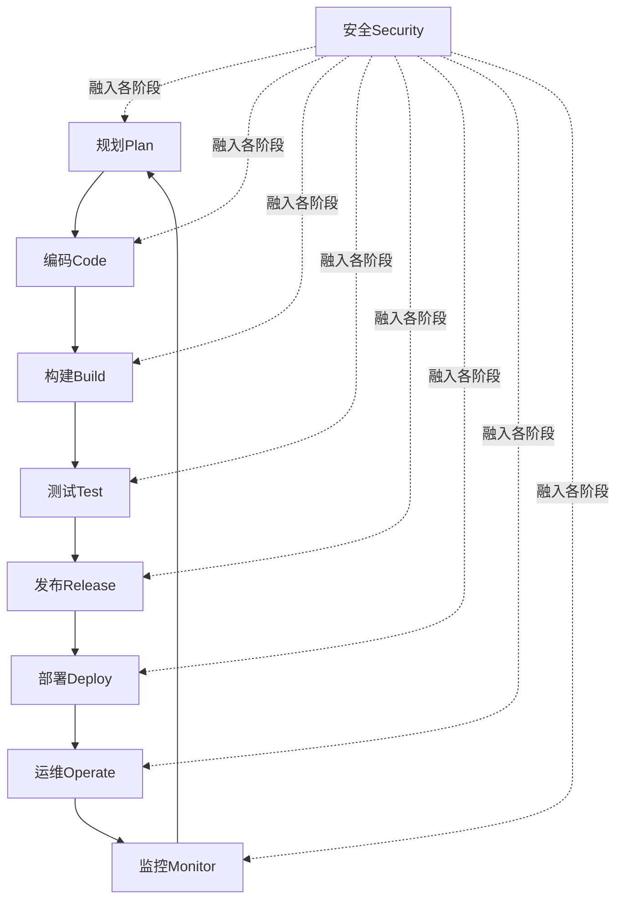

### 2.3 为什么需要DevSecOps

#### 2.3.1 速度瓶颈问题

**传统模式（3周开发+1周安全评审=4周）：**
- 需求→编码→测试：3周
- 安全评审：1周
- 总交付周期：4周

**DevOps模式（1周开发+1周安全评审=2周）：**
- 通过敏捷开发、微服务、CI/CD等手段
- 开发周期压缩至1周
- 安全评审仍需1周
- **瓶颈：安全评审成为交付速度的制约因素**

**DevSecOps模式（1周+0.5周≈1.5周）：**
- 安全工作左移至开发阶段
- 安全评审周期缩短
- 总交付周期大幅缩短

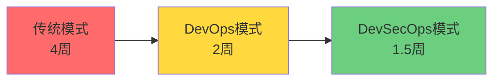

#### 2.3.2 成本控制优势

越早发现问题，解决成本越低：
- **开发阶段**发现安全漏洞：立即修复，成本最低
- **测试阶段**发现安全漏洞：需要返工，成本增加
- **上线前评审**发现安全漏洞：需要重走整个流程，成本最高

#### 2.3.3 三大核心收益

1. **克服速度与安全的矛盾**：实现更快的安全交付
2. **节省成本**：早发现早解决，避免后期返工
3. **更好的风险控制**：开发团队自身具备安全能力

---

## 三、外部驱动因素

### 3.1 监管风险趋势

#### 3.1.1 国内外信息安全法规

近十年来，国内外发布了大量信息安全相关法律法规，例如：
- **GDPR**（欧盟通用数据保护条例）
- **中国数据安全法**
- **个人信息保护法**
- 各行业特定监管要求（金融、电信等）

#### 3.1.2 监管三大趋势

**趋势一：监管体系越来越健全**
- 法律法规数量逐年递增
- 涵盖领域更加完善：网络运营安全、系统安全、数据安全、密码管理等

**趋势二：监管形式越来越多元化**
- 法律、规定、政策性条文、行业标准等多种形式
- 监管机构错综复杂

**趋势三：不同国家和地区存在监管差异**
- 对跨国企业影响尤为显著
- 需要应对不同国家和地区的合规要求

#### 3.1.3 合规性挑战

> 产品或业务的合规性直接影响其面向未来市场的生命力与可持续发展性

**现实问题：**
- 与合规相关的设计与管控措施在项目早期阶段容易被忽视
- 需要在项目早期就引入合规管控措施
- 安全部门需要早期介入，与项目团队共同实现架构安全审查左移

### 3.2 技术挑战：OWASP Top 10

#### 3.2.1 OWASP简介

**OWASP**（Open Web Application Security Project）：
- 开放Web应用程序安全项目
- 开源、非营利性全球安全组织
- 致力于改进Web应用程序安全
- 定期发布十大最严重的Web应用安全风险

#### 3.2.2 不安全设计首次列入Top 10

**OWASP 2021版本**首次引入"不安全的设计"（Insecure Design）作为新的安全风险类别。

官方描述：
> "不安全的设计是2021年版本的新类别，特别聚焦在设计相关的缺陷。如果我们真的希望让整个产业向左移动，那么我们就必须进一步往威胁建模、安全设计模式、安全参考架构的方向前进。"

**不安全设计的常见表现：**
- 个人信息保护不当
- 日志文件泄密
- 加密算法不合规
- 身份认证机制薄弱
- API安全设计缺陷

#### 3.2.3 API安全威胁案例

**数据泄露风险分析：**
- 超过90%的数据泄露来自已知API的爬取
- API安全已成为数据泄露的头号风险
- 国内外多家企业受到影响（社交网站、电商平台等）

**根本原因：**
- 项目早期设计阶段缺少完善的API保护机制
- 缺乏相应的网络控制措施
- 如果在设计阶段就建立完善保护机制，大部分安全事件可以避免

---

## 四、安全开发左移实践（基础）

### 4.1 安全左移的三个维度

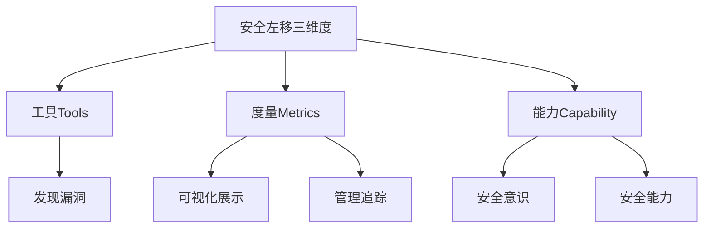

#### 维度一：工具（Tools）

**目标：帮助开发团队发现漏洞**

汇丰采用的策略：
- 采购业界知名的专业安全工具
- 自研部分安全工具
- 覆盖多个维度（源代码、Web、第三方组件等）

#### 维度二：度量（Metrics）

**目标：可视化安全状态，管理漏洞**

度量内容：
- 各类安全工具的使用情况
- 发现的安全漏洞统计
- 漏洞趋势追踪
- SLA管理（如高危漏洞1周内修复，中危2周内修复）
- Dashboard仪表盘展示

#### 维度三：能力（Capability）

**核心理念：工具只能发现问题，人才能解决问题**

**安全意识（Security Awareness）：**
- 在编码和设计过程中主动避免安全隐患
- 写出更安全的代码（如使用HTTPS、安全的端口配置等）
- 从源头减少安全漏洞

**安全能力（Security Capability）：**
- 具备修复安全漏洞的能力
- 不仅能看懂漏洞报告，还能实际修复
- 对程序员的要求更高（类似DevOps要求程序员懂测试和运维）

### 4.2 主流安全技术

#### 4.2.1 SAST（Static Application Security Testing）- 静态应用安全测试

**工作原理：**
- 白盒技术
- 对源代码进行安全扫描
- 基于规则引擎进行检测

**优点：**
- 精准定位漏洞位置（可精确到代码行）
- 程序员容易接受
- 代码层面，技术门槛低

**缺点：**
- 误报率较高
- 需要人工验证结果
- 增加成本

**汇丰使用：** Checkmarx

#### 4.2.2 DAST（Dynamic Application Security Testing）- 动态应用安全测试

**工作原理：**
- 黑盒技术
- 模拟黑客攻击行为
- 不关心内部实现，只看外部反应

**优点：**
- 误报率很低，结果准确
- 能发现更多漏洞
- 模拟真实攻击场景

**缺点：**
- 技术门槛较高，更适合安全专家使用
- 可能对生产环境产生脏数据
- 无法精确定位代码位置

**汇丰使用：** Net Sparker

#### 4.2.3 IAST（Interactive Application Security Testing）- 交互式应用安全测试

**工作原理：**
- 灰盒技术
- 在服务器中插入Agent
- 通过截取流量进行分析
- 类似监控系统的工作方式

**特点：**
- 克服了SAST和DAST的部分问题
- 较新的技术
- 结合了静态和动态的优势

**汇丰使用：** Contrast

#### 4.2.4 SCA（Software Composition Analysis）- 软件成分分析

**目标：扫描第三方组件的安全性**

**背景：**
- 现代软件开发大量复用第三方库和插件
- 需要确保引用的第三方代码是安全的
- 应对类似Log4j等第三方组件漏洞

**汇丰使用：** Sonatype Nexus IQ Server

### 4.3 汇丰安全工具集成

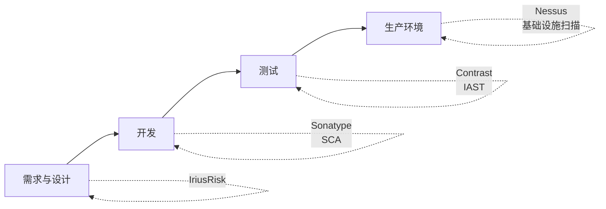

**覆盖范围：**
- **需求/设计阶段**：IriusRisk（架构安全评估）
- **开发阶段**：Checkmarx（SAST）、Sonatype（SCA）
- **测试阶段**：Net Sparker（DAST）、Contrast（IAST）
- **生产环境**：Nessus（操作系统、端口扫描）

### 4.4 开发团队安全能力建设

#### 4.4.1 在线培训

**Secure Coding Training Platform（安全编码培训平台）：**
- 采购商业平台（CodeWarrior）
- 场景化学习
- 实战演练（如：发现并解决英国服务器被巴西黑客攻击的漏洞）

#### 4.4.2 模拟攻击（红蓝对抗）

**背景问题：**
- 安全漏洞是概率问题，不一定会被攻击
- 开发人员容易产生"没有黑客攻击就是安全"的错觉
- 金融机构网络层防护好，安全事故更少，导致开发人员不够重视

**解决方案：**
- 提供靶场环境
- 让开发人员从防守者变成攻击者
- 模拟黑客攻击靶场应用
- 亲身体验漏洞被攻击后的影响
- 深刻理解修复漏洞的重要性

**效果：**
- 开发人员对安全重要性有深刻认识
- 业务人员理解安全投入的必要性
- 提升整体安全意识

---

## 五、架构安全设计左移（进阶）

### 5.1 为什么需要进一步左移

**内部动机：**
- 安全开发阶段（编码、测试）已投入2-3年，相对成熟
- 具备完善的安全工具、度量体系和能力建设
- 希望进一步左移到架构设计阶段
- 更早发现问题，降低修复成本

**演进路径：**
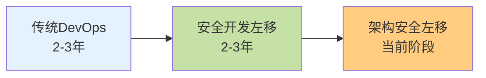

### 5.2 架构安全设计左移的三大目标

#### 目标一：安全控制左移，为开发团队赋能

**类比安全开发的三个维度：**
- 引入安全工具（架构层面）
- 建立度量体系
- 提高架构师和技术负责人的安全能力和意识

#### 目标二：安全设计文档的标准化与自动化

**传统模式的问题：**
- 依赖安全团队手动评审
- 投入大量人力物力
- 效率低下

**改进方向：**
- 标准化安全文档设计
- 基于标准化进行自动化评审
- 减少人工介入，提高效率

#### 目标三：建立安全架构社区与文化

**长远目标：**
- 建立安全架构社区
- 促进经验交流和知识分享
- 持续学习和贡献
- 形成良好的安全文化
- 避免一次性培训，实现持续成长

### 5.3 汇丰证券与安全部门协作实践

#### 5.3.1 试点工作概述

**参与方：**
- 汇丰科技信息安全部门
- 汇丰证券技术部门

**试点时间：** 2024年

**试点目标：**
1. 让安全控制进一步左移，为开发团队赋能
2. 安全设计文档的规范与自动化
3. 安全架构社区与文化的建立

#### 5.3.2 六大角色定义

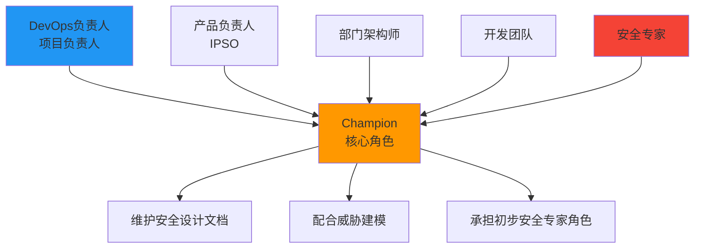

**1. 开发团队（Development Team）**
- 安全架构左移实践的主体
- 根据流程实现持续快速且安全的产品交付

**2. DevOps负责人/项目负责人**
- 负责整体项目进度管理
- 协调不同角色之间的工作
- 主导培训、实践和各项内容安排

**3. 产品负责人（IPSO - IT Product Security Officer）**
- 确保产品及服务满足集团、行业与监管标准要求
- 管理和跟踪产品的安全漏洞与风险
- 确保安全设计文档被正确且及时维护

**4. 部门架构师（Architect）**
- 为不同业务或价值流定义统一的安全架构模式和实践指引
- 为安全设计文档的维护提供技术支持和指导

**5. Champion（关键角色）**

> **最最最关键的角色！**

**职责：**
- 在团队中负责维护安全设计文档
- 配合开展威胁建模等各类安全工作
- 经过系列培训后，承担初步的安全架构专家角色
- 解决团队中最基础、最常见的安全问题
- 具备意识去避免设计问题的发生

**选拔标准：**
- 参与应用层面架构设计的人员
- 平常需要参与架构评审或架构安全评审的人员
- 负责绘制安全架构图和建立安全文档的人员
- 经验丰富的高级开发人员

**6. 安全专家（Security Expert）**
- 由安全部门相关人员担任
- 提供培训和实操指导
- 为Champion维护设计文档提供指引
- 提供安全设计咨询服务
- 随时解答各角色的安全疑问

#### 5.3.3 能力建设三维度

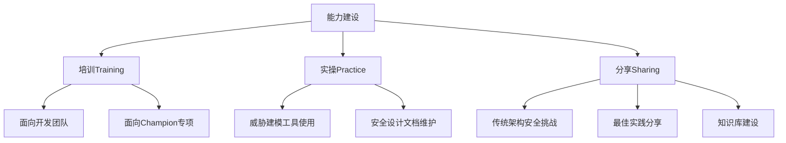

**培训（Training）：**
- 面向开发团队的通用培训
- 面向Champion的专项培训（如何维护安全设计文档、威胁建模原理等）

**实操（Practice）：**
- Champion使用威胁建模工具的实操
- 安全设计文档维护实操

**分享（Sharing）：**
- 传统架构安全面临的挑战
- 最佳实践分享
- 知识积累和传播

### 5.4 安全设计文档规范化

#### 5.4.1 安全设计文档的重要性

> **安全设计文档是威胁建模和安全审查的唯一依据**

**为什么重要：**
- 需要经得起安全部门、二线、三线、IT Audit甚至监管的审查
- 威胁建模工作必须基于文档中记录的信息
- 所有安全机制和控制措施必须在文档中明确描述
- 是架构师和Champion共同维护的核心产出物

#### 5.4.2 文档规范化要求

**维护标准：**
- Champion和架构师需要形成良好的文档维护文化和能力
- 信息描述不能随意，需要遵循统一规范

**标准化内容：**
- **加密/数据保护类**：数据存储加密、数据传输加密等
- **身份控制类**：身份认证、授权机制等
- **网络安全类**：网络隔离、防火墙策略等
- **日志审计类**：日志记录、审计追踪等

**实施方式：**
- 安全团队提供指导手册
- 提供文档模板
- 让各团队基于模板维护统一标准的文档
- 便于后续威胁建模、IT Audit和监管审查

### 5.5 威胁建模（Threat Modelling）核心

#### 5.5.1 威胁建模简介

**定义：**
威胁建模（Threat Modelling）是一个不断循环的动态模型，主要运用在安全需求和安全设计阶段。

**目标：**
- 确定对企业或业务应用能够造成影响的威胁、攻击和漏洞
- 形成相应的对策
- 实现企业安全目标
- 降低风险

#### 5.5.2 威胁建模流程对比

**传统模式 vs 左移模式：**

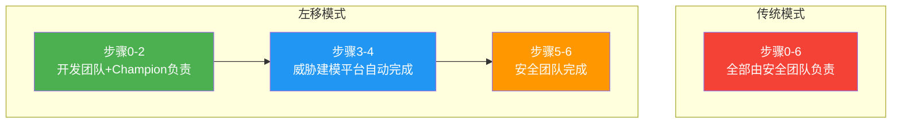

**具体流程：**

| 步骤 | 传统模式 | 左移模式 | 负责方 |
|------|---------|---------|--------|
| 0-2 | 安全团队 | 开发团队+Champion | 维护架构图和设计文档 |
| 3-4 | 安全团队 | 威胁建模平台自动完成 | 识别潜在风险和控制措施 |
| 5-6 | 安全团队 | 安全团队 | 研判、评分、跟踪 |

**工作重心左移的体现：**
- 步骤0-2由开发团队和Champion承担，不再依赖安全团队
- 步骤3-4实现自动化，大幅提高效率
- 安全团队聚焦在最核心的研判和决策工作

#### 5.5.3 威胁建模平台（IriusRisk）

**平台特性：**
- 商业版+高度定制化
- 预制汇丰内部的架构组件库（服务器、数据库、网络层级、客户端等）
- 维护威胁风险库（Threat Library）
- 基于行业和企业特性定制

**Champion的工作方式：**
1. 使用预制的设计组件
2. 通过拖拽组装完成架构设计图
3. 平台自动识别潜在风险（基于威胁风险库）
4. 根据自动化建议和安全设计文档提供反馈
5. 安全专家进行二次研判
6. 平台计算风险评分

**核心画板功能：**
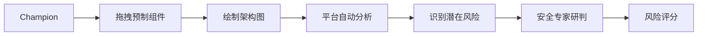

#### 5.5.4 三种左移的实现

**1. 安全能力和工作流程的左移**
- 步骤0-2由Champion负责
- 经过系统化培训，具备一定安全架构能力
- 安全工作在项目中尽早开展
- 与设计工作同步进行

**2. 安全风险控制的左移**
- 步骤3-4自动化分析和反馈
- Champion实时动态了解设计的潜在风险
- 及时改进，在源头避免安全设计问题

**3. 安全审查工作的整体左移**
- 步骤0中，Champion按规范维护安全设计文档
- 安全团队在项目早期通过文档进行自动化对比
- 检查文档是否完善且符合规范
- 避免后期因文档问题导致时间浪费

### 5.6 安全架构社区与文化建设

**目标：**
- 以Champion为核心
- 安全专家和架构师都能参与
- 建立组织内的安全社区和平台

**运作方式：**
- 社区成员提供各自领域的技术支持和反馈
- 定期进行安全架构设计专题交流
- 形成良好的社区文化
- 持续学习和经验积累

---

## 六、未来展望：AI赋能架构安全

### 6.1 挑战一：架构图自动生成

**当前问题：**
- 架构设计图的创建和维护依赖人工
- 无法与安全设计文档或技术文档联动

**探索方向：**
- 利用生成式AI能力
- 基于设计文档自动生成架构图
- 基于功能和业务描述自动生成符合标准和监管要求的安全架构设计

### 6.2 挑战二：AI辅助威胁分析

**当前问题：**
- 产品和系统的架构安全高度依赖安全人员对业务和方案的理解
- 判断安全控制是否合规依赖人工经验

**探索方向：**
- 借助AI大模型的分析能力
- 对安全设计文档等技术文档进行语义理解
- 与威胁建模中的安全控制措施进行自动化比对
- 协助训练和维护动态威胁库
- 提高自动化分析的精准度

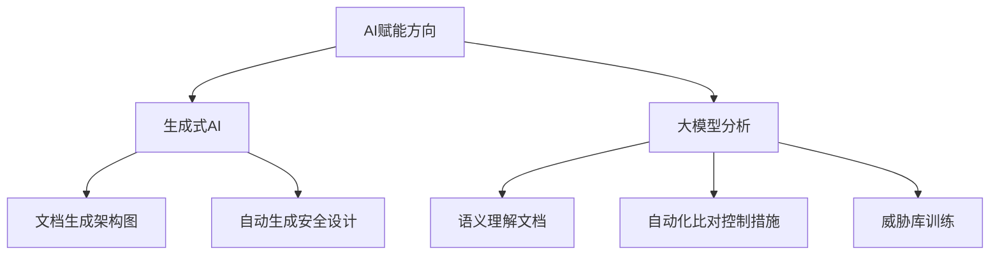

---

## 七、核心要点总结

### 7.1 DevSecOps演进路径

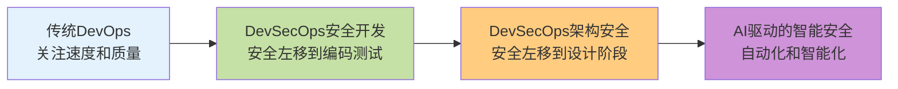

### 7.2 安全左移三层次

| 层次 | 阶段 | 核心工作 | 主要角色 |
|------|------|---------|---------|
| **基础层** | 开发测试 | SAST/DAST/IAST/SCA 工具、度量、能力建设 | 开发人员 |
| **进阶层** | 架构设计 | 威胁建模、设计文档规范化 Champion机制 | Champion 架构师 |
| **未来层** | 智能化 | AI辅助设计和分析 自动化威胁识别 | AI+安全专家 |

### 7.3 成功要素

**1. 角色定义清晰**
- Champion是核心角色
- 各角色职责明确
- 协作机制完善

**2. 文档标准化**
- 提供模板和指引
- 统一描述规范
- 自动化检查

**3. 工具平台支撑**
- 威胁建模平台（IriusRisk）
- 预制组件库
- 自动化分析能力

**4. 能力持续建设**
- 培训+实操+分享
- 社区化运营
- 文化沉淀

**5. 循序渐进**
- 先做好安全开发
- 再进入架构安全
- 最后智能化演进

### 7.4 关键引用

> "如果我们真的希望让整个产业向左移动，那我们必须进一步往威胁建模、安全设计模式、安全参考架构的方向前进。"
> 
> —— OWASP Top 10 2021

---

## 八、Q&A精选

### Q1: SAST和DAST应该怎么协同工作？

**A:** 
- **SAST集成在CI阶段**：代码提交后自动触发，对源代码进行安全扫描，类似单元测试和代码质量扫描
- **DAST集成在测试环境**：系统运行后自动触发，模拟攻击测试环境
- **两者不矛盾**：分别在开发阶段和测试阶段发挥作用，互补覆盖

### Q2: Champion角色如何定义和选拔？

**A:** 
选拔标准：
1. 平常参与架构评审或架构安全评审的人员
2. 负责维护安全设计文档和绘制架构图的人员
3. 经验丰富、参与应用层面架构设计的开发人员
4. 覆盖范围比安全开发的Champion更大（因为架构层面影响范围更广）

### Q3: 威胁建模工具是购买还是自研？

**A:** 
- 汇丰使用的IriusRisk是**商业版产品**（也有社区版）
- 进行了**高度定制化**：
  - 定制符合业务场景的威胁库
  - 预制内部架构组件
  - 配置符合监管要求的规则
- 建议：大企业采购商业版+定制化，中小企业可考虑开源方案

### Q4: 如何实现安全设计文档的自动化检查？

**A:** 
1. **标准化是前提**：提供模板和指导手册，统一描述规范
2. **关键字和规则检查**：基于标准化内容进行自动化检查
3. **AI语义理解**：利用大模型进行文档语义分析（探索中）
4. **逐步演进**：从人工→规则检查→AI辅助

---

## 九、实施建议

### 9.1 给SRE/运维团队的建议

**1. 评估当前成熟度**
- 先确保DevOps实践相对成熟
- 再考虑引入DevSecOps
- 循序渐进，不要跨越式发展

**2. 从安全开发开始**
- 先落地SAST/DAST等工具
- 建立度量体系
- 提升开发团队安全能力
- 至少实践2-3年

**3. 再进入架构安全**
- 定义Champion角色
- 规范化安全设计文档
- 引入威胁建模
- 建立安全社区

**4. 持续关注新技术**
- AI在安全领域的应用
- 自动化工具的演进
- 行业最佳实践

### 9.2 给架构师的建议

**1. 提升安全意识**
- 了解OWASP Top 10
- 掌握常见安全设计缺陷
- 参与安全培训

**2. 规范化设计文档**
- 使用标准化模板
- 详细记录安全控制措施
- 及时更新维护

**3. 积极参与威胁建模**
- 学习威胁建模方法论
- 使用威胁建模工具
- 与安全团队紧密协作

### 9.3 给管理者的建议

**1. 投入资源**
- 安全工具采购
- 培训预算
- 人员配置（安全专家、Champion）

**2. 文化建设**
- 建立安全社区
- 鼓励知识分享
- 表彰优秀实践

**3. 度量和考核**
- 建立安全度量指标
- 纳入绩效考核
- 持续改进

**4. 长期视角**
- 安全投入是长期工程
- 不追求一蹴而就
- 关注持续改进

---

## 十、参考资源

### 标准和规范
- OWASP Top 10 2021
- GDPR（欧盟通用数据保护条例）
- 中国数据安全法
- 个人信息保护法

### 工具推荐
- **SAST**: Checkmarx, SonarQube
- **DAST**: Net Sparker, OWASP ZAP
- **IAST**: Contrast
- **SCA**: Sonatype Nexus IQ, Snyk
- **威胁建模**: IriusRisk, Microsoft Threat Modeling Tool
- **基础设施扫描**: Nessus

### 培训平台
- Secure Code Warrior
- OWASP WebGoat（靶场）
- Hack The Box（渗透测试练习）

---

## 结语

DevSecOps的实践是一个持续演进的过程，从传统DevOps到安全开发左移，再到架构安全左移，每一步都需要扎实的基础和持续的投入。汇丰科技的实践经验表明，通过清晰的角色定义、规范化的流程、强大的工具支撑和持续的能力建设，可以在不影响交付速度的前提下，显著提升系统的安全性。

未来，随着AI技术的发展，安全架构设计将迎来更多的自动化和智能化可能性。但无论技术如何演进，**安全意识、安全文化和人的能力建设**始终是DevSecOps成功的核心要素。

> **"如果我们真的希望让整个产业向左移动，那我们必须进一步往威胁建模、安全设计模式、安全参考架构的方向前进。"**

让我们共同努力，构建更加安全、快速、可靠的系统！

---

**文档版本**: v1.0  
**整理日期**: 2024年  
**关键词**: DevSecOps, 安全左移, 威胁建模, 架构安全, Champion, SAST, DAST, IAST, SCA, IriusRisk, 汇丰科技实践

