# 华夏银行迈入无人化运维新阶段

> 来源：未核验 · 类型：分享 · 状态：draft

## 分享嘉宾

**魏忠伟** - 华夏银行信息科技部中间件运维负责人
- 协调推进基础软硬件运维的自动化和智能化
- 17年运维管理经验
- 对运维自动化有丰富的实践经验

## 一、为什么要探索无人化运维

### 1.1 无人化时代的到来

当前，各行各业正在进入无人化时代：
- **无人驾驶**：汽车行业的热门方向
- **无人工厂/无人餐厅/无人超市**：零售服务业的创新
- **无人物流/无人码头**：物流运输业的升级

随着IT技术、通信技术等科学技术的不断发展，各个行业和领域的自动化程度越来越高，部分场景已经实现了全自动化（无人化）。

### 1.2 无人化运维的概念

**定义**：无人化运维是运维自动化的高阶形式，是运维发展的必然方向和阶段。

**发展历程**：

- **早期阶段**：通过工具或脚本对功能点做自动化（工具化）
- **发展阶段**：连点成线，实现流程上的自动化（从短流程到长流程，从简单到复杂）
- **成熟阶段**：连线成体，实现全面的立体的自动化
- **高级阶段**：在一定范围内实现所有操作自动化，不需要人员参与（无人化）

### 1.3 无人化运维的双重要素

无人化运维由两个关键词组成：

1. **无人化**：运维过程中或运维的全流程都没有人员参与
2. **运维**：必须有运维的需求或具体操作，且这些操作全部自动化完成

> **注意**：如果一个系统放置一年没有任何操作且没有问题，这不能称为无人化运维，因为没有运维实施过程。严谨来说，"**运维无人化**"可能更准确。

### 1.4 华夏银行的探索动因

选择**文件传输系统**作为试点，主要原因：

#### 业务压力巨大
- **年变更量**：27,000+次生产变更操作
- **维护团队**：8人小团队，基本处于超负荷工作状态
- **工作强度**：每次变更经常加班到凌晨2-3点
- **风险压力**：频繁生产操作，容易产生生产事件或被合规审计

#### 系统特点适合试点

| 特点 | 说明 |
|------|------|
| **自动化基础好** | 项目前已实现80%左右的自动化，管理规范化较好 |
| **成功后收益高** | 8人团队可从超负荷工作中解放，改善显著 |
| **复杂度适中** | 系统复杂但团队维护6年+，摸透了绝大部分场景 |
| **可复用推广** | 作为基础性系统，实施经验对其他系统有参照意义 |

#### 系统规模数据
- **应用系统覆盖率**：80%左右的应用系统使用文件传输服务
- **传输任务数**：12,800+个（持续线性增长）
- **用户数**：1,797个（截图时数据，现已达1,800+）
- **场景复杂度**：需求场景复杂多样，变更和维护难度大

## 二、无人化运维的实践方案

### 2.1 实施范围：化整为零

以文件传输系统为试点，将运维工作系统性梳理后分为三大块：

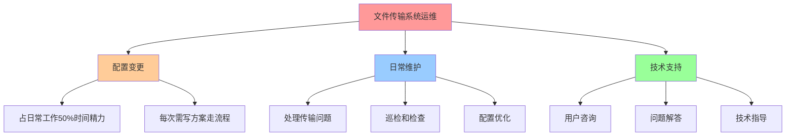

**策略**：通过分别实现三大块的无人化，达到整个运维全流程、全方位无人化的最终效果。

### 2.2 技术实现：三大核心方法

#### 2.2.1 操作原子化

**核心思想**：借鉴低代码编程和自主编排思想，面对不断变化或未知的场景和需求，进行颗粒化/原子化处理，然后按需编排。

**设计理念**：

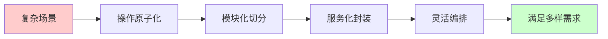

**优势**：
- **数量有限**：基础原子化操作数量少
- **应对场景多**：可组合应对非常多的场景
- **以不变应万变**：通过有限操作满足无限需求

**颗粒度控制原则**：
- **太细**：组合时复杂度高，每个动作执行后都需检查状态
- **太大**：组合简单但灵活性不足
- **平衡策略**：不必要不细分
  - 无复用需求的复杂操作打包成一个
  - 需要复用的单独封装

**示例**：
- **细粒度**：目录权限查看 + 目录权限修改（两个原子操作）
- **粗粒度**：配置完整传输任务（一个原子操作，虽然流程长但封装为一个）

**编排策略**：大场景 + 规则库模式

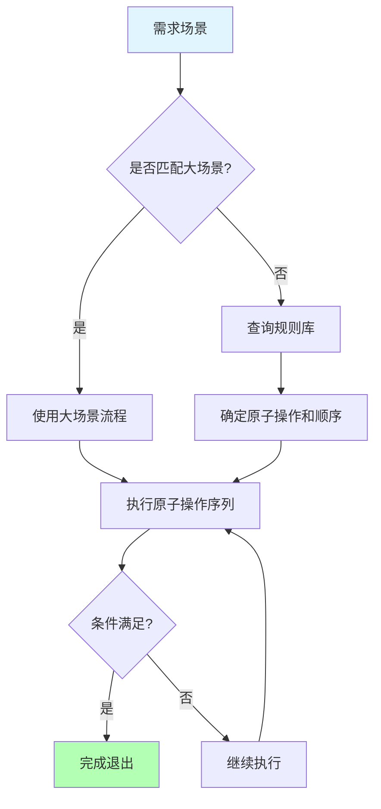

- **大场景**：同类场景中最复杂或流程最长的场景
  - 大部分情况当前场景可在大场景中找到对应流程
  - 执行过程中条件满足即可提前退出
  - 例如：10个操作的场景，简单需求可能执行4-6个操作后即完成

- **规则库**：处理特殊或偶发性场景
  - 不具备通用性的场景
  - 通过规则库确定原子化操作及顺序

#### 2.2.2 服务自助化

**目标**：实现运维人员不参与运维过程，这是无人化运维的关键手段。

**考量指标**：运维人员是否参与。任何人参与生产操作或运维，无人化计时即会中断。

**自助化的优势**：

| 优势 | 说明 |
|------|------|
| **响应及时** | 随时可用，不受运维人员状态影响 |
| **并发能力高** | 突破人员限制（5人最多接听5个电话，工具无限制） |
| **质量有保障** | 经过反复审阅和讨论，内容完善且标准化 |
| **持续优化** | 不断优化内容、交互页面和形式 |

**四大服务自助化工具**：

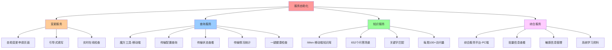

**1. 变更服务 - 自助变更申请页面**
- **以前**：用户提交表格给运维人员
- **现在**：引导式自助申请页面，根据引导和说明填写
- **功能**：实时在线检查，发现错误立即提醒
- **效果**：实现变更方面的服务自助化

**2. 查询服务 - 魔方工具（移动端）**
- 传输记录查询
- 传输配置查询
- 传输情况统计（每天哪个时间点传输文件多）
- 监控功能
- 节点任务配置
- 一键健康检查（全量扫描：节点状态、传输状态、日志状态、报警信息综合分析）

**3. 知识服务 - iWen（移动端知识库）**
- **内容**：652个问答场景（全覆盖）
- **功能**：文件传输系统相关问题的知识问答
- **使用**：输入关键字（如"申请"），匹配相关提问和解答
- **访问量**：每周100+次，稳定持续
- **优化方向**：提高搜索命中率和用户交互友好度

**4. 综合服务 - 综合服务平台（PC端）**

与移动端的互补关系：

| 特点 | 移动端（iWen/魔方） | PC端（综合服务平台） |
|------|---------------------|---------------------|
| **便利性** | 随时随地可用 | 固定场所使用 |
| **适用场景** | 单条信息查询 | 批量信息查看（如400条任务核对） |
| **信息类型** | 一般信息 | 敏感信息、高安全要求信息 |
| **内容形式** | 简短问答 | 系统学习资料、长文档 |
| **典型应用** | 日常查询、应急处理 | 系统迁移、新人培训 |

**成果**：通过四方面服务自助化，基本实现运维人员与用户之间的隔离，运维人员无需参与整个运维过程。

#### 2.2.3 规范内置化

**核心理念**：无人化运维仍需遵守各种管理规范和合规要求，将规范和要求内置到无人化运维工具的处理逻辑中。

**转变**：
- **以前**：规范和规则靠人执行
- **现在**：人不参与，靠工具执行

**三大规范内置方向**：

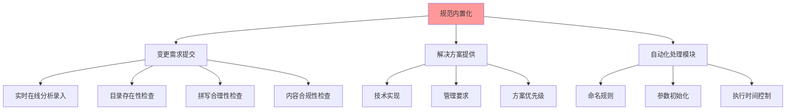

**1. 变更需求提交规范**

**检查维度**：
- **目录存在性**：输入目录后立即扫描是否存在
  - 不存在：询问授权信息（授权用户、授权权限）
- **拼写检查**：IP地址位数、内容格式等
- **内容合理性**：系统间传输要求、文件特殊性要求、行内管理要求

**价值**：
- **提升需求质量**：减少人工审查时的填错问题
- **降低返工成本**：避免流程走一半或走完才发现错误
- **提高成功率**：前置检查保证后续自动化执行成功率
- **符合管理标准**：填写时即时提醒应该怎么写

**2. 解决方案提供规范**

**场景**：一个技术问题可能有多种实现方法，但为了管理需要，统一采用一种形式。

**实现方式**：
- **方式一**：只提供一种答案（不建议或不能采用的方案不提供）
- **方式二**：提供多个方案，但将管理要求的方案放在第一位并强调说明

**原因**：避免技术人员较真，询问"那样不行吗"等问题。

**3. 自动化处理模块规范**

严格遵守管理规范：
- **创建对象**：命名规则、各种约束
- **初始化参数**：按照手册、最佳实践、管理设置（路径、用户等）
- **执行变更实施**：不同系统级别有不同执行时间要求

**优势**：
- **程序不会变通**：严格执行，不偷懒
- **无人为失误**：不会忘记或误操作
- **合规性更好**：比人工执行更规范

### 2.3 系统架构设计

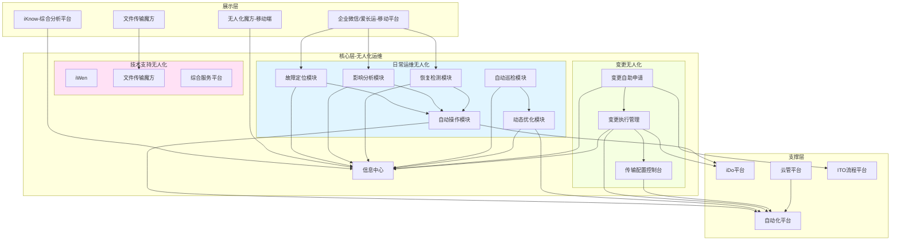

#### 架构说明

**支撑平台层**：
- **企业微信/爱长运**：移动平台，移动端工具主要发布平台
- **自动化平台 + iDo平台**：基础自动化平台，提供到服务器执行具体操作的能力（主备/高冗余模式）
- **云管平台**：与云环境对接
- **ITO平台**：IT服务平台，流程审批对接（变更需完成流程审批后才能执行）

**核心层 - 无人化运维**：

**1. 日常运维无人化**

| 模块 | 功能 |
|------|------|
| **故障定位模块** | 问题发生后分析故障信息，定位原因 |
| **影响分析模块** | 分析当前故障是否会造成故障传导，是否影响其他系统 |
| **恢复检测模块** | 持续检测故障恢复状态（如磁盘空间满需业务清理，持续检测何时恢复） |
| **自动操作模块** | 负责与自动化平台和iDo平台交互，统一调度所有需要在主机上执行的操作 |
| **自动巡检模块** | 常规检查：配置资源、传输时间、文件积压等 |
| **动态优化模块** | 根据巡检结果自动调整（如队列接近上限时扩展资源，文件变大时调整超时时间） |

**2. 技术支持无人化**
- **iWen**：移动端知识库
- **文件传输魔方**：移动端查询工具
- **综合服务平台**：PC端服务平台

**3. 变更无人化**

| 模块 | 功能 |
|------|------|
| **变更自助申请** | 引导式自助申请页面，嵌入审批流程 |
| **变更执行管理** | 需求提交后自动生成原子化操作序列，识别依赖关系，调度执行，失败处理（重试/等待/报失败） |
| **传输配置控制台** | 原手工操作平台，通过接口向其他模块提供底层功能支撑 |

**信息中心**：
- 汇总无人化运维各模块执行信息（报警、执行信息）
- 分类、聚合、加工后发送给展示系统、工具平台

## 三、实施效果与成果

### 3.1 项目进展

#### 日常运维无人化

**上线时间**：2021年6月初

**验证过程**：
- 经过二阶段、三阶段版本的严峻考验
- **二阶段特点**：整个晚上很多系统停机，停机时间长，变化多
- **挑战**：各系统变更完陆续启动时，能否自动处理变更期间积压的文件

**运行效果**：
- 运行非常好，基本没有人参与处理
- 运维人员只需坐着等待或看屏幕
- **处理成功率**：超过99%

#### 变更无人化

**进度**：受疫情影响，开发人员不能进驻，只能远程开发（拍照片、发视频解决问题），进度比计划慢

**当前状态**：
- 马上全面上线
- 每周完成约10个变更，无需任何人参与
- 复杂情况仍需人辅助，持续完善中

#### 技术支持无人化

**iWen知识库**：
- **问答场景**：652个（全覆盖）
- **访问量**：每周100+次，比较稳定
- **优化方向**：改进搜索命中率和用户交互友好度

**文件传输魔方**：
- **访问量**：2021年12月达到7,000次新高
- **用户覆盖**：
  - 使用文件传输服务的项目人员
  - 分行技术人员
  - 投资公司技术人员
  - 信用卡中心技术人员

**宣传重要性**：工具好用是一方面，宣传也很重要。很多人打电话时不知道有这个工具，需要在各种场合不遗余力宣传。

### 3.2 无人化运维监控

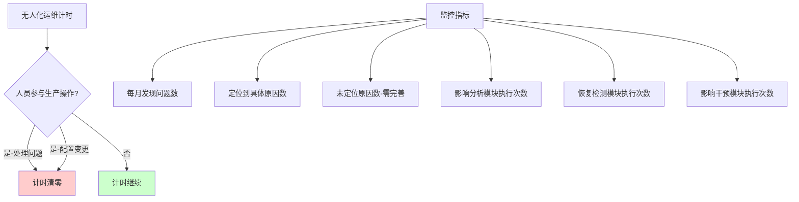

**考核标准**：
- 只要有人上生产进行操作（处理问题或配置变更），计时清零
- 技术支持（回答问题）暂时不计入（还在探讨中）

**目标设定**（神盾工程 - 十四五规划）：
- **2022年最低目标**：至少30天无任何人参与，生产系统无任何问题
- **30天挑战**：约4周，60-70个变更，8,000-9,000次自动处理
- **60天挑战**：更高难度
- **90天挑战**：至少包含一次大版本（全年分4个大版本）

**手机端监控界面**：
- 每月发现的问题数
- 定位到具体原因的问题数
- 未定位原因的问题数（说明定位逻辑需完善）
- 各模块执行情况：
  - 影响分析模块
  - 恢复检测模块
  - 影响干预模块（故障传导时紧急实施干预，如临时隔离故障节点）

### 3.3 正在进行的工作

**流程可视化**：

**需求背景**：整个运维过程全自动，但如果看不到具体过程，会觉得心里没底或不踏实。

**可视化内容**：
- 什么时候发现问题
- 什么时候处理问题
- 怎么处理的
- 处理具体过程是什么

**价值**：让运维过程透明化，增强信心和可控感。

## 四、项目总结与体会

### 4.1 无人化运维的本质变化

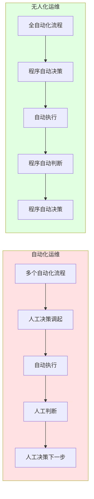

**自动化运维**：
- 很多点、很多流程都是自动的
- 但流程的调起、执行时机由人控制
- 人的工作简单（点按钮），但最复杂的逻辑判断和最重要的决策由人做出

**无人化运维**：
- 从圈内到圈外（看起来简单）
- 实际上把最复杂的逻辑和最重要的决策也放在程序里自动实现
- **质的变化**：从有人参与到无人参与，从身在其中到置身事外

### 4.2 三大重要影响

#### 1. 提升了各方面的规范化

**核心原则**：自动化的前提是规范化，越规范自动化实现的复杂度越低。

**推进策略**：
- **内部**：在自己领域内推行严格的规范化
- **外部**：推动相关各方面提高规范化
  - **技术支撑平台**：数据采集完整性（数据缺失会导致自动化失败）
  - **底层平台**：节点覆盖完整性、功能满足度（覆盖不到或功能不足会导致自动化无法实现）

#### 2. 动手能力下降问题

**现象**：
- 俗话说"三天不练手生"
- 自动化程度越高，运维人员动手机会越少
- 手动处理问题的能力自然下降

**预期 vs 现实**：
- **最初想法**：作为预防性问题提出（无人化后才会遇到）
- **实际情况**：问题影响比预想来得要快

**两方面表现**：

**a. 老员工能力退化**
- 一段时间不实际动手操作，遗忘很快
- 一直在忙别的事，技能生疏加快

**b. 新员工成长缓慢**
- 越晚来的人，来时自动化程度越高
- 大部分工作通过工具执行，点按钮即可
- 很多逻辑隐藏在按钮里面
- 虽然与人也有关系（有的人会搞明白，有的人不愿深究），但成长速度明显变慢

**解决方案：混沌工程 = 运维人员的飞行模拟器**

**航空业经验借鉴**：
- 飞机无人驾驶技术成熟，可全程无人驾驶
- 但要求飞行员必须飞模拟器
- 不断出现各种故障让飞行员处理
- 空中按秒计算，生死时速，必须快速反应

**华夏银行实践**：

| 混沌工程价值 | 说明 |
|--------------|------|
| **制造场景** | 定期制造故障场景 |
| **改进工具** | 通过场景不断完善工具 |
| **锻炼人员** | 让人手动处理，保持能力 |
| **可控演练** | 在可控状态下锻炼，或搭建测试场景 |
| **逼真模拟** | 非常逼真甚至是真实故障 |

**参与策略**：
- 积极参与混沌工程项目
- 两个诉求：
  1. 通过混沌工程制造场景，不断改进工具
  2. 定期制造场景，让人员手动处理（神盾工程、混沌工程）

#### 3. 工具平台风险管控

**Facebook全球停服事件的警示**：

**时间**：2021年10月国庆期间

**对华夏银行的冲击**：
- **项目状态**：日常运维无人化已经过二阶段检验，正处于"膨胀期"
- **之前态度**：到处宣传"全部无人化，不要安排现场值守"
- **事件后反思**：想得太简单了

**态度转变**：
- **不再提**：取消现场值守
- **新增要求**：每天必须有一次人工核查
- **核查原则**：
  - 核查点尽可能少
  - 核查点尽可能关键
  - 目标：工具平台出现问题后快速发现

**风险特性**：工具的便利性是双刃剑

| 方面 | 说明 |
|------|------|
| **解决问题** | 效率非常高 |
| **制造问题** | 效率也非常高 |
| **横向管理** | 技术软硬件横向管理，很多工具需要全量扫描 |
| **影响范围** | 工具有问题进行全量扫描，推到各终端执行，影响是灾难性的 |

**防范措施**（多层面入手）：

**核心思想**：风险量化 + 自动控制相结合

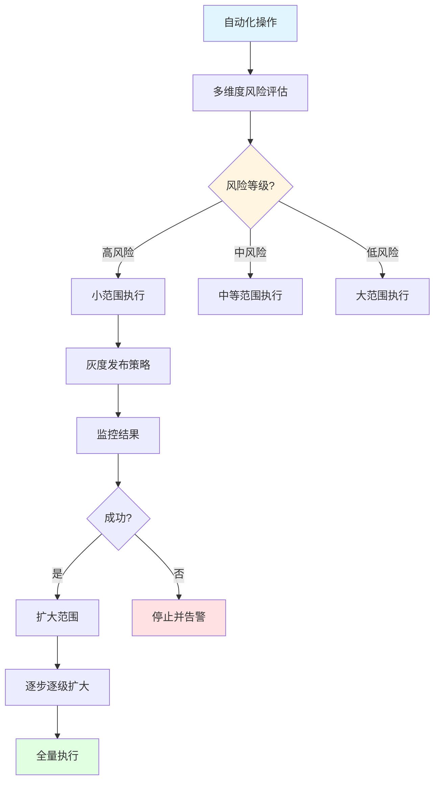

**风险评估维度**：
- 操作复杂度
- 影响范围
- 历史成功率
- 目标系统级别
- 变更敏感度等

**控制策略**：
- **高风险**：限制执行范围，类似灰度发布
  - 先小范围执行
  - 再扩大范围
  - 逐步逐级扩大
  - 防止一下摊开导致不可收拾
- **低风险**：允许较大范围执行

**实施计划**：2022年重点研究和实现

**必要性**：随着自动化程度越来越高，防范运维工具/平台可能造成的系统性、全局性风险，必将成为新的重要课题。

### 4.3 技术支持的温度问题

**发现的问题**：技术支持不仅仅是在做工作，也是人与人之间沟通和联系的需求。

**用户反馈**：
- 虽然工具很方便，但有些用户就是不用
- "我说你用iWen吧" - "我就不用，我就要给你打电话"

**深层原因**：

| 方面 | 说明 |
|------|------|
| **关系维护** | 单位大，很多人见面不认识，但电话沟通多了就熟悉（虽未谋面但觉得熟悉） |
| **情感需求** | 全通过工具沟通，运维人员脸上对着屏幕，感觉冷冰冰，运维没有温度 |
| **习惯偏好** | 有些人就是不喜欢工具形式，更喜欢人际交流 |

**反思**：
- 最开始想的不够周全
- 需要在技术和人文之间找到平衡
- 自动化不应该完全取代人际互动

### 4.4 创新与目标

**创新孵化项目机制**：
- 提供支持
- 做不出来也没事
- 鼓励尝试和探索

**神盾工程（十四五规划）**：
- 做出来后不是结束，要持续做得更好
- 挑战更长时间无人参与
- 持续改进和完善

## 五、智能化运维情况

华夏银行在无人化运维基础上，同步推进智能化运维建设。

### 5.1 动态基线监控

**实现方式**：人工智能算法

**功能**：
- 监控指标动态化
- 根据业务变化、时间变化自动修正
- 例如：判断当前时间点CPU 80%合适还是20%合适

**价值**：告别静态阈值，实现智能监控

### 5.2 故障根因定位

**两种实现方式**：

#### 1. 基于规则的根因定位

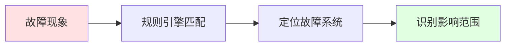

**技术栈**：
- 基于规则
- 6年运维积累的经验总结
- 文件传输系统主要采用此方式

**案例**：
- 红色：出问题的系统
- 蓝色：综合前置系统（服务总线）
- 两个业务系统通过服务总线访问目标系统
- 目标系统出问题，影响两个业务系统

**特点**：
- 对于故障现象不太复杂的场景，规则可能更快
- 需要平时积累
- 数据要求：历史数据即可

#### 2. 基于CMDB的故障画像

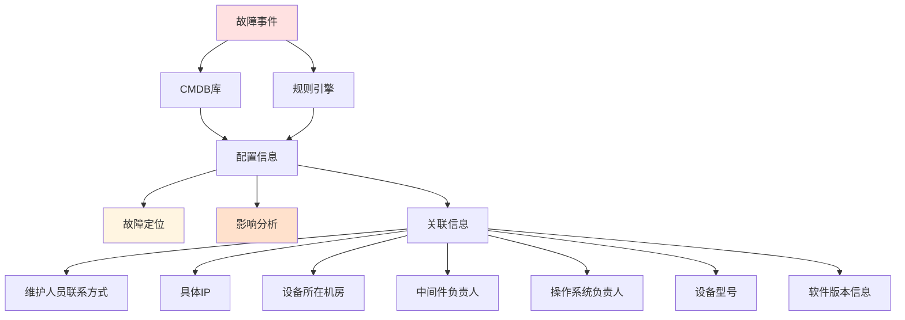

**技术栈**：
- 基于CMDB库
- 规则引擎（Drools开源规则引擎）

**优势**：
- 信息非常丰富
- 不仅定位问题点和影响系统
- 还能看到：
  - 维护人员联系信息
  - 具体IP地址
  - 设备所在机房
  - 各专业条线负责人
  - 操作系统、数据库、中间件负责人
  - 设备型号
  - 软件版本信息

**与规则定位的区别**：
- 规则定位：快速定位问题
- 故障画像：信息更全面，基于CMDB呈现

### 5.3 异常检测

**应用领域**：主要应用在日志异常检测

**实现方式**：商业化产品

**特点**：
- 智能运维由其他处室主要负责
- 参与较少，了解有限

### 5.4 智能化运维的基础

**经验教训**：
- 前几年AIOps很火，华夏银行花大精力买产品
- 结果发现：基础数据不够，算法模型跑不出效果
- 比较受打击

**成功案例**：
- 动态指标采用算法实现
- 原因：单个指标，横向联系性不强，只需要历史数据

**总结**：
- 日常积累非常重要
- 故障现象不太复杂时，规则可能更快更准
- 算法需要大量高质量的数据支撑

**监控的最终目标**：
- 为AIOps提供数据
- 数字化转型都是为了迎接智能化社会的到来
- 全面数字化是给AIOps提供原料
- 需要源源不断的数据满足其需求

## 六、经验与建议

### 6.1 无人化运维的适用场景

**考虑因素**：
- **复杂度**：操作复杂度和场景多样性
- **收益**：带来的改进是否明显
- **可控性**：是否有把握实现
- **必要性**：是否有大量操作需要处理

**评估标准**：
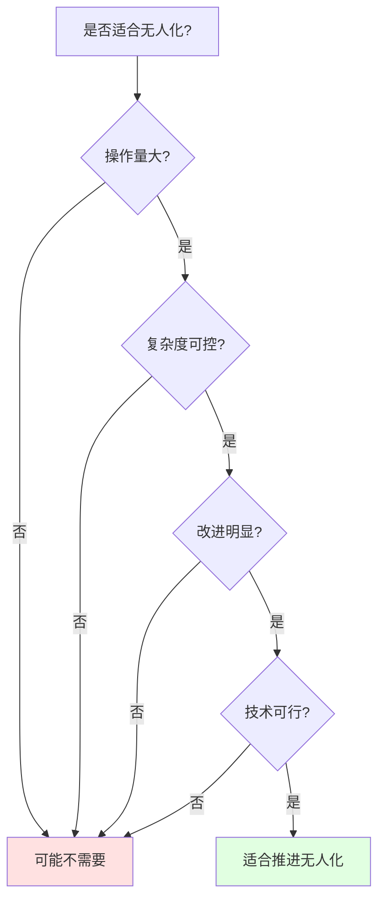

**华夏银行的选择**：
- 8人小团队处于超负荷状态
- 经常加班，压力大
- 扩人有各方面限制
- 因此选择推进无人化

**建议**：综合考虑，如果系统复杂、改进明显、技术可控，就可以推进。

### 6.2 自动化的边界

**有边界吗？** 有，但边界在不断移动。

**当前边界**：成本收益比

**未来趋势**：
- 肯定是越来越自动化
- 自动化的程度和范围越来越深
- 现在做不到只是因为技术或条件还不够

**文件传输系统的优势**：
- 一开始接手就做好了规范化
- 不像历史系统因历史原因难以统一
- 统一起来成本很高
- 各种场景判断和分析会很复杂

**结论**：规范化是自动化的基础，越规范自动化成本越低。

### 6.3 移动端生产变更的风险管控

**风险确实存在**，但有前提条件：

| 管控措施 | 说明 |
|----------|------|
| **人员限制** | 能启动操作的人员经过长期考察和检验 |
| **操作限制** | 移动端可做的操作非常有限 |
| **功能范围** | 只有应急操作（如重传文件、重启节点） |
| **禁止操作** | 删除配置等高危操作不支持 |
| **数量限制** | 即使是清理配置，也限制最多数量 |
| **风险评估** | 所有移动端操作都提前做过风险评估 |
| **损害可控** | 即使被利用，损害有限且能快速纠正 |
| **人员可靠** | 老员工不会为小事冒险 |

**监管态度**：监管也提醒存在风险，但在评估后认为可控。

### 6.4 故障自愈的原则

**核心原则**：不能具有二次伤害性

**可以自愈的场景**：
- 简单、固定、确定的场景
- 例如：目录权限被误改，自动改回（同时发通知告知）
- 风险有限的变更（如修改目录权限）

**不能自愈的场景**：
- 重启数据库（需当天值班领导审批才能做）
- 共享文件系统整个丢失（可能存储损坏或被误删，不自动创建或挂载）
- 重大操作至少还不放心

**检验方法**：
- 故障定位已做3年，每次检验准确性
- 影响分析模块上线3个月只做分析不做干预
- 每次都在应该干预时打标记但不执行
- 反复检验发现干预操作每次都正确，一次未出错
- 拿时间做检验后才启用

**监管视角**：
- 修改目录权限也算变更
- 重启数据库也算变更
- 需要重点分析风险差异

### 6.5 审批流程与无人化结合

**实现方式**：审批流程不动，自助服务页面嵌入审批流程

**具体流程**：

**关键点**：
- **以前**：IT服务平台填信息，具体需求以附件形式挂后面
- **现在**：改造页面，把自助申请页面嵌入流程
- **填写**：提交申请时逐项填写，完成后信息跟着流程走
- **审批时间调整**：
  - 申请时填写：今晚8点执行
  - 评审说：8点不行，要9点
  - 以审批时间为准（9点）
- **自动调度**：变更执行模块拿到审批时间后，到时自动执行

### 6.6 团队规模

**开发团队**：
- 开发人员：4人
- 负责人：1人（魏老师）
- 合计：5人

**运维团队转型**：
- 原8人小队慢慢减人
- 一部分人转做开发
- 一部分人转做其他项目
- 团队还有其他工作（不只文件传输系统）

### 6.7 底层技术选型

**文件传输系统**：
- **底层协议**：TCP协议（不是FTP，FTP现在不让用）
- **商业产品**：东方通的TongGDP
- **管理层**：大量自主开发的外挂式管理工具（包括魔方等）

**重试机制**：
- 在文件传输系统层实现
- 原因：与应用松耦合
- 应用只需把文件放在目录下
- 文件传输系统根据配置定时扫描和传输
- 类似邮箱：寄信人投完信就走，不用管后续

**优势**：
- 应用与文件传输系统耦合度非常低（几乎没有关系）
- 应用写完文件就不管了
- 文件传输系统负责可靠传输

## 七、关键要点总结

### 7.1 无人化运维三大核心技术

| 技术 | 核心思想 | 关键价值 |
|------|----------|----------|
| **操作原子化** | 有限的原子操作 + 灵活编排 = 应对无限场景 | 技术实现的基础 |
| **服务自助化** | 4大工具让用户自助，运维人员不参与 | 实现无人参与的关键手段 |
| **规范内置化** | 把管理规范嵌入工具逻辑 | 保证合规性，程序比人更规范 |

### 7.2 无人化运维的价值

**效率提升**：
- 27,000+次/年变更操作实现自动化
- 8人团队从超负荷工作中解放
- 处理成功率超过99%

**质量提升**：
- 程序不会变通、不偷懒
- 不会忘记或误操作
- 合规性比人工更好

**风险降低**：
- 减少人为失误
- 标准化处理
- 可追溯可回溯

### 7.3 需要注意的问题

**1. 风险管控**：
- 工具的便利性是双刃剑
- 需要风险量化和自动控制
- 防范系统性、全局性风险

**2. 能力保持**：
- 动手能力会下降
- 新员工成长变慢
- 需要混沌工程保持能力

**3. 人文关怀**：
- 技术支持不只是工作，也是人际沟通
- 运维需要温度
- 在技术和人文间找平衡

**4. 应急保障**：
- 不取消现场值守
- 每天至少一次人工核查
- Facebook事件的警示

### 7.4 成功要素

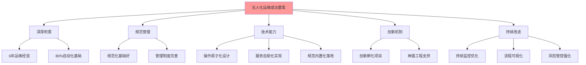

1. **深厚积累**：6年维护经验，摸透系统，80%自动化基础
2. **规范管理**：规范化做得好，自动化复杂度低
3. **技术能力**：三大核心技术的创新性设计和实现
4. **创新机制**：创新孵化项目和神盾工程的支持
5. **持续改进**：不断优化、监控、强化风险管控

### 7.5 未来展望

**短期目标**：
- 变更无人化全面上线
- 完成流程可视化
- 实现30天、60天、90天无人参与挑战

**中期目标**：
- 风险量化和自动控制系统上线
- 混沌工程常态化
- 推广到其他系统

**长期目标**：
- 自动化程度持续提升
- 与智能化运维深度融合
- 建立无人化运维标准和最佳实践

---

## 附录：Q&A精选

### Q1：无人化怎么平衡潜在风险和高效利用率的矛盾？
**A**：类似安全和便利性的平衡。华夏银行采取"先做后补"策略：
- 先在基本/主要安全条件下实现功能，提高效率
- 回头再仔细分析每一步风险
- 2022年重点研究防范全局性和系统性风险
- 在代码各层面都有检查和控制

### Q2：无人化运维一般要在什么规模体量下采用？
**A**：取决于复杂度和收益：
- 需要有大量操作
- 追求"最后一公里"的全面自动化
- 虽然人控制最后一公里大部分情况高效，但人有时间和状态限制
- 如果复杂度适中、改进明显、技术可控，就可以推进

### Q3：故障根因诊断与定位的分析方法具体是什么？
**A**：华夏银行主要基于规则：
- 6年积累，对各种现象和故障非常了解
- 智能化运维也以规则为主
- 前几年尝试AIOps，但基础数据不够，算法模型效果不好
- 动态指标用算法（单个指标、横向联系不强、只需历史数据）
- 故障定位等复杂场景仍以规则为主

### Q4：自动化程度有没有边界？
**A**：有边界，但边界在不断移动：
- 当前边界是成本收益比
- 技术趋势是越来越自动化，范围越来越深
- 现在做不到只是技术或条件还不够
- 文件传输系统优势：一开始就做好规范化，统一成本低
- 历史系统因历史原因难以统一，自动化成本就很高

### Q5：移动端处理生产变更是否存在风险？
**A**：存在风险，但可控：
- 能操作的人员经过长期考察和检验
- 移动端操作非常有限（重传文件、重启节点）
- 不支持高危操作（删除配置、大批量操作）
- 所有操作都提前做过风险评估
- 即使被利用，损害有限且能快速纠正
- 老员工不会为这点事冒险

### Q6：生产系统在智能化运维的自动化故障处理中如何管控风险？
**A**：
- 故障定位做了3年，持续检验准确性
- 影响分析模块上线3个月只做分析不做干预
- 反复检验发现操作每次都正确后才启用
- 拿时间做检验
- 自动化操作不能具有二次伤害性
- 重大操作（如重启数据库）不放在自愈列表

### Q7：监控的最终目标是否就是为AIOps提供数据？
**A**：认为是的：
- 数字化转型都是为迎接智能化社会的到来
- 前两年智慧城市、智慧社区、AIOps有点哑火，发现数据不够
- 数字化转型就是全面数字化，给AIOps提供原料
- 需要源源不断的数据满足需求
- AIOps像需要不断喂养数据的"恶魔"

---

**分享时间**：2022年（具体日期未提及）
**整理标注**：本文档基于ASR识别文本整理，部分专业术语已根据上下文纠正
**文档版本**：V1.0

