# 京东DevOps平台的建设与落地

> 来源：未核验 · 类型：分享 · 状态：draft


> 分享嘉宾：董璐 | 京东数科  
> 受众人群：SRE、运维及稳定性保障工程师

## 目录

- [一、DevOps平台建设的目标](#一devops平台建设的目标)
- [二、建设与落地过程中遇到的困难](#二建设与落地过程中遇到的困难)
- [三、平台建设策略](#三平台建设策略)
- [四、平台落地策略](#四平台落地策略)
- [五、Q&A精选](#五qa精选)

---

## 一、DevOps平台建设的目标

### 1.1 为什么要建设DevOps平台

> "如果外界的变化率超过了内部的变化率，那么末日就不远了。" —— 杰克·韦尔奇

对于IT行业而言，**迭代速度**是核心竞争力。当产品还没上线时，市场可能已被竞争对手占领。DevOps平台建设的本质是：

- **跟上市场变化的节奏**
- **提升研发交付速度**
- **保障产品质量和稳定性**

### 1.2 DevOps平台建设的四大目标

#### 1.2.1 保证质量

**核心理念：** 质量 = 按照既定要求达成目标

- **多角色参与：** 将研发过程中的所有角色（产品、研发、测试、运维）纳入平台
- **相互制约：** 每个阶段由对应角色负责，通过平台确认是否符合要求
- **节点反馈：** 从上一个节点反馈到下一个节点，形成质量闭环

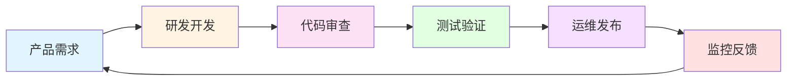

#### 1.2.2 提升效率

**四个维度的效率提升：**

##### a) 降低沟通成本

- **在线管理：** 将沟通结果落实到平台，共享信息
- **有据可依：** 逻辑、设计、风险、问题都有记录
- **减少重复沟通：** 避免问题确认、复盘、审计时的重复沟通成本

**成本对比：**
- 第一次沟通：初始成本
- 问题确认：重复沟通成本
- 故障复盘：追溯成本
- 审计监管：合规成本

##### b) 增加质量把控

集成质量管控工具，实现自动化：
- 自动化测试
- 代码扫描
- 漏洞检查
- 安全校验

##### c) 降低研发风险

通过平台规范和验证：
- 研发规范约束
- 分支策略管理
- 架构要求验证
- 自动化验证流程

##### d) 提升自动化水平

- **让机器做机器该做的事**
- **自动化越完善，效率越高**
- **人力成本得到节省**
- **最终目标：数字化运营**

#### 1.2.3 沉淀数据

将研发过程数据化，找到瓶颈和短板：

**数据维度：**

| 维度 | 指标 |
|------|------|
| **基础数据** | 需求、任务、Bug、发布记录 |
| **代码库动态** | 提交情况、发布情况、机械变化 |
| **构建过程** | 检查结果、外部依赖、服务间依赖 |
| **研发过程** | 提测频率、发布频率、代码质量 |
| **测试数据** | 自动化测试、功能测试、代码覆盖率 |

#### 1.2.4 辅助决策

通过数据分析：
- 找到研发瓶颈
- 识别团队短板
- 优化研发流程
- 提升团队能力

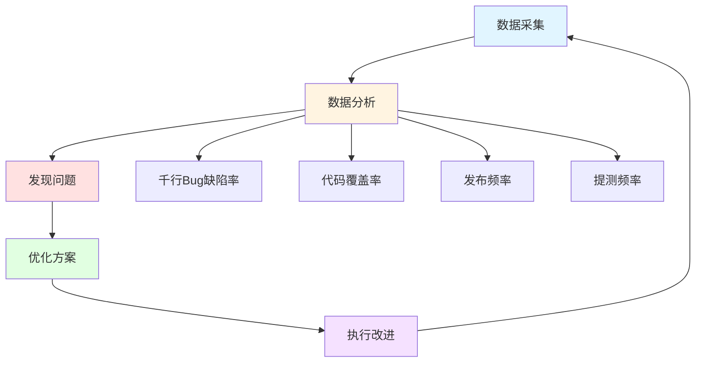

---

## 二、建设与落地过程中遇到的困难

### 2.1 历史包袱问题

DevOps平台建设通常发生在业务发展到一定阶段，历史问题普遍存在：

#### 2.1.1 代码托管分散

- 公司规模越大，现象越明显
- 多部门、多子公司各自搭建Git/GitLab
- 产品线下线后，代码位置不明

#### 2.1.2 线上无管控

- 之前可以自由上线
- 直接登录服务器发布
- 没有审批和记录流程

#### 2.1.3 研发过程不持续

工具繁杂且不统一：
- **测试工具：** 禅道、Jira、Excel等
- **发布工具：** Jenkins、脚本、手工上传
- **缺乏统一标准和流程**

#### 2.1.4 源码不可追溯

- 找不到项目源码
- 不清楚线上版本对应的代码Tag
- 缺乏版本管理规范

### 2.2 建设过程中的问题

#### 2.2.1 被需求牵着鼻子走

**常见误区：**
- 研发、测试、运维积极性高，提出大量需求
- 做得越多，要求越多，满意度反而越低
- 平台变成**工具仓库**，而非真正的平台

**问题本质：**
- 只是在集成工具，没有建设平台
- 缺乏统一规则和标准
- 没有数据沉淀和价值产出

#### 2.2.2 缺乏产品视角

- 应该成为**游戏规则的制定者**
- 需要统一标准和玩法
- 要有数据沉淀和价值体现

### 2.3 落地过程中的问题

#### 2.3.1 领导关注点不匹配

**领导关心的问题：**
- 每个研发团队的代码提交量和趋势
- 哪些项目进展快，哪些质量好
- 源码和需求的关联性
- 项目进展与计划的匹配度

**平台建设者关注的：**
- 功能实现
- 工具集成
- 流程打通

#### 2.3.2 项目迁移阻力大

**迁移成本：**
- 需要改变研发过程
- 从散养到规范化
- 增加流程和约束

**用户抵触情绪：**
- 之前随便拉代码就能工作
- 现在需要走流程、走立项
- 规则太松散没效果，太严谨没用户

**常见冲突点：**

| 散养阶段 | DevOps平台要求 |
|---------|---------------|
| 无需立项 | 需要项目立项 |
| 代码随意存放 | 统一代码托管 |
| 自由发布 | 审批流程 |
| 无质量检查 | 强制质量门禁 |

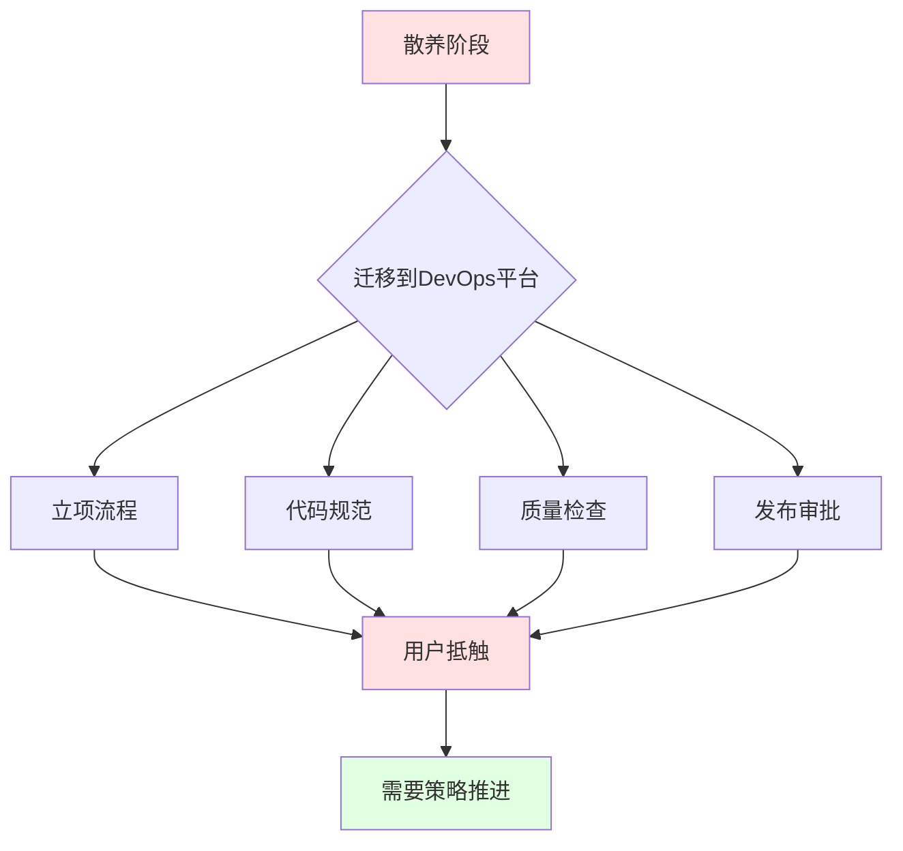

---

## 三、平台建设策略

### 3.1 建立产品视角

**核心理念：** DevOps平台不是业务平台，但需要全局的产品视角

#### 3.1.1 研发流程抽象

标准研发流程：
```
产品需求 → 组会确认 → 可行性评估 → 排期 → 研发迭代 → 测试验证 → 发布上线
```

**关键点：**
- 明确主流程
- 所有工作在主流程上进行
- 不同阶段有不同节点
- 平台是产品，需要持续迭代

### 3.2 京东数科的建设路线

#### 3.2.1 三阶段演进模型

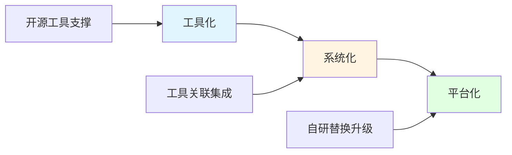

#### 阶段一：工具化

**目标：** 用开源工具支撑研发、测试、运维需求

**策略：**
- 不抵触工具化
- 充分利用工具
- **选择大众化工具**（为后续系统化做准备）
- 避免使用小众工具（可能无接口、难集成）

**常用工具：**
- 代码管理：GitLab
- 持续集成：Jenkins
- Bug管理：Jira、禅道
- 发布部署：Ansible

#### 阶段二：系统化

**目标：** 打通工具集，完成不同阶段的工具统一

**核心工作：**

##### a) 统一工具选型

**示例：Bug管理工具选择**
- 禅道 vs Jira：选择其一
- 不是哪个更好的问题
- **由平台建设方统一决策**
- 避免数据分散，便于后续推进

##### b) 工具对接集成

- 松散的工具没有灵魂和凝聚力
- 通过接口、文件、数据库层面打通
- 让整个过程转起来
- 完成系统化转变

**工具集成示例：**

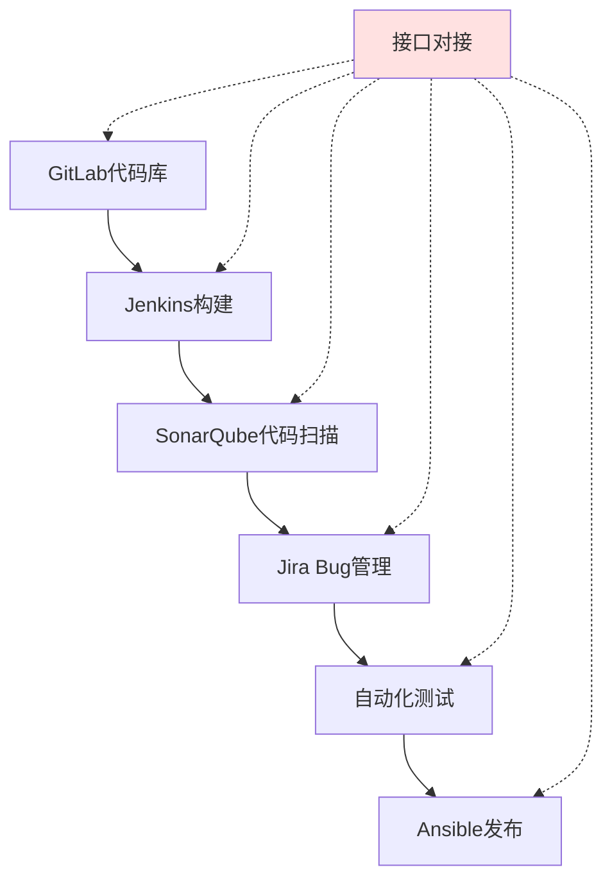

#### 阶段三：平台化

**目标：** 工具不再重要，信息流才是核心

**核心工作：**

##### a) 替换和自研

- 工具组件已成型
- 该替换的中间件和工具要替换
- 该自研的要自研
- **不能被工具局限**

##### b) 流程优化

- 让每个环节协作起来
- 整个研发过程更加平台化
- 通过沉淀数据创造价值

##### c) 价值体现

**平台化的价值：**
- 保证质量
- 提升效率
- 价值反馈
- 数据分析
- 流程优化

**数据价值链：**

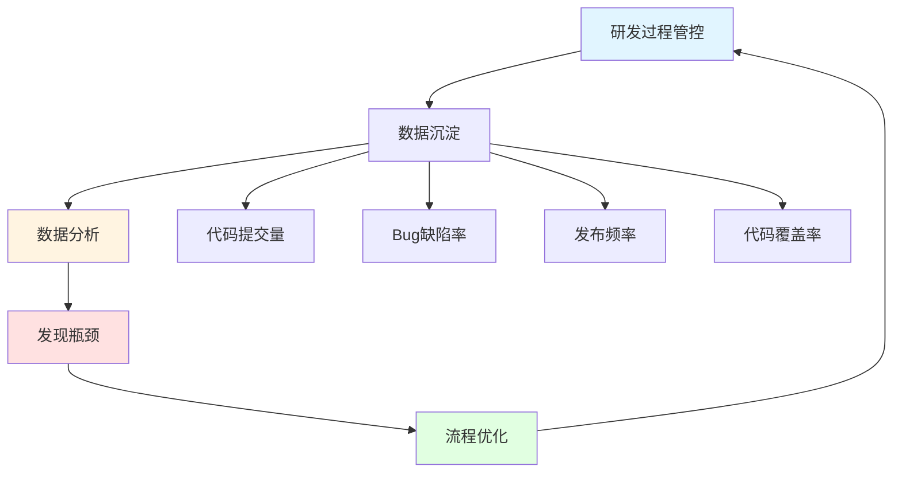

### 3.3 建设要点总结

**关键原则：**

1. **工具化阶段：** 选择大众化工具，为后续发展铺路
2. **系统化阶段：** 统一工具，打通环节，依据产品设计集成
3. **平台化阶段：** 替换自研，流程优化，数据驱动

**避免的坑：**
- ❌ 使用小众工具（难集成、难维护）
- ❌ 只做工具集成，不做产品设计
- ❌ 停留在工具化阶段，无数据沉淀
- ❌ 被用户需求牵着走，失去方向

---

## 四、平台落地策略

### 4.1 培训宣贯

DevOps平台建设 = 研发规范制定过程

#### 4.1.1 培训内容

##### a) 分支策略培训

**常见分支策略：**
- 分支研发
- 多分支并行
- 主干开发

**培训要点：**
- 为什么要这样做？
- 好处是什么？
- 应该怎么用？

##### b) 质量检查培训

- 检查哪些方面的内容
- 在什么时间点采集数据
- 分析依据是什么

##### c) 安全校验培训

- 遇到问题如何处理
- 如何优化工程满足规则

##### d) 研发流程培训

- 谁负责什么
- 每个环节的任务是什么
- 实操演示

#### 4.1.2 培训的重要性

**DevOps平台的特点：**
- 不像电商、新闻类App那样简单直观
- 有一定的使用门槛
- 需要理解流程和规范

**平台建设者的责任：**
- 有责任和义务告诉用户怎么做
- 明确每个节点的职责
- 提供清晰的操作指南

### 4.2 铁腕政策

> ⚠️ **前提条件：** 平台具有一定成熟度和稳定性

#### 4.2.1 限期迁移，强制推广

**实施要点：**
- 平台必须稳定（否则是给领导挖坑）
- 获得领导支持
- 设定明确的迁移时间表
- 提供迁移支持

**注意事项：**
- 平台不稳定时要"怂一点"
- 不能让领导和用户背锅
- 确保平台不掉链子

#### 4.2.2 规范化调整，偿还技术债

**京东数科的实践：** 项目迁移时必经之路

**典型问题：快照包发布**

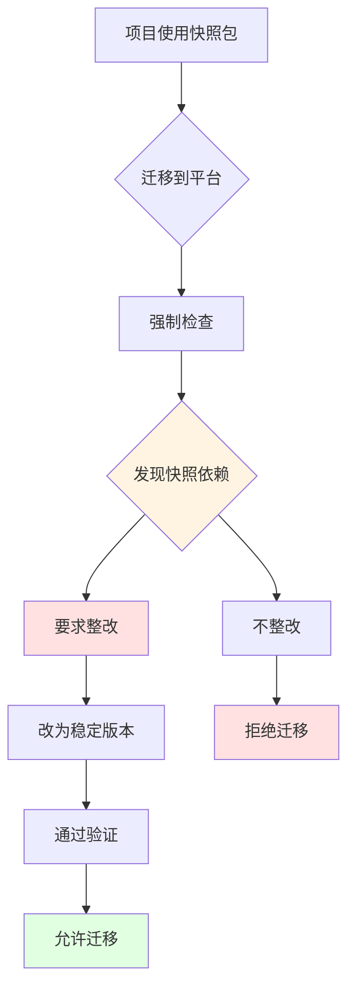

**问题严重性：**
- 快照包不稳定
- 可能在不知情的情况下更新
- 导致线上问题

**解决方案：**
- 迁移时强制检查
- 发现问题必须改掉
- 不能心慈手软

#### 4.2.3 全面检查

**检查维度：**

| 检查项 | 目的 | 要求 |
|--------|------|------|
| **规范化检查** | 代码规范、依赖规范 | 必须符合标准 |
| **代码质量** | 建立质量基线 | 起点就要控制好 |
| **安全扫描** | 发现安全隐患 | 不符合必须调整 |
| **架构检查** | 架构合理性 | 符合公司标准 |

**理念：**
- 在起点就控制好质量
- 避免"先上平台，再优化"
- "再优化"往往遥遥无期

#### 4.2.4 与绩效挂钩

**适用场景：**
- 迫不得已的措施
- 国企、事业单位用得较多
- 互联网公司较少使用

**使用原则：**
- 尽量不要用（DevOps团队和研发团队是一家人）
- 仅在多次沟通无效时考虑
- 需要配合，而非对抗

#### 4.2.5 树立榜样项目

**重要性：** ⭐⭐⭐⭐⭐ 最重要的策略

**榜样项目的选择标准：**
- 具有代表性
- 团队愿意配合
- 乐于接受改变

**榜样项目的价值：**

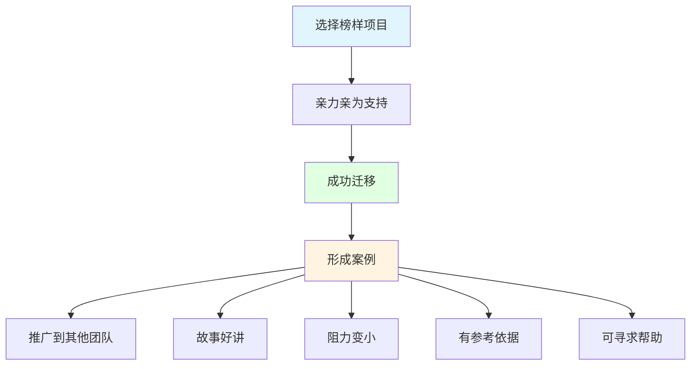

**实施策略：**
- 重点照顾试点团队
- 亲力亲为帮助迁移
- 形成成功案例
- 以点带面，逐步推进

**好处：**
- 降低推广阻力
- 提供参考案例
- 理直气壮推广
- 检验平台能力

### 4.3 落地策略总结

**软硬兼施的组合拳：**

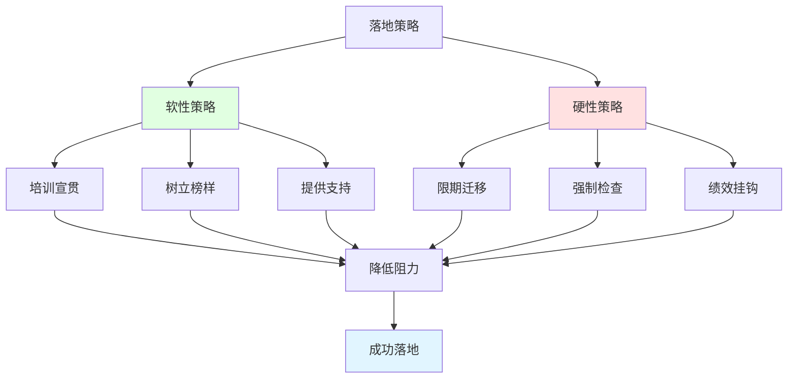

**难啃的骨头怎么办？**

- 正视客观困难
- 遵循二八原则：照顾80%的团队
- 对20%的特殊情况，提供引导而非强制
- 开辟特殊通道，保证基本流程
- 不强求完全规范化

**落地比建设更难的原因：**
- 建设：与平台、技术打交道（可控）
- 落地：与人、组织打交道（不可控）
- 需要更多的沟通和协调能力

---

## 五、Q&A精选

### 5.1 技术实现类

#### Q1：如何实现一键创建开发测试环境？

**实现方案：**

1. **工程初始化配置**
   - 部署模式（Tomcat等）
   - JDK版本
   - 部署路径（统一规范）
   - 日志输出路径

2. **机器分配**
   - 自动分配机器（理想状态）
   - 手动申请机器并填写IP
   - 向运维团队申请权限

3. **远程部署**
   - 通过SSH通道登录机器
   - 推送部署包
   - 启动服务
   - 检查并反馈结果


#### Q2：代码扫描工具用什么？

**常用工具：**
- **SonarQube：** 最常见，接口集成方便
- **Coverity：** 商业采购，功能强大
- **Black Duck：** 开源组件安全扫描

**集成方式：**
- 通过接口形式集成
- 采集结构化扫描数据
- 反馈到研发平台
- 部分缺陷直接转成Bug

#### Q3：数据隔离是怎么实现的？

**问题场景：**
- Jenkins、SonarQube等工具用户数据互相透明

**解决方案：**

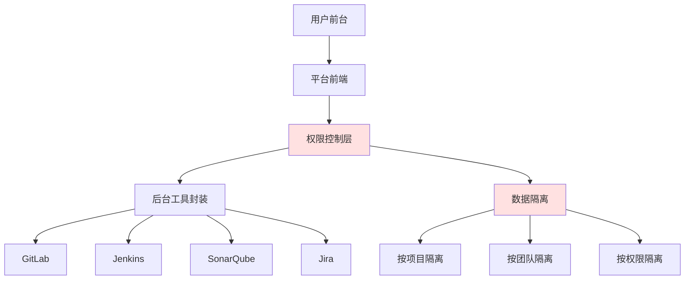

**实施要点：**
- 不让用户直接访问工具
- 自己做前台，工具封装到后台
- 通过接口触发工具
- 在平台前端展示数据
- 工具作为底层能力支撑

#### Q4：有没有标准的开源DevOps平台？

**现状分析：**
- 没有覆盖全流程的一站式开源平台
- 各工具专注于特定领域
- 需要自己集成和定制

**工具专注领域：**
- Jenkins：构建、编译、部署
- SonarQube：代码质量
- Jira/禅道：项目管理
- Ansible：自动化运维

**建议：**
- 初期使用开源工具组合
- 逐步集成形成系统
- 最终需要自研完成平台化

### 5.2 流程设计类

#### Q5：开发完成后如何自动转为测试环节？

**理想 vs 现实：**

| 场景 | 可行性 | 说明 |
|------|--------|------|
| 代码提交自动部署测试环境 | ✅ 可行 | 通过流水线实现 |
| 代码提交自动触发测试 | ⚠️ 理想化 | 需要人为判断 |
| 开发环节自动流转测试 | ❌ 不建议 | 必须人为触发 |

**推荐方案：**

1. **自定义流水线**
   - 每次提交代码更新测试环境
   - 通过GitLab Webhook触发
   - 自动编译部署

2. **人为触发测试**
   - 开发完成后手动触发
   - 不依赖自动化机制
   - 保持流程可控

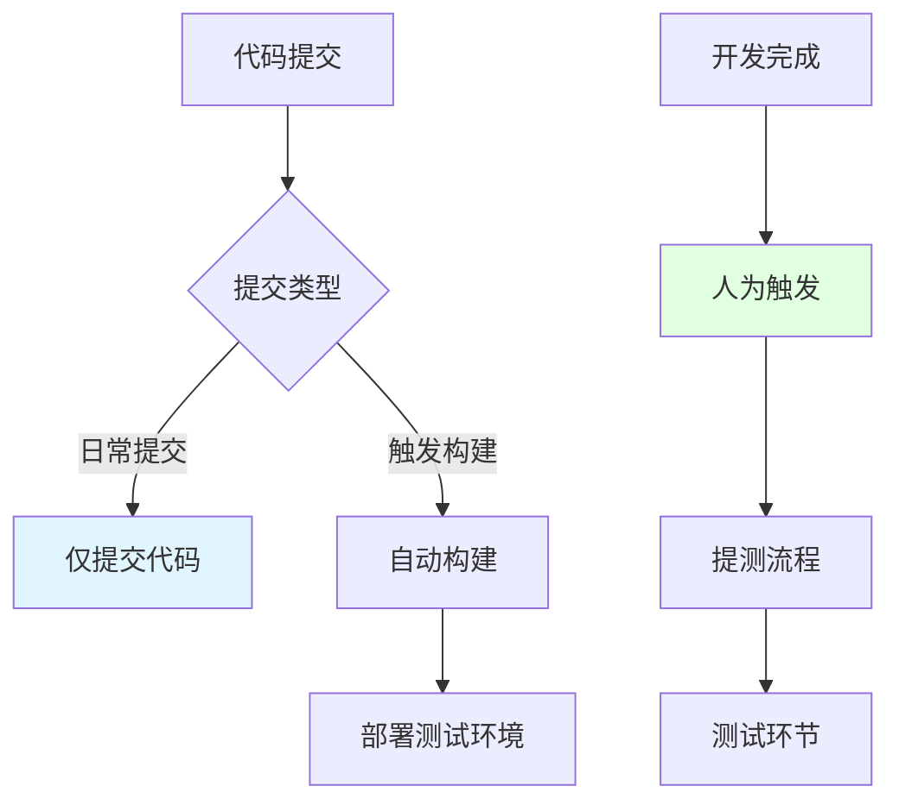

#### Q6：多团队多分支并行开发怎么做？

**场景一：独立功能并行开发**

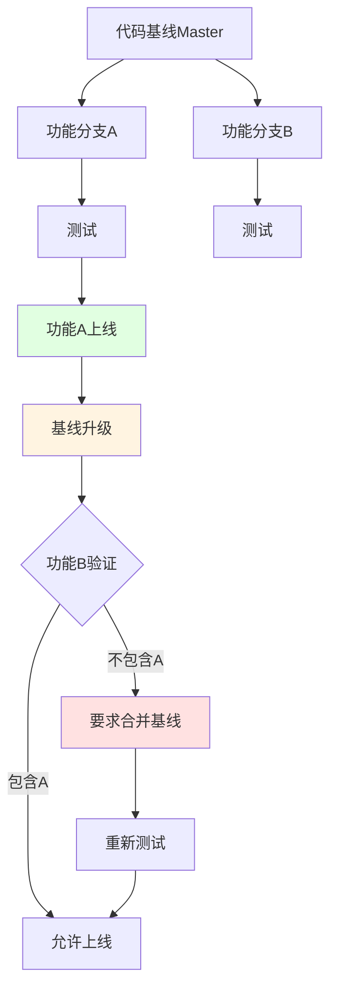

**实施要点：**
- 从基线拉取各自开发分支
- 可以并行测试
- **上线必须单通道**（先后顺序）
- 后上线的必须包含先上线的功能
- 不符合要求需要合并基线

**场景二：关联功能一起上线**

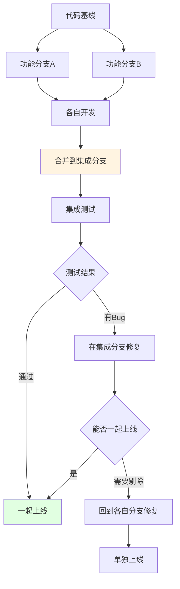

**实施要点：**
- 各自开发，合并到集成分支
- 在集成分支测试
- Bug在集成分支修复
- 如需剔除功能，回到各自分支处理

#### Q7：流水线是什么？如何实现？

**流水线定义：**
- 自动化串联研发过程各个节点
- 通过输入输出状态自动流转
- 支持人工介入和自动化跳转

**流水线架构：**


**节点类型：**

1. **自动化节点**
   - 规则检查
   - 代码扫描
   - 构建编译
   - 自动化测试

2. **人工介入节点**
   - 上线审批
   - 重要决策点

**触发机制：**
- 代码提交触发
- 定时触发（如每晚更新测试环境）
- 手动触发
- 上游节点触发

**流转规则：**
- 基于输出结果判断
- 正则匹配
- 阈值判断（如高级缺陷<5个）
- 人工审批

**实现要点：**

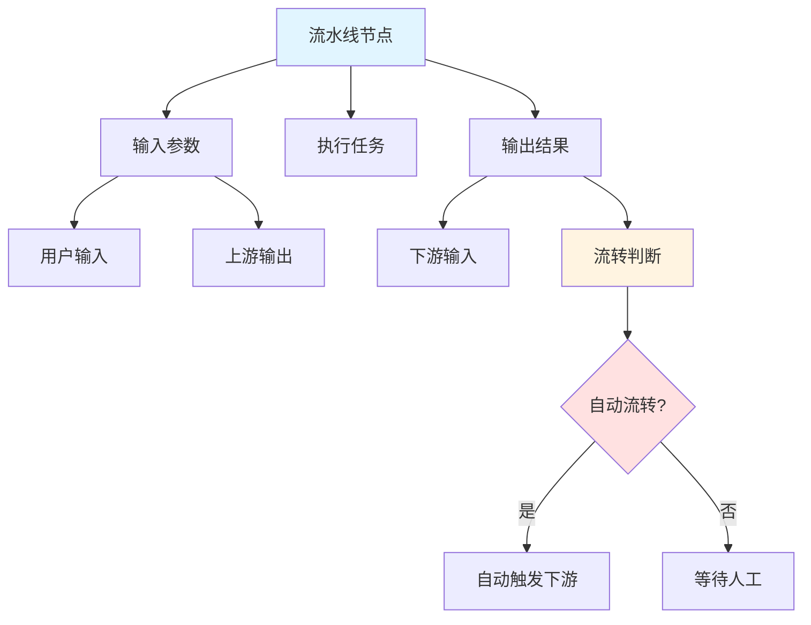

**难点：测试环节**
- 需要强大的自动化测试能力
- 测试结果是否敢直接上线？
- 大部分情况需要人工check

**简单流水线示例：**
- 代码提交 → 自动构建 → 自动部署测试环境
- 定时任务 → 检查代码变化 → 更新测试环境

#### Q8：多服务场景下，每个服务都要独立的Pipeline吗？

**用户视角：** 独立的Pipeline

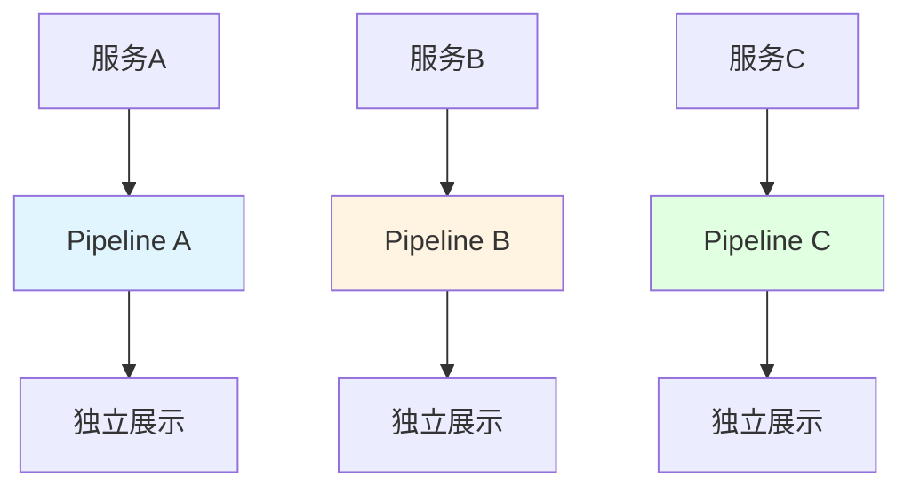

**平台实现：** 共用底层

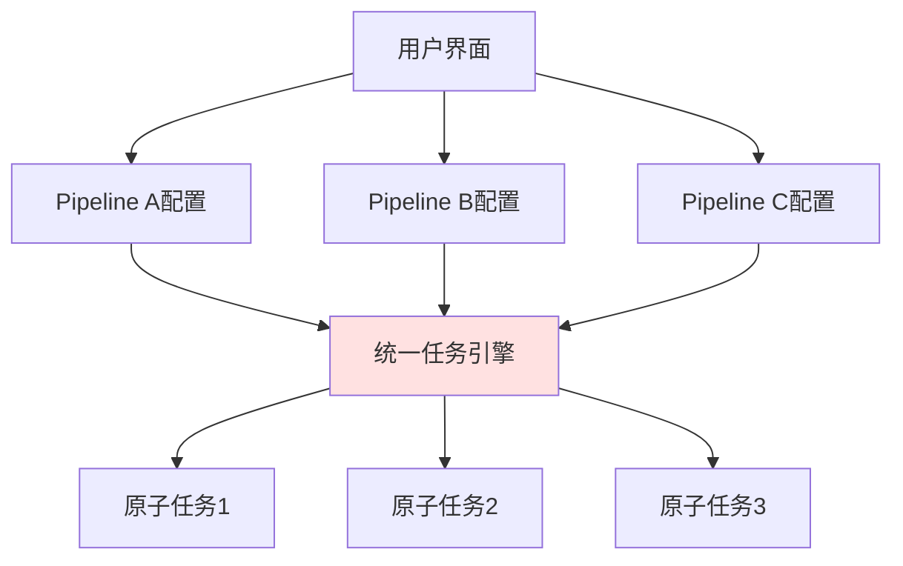

**实施原则：**
- **用户侧：** 每个服务独立Pipeline，清晰直观
- **平台侧：** 共用底层任务引擎，参数化配置
- **好处：** 用户体验好，平台易维护

**避免的坑：流水线组互相调用**
- Pipeline A触发Pipeline B
- Pipeline B触发Pipeline C、D、E
- 问题：难以追溯触发源，难以排查问题

#### Q9：接口自动化测试的数据如何生成？

**数据生成策略：**

1. **规则化生成**
   - 通过正则表达式定义规范
   - 动态生成符合规范的数据
   - 类似Mock Server

**示例：**
```
字段：用户ID
规范：64位随机字符串，仅字母和数字，必须字母开头
生成：aB3dE9fG2hJ4kL6mN8pQ1rS5tU7vW9xY0zA2bC4dE6fG8hI0jK2lM4nO6pQ8rS0tU
```

2. **环境依赖**
   - 上游服务提供联调环境
   - 多套测试环境：功能迭代环境、联调环境
   - 类生产环境
   - 灰度/预发环境

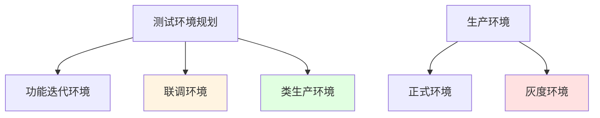

3. **多服务一键生成**
   - 快速搭建整套环境
   - 4-5十个服务一键部署
   - 环境隔离
   - 互相调度完成产品功能

**原则：**
- 自己负责自己的测试数据
- 不能要求为上游服务生成数据
- 依赖上游提供稳定的联调环境

### 5.3 架构设计类

#### Q10：生产平台和开发测试要分开吗？

**取决于安全要求**

**网络架构设计：**

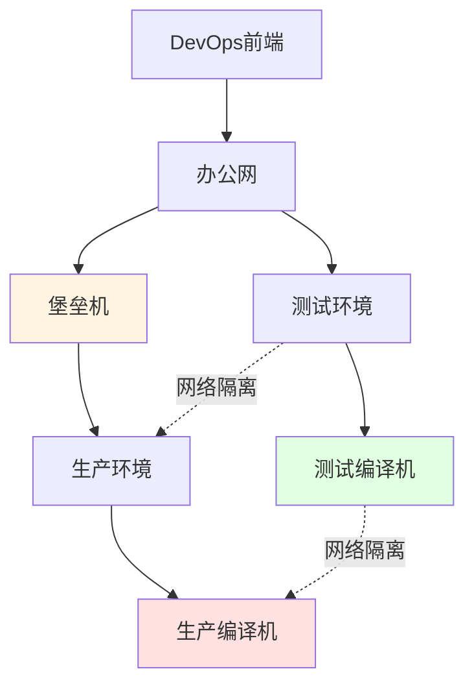

**实施方案：**

| 层面 | 测试环境 | 生产环境 | 说明 |
|------|---------|---------|------|
| **网络** | 办公网可直达 | 通过堡垒机 | 网络隔离 |
| **服务端** | 独立编译机 | 独立编译机 | 物理隔离 |
| **前端** | 统一平台 | 统一平台 | 用户无感知 |
| **执行** | 测试环境机器 | 生产环境机器 | 自动路由 |

**关键点：**
- 后端服务必须分开（网络隔离）
- 前端可以统一（用户体验）
- 通过网络规划实现安全隔离
- 用户无感知切换

#### Q11：DevOps平台需要管理Bug吗？

**看阶段和诉求**

**Bug管理的价值：**

1. **迭代管理**
   - 知道每次迭代要处理的问题
   - 知道每次迭代产生的新问题
   - 统计Bug产生和修复数量

2. **能力度量**
   - 千行Bug缺陷率
   - 研发团队能力验证
   - 测试团队能力验证

3. **质量分析**
   - 代码覆盖率
   - Bug分布
   - 个人Bug情况

```mermaid
graph TD
    A[Bug管理] --> B[迭代管理]
    A --> C[能力度量]
    A --> D[质量分析]
    
    B --> E[问题追踪]
    C --> F[千行缺陷率]
    D --> G[代码覆盖率]
    
    E --> H[数据价值]
    F --> H
    G --> H
    
    H --> I[平台价值体现]
    
    style A fill:#e1f5ff
    style H fill:#fff4e1
    style I fill:#e1ffe1
```

**是否优先实现：**
- 如果是当前优先问题 → 处理
- 如果不是 → 关注其他优先级更高的功能
  - 自动化构建
  - 编译部署
  - 规则检查
  - 持续集成

**结论：**
- Bug管理有必要，但看优先级
- 只有Jenkins + GitLab ≠ DevOps平台
- 完整的DevOps平台需要覆盖全流程

### 5.4 落地推广类

#### Q12：最难缠的不配合部门是怎样的？

**典型特征：**
- 用冠冕堂皇的理由拒绝
- 业务时间紧、进度要求高
- 无法反驳但明知应该做

**应对策略：**

```mermaid
graph TD
    A[遇到难缠部门] --> B{评估情况}
    B -->|客观困难| C[理解并引导]
    B -->|找借口| D[不过度纠缠]
    
    C --> E[提供替代方案]
    D --> F[遵循二八原则]
    
    E --> G[保证基本流程]
    F --> H[照顾80%团队]
    
    G --> I[逐步引导]
    H --> I
    
    style C fill:#e1ffe1
    style F fill:#fff4e1
```

**原则：**
- 遵循二八原则，帮助80%的团队
- 对20%特殊情况，引导而非强制
- 正视客观困难（历史包袱、技术债）
- 提供替代方案，保证基本流程
- 不强求完全规范化

**理解困难：**
- 接手项目时已经有问题
- 改造成本确实很大
- 业务压力确实存在

#### Q13：小公司从零搭建DevOps有哪些步骤？

**阶段一：基础工具搭建**

```mermaid
graph LR
    A[开始] --> B[搭建GitLab]
    B --> C[搭建Jenkins]
    C --> D[搭建Jira/禅道]
    D --> E[搭建Ansible]
    E --> F[基础能力具备]
    
    style F fill:#e1ffe1
```

**能力覆盖：**
- GitLab：代码管理
- Jenkins：构建、编译、自动部署测试环境
- Jira/禅道：Bug管理
- Ansible：发布部署

**阶段二：持续集成**

1. **分支策略**
   - 在代码库配置分支策略
   - Jenkins验证分支策略
   - 实现持续迭代

2. **工具集成**
   - Jenkins集成Jira插件
   - 与测试团队关联

**阶段三：系统化（有人力时）**

1. **工具集成**
   - 通过接口集成各工具
   - 打通数据流

2. **前端封装**
   - 封装统一前端
   - 工具作为底层能力
   - 形成小型DevOps平台

**注意事项：**
- 不能一直依赖Jenkins
- 很多逻辑用脚本实现，难以维护
- 异常难以捕获
- 后期考虑自研构建编译组件

**推荐工具组合（小公司）：**
- 代码：GitLab
- 构建：Jenkins
- Bug：Jira/禅道
- 部署：Ansible
- 扫描：SonarQube

---

## 六、总结与思考

### 6.1 核心要点回顾

#### 建设方面

1. **建立产品视角**
   - DevOps平台是产品，不是工具集
   - 需要全局规划和设计
   - 持续迭代演进

2. **三阶段演进**
   - 工具化：选择大众化工具
   - 系统化：打通工具，统一标准
   - 平台化：自研替换，数据驱动

3. **避免误区**
   - 不要被需求牵着走
   - 不要只做工具集成
   - 要有规则和数据沉淀

#### 落地方面

1. **软性策略**
   - 培训宣贯
   - 树立榜样
   - 提供支持

2. **硬性策略**
   - 限期迁移
   - 强制检查
   - 偿还技术债

3. **灵活应对**
   - 二八原则
   - 理解困难
   - 逐步引导

### 6.2 关键成功因素

```mermaid
graph TD
    A[DevOps平台成功] --> B[平台稳定]
    A --> C[领导支持]
    A --> D[榜样项目]
    A --> E[培训到位]
    A --> F[规则合理]
    
    B --> G[用户信任]
    C --> G
    D --> G
    E --> G
    F --> G
    
    G --> H[成功落地]
    
    style A fill:#e1f5ff
    style G fill:#fff4e1
    style H fill:#e1ffe1
```

### 6.3 最后的建议

**对于建设者：**
- 保持产品思维
- 不要急于求成
- 先稳定再推广
- 数据驱动优化

**对于推广者：**
- 软硬兼施
- 榜样先行
- 理解困难
- 持续支持

**对于使用者：**
- 理解平台价值
- 配合规范要求
- 提供真实反馈
- 共同成长

---

## 附录

### A. 常用工具对比

| 类别 | 工具 | 优势 | 劣势 | 适用场景 |
|------|------|------|------|----------|
| **代码管理** | GitLab | 功能全面，社区活跃 | 资源消耗大 | 中大型团队 |
| | GitHub | 生态好，易用 | 私有部署成本高 | 开源项目 |
| **持续集成** | Jenkins | 插件丰富，灵活 | 配置复杂 | 各种规模 |
| | GitLab CI | 与GitLab集成好 | 功能相对少 | GitLab用户 |
| **Bug管理** | Jira | 功能强大，可定制 | 复杂，需要培训 | 大型团队 |
| | 禅道 | 简单，中文友好 | 功能相对简单 | 中小型团队 |
| **代码扫描** | SonarQube | 开源，规则丰富 | 需要维护 | 各种规模 |
| | Coverity | 功能强大 | 商业软件，成本高 | 大型企业 |
| **部署工具** | Ansible | 无Agent，易用 | 性能一般 | 中小规模 |
| | Saltstack | 性能好 | 学习曲线陡 | 大规模部署 |

### B. 分支策略对比

| 策略 | 特点 | 优势 | 劣势 | 适用场景 |
|------|------|------|------|----------|
| **Git Flow** | 多分支并行 | 流程清晰 | 复杂度高 | 版本发布型产品 |
| **GitHub Flow** | 主干+特性分支 | 简单快速 | 不适合多版本 | 持续部署 |
| **Trunk Based** | 主干开发 | 集成频繁 | 要求高 | 成熟团队 |

### C. 关键指标定义

| 指标 | 定义 | 计算方式 | 目标值 |
|------|------|----------|--------|
| **千行缺陷率** | 每千行代码的Bug数 | Bug数 / 代码行数 × 1000 | < 1 |
| **代码覆盖率** | 测试覆盖的代码比例 | 覆盖代码行数 / 总代码行数 × 100% | > 80% |
| **发布频率** | 单位时间内的发布次数 | 发布次数 / 时间周期 | 按需 |
| **提测频率** | 单位时间内的提测次数 | 提测次数 / 时间周期 | 按需 |
| **构建成功率** | 构建成功的比例 | 成功次数 / 总次数 × 100% | > 95% |

---

**文档版本：** v1.0  
**整理日期：** 2024  
**分享来源：** 京东数科 DevOps实践分享

---

> 💡 **核心观点：** DevOps平台建设难，落地更难。需要产品思维、技术能力、推广策略的三位一体，才能真正发挥价值。

> ⚠️ **关键提醒：** 平台不稳定时不要强推，先做好榜样项目，再逐步推广。

> 🎯 **最终目标：** 不是建设一个工具集，而是打造一个能够沉淀数据、驱动优化、持续演进的研发效能平台。
