# 货拉拉一站式DevOps平台持续集成流水线

> 来源：未核验 · 类型：分享 · 状态：draft

## 分享概述

**议题要点:**
1. 介绍货拉拉一站式 DevOps 平台的演进历程
2. 分享基于 GitLab-CI 打造云原生持续集成流水线的最佳实践
3. 探讨 DevOps 平台如何适应研发团队的复杂性和技术差异性
4. 结合实例,提供行之有效的 DevOps 交付流程保质提效方案

**目标受众:** SRE、运维及稳定性保障工程师

---

## 一、货拉拉一站式 DevOps 平台演进历程

### 1.1 DevOps 核心理念

DevOps 是发展自敏捷实践的方法论,其核心目标是:
- **提升交付效率**
- **提升交付质量**

DevOps 实践的核心是**自动化与流水线**,通过自动化和流水线式作业,将开发与运维两大部分串联起来,形成循环,实现高效可靠的持续交付。

### 1.2 平台演进三阶段

#### 阶段一: 零能力阶段 (早期)
- **特点:** 与大部分初创公司类似,交付基本靠手动
- **问题:** 效率低下,人工操作易出错
- **状态:** 基本无自动化能力

#### 阶段二: 工具化阶段 (第一代平台)
- **平台名称:** LBoss 平台
- **核心能力:** 集成基础能力到平台
- **交付方式:** 以工具为主
- **局限性:** 仍有很多业务场景平台无法覆盖,需要人工交付

#### 阶段三: 标准化与持续交付阶段 (2.0 平台,2020年左右)

**核心改进:**

1. **引入应用为载体的 DevOps 体系**
   - 将应用与服务关联,提供最小业务能力
   - 应用作为交付和运维的最小单元
   - 通过应用串联 DevOps 的每个环节

2. **全面标准化**
   - 服务标准化
   - 云资源标准化
   - 研发流程标准化
   - 历史技术债大规模治理
   - 全站稳定性巨大提升

3. **工具链整合**
   - 引入开源和自研工具
   - 具备核心工具链串联能力
   - 一定程度实现持续交付能力

#### 阶段四: 一站式研发门户 (3.0 平台,当前)

**升级背景:**
- 业务快速增长
- 团队迅速膨胀
- 需要更强的自定义能力

**核心目标:**
- 打造一站式研发门户
- 不同角色用户高效协同
- 一站搞定需求开发、测试、部署、运维等所有诉求
- 具备应用全生命周期管理能力

**关键特性:**
- 核心基础能力优化升级
- 引入流水线,提升自定义和自动化能力
- 以更开放的姿态与用户共建生态
- 今年中旬完成所有应用迁移

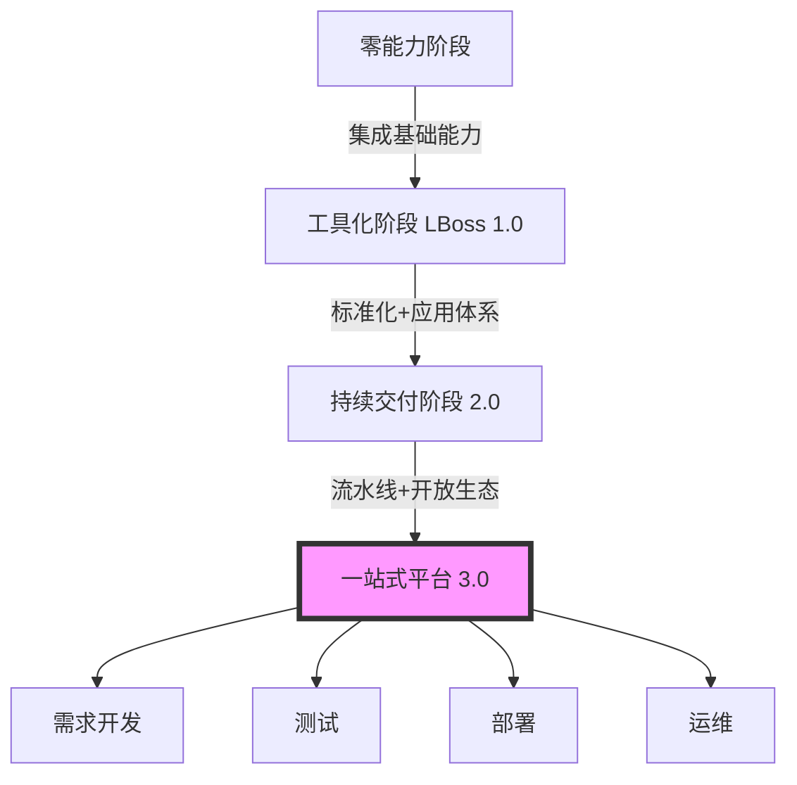

### 1.3 平台整体架构

平台分为三层架构:

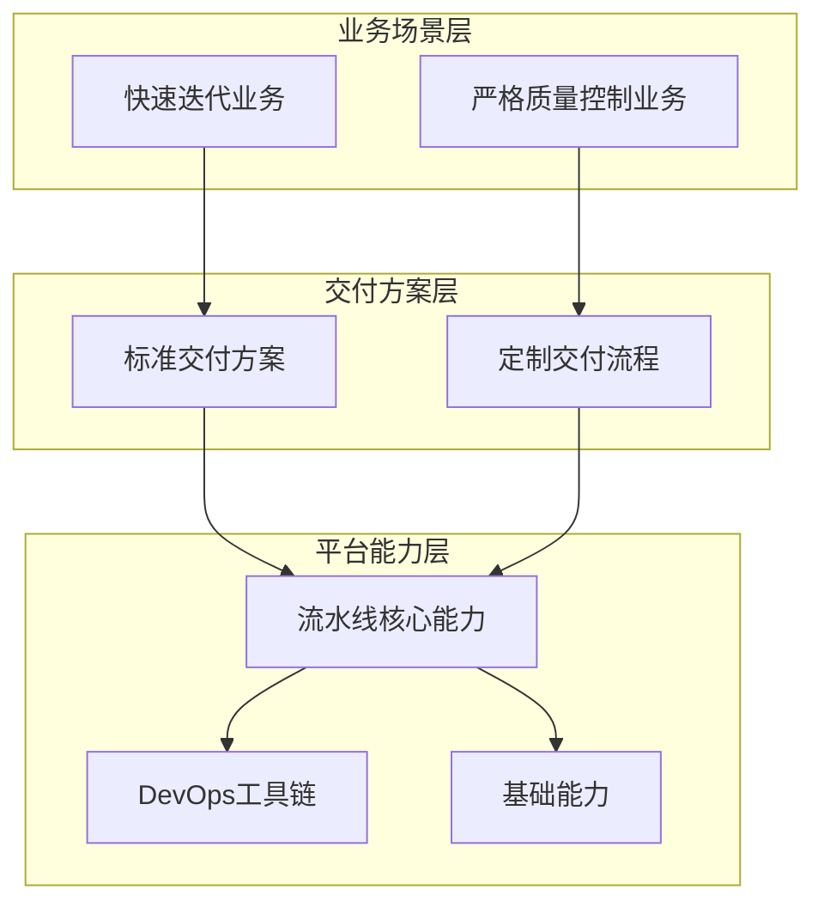

**层级说明:**
- **业务场景层:** 不同业务类型,有的需要快速迭代试错,有的需要严格质量把控
- **交付方案层:** 针对不同业务类型提供不同交付方案,支持业务部门定制交付流程
- **平台能力层:** 核心是流水线,围绕 DevOps 各领域的工具链和基础能力

---

## 二、基于 GitLab-CI 打造云原生持续集成流水线

### 2.1 升级驱动因素

#### 用户侧挑战
- **业务快速增长,团队迅速膨胀**
- 工程师水平参差不齐
- 团队间技术栈差异
- 服务架构差异
- 工作模式差异
- 平台交付流程和效率无法适应业务需求

**解决思路:**
- 平台聚焦核心工具和能力打磨
- 开放更多自定义能力赋能业务
- 支持业务特定自定义场景

#### 平台侧挑战
- **构建能力不完整**
  - 2.0 时期仅在虚拟机上做简单编译打包
  - 构建资源性能和成本难以平衡
  - 物理机/虚拟机构建导致环境混乱且难维护

**解决方案:**
- 使用云原生容器化构建
- 通过资源混部解决成本问题

### 2.2 技术选型原则

**货拉拉核心基础设施部门三条技术信条之一:**
> **不为技术而技术,注重用户体验,基础能力只需领先业务半步即可**

**选型策略:**
- 基本放弃完全自研路线
- 基于优秀开源产品做二次开发
- 根据自身需求进行定制化

### 2.3 GitLab-CI 选型理由

**核心需求:**
1. 支持可编排的流水线
2. 支持在容器里运行流水线任务
3. 可扩展,支持定制化

**选择 GitLab-CI 的关键原因:**
- 符合上述三点核心需求
- 内部早期已有用户使用 GitLab-CI 实现自定义诉求
- 降低大部分用户的学习成本,快速上手

### 2.4 整体架构设计

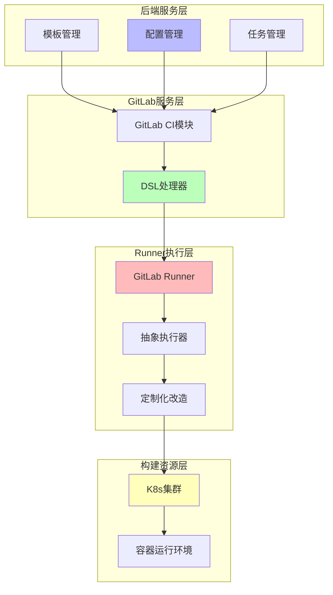

**四层架构详解:**

#### 第一层: 后端服务层
- **模板管理:** 可复用的最小单元
- **配置管理:** 应用基于模板生成的配置拷贝
- **任务管理:** 基于应用配置生成的构建过程

#### 第二层: GitLab 服务层
- **GitLab CI 模块:** 准确说是 GitLab 服务中的 CI 模块
- **DSL 处理器:** 
  - 定义描述流水线任务的语法
  - 解析、配置并生成流水线任务

#### 第三层: GitLab Runner 执行层
- **GitLab Runner:** GitLab-CI 的重要组成部分,与 GitLab 服务解耦
- **工作方式:** 通过接口消费 GitLab 生成的流水线任务
- **抽象执行器:** 为任务准备运行环境并执行
- **定制化:** 在此层做了大量定制开发

#### 第四层: 构建资源层
- **K8s 集群:** 云原生容器化构建的基础
- **容器运行环境:** 提供隔离的构建环境

### 2.5 核心技术实现

#### 2.5.1 可视化流水线编排

**挑战:**
- GitLab-CI 流水线编排使用 YAML 语法
- 学习门槛高,使用成本高

**解决方案:**
- 提供基于模板的可视化编排能力
- 丰富的自定义选项
- 服务端将配置渲染成 GitLab-CI 的 YAML 配置

#### 2.5.2 多流水线配置管理

**问题:**
- GitLab 仓库限制只能配置一个 YAML 配置
- 内部一个仓库可能被多个应用绑定
- 一个应用可能有多条流水线
- 一个仓库需要关联 M×N 条流水线

**解决方案:**
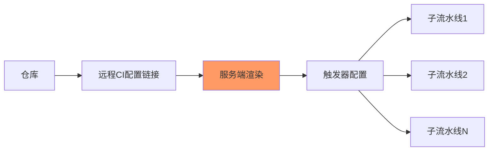

- CI YAML 配置设置为远程链接
- 服务端根据关联关系渲染只包含触发器的配置
- 根据实际运行条件,通过子流水线形式触发真正要执行的流水线

#### 2.5.3 容器化构建环境管理

**传统虚拟机构建的痛点:**
- 一台构建机需要安装多个版本依赖
- 依赖安装/升级过程容易互相影响
- 构建机环境被破坏
- 构建机之间难以保证环境一致性

**云原生解决方案: 不可变基础设施**

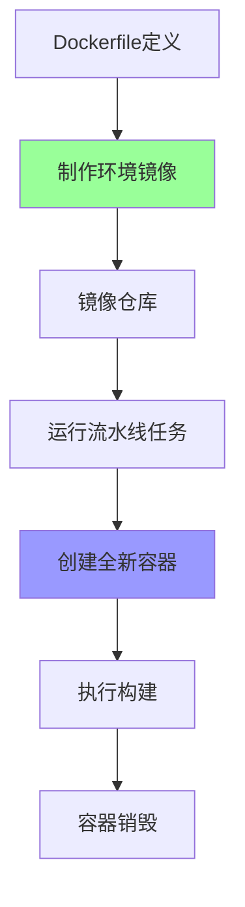

**实现方式:**
- 通过 Dockerfile 为每个任务定义运行环境
- 将 Dockerfile 制作成镜像
- 运行流水线任务时,基于环境镜像创建全新容器
- 镜像不变,环境就不变
- 从 Dockerfile 直观看出运行环境包含的依赖和版本

**镜像管理:**
- **自定义镜像:** 用户自行定义
- **默认镜像:** 平台提供
- 提供一系列工具管理构建环境

#### 2.5.4 GitLab Runner 定制化

**Runner 部署策略:**
- GitLab Runner 独立于 GitLab 服务
- 消费和执行 GitLab 生成的流水线任务
- 根据不同任务类型所需资源部署多套 Runner

**调度机制:**
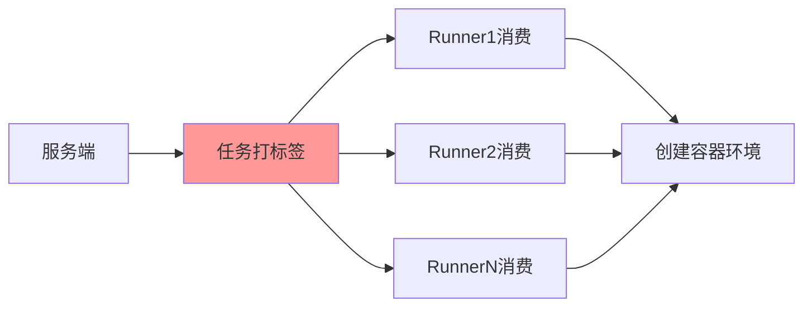

- 服务端通过调度控制给每个任务打标签
- GitLab Runner 根据标签消费对应任务
- 根据配置的规格和配置创建容器运行环境

**二次开发关键点:**
- 支持应用级别的存储空间动态挂载
- 应用是平台创建的概念,GitLab-CI 原生不支持
- 需要针对应用做动态挂载等定制化改造

#### 2.5.5 资源混部与成本优化

**混部策略:**
- 底层构建资源与内部工具专用 K8s 集群混部
- 充分利用集群空闲资源做构建任务

**资源使用情况:**
- 工具集群峰值 CPU 水位: 52%
- CI/CD 任务峰值占用: 5%
- **效果:** 充分利用原本浪费的资源

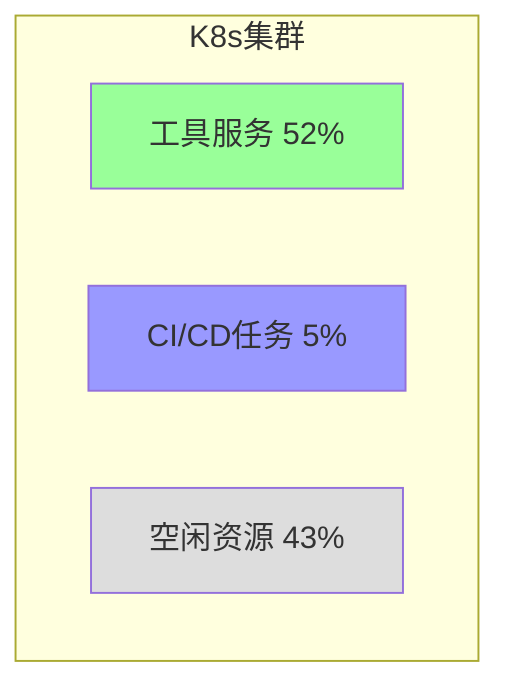

#### 2.5.6 存储与缓存管理

**挑战:**
- 容器化构建是无状态的
- 每个任务在全新容器中构建
- 需要流水线任务间通信(文件共享)
- 需要缓存持久化

**解决方案: 基于 NAS 的存储卷**

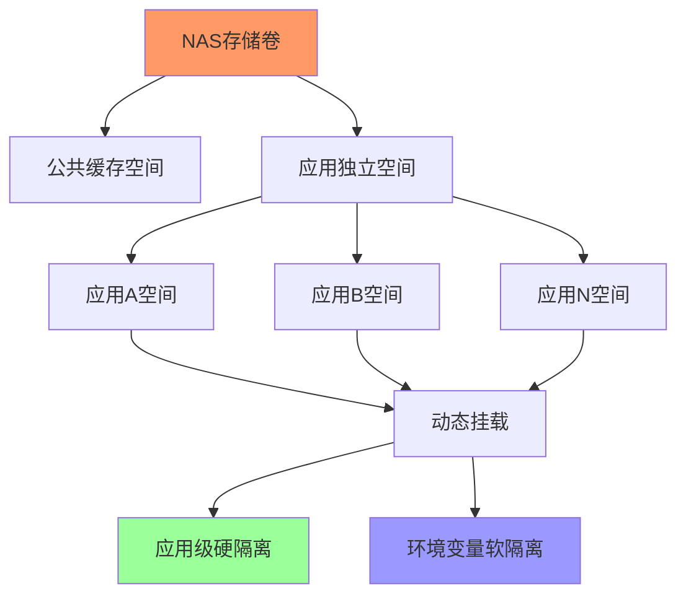

**实现机制:**
- 基于 K8s 型 NAS 做多读写存储卷
- 存储空间一分为二:
  - **公共缓存:** 存储公用缓存
  - **应用空间:** 分配给每个应用,独立且隔离
- 容器启动时通过动态挂载实现应用级别空间硬隔离
- 通过环境变量访问方式实现软隔离
- 解决物理机构建共享缓存互相影响的问题

#### 2.5.7 可观测性建设

**监控体系:**
- 货拉拉具备业界一流监控产品
- 收集不同指标
- 数据聚合
- 监控看板配置
- 告警机制

**日志与分析:**
- 流水线运行过程日志收集
- 计时器埋点
- 离线数据分析
- 数据和结果呈现给用户和管理员

**自动化运维:**
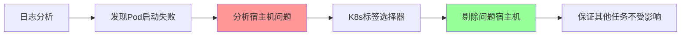

**示例场景:**
- 日志发现任务 Pod 启动失败
- 分析出 K8s 宿主机问题
- 通过 K8s 标签和选择器机制剔除问题宿主机
- 保证其他任务不受影响

---

## 三、DevOps 实践经验: 提效与保质

### 3.1 效率与质量的关系

> **在 DevOps 实践中,效率与质量是相互提升、相互促进的**

### 3.2 效率提升三层架构

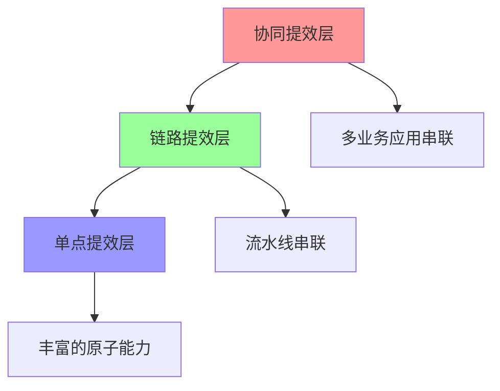

#### 第一层: 单点提效
- **目标:** 打造自动化原子能力
- **方式:** 实现单点提效
- **内容:** 丰富的原子能力

#### 第二层: 链路提效
- **目标:** 通过流水线串联单点能力
- **方式:** 实现可靠可重复的单一交付工作流
- **效果:** 链路上的提效

#### 第三层: 协同提效
- **目标:** 把多业务和应用的流水线串联起来
- **方式:** 实现跨团队协同
- **状态:** 目前正在尝试,较难实现

### 3.3 质量保障体系

**核心理念:**
> **建立质量文化是质量提升最重要的基础**

**实施路径:**
1. 让大家认可质量的重要性
2. 推进质量工程落地
3. 最终实现持续质量

**生态共建:**
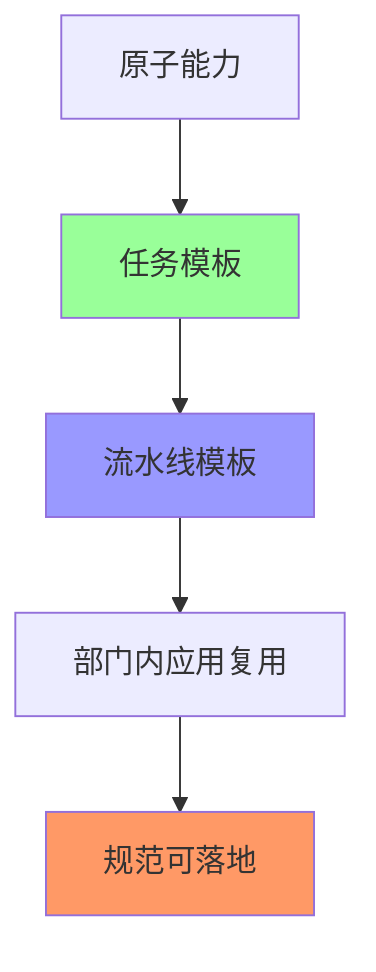

- 将原子能力打造成任务模板
- 业务部门根据内部规范串联任务模板成流水线模板
- 流水线模板供部门内应用复用
- 实现规范可落地

### 3.4 工作流编排与自动化

#### 可视化流水线编排
- 提供可视化自定义流水线编排界面
- 应用可基于模板市场的模板生成流水线配置
- 支持基于模板做定制化改造

#### 自动触发机制
- 提供自动触发条件配置
- 提供开关控制
- 降低人工干预

#### 一键环境拉起
- **工具名称:** OneBox
- **功能:** 基于一个需求一键拉起一套测试联调环境
- **价值:** 大幅提升测试效率

### 3.5 答疑减负三大利器

在 DevOps 过程中,答疑占据大量工作量。平台提供三个利器减少答疑工作:

#### 1. 服务质检

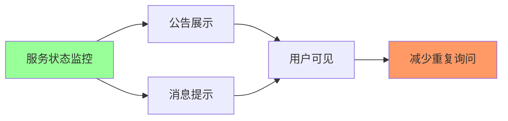

**特点:**
- 服务基础状态对用户透明
- 用户可直观看到哪些功能正常/异常
- 例如: 队列阻塞时,用户从公告看到消息,无需在群里反复询问

#### 2. 功能诊断

**背景:**
- 一站式平台开放大量自定义能力
- 研发可能把配置改坏

**解决方案:**
- 提供一键诊断功能
- 帮助研发自助修复配置

#### 3. 错误分析

**传统方式:**
- 流水线任务失败
- 用户往群里贴消息询问原因

**现在方式:**
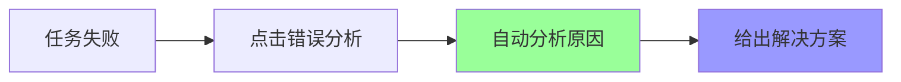

**效果统计:**
- 89% 的问题是应用自身问题,可通过此功能自助解决
- 只有 6% 的问题需要平台方参与排查
- **即: 100个问题中只有6个需要人工介入**

---

## 四、Q&A 精选

### Q1: 后续 DevOps 项目上线由谁主导?
**A:** 平台由团队开发,我负责流水线部分。用户侧一般每个组或部门会有几个同学负责定制部门内部的流水线,基本每个部门都会出一两个人做这件事。

### Q2: 容器云平台、虚拟机环境与 DevOps 如何解决兼容性问题?
**A:** 内部应用发布有虚拟机发布和容器发布两种方式。在 CI/CD 构建阶段,产物会推到下一阶段进行打包,包含镜像打包和虚拟机发布包打包。两种打包产物一致,对虚拟机发布和容器发布都没有影响。

### Q3: DevOps 系统是自研的吗?
**A:** DevOps 系统是自研的,只是流水线底层能力基于 GitLab-CI 做的。

### Q4: Runner 的二次开发是为了解决什么问题?
**A:** 主要解决自定义诉求,例如:
- 数据持久化问题
- 构建时给每个应用分配独立存储空间
- GitLab Runner 支持存储卷挂载,但不支持应用概念
- 需要针对应用做动态挂载等改造

### Q5: 小公司有必要自己研发 DevOps 系统吗?
**A:** 小公司没有太大必要,但可以基于开源产品做定制化改造。

### Q6: 二次开发用的是哪个开源项目?
**A:** 使用 GitLab 13 版本,GitLab Runner 对应 13 版本。

### Q7: 根据条件动态生成 Job 是怎么做的?
**A:** 这是 GitLab 帮我们做的,我们使用开源产品二次开发就是想复用其核心能力。

### Q8: 流水线里的安全步骤是怎么做的?
**A:** 与安全团队协作:
- 安全团队打一个安全扫描任务的环境镜像
- 在平台上配置任务模板
- 所有应用可使用这个安全扫描能力

### Q9: 虚拟机发布是用 Ansible 吗?
**A:** 不是基于 Ansible,在虚拟机上有专门的发布 Agent。

### Q10: 这套基于 GitLab 的 IDP 有开源可能吗?
**A:** 后续可以考虑,但目前想先把产品打造好再考虑开源。这套流水线与业务耦合不大,只引入了应用概念。

### Q11: DevOps 系统基于什么框架开发?
**A:** 基于 Go 开发。整个平台没有基于特定框架或产品,只有流水线基于 GitLab-CI。

### Q12: 怎么衡量效率提升?
**A:** 通过数据洞察:
- 在持续集成过程中做计时器埋点
- 知道每个环节消耗时间
- 后期对这些数据进行分析
- 量化效率提升

### Q13: 日均发布量是多少?
**A:** 整个 CI/CD 任务每天约 3000-4000 个,包括代码扫描、构建等各类任务。发布估计接近上千次。

### Q14: GitLab CI/CD 有哪些不足?
**A:** 主要问题:
1. **应用与仓库体系差异**
   - 平台以应用为载体,GitLab-CI 以仓库为载体
   - 一个应用关联多条流水线,一个仓库关联多个应用
   - 导致 N 条流水线配置在一个仓库
   - 只能用子流水线 feature,但任务状态存在问题,目前无完美解决方案

2. **性能瓶颈**
   - GitLab 服务生成 CI/CD 任务时遇到性能瓶颈
   - 通过参数调优解决

3. **依赖程度**
   - 实际对 GitLab 依赖不是重度依赖
   - 只复用核心能力
   - GitLab CI/CD 本身优缺点对平台影响不大
   - 缓存机制都没有使用,自研了一套

### Q15: 运行环境的管理在系统里如何实现?
**A:** 
- 运行环境管理在平台上,包括虚拟机和容器运行环境
- 虚拟机: 有自动化运维平台,资源创建时做标准化初始化
- K8s: 在构建业务发布镜像时通过 Dockerfile 管理

### Q16: 大模型趋势下,如何与大模型结合?
**A:** 
- 考虑在错误分析功能中应用
- 目前错误分析能覆盖 94% 的问题
- 剩余 6% 的问题考虑将核心日志传给 GPT 做解答
- 方案还在调研中

---

## 五、总结与展望

### 5.1 核心成果

1. **平台演进成功**
   - 从零能力到一站式平台
   - 3年内完成 2.0 到 3.0 升级
   - 完成所有应用迁移

2. **技术架构先进**
   - 云原生容器化构建
   - 资源混部降低成本
   - 不可变基础设施理念落地

3. **效率质量双提升**
   - 自动化能力大幅提升
   - 答疑工作量减少 94%
   - 构建环境标准化、可维护

4. **开放生态共建**
   - 可视化流水线编排
   - 模板市场机制
   - 业务部门自定义能力

### 5.2 关键经验

1. **不为技术而技术**
   - 注重用户体验
   - 基础能力领先业务半步即可
   - 基于开源做二次开发

2. **以应用为中心**
   - 应用作为最小交付运维单元
   - 串联 DevOps 各环节
   - 实现全生命周期管理

3. **标准化是基础**
   - 服务标准化
   - 流程标准化
   - 环境标准化

4. **开放赋能业务**
   - 平台聚焦核心能力
   - 开放自定义能力
   - 与业务共建生态

### 5.3 未来方向

1. **协同提效**
   - 多业务应用流水线串联
   - 跨团队协同能力提升

2. **智能化**
   - 大模型在错误分析中的应用
   - 更智能的问题诊断

3. **持续优化**
   - 性能持续优化
   - 成本持续降低
   - 用户体验持续提升

---

## 附录: 关键技术栈

| 类别 | 技术/工具 |
|------|----------|
| 流水线引擎 | GitLab-CI (v13) |
| 容器编排 | Kubernetes |
| 开发语言 | Go |
| 存储 | K8s 型 NAS |
| 监控 | 自研监控产品 |
| 构建方式 | 容器化构建 |
| 环境管理 | Dockerfile + 镜像 |
| 虚拟机发布 | 自研 Agent |

---

**文档整理:** 基于技术分享音频 ASR 文字记录整理  
**目标受众:** SRE、运维及稳定性保障工程师  
**核心价值:** 提供大规模 DevOps 平台建设的完整实践经验
