# 平安银行端到端全链路灰度验证实践

> 来源：未核验 · 类型：分享 · 状态：draft

## 一、背景与挑战

### 1.1 金融场景业务现状

金融行业面临的核心矛盾:

- **高稳定性要求**: 金融行业的特殊性要求系统具有极高的稳定性
- **快速迭代需求**: 接入个人消费用户后,产品迭代速度要求加快
- **监管风险**: 生产版本异常会被监管部门实时关注,可能对银行产生不良影响

**核心问题**: 如何在快速迭代交付的过程中为金融产品提供稳定的服务,避免监管风险?

### 1.2 面临的挑战

#### 业务复杂性
- 涉及零售、对公、保险、证券等多个业务领域
- 业务流程复杂,链路长

#### 技术复杂性
- **组件多样化**: 历史原因导致系统众多,部分外购系统需二次开发
- **标准不统一**: 需要统一数据标准和数据传输标准
- **运维复杂**: 需要便捷的监控、发布、引流等运维能力

#### 部署环境多样
- 同时支持虚拟机和容器化部署
- 需要兼容不同的部署方式

## 二、建设目标

### 2.1 业务目标

从两个维度控制风险:

#### 控制影响面
- 精准选取流量(白名单用户、测试人员、指定用户)
- 对指定功能进行全面测试验证
- 确保主流程和绝大部分业务符合预期

#### 控制影响时长
- 发现问题时快速切换流量
- 秒级回退到上一个稳定版本
- 最小化故障影响时间

### 2.2 技术目标

1. **零侵入**: 对业务代码零侵入,业务按正常模式迭代开发
2. **全链路支持**: 所有系统组件提供全链路支持
3. **流量独立**: 各系统间流量独立,避免相互冲突
4. **运维便捷**: 提供便捷的监控和管理能力
5. **环境兼容**: 同时支持虚拟机和容器部署

## 三、技术实现原理

### 3.1 核心四步骤

全链路灰度分为四个关键动作:

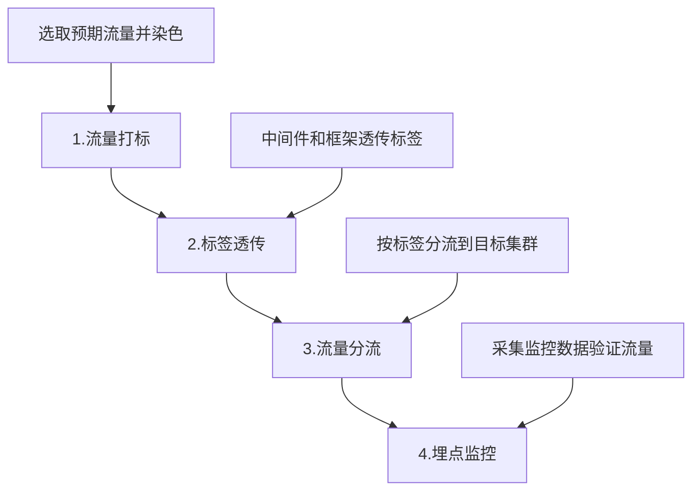

#### 步骤1: 流量打标
- 在入口应用选取预期流量
- 给选中的流量染色(添加标签)

#### 步骤2: 标签透传
- 中间件和框架将标签向下游透传
- 保证标签在全链路传递

#### 步骤3: 流量分流
- 分流组件根据标签值
- 将流量路由到预期的服务器分组

#### 步骤4: 埋点监控
- 框架层和中间件实现埋点
- 监控流量是否符合预期

### 3.2 架构定义

系统分为控制面和数据面:

#### 控制面
- 流量管理和控制平台
- 路由策略下发
- 规则配置管理

#### 数据面(分流组件)
- **SLB**: 负载均衡层
- **微服务框架**: Dubbo、Spring Cloud等
- **ESB**: 企业服务总线
- **API网关**: 流量网关组件

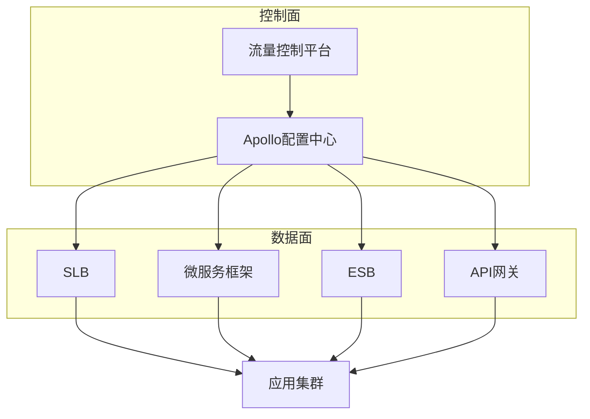

### 3.3 流量打标实现

在入口应用完成流量染色:

- **APP入口**: 口袋银行APP等移动应用
- **RESTful接口**: 通过SLB暴露的服务
- **ESB入口**: 企业服务总线
- **微服务框架**: 服务间调用入口

管控平台负责:
- 定义染色规则
- 指定染色位置
- 配置染色标签值

### 3.4 分流与监控

#### 分流逻辑

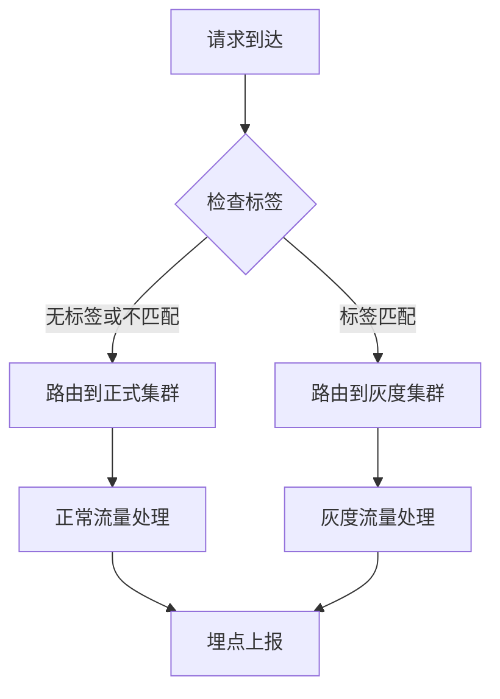

#### 流量隔离

- 每个系统拥有独立的标签(类似独立泳道)
- 系统A染橙色,系统B染绿色
- 各系统流量完全隔离,互不影响

## 四、具体实践方案

### 4.1 金丝雀发布(灰度发布)

#### 方案特点
- 独立出小规模灰度集群(最少2台机器)
- 新代码先发布到灰度集群
- 逐步引流验证

#### 适用场景
- 常规功能迭代
- 资源消耗较少
- 流量限制在5%以内

#### 发布流程

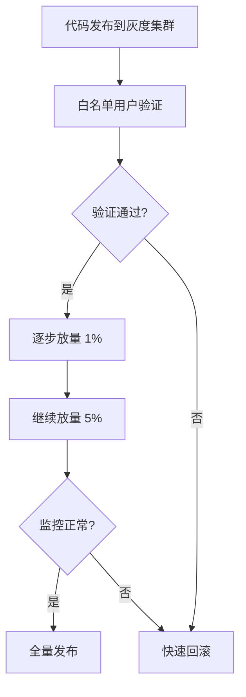

#### 优势
- 资源消耗少(仅需2台机器)
- 影响面可控
- 快速验证新功能

#### 限制
- 流量不能超过5%
- 无法发现高并发场景问题

### 4.2 蓝绿发布

#### 方案特点
- 同机房部署两套完整集群(蓝集群、绿集群)
- 滚动发布,轮流升级
- 生产环境始终保持两个版本在线

#### 适用场景
- 核心系统(会员登录、转账等)
- 实时性要求高的业务
- 需要高并发验证的场景

#### 发布流程

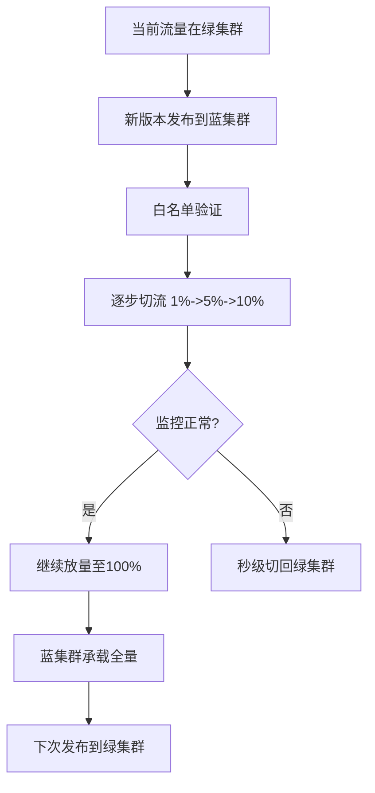

#### 优势
- 无流量限制,可全量验证
- 秒级回滚能力
- 可发现高并发问题
- 生产始终有两个版本可用

#### 成本
- 需要双倍资源
- 运维复杂度较高

### 4.3 金丝雀 vs 蓝绿对比

| 维度 | 金丝雀发布 | 蓝绿发布 |
|------|-----------|---------|
| 资源消耗 | 低(2台机器) | 高(双倍集群) |
| 流量限制 | ≤5% | 无限制,可达100% |
| 回滚速度 | 秒级 | 秒级 |
| 适用场景 | 常规迭代 | 核心系统 |
| 高并发验证 | 不支持 | 支持 |
| 版本保留 | 仅灰度期间 | 始终保留上个版本 |

## 五、全链路技术实现

### 5.1 系统架构

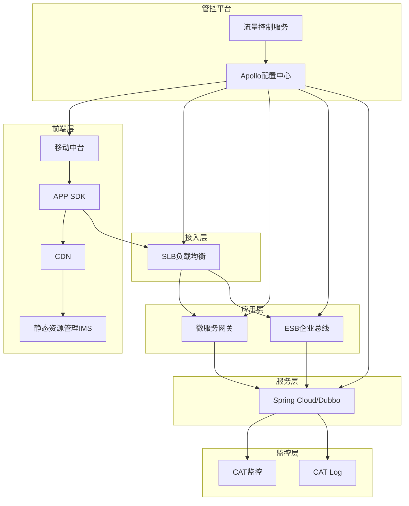

### 5.2 前端资源灰度

#### 在线资源分流

**问题**: 如何让指定用户看到新版本页面,其他用户看到正式版本?

**解决方案**:

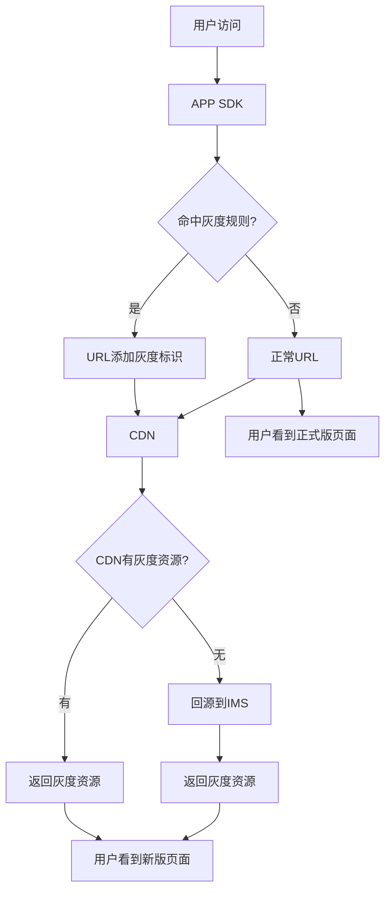

**实现步骤**:

1. **规则下发**: 移动中台将灰度规则推送到APP SDK
2. **流量识别**: SDK根据URL和User-Agent判断是否命中规则
3. **标识添加**: 命中规则的请求URL添加特殊标识
4. **资源加载**: CDN/IMS识别标识,返回对应版本资源

#### 离线资源分流

- 资源包存储在本地
- 通过特殊文件夹名称标识(添加灰度标识符)
- 优先加载灰度文件夹中的资源

### 5.3 后端请求灰度

#### 动态请求染色

前端页面加载完成后,页面发起的所有动态请求需要染色:

**实现方式**:
- SDK在请求Header或Cookie中添加灰度标识
- 标识由流控平台统一下发
- 后端组件识别标识进行分流

#### SLB层分流

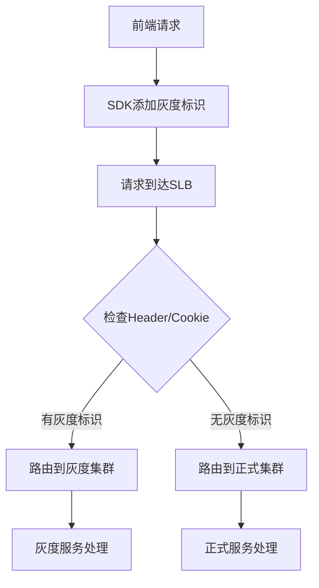

**技术实现**:
- 基于Nginx实现
- 使用Lua插件动态识别路由规则
- 无需Reload,动态生效
- 对业务无感知

### 5.4 微服务框架灰度

#### Spring Cloud / Dubbo

**核心思路**: 服务分组

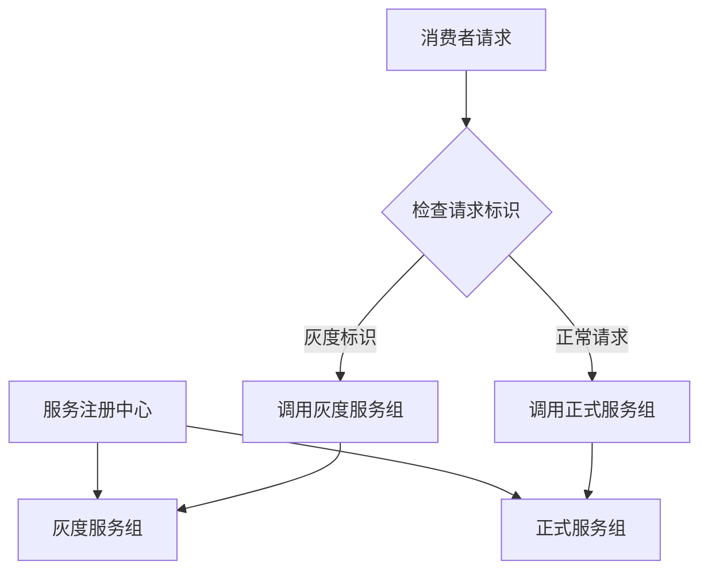

**实现方式**:
- 服务注册时添加分组标签
- 消费者根据请求标识选择服务组
- SDK层实现路由逻辑
- 支持多组划分(蓝、绿、橙、灰等)

**服务分组示例**:
- 正式组: `tag=prod`
- 灰度组: `tag=gray`
- 蓝组: `tag=blue`
- 绿组: `tag=green`

### 5.5 ESB企业总线灰度

#### 应用场景
- 部分遗留系统使用C语言或其他语言
- 需要通过ESB进行协议转换
- TCP流量转换为HTTP流量

#### 实现原理
- ESB基于Java实现
- 识别流控平台下发的路由规则
- 将请求转发到对应的后端集群
- 实现方式与SLB类似

### 5.6 端到端全流程

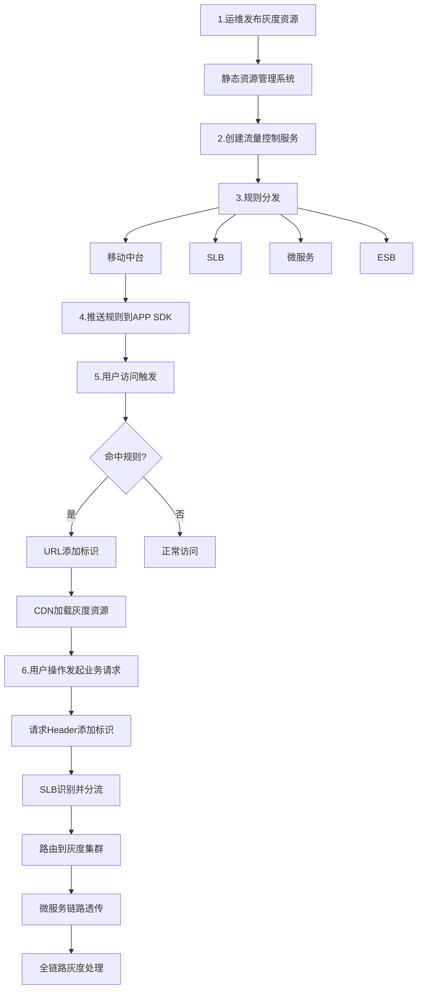

## 六、可观测与运维

### 6.1 监控体系

#### 监控指标

基于CAT和CAT Log实现,流量分为三类:

1. **正常流量**: 无灰度标识的常规请求
2. **灰度流量**: 带有灰度标识且符合预期的请求
3. **非预期流量**: 流量路由异常的请求

#### 非预期流量定义

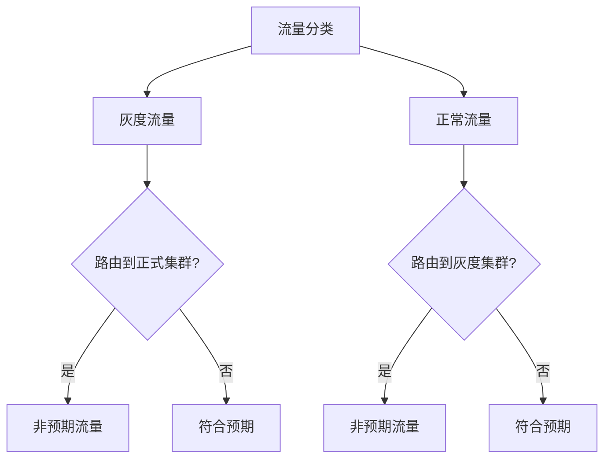

**非预期流量场景**:
- 灰度流量误路由到正式集群
- 正常流量误路由到灰度集群
- 跨系统流量串流(系统A的灰度流量进入系统B的灰度集群)

#### 流量隔离监控

- 每个系统分配唯一标签
- 系统A标签值为`tag-a`
- 系统B标签值为`tag-b`
- 监控系统B的灰度集群是否收到`tag-a`的流量

### 6.2 运维管理

#### 规则管理

支持两种规则类型:

1. **白名单规则**
   - 指定用户ID
   - 指定设备ID
   - 测试账号

2. **百分比规则**
   - 按比例随机选取
   - 支持千分之一到百分之百
   - 逐步放量

#### 一键操作

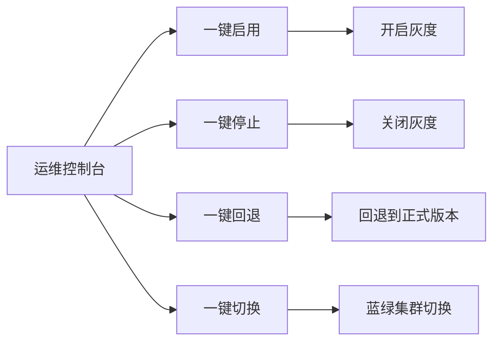

**功能说明**:
- **一键启用**: 开启灰度流量
- **一键停止**: 停止灰度,流量回到正式集群
- **一键回退**: 紧急情况下快速回退
- **一键切换**: 蓝绿集群间切换(蓝→绿或绿→蓝)

#### 管控界面

**支持配置**:
- 添加多个后端应用
- 配置前端资源(支持多个APP)
- 前提: APP需集成灰度SDK

**配置项**:
- 应用列表
- 灰度规则
- 流量比例
- 监控大盘

### 6.3 灰度流量报表

#### 核心指标

**平台技术指标**:
- 流量选取正确率
- 预期流量 vs 实际流量对比
- 非预期流量数量和占比
- 请求成功率
- 响应时间

**业务指标**(根据业务定义):
- 业务成功率
- 关键业务流程完成率
- 用户体验指标

#### 监控维度

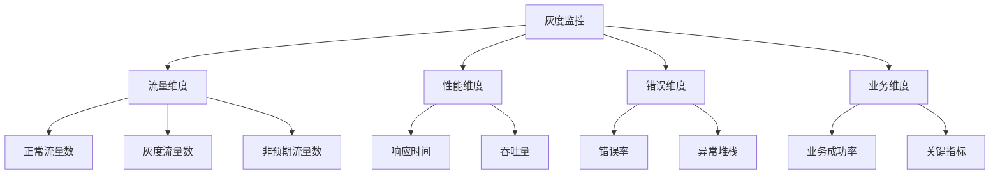

## 七、质量保障效果

### 7.1 实施效果

从年度维度统计,使用灰度后:

- **问题数下降**: 生产问题数量明显减少
- **客户体验问题数下降**: 客户投诉和反馈的问题减少
- **故障影响面缩小**: 问题在灰度阶段被发现
- **回滚速度提升**: 秒级回滚能力

### 7.2 典型收益

1. **风险前置发现**
   - 测试环境未发现的问题在灰度阶段暴露
   - 小流量验证避免大规模影响

2. **快速止损**
   - 发现问题立即回滚
   - 影响用户数可控(≤5%)

3. **监管合规**
   - 避免大规模生产事故
   - 降低监管风险

## 八、虚拟机到K8s迁移

### 8.1 迁移挑战

- 银行部分系统仍为虚拟机部署
- 大部分系统已容器化
- 需要同时支持两种部署方式

### 8.2 解决方案

#### 统一流控能力
- 流控平台对部署方式无感知
- 虚拟机和容器使用相同的SDK
- 统一的路由规则下发

#### 平滑迁移策略

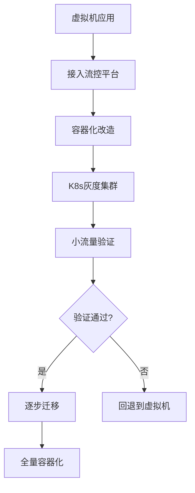

#### 迁移步骤

1. **虚拟机应用接入灰度能力**
2. **创建K8s灰度集群**
3. **容器化部署到灰度集群**
4. **小流量验证容器版本**
5. **逐步放量到容器集群**
6. **完成全量迁移**

### 8.3 容器重启性能优化

**问题**: 容器重启后冷启动导致性能问题

**解决方案**:

1. **预热机制**
   - 服务注册后不立即接收流量
   - 预热期间逐步增加流量
   - 微服务框架实现预热逻辑

2. **健康检查**
   - 就绪探针(Readiness Probe)
   - 存活探针(Liveness Probe)
   - 启动探针(Startup Probe)

3. **流量控制**
   - 新实例权重逐步提升
   - 避免流量突增

## 九、未来规划

### 9.1 Service Mesh集成

**目标**: 与Service Mesh融合

**规划方向**:
- 将灰度能力下沉到Service Mesh
- 利用Istio/Linkerd的流量管理能力
- 简化应用侧SDK集成

**预期收益**:
- 更细粒度的流量控制
- 更强大的可观测性
- 更好的多云支持

### 9.2 自动化能力增强

**智能化灰度**:
- 基于监控指标自动放量
- 异常自动回滚
- AI辅助决策

**流程自动化**:
- 灰度策略模板化
- 发布流程自动编排
- 一键式灰度发布

### 9.3 多云多活支持

- 跨机房灰度能力
- 多云环境统一管控
- 异地容灾切换

## 十、关键技术点总结

### 10.1 核心技术

1. **流量染色技术**
   - 入口统一打标
   - 全链路透传
   - 标签隔离

2. **动态路由技术**
   - 基于Nginx Lua插件
   - 配置动态生效
   - 无需重启

3. **服务分组技术**
   - 微服务标签路由
   - 多版本共存
   - 灵活切换

4. **可观测技术**
   - 全链路监控
   - 流量分类统计
   - 异常告警

### 10.2 最佳实践

1. **灰度策略**
   - 白名单 → 1% → 5% → 全量
   - 每个阶段充分验证
   - 快速回滚能力

2. **监控告警**
   - 实时监控非预期流量
   - 关键指标告警
   - 自动化巡检

3. **应急预案**
   - 一键回滚
   - 应急联系人
   - 故障演练

### 10.3 注意事项

1. **资源规划**
   - 灰度集群容量规划
   - 蓝绿集群成本评估
   - 流量限制设置

2. **兼容性**
   - 老系统改造成本
   - SDK版本管理
   - 协议兼容性

3. **团队协作**
   - 开发、测试、运维协同
   - 灰度流程培训
   - 应急响应机制

## 十一、Q&A精选

### Q1: 灰度和蓝绿发布的本质区别?

**A**: 
- **灰度发布**: 资源消耗少(2台机器),流量限制≤5%,适合常规迭代,无法验证高并发问题
- **蓝绿发布**: 双倍资源,无流量限制,可逐步放量至100%,生产始终保留两个版本,可秒级回退,适合核心系统

### Q2: 如何制定灰度流量路由规则?

**A**: 
- 按业务维度规划(月度发布计划)
- 评估版本改动范围(前端/后端)
- 与发布系统对接,自动创建灰度方案
- 关联前端资源和后端应用

### Q3: 为何不使用APISIX方案?

**A**: 
- 建设时间较早(2019年),APISIX当时不够成熟
- 需要结合银行场景定制(双活切换、蓝绿切换、内测集群等)
- 基于Nginx+Lua实现,更灵活可控
- 支持多机房流量管理

### Q4: 灰度流量监控的核心指标?

**A**: 
- **技术指标**: 流量选取正确率、非预期流量数、响应时间、错误率
- **业务指标**: 根据业务定义,如业务成功率、关键流程完成率

### Q5: 发布服务耗时和验证效果?

**A**: 
- 发布耗时增加主要在灰度验证环节
- 发布动作本身与之前一致
- 效果: 问题数和客户投诉明显下降,风险前置发现

---

## 总结

平安银行的端到端全链路灰度验证实践,通过**流量打标、标签透传、流量分流、埋点监控**四步骤,实现了从前端到后端的全链路灰度能力。结合**金丝雀**和**蓝绿**两种发布方案,在保证快速迭代的同时,有效控制了发布风险,满足了金融行业的高稳定性和监管合规要求。

该方案的核心价值在于:
- **业务零侵入**,开发无感知
- **秒级回滚**,快速止损
- **全链路支持**,覆盖所有组件
- **流量隔离**,系统间互不影响
- **可观测性强**,问题快速定位

通过灰度能力建设,平安银行实现了虚拟机到K8s的平滑迁移,为未来与Service Mesh的融合奠定了基础。

