# 猪八戒网DevOps演进及CI-CD最佳实践

> 来源：未核验 · 类型：分享 · 状态：draft


## 分享嘉宾

**张谷干** - 猪八戒网

## 目录

- [一、背景介绍](#一背景介绍)
- [二、从零到一构建DevOps平台](#二从零到一构建devops平台)
  - [2.1 构建标准化研发流程](#21-构建标准化研发流程)
  - [2.2 一键生成可部署工程](#22-一键生成可部署工程)
  - [2.3 CI/CD流水线建设](#23-cicd流水线建设)
  - [2.4 快速回滚机制](#24-快速回滚机制)
  - [2.5 DevOps v1.0成果](#25-devops-v10成果)
- [三、DevOps平台演进至一站式研发平台](#三devops平台演进至一站式研发平台)
  - [3.1 v1.0存在的问题](#31-v10存在的问题)
  - [3.2 流水线重构](#32-流水线重构)
  - [3.3 工程全生命周期管理](#33-工程全生命周期管理)
  - [3.4 高效工作流系统](#34-高效工作流系统)
  - [3.5 研发成本管理](#35-研发成本管理)
  - [3.6 v2.0成果总结](#36-v20成果总结)
- [四、Q&amp;A精选](#四qa精选)

---

## 一、背景介绍

### 1.1 业务发展背景

2015年,猪八戒网历经10年稳定发展后迎来业务快速增长期:

- **团队规模扩张**: 研发团队从几十人扩张到500+人
- **业务需求激增**: 交付周期从"月"缩短至"周"甚至"天"

### 1.2 腾云行动

公司启动第六次"腾云行动",进行架构改革:

**两大核心任务:**

1. **服务拆解**: 将庞大单体应用拆解为微服务架构
2. **服务重构**: 80%以上代码从PHP重构为Java,引入SOA框架体系

### 1.3 DevOps团队组建

**时间**: 2016年Q3

**团队构成**:

- 运维人员: 5-6人
- 开发人员: 10人左右
- 总计: 16-17人

**核心目标**: 满足频繁的需求交付,实现随时随地交付

**四大实现要点:**

1. 构建标准化研发流程,使交付过程可靠规范
2. 一键生成和部署工程,避免重复造轮子
3. 打造自动化CI/CD流水线,替代人工部署
4. 建立线上故障快速回滚机制,提升全站可用性

---

## 二、从零到一构建DevOps平台

### 2.1 构建标准化研发流程

#### 2.1.1 构建业务产品树

将业务线抽象为层次化产品树结构:

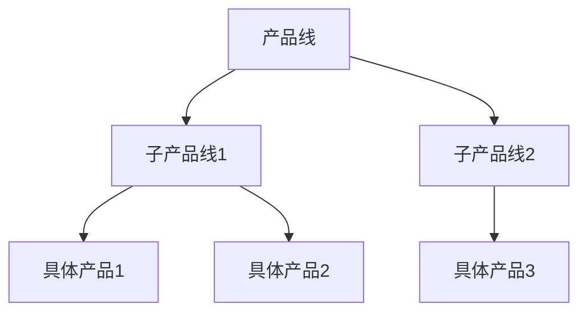

**特点**: 层次分明、业务清晰

#### 2.1.2 产品责任制

每个产品包含基本信息:

- 产品经理(必须)
- 归属部门

**责任链**: 产品 → 产品经理 → 归属部门

#### 2.1.3 工程责任制

每个工程包含:

- 源码信息
- 开发语言
- 运维配置信息
- 工程负责人(必须)
- 归属部门

**责任链**: 工程 → 工程负责人 → 归属部门

#### 2.1.4 产品与工程关联

**核心规则**: 每个工程必须关联到一个产品

**价值**: 保证每个产品都能找到实际生产源码

#### 2.1.5 四大需求发布流程

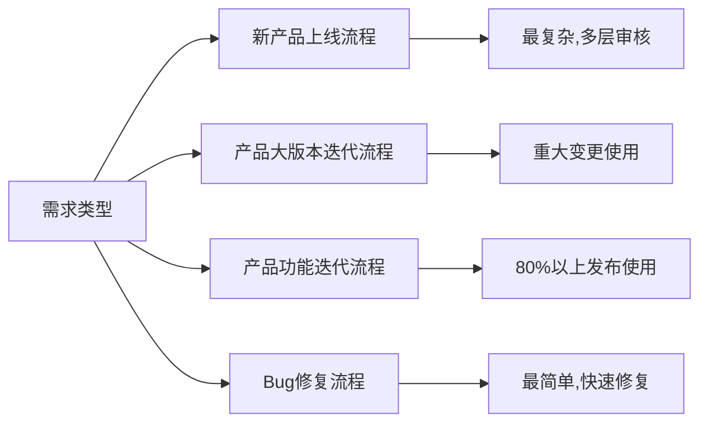

**1. 新产品上线流程**

- 适用场景: 新产品首次上线
- 特点: 最复杂,涉及多层审核

**2. 产品大版本迭代流程**

- 适用场景: 产品重大变更
- 特点: 较复杂,比新产品流程简化

**3. 产品功能迭代流程**

- 适用场景: 日常功能迭代和优化
- 特点: 相对简单,80%以上发布走此流程
- 周期: 通常≤2周或1周

**4. Bug修复流程**

- 适用场景: 程序Bug修复
- 特点: 最简单,快速响应

#### 2.1.6 标准研发生产线

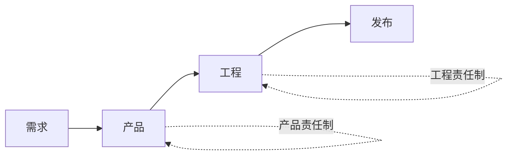

**形成**: 需求 → 产品 → 工程的标准化研发生产线

---

### 2.2 一键生成可部署工程

#### 四大核心功能

**1. 创建源码仓库**

- 根据用户填写的组名和工程名
- 自动创建Git仓库

**2. 提供工程模板**

- 根据开发语言提供对应模板
- 创建Git仓库后完成初始化提交

**3. 生成部署配置信息**

- 根据用户填写的基本信息
- 结合系统预设配置
- 动态生成流水线配置信息

**4. 生成配置中心信息**

- 为各个环境生成代码配置信息
- 包含各环境所需的变量参数

---

### 2.3 CI/CD流水线建设

#### 2.3.1 流水线核心任务

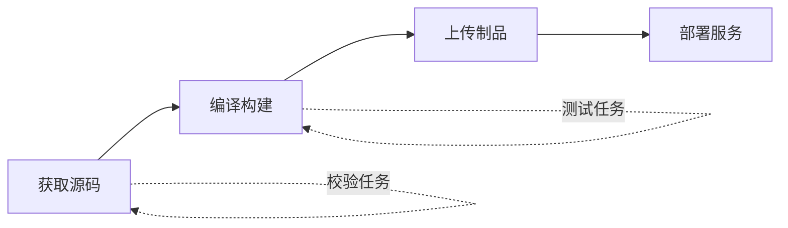

**四大核心步骤:**

1. 获取源码
2. 编译构建
3. 上传制品到制品库
4. 部署到服务器

**增强功能:**

- 校验任务: 准入准出校验
- 测试任务: 自动化测试

#### 2.3.2 多环境流水线

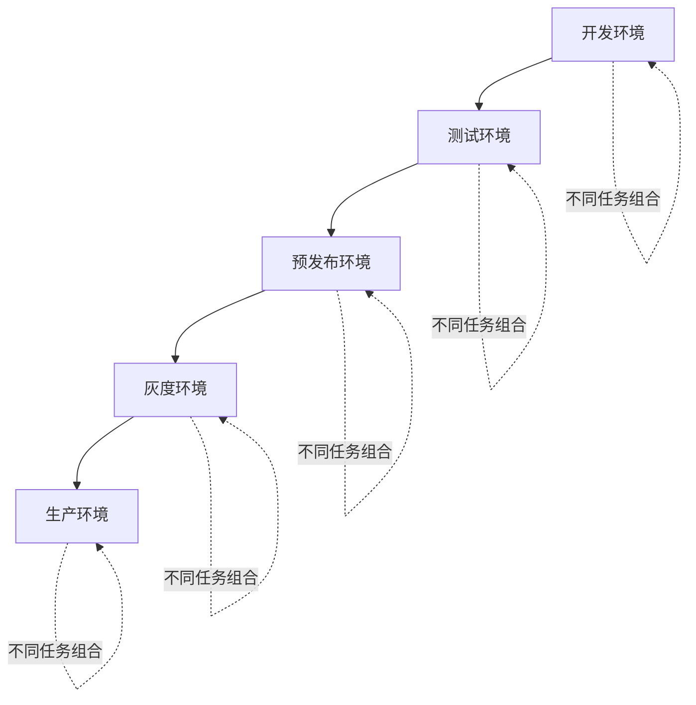

**特点**: 每个环境的流水线任务组合略有不同

#### 2.3.3 虚拟机发布流程

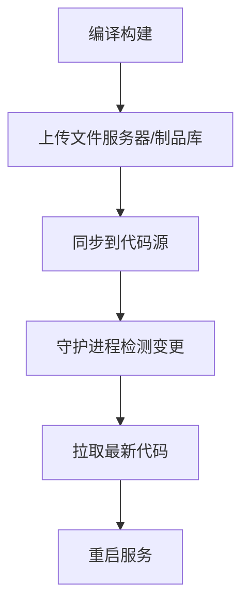

**关键点:**

- 文件服务器作为制品库
- 保存所有历史制品版本
- 守护进程主动检测并拉取更新

#### 2.3.4 容器发布流程

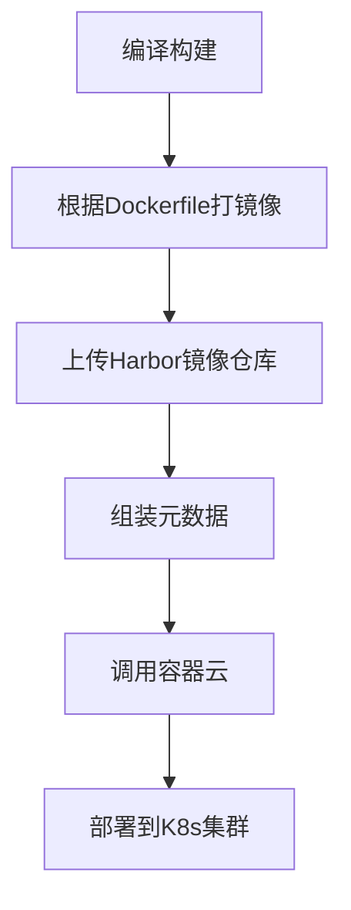

**容器云功能:**

- 基于K8s的二次封装
- 处理元数据生成Deployment YAML
- 调用K8s API部署

#### 2.3.5 分支策略

**策略**: 多分支开发,合并主干上线

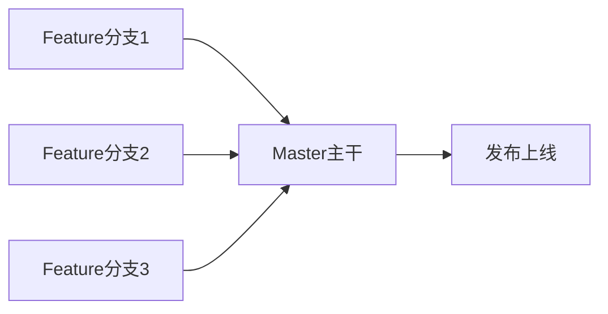

**规则:**

- 测试环境: 可使用多种分支开发
- 上线发布: 必须合并到Master分支

#### 2.3.6 一次构建,处处使用

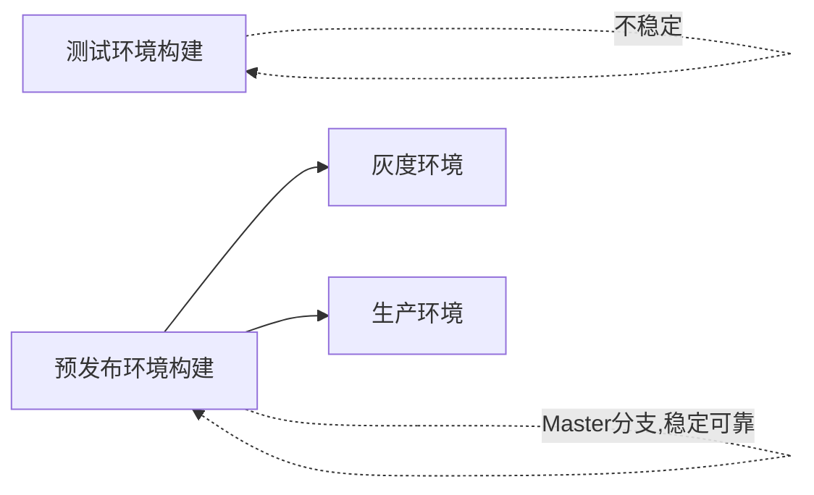

**原则:**

- 测试环境制品: 仅用于测试(不稳定)
- 预发布环境: 基于Master重新构建(稳定)
- 后续环境: 直接使用预发布制品

#### 2.3.7 Jenkins架构

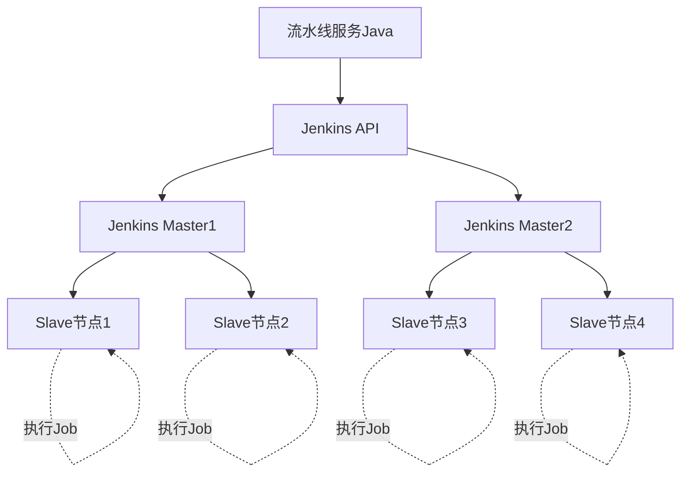

**架构特点:**

- 多Master多Slave集群
- Master仅做调度
- Slave执行具体任务
- 预先创建流水线对应的Job

**工作流程:**

1. 流水线服务通过Jenkins API触发构建
2. Jenkins Master调度Slave节点执行Job
3. 流水线服务定时调用API获取构建状态和结果
4. 更新构建记录

#### 2.3.8 流程与流水线结合

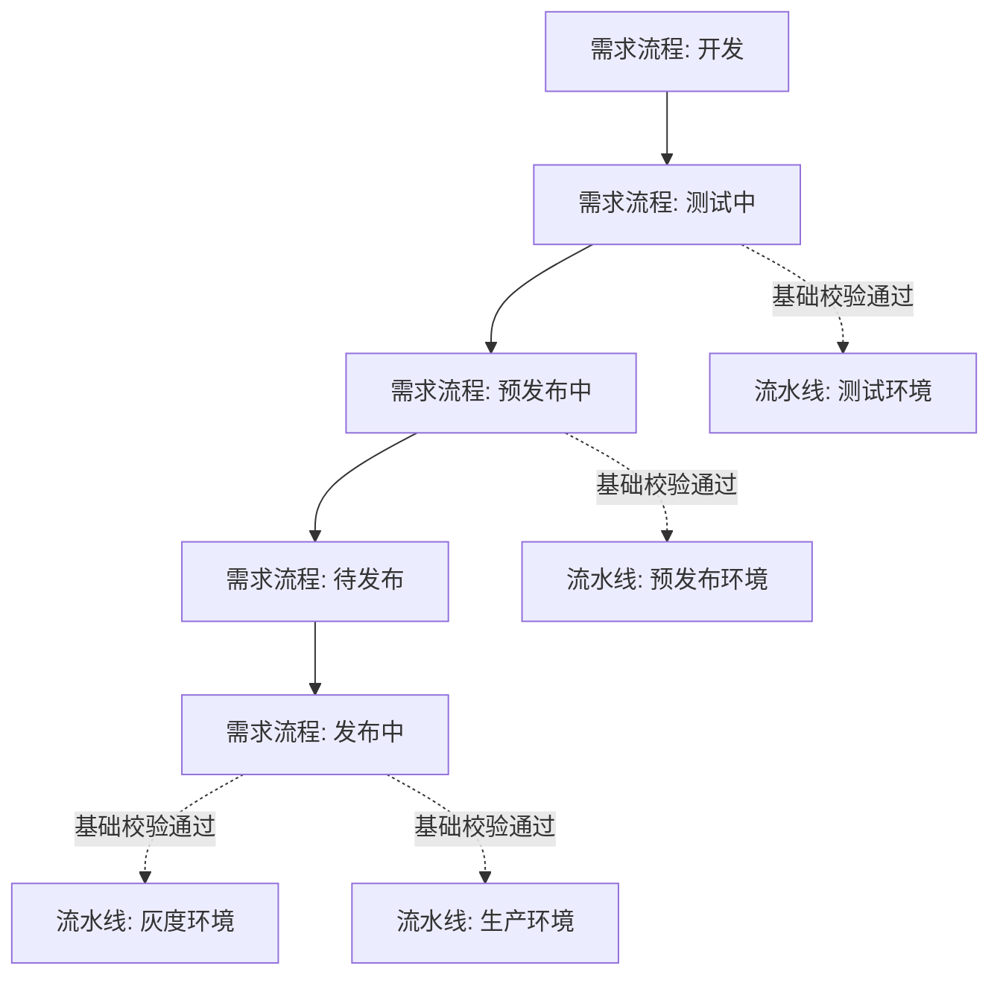

**关键机制: 基础校验**

- 只有流程走到特定节点,才能发布到对应环境
- 测试中 → 可发布测试环境
- 预发布中 → 可发布预发布环境
- 发布中 → 可发布灰度和生产环境

---

### 2.4 快速回滚机制

#### 2.4.1 打Tag机制

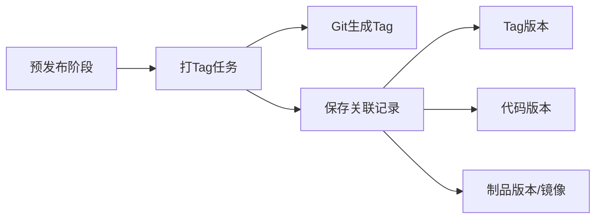

**打Tag任务做两件事:**

1. 在Git上生成Tag
2. 保存Tag版本、代码版本、制品版本的关联关系

#### 2.4.2 回滚流程示例

**场景:**

- 当前线上版本: v1.3.36 (有问题)
- 上一个版本: v1.3.35 (稳定)

**回滚步骤:**

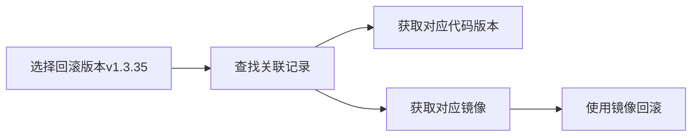

**回滚原则**: 回滚到最近的稳定版本(上一个版本)

**回滚效率**: 整个过程控制在几十秒以内

---

### 2.5 DevOps v1.0成果

#### 核心成就

**1. 研发过程标准化**

- 责任制管理
- 研发生产资料可追溯
- 交付过程更可靠

**2. 工程模板化**

- 提供多种工程模板
- 无需从零搭建工程
- 统一技术栈,规范代码研发
- 降低开发成本

**3. CI/CD自动化**

- 支持高频构建
- 支持500+研发人员日常构建
- 运维人员从40人降至不到10人
- 大幅降低运维成本

**4. 快速回滚机制**

- 线上故障快速回滚
- 全站可用性提升

#### DevOps生态链

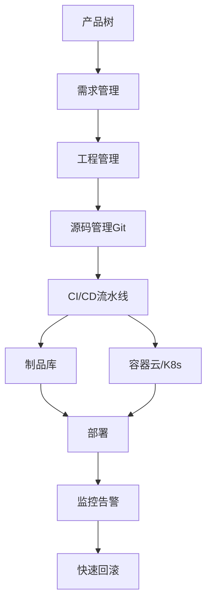

---

## 三、DevOps平台演进至一站式研发平台

### 3.1 v1.0存在的问题

经过一段时间使用,发现五大不足:

**1. 流水线执行不够灵活**

- 导致负载过高
- 耗费更多资源

**2. 缺乏工程全生命周期管理**

- 大量工程处于"散养"状态

**3. 工具平台分散**

- 基础服务和工具众多
- 需要多个平台来回切换
- 增加开发人员负担

**4. 缺乏高效自主的研发工作流**

- 大量工作需要人工处理

**5. 缺乏成本管控手段**

- 服务器成本居高不下

---

### 3.2 流水线重构

#### 3.2.1 原子任务拆解

**任务分类:**

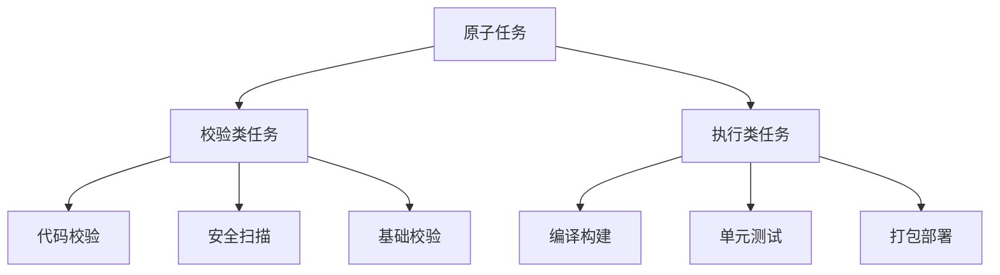

**特点**: 将流水线任务拆解为独立的原子任务

#### 3.2.2 预设流水线任务列表

根据三个维度预设:

1. 工程开发语言
2. 发布方式(虚拟机/容器)
3. 推送环境

**Java虚拟机发布示例:**

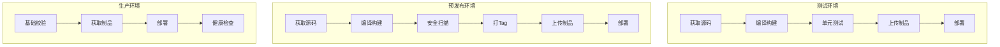

#### 3.2.3 同步与异步任务

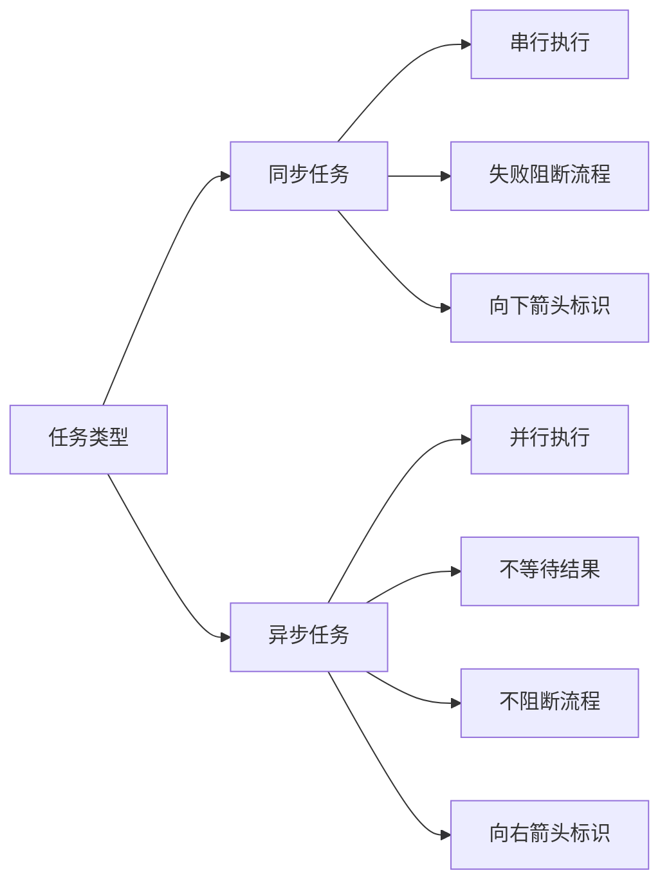

**应用场景:**

- 单元测试要求高的工程 → 同步任务
- 单元测试要求低的工程 → 异步任务

#### 3.2.4 自研Jenkins Slave MQ插件

**重构前: API通信方式**

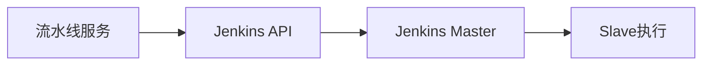

**重构后: MQ通信方式**

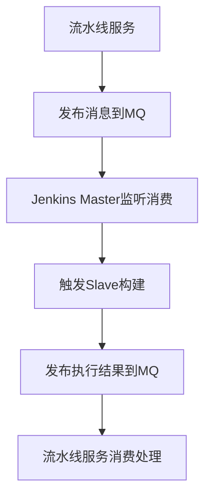

**优势:**

- 极大提升通信成功率
- 异步解耦,更加可靠

#### 3.2.5 Jenkins Slave容器化

**重构前: 虚拟机部署**

**问题:**

- 节点数少 → 无法满足高并发
- 节点数多 → 造成资源浪费
- 维护成本高(如需支持多版本Node.js,需逐个节点安装)

**重构后: K8s容器化**

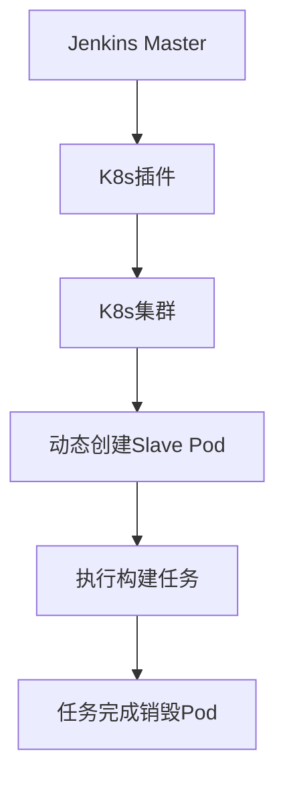

**优势:**

1. 利用K8s特性动态调整节点数
2. 满足高并发同时不造成资源浪费
3. 维护简单: 重新构建Slave镜像即可批量更新

#### 3.2.6 流水线重构成果

**1. 执行任务更灵活**

- 按实际情况动态调整执行任务
- 因地制宜

**2. 高可用**

- 提升流水线执行成功率

**3. 资源优化**

- 通过K8s实现Slave节点动态扩缩容
- 满足高并发同时节约服务器资源

---

### 3.3 工程全生命周期管理

#### 3.3.1 创建工程 - 六大工程类型

```mermaid
graph TD
    A[工程类型] --> B[公网域名访问]
    A --> C[内部访问]
    A --> D[不走流水线]
    A --> E[定时任务]
    A --> F[消息队列消费者]
    A --> G[其他服务]
```

**特点:**

- 六大类型完全覆盖所有研发需求
- 填写简单配置即可一键创建
- 创建完成即为可部署工程

#### 3.3.2 管理工程

**初始化配套组件,实现研发阶段全面赋能:**

```mermaid
graph TD
    A[工程管理] --> B[基础信息管理]
    A --> C[资源管理]
    A --> D[配置管理]
    A --> E[监控告警]
    A --> F[安全管理]
  
    B --> B1[关联产品]
    B --> B2[工程移交]
    B --> B3[服务校验]
    B --> B4[批量重启]
    B --> B5[权限管理]
    B --> B6[工程下线]
    B --> B7[月可用性]
    B --> B8[研发成本]
  
    C --> C1[实例管理]
    C --> C2[进入容器]
    C --> C3[健康监控]
    C --> C4[在线诊断]
    C --> C5[重启服务]
    C --> C6[上下游依赖]
    C --> C7[数据库资源]
  
    D --> D1[配置中心管理]
    D --> D2[调度任务管理]
    D --> D3[域名管理]
    D --> D4[敏感数据识别]
  
    E --> E1[可用性告警]
    E --> E2[告警原因查看]
  
    F --> F1[组件安全扫描]
    F --> F2[历史漏洞查看]
```

**核心功能详解:**

**基础信息管理:**

- 更改关联产品
- 工程移交(离职/转岗)
- 服务校验
- 批量重启服务(滚动重启)
- 添加权限
- 工程下线
- 查看月可用性
- 查看研发成本

**资源管理:**

- 管理服务实例
- 进入容器
- 监控健康状态
- 在线诊断
- 重启服务
- 查看上下游依赖关系
- 查看数据库资源(支持数据变更、表变更、冷热表处理)

**配置管理:**

- 配置中心管理(添加、修改、删除)
- 调度任务管理(添加、手动执行)
- 域名管理(添加、验证、敏感数据识别)

**监控告警:**

- 可用性告警查看
- 告警原因分析

**安全管理:**

- 组件安全扫描
- 历史漏洞查看

#### 3.3.3 下线工程

**智能检测中心:**

```mermaid
graph TD
    A[智能检测中心] --> B[检测无用工程]
    B --> C[通知工程负责人]
    C --> D[引导下线操作]
  
    D --> E[检查依赖关系]
    D --> F[检查域名]
    D --> G[检查主机信息]
    D --> H[检查中间件]
    D --> I[检查数据库]
  
    E --> J[一键下线]
    F --> J
    G --> J
    H --> J
    I --> J
```

**特点:**

- 自动检测无用工程
- 一步步引导用户下线
- 用户只需一键操作

#### 3.3.4 全生命周期管理总结

```mermaid
graph LR
    A[创建工程] --> B[开发阶段]
    B --> C[发布上线]
    C --> D[运维管理]
    D --> E[下线工程]
  
    A -.自主完成.-> A
    B -.自主完成.-> B
    C -.自主完成.-> C
    D -.自主完成.-> D
    E -.自主完成.-> E
```

**价值**: 研发人员可完全自主完成工程全生命周期管理

---

### 3.4 高效工作流系统

#### 3.4.1 工作流系统设计背景

**v1.0问题:**

- 使用Java实现类似工作流
- 实际执行仍需人工完成
- 存在诸多限制

**解决方案**: 自主研发专用于研发阶段的工作流系统

#### 3.4.2 三步自定义工作流模板

```mermaid
graph LR
    A[步骤1: 自定义流程信息] --> B[步骤2: 自定义表单内容]
    B --> C[步骤3: 自定义流转节点]
```

**步骤1: 自定义流程信息**

- 编辑基本信息

**步骤2: 自定义表单内容**

- 提供丰富表单组件
- 文本框、单选框、复选框等

**步骤3: 自定义流转节点**

- 为每个节点设置经办人
- 经办人可以是"系统"
- 系统经办时根据工作流类型执行对应后台任务

#### 3.4.3 三步创建工作流

```mermaid
graph LR
    A[步骤1: 选择工作流模板] --> B[步骤2: 填写表单]
    B --> C[步骤3: 提交]
```

#### 3.4.4 工作流执行记录

```mermaid
graph LR
    A[发起] --> B[节点1审批]
    B --> C[节点2执行]
    C --> D[节点3审批]
    D --> E[结束]
  
    B -.记录执行人.-> B
    B -.记录提交信息.-> B
    B -.记录经办时间.-> B
```

**记录内容:**

- 每个流转节点的执行人
- 每个执行人提交的信息
- 经办时间
- 完整执行轨迹

#### 3.4.5 系统任务自动执行

**预制数十种系统执行任务,覆盖所有研发需求:**

```mermaid
graph TD
    A[系统任务类型] --> B[数据库操作]
    A --> C[运维操作]
  
    B --> B1[数据变更]
    B --> B2[库表结构变更]
  
    C --> C1[添加测试域名白名单]
    C --> C2[重启虚拟机服务]
    C --> C3[其他运维任务]
```

**触发条件**: 当流转到某节点且经办人为"系统"时自动执行

#### 3.4.6 通知与催办机制

```mermaid
graph LR
    A[流转到节点] --> B[系统通知]
    A --> C[用户催办]
  
    C --> D[飞书通知]
    C --> E[电话通知]
```

**目的**: 尽可能缩短工作流办理时间

#### 3.4.7 工作流系统成果

**1. 动态生成流程**

- 100%自定义
- 数十种工作流100%满足研发需求

**2. 多维度代办提醒**

- 工作效率最大化

**3. 节点自动执行**

- 替代人工处理

---

### 3.5 研发成本管理

#### 3.5.1 成本管理系统设计

**背景**: 研发成本的隐蔽性和不可控性

**解决方案**: 开发研发成本管理系统

#### 3.5.2 成本计算维度

```mermaid
graph TD
    A[部门] --> B[产品]
    B --> C[工程]
    C --> D[服务实例]
  
    D --> E[实例费用计算]
    E --> F[工程总费用]
    F --> G[产品总费用]
    G --> H[部门总费用]
```

**计算路径**: 实例 → 工程 → 产品 → 部门

#### 3.5.3 实例费用计算规则

**计算因素:**

- CPU配额
- 内存配额
- 存储配额
- 运行时长

#### 3.5.4 成本管控机制

```mermaid
graph TD
    A[统计部门成本] --> B[设置成本预算]
    B --> C{是否超预算?}
    C -->|是| D[限制发布]
    C -->|否| E[允许发布]
```

**管控策略:**

- 为每个部门设置成本预算
- 超预算则限制该部门产品对应工程的发布

---

### 3.6 v2.0成果总结

**1. 流水线2.0**

- 丰富灵活的原子任务
- 支持各种业务场景
- 支持高并发、高可用
- 不造成资源浪费

**2. 工程全生命周期管理**

- 100%掌控研发资料
- 从创建到下线全流程自主管理

**3. 一站式管理**

- 整合基础服务和工具
- 减少开发人员负担
- 提供帮助文档

**4. 强大高效的工作流系统**

- 极大提升研发效率
- 自动化替代人工

**5. 成本管理系统**

- 记录每个产品的研发费用
- 严格管控研发成本

---

## 四、Q&A精选

### Q1: 达成这样的系统大概需要多少人力资源和时间?

**A:**

- **时间**: 2016年Q3开始,历时3个月发布第一个版本
- **人力**:
  - 运维人员: 5-6人
  - 开发人员: 10人左右
  - 总计: 16-17人

### Q2: 如何度量是否给产品真正提升了研发效能?

**A:**

- 统计每个工程的上线时间
- 从需求评审到上线的完整周期
- 每隔一段时间统计分析变化趋势

### Q3: 如何进行技术选型?

**A:**

- 参考亚马逊的DevOps实践
- 结合日常工作中遇到的痛点
- 选择最适合当前现状的技术方案

### Q4: 对DevOps运维转型组织层面的调整有什么建议?

**A:**

- DevOps需要多方面协同
- 需要能力强的开发人员和运维人员合力
- 需要自上而下的支持

### Q5: 传统业务迁移至DevOps有什么思路?

**A:**

- 首先对公司内部技术体系进行标准化统一
- 需要自上而下的推动
- 可以借鉴"腾云行动"这种全公司级别的改革运动

### Q6: 主流的CI/CD开源工具推荐?

**A:**

- **GitLab CI/CD**: 小规模团队的不错选择
- 体验良好,适合初期搭建

### Q7: 中型企业引入DevOps体系初期阶段,怎么和中台业务进行有效衔接?

**A:**

- 统一技术栈是关键
- 需要自上而下的推动
- 单纯从平台团队推动比较困难

### Q8: 每个代码merge request是否可以关联到具体哪个需求?

**A:**

- 在需求发布流程的提醒研发阶段
- 用户需填写本次需求涉及的工程和分支
- 流水线的基础校验会校验推送的工程和分支是否匹配

### Q9: 流水线有引入IaC或Serverless类似的实践吗?

**A:**

- 考虑过BizDevOps概念
- 需要快速生成业务代码(Serverless)
- 因公司迭代需求变化快,可行性不高
- 需要更长时间沉淀

### Q10: Jenkins和插件的安全问题如何处理?

**A:**

- 一般情况不做Jenkins升级操作
- 确实遇到漏洞才进行升级修复
- 升级过程可能比较漫长

### Q11: 如何实现需求端到端(全生命周期)的管理?

**A:**

- 一站式研发平台包含需求管理板块
- 从需求创建到上线的完整过程串联
- 每个过程有准入准出标准
- 本次分享未详细展开

---

## 总结

猪八戒网的DevOps演进历程展示了从零到一构建DevOps平台,再演进为一站式研发平台的完整实践路径。通过标准化研发流程、自动化CI/CD流水线、工程全生命周期管理、高效工作流系统和成本管理,最终实现了:

- **效率提升**: 交付周期从"月"缩短至"周"甚至"天"
- **成本降低**: 运维人员从40人降至不到10人
- **质量保障**: 快速回滚机制,全站可用性提升
- **规模支撑**: 支持500+研发人员日常研发工作

这一演进过程为其他企业的DevOps实践提供了宝贵的参考经验。

---

**关注八戒技术团队公众号,获取更多技术分享**
