# 如何用敏捷思维做好中大型项目管理

> 来源：未核验 · 类型：分享 · 状态：draft


## 分享嘉宾简介

- **工作经验**: 17年
- **项目管理经验**: 10年
- **认证资质**: PMP、Scrum、SP等
- **著作**: 2019年出版项目管理相关书籍
- **学历**: 澳科大EMBA在读
- **公众号**: 项目管理跃迁

## 一、项目背景

### 1.1 中大型项目定义

本次分享基于一个真实的3D大地图SLG手游项目，从两个维度定义为中大型项目：

**产品复杂度维度**:
- 真实3D大地图SLG手游
- 系统功能数量: 100-200个系统
- 大量3D场景、模型等美术资源

**团队规模维度**:
- 最高峰: 130人
- 阶段性增长:
  - Demo研发阶段: 40人
  - 核心玩法完善: 60人
  - 内容铺量: 100人
  - 体验测试+发行运营: 130人

### 1.2 组织结构特点

- 研运一体的组织结构
- 园林一体的团队配置
- 跨职能协作要求高

## 二、认识敏捷

### 2.1 敏捷的诞生

- **时间线**: 20世纪60年代 → 2001年
- **里程碑**: 2001年17位大佬在美国犹他州发布《敏捷软件开发宣言》

### 2.2 敏捷四大价值观

1. **个体和互动** 胜过 流程与工具
2. **可用的软件** 胜过 详尽的文档
3. **客户协作** 胜过 合同谈判
4. **响应变化** 胜过 遵循计划

> 注: 右边的内容也很重要,但左边的内容更重要

### 2.3 敏捷十二项原则核心要点

**价值交付类**:
- 第一优先任务: 通过尽早且持续交付有价值的软件来满足客户
- 可工作的软件是进度的主要度量标准
- 持续关注技术卓越和良好设计

**团队协作类**:
- 面对面沟通是最有效的方式
- 激发个体的斗志,给予信任和支持
- 定期反省和调整团队行为

**响应变化类**:
- 欢迎需求变化,即使在开发后期
- 保持可持续的开发节奏
- 简洁为本,最大化未完成工作量

### 2.4 敏捷的定义

敏捷是一种**思维方式**和**心态**,基于敏捷价值观、原则和实践:
- 适应互联网+/AI+时代的思维方式
- 做事情的哲学理念
- **不仅仅是为了快速交付,而是为了发现价值**

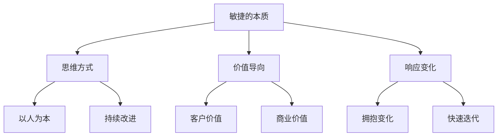

## 三、为什么选择敏捷思维

### 3.1 项目经济时代的要求

**传统项目定义**:
- 创造独特的产品、服务或结果的临时性工作

**项目经济时代定义**:
- 项目存在于更大的系统中
- 以创造价值的方式运作
- 关注点从交付物转向价值实现

**价值创造的五个方面**:
1. 创造满足客户/最终用户需要的新产品、服务或结果
2. 做出积极的社会或环境贡献
3. 持续改进以前的运营
4. 带来收益
5. 实现组织目标

### 3.2 适应复杂环境

在VUCA/BANI时代面临的挑战:
- **不确定性** (Uncertainty)
- **复杂性** (Complexity)
- **模糊性** (Ambiguity)
- **易变性** (Volatility)

敏捷思维的优势:
- 快速响应市场变化
- 及时调整产品方向
- 保持竞争优势
- 顺应时代需求,以创造产品最大价值为核心

### 3.3 面对现实解决问题

**核心理念**:
- 重原则而非流程
- 不陷入具体方法论
- 面对挑战,将威胁转化为机会
- 以原则指导实际行动

**实践要点**:
- 不是必须使用Scrum、XP等特定方法
- 根据项目特点灵活选择
- 可以采用混合式方法(瀑布+敏捷)

## 四、敏捷思维概述

### 4.1 敏捷理念

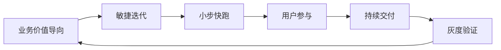

核心要素:
- 以业务价值为导向
- 敏捷迭代,小步快跑
- 鼓励用户参与
- 持续交付
- 灰度验证
- 拥抱变化

### 4.2 敏捷思维下的产品交付

基于规模化敏捷(SAFe 5.0)的三个核心点:

#### 4.2.1 以用户为中心实现产品价值

- 客户是上帝,用户为本
- 从玩家/用户角度思考
- 关注用户情感需求
- 构建完整解决方案
- 得用户者得天下

#### 4.2.2 产品循环交付,按节奏发布

**与传统方式的区别**:

传统方式:
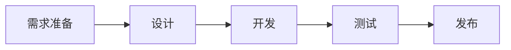

敏捷方式:
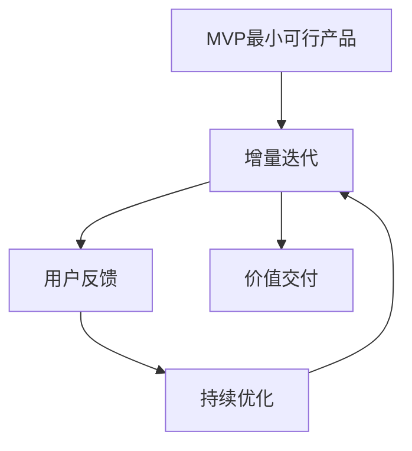

**特点**:
- 从MVP开始
- 持续增量和迭代
- 不断收集用户反馈
- 好的功能持续加强
- 不好的功能及时改进

#### 4.2.3 研运一体的持续交付流水线

**DevOps核心**:
- 强调人与人之间的沟通、协作、集成
- 自动化监控
- 持续集成(CI)
- 持续部署(CD)
- 持续交付
- 按需发布

**优势**:
- 功能完成即可部署
- 快速获得市场反馈
- 降低交付风险
- 提高响应速度

### 4.3 敏捷思维下的研发过程对比

#### 传统一年期研发项目
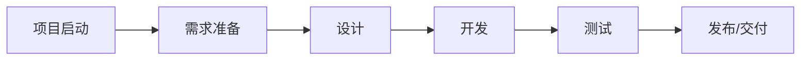

**问题**:
- 客户未真正参与
- 交付时才发现与预期差距大
- 风险集中在最后
- 调整成本高

#### 敏捷一年期研发项目
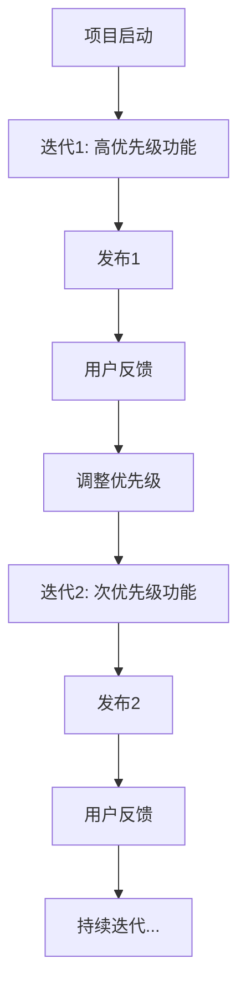

**优势**:
- 持续交付最有价值的功能
- 用户全程参与
- 及时获得反馈
- 灵活调整优先级
- 降低交付风险

### 4.4 如何建立和提升敏捷思维

#### 4.4.1 管理者思维与时俱进

- 领导者需要具备敏捷思维
- 保持开放性态度
- 具备成长型思维
- 思维驱动行动和行为

#### 4.4.2 建立合适的项目管理组织

**问题**:
- 矩阵式组织中各部门有各自目标
- 不利于敏捷项目推进
- 无法高效完成组织目标

**解决方案**:
- 建立适合的项目管理组织
- 统一目标导向
- 减少部门墙

#### 4.4.3 成立管理层统一领导模式

**挑战**:
- 项目经理"有责无权"或"微权力"
- 难以调动和整合资源

**解决方案**:
- 管理层统一领导
- 项目经理具体执行
- 形成领导团队支持

#### 4.4.4 灵活运用各类敏捷方法论

**核心观点**:
- 建立组织敏捷力 ≠ 简单使用某种敏捷方法论
- 不要生搬硬套Scrum、看板、XP等
- 没有唯一答案

**选择原则**:
- 根据项目类型决定
- 根据团队特点决定
- 定制化考虑
- 只要对项目目标实现有利,都是好方法
- 可以采用瀑布+敏捷的混合方法

**务实视角**:
- 面对现实
- 解决问题为导向
- 能够实现项目目标
- 为客户创造价值

#### 4.4.5 真正做到以人为本

**组织行为学的人员分类**:
1. 个体
2. 群体
3. 物(劳动力)

**敏捷视角**:
- 人是项目中最重要、最具价值的资源
- 不仅仅是劳动力
- 关注投入度和情感
- 最具创造力的资源

**实践要点**:
- 不仅关注任务完成
- 更关注目标和价值实现
- 人性化校准目标(而非仅校准计划)
- 提倡集中办公,促进沟通
- 营造乐观、积极、充满激情的氛围

#### 4.4.6 强调快速迭代和持续学习

- 保持学习状态
- 快速试错
- 持续改进
- 知识积累

## 五、敏捷思维项目管理框架

### 5.1 敏捷项目管理要点

1. **以人为本**的项目管理方式
2. **紧盯愿景和目标**,而不是紧盯计划
3. **充分授权**,不要害怕授权
4. **以价值驱动**的项目管理

### 5.2 项目管理框架全景

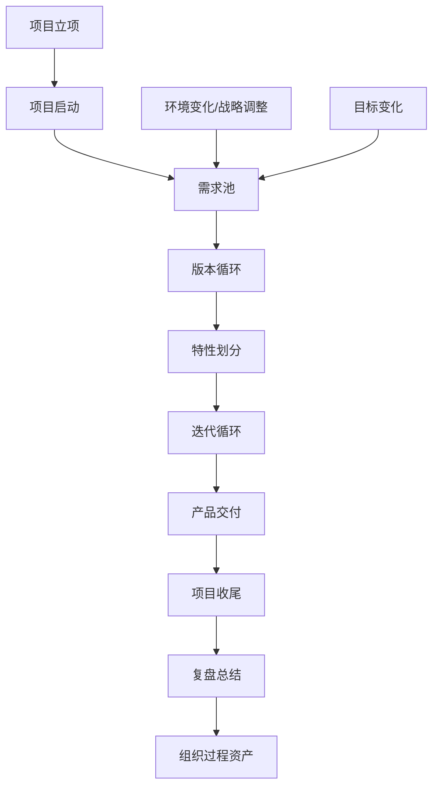

**框架说明**:
- 以版本循环为核心
- 根据环境和战略变化调整需求
- 版本内划分特性
- 特性内进行迭代循环
- 持续交付,持续改进

### 5.3 阶段划分与里程碑

**典型阶段**:
1. Demo研发
2. 核心切片(核心玩法)
3. 内容铺量
4. 打磨调优
5. 测试调优
6. 商业准备
7. 对外测试

每个里程碑:
- 有明确的目标
- 有核心工作内容
- 有交付物标准
- 可包含1-3个版本

### 5.4 版本循环流程

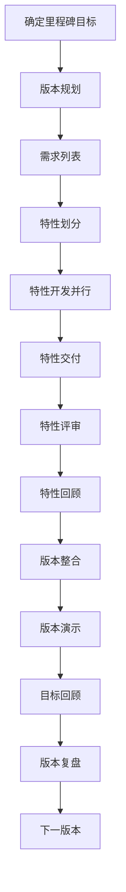

## 六、敏捷思维项目管理实践

### 6.1 组织敏捷

#### 6.1.1 优化项目管理架构

**从矩阵式到特性小组**:

传统矩阵式组织:
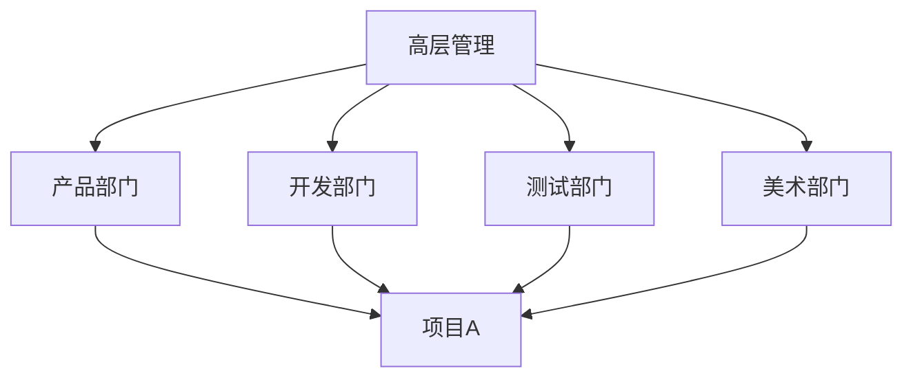

敏捷特性小组:
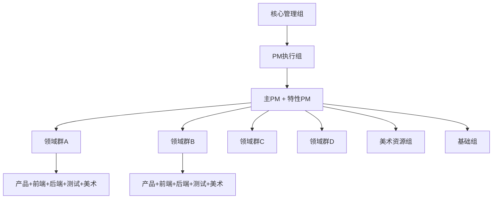

**领域群划分原则**:
- 按功能逻辑划分
- 通常4-6个领域群
- 每个领域群包含完整职能(产品、开发、测试、美术)
- 形成特性小组,平行结构

**组织层级**:
1. **核心管理组**: 战略决策
2. **PM执行组**: 主PM + 特性PM
3. **特性小组**: 具体落地执行

#### 6.1.2 确定PM职责

**主PM两大核心职责**:

**1. 确保项目交付(事的维度)**:
- 组建敏捷组织
- 确定项目管理架构
- 明确目标
- 统筹规划
- 搭建研发环境
- 建设研发体系

**2. 助力组织建设(人的维度)**:
- 持续优化团队沟通与协作
- 促进跨职能协作与整合
- 强化项目管理执行
- 按节奏推进,松弛有度
- 优化资源配置
- 关注团队成长
- 全局最优而非局部最优
- 打造高效能团队

**FO(Feature Owner)职责**:

当PM资源不足时,识别有项目管理意识的团队成员担任FO:
- 明确特性目标
- 详细规划和计划
- 持续跟进具体事项
- 风险管控
- 组织特性回顾和复盘

**PM与FO协作**:
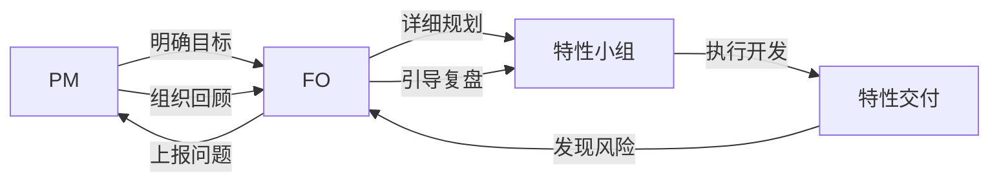

#### 6.1.3 搭建沟通体系

**同步体系**:
- 版本规划会议
- 需求评审会议
- 版本体验会议
- 版本回顾会议
- 日常站会(一三五)

**业务线例会制度**:
- 明确会议时间节点
- 统一沟通标准
- 形成沟通规范

**行为准则**:
- 公开讨论
- 对事不对人
- 及时有效
- 公开坦诚
- 培养敏捷思维

### 6.2 流程敏捷(规范化)

团队规模扩大后,流程规范化、标准化至关重要。

#### 6.2.1 需求输出流程

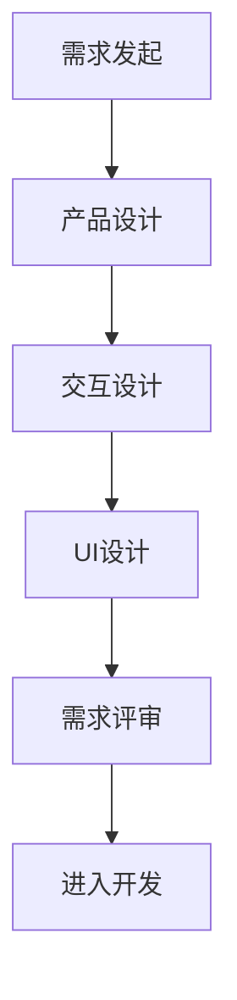

**需求内容交付标准**:
- 明确需求范围
- 详细功能描述
- 交互流程
- UI设计稿
- 验收标准
- 优先级定义

**目的**:
- 在不确定范围下尽可能确定
- 减少需求模糊性
- 降低开发风险

#### 6.2.2 需求确认流程

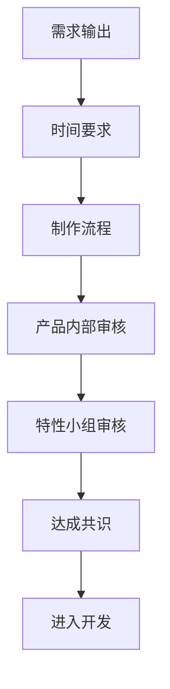

**关键点**:
- 多重审核环节
- 产品内部先达成共识
- 特性小组再达成共识
- 减少不确定性

#### 6.2.3 研发流程

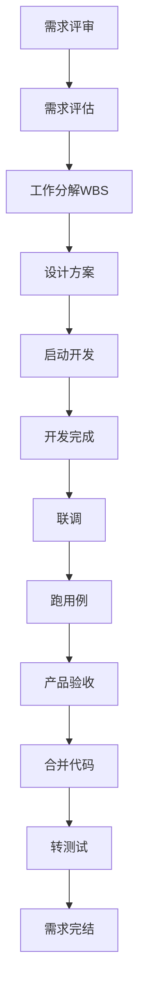

**要点**:
- 明确每个环节的时间节点
- 明确每个角色的职责
- 复杂需求和简单需求区别对待
- 标准化执行流程

#### 6.2.4 美术资源生产管线

**角色分工**:
- 2D原画
- 3D模型
- 场景
- 动作
- 特效
- 交互

**以英雄皮肤为例**:
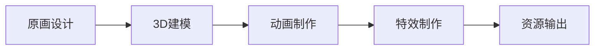

**标准化价值**:
- 明确制作周期
- 便于批量生产
- 资源投入可预测
- 成本可控

**大地图制作管线**:
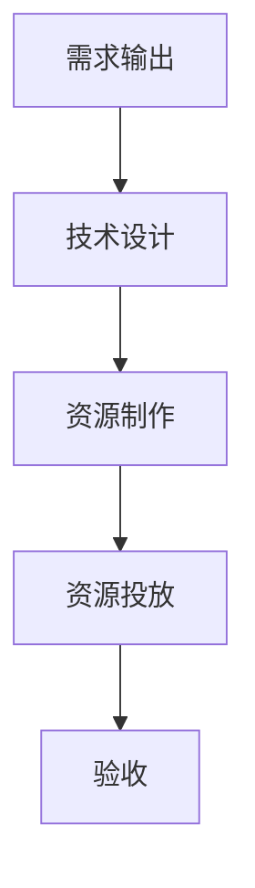

### 6.3 产品敏捷交付

#### 6.3.1 整体思路

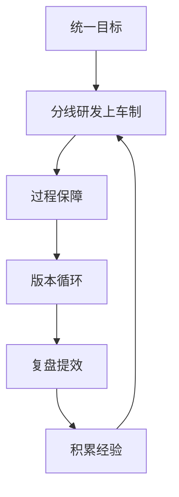

**核心要点**:
- 统一目标
- 分线研发(上车制)
- 过程保障
- 持续复盘
- 经验积累

#### 6.3.2 步骤一: 明确目标与阶段划分

**目标层次**:

1. **项目直接目标**:
   - 范围: 100-200个系统
   - 时间: 项目周期要求
   - 成本: 资源投入预算
   - 质量: 质量标准规范

2. **项目业务目标**(重点关注):
   - 每个里程碑要达到的目标
   - Demo版本目标
   - 核心玩法目标
   - 商业化目标

**目标分解**:
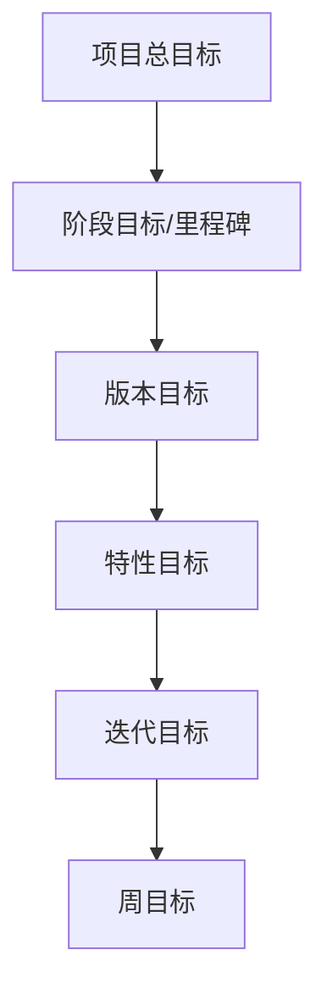

**阶段划分示例**:

| 阶段 | 里程碑 | 核心工作 | 交付物 | 功能需求 |
|------|--------|----------|--------|----------|
| 1 | MVP/Demo | 核心玩法验证 | 可玩Demo | 核心系统 |
| 2 | 核心切片 | 核心内容完善 | 完整核心体验 | 核心+次核心 |
| 3 | 内容铺量 | 大规模内容制作 | 完整内容 | 所有系统 |
| 4 | 打磨调优 | 体验优化 | 高质量版本 | 优化项 |
| 5 | 测试调优 | 质量保障 | 稳定版本 | Bug修复 |
| 6 | 商业准备 | 运营准备 | 可发布版本 | 运营功能 |
| 7 | 对外测试 | 用户验证 | 正式版本 | 最终版本 |

**动态调整**:
- 阶段划分不是固定不变的
- 根据实际情况动态调整
- 以价值为导向

#### 6.3.3 步骤二: 以版本为核心,划分特性

**特性小组组成**:

以中立城玩法为例:
- 地图策划
- 中立城策划
- 前端开发
- 后台开发
- 战斗开发
- 基础/养成线开发
- 美术
- 测试

**特性划分原则**:
- 考虑功能关联性
- 考虑功能耦合度
- 考虑依赖关系
- A、B、C功能耦合则放在同一特性

**版本组成**:
多个特性组合 = 一个版本内容

#### 6.3.4 步骤三: 上车制研发模式

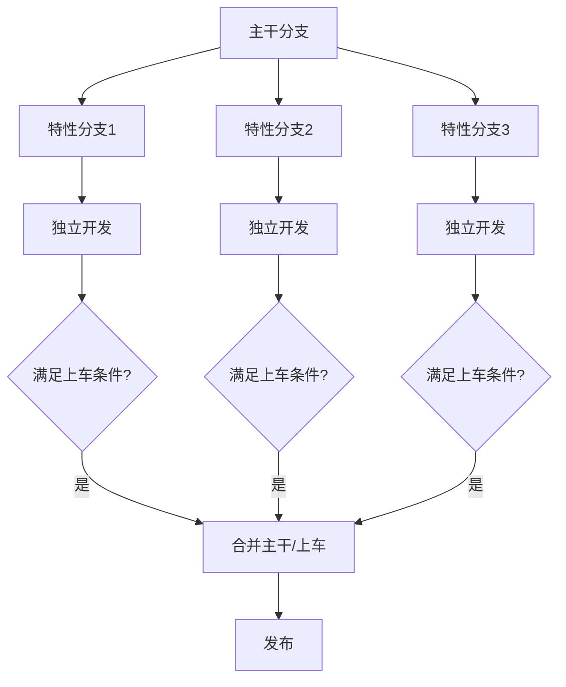

**上车条件**(质量标准):
1. 体验问题全部修改完成
2. 需求功能全部实现
3. 满足质量要求
4. Code Review完成
5. 测试用例通过

**优势**:
- 各特性独立开发,互不影响
- 谁先完成谁先上车
- 降低集成风险
- 支持持续交付

#### 6.3.5 步骤四: 敏捷项目实践

**混合使用方法论**:

项目管理实践:
- Scrum方法的部分实践
- 看板方法
- 瀑布方法的部分实践
- 启动、规划、执行、监控

技术实践:
- 小步快跑
- 敏捷迭代
- 持续提升
- 持续交付
- 持续部署

#### 6.3.6 步骤五: 版本循环六步法

**第一步: 明确版本范围需求**
- 确定里程碑业务目标
- 确定要满足的价值
- 列出需求范围

**第二步: 划分特性**
- 主PM负责
- 考虑功能关联性、耦合度、依赖关系
- 确定参与人员

**第三步: 版本规划会议**
- 核心管理组参与
- 明确需求范围
- 确定人员分工
- 敲定PM/FO负责人

**第四步: 制定计划**
- 主PM与特性PM协作
- 各特性小组做工作分解(WBS)
- 输出特性计划
- 汇总形成版本计划

**第五步: 执行**

特性开发流程:
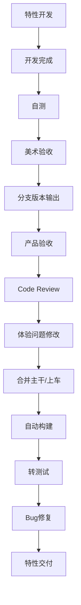

**关键质量控制点**:
- 开发自测: 测试用例通过率90-95%
- 产品验收: 体验问题全部修改
- Code Review: 代码质量保障
- 测试: Bug收敛到标准

**第六步: 发布与回顾**

发布回顾内容:
1. **版本演示**: 展示所有功能(可交付的产品为主)
2. **数据展示**: 版本数据统计
3. **产品规划**: 下一阶段规划和想法
4. **技术分享**: 技术难点、美术亮点
5. **目标回顾**: 是否达成预期目标
6. **复盘**:
   - 好的方面
   - 需要改进的方面
   - 开心的事情
   - 不开心的事情

#### 6.3.7 步骤六: 确定交付标准

**质量标准细化**:

从抽象到具体:
- 甲方要求 → 具体细则
- 每个版本/迭代/需求的达成状态

**交付标准示例**:
- 需求功能完成度: 100%
- 资源回路完成度: 100%
- 开发自测通过率: 95%
- 体验验收问题: 全部修改
- Bug修改率: P0/P1全部修改,P2修改90%

**追求卓越**:
- 敏捷原则强调技术卓越
- 明确的质量标准
- 不妥协的质量要求

#### 6.3.8 步骤七: PM跟进细节,保障过程

**核心理念**: 有过程才有结果

**需求开发全流程跟进**:
```mermaid
graph TD
    A[编码完成] --> B[开发自测]
    B --> C[自测用例评审]
    C --> D[跑自测用例]
    D --> E[达标率检查95%]
    E --> F[分支版本输出]
    F --> G[产品验收]
    G --> H[体验问题输出]
    H --> I[Code Review]
    I --> J[问题修改]
    J --> K[合并主干]
    K --> L[自动构建]
    L --> M[持续集成]
    M --> N[交付测试]
    N --> O[Bug修复]
    O --> P[Bug收敛]
    P --> Q[特性完成]
```

**关键控制点**:
- 自测用例评审(测试、产品、开发、PM参与)
- 自测通过率必须达标
- 体验问题全部修改
- Code Review问题全部解决
- Bug收敛到标准

#### 6.3.9 步骤八: 总结经验,复盘提效

**效率公式**:
```
效率 = 目标 × 能力 × 速度
```

**复盘的重要性**:
- 敏捷原则特别强调
- 每个版本必须复盘
- 团队复盘 + PM复盘

**复盘内容**:
- 关注团队感受
- 关注执行情况
- 推动工具建设
- 自动化工具
- 积累和沉淀经验

**持续改进**:
- 下一个迭代跑得更好
- 下一个版本跑得更好
- 形成组织过程资产

### 6.4 敏捷团队管理

#### 6.4.1 敏捷团队管理方式

**从命令型到支持型**:

命令型(传统):
```mermaid
graph TD
    A[管理者] -->|命令| B[团队成员]
    A -->|分配任务| B
    A -->|监督执行| B
```

支持型(敏捷):
```mermaid
graph BT
    A[团队成员] -->|需要支持| B[管理者]
    B -->|提供资源| A
    B -->|解决问题| A
    B -->|授权赋能| A
```

**仆人式领导**:
- 以服务来领导
- 管理者为团队提供支持
- 管理者也是一种资源
- 整合资源帮助团队
- 从解决问题到授权赋能

#### 6.4.2 团队状态与绩效关系

基于塔克曼理论(Tuckman Model):

```mermaid
graph LR
    A[组建期Forming] --> B[震荡期Storming]
    B --> C[规范期Norming]
    C --> D[执行期Performing]
    D --> E[结束期Adjourning]
```

**各阶段特点与PM职责**:

| 阶段 | 团队状态 | 工作绩效 | PM职责 | 管理方式 |
|------|----------|----------|--------|----------|
| 组建期 | 印象好,状态好,不熟悉 | 较低 | 示范作用 | 建立规则、流程规范 |
| 震荡期 | 冲突、磨合 | 下降 | 引导思考 | 引导、调解、明确目标 |
| 规范期 | 形成规范、默契 | 上升 | 鼓励授权 | 鼓励、授权、支持 |
| 执行期 | 高效协作 | 最高 | 成为资源 | 授权、支持、关注人的维度 |
| 结束期 | 项目收尾 | 下降 | 总结沉淀 | 复盘、经验总结 |

**PM关注点转移**:
- 组建期: 关注事
- 震荡期: 关注事+人
- 规范期: 事与人并重
- 执行期: 更关注人
- 结束期: 经验沉淀

#### 6.4.3 敏捷团队管理六原则

**1. 设定激动人心的目标**
- 清晰的目标远比其他更重要
- 执行力来源于对目标的充分理解
- 阶段性review和校准
- 目标是画笔,该画的时候要画

**2. 建立团队行为准则**
- 先建立规则
- 规则规范化、标准化
- 形成团队准则
- 共同参与、互信互助、使命必达

**3. 及时反馈,认可成果**
- 关心每个需求完成情况
- 发布评审、版本review
- 及时获得反馈(PM、领导)
- 带领团队打胜仗
- 里程碑达成增强信心
- 创造价值的成就感

**4. 带领团队复盘回顾**
- 帮助团队成长
- 积累经验
- 能力 = 知识 + 经验 + 技能
- 好的沉淀,不好的改进

**5. 多样化团建**
- 该玩就玩,该吃就吃
- 松弛有度
- 营造良好氛围

**6. 持续学习和改进**
- 保持学习状态
- 快速迭代
- 持续优化

## 七、项目经理的价值

### 7.1 PM核心职责

```mermaid
graph TD
    A[PM核心职责] --> B[确保项目交付]
    A --> C[助力组织建设]
    B --> D[事的维度]
    C --> E[人的维度]
    D --> F[为组织实现目标服务]
    E --> F
    F --> G[促使项目为组织创造价值]
```

### 7.2 PM价值三阶段

#### 第一阶段: 事的维度

**初级阶段**:
- 聚焦任务按时完成
- 跟单个需求
- 处理具体事项

**进阶阶段**:
- 聚焦项目目标完成
- 跟完整项目
- 形成方法论

#### 第二阶段: 人的维度

**关注点转移**:
- 不仅关注目标本身
- 关注业务目标达成
- 关注团队凝聚力
- 让团队产生战斗力
- 让不同人员为组织目标服务

**核心能力**:
- 团队管理
- 人员激励
- 冲突解决
- 文化建设

#### 第三阶段: 组织维度

**更高视角**:
- 不仅仅是项目交付
- 关注组织价值创造
- 资源合理配置
- 资源合理使用

**战略思考**:
- 资源永远不够(现实)
- 老板目标永远不合理(现实)
- 如何在有限资源下达成目标?
- 优先级管理
- 全局最优vs局部最优

**所需能力**:
- 领导力
- 战略思维
- 资源整合
- 组织建设

### 7.3 PM价值体现

```mermaid
graph LR
    A[事的维度] -->|方法论成熟| B[人的维度]
    B -->|团队管理成熟| C[组织维度]
    
    A1[任务完成] --> A
    A2[项目交付] --> A
    
    B1[团队凝聚] --> B
    B2[业务目标] --> B
    
    C1[组织价值] --> C
    C2[资源优化] --> C
    C3[战略支持] --> C
```

## 八、总结与思考

### 8.1 核心要点回顾

1. **敏捷不等于快**
   - 敏捷是一种思维方式
   - 核心是发现价值,而非快速交付
   - 以价值为导向

2. **敏捷思维 vs 敏捷方法论**
   - 重原则而非流程
   - 不要陷入方法论条条框框
   - 根据实际情况灵活应用
   - 混合方法是常态

3. **项目经济时代**
   - 关注点从交付物转向价值
   - 项目是创造价值的载体
   - 为组织创造价值是核心

4. **以人为本**
   - 人是最重要的资源
   - 不仅是劳动力,更是创造力
   - 关注投入度和情感
   - 营造良好氛围

5. **持续改进**
   - 复盘的重要性
   - 经验积累
   - 快速迭代
   - 持续学习

### 8.2 实践建议

**对于组织**:
- 管理层思维要与时俱进
- 建立合适的项目管理组织
- 成立统一领导模式
- 给予PM足够支持

**对于PM**:
- 从事到人再到组织的成长路径
- 建立敏捷思维而非死记方法论
- 关注过程保障
- 带领团队持续改进
- 提升领导力

**对于团队**:
- 建立共同目标
- 形成行为准则
- 持续学习成长
- 拥抱变化

### 8.3 关键成功因素

1. **清晰的目标**: 执行力来源于对目标的充分理解
2. **规范的流程**: 团队规模大时尤为重要
3. **质量标准**: 明确的交付标准,追求卓越
4. **持续交付**: 小步快跑,快速验证
5. **用户参与**: 全程参与,及时反馈
6. **团队协作**: 跨职能协作,高效沟通
7. **复盘改进**: 持续优化,经验沉淀

### 8.4 常见挑战与应对

| 挑战 | 应对策略 |
|------|----------|
| 需求频繁变更 | 以价值为导向,明确目标,快速迭代验证 |
| 资源不足 | 优先级管理,全局最优,合理配置 |
| 团队协作困难 | 建立规范,明确职责,强化沟通 |
| 质量难以保障 | 明确标准,过程控制,多重审核 |
| 进度难以把控 | 重规划,风险管理,及时调整 |
| 目标不清晰 | 阶段性review,持续校准 |

### 8.5 最后的思考

> "敏捷不是银弹,但敏捷思维可以帮助我们更好地应对复杂环境"

**核心理念**:
- 面对现实
- 解决问题
- 创造价值
- 持续改进

**成功的关键**:
- 不是选择了什么方法论
- 而是是否真正理解了敏捷的本质
- 是否以价值为导向
- 是否持续为组织创造价值

---

## 附录: 推荐资源

### 书籍推荐
1. 《敏捷项目管理基础知识与应用实务》
2. 《规模化敏捷SAFe 5.0》(现已有6.0版本)
3. PMBOK第七版

### 关键词
- 敏捷思维
- 项目经济时代
- 价值导向
- 上车制
- 仆人式领导
- 持续交付
- DevOps
- 复盘改进

### 联系方式
- 公众号: 项目管理跃迁
- 欢迎线下交流探讨

---

*本文档整理自技术分享音频转录,内容基于130人规模的3D SLG手游项目实践经验*

