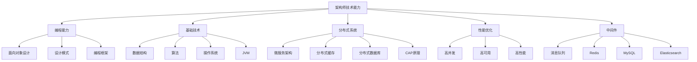
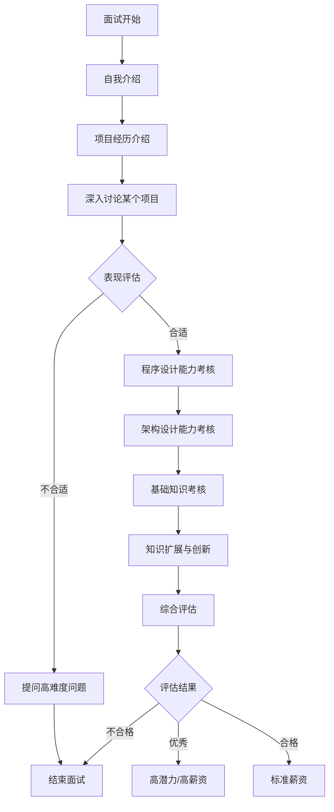
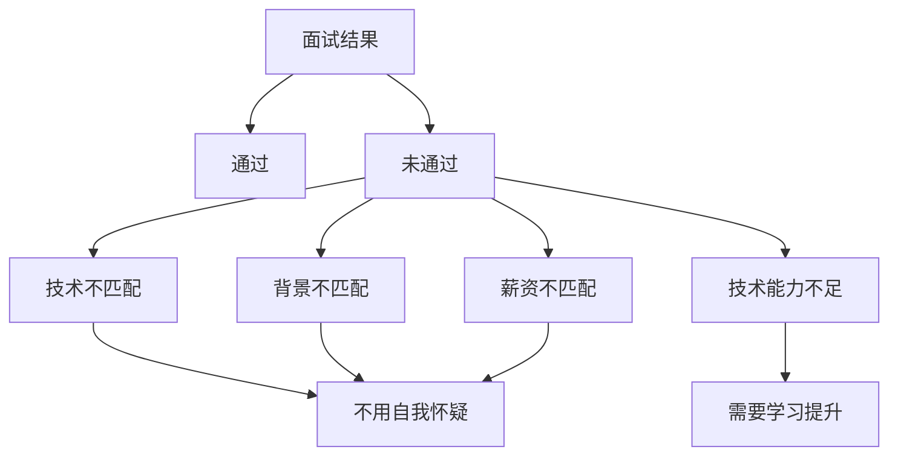
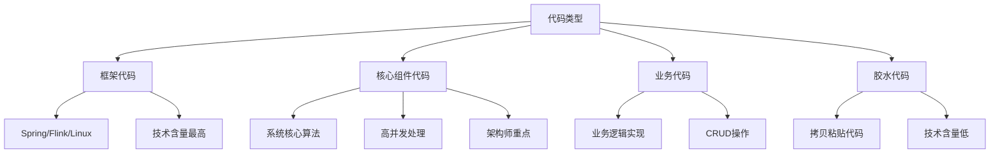
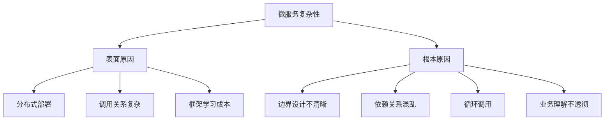
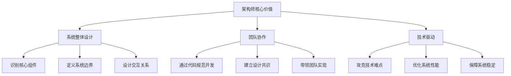

# 大厂架构师必备技能和面试避杀技

> 来源：未核验 · 类型：分享 · 状态：draft

## 分享嘉宾

**李智慧** - 阿里巴巴/英特尔架构师
- 专注于分布式系统和大数据开发
- 《大型网站技术架构核心原理与案例分析》作者
- 《架构师的自我修炼》作者

---

## 一、大厂架构师招聘要求分析

### 1.1 核心职责要求

#### 职责一：整体架构设计
- **核心工作**：负责应用后台产品的整体架构设计
- **关键问题**：
  - 架构设计到底要设计什么？
  - 设计出来的产物是什么形态？
  - 如何将架构设计转化为可执行的系统？

#### 职责二：核心组件开发
- **工作内容**：主导核心组件服务的编码和上线
- **核心能力**：
  - 识别系统的核心组件
  - 设计核心组件的架构
  - 亲自开发核心组件
  - 通过核心组件驱动整个系统运行

#### 职责三：性能优化与瓶颈定位
- **关键任务**：
  - 定位系统瓶颈
  - 提升系统性能
  - 保证系统稳定性
  - 提高业务扩展性

#### 职责四：跨部门协作
- 主导跨部门协作
- 复杂功能调研、设计、协调实施和落地
- 要求具备业务理解能力

### 1.2 技术能力要求

通过分析多家大厂的招聘要求，核心技术要求高度一致：

### 1.3 反复出现的技术关键词

| 技术领域 | 具体技术栈 |
|---------|-----------|
| **框架** | Spring、Spring Boot、Spring Cloud、MyBatis |
| **数据库** | MySQL、HBase、分布式数据库 |
| **缓存** | Redis、分布式缓存 |
| **消息** | MQ、消息中间件、Kafka |
| **搜索** | Elasticsearch |
| **系统特性** | 高并发、高可用、高性能 |
| **架构模式** | 微服务、分布式系统、负载均衡 |
| **其他** | 团队协作、沟通能力 |

### 1.4 跨公司岗位的共性

**关键发现**：不同业务方向的互联网公司（淘宝、京东、头条、滴滴），虽然业务场景不同，但技术挑战和架构师要求高度相似。

**原因**：
- 使用相同的技术栈
- 面临相似的技术挑战（高并发、大流量、海量数据）
- 架构模式趋同

**结论**：掌握这套技术体系，可以在各大厂之间自由流动。

---

## 二、架构师核心能力模型

### 2.1 七大核心能力

```mermaid
graph TD
    A[架构师能力模型] --> B[1.编程能力]
    A --> C[2.基础技术能力]
    A --> D[3.技术产品应用能力]
    A --> E[4.性能优化与故障分析]
    A --> F[5.架构模式与框架]
    A --> G[6.建模与设计文档]
    A --> H[7.业务理解与沟通]
    
    B --> B1[面向对象编程]
    B --> B2[设计模式]
    B --> B3[框架开发能力]
    
    C --> C1[数据结构]
    C --> C2[操作系统]
    C --> C3[数据库原理]
    C --> C4[虚拟机]
    
    D --> D1[Spring/Redis/MQ使用]
    D --> D2[深入理解实现原理]
    D --> D3[能够自己实现]
    
    E --> E1[定位瓶颈]
    E --> E2[性能优化方法]
    E --> E3[故障分析]
    
    F --> F1[分布式架构]
    F --> F2[高并发设计]
    F --> F3[架构模式应用]
    
    G --> G1[UML建模]
    G --> G2[设计文档编写]
    G --> G3[团队协作]
    
    H --> H1[业务需求理解]
    H --> H2[模块拆解]
    H --> H3[沟通与领导力]
```

### 2.2 能力要求详解

#### 能力1：编程能力
- **要求**：不仅会用框架，还要能开发框架
- **关键点**：把你用过的技术自己实现出来
- **示例**：能够实现Spring AOP、Spring DI等核心功能

#### 能力2：基础技术掌握
- 数据结构
- 算法
- 操作系统
- 数据库原理
- JVM原理

#### 能力3：技术产品理解与应用
- **层次一**：会用（基本要求）
- **层次二**：理解原理（架构师要求）
- **层次三**：能够自己实现（优秀架构师）

#### 能力4：性能优化与故障分析
- 定位系统瓶颈的方法
- 性能优化的通用思路
- 故障分析能力
- 系统监控与诊断

#### 能力5：架构模式与框架
- 分布式系统设计
- 高并发架构
- 高可用架构
- 微服务架构

#### 能力6：建模与设计文档能力
- **核心理念**：架构师不是一个人完成系统开发，而是通过设计带领团队完成
- **产物**：设计文档、架构图、接口定义
- **目标**：让团队共享同一个设计，协同开发

#### 能力7：业务理解与沟通
- 业务需求分析
- 功能模块拆解
- 快速学习能力
- 沟通与领导能力

---

## 三、典型技术面试流程

### 3.1 面试流程图

### 3.2 面试阶段详解

#### 第一阶段：开场与项目讨论（关键阶段）
- **目标**：评估背景是否匹配
- **内容**：
  - 自我介绍
  - 项目经历
  - 选择一个项目深入讨论
  - 技术难点与解决方案
  - 架构设计思路

- **关键点**：这个阶段基本决定面试结果
  - 如果不匹配，后续会问高难度问题快速结束
  - 如果匹配，继续深入考核

#### 第二阶段：程序设计能力
- 设计模式应用
- 设计原则理解
- 框架设计能力
- 编程技巧

**典型问题**：
- Spring AOP如何实现？
- 如果让你实现一个AOP框架，你会怎么做？

#### 第三阶段：架构设计能力
- 高并发系统设计
- 高可用架构
- 高性能优化
- 分布式系统设计
- 大数据处理

#### 第四阶段：基础知识考核
- 数据结构
- 算法
- 操作系统知识
- 网络协议

#### 第五阶段：知识扩展
- 区块链等新技术
- 技术趋势判断
- 创新思维
- 独到见解

**影响**：
- 决定是否为重点培养对象
- 影响薪资上限
- 体现发展潜力

---

## 四、高频面试题解析

### 4.1 基础技术类

#### 问题1：哈希表为什么能O(1)查找？

**关键回答**：
- 哈希表的本质是数组
- 通过Key快速计算出数组下标
- 根据下标在数组中O(1)获取Value

**延伸问题**：
- 如何根据Key计算下标？
- 哈希算法有哪些？
- 哈希冲突如何解决？

#### 问题2：关系数据库索引如何存储？

**关键回答**：B+树

**延伸问题**：
- B+树如何组织？
- 为什么4层B+树可以完成海量数据检索？
- 聚簇索引和非聚簇索引的区别？

#### 问题3：JVM垃圾回收原理

**回答要点**：
1. **垃圾识别**：从对象根开始标记遍历
   - 对象根包括：栈帧中的局部变量、静态变量等
   
2. **分代回收**：
   - 新生代：Eden区、From区、To区
   - 老年代
   
3. **垃圾回收器演进**：
   - Serial：串行垃圾回收器
   - Parallel：并行垃圾回收器
   - CMS：并发垃圾回收器
   - G1：最新的垃圾回收器

**延伸问题**：
- Parallel和CMS分别适用什么场景？
- 为什么需要不同的垃圾回收器？

### 4.2 编程设计类

#### 问题4：Spring如何实现单例？

**关键回答**：
- 通过单例注册表（容器）实现
- 本质是一个哈希表：Key为Class全路径，Value为对象实例
- 每次使用时从容器中获取，不需要重新创建

**对比**：
- 设计模式的单例：通过私有构造函数实现
- Spring单例：通过容器管理实现

**优秀回答方式**：
即使不知道标准答案，也要基于基础知识推理：
> "虽然我没看过Spring源码，但我认为可以用哈希表管理对象。Key是类的全路径，Value是对象实例。每次使用时从哈希表中获取，这样就实现了单例。"

**面试官评价**：这种回答体现了：
- 思维能力
- 基础知识扎实
- 快速反应能力
- 自信与技术实力

### 4.3 架构设计类

#### 问题5：淘宝等大型分布式系统使用了哪些技术方案？

**考核点**：
- 分布式缓存
- 分布式数据库
- 消息队列
- 微服务架构
- 负载均衡
- CDN
- 搜索引擎

#### 问题6：什么是CAP原理？

**考核点**：
- CAP定义：Consistency、Availability、Partition Tolerance
- 为什么不能同时满足？
- 实际应用中如何权衡？

#### 问题7：如何保障系统高可用？

**考核维度**：
- 冗余设计
- 故障转移
- 限流降级
- 熔断机制
- 监控告警
- 容灾演练

### 4.4 性能优化类

#### 问题8：性能测试的关键指标有哪些？

**核心指标**：
1. **并发能力**：
   - QPS（Queries Per Second）
   - TPS（Transactions Per Second）
   - RPS（Requests Per Second）

2. **响应时间**：
   - 平均响应时间
   - **95%响应时间**（重点）
   - 99%响应时间
   - 最大响应时间

**关键考点**：响应时间如何看？
- 不能只看平均值
- 要看95%分位值：95%的用户都在这个时间内得到响应
- 实际操作：将所有响应时间排序，取第95%位置的值

**面试识别点**：
- 是否做过真实的性能测试？
- 是否只是看过理论？

#### 问题9：Spark为什么比MapReduce快？

**核心原因**：
1. 内存计算：Spark使用内存进行中间结果存储
2. RDD持久化：比MapReduce的Job更连续
3. DAG执行引擎：优化执行流程

### 4.5 沟通管理类

#### 问题10：如果你认为系统需要重构，但老板和团队都觉得没必要，你如何说服大家？

**错误回答**：
- 直接说服大家
- 强推技术方案
- 展示自己的技术优势

**正确回答**：
- **先提问**：了解为什么大家觉得没必要？
  - 是成本太高？
  - 是不认为有问题？
  - 是优先级问题？
- **理解现状**：认知问题的本质
- **共识建立**：找到共同关注点
- **方案优化**：针对性地提出解决方案

**核心原则**：
1. 不要过度自信
2. 融入团队而非凌驾于团队
3. 基于认知而非技巧
4. 站在对方立场思考

---

## 五、面试应对策略

### 5.1 回答技巧

#### 技巧1：快速精准回答
- 用几秒钟说出关键点
- 不要长篇大论
- 抓住核心技术要点
- 等待面试官深入提问

**示例对比**：
- ❌ 差：讲几分钟，没有重点
- ✅ 好：一句话核心答案，面试官追问时再展开

#### 技巧2：反问显示思维
当不知道答案时：
1. 不要瞎猜
2. 基于基础知识推理
3. 展示思维过程
4. 体现问题分析能力

#### 技巧3：项目讨论准备
准备好1-2个最有代表性的项目：
- 业务背景清晰
- 技术挑战明确
- 解决方案完整
- 能画架构图
- 能讲清楚关键设计

### 5.2 心态管理

#### 正确认知面试结果

**重要提醒**：
1. 面试失败不一定是能力问题
2. 可能是背景不匹配
3. 可能是技术栈不符
4. 主动权在面试官手里
5. 不要过度自我否定

#### 面试官的"套路"

**场景**：前期感觉不合适
- 面试官会问几个高难度问题
- 目的是"名正言顺"结束面试
- 不代表你真的很差

**识别方法**：
- 前7-8分钟就基本有结论
- 后续问题突然变得很刁钻
- 连续回答不出3个问题

---

## 六、架构师代码能力的认知

### 6.1 架构师要不要写代码？

**答案**：必须写，但要写对的代码。

### 6.2 代码的"高下之分"

### 6.3 架构师应该写什么代码？

#### 1. 框架代码
- 定义接口和规范
- 让团队按照框架开发
- 通过代码约束设计

**示例**：Spring框架
- 开发者只需写Controller和CRUD
- 不需要关心HTTP请求处理
- 框架规范了开发方式

#### 2. 核心组件代码
- 系统的核心算法
- 高并发处理模块
- 关键技术实现
- 技术难点攻关

#### 3. 不应该写的代码
- ❌ 简单的CRUD
- ❌ 拷贝粘贴的业务代码
- ❌ 重复性工作

### 6.4 UML设计的价值

**问题**：架构师是否只画UML图？

**答案**：不是

**正确方式**：
1. 通过代码框架规范团队开发
2. 定义接口让团队实现
3. 通过框架调用业务代码
4. 不是简单画图交给别人

**核心理念**：
> 别人凭什么按照你的设计开发？因为你的代码框架约束了他们的开发方式。

---

## 七、微服务架构的正确认知

### 7.1 微服务是优选吗？

**答案**：是，但要驾驭好。

### 7.2 微服务的复杂性来源

### 7.3 正确的微服务实践

#### 关键点1：边界设计
- 微服务强迫你思考清楚业务边界
- 单体应用可以不思考就能做
- 微服务不思考清楚就会乱

#### 关键点2：关注重点
- ❌ 不应该关注：Spring Cloud vs Dubbo如何选择
- ✅ 应该关注：如何设计微服务边界

#### 关键点3：系统整体
- 关注系统组成部分之间的关系
- 不是关注某个具体框架
- 架构师要看整体而非局部

---

## 八、架构师成长路径

### 8.1 技术管理选择

**架构师 vs 项目经理**

| 维度 | 架构师 | 项目经理 |
|------|--------|----------|
| 核心技能 | 技术深度 | 人际沟通 |
| 发展方向 | 技术专家 | 管理岗位 |
| 关注重点 | 技术方案 | 项目推进 |
| 能力要求 | 持续学习技术 | 业务和管理 |

**选择建议**：
- 喜欢技术 → 架构师
- 喜欢沟通、协调、管理 → 项目经理

### 8.2 35岁程序员的出路

**关键点**：应该写什么样的代码？

**答案**：
1. 写框架级代码
2. 写核心组件代码
3. 写有技术含量的代码
4. 不是写简单的业务代码

### 8.3 持续学习

**知识体系**：
1. 操作系统到数据结构：基础知识修炼
2. 设计原则到设计模式：程序设计修炼
3. 高性能到高可用：架构方法修炼
4. 自我成长到人际沟通：思维方式修炼

---

## 九、核心理念总结

### 9.1 架构师的本质

### 9.2 十大核心原则

1. **技术为本**：持续学习和深入技术
2. **整体视角**：关注系统整体而非局部
3. **代码规范**：通过框架约束团队开发
4. **业务理解**：技术服务于业务
5. **团队协作**：融入团队而非凌驾团队
6. **认知优先**：理解问题本质再解决
7. **沟通为先**：通过提问了解真实情况
8. **持续优化**：性能、稳定性持续改进
9. **创新思维**：保持知识扩展和创新能力
10. **实践验证**：不要盲目照搬大厂方案

### 9.3 避坑指南

#### 坑1：过度自信
- ❌ 认为自己从大厂来，技术一定优于现在团队
- ✅ 了解现状，理解为什么这样做

#### 坑2：技术至上
- ❌ 只关注技术，不理解业务
- ✅ 技术方案要契合业务场景

#### 坑3：空谈架构
- ❌ 只画UML图，不写代码
- ✅ 通过核心代码驱动架构落地

#### 坑4：盲目微服务
- ❌ 没想清楚就拆分微服务
- ✅ 先设计好边界再做微服务

#### 坑5：忽视沟通
- ❌ 技术好就能解决一切
- ✅ 沟通能力同样重要

---

## 十、面试准备清单

### 10.1 知识准备

- [ ] 数据结构与算法
- [ ] 操作系统原理
- [ ] JVM原理与调优
- [ ] MySQL索引与优化
- [ ] Redis原理与应用
- [ ] 分布式系统设计
- [ ] 微服务架构
- [ ] 高并发处理方案
- [ ] 高可用架构设计
- [ ] 性能优化方法论
- [ ] 设计模式与原则
- [ ] Spring框架原理
- [ ] 消息队列原理
- [ ] 大数据技术（可选）

### 10.2 项目准备

准备2-3个代表性项目：
1. **背景清晰**：业务场景和目标
2. **挑战明确**：技术难点是什么
3. **方案完整**：如何解决的
4. **结果量化**：性能提升、问题解决
5. **能画架构图**：清晰展示设计

### 10.3 心理准备

1. 保持自信，不卑不亢
2. 不知道的问题可以推理
3. 面试失败不代表能力差
4. 把面试当成学习机会
5. 积极投递，多次尝试

---

## 参考资料

- 《大型网站技术架构核心原理与案例分析》- 李智慧
- 《架构师的自我修炼》- 李智慧

---

## 总结

成为一名优秀的架构师，不仅需要扎实的技术功底，还需要：
- 清晰的架构思维
- 良好的沟通能力
- 深刻的业务理解
- 持续的学习能力
- 正确的认知体系

记住：**架构师的价值不在于画图，而在于通过代码和设计驱动整个团队完成系统建设。**

