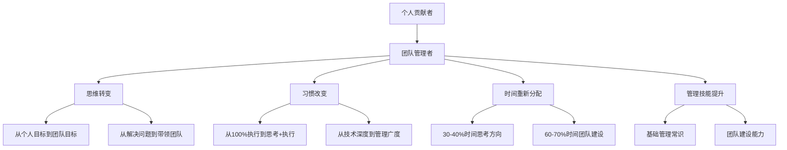
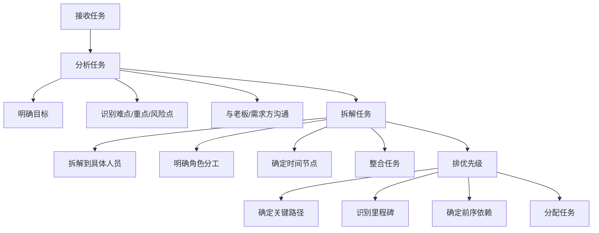
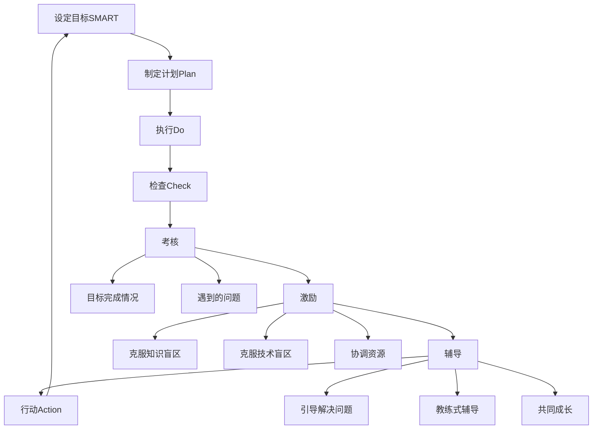
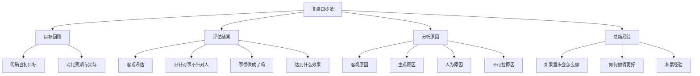
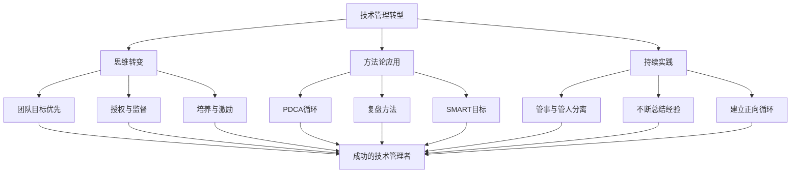

# 从技术走向管理如何克服转型阵痛

> 来源：未核验 · 类型：分享 · 状态：draft

> 分享嘉宾：陈莹  
> 分享主题：技术管理转型实践与方法论  
> 目标受众：SRE、运维及稳定性保障工程师

## 一、前言

本次分享基于讲师从2013年开始接触管理，历时4年才真正走出管理误区的实践经验。希望帮助正在走向技术管理或已经走上技术管理岗位的同学，缩短转型阵痛期。

### 1.1 两个重要前提

在讨论技术管理之前，必须明确两个前提：

**前提一：管理是一门科学**
- 如果认为管理是艺术，则更多体现在感觉层面和实践层面，面对不同情况会有不同操作
- 如果认为管理是科学，则意味着它是系统的、全面的、有逻辑性的过程
- **本次分享将管理定义为一门科学**

**前提二：聚焦一线技术管理者**
- 不同层级的管理者关注点不同
- 本次分享主要针对正在成为或刚成为一线管理者的技术人员
- 一线管理者是管理生涯的起点，是最关键的转型期

## 二、技术管理者常见的五大困境

### 2.1 困境一：事必躬亲，亲力亲为

**典型表现：**
- 关键任务觉得自己亲自动手才安心
- 认为自己做得又好又快
- 团队成员变成"围观者"

**负面影响：**
- 严重打击团队成员的信心和学习欲望
- 被不断打断，失去大块时间处理重要事务
- 无法专注于真正需要处理的管理工作

### 2.2 困境二：老板不再满意

**问题根源：**
- 从技术能手升为管理者，原本处理问题能力强
- 升职后老板不断挑刺，认为做得不够好

**深层原因：**
- 所有事情都亲力亲为，但个人精力有限
- 一天只有24小时，一个人无法完成多人的工作
- 老板不满意的是任务结果，而非对个人的否定

### 2.3 困境三：管理书籍无用论

**实践困惑：**
- 阅读大量管理书籍（5-6本甚至更多）
- 学习HR招聘等各类知识
- 发现书本知识难以应用，甚至起反作用

**问题分析：**
- 不同的人面对不同问题有不同处理方式
- 生搬硬套导致结果不理想
- 缺乏结合实际情况的灵活应用

### 2.4 困境四：与下属过不去

**矛盾表现：**
- 下属不断质疑管理者能力
- 技术栈不同导致专业领域差异（如Java vs C++/Python）
- 管理者挑刺时，下属心理抵触

**本质问题：**
- 下属并非故意对抗，而是有更好的方法
- 管理者没有倾听下属的建议
- 沟通方式和心态需要调整

### 2.5 困境五：招人难，淘汰人更难

**招聘挑战：**
- 从未招过人，不知如何组建团队
- 面试众多候选人，难以找到匹配的人才
- 需要考虑个人、团队、公司三方面的匹配度

**淘汰困境：**
- 淘汰人比招人更难
- 团队缩减时（如从10人减到7-8人），手心手背都是肉
- 需要帮助被淘汰者找到更适合的岗位

## 三、转型困境的根本原因

### 3.1 角色转变：从单兵作战到团队协作

**关键变化：**

1. **思维转变**
   - 从单打独斗到团队协作
   - 从个人可控到团队协同
   - 从个人利益到团队目标优先

2. **习惯改变**
   - 时间不再100%用于解决具体问题
   - 需要考虑团队半年、一年的目标
   - 需要规划人员培养和AB岗建设

3. **时间重新分配**
   - 30-40%时间思考方向性问题
   - 考虑战术层面和团队建设层面
   - 减少具体问题处理的时间占比

4. **管理技能提升**
   - 学习基本管理常识
   - 掌握基础管理技能
   - 推动团队持续向前发展

## 四、管理的两面性理论

### 4.1 第一面：管事（科学管理）

**核心原则：管理即为管事，不要一开始就把人的因素介入**

#### 4.1.1 为什么要分离人和事？

- 人在不同时期有不同表现（如情绪波动）
- 人的状态不可控（如与女友吵架影响工作）
- 先关注事，让管理有迹可循

#### 4.1.2 团队目标优先

**成就感变化：**
- **下降因素**：个人技术难题攻克的成就感减少
  - 原来半小时解决别人3-10天的问题，成就感爆棚
  - 现在只有团队成功才算成功
  - 时间、空间、努力的直接反馈减少

- **失重感上升**：
  - 对目标的掌控力度下降
  - 原来个人有90-95%的把握
  - 现在依赖团队每个人的努力
  - 团队成员的状态不可控（生病、离职、状态不佳）

**应对策略：**
- 将成就感切换到带领团队完成目标
- 将大目标分解为小任务，获得阶段性成就感
- 培养团队成功即个人成功的心态

#### 4.1.3 任务分配的三个步骤

**步骤一：分析任务**
- 一线管理者接收的任务往往比较虚
- 需要与老板、需求方沟通明确目标
- 分析任务的难点、重点、风险点
- 确定要达成的里程碑

**步骤二：拆解与整合**
- 将目标拆解到每个人身上
- 明确每个人的角色和介入时间点
- 拆解后重新整合，形成整体概念
- 确保任务分配合理且可执行

**步骤三：排优先级**
- 确定哪一步最重要
- 识别阶段性成果和里程碑
- 明确任务依赖关系和前序动作
- 合理分配给团队成员

### 4.2 第二面：管人（艺术管理）

虽然管人更偏艺术性，但从管理角度仍有方法可循。

#### 4.2.1 新人成长

**关键问题：**
- 新老搭配如何安排？
- 老带新还是从简单任务做起？
- 如何设计新人学习路径？
- 如何监督新人能力达标？

**管理要点：**
- 设计清晰的成长路径
- 设定能力达标的检查点
- 逐步分配更有挑战的任务
- 持续跟踪和反馈

#### 4.2.2 人员梯队建设

**为什么需要梯队？**
- 应对长假、婚假等长期休假
- 应对突发紧急任务
- 避免单点依赖风险

**梯队建设策略：**
- 建立AB岗，甚至C岗
- 确保关键岗位有备份
- 避免任务集中在少数人身上
- 促进团队整体成长

#### 4.2.3 授权与监督

**授权的艺术：**
- 直线管理5-6人是极限
- 团队扩大（10人、15人、20人以上）必须授权
- 授权是信任，但不是放任

**监督的方法：**
- 设置中间节点检查
- 要求定期反馈（Request-Response机制）
- 把控整体进度，不盯每个细节
- 避免"捡了芝麻丢了西瓜"

## 五、不同视角看技术管理者

### 5.1 业务方视角

**期望：**
- 将技术管理者视为技术专家
- 期待用技术手段解决业务问题
- 关注技术能力，不关心管理能力

**特点：**
- 认为你就是技术人员，不是管理者
- 期望你的技术特别强
- 不care你的管理能力

### 5.2 团队成员视角

**关注点：**
- 不仅看技术能力，更看管理能力
- 如何设定目标
- 如何激励团队
- 如何合理分配任务
- 如何处理团队冲突

**期望：**
- 体现管理能力
- 展现技术前瞻性
- 处理人际关系
- 营造良好氛围

**现实挑战：**
- 有人的地方就有江湖
- 团队成员价值观、世界观、人生观不同
- 必然存在冲突和矛盾
- 需要管理者协调和平衡

## 六、核心方法论

### 6.1 PDCA+目标管理循环

#### 6.1.1 六步循环法

**1. 设定目标（SMART原则）**
- Specific：具体的
- Measurable：可度量的
- Achievable：可达成的
- Relevant：相关的
- Time-bound：有时限的

**2. 制定计划（Plan）**
- 拆解目标
- 分析优先级
- 分配资源

**3. 执行（Do）**
- 按计划推进
- 持续跟踪

**4. 检查（Check）**
- 定期review
- 发现问题

**5. 考核**
- 评估目标完成情况
- 识别遇到的问题
- 分析原因（知识盲区、技术盲区、协作问题）

**6. 激励**
- 鼓励团队
- 提供支持
- 协调资源

**7. 辅导**
- 以教练方式引导
- 帮助找到解决方案
- 共同成长

**8. 行动（Action）**
- 检查辅导效果
- 检查激励效果
- 调整目标
- 整体反馈

**适用范围：**
- 不仅针对事，也适用于人
- 可用于项目管理
- 可用于人员培养

### 6.2 复盘方法论

复盘是管理工作中最最最有用的方法论，源自围棋复盘。

#### 6.2.1 复盘四步法

**第一步：目标回顾**
- 为什么必须设定目标？没有目标无法回顾
- 回顾当初设定的目标是什么
- 对比预期与实际结果

**第二步：评估结果**
- 客观评估，只针对事不针对人
- 这件事做成了没有？
- 为什么没做成？
- 达到了什么效果？

**第三步：分析原因**
- 客观原因还是主观原因？
- 人为原因还是不可控原因？
- 深入分析根本原因

**第四步：总结经验**
- 核心问题：如果这件事情再来一遍，会不会做得更好？
- 能不能做得更进一步？
- 积累经验用于下次

#### 6.2.2 复盘应用场景

**建议使用场景：**
- 困难项目结束后的整体复盘
- 每月对阶段性目标的复盘
- 个人事务的复盘
- 团队管理的复盘

**复盘的价值：**
- 不断积累管理经验
- 改进做事方式
- 培养团队能力
- 培养新人

## 七、推荐书籍

### 7.1 《卓有成效的管理者》

**推荐理由：**
- 对转型影响最深的书籍之一
- 颠覆"管理就是管人"的认知

**核心观点：**
- 管理者首先要管理好自己
- 只有合理安排好自己，才能合理安排好别人
- 才能让整个团队形成正向循环
- **如果连自己都管理不好，何以管人？**

### 7.2 《影响力》

**推荐理由：**
- 解决管理两面性中"人"的问题
- 人的行为有迹可循

**核心价值：**
- 加强对人的认知
- 理解人如何影响事情
- 提升判断力

**关键洞察：**
- 人生来是"复读机"，倾向于重复过去的决策
- 减少能耗，不断重复原来的做法
- 对管理者不利：不能用老方法套新情况
- 相似的事情用相同方法不一定成功
- 必须深入思考和分析

## 八、实战Q&A

### 8.1 技术不是最强怎么办？

**问题：** 总觉得管理时自己的技术得是最好的，不是就没底气管理怎么破？

**解答：**
- 必须摒弃这种想法
- 团队成员一定会在某方面超过你
- 技术不是你在团队生存的根本
- **你的价值是把技术串联起来，达成公司目标**
- 技术更新迭代快，无法在所有领域都最强
- 把精力放在团队管理上，而非纯技术学习

### 8.2 如何建立威信和沟通？

**问题：** 从技术转向管理，如何快速建立威信和与下级沟通？

**建立威信：**
- 威信来自于任务完成和目标达成
- 带领团队一次次成功
- 不能用"以威压人"的方式（尤其对90后）
- 90后有强烈自主意识，需要引导而非压制

**下级沟通：**
- **做错事的沟通**：以教练方式引导，让他自己找到解决方案
- **生活困难的沟通**：以朋友或过来人方式交流
- 不同场景用不同沟通方式

### 8.3 有能力但不听话的员工怎么办？

**问题：** 管理过程中遇到很有能力但不听话的员工怎么办？

**分析与应对：**

**情况一：影响团队氛围**
- 团队目标优先
- 先沟通了解原因和抵触点
- 给时间改正
- 实在改不了只能淘汰

**情况二：挑战你的专业**
- 放低姿态承认对方是专家
- "这块我确实不如你，你是专家"
- 让他主导，你辅助
- 形成良性循环

### 8.4 管理者绩效如何考核？

**问题：** 管理者的绩效如何考核？做管理的成就感没有技术的成就感高。

**成就感转换：**
- 技术成就感确实更直接
- 想成为管理者必须降低技术成就感
- 从带领团队完成任务中获得成就感

**绩效考核指标：**
- 团队目标达成情况
- 人员稳定性
- 核心人员稳定性
- 不是解决了多少技术问题

**比例变化：**
- 随着职级上升，管理占比增加
- 中层管理：60%工作在人的方面
  - 团队氛围
  - 团队能力
  - 攻坚能力

### 8.5 如何管理混合团队？

**问题：** 团队中有正编、人力外包、厂商等合并的团队，如何有效管理？

**管理策略：**

**外包人员：**
- 设定明确目标
- 由资深正式员工分配和管理任务
- 每月或每季度考核
- 不合格要求换人
- 提供有效培训

**厂商：**
- 纯粹以目标为导向
- 当作外包人员考核
- 一切以目标为准

**区别对待：**
- 正式员工：更多考虑"人"的因素
- 外包/厂商：更多考虑"事"的因素

### 8.6 不同层级管理者的关注点？

**问题：** 不同层级的管理者关注的重点有什么差别？

**一线管理者：**
- 接收相对具体的任务
- 参与任务执行过程
- 关注具体执行细节

**二线管理者（中基层）：**
- 接收模糊的任务
- 需要分析和明确目标
- 拆解后分配给一线管理者或执行者
- 关注团队氛围
- 关注AB岗建设
- 应对人员变动
- 提升团队整体能力
- 设定团队自身目标

**高层管理者：**
- 更多考虑战略层面
- 为公司达成战略目标

### 8.7 高度扩张时如何保持领导力？

**问题：** 在团队和业务高度扩张过程，怎么保持领导力高度集中，预防人心涣散？

**核心策略：保住核心**
- 人员变动快，难以保证高度紧张
- **保住核心人员的稳定性**
- 核心就像固体，其他人像液体包围
- 核心稳，外围就稳
- 不断扩大核心

**现实情况：**
- 很少遇到极速扩张（如2-3人一个月变10人，半年变50人）
- 稳定核心是关键

### 8.8 能力强但沟通差的员工该劝退吗？

**问题：** 团队里有人能力很突出，但沟通能力有问题，导致团队其他成员工作状态或成果出问题该劝退吗？

**分析：**
- 能力突出仅代表个人解决问题能力强
- 如果阻碍团队目标达成、氛围下降，需要处理

**解决方案：**

**方案一：改变和融入**
- 先沟通，看是否愿意改变
- 放在舒适区，帮助融入团队

**方案二：转岗**
- 实在融不了，帮他在其他团队找合适位置
- 公司招人有成本，不要轻易放弃

**方案三：补足短板**
- 你作为沟通桥梁
- 让他专注攻坚型工作
- 配一个沟通能力强的人协作
- 团队成员互补，而非完美个体

**原则：**
- 不轻易劝退
- 通过沟通和引导解决问题
- 只要不严重影响团队氛围，尽量留用

### 8.9 技术培训怎么做？

**问题：** 技术培训怎么做比较好？

**方法一：共同学习课程**
- 选择优质课程（如极客时间）
- 每周固定时间学习1-1.5小时
- 前1小时：集体学习内容
- 后0.5小时：讨论如何应用到实际问题

**方法二：复盘式培训**
- 很多任务只有2-3人参与
- 其他人不清楚过程和收获
- 通过整体复盘让全员学习
- 分享经验和教训

**方法三：技术分享**
- 每人分享自己擅长的领域
- 共同学习和成长
- 提升团队整体技术能力

## 九、总结

### 9.1 核心要点

1. **分离事和人**
   - 管理者要把管理的"事"和管理的"人"进行分离
   - 在某一时间段内集中处理一件事情

2. **善用复盘**
   - 复盘不仅对做事有用，对管理也非常有用
   - 可以针对管理层面单独复盘
   - 发现管理上的不足
   - 扩充管理知识，加强管理能力

3. **持续学习**
   - 阅读管理书籍
   - 结合实际灵活应用
   - 不断总结经验

4. **心态转变**
   - 从技术成就感到管理成就感
   - 从个人目标到团队目标
   - 从单兵作战到团队协作

### 9.2 转型关键

### 9.3 最后寄语

- 技术管理转型是一个痛苦但必经的过程
- 需要4年甚至更长时间才能真正走出误区
- 通过系统的方法论可以缩短阵痛期
- 关键是思维转变和持续实践
- 从个人英雄到团队领袖的蜕变
- 最终实现个人和团队的共同成长

---

**分享结束**

> 本文档整理自技术分享音频记录，内容已根据上下文进行优化和结构化处理。

