# 如何从工程理论探索到最佳实践

> 来源：未核验 · 类型：分享 · 状态：draft


## 分享概述

本次分享基于B站在SLO（Service Level Objective）工程方面的探索与实践，讲述了如何通过SRE工程理论，实现服务可靠性的度量、报警治理和运营体系建设。

**议题要点：**
- 可用性指标的观测对象、观测方案和落地实践
- Google SRE中最核心的SLO工程方法论及SLO实施经验
- 以SLO工程为核心探讨服务的可用性度量、质量运营与报警治理

## 讲师介绍

吴老师，B站技术架构部负责人，主要负责SRE相关工作。先后负责过B站中间件运维体系、在线业务保障体系和SRE稳定性工程。文章《2021年7月13日我们是这样崩的》的作者，带领B站SRE从运维向SRE转型，落地了包括SLO工程、容量管理、高可用、多活容灾等可靠性工程。

## 一、可靠性指标的困局

### 1.1 可靠性对象不明确

可靠性的对象可能是：
- 生产运行的服务或应用
- 应用下的某个接口
- 某个业务模块（如登录、注册）
- 某个团队或部门

### 1.2 不可用定义困难

需要解决的核心问题：
- 什么是不可用？
- 一个请求失败算不可用？
- 一分钟内错误率超过多少算不可用？
- 什么样的请求算失败？

### 1.3 传统度量方式的局限

**基于故障的度量：**
- 通常度量MTTR等指标
- 故障召回率很低
- 只有严重事故才会产生故障报告
- 短时间抖动不会走复盘流程

**运营场景需求：**
- 能否基于可用性做报警？
- 故障的可用性损失数据能否自动产出？
- 能否产出年度/月度/季度的可用性报表？

### 1.4 报警系统的问题

**现状挑战：**
- 指标和报警非常多，不知道该看什么
- 每次事故都加报警，最后都是噪音
- 报警分类不清（工单、巡检、告警混在一起）
- 报警分级混乱（基础设施、IaaS、PaaS、应用、业务、终端）
- 通知泛滥，每天数万条
- 内卷严重，看谁通知得快、频次高

## 二、SLO方法论与指标选择

### 2.1 核心概念

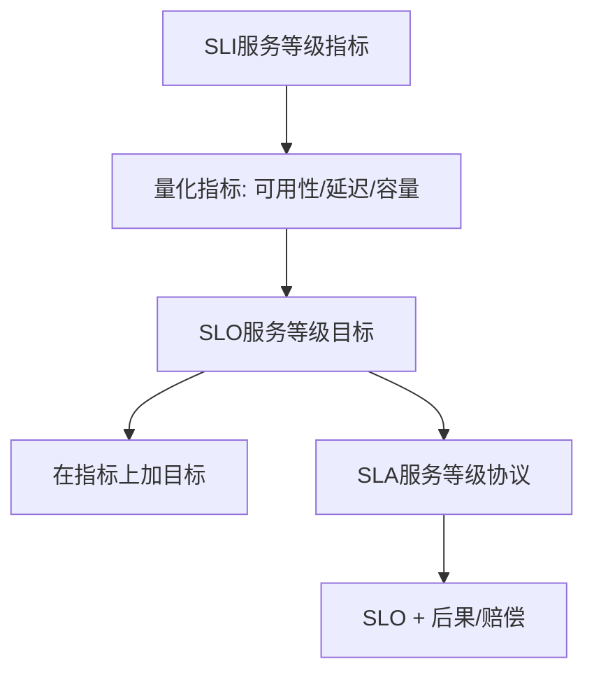

**定义：**
- **SLI（Service Level Indicator）**：服务等级指标，量化指标（可用性、延迟、容量）
- **SLO（Service Level Objective）**：服务等级目标，在SLI上加目标
- **SLA（Service Level Agreement）**：服务等级协议，SLO加上后果（主要用于商务场景）

**SLO的价值：**
- 指定服务可靠性的目标水平
- 做出数据决策的关键指标
- SRE实践的核心

### 2.2 常见的SLO模型（VALET）

- **V**olume：容量
- **A**vailability：可用性
- **L**atency：延迟
- **E**rror：错误
- **T**icket：工单

### 2.3 SLO实施的理想流程

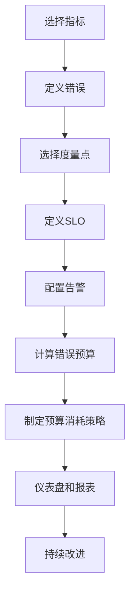

**1. 选择指标**
- 请求驱动型：可用性（成功请求/总请求）、延迟、质量

**2. 定义错误**
- HTTP状态码：500、502、503、504
- 业务错误码的标准化

**3. 选择度量点**
- 应用服务器
- 负载均衡（SRE推荐）
- 客户端

**4. 定义SLO**
- 全年可用性大于XX
- 每季度大于XX

**5. 配置告警**
- 基于SLO配置告警策略

**6. 错误预算**
- 基于SLO和时间窗口计算允许的不可用时间
- 例：四个九一年允许52分钟不可用

**7. 错误预算策略**
- 预算消耗殆尽时冻结变更
- 仅允许紧急bug修复或稳定性优化

### 2.4 第一次实践的失败与反思

**2019年的尝试目标：**
- 做出非常准确的度量数据
- 体现线上服务真正的可用性指标
- 及时发现现有问题

**失败的原因：**

1. **分级模型过于复杂**
   - 业务分级（播放、评论、弹幕）
   - 应用分级
   - 接口分级
   - 三层模型维护成本极高

2. **元数据关联困难**
   - 接口元信息经常变更
   - 元信息更新不及时
   - 最终数据准确率很低

3. **负载均衡指标无法覆盖所有故障场景**
   - HTTP Code 200但业务Code异常
   - 内网服务没有负载均衡

4. **数据只用于做报表**
   - 只在年度/半年度总结时使用
   - 研发日常不关注这个数据

**核心反思：**
- SLO不是非有不可（故障管理也能做可靠性决策）
- SLO的价值不是做报表，而是及时报警发现影响SLI指标的异常
- 错误预算策略过于理想（无法冻结生产变更）
- 应该度量具体对象，而非数据聚合

## 三、B站SLO体系重构

### 3.1 新的生命周期体系


**核心思路转变：**
1. **指标度量与治理**：提升指标准确率，让SRE和研发具备一致的观测能力
2. **精确告警**：与传统告警区分，提供精确、高效、透明的分发渠道
3. **错误预算分析**：不做强管控，结合报警分析工程因素，做稳定性治理
4. **报表仪表盘**：综合展示可用性、错误预算消耗、排名等
5. **SLO生态**：扩展到CI/CD、压测、多活管控等平台，支持变更预检、发布观测、智能阻断

### 3.2 可用性度量方案对比

#### 方式一：请求成功率

**计算方式：**
```
可用率 = (总请求数 - 错误请求数) / 总请求数
```

**优点：**
- 数据真实，指标下跌一定代表服务不可用
- 用户功能异常一定会体现在成功率上
- 报警能力丰富，支持多窗口多消耗率告警

**缺点：**
- 请求量易受用户量影响
- 重试会放大请求量，导致数据抖动严重

#### 方式二：可用时间

**计算方式：**
```
可用率 = (总时间 - 不可用时间) / 总时间
不可用时间定义：每分钟错误率 > 阈值（如20%）
```

**优点：**
- 时间维度易于理解
- 更符合传统基于故障的度量方式

**缺点：**
- 低于错误率阈值不代表用户没影响（10%错误率也可能有问题）
- 故障召回率低
- 精确度低
- 报警能力单一

**B站的选择：基于请求成功率**

原因：
- 报警精确度更高
- 问题发现率更高
- 对业务价值更大

### 3.3 错误标准化

#### 网络链路中的错误类型

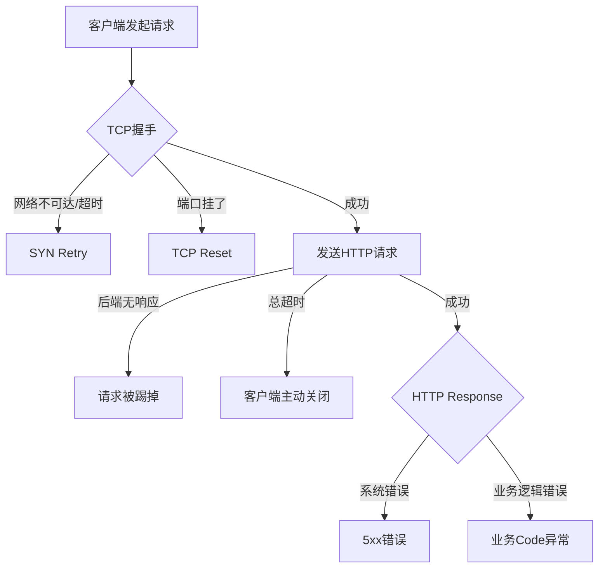

#### 错误Code标准化定义

**1. 负载均衡层（SLB）**
- 500：服务内部错误
- 502：网关错误（服务宕机）
- 504：网关超时
- 503：限流/熔断

**2. 服务层（Server）- 业务扩展码**

类似HTTP 5xx，定义负5xx：
- **-500**：服务内部错误（强依赖错误、中间件资源请求错误）
- **-504**：调用下游服务超时
- **-509**：服务主动限流

**3. 微服务调用层（Client）**
- 用于度量上下游调用的可用性
- 覆盖未接入标准Metrics体系的服务

### 3.4 多维度度量方案

#### 度量架构

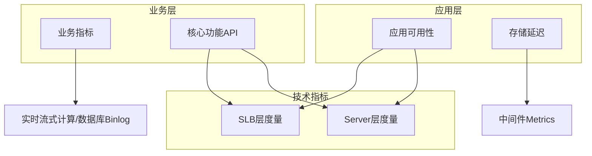

#### 度量对象和指标

**1. 业务维度**
- **度量方式**：大数据流式计算（Flink）+ 数据库Binlog订阅
- **指标类型**：
  - 在线人数、播放量
  - 评论量、弹幕量、登录量
  - 营收数据（直播消费、电商订单、支付）

**2. 核心功能维度（面向用户的公网API）**
- **度量方式**：通过服务端技术指标
- **典型场景**：发弹幕、发评论、登录等
- **指标类型**：可用性、成功率

**3. 应用维度（兜底策略）**
- **度量位置**：
  - SLB层：面向外网的入口
  - Server层：Prometheus埋点
- **指标类型**：
  - 可用性、错误率、QPS
  - 延迟（TP50、TP99）
  - 存储组件延迟

#### 双视角度量

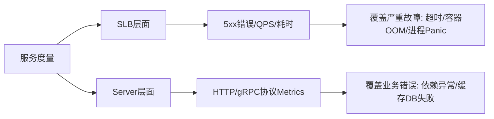

### 3.5 延迟指标度量

**重要性：**
- 同城双活场景下，数据同步延迟影响用户体验

**度量场景：**

1. **消息队列延迟**
   - 影响：缓存更新延迟
   - 场景：基于消息队列的缓存刷新机制

2. **数据库主从同步延迟**
   - 影响：多活场景下读延迟数据
   - 场景：写主机房，读本地机房

3. **Canal管道延迟**
   - 影响：下游数据库更新延迟
   - 场景：解析数据库Binlog推送到消息队列

**度量位置：**
- 在中间件维度度量（应用维度难以度量）

### 3.6 业务指标的必要性

**技术指标无法发现的问题：**
- 用户频繁掉登录（APP端误删登录态）
- 用户充值失败（业务逻辑Bug）

**业务指标度量方式：**

1. **流式实时计算**
   - 端上数据上报 → IDC → Flink实时计算 → ClickHouse → 监控系统
   - 度量K PI指标：登录量、评论量、动态量等

2. **数据库Binlog订阅**
   - 用于营收场景（数据更准确）
   - 度量：直播营收、电商订单、支付

**实践发现：**
> 技术指标召回的问题远远大于业务指标召回的问题。业务指标异常代表生产已发生明显故障，而技术指标能在故障影响用户前发现问题（服务维度的故障不一定最终影响用户，可能被熔断或降级）。

## 四、SLO告警实践

### 4.1 告警核心理念

**SLO是果，其他告警是因**

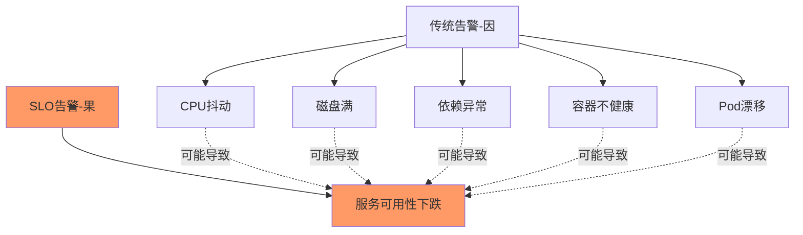

**理念转变：**
- 传统：每个可能影响服务的"因"都加告警 → 告警泛滥
- 新模式：用SLO告警兜底"果"，减少"因"的告警

**降噪案例：**
- 限流告警：服务限流时SLO会触发，可下线限流告警
- 调用错误告警：不区分系统错误和业务错误，每天数万条，改为SLO告警覆盖

### 4.2 错误预算与消耗率

#### 错误预算（Error Budget）

**定义：**
在某个SLO目标和时间窗口内，允许的错误请求数或不可用时间。

**示例：**
- SLO：三个九（99.9%）
- 基准错误率：0.1%（每时每刻允许0.1%的错误请求）
- 月度错误预算：43分钟完全不可用时间

**价值：**
- 风险识别：变更/维护会消耗多少错误预算
- 故障定级：消耗50%预算 vs 消耗10%预算
- 稳定性决策：是否允许变更

#### 消耗率（Burn Rate）

**定义：**
相对于SLO服务消耗错误预算的速度。

**公式：**
```
消耗率 = 服务实际错误率 / SLO基准错误率
```

**示例：**
- SLO：三个九（99.9%），基准错误率0.1%
- 实际错误率0.1% → 消耗率 = 1
- 实际错误率1% → 消耗率 = 10
- 实际错误率3.6% → 消耗率 = 36
- 实际错误率100% → 消耗率 = 1000

**意义：**
消耗率代表服务故障的严重程度。

### 4.3 六种告警策略演进

#### 策略1：目标错误率告警

```
触发条件：错误率 > SLO阈值（如0.1%）
检测周期：1分钟
```

**缺点：**
- 错误率刚好等于阈值时，一天触发1440次
- 服务可用率满足要求，但告警不断

#### 策略2：时间窗口告警

```
触发条件：消耗了30天窗口的5%错误预算（36小时）
```

**缺点：**
- 触发后，在36小时滑动窗口内会持续告警
- 告警延迟高（需要36小时才能触发）

#### 策略3：持续时间告警

```
触发条件：SLO低于阈值持续10分钟/1小时
```

**缺点：**
- 告警灵敏度与服务错误率无关
- 100%不可用和0.2%不可用，都是10分钟后告警

#### 策略4：消耗率告警

```
基于服务错误率与基准错误率的比值
```

**优点：**
- 告警灵敏度与故障严重程度相关

#### 策略5：多窗口多消耗率告警（SRE推荐）⭐

```
紧急告警1：1小时消耗当月2%错误预算
紧急告警2：6小时消耗当月5%错误预算  
兜底告警：3天消耗当月10%错误预算（发故障工单）
```

**特点：**
- 严重故障立即触发紧急告警和应急协同
- 轻微故障持续较长时间后发工单，人工处理

#### 策略6：多窗口多消耗率 + 短窗口验证

```
条件1：长窗口（1小时）错误预算消耗完
条件2：短窗口（5分钟）错误率仍然超标
```

**优点：**
- 告警立即触发
- 服务恢复后告警立即恢复
- 避免误报和持续告警

**B站实践：采用策略5**
- 策略6过于复杂，策略5已满足需求

### 4.4 B站的告警策略

**概念转换：**
不直接使用"错误预算"和"消耗率"（概念太绕），改用：
- **时间窗口**
- **可用率**
- **错误量**

**按服务等级分梯度设置：**

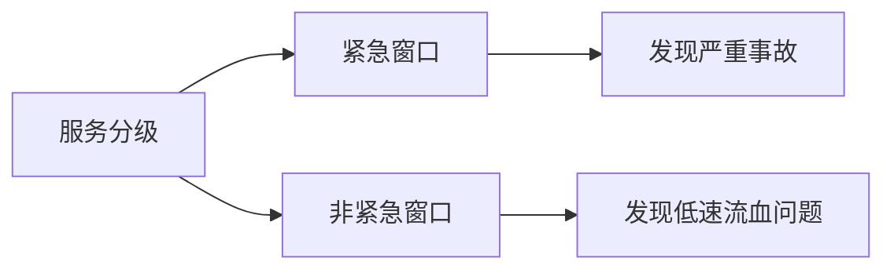

**告警规则示例：**

1. **紧急窗口**
```
条件1：10分钟平均可用率 < 阈值
AND
条件2：最近1分钟错误量 > 阈值
```

2. **非紧急窗口**
```
条件：一天可用率低于SLO
```

### 4.5 告警分发与协同

#### 传统方式的问题

- 人员泛滥：一条告警发给10-20人，无人负责
- 接警率低：通道混杂，每天数千条告警，被设置勿扰
- 协同困难：卡片式告警无法协同

#### 新的分发机制

**基于事件中心的智能分发：**

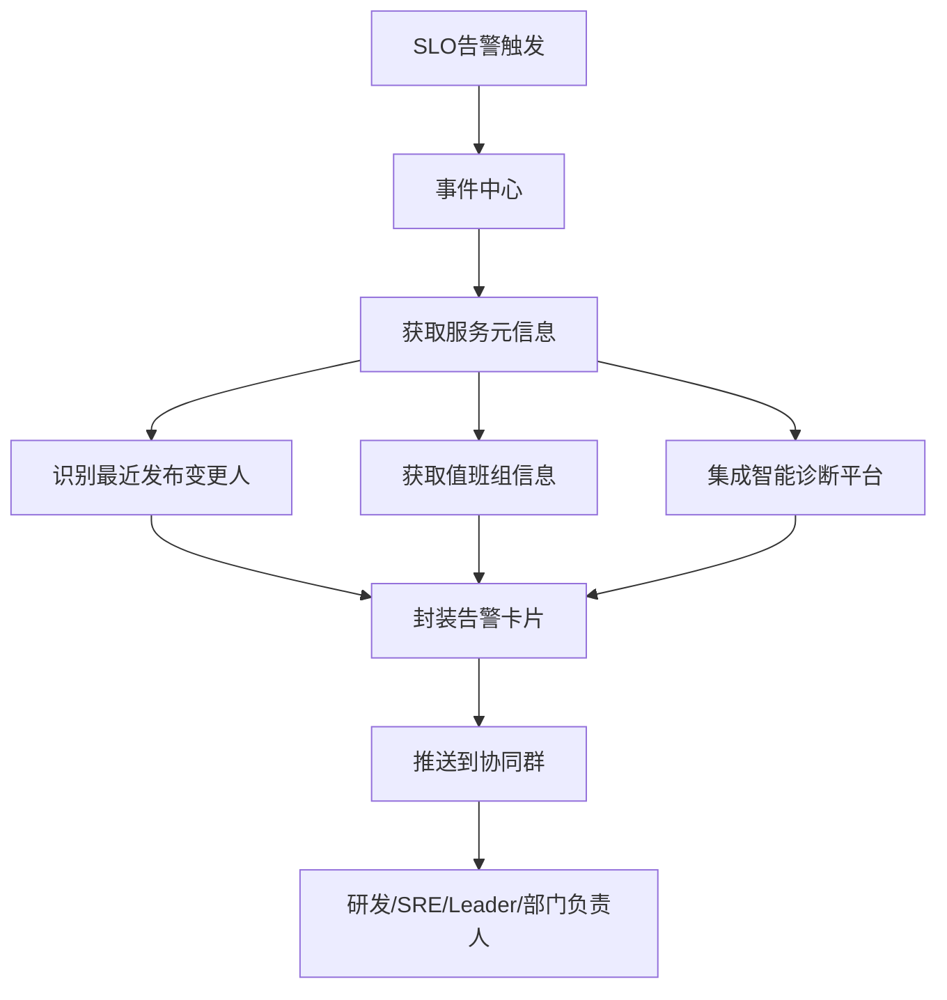

**协同群特点：**
- 每个团队一个专属协同群
- 群内有SRE、研发、Leader、部门负责人
- 添加通知机器人，订阅SLO告警

**告警卡片能力：**
- 接手响应
- 查看详情
- 进展同步
- 有效性打标
- 解决方案记录

**公开透明的协同：**
- 所有操作在群里同步通知
- 谁接手、处理进展、最终方案，全员可见

**前提条件：**
⚠️ 千万不要用低质量告警（CPU、内存、磁盘等）走这套机制，否则会刷屏！

### 4.6 故障定界与智能诊断

#### 一五十目标

**一分钟：** 告警触发
**五分钟：** 故障定界

#### 故障处理流程

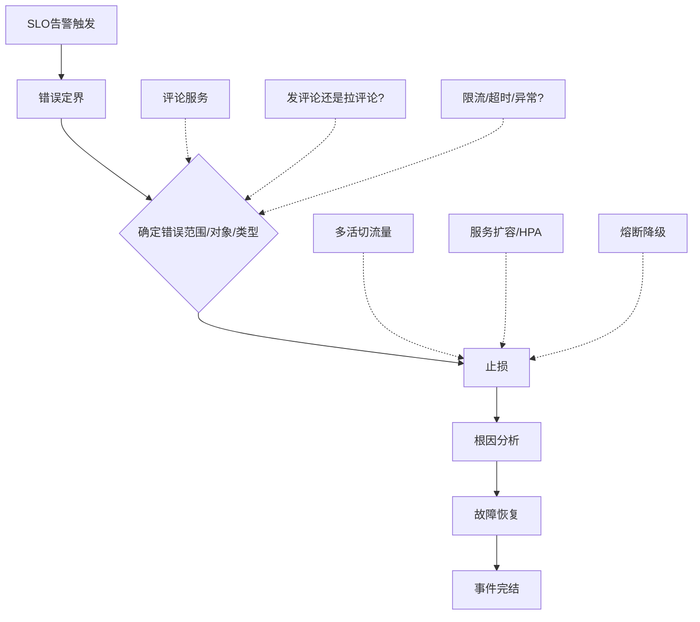

#### 错误定界的重要性

**核心思想：**
- 先快速止损，再根因分析
- 不需要立即定位根因，只需要知道故障点

**止损示例：**
- 发现服务资源使用率高 → 立即扩容
- 发现单节点异常 → 立即摘流
- 发现数据库异常 → 立即切换/多活流量调度

#### SLO诊断平台

**结合可观测能力：**
- 服务对下游依赖
- 对中间件依赖
- 对组件依赖
- 资源饱和度
- 进程内指标（GC、线程）
- 变更历史
- Trace平台

**边界清晰的AIOps：**
- 垂直做服务故障诊断
- 基于业务指标、应用指标、中间件指标、容量指标
- 只做故障定界，不强求根因定位

**B站的AIOps理解：**
> 传统AIOps难落地的原因是边界不清晰。不同级别的故障（基础设施、IaaS、PaaS、应用、业务）需要的数据模型不同。B站只垂直做服务故障，边界清晰，更容易落地。

#### 诊断链路

1. 告警推送到协同群，@最近变更的研发
2. 研发点击SLO诊断链接
3. 查看接口和服务的错误类型（1分钟）
4. 查看依赖资源、下游服务、中间件（快速定界）
5. 执行止损操作
6. 服务恢复
7. 事件完结，打标反馈

### 4.7 告警降噪思路

**研发只需关注三类应用告警：**

1. **SLO告警**
   - 服务可用性下跌

2. **依赖错误告警**
   - 下游服务依赖异常
   - 中间件异常（缓存、MQ、数据库）

3. **饱和度告警**
   - CPU使用率过高
   - 通过HPA策略解决（核心服务覆盖HPA，CPU超50-60%自动扩容）

**下层告警对研发透明：**
- 中间件告警不直接发给研发
- 通过应用侧埋点指标发现中间件问题
- 示例：缓存主从切换，如果不影响服务SLO，研发不需要关心

**按需订阅：**
- 服务未达到最佳实践前，可按需订阅中间件告警

## 五、SLO运营体系

### 5.1 运营大盘

#### 综合概览页

**三种指标展示：**
- 业务指标
- 应用指标
- 核心功能（接口维度）

**内容包含：**
- 实时指标情况
- 服务健康度卡片
- 历史报表（周/月/季度/年）
- 错误预算消耗/剩余
- 可用性排行榜

### 5.2 告警运营分析

**分析维度：**

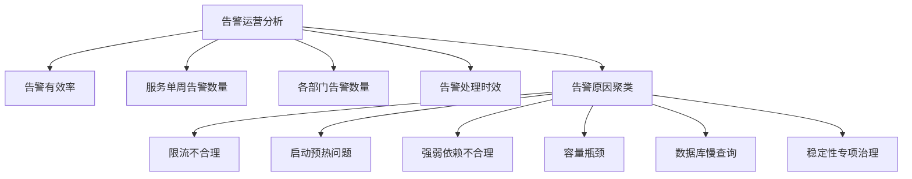

**运营指标：**
- 告警有效率
- 各团队处理效率
- 触发次数
- 协同处理率
- 原因分析和聚类

### 5.3 上线效果

**告警数据：**
- 每天触发告警的服务：约20个
- 其中日常抖动（优化中）：约10个
- 真实异常服务：约10-15个
- 平摊到各团队：平均不到1个/团队/天
- 告警触发次数：约30次/天
- 告警协同处理率：接近100%
- 告警有效率：接近100%

**发现的服务异常原因：**
1. 服务限流不合理，频繁触发限流
2. 服务启动预热导致接口不可用
3. 强弱依赖不合理
4. 容量瓶颈，资源饱和
5. 数据库慢查询

**误报场景分析：**
- SLO告警触发代表服务确实不可用
- 部分研发认为"误报"的原因：上游服务可以容忍该服务错误
- 处理方式：调整告警条件，降低敏感度

### 5.4 SLO生态建设

#### 与变更检测结合

**集成的平台：**

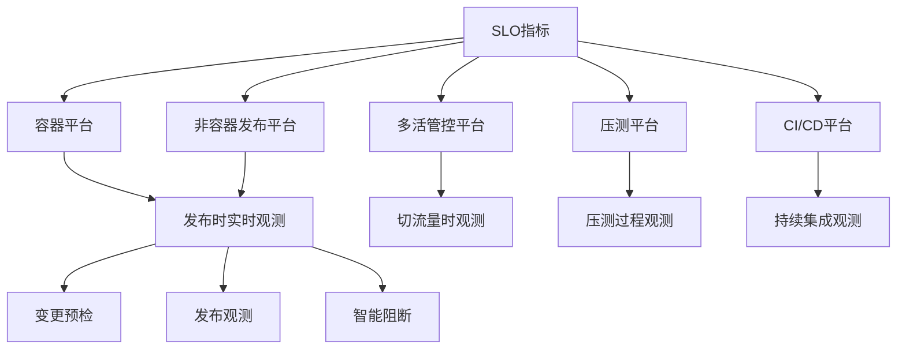

**实时SLO指标扩展：**
- 可用率
- 错误量
- QPS
- 延迟

**三大能力：**

1. **变更预检**
   - 变更前检测服务健康状况
   - 查看服务整体健康情况

2. **发布观测**
   - 发布过程实时观测SLO指标
   - 研发可实时看到可用率和错误量

3. **智能阻断**
   - 发布过程发现可用性下跌
   - 自动阻断本次变更

## 六、关键问题解答

### 6.1 如何说服研发团队配合SLO建设？

**前提条件：**
1. 要有指标（负载均衡、Prometheus Exporter、日志）
2. 指标能报出错误（标准化的错误码）

**研发配合点：**
- 主要在指标治理阶段
- 微服务框架需支持标准化的错误上报

**价值体现：**
- 帮助研发第一时间发现线上问题
- 告警精确，@到准确的人
- 提供SLO诊断链接，快速定位问题
- 研发会主动配合使用这套系统

### 6.2 如何解决抖动告警？

**两种处理方式：**

1. **严格要求**
   - 服务确实不可用，必须处理
   - 保持告警策略不变

2. **调整策略**
   - 服务可用性已知较差，可以容忍
   - 放大计算窗口（5分钟 → 10分钟）
   - 降低阈值（三个九 → 两个九）
   - 或临时静默，优化后再打开

### 6.3 如何知道具体是哪个错误造成的？

**通过故障定界：**
- SLO告警只是结果
- 必须结合SLO诊断平台
- 结合可观测能力查看：
  - 哪些指标产生波动
  - 服务的黄金指标（流量、错误、饱和度、依赖、变更）
  - 快速定位故障点

**SLO vs 可观测：**
- **SLO**：面向结果（服务可用性下跌）
- **可观测**：面向原因（哪些指标影响可用性）

### 6.4 测试流量/压测流量的处理？

**解决方案：染色和打标**

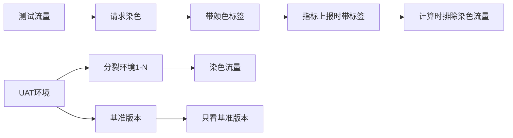

**实践场景：**
- UAT环境：一套稳定环境 + 多套验证环境
- 验证环境为染色流量
- 告警只看基准版本流量

### 6.5 线上压测流量如何处理？

**方案：**
- 将压测流量和正常流量分开
- 两种流量的告警场景分别设置
- 或只看基准版本流量，不看染色流量

## 七、核心要点总结

### 7.1 SLO建设关键成功因素

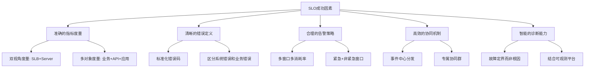

### 7.2 从失败到成功的关键转变

| 维度 | 第一次失败（2019） | 第二次成功 |
|------|-------------------|-----------|
| **目标** | 准确的度量数据，做报表 | 及时发现问题，精确告警 |
| **分级** | 三层模型（业务-应用-接口） | 单层模型（服务维度） |
| **度量点** | 只用负载均衡 | 双视角（SLB + Server） |
| **告警** | 忽略了告警建设 | 核心是告警，报表其次 |
| **预算** | 强管控（冻结变更） | 分析工程因素，不强管控 |
| **价值** | 只有总结时使用 | 日常发现问题，快速定位 |

### 7.3 最佳实践建议

1. **从小范围开始**
   - 选择几个核心服务试点
   - 验证可行性后再推广

2. **指标先行**
   - 确保有可度量的指标
   - 标准化错误码定义
   - 治理指标准确性

3. **告警为王**
   - SLO的价值是告警，不是报表
   - 保证告警准确率和召回率
   - 与传统告警明确区分

4. **边界清晰**
   - 只做服务维度的可用性度量
   - 不要试图一套系统解决所有问题
   - AIOps要有明确的边界

5. **研发视角**
   - 让研发感受到价值（及时发现问题）
   - 提供快速诊断能力
   - 公开透明的协同机制

6. **持续优化**
   - 收集反馈，持续改进
   - 分析误报原因
   - 优化告警策略

## 八、架构全景图

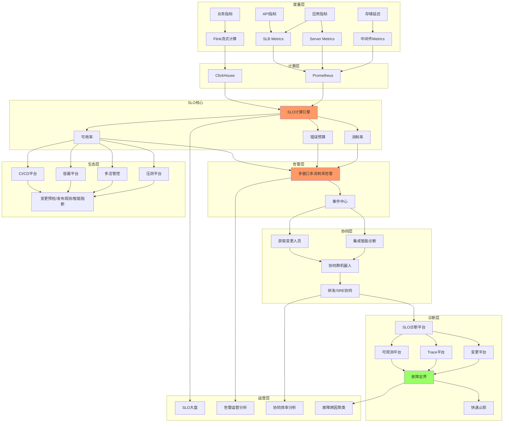

## 九、参考资料

- Google SRE Book - 第4章：服务等级目标
- Google SRE Workbook - SLO告警专题
- B站技术公众号

---

**分享者：** B站技术架构部 吴老师  
**整理时间：** 2025年  
**文档类型：** SRE最佳实践

## 附录：关键术语表

| 术语 | 英文 | 含义 |
|-----|------|------|
| SLI | Service Level Indicator | 服务等级指标 |
| SLO | Service Level Objective | 服务等级目标 |
| SLA | Service Level Agreement | 服务等级协议 |
| SRE | Site Reliability Engineering | 站点可靠性工程 |
| MTTR | Mean Time To Repair | 平均修复时间 |
| HPA | Horizontal Pod Autoscaler | 水平自动扩缩容 |
| QPS | Queries Per Second | 每秒查询数 |
| TP99 | Top Percentile 99 | 99分位延迟 |
| AIOps | Artificial Intelligence for IT Operations | 智能运维 |

---

**备注：** 本文档基于音频转录整理，部分ASR识别错误已根据上下文修正。
