# 高速成长的技术团队该怎么管

> 来源：未核验 · 类型：分享 · 状态：draft · 原始线索：分享人 肖鹏

> 分享人：肖鹏（贝壳技术总监，负责数据库、大数据和机器学习方向，前微博数据库架构师）

## 目录

- [一、引言：管理的本质是人的问题](#一引言管理的本质是人的问题)
- [二、人的成长因素分析](#二人的成长因素分析)
- [三、高速成长企业的挑战](#三高速成长企业的挑战)
- [四、应对之道：修齐治平](#四应对之道修齐治平)
- [五、总结：空中加油式管理](#五总结空中加油式管理)

---

## 一、引言：管理的本质是人的问题

技术管理的核心不仅仅是管理技术本身，更重要的是**管人和管事**。而事最终还是人做的，所以归根结底是**人的问题**。

### 技术人员的核心诉求

技术人员有一个非常明确的特点：**对成长的诉求极高**。他们关注自己的成长，有时甚至超过对薪酬的关注。因此，理解人的成长因素，才是做好技术管理的根本所在。

---

## 二、人的成长因素分析

人的成长因素主要分为两大类：**内因**和**外因**。

### 2.1 内因：认知层面

内因是关于我们如何认知世界、认知自己的问题，主要包括：

#### 马斯洛需求层次理论

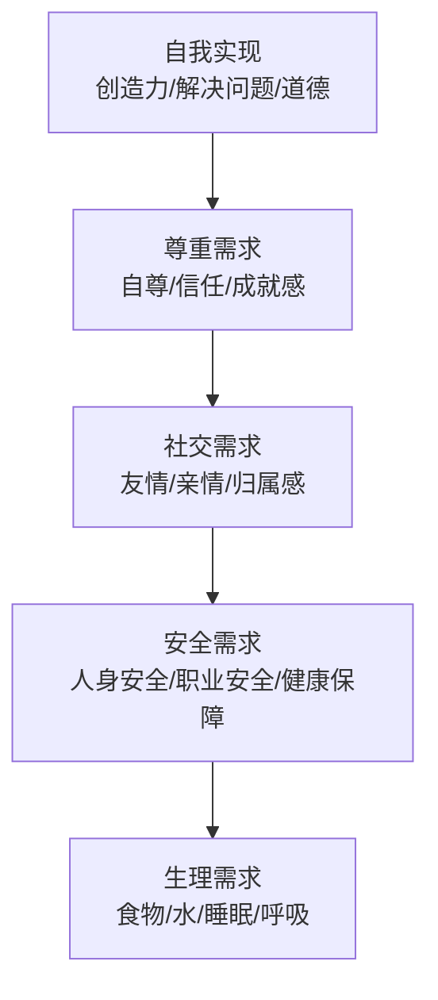

**关键特点：**

1. **从下往上满足**：必须先满足底层需求，才能追求上层需求
2. **需求会循环**：不同阶段、不同情况下，需求层次会变化
3. **累加而非替代**：上层需求不能完全替代下层需求（不能只靠画大饼）

**管理启示：**

- **刚毕业同学**：关注生理需求（租房、生活）和安全需求（职业稳定性）
- **绩效不好时**：关注安全需求（担心被淘汰）
- **跨技术栈转型**：即使是资深工程师，也会回到安全需求层（能否胜任新工作）
- **成熟工程师**：关注尊重需求（成就感、认可）和自我实现

> ⚠️ **注意**：需求层次会因为环境变化而下降。例如，一个资深工程师跳槽或转换技术方向后，关注点会从"尊重需求"降到"安全需求"，此时应给予安全感而非成就感刺激。

#### 其他内因要素

- **需求与动机**：我想做什么？我想成为什么样的人？
- **价值观与文化**：什么是重要的？什么是对的？
- **使命与愿景**：长期目标和方向
- **自我实现**：人本性的最高追求

### 2.2 外因：环境层面

外因是关于物理的、现实的环境因素，主要包括：

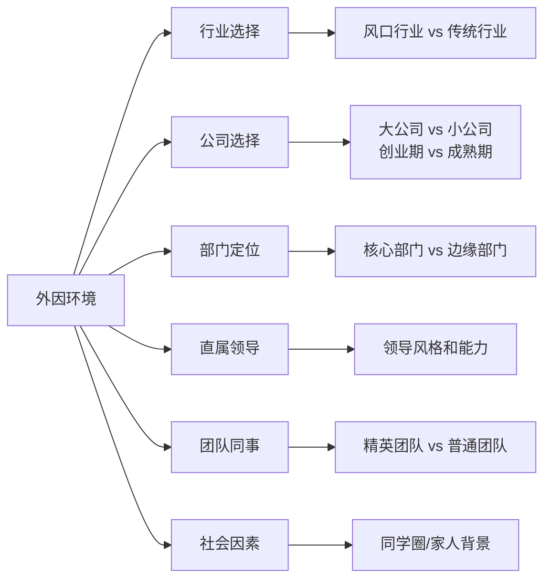

**外因的核心是赛道选择：**

- 选择什么行业？
- 选择什么公司？
- 选择什么时间点加入？
- 选择什么岗位和部门？

**成功案例的共同特点：**

通过面试观察发现，履历优秀的候选人在每次跳槽时都有**清晰的思路**：

- 明确当前工作的收获和不足
- 清楚下一份工作要获得什么
- 有意识地补齐能力短板（如从业务转基础架构，或从基础架构转业务/产品）

### 2.3 内因 vs 外因：哪个更重要？

| 维度 | 内因 | 外因 |
|------|------|------|
| 作用 | 决定能跑多远（马拉松） | 决定能跑多快（加速度） |
| 特点 | 需求、价值观、认知 | 公司、团队、机会 |
| 培养周期 | 长期积累，慢慢迭代 | 立即见效，顺风而行 |

**王道：内外兼修**

但如果一定要选择，**建议工作5年内的同学优先关注外因**：

- 选择高速成长的公司
- 选择有口碑的大公司
- 接触成熟的方法论和优秀的人
- 通过环境倒逼成长，加速迭代

> 💡 **类比**：就像机器学习，迭代次数越多，参数越多，模型效果越好。高速成长的环境能加速你的迭代次数。

---

## 三、高速成长企业的挑战

### 3.1 四大典型挑战

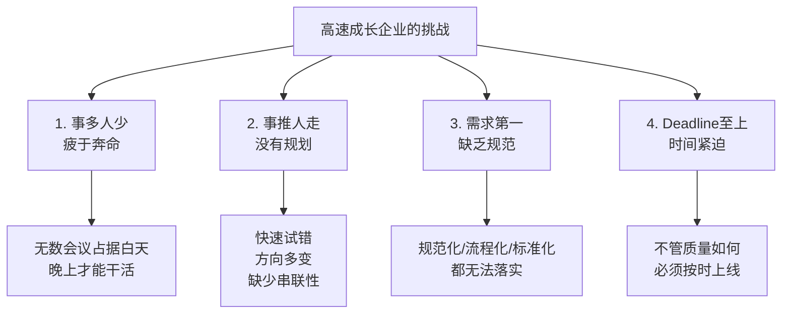

### 3.2 带来的后果

**技术债务累积：**

- ❌ **质量不够，速度凑**：bug比feature还多
- ❌ **前人埋坑，后人重构**：每年重构，年年重构
- ❌ **三步一坑，五步一雷**：没有文档，全靠口口相传
- ❌ **知识靠人脑传递**：关键信息缺失，问题靠运气解决

> 💡 **注意**：这是每个公司初期的必经阶段，并非说明公司Low，这是客观规律。

### 3.3 常见的错误应对方式

| 应对方式 | 为什么行不通 |
|---------|------------|
| 建立完整流程和规范后再做需求 | ❌ 在高速成长公司，**生存高于一切**，速度就是生命 |
| 想清楚长远计划再执行 | ❌ 计划赶不上变化，快速试错是刚需，否则竞品先上线 |
| 招够人再开工 | ❌ 竞品不会等你，人不够也要上 |
| 技术大牛亲自上保证质量 | ❌ 双拳难敌四手，管理者的本质是让**团队产生价值** |

### 3.4 正确的应对之道：太极哲学

> 上下相随，内外相合，相连不断，动中求静，用意不用力。 ——《十三势歌》

**核心思想：以柔克刚，动中求静**

- ✅ **一边造规范一边上线**：不等规范完善，但也不完全不遵守
- ✅ **持续招人，持续迭代**：在混乱中逐步建立秩序
- ✅ **从一个人站稳到十个人，再到更多人**：渐进式扩大立足之地
- ✅ **不求全，但求稳**：规范覆盖90%-95%即可，允许特殊情况存在

> ⚠️ **避免两个极端**：
> 1. 等到规范完善再做（等不来窗口期）
> 2. 完全混乱，等平台期再重构（永远等不到那一天）

---

## 四、应对之道：修齐治平

借鉴中国传统文化中的"修身、齐家、治国、平天下"理念，将其映射到技术管理中：

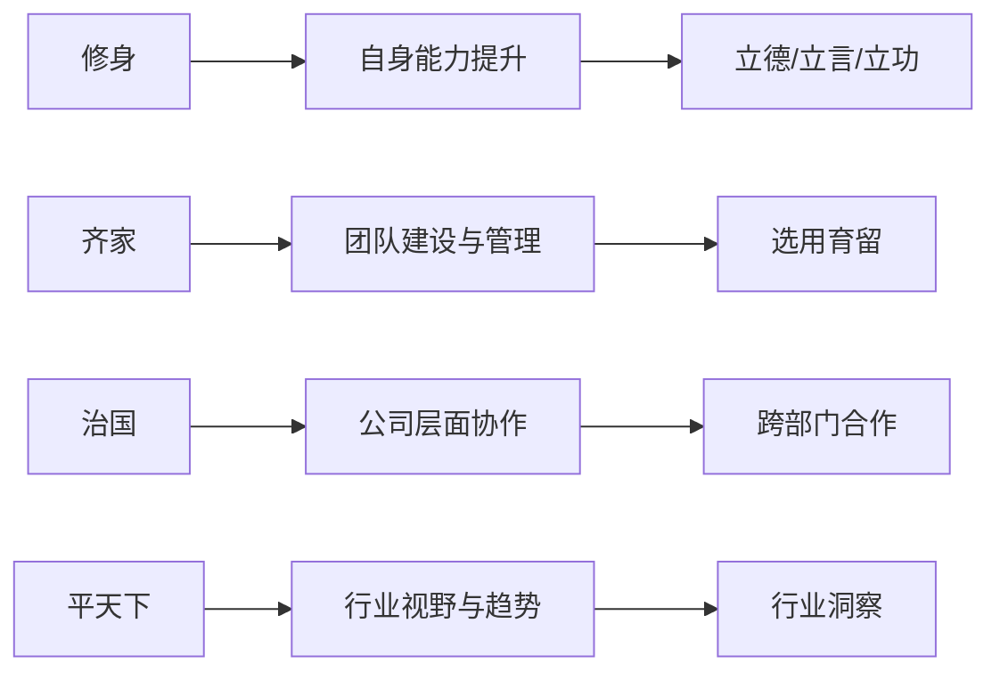

### 4.1 修身：自我提升

作为管理者，必须先把自己修炼得足够强大，才能带领团队取得成绩。

#### 立德：品德修养

**面试观察发现**：候选人记住并感激的前上司，往往不是因为技术指导，而是因为：

- ✅ 公正公平
- ✅ 对下属好
- ✅ 能争取利益
- ✅ 品德和政治觉悟

**关键品质：**

| 品质 | 说明 |
|------|------|
| **反思** | 经常反思决策、沟通方式是否正确，是否帮助团队成长 |
| **感恩** | 团队成绩是团队的，不是个人的 |
| **同理心** | 无论做不做管理都需要，是沟通的基础 |
| **正直与公平** | 要求自己做到，即使公司有不公平现象 |
| **言出必行** | ⚠️ **极其重要**：你的话会被理解为承诺，未兑现会让人感觉被欺骗 |

> ⚠️ **管理者特别注意**：与下属沟通时，不经意的话可能被理解为承诺。承诺如果不兑现，会严重损害信任。

#### 立言：技术影响力

很多人忽视"PPT工程师"、写文档、做分享的价值，但这**极其重要**。

**为什么要立言？**

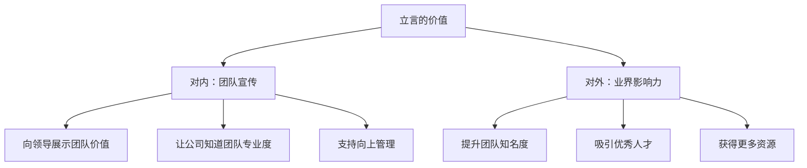

**对后端团队尤其重要：**

- 后端团队离业务远，业务成果难以直接体现
- 不做宣传，就无法展示价值和产出
- **酒香也怕巷子深**：信息大爆炸时代，主动宣传才能被看见

**立言的作用：**

1. **帮助拿结果**：展示团队产出和价值
2. **支持向上管理**：
   - 让领导了解团队细节
   - 通过第三方背书影响领导决策
   - 达成认知一致

> 💡 **真实案例**：很多时候你和领导对技术方案争执不下，但突然一个第三方（外部门Leader）说了类似观点，领导就改变想法了。这就是"立言"的力量。

#### 立功：拿到结果

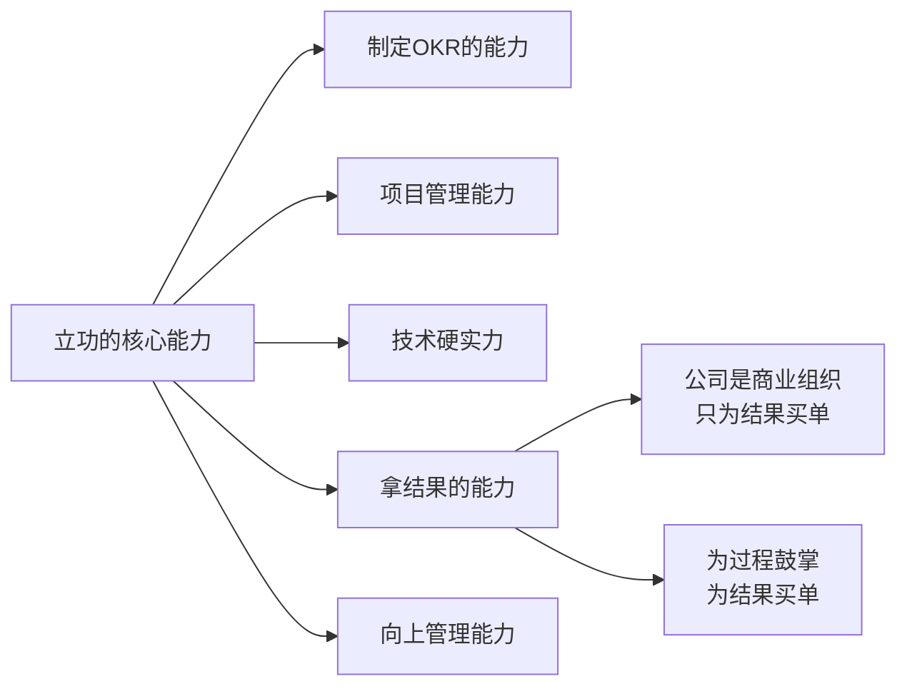

**关键原则：**

- ❌ **苦劳不值钱**：越往上走，越不认苦劳
- ✅ **必须拿结果**：公司是商业组织，只为结果买单
- ✅ **向上管理**：确保你和领导的认知、规划是一致的

**OKR管理的关键点：**

OKR（Objective & Key Results）是一个非常好的管理手段，比KPI更灵活。

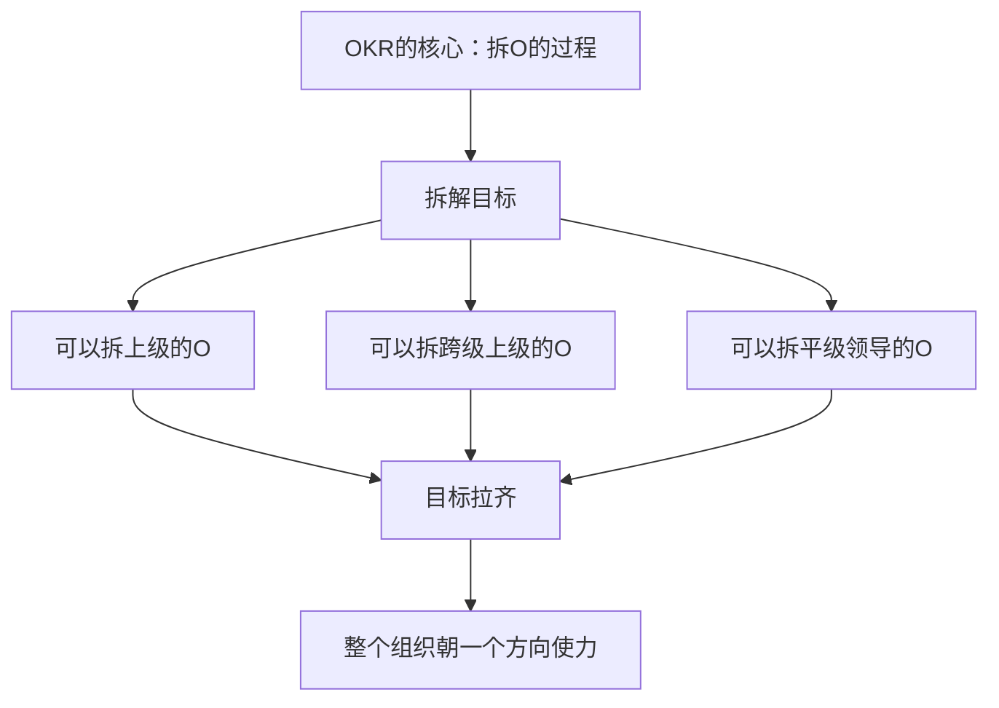

> 💡 **最重要的就是目标拉齐**：目标一旦拉齐，很多事情都好解决。目标拉不齐，各种撕扯一点办法都没有。

### 4.2 齐家：团队管理（选用育留）

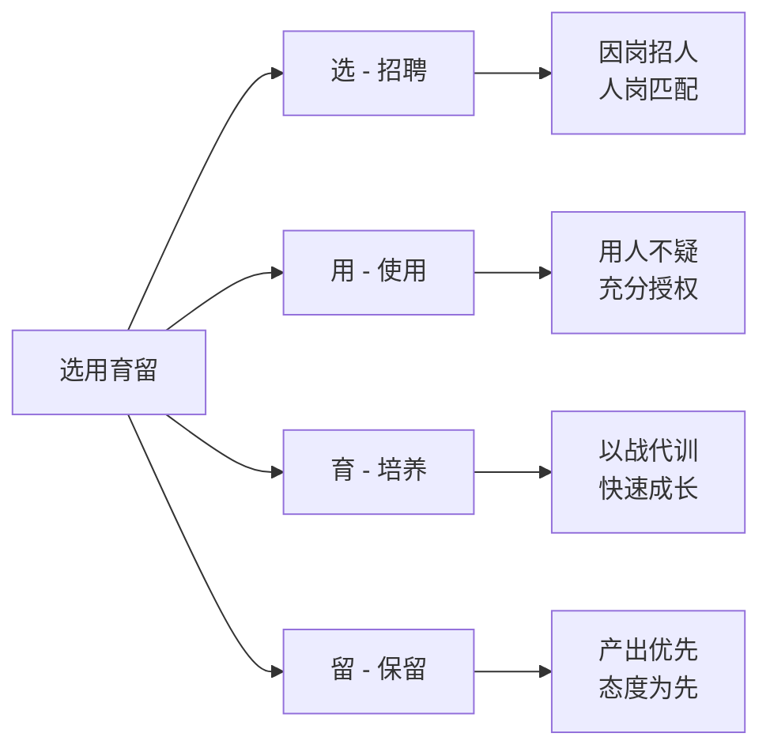

#### 选：招聘是第一要务

**在高速成长公司，管理者必须花至少40%的精力在招聘上。**

> ⚠️ **血的教训**：不能完全依赖招聘团队。等你真正需要用人时，发现后备队伍中一个能打的都没有，这是最痛苦的。

**招聘关键原则：**

| 原则 | 说明 |
|------|------|
| ✅ **因岗招人** | 有岗位需求才招人 |
| ❌ **因人设岗** | 不能因为人才优秀就招进来再找岗位 |
| ✅ **人岗匹配** | 招聘要精准匹配当前需求 |

**因人设岗的危害：**

- 对公司：浪费HC（Headcount）
- 对候选人：没有绩效产出，无法给高绩效也不能给低绩效，双方都尴尬
- 对团队：影响其他成员的公平感

#### 用：用人不疑

**在高速成长公司，必须用人不疑，充分授权。**

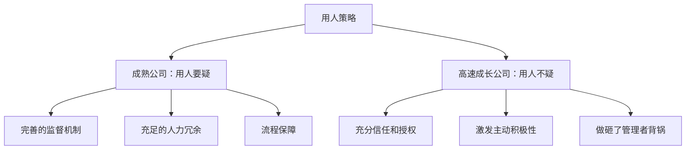

**什么是用人不疑？**

- ✅ 分配任务后，全权授权
- ✅ 做砸了，管理者背锅
- ✅ 不设置过多监控和束缚

> 💡 **类比**：如果派人出去打仗，还安排东厂、西厂、锦衣卫三层监控，戴着镣铐怎么打胜仗？

**但不是完全大撒把：**

必须做到：
1. ✅ 给明确的方向和规划
2. ✅ 把目标定得非常清晰
3. ✅ 给予激励、帮助和承诺
4. ✅ 告知做成后的回报

之后，细节就用人不疑。

#### 育：以战代训

**不要指望完善的培训体系。**

初创期公司不可能有"京东大学"、"美团大学"这样的培训体系，HR团队连招聘压力都解决不了，不会有专门的培训团队。

**正确的培养方式：**

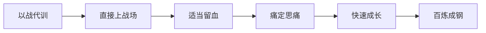

> 💡 **流血是成长最快的方式**：只有经历疼痛，才能痛定思痛，快速成长。保护得太好，永远练不出来。

#### 留：产出优先，态度为先

**保留策略：**

| 维度 | 原则 |
|------|------|
| **产出 vs 能力** | 产出 > 能力（能力再好，没产出也没用） |
| **态度 vs 能力** | 态度 > 能力（有个性但不配合的人要早点淘汰） |
| **代谢策略** | 及早识别，及早代谢 |

**为什么态度重要？**

在高速成长阶段：
- 需要小步快跑，活下来是第一要务
- 不允许挑食和挑活
- 脏活、苦活、累活都得有人做
- 有能力但有个性（"这个Low我不做"）的人，会损害团队公平性

**态度不好的人危害极大：**

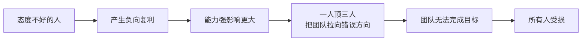

> ⚠️ **血的教训**：很多管理者舍不得淘汰这样的人（缺人、已熟悉业务），但拖得越久，对团队伤害越大。应该及早代谢。

### 4.3 治国：公司层面协作

#### 跨部门合作的四大原则

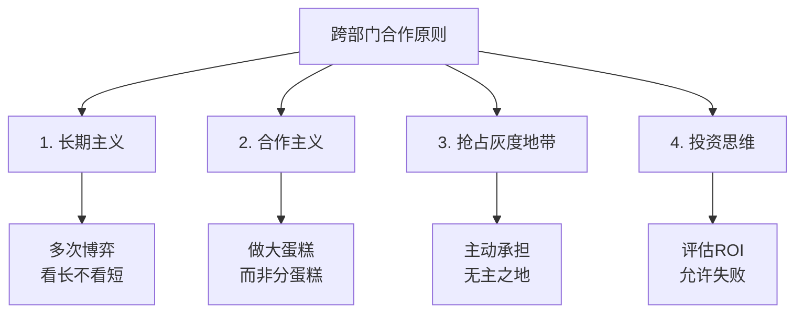

#### 1. 长期主义：多次博弈

**核心思想：**

- 与平行部门的合作是**多次博弈**，不是一次性博弈
- 不要在乎一次的输赢，要看长远

**案例：**

> 数据库平台团队和业务团队，这次谈崩了，业务就不用数据库了？不可能！未来还会继续合作。

**实践经验：**

- ✅ 这次让步，下次对方会还给你
- ✅ 坚持做正确的事，大部分部门会与你合作愉快
- ❌ 如果一个部门一直占便宜，会"群起而攻之"，活不下来

#### 2. 合作主义：做大蛋糕

**常见误区：**

> "这个活我也做，他也做，我们要PK一下到底谁做。"

**更好的思路：**

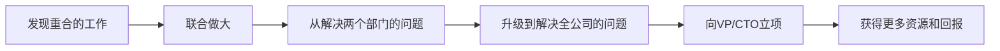

**收益：**

- ✅ 比两个部门撕扯好得多
- ✅ 做大后容易分配（现在分不清楚，做大了就好分了）
- ✅ 获得更大的话语权和影响力

#### 3. 抢占灰度地带

**高速成长公司的特点：有大量"无主之地"**

- 这事没人管
- 职责不清
- 凑合着运行

**策略：敢于承担**

> "这事我搞，我搞定了！"

**收益：**

- ✅ 拿下职责范围
- ✅ 扩大部门边界
- ✅ 提升话语权
- ✅ 增加回报

> 💡 **老板一定会同意**：因为现在没人站出来帮他解决问题。

#### 4. 投资思维：评估ROI

**把团队资源当作投资组合：**

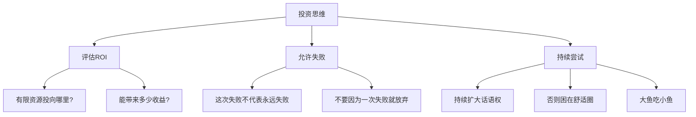

**关键点：**

- ✅ 评估每个项目的投入产出比
- ✅ 允许失败（谁炒股没交过学费？）
- ✅ 不要因为一次失败就退缩
- ✅ 持续扩大团队边界

> ⚠️ **不尝试的后果**：困在舒适圈，其他团队越做越大，最后被吞并。

### 4.4 平天下：行业视野

这部分需要CEO级别的视野和经验，主要关注三个问题：

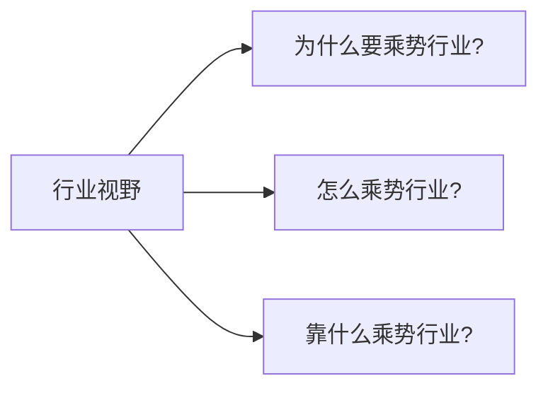

> 💡 **建议**：多与公司高P（VP级别）沟通，了解他们的思路和方法论。

---

## 五、总结：空中加油式管理

在高速成长期，如何做到"空中加油"（不停下来的情况下补充能量）？

### 5.1 四大关键要素

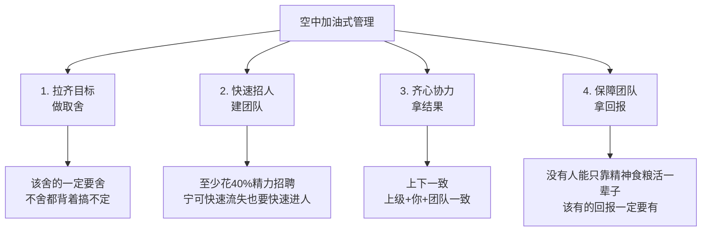

### 5.2 关键原则

| 序号 | 原则 | 说明 |
|------|------|------|
| 1 | **拉齐目标，做取舍** | 该舍的一定要舍，不舍都背着搞不定 |
| 2 | **快速招人，建团队** | 非常非常重要！至少花40%精力，宁可快速流失也要快速进人 |
| 3 | **齐心协力，拿结果** | 上下一致（上级+你+团队），共同拿到认可的结果 |
| 4 | **保障团队，拿回报** | 没有人能只靠精神食粮活一辈子，必须向上管理，争取团队回报 |

### 5.3 管理本质

> **管理的本质就是绩效管理**，最关键的是**结果导向**。

---

## 六、Q&A精选

### Q1：如何评估考核机制？

**A**：考核机制的核心是**结果导向**，强调以结果为准。遵循公司制度即可，但一定要跟团队强调结果的重要性。

### Q2：如何处理拖后腿又招不来人的情况？

**A**：这是两难的选择。根据经验，**下狠心逐渐是更好的选择**。否则会拖一年、两年、三年，直到这人自己离职。但如果当时进来一个更好的人，团队能取得更高成绩。

### Q3：压力太大怎么办？

**A**：
1. 找志同道合的朋友出去喝酒
2. 找做过管理的同事互相吐槽
3. 没有更好的办法，这是管理者的必经之路

### Q4：如何平衡动中求静的"度"？

**A**：见仁见智，根据实际情况靠感觉把握。如果某个规范缺失可能带来更大问题，就加快建设；如果伤害不大，就降低优先级。

### Q5：如何提升领导力和管理力？

**A**：
- **专注力**：使用GTD工具（如OmniFocus）管理时间
- **管理能力**：
  1. 看书学习
  2. 多找VP级别的人沟通，参与他们的项目，学习他们的方法

### Q6：如何引导工作积极性？

**A**：方法很多，但最关键的是**形成机制**：

- ✅ 让团队相信你画的饼能吃到
- ✅ 在团队中形成几个成功case（说做某事能晋升，最后真的晋升了）
- ✅ 承诺的回报要兑现

如果团队认为领导是"大忽悠"，团队一定会散。

### Q7：技术转管理，不放心别人做怎么办？

**A**：这是技术转管理的必经心魔。没有好方法，**被逼出来的**。

- 杂事越来越多后，被迫只能选择授权
- 慢慢会发现做这个事比做那个事更重要
- 有的人转得快，有的人转得慢

### Q8：以战代训流动性会不会很大？

**A**：
- ✅ **确实会有流动**：有些人扛不住
- ✅ **留下的都是精钢**：能力强+个人魅力强
- ✅ **形成正向循环**：对新人产生影响，形成更有凝聚力的团队
- ✅ **用招聘补充流失**：这就是管理者的工作

---

## 附录：核心方法论总结

### 人的成长因素

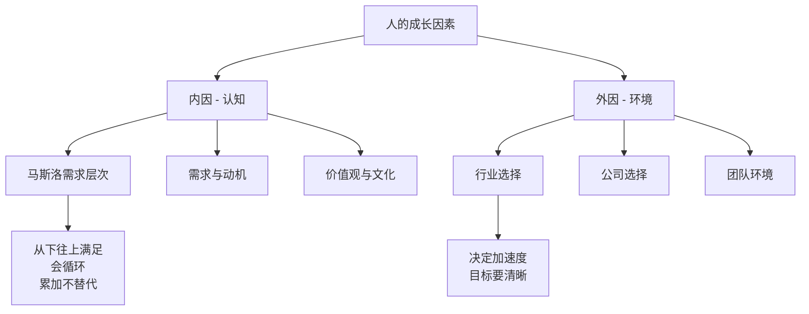

### 修齐治平全景图

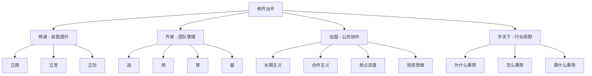

### 选用育留详解

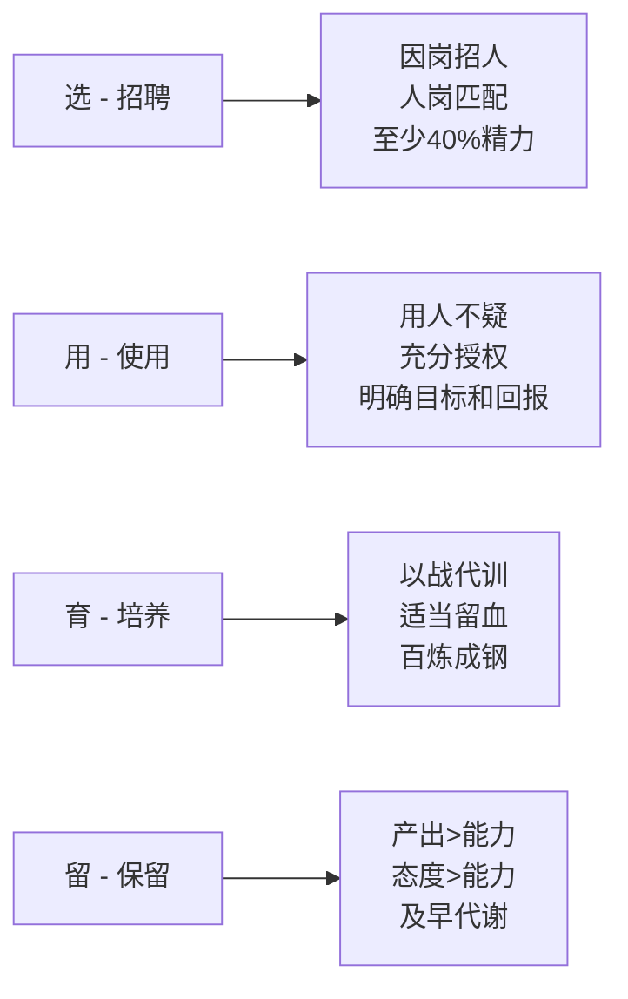

---

## 核心金句

1. **管理的本质是人的问题**，事最终还是人做的
2. **技术人员关注成长甚于薪酬**
3. **需求是累加的不是替代的**，不能只靠画大饼
4. **外因决定加速度，内因决定能跑多远**
5. **动中求静，乱中取胜**——太极哲学在管理中的应用
6. **规范覆盖90-95%即可**，允许特殊情况存在
7. **立言很重要**：酒香也怕巷子深
8. **目标拉齐了，很多事情都好解决**
9. **招聘是第一要务**，至少花40%精力
10. **因岗招人，不因人设岗**
11. **用人不疑，充分授权**
12. **以战代训，百炼成钢**
13. **态度大于能力，产出大于能力**
14. **为过程鼓掌，为结果买单**
15. **长期主义，多次博弈**
16. **做大蛋糕，而非分蛋糕**
17. **没有人能只靠精神食粮活一辈子**

---

## 适用场景

本分享特别适合以下人群：

- ✅ 技术团队管理者（TL/Manager/Director）
- ✅ 高速成长公司的技术负责人
- ✅ SRE/运维团队Leader
- ✅ 从技术转管理的工程师
- ✅ 希望提升管理能力的技术人

---

**文档整理说明**：本文档根据音频ASR转录内容整理，部分识别错误已根据上下文进行修正。内容来自贝壳技术总监肖鹏在DBA+社群的技术分享。

**最后更新时间**：2025-10-24
