# 技术管理如何避免瞎折腾

> 来源：未核验 · 类型：分享 · 状态：draft


> 趣丸运维体系解密：从个人发展到排兵布阵

**分享嘉宾**：刘亚丹 - 趣丸科技技术保障线负责人

**核心价值**：
- 宏观层面：基于趣丸科技现状，以管理者视角分享运维体系、技术管理、团队协作经验
- 微观层面：基于个人一线到管理的多年经历，分享技术前瞻、个人成长的思考
- 为中小企业运维团队建设提供借鉴和决策逻辑参考

---

## 目录

- [一、技术趋势：从第一曲线到第二曲线](#一技术趋势从第一曲线到第二曲线)
- [二、运维体系设计：康威定律的实践](#二运维体系设计康威定律的实践)
- [三、团队自治：从定位到结果](#三团队自治从定位到结果)
- [四、个人成长：数字化时代的修炼](#四个人成长数字化时代的修炼)

---

## 一、技术趋势：从第一曲线到第二曲线

### 1.1 创新的双曲线理论

技术创新遵循"第一曲线到第二曲线"的演进规律：

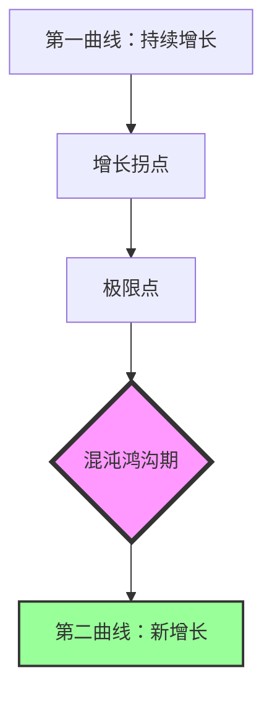

**关键洞察**：
- 两条曲线之间存在巨大鸿沟，代表不确定性和混沌
- 混沌期蕴含巨大机遇，抓住机会可实现10倍、百倍增长
- 当前多个技术领域正处于曲线切换的关键期

### 1.2 四大技术趋势变革

#### 1.2.1 计算方式：从CPU到GPU的变革

**算力革命**：
- 过去8年GPU算力翻了**1000倍**，远超摩尔定律
- 单Token能耗降低到**1/350**
- 从串行计算到并行计算的范式转变

**三大转变**：
- **串行 → 并行**：并行计算成为主流
- **电子 → 智能**：类比特斯拉发明交流电，AI时代产生"智能"而非"电子"
- **数字孪生**：整个数字化世界可用Token表示，迈向AGI时代

**运维新机会**：
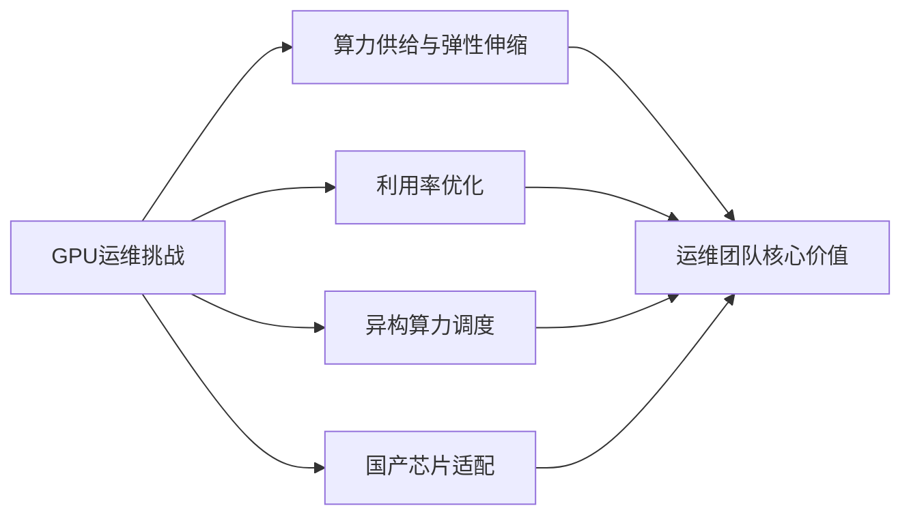

- GPU资源快速弹性伸缩
- GPU利用率提升（GPU极其昂贵）
- 异构算力调度与虚拟化
- 国产芯片（华为等）的运维适配

#### 1.2.2 应用方式：从Cloud Native到AI Native

**Cloud Native（过去10年）**：
- **目的**：交付弹性可扩展的软件/应用
- **底层框架**：Kubernetes（事实标准）
- **五大代表技术**：
  1. 容器化
  2. 微服务化
  3. 服务网格
  4. 不可变基础设施
  5. 声明式API

**AI Native（未来方向）**：
- **应用特征**（待定义）：
  - 数据驱动
  - 自主学习能力
  - 多模态交互

- **底层框架**：尚未明确（类比K8s之前的竞争期）
  
- **可能的关键技术**：
  - 多模态LLM
  - 多模态交互
  - RAG（检索增强生成）
  - 向量数据库
  - LLM编排

**云原生十二要素 vs AI Native要素**：
- 云原生有明确的[Twelve-Factor App](https://12factor.net/)
- AI Native时代是否会有类似定义？这是**巨大的机会窗口**

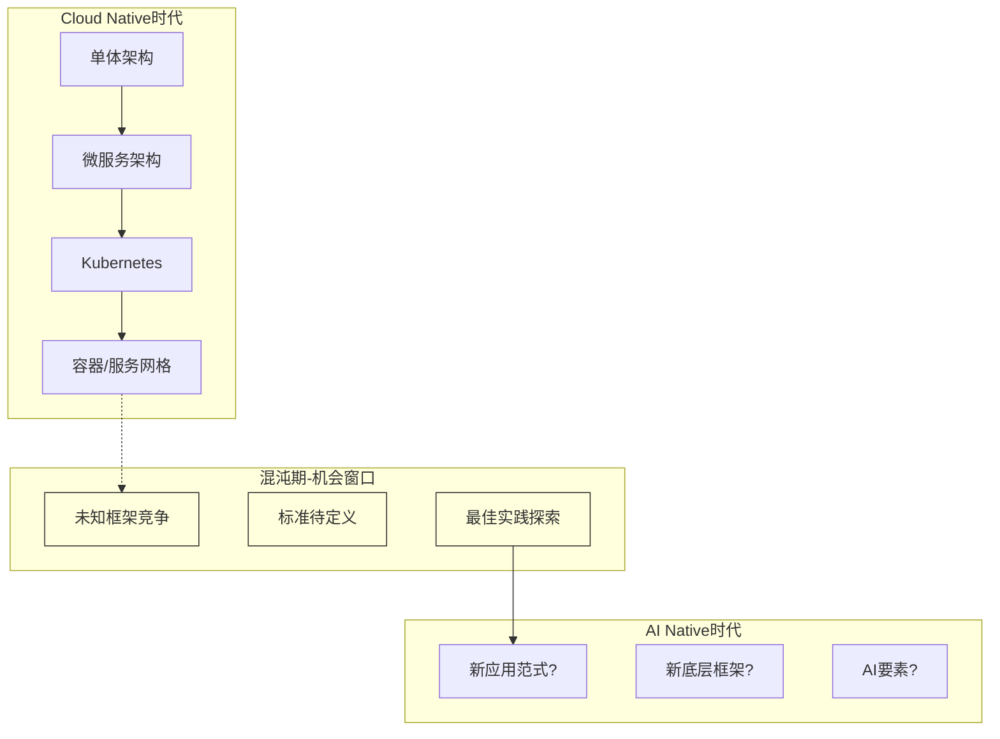

#### 1.2.3 协作方式：DevOps到平台工程

**DevOps已死，平台工程才是未来？**

| 维度 | DevOps | 平台工程 |
|------|--------|----------|
| **核心目标** | 频繁、可靠地交付业务价值 | 降低认知负载，实现研发自助交付 |
| **关注点** | 敏捷研发活动、面对面沟通 | 工具化封装、自助服务 |
| **解决的协作** | 产品人员 ↔ 开发人员 | 开发人员 ↔ 运维人员 |
| **沟通模式** | 频繁沟通、信息共享 | 减少沟通、零沟通交付 |
| **实现方式** | 看板、站会等敏捷活动 | 平台化、自助化 |

**平台工程的本质**：
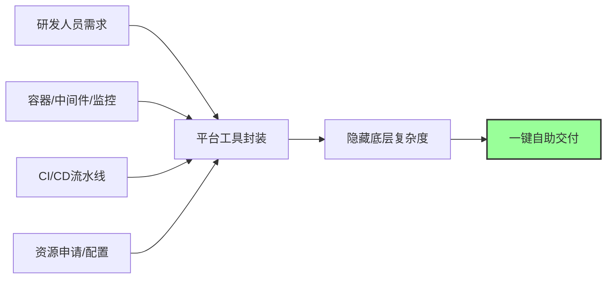

**个人观点**：
- DevOps和平台工程并非对立，而是互补
- DevOps：解决产品需求理解和开发协作
- 平台工程：解决开发到上线的工具链问题
- 两者都是必要的，关注点不同

#### 1.2.4 运维方式：从ITIL到SRE

**ITIL时代**（2000年代初）：
- 通过**流程**和**人**来保障稳定性
- 强调规范、审批、合规
- 适用场景：银行、证券、政企等高敏感业务
- 问题：流程死板、效率低、人工审批不可靠

**SRE时代**（当前及未来）：
- 通过**软件工程**提升稳定性
- 要求50%时间做开发工作
- 门槛高但是未来方向
- Google、腾讯、阿里等大厂标配

**两者关系**：
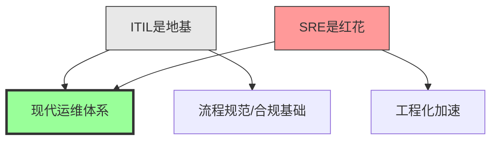

**总结**：ITIL是地基，决定必须要有的规范；SRE是红花，加速效率提升。

**推荐资源**：
- SRE精英联盟白皮书：详细的各行业SRE实践案例

---

## 二、运维体系设计：康威定律的实践

### 2.1 核心原则：组织架构决定系统架构

> 康威定律：Organizations which design systems are constrained to produce designs which are copies of the communication structures of these organizations.

**实践依据**：《团队拓扑》（Team Topologies）理论

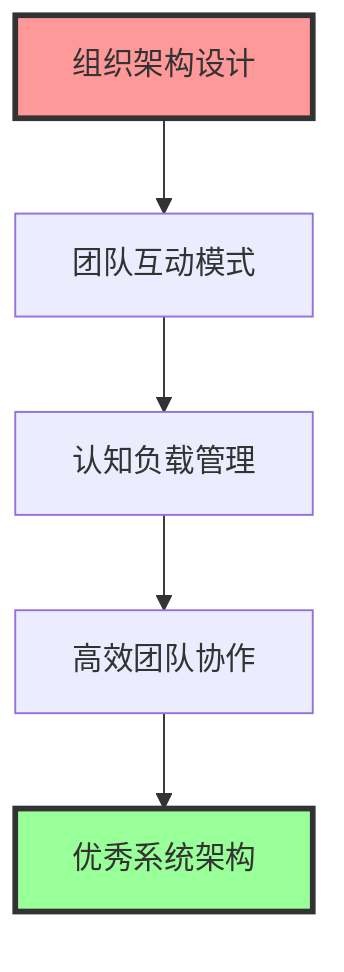

### 2.2 四种团队类型

| 团队类型 | 职责定位 | 典型例子 | 特点 |
|---------|---------|---------|------|
| **业务流团队** | 端到端交付用户价值 | TT语音产品团队（产品+研发+测试+运维） | 面向终端用户需求 |
| **平台团队** | 提供平台能力和工具 | 运维平台、容器平台、CI/CD平台 | 服务于内部团队 |
| **赋能团队** | 短期指导和培训 | 敏捷教练、技术培训 | 阶段性辅导 |
| **复杂子系统团队** | 专业领域黑盒服务 | 财务系统、容器调度、混合部署 | 屏蔽底层复杂度 |

### 2.3 趣丸科技组织架构演进

#### 两年前的架构：

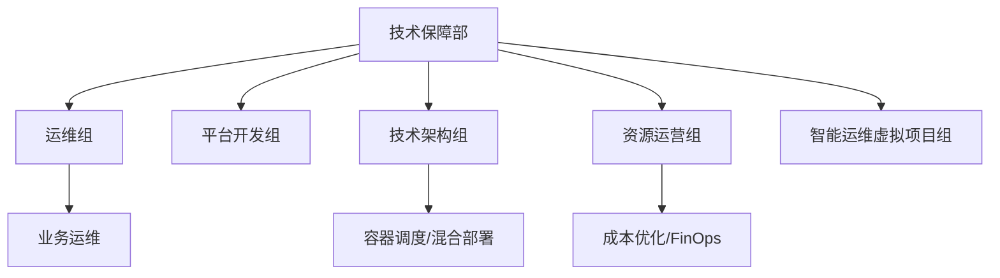

**特点**：
- 每个团队聚焦核心领域
- SRE运维：业务流团队
- 技术架构：复杂子系统团队（容器/混布）
- 资源运营：赋能团队（FinOps角色）

#### 当前的架构：

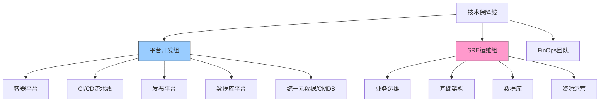

**演进优势**：

1. **平台开发组整合**：
   - 统一元数据成为可能
   - CMDB彻底统一（行业难题）
   - 一份数据多方消费
   - 参考：南京云平台的CMDB底座实践

2. **SRE运维组整合**：
   - 成为完整的业务价值流团队
   - 对成本、效率、稳定性全面负责
   - 业务运维、基础架构、数据库、资源运营协同

**核心洞察**：
> 组织架构在平台层面的统一，才能真正实现元数据统一和工具链整合

### 2.4 人才画像与特质要求

不同技术方向需要不同特质的人才：

| 人才类型 | 核心能力要求 | 典型技能 |
|---------|-------------|---------|
| **ITIL型** | 流程规范、合规意识 | ITIL V3/V4、ISO20000、审计 |
| **SRE型** | 开发能力、工程思维 | 编码能力、部署能力、业务治理、风险治理 |
| **Cloud Native型** | 容器编排、云原生技术栈 | K8s、服务网格、微服务、混合调度 |
| **AI Native型** | AI工程能力（探索中） | LLM应用、向量数据库、RAG、模型调优 |

**招聘策略**：
- 为每个方向找到特别擅长的人才
- 让专业的人做专业的事
- 构建多样化的技术团队

---

## 三、团队自治：从定位到结果

### 3.1 团队定位：To B的价值创造

**核心定位**：
- 技术保障团队是公司内部的To B团队
- 必须明确谁是客户（业务团队）
- 客户需要为价值买单（内部口碑）

### 3.2 价值创造公式（俞军产品方法论）

#### 商业价值公式：

```
商业价值 = 客户愿付价格 - 企业成本
```

**拆解到运维场景**：

#### （1）客户愿付价格 = 产品价格 + 服务价格

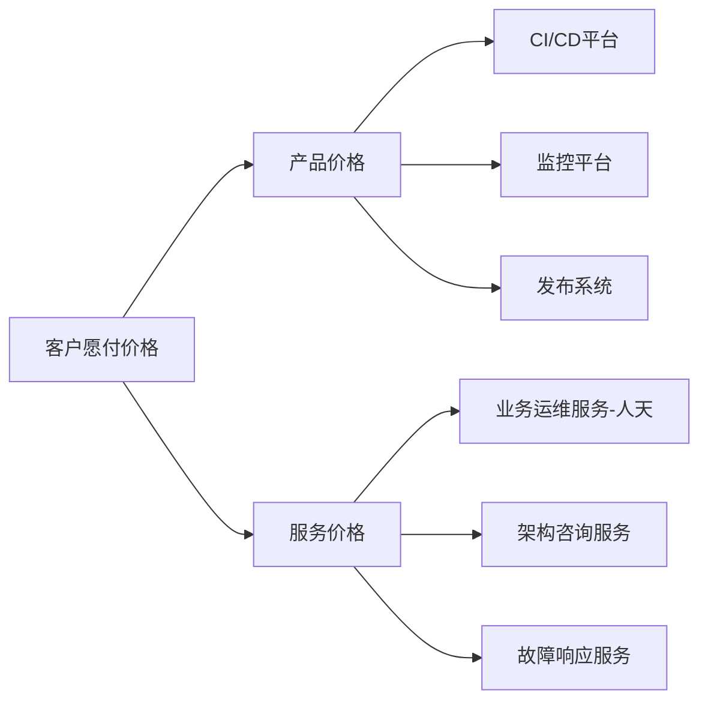

**产品价格的本质**：

```
用户价值 = 新体验 - 旧体验 - 替换成本
```

**实际案例**：发布系统迁移
- **旧体验**：手工发布，流程繁琐
- **新体验**：系统化、标准化、一键发布
- **替换成本**：业务接入改造、迁移成本、学习成本
- **净用户价值** = 新体验提升 - 迁移痛苦

**关键原则**：
> 必须创造真实的用户价值，否则产品无法落地。依赖行政手段强推效果极差，团队口碑也会受损。

#### （2）企业成本 = 人力成本 + 质量成本 + 沟通成本

**沟通成本（交易成本）最容易被忽略**：

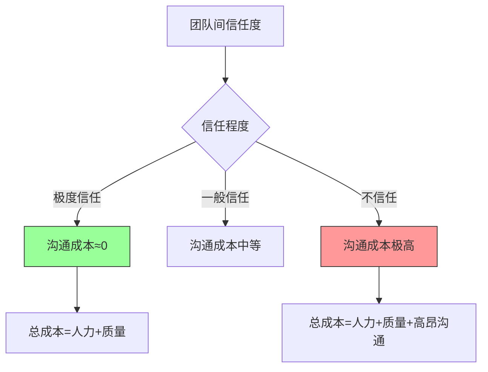

**降本策略**：
- 持续赢得业务团队信任
- 信任度越高，交易成本越低
- 理想状态：沟通成本为零（理论值）

### 3.3 目标管理：OKR机制

#### OKR定义：
> OKR是思维框架和纪律要求，聚焦于组织成长的可衡量目标

**趣丸OKR六要素**（标准5要素+1）：

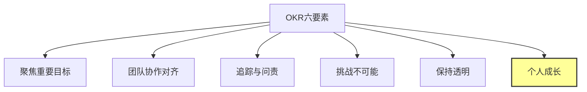

**第六要素-个人成长**：
- 标准OKR强调"跳一跳够得着"
- 趣丸增加：过程中个人有何成长？
- 避免员工感觉被"压榨"
- 平衡组织目标与个人发展

#### OKR全流程：

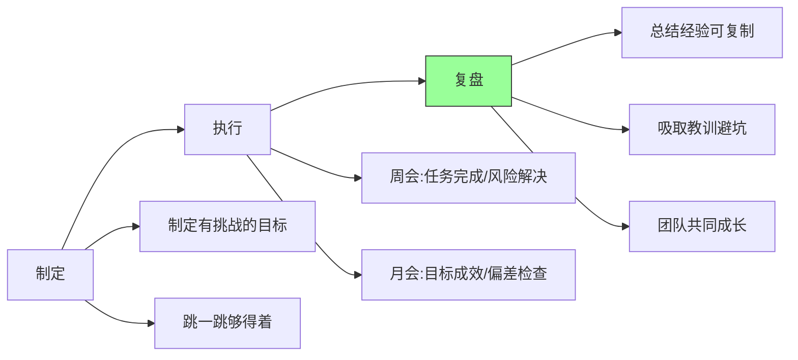

**会议节奏**：
- **周会**：聚焦任务完成层面，处理风险和阻碍
- **月会**：聚焦目标和成效，检查是否偏离目标
- **复盘**：目的是成长，不是追责

**复盘原则**：
- 找到做得好的 → 形成经验，可复制
- 承认做得不好的 → 吸取教训，共同避坑

### 3.4 团队文化与行为准则

#### 做事要求：

**目标清晰，执行力强**
- 在正确的目标下，只为成功找方法
- 不断追求卓越，超越自我
- **大白话**：逆水行舟，不进则退

**坦诚激情，可靠靠谱**
- 成员之间真诚、坦诚
- 保持工作激情
- **靠谱三原则**：
  - 凡事有交代
  - 件件有着落
  - 事事有回应

#### 产品服务准则：

**客户价值之上**：
1. **明确客户**：清楚谁是我们的客户
2. **价值买单**：让客户为产品价值买单
3. **产品定位**：知道该做什么，不该做什么
4. **需求本质**：需求是被发现的，不是被创造的
5. **自助优先**：产品尽量让客户自助使用
6. **吃狗粮**：产品人员成为自己产品的忠实用户

**传播与落地**：
- 每周宣讲行为准则
- 对照准则自查行为
- 简单一致，易于理解和传播

---

## 四、个人成长：数字化时代的修炼

### 4.1 驾驭数字助手：成为10×工程师

**时代机遇**：
- 排除智商差异，普通人也可借助AI成为"10×工程师"
- 云基础设施 + SaaS服务 + AI助手 = 个体能力放大器

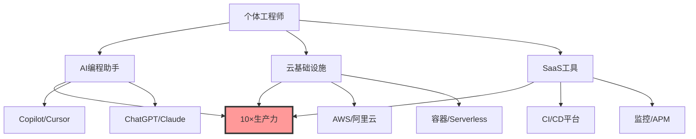

**关键洞察**：
> AI不会取代人，只会取代不会使用AI工具的人

**数字助手类型**：
- **AI编程助手**：GitHub Copilot、Cursor、Codeium
- **对话助手**：ChatGPT、Claude、文心一言
- **专业工具**：数据分析、图像生成、视频剪辑
- **云服务**：弹性计算、存储、数据库
- **开源工具**：K8s、Prometheus、Terraform

### 4.2 积累数字资产：个人复利

#### 数字资产三要素（纳瓦尔宝典）：

**1. 代码（Code）**
- 开源项目贡献
- 个人工具库
- 技术博客代码示例
- **特点**：可复用、可传播、产生复利

**2. 文字（Content）**
- 技术博客/公众号
- 技术文档/白皮书
- 社区问答/专栏
- **特点**：知识沉淀、影响力扩散

**3. 音视频（Media）**
- 技术分享录屏
- 视频教程
- 播客/直播
- **特点**：传播效率高、可变现

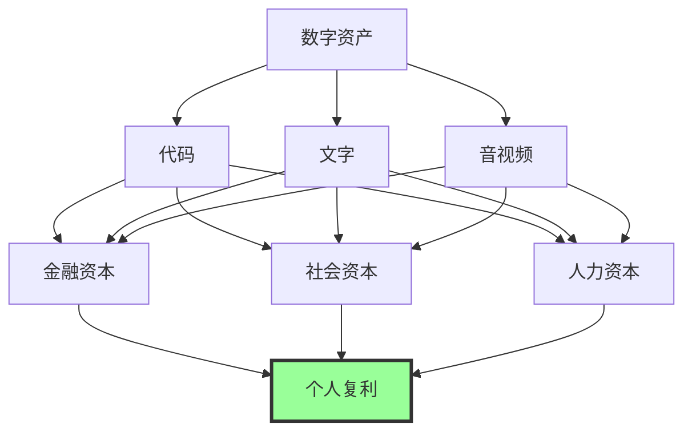

#### 三大资本转化：

| 资本类型 | 来源 | 转化方式 | 案例 |
|---------|------|---------|------|
| **金融资本** | 数字资产变现 | 视频播放分成、打广告、付费专栏 | 技术视频号收益 |
| **社会资本** | 影响力和关系链 | 视频号/抖音粉丝、技术社区声望 | 行业人脉网络 |
| **人力资本** | 个人时间+团队时间 | 管理放大：团队目标×成员时间 | 技术管理者 |

**管理的本质**：人力资本的放大
- 管理者接受战略目标分解
- 转化为团队目标
- 通过管理让团队成员实现目标
- = 个人时间 × 团队倍数

#### 推荐书籍：

1. **《纳瓦尔宝典》**：财富与幸福指南
   - 强调复利思维
   - 数字资产的力量

2. **《一人公司》**：个体创业指南
   - 基础设施完善 → 一人可造公司
   - 三大资本的实战应用

3. **超级个体**：
   - 微信搜索显示230+本书提及此概念
   - 个体崛起是不可忽视的趋势

### 4.3 物理世界的两大定律

#### 定律一：熵增定律与负熵

**热力学第二定律（熵增定律）**：
> 在孤立系统中，没有外界做功时，能量从高处流向低处，最终达到平衡后系统趋于死寂。

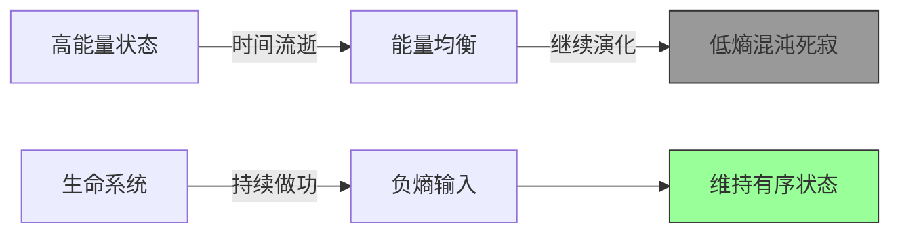

**薛定谔的洞察**：
> "人活着就是为了对抗熵增定律，生命以负熵为生"

**实践方式-运动**：
- 运动是最好的"做功"方式
- 跑步产生负熵，对抗混乱
- 不仅身体变好，整个生理状态完全改变
- 状态不好时 → 跑步 → 状态立即恢复

**个人实践**：
- 坚持跑步近3年
- 中年男人爱上跑步后一发不可收拾
- 开始很难，但跑起来就停不下来

**推荐周边朋友跑步的原因**：
```
物理做功 → 负熵产生 → 生命活力 → 精神状态提升
```

#### 定律二：大脑的快乐-痛苦天平

**成瘾理论**（《成瘾》一书）：
> 人的快乐与痛苦在大脑中是一个天平，不断寻求平衡

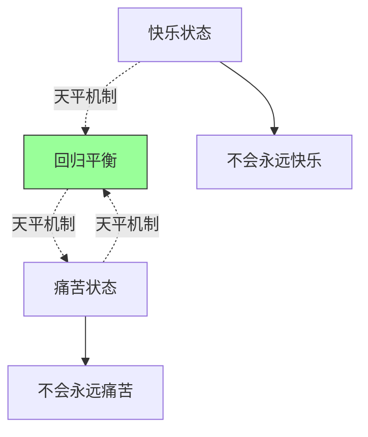

**核心洞察**：
- 你不可能永远快乐
- 你也不可能永远痛苦
- 大脑机制：快乐与痛苦来回摆动保持平衡

**实践指导**：

1. **痛苦时的心态**：
   - 痛苦到一定程度，快乐一定会来
   - 不必过度焦虑
   - 保持乐观，等待天平摆动

2. **快乐时的警醒**：
   - 快乐到极致，痛苦可能不远
   - 居安思危，保持平衡

3. **极端案例**：
   - 即使天天不上班到处玩，也会无聊到痛苦
   - 大脑的运作机制如此

**生活哲学**：
> 了解大脑运作机制，接受快乐与痛苦的摆动，减少焦虑

### 4.4 身心平衡格言

```
运动对于身体，如同读书对于精神
```

**双重修炼**：
- **身体**：通过运动对抗熵增，保持活力
- **精神**：通过学习吸收知识，提升认知

---

## 五、实战案例与问答

### 5.1 组织架构调整逻辑

**问题**：为什么把资源运营组从独立调整到SRE运维组下？

**回答**：

1. **赋能团队的本质**：
   - 资源运营是赋能型团队
   - 需要借助业务运维团队落地成本优化

2. **决策机制优化**：
   ```mermaid
   graph TB
       subgraph "调整前"
           A1[资源运营组] -.推动.-> B1[业务运维组]
           B1 -.决策冲突.-> C1[上升到部门负责人]
       end
       
       subgraph "调整后"
           A2[资源运营] --> B2[SRE运维组统一决策]
           B2 --> C2[质量/效率/成本内部平衡]
       end
       
       style C2 fill:#9f9,stroke:#333
   ```

3. **目标统一**：
   - 质量、成本、效率需要平衡
   - 统一在SRE运维组内决策
   - 降低沟通成本，提升决策效率

### 5.2 SRE人才定位

**问题**：SRE偏运维还是偏开发？团队如何配置？

**回答**：

**两个方向**：

1. **SRE运维（偏运维）**：
   - 开发占比：10%-20%
   - 核心：具备软件工程化思维
   - 不靠流程和人力，靠代码解决问题

2. **SRE平台开发（偏开发）**：
   - 开发占比：70%-80%
   - 构建运维平台和工具

**共同要求**：
> 都要有软件工程化思维，用代码而非流程解决问题

**行业差异**：
- 趣丸：分为两个岗位，能力模型有差异
- 大厂（如字节）：统一到一个职级体系，做得很好
- 没有绝对标准，根据公司情况调整

### 5.3 平台工程与第三方工具

**问题**：如果已用第三方平台（开源工具），平台开发还重要吗？

**回答**：

**核心判断**：能解决问题就不重要

**但现实情况**：
1. 开源工具很少拿来即用
2. 需要适配公司场景
3. 需要用户体验包装

**趣丸实践**：
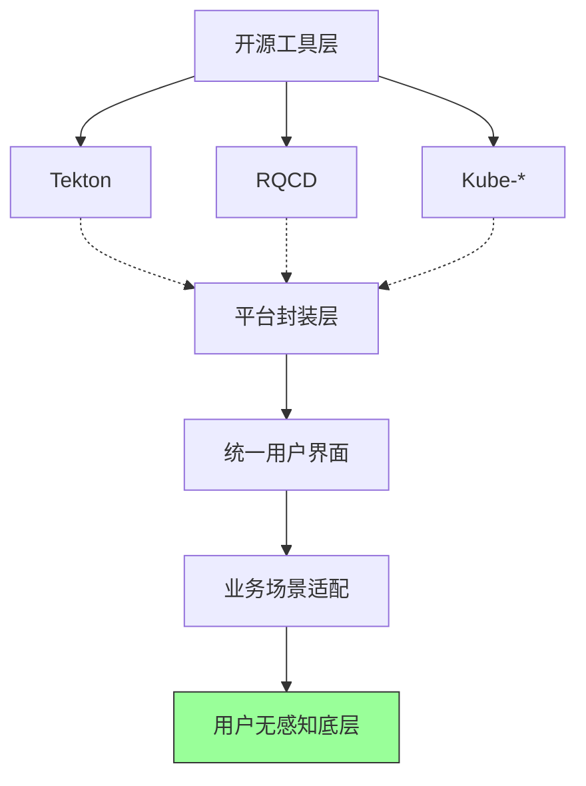

**用户视角**：
- 不需要了解Tekton是什么
- 不需要了解RQCD是什么
- 只要在业务场景中使用即可

### 5.4 AIOps工具推荐

**问题**：有AIOps自动化工具推荐吗？

**回答**：

**开源工具现状**：
- 算法公开（时序异常检测、根因分析等）
- 但光有算法无法落地
- 缺少开箱即用的开源工具

**商业化产品**：
- 多数AIOps是商业公司产品
- 付费解决方案较多

**建议**：
- 基于公开算法自研
- 或选择商业化产品
- 免费开源工具：目前不了解

### 5.5 AI助手的评价标准

**问题**：如何评价团队成员掌握AI助手的效果？

**回答**：

**当前尝试指标**：

1. **工具使用率**：
   - AI辅助编程工具日活
   - 代码采纳率

2. **效率提升（理想）**：
   - 原本2天的工作 → 1.5天完成
   - **现实**：目前效果没那么直观明显

**坦诚结论**：
> 真的没有统一标准，仍在探索中

---

## 六、招聘需求

趣丸科技技术保障线正在招聘以下方向人才：

### 招聘方向：

1. **AIGC赋能开发测试运维场景**
   - AI工具在DevOps场景的应用
   - LLM应用开发

2. **效能度量平台开发**
   - 研发效能度量
   - 平台开发能力

3. **GPU异构调度平台**
   - GPU虚拟化
   - 异构资源调度
   - Kubernetes扩展开发

4. **业务运维SRE**
   - 业务保障能力
   - 软件工程化思维

### 联系方式：
- 查看趣丸科技官网招聘信息
- 或截屏分享中的二维码联系

---

## 七、总结与展望

### 7.1 核心要点回顾

**技术趋势**：
- 抓住第二曲线的混沌期机会
- 关注GPU、AI Native、平台工程、SRE的演进

**组织设计**：
- 遵循康威定律，组织架构决定系统架构
- 四种团队类型合理搭配
- 降低沟通成本，提升决策效率

**团队自治**：
- 明确To B定位，创造用户价值
- OKR目标管理+个人成长
- 建立坦诚激情、可靠靠谱的文化

**个人成长**：
- 驾驭数字助手成为10×工程师
- 积累代码、文字、音视频数字资产
- 通过运动对抗熵增，理解大脑快乐-痛苦天平

### 7.2 给运维从业者的建议

1. **技术方向**：
   - 学习GPU运维和调度
   - 掌握AI Native应用架构
   - 深入平台工程实践
   - SRE工程化思维

2. **管理思维**：
   - 理解康威定律，优化组织架构
   - 价值创造而非瞎折腾
   - 降低沟通成本，赢得信任

3. **个人发展**：
   - 积累数字资产，建立个人IP
   - 保持学习，拥抱AI工具
   - 运动与读书，身心平衡

### 7.3 最后的话

> "运维管理的本质，不是瞎折腾，而是在正确的方向上，用正确的方法，带领团队创造真实的价值。"

**核心理念**：
- 顺应技术趋势，抓住第二曲线机会
- 基于康威定律设计组织，降低协作成本
- OKR目标管理+团队文化，实现自治
- 个人持续学习与资产积累，成为超级个体

**运维人的使命**：
- 通过技术保障业务稳定性
- 通过平台提升研发效率
- 通过工程化降低成本
- 通过创新创造更大价值

---

## 附录

### 推荐书籍

1. 《团队拓扑》（Team Topologies）- 组织架构设计
2. 《纳瓦尔宝典》- 财富与幸福
3. 《一人公司》- 个体创业
4. 《成瘾》- 大脑机制理解
5. SRE精英联盟白皮书 - SRE实践

### 推荐资源

- 云原生12因素：https://12factor.net/
- CNCF云原生定义
- SRE精英联盟（定期技术交流）

### 关键词索引

`#技术趋势` `#GPU` `#AI-Native` `#平台工程` `#SRE` `#康威定律` `#团队拓扑` `#OKR` `#数字资产` `#运维管理` `#趣丸科技` `#组织架构` `#价值创造` `#个人成长`

---

**文档整理**：基于刘亚丹老师在DBA+直播分享内容整理  
**分享时间**：2024年（预计）  
**分享平台**：DBA+ 技术直播间  
**受众群体**：SRE、运维、稳定性保障工程师

---

*本文档由ASR音频识别内容整理而成，已根据上下文修正识别错误，并补充技术图表和结构化内容。*
