# 技术管理者如何搭班子带队伍

> 来源：未核验 · 类型：分享 · 状态：draft

## 分享者简介

- **从业经历**：2007年进入IT行业至今
- **职业发展**：前8年从事研发、架构工作；后5年主要从事技术管理工作
- **行业背景**：7年电商行业经验
- **职业路径**：工程师 → 架构师 → 总监 → CTO

## 核心管理理念

> 柳传志：管理的核心是**搭班子、定战略、带队伍**

技术管理的本质可以总结为三件事：
- **管人**（团队管理）
- **管事**（业务管理）
- **管自己**（自我管理）

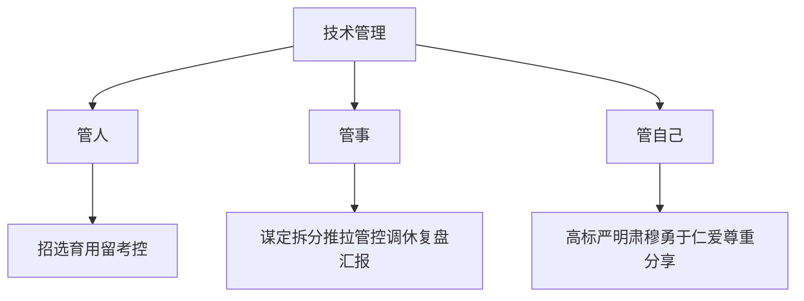

---

## 一、管人：团队管理七字诀

### 1.1 招 - 招聘计划

#### 前期准备
- 明确招聘计划
- 确定岗位职责
- 定义任职资格
- 建立胜任力模型

#### 招募渠道

| 渠道类型 | 特点 | 适用场景 | 成本 |
|---------|------|---------|------|
| **外部推荐** | 同事、朋友、同业交流会 | 各类职位 | 极低 |
| **内部推荐** | 员工推荐熟人 | 减少试用期验证成本 | 低 |
| **网络招聘** | BOSS直聘、拉勾网 | 中低端职位 | 中等 |
| **猎头渠道** | 专业猎头服务 | 高端职位 | 高 |

**最佳实践**：
- 通过同业交流会提升个人影响力，吸引人才慕名而来
- 内部推荐可减少试用期（从3个月缩短到半个月或1个月）
- 网络招聘比较耗时，需要额外成本

---

### 1.2 选 - 面试技巧

#### 数字化面试漏斗

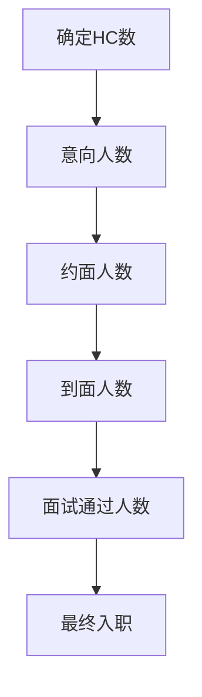

#### 面试流程标准

**时间控制**：30分钟以内

**标准流程**：
1. 开场致谢，自我介绍
2. 请候选人做介绍
3. 详细提问（专业知识、素质能力、求职动机）
4. 结束面谈，询问候选人疑问
5. 介绍后续安排，再次感谢

#### 不同轮次的面试侧重点

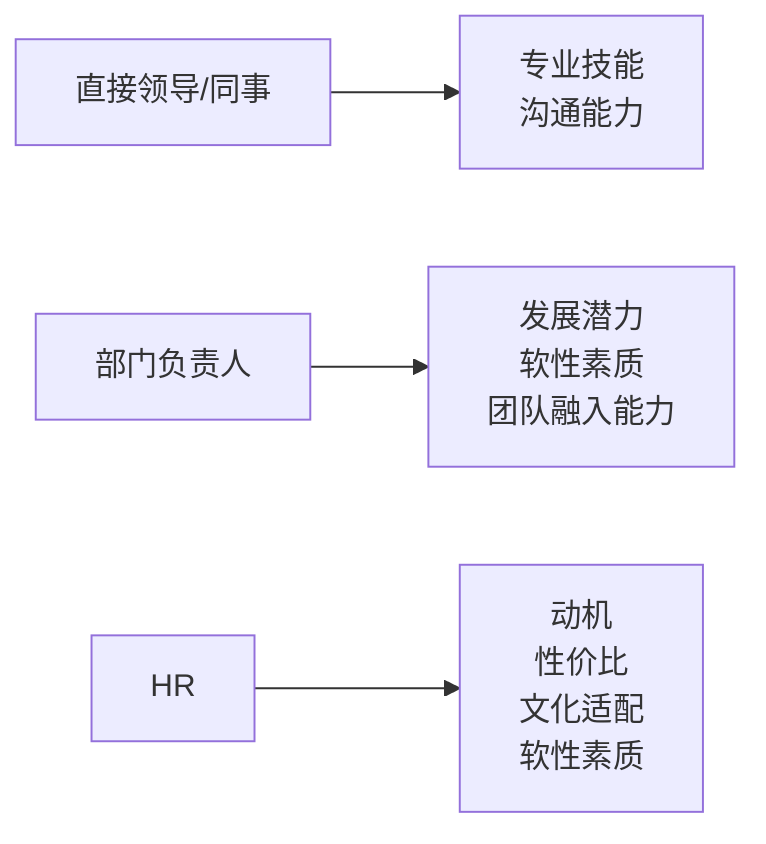

#### 面试提问四大维度

##### 1. 问知识点
- 思考岗位必须了解的知识和技能
- 区分不同水平层次的标志
- 问问题并追问细节

**示例**：
- "简单说一下JVM内存管理机制"
- "在哪个项目里用到了Redis？为什么要用？"
- "用了哪一种方法？为什么选择这种方法？"
- "和其他方法的利弊是什么？"
- "编码过程中是否遇到了问题？怎么解决？"

##### 2. 问工作习惯和方法
- 思考希望岗位人员用何种方式工作
- 问问题并追问细节

**示例**：
- "接到一个新项目需求后，你会怎么开展工作？请说说你的工作步骤"
- "你有什么比较好的工作方法可以分享？"
- "团队测试同事会给你怎样的反馈？"
- "团队是否有绩效排名？你的名次如何？"
- "你是怎么管控代码质量的？"
- "刚才结束的项目中有什么方面是你觉得遗憾没有做好的？"

##### 3. 问分析和解决问题的方法
- 思考需要这个岗位解决哪些问题
- 看看过往是怎么做的

**示例**：
- "你遇到最困难最严重的bug是什么？"
- "当时情况是怎么样的？如何分析的？"
- "后来采取了什么措施？为什么采取这种措施？"
- "最后结果怎样？后来这样的bug还发生过吗？"
- "如果现在接到一个需求，需要根据用户所在地不同推送不同的新品，你会怎么做？步骤是什么？"

##### 4. 判断工作状态是否匹配
- 考察候选人与团队文化的适配度

**示例**：
- "你先后经历的这几个公司，最享受的是哪家公司的工作？为什么？"
- "之前工作压力和强度大吗？当时是怎样的情况？"
- "你最不喜欢工作中出现哪些情况？"
- "你之前遇到过产品需求反复变化吗？怎么看？"

#### 面试原则

**要做到**：
- ✅ 面试是平等双向的选择
- ✅ 面试官尽量少说话（占比20%）
- ✅ 让应聘者多说
- ✅ 有针对性、逻辑性地提问
- ✅ 询问案例和具体细节

**禁忌事项**：
- ❌ 不要和面试者吵起来
- ❌ 面试官说得太多
- ❌ 想到哪问到哪，蜻蜓点水
- ❌ 以偏概全，先入为主
- ❌ 过度美化公司工作情况
- ❌ 面试中表达强烈认可
- ❌ 不同面试官反复问同样问题

---

### 1.3 育 - 培养人才

#### 培养四步法

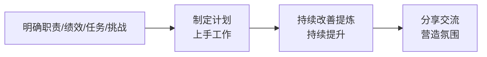

#### 管理者的教练作用

- **提供反馈**：定期做one-on-one（1对1沟通）
- **时间控制**：15-20分钟
- **提供指导性意见**

---

### 1.4 用 - 知人善任

#### 用人原则

> **用人不疑，疑人不用**

- ✅ 让合适的人做合适的事
- ✅ 用人所长，不求全责备
- ✅ 及时调整不合适的人选

#### 因人而异的用人策略

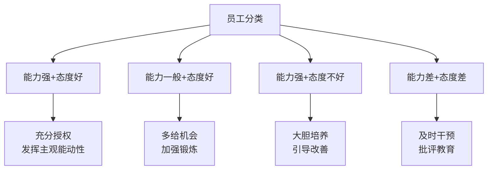

---

### 1.5 留 - 留住人才

#### 留人策略

##### 1. 薪资激励（最直接有效）
- 高薪是对人才的认可和肯定
- 永远是留人的最佳途径

##### 2. 文化氛围
**酒文化管理**（个人风格）：
- 管理风格亲民，与团队打成一片
- 任正非：搞管理就应该经常聚餐
- 通过聚餐帮助员工成长、提升收益

**喝酒看人品**（题外话）：
- 喝醉后一直说话：生活压抑，心中苦闷，不自信
- 喝醉后会哭：受到不公平待遇或委屈，表面坚强内心柔软
- 喝醉后喜欢笑：性格开朗，心态好，没有烦心事
- 喝醉后直接睡觉：成熟理智，自控力强，最省心

##### 3. 技术委员会与职级体系
- 成立技术委员会
- 建立职级晋升通道（如T4、T5、T6、T7等）
- 每半年或一年做一次述职答辩评审
- 类似游戏升级，给员工成就感

**各大公司职级体系**：
- 阿里系：P7、P8、P9、P10
- 滴滴：D开头
- 百度：T6、T7、T8

##### 4. 公正原则
> **管理做不到公平，但一定要做到公正**

- 一碗水端平
- 避免"干得多得到少"的不公平待遇

##### 5. 个人魅力
- 90后、95后不在乎权力
- 需要用个人魅力吸引和留住人才

---

### 1.6 考 - 绩效考核

#### 考核方式对比

| 考核方式 | 适用对象 | 特点 |
|---------|---------|------|
| **OKR** | 中高层管理者 | 目标与关键结果，字节跳动做得好 |
| **KPI** | 基层员工 | 关键绩效指标，可控性强 |

#### 管理者考核维度

##### 1. 团队建设能力（30%）
- 适合业务发展需要
- 有前瞻性
- 梯队化人才培养计划
- 发现团队不稳定因素，及时应对
- HC不能缺编，必须招满

##### 2. 业务拓展（40%）
- 每季度按时完成工作计划
- 合理利用资源
- 保证项目正常上线
- 没有重大线上事故

##### 3. 跨部门协作能力（30%）
- 及时与各部门协作沟通
- 主动解决和推进问题
- 大公司尤其重要（跨BU、跨业务线、跨事业部）

#### 工程师考核维度

##### 1. 技术能力（25%）
- 独立完成项目交付
- 独立解决技术问题

##### 2. 工作效率（25%）
- 按期上线，无延期

##### 3. 质量把控（25%）
- 交付质量高
- 没有重大bug
- 代码测试通过率高

##### 4. 工作量（25%）
- 工作量是否远高于或远低于团队平均水平

##### 5. 工作态度（附加项）
- 遵守工作制度
- 不迟到违规
- 职业道德：诚信、客观公正、严格要求自己

#### 考核周期
- 日报：项目日报
- 周报：部门周报
- 月度：考核
- 季度：述职
- 年度：Review

---

### 1.7 控 - 管控团队

#### 管控手段

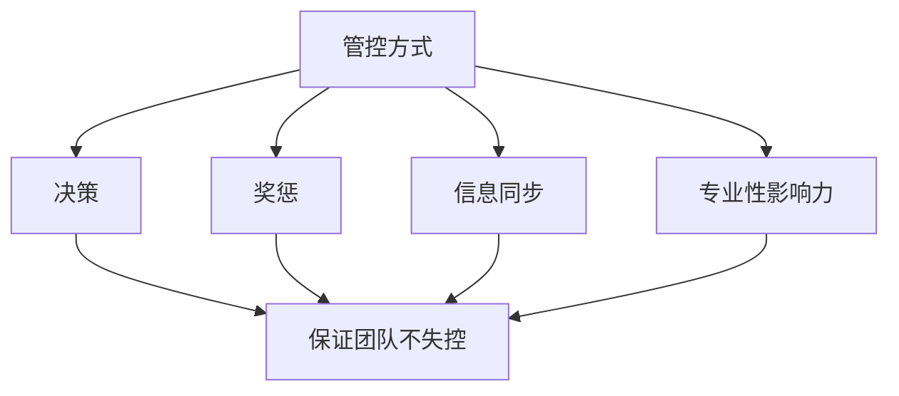

**核心理念**：
- 保证团队不失控
- 通过决策、奖惩、信息同步来管理
- 通过自身影响力和专业性吸引追随者

**注意**：
- 自驱型员工是少数
- 大部分员工需要一定的管控手段
- 不能以偏概全

---

## 二、管事：业务管理七步法

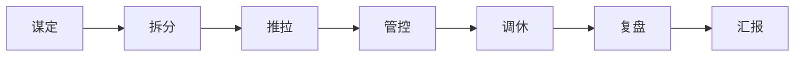

### 2.1 谋定 - 战略规划

#### 目标三段论（傅盛）
- **目标**：公司战略方向
- **资源**：可用资源
- **路径**：实现方式

#### 示例：电商增长战略

**目标**：全年获客100万

**战略**：增长

**手段**：
- 裂变
- 拼团
- 助力砍价

**执行**：
- 产品：做产品规划，产品路线图
- 技术：配合产品完成所有产品上线
- 运营：通过数据分析验证，迭代不同版本

---

### 2.2 拆分 - 任务分解

#### WBS工作分解法

**原则**：
- 将目标逐步细化分解
- 最底层任务必须指向具体个人
- 每个任务原则上分解到不能再分解为止

#### 项目分解示例

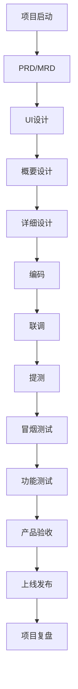

**工具**：Microsoft Project

**包含要素**：
- 里程碑时间点
- 责任人
- 详细任务分解

#### 敏捷 vs 瀑布

| 模式 | 适用场景 | 特点 |
|-----|---------|------|
| **瀑布模式** | 需求稳定 | 串行执行，变化频繁时不适用 |
| **敏捷模式** | 需求频繁变化 | VUCA时代，拥抱变化 |

**VUCA时代**：Volatility（易变性）、Uncertainty（不确定性）、Complexity（复杂性）、Ambiguity（模糊性）

---

### 2.3 推拉 - 双向驱动

#### 推力（制度驱动）
- 通过绩效考核促使团队完成目标
- 通过奖惩机制推动执行

#### 拉力（文化驱动）
- 通过团队文化、凝聚力、士气
- 自动自发、积极主动朝目标前进

#### 《亮剑》管理启示

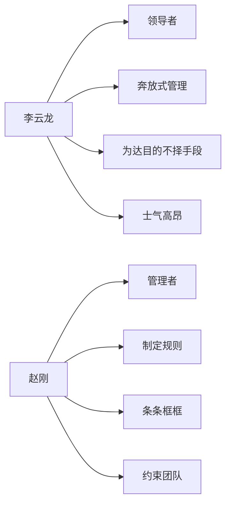

**平衡之道**：
- 小公司/初创公司：可以相对奔放
- 大公司（几百人以上）：需要完善的制度、流程、规范

---

### 2.4 管控 - 过程管理

#### 管控工具

| 工具 | 频率 | 目的 |
|-----|------|------|
| **日报** | 每日 | 项目进度跟踪 |
| **周报** | 每周 | 部门工作总结 |
| **月报** | 每月 | 月度考核 |
| **季报** | 每季度 | 述职答辩 |
| **年报** | 每年 | 年度Review |

**核心理念**：
> 结果是管不出来的，结果只是水到渠成。过程是通过管控管出来的。

---

### 2.5 调休 - 目标修正

#### VUCA时代的应对

**原则**：拥抱变化

**做法**：
- 业务目标调整时，团队目标计划同步调整
- 不能按照旧目标继续执行
- 及时修正方向

---

### 2.6 复盘 - 持续改进

#### 复盘时机
- 项目完成后
- 产品上线后
- 出现事故后

#### 复盘两个维度

##### 1. 认知层面
- 对思考问题和解决问题的方法有哪些心得？

##### 2. 实践层面
- 如果再遇到类似问题，该如何解决？
- 从项目中得到哪些收获？
- 项目运行过程中碰到的问题及改进措施
- 对后期项目的期望

#### 灵魂拷问法（5 Why分析）

**示例**：线上事故分析

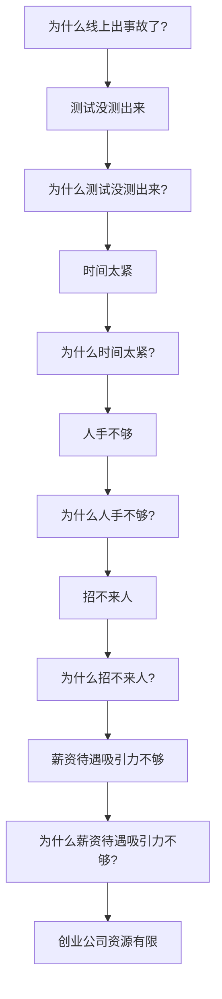

**注意**：
- 复盘不是追责
- 目的是找出问题根本原因
- 避免类似问题再次发生

---

### 2.7 汇报 - 及时反馈

#### 汇报原则

**适用对象**：
- 管理者（经理、总监）
- 一线工程师

**核心要点**：
- ✅ 及时汇报，及时反馈
- ✅ 有利于得到上级帮助和指导
- ✅ 让工作进行得更加顺畅
- ✅ 避免出现差错

**反面案例**：
- ❌ 上线前才说问题解决不了（失职）
- ❌ 遇到不可协调或不可控因素不及时汇报

**汇报方式**：
- 日报/周报体现风险点
- 周一例会或部门例会汇报
- 及时寻求领导帮助

**启示**：
- 有些事情你解决不了，但领导一句话就能解决
- 不要憋着，及时沟通
- 类比程序员：不要死磕，很多都有现成的解决方案

---

## 三、管自己：自我管理七要素

### 3.1 高标 - 持续提升标准

- 持续调高自己的工作标准要求
- 逐步向下属提出更高期望
- 谨慎地对下属的工作表示认可

**注意**：
- 不要太频繁表扬下属
- 表扬太频繁会失去意义
- 表扬应该是一种"惊喜"

---

### 3.2 严明 - 建立标准

- 持续建立标准化流程
- 标准必须公布，不能私下制定
- 透明化管理

---

### 3.3 肃穆 - 保持威严

- 工作中尽量少开玩笑
- 严谨地表扬下属
- 作为管理者要有一定威严
- 不能太随和，避免"高高在上"和"过于随意"的两个极端

---

### 3.4 勇于 - 勇于担当

#### 四个"勇于"

##### 1. 勇于接受挑战
- 敢于接受新项目、新业务
- 示例：没做过直播，用两周时间搞上线

##### 2. 勇于承担责任
- 出现事故不要让下属一个人扛
- 主要责任在管理者
- 可能是没有说清楚，或流程机制有问题

##### 3. 敢于说No
- 不要什么都接
- 业务评审时要合理评估
- 结合当前系统实现情况
- 有些东西不可实现要明确拒绝

##### 4. 敢于开除
- 不合适的人及时淘汰
- 对团队和个人都是好事
- 让他去擅长的领域发挥
- 示例：C语言工程师在Java团队，经过1个季度仍无法胜任，应该让其回到擅长领域

---

### 3.5 仁爱 - 保持正能量

- 保证正能量
- 经常分享鸡汤、樊登读书会名言
- 做良性的导师
- 管理风格偏向教练型
- 不亲力亲为，分配给相关责任人

---

### 3.6 尊重 - 尊重下属

#### 尊重的表现

##### 1. 表扬与认可
- 适度表扬，不过度

##### 2. 倾听与征询
- 参与研发决策
- 向下属求助（术业有专攻）

**《楚汉传奇》韩信的启示**：
- 韩信被封为大将军，下属不服
- 韩信："我是领将的，不是带兵的"
- "我领你们几个就OK了，你们来分配"
- 韩信学兵法，但不是纸上谈兵（vs 赵括）
- 被封为国士无双

##### 3. 分配任务而非指令
- 不是命令式管理
- 而是任务分配式管理

##### 4. 不要越级指挥
- 除非特别紧急情况
- 否则会架空中层管理者
- 是对下属的基本尊重

##### 5. 不要把下属当仆人
- 不能让下属买饭等私事
- 偶尔可以，但不能成为常态

---

### 3.7 分享 - 资源共享

#### 分享的类型

##### 1. 信息分享
- 第一手信息及时同步给团队
- 管理者掌握第一手信息（如CEO直接给的信息）

##### 2. 资源分享
- 示例：运维团队需要第三方支持、服务器、网络设备
- 新人找不到资源时，介绍资源给他们

##### 3. 工作经验分享
- 分享自己的管理经验
- 如何带人、如何与业务沟通
- 如何跨部门沟通
- 如何打造团队战斗力

##### 4. 成果分享
- 成功的分享

##### 5. 金钱分享
- 示例：年终奖加薪包
- Team有20万加薪包，100人团队
- 不能自己留19万，分1万出去
- 要合理分配金钱

---

## 四、不同角色的管理策略

### 4.1 不同能力和态度的员工

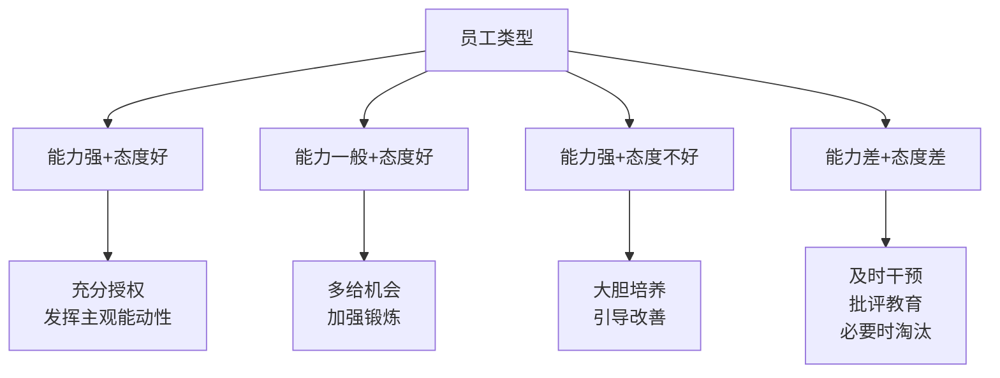

---

### 4.2 职级差异

| 职级 | 层级 | 管理职责 | 考虑维度 |
|-----|------|---------|---------|
| **经理** | 基层管理 | 直接带兵（如10个工程师） | 完成既定指标和目标（如项目上线） |
| **总监** | 中层管理 | 管理大团队（多个经理） | 考虑业务发展，团队建设，业务拓展 |
| **CTO** | 高层管理 | 管理多个总监 | 整个公司技术战略方向，帮助业务成功 |

---

## 五、团队文化建设实践

### 5.1 分享文化

#### 技术分享日
- **频率**：每周固定时间
- **参与者**：各个team，T6以上（T5、T4也可以）
- **形式**：内部交流

#### 外部专家分享
- 邀请各大公司好友
- 首席架构师
- 知名技术大牛来公司分享

---

### 5.2 激励文化

#### 季度之星
- **团队规模**：80人
- **评选标准**：本季度做出非常优秀的贡献
- **奖励**：奖杯 + 奖状 + 大会表彰 + 聚餐
- **作用**：
  - 给员工成就感
  - 作为年终奖参考（2个月 vs 3个月 vs 4个月）
  - 绩效相同时的加分项

---

### 5.3 聚餐文化

#### 聚餐频率
- 项目上线后聚餐
- 每月至少一次团队聚餐

#### 聚餐目的
- 加深印象
- 避免脱离群众
- 不要高高在上
- 与大家打成一片
- 收集真实反馈

**任正非**："搞管理就应该经常聚餐"

---

### 5.4 倾听文化

#### One-on-One（1对1）
- **频率**：每两周一次
- **时长**：30分钟到1小时
- **对象**：直接下属（如4-5个经理）
- **方式**：主要倾听，让下属说
- **目的**：
  - 了解团队现状
  - 收集对公司的看法
  - 了解团队文化

**管理路径**：
- 最有效管理路径：6个直接下属
- 最多不超过10个
- 不管带1000人还是10000人，原理相同

---

## 六、《亮剑》中的管理智慧

### 6.1 李云龙的用人之道

#### 唯才是用
- 不管出身
- 不惜代价
- 只要有才就用

#### 用人案例

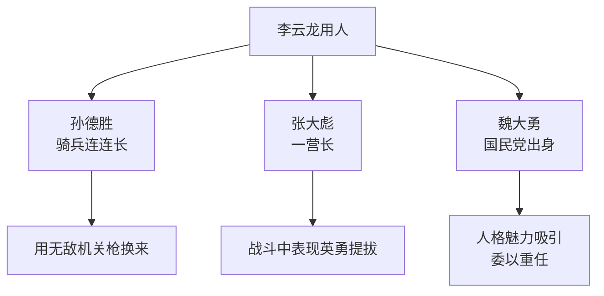

#### 启示
- 为才是用
- 不管身份背景
- 用人格魅力吸引人才

---

## 七、管理总结

### 7.1 核心理念

> **团队管理的本质是责权利的统一**

**古语**：
- 责清则有人思辨，事有始终
- 权放则可以执行，以减内耗
- 利明则动力充盈且可长久矣

**解释**：
- **责清**：责任明确，有人负责，事情有始有终
- **权放**：权力下放，可以高效执行，减少内耗
- **利明**：利益明确，动力充沛，可以长久

**比喻**：
> 竹生四年，破土一寸，而后跃于葱翠百里

---

### 7.2 管理三件事总结

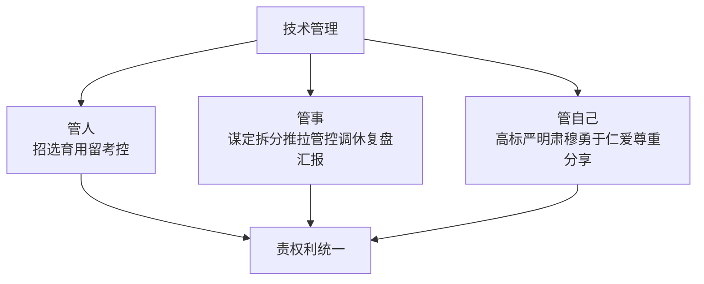

---

## 八、Q&A精选

### Q1: 如何管理90后？
**A**: 
- 责权利要分清晰
- 90后、95后不在乎权力
- 需要用个人魅力吸引
- "干得不爽就撤"的心态
- 更需要公正和尊重

---

### Q2: 推拉不太理解？
**A**: 
- **推**：通过制度流程、绩效、奖惩推动团队完成目标
- **拉**：通过团队文化、凝聚力、士气，使其自动自发朝目标前进
- 两种方式都是为了完成目标

---

### Q3: 经理、总监、CTO有什么本质区别？
**A**: 

| 职级 | 层级 | 职责 | 考虑维度 |
|-----|------|------|---------|
| 经理 | 基层管理 | 直接带兵出业绩 | 完成既定指标和目标 |
| 总监 | 中层管理 | 管理大团队 | 业务发展、团队建设、业务拓展 |
| CTO | 高层管理 | 管理多个总监 | 公司技术战略方向、帮助业务成功 |

**简化理解**：
- 经理：代表打仗
- 总监：在业务层面思考
- CTO：搭建整个公司的架构

---

### Q4: 跟了自己多年的兄弟，不思进取，是否要淘汰？
**A**: 
- **最好不要淘汰**
- 当年给你打下江山的兄弟
- 可以给他另外一个职位
- 做人要厚道，不能过河拆桥
- 京东刘强东的做法：当年摆地摊的兄弟，虽然能力不强，但分了几千万，给一个采购职位
- 不要寒了兄弟的心
- 讲义气（东北人风格）

---

### Q5: 对于表现不好或绩效不好的员工怎么处理？
**A**: 
#### PIP（绩效改进计划）
- 连续两个季度绩效60分以下或60-70分
- 达到淘汰标准线
- 给他做改进计划，提供正确指导
- 不能让他自生自灭

#### 改进措施
- 针对问题设定下一季度考核标准
  - 工作态度不积极
  - 经常出bug
  - 联调不配合
- 通过日常表现、团队配合逐渐改进
- 如果还不能达到预期目标，可以考虑开除

**注意**：开除不是随便开除，要有依据和过程

---

### Q6: 团队如何面对谎言？
**A**: 
#### 常见场景
- 产品上线后出现bug
- Leader觉得bug不大，没有汇报
- 相当于说了谎，但影响不大
- Bug被内部消化了

#### 处理原则
- **不看出错或说谎，看个人贡献值和团队贡献值**
- 做得越多，出问题越多
- 啥也不做的人不出错，可能还得到嘉奖（不合理）
- 积极承担工作的人难免出现问题

#### 考核方式
- 工作量考核（排期、Project详细列表）
- 工作量不会骗人
- 酌情处理，凭感觉和直觉
- 一定要公正
- 不能因为出点事故就开除

---

## 九、个人建议

### 9.1 持续学习
- 不断学习管理书籍
- 管理书籍不一定适合每个人或每个公司
- 根据自己公司特点和个人风格调整

---

### 9.2 知行合一
- 管理有100多年历史
- 很多管理方式不用造轮子，可以直接用
- 关键是如何知行合一
- 知道是一回事，实践是另一回事

---

### 9.3 个人IP时代
- 抖音、快手等UGC时代
- 个人IP时代、网红时代、KOL时代
- 内容制作、个人影响力越来越重要
- 未来可能公司都没有了，全是独立工作室或个人
- 35岁以后，很多公司歧视
- 要培养正职工作之外的额外爱好

---

### 9.4 技术体系和管理体系
- 一定要形成自己的技术体系和管理体系
- 大公司管理不一定好
- 小公司/创业公司相对自由
- 人性化管理
- 基本管理方式和体系要形成

---

### 9.5 大局观
- 作为总监、CTO级别
- 不要太care细节
- 一定要大局掌控

---

## 十、联系方式

**公众号**：IT令狐冲

**可提供资料**：
- 绩效考核资料
- 技术委员会资料
- 项目管理资料
- 各职级绩效考核标准（总监、经理、工程师）

---

## 附录：管理金句

1. "对敌人看见的都是朋友和师长"
2. "管理的核心是搭班子、定战略、带队伍" —— 柳传志
3. "管理做不到公平，但一定要做到公正"
4. "结果是管不出来的，结果只是水到渠成。过程是通过管控管出来的"
5. "团队管理的本质是责权利的统一"
6. "竹生四年，破土一寸，而后跃于葱翠百里"
7. "搞管理就应该经常聚餐" —— 任正非
8. "我是领将的，不是带兵的" —— 韩信
9. "做人要厚道，不能过河拆桥"
10. "术业有专攻"

---

**文档整理说明**：
- 本文档根据音频ASR文字识别记录整理
- 部分识别错误已根据上下文纠正
- 保留了分享者的个人风格和案例
- 适用于SRE、运维及稳定性保障工程师参考

---

**版本信息**：
- 整理日期：2025年
- 文档版本：v1.0
- 分享主题：技术管理者如何搭班子带队伍
