# 技术管理如何善用镜子和尺子

> 来源：未核验 · 类型：分享 · 状态：draft

## 分享概述

本次分享邀请了两位来自不同行业的技术管理专家，围绕技术转管理的核心问题展开深度讨论，为技术人员在管理转型路上提供实践指导。

### 嘉宾介绍

**魏亚东** - 工商银行软件研发三中心三级经理
- 2009年入行，资深架构师
- 曾任杭州研发部数据库专家牵头人
- 7年技术管控和安全管控经验
- 专注于业务价值的高质量交付

**左新宇** - vivo互联网存储运维总监
- 2018年加入vivo
- 负责数据库团队运维管理工作
- 主导数据库产品的可靠性保障、架构优化、资源运营

---

## 一、个人层面：技术与管理的权衡

### 1.1 如何在不丢掉技术的同时提升管理能力

#### 核心观点

**魏亚东的"三点提升法"**

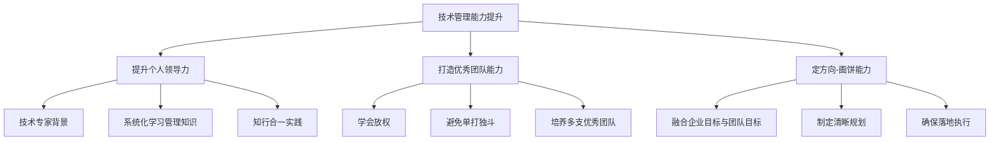

**1. 培养个人能力，提升领导力**
- 从技术团队带领中积累领导经验
- 通过领导力培训和阅读建立知识体系
- 将直觉式管理转化为方法论驱动

**2. 具备持续打造优秀团队的能力**
- 学会放权，不能依赖个人单打独斗
- 运用博弈论中的纳什均衡思想
- 在技术追求与现实容忍度间找到平衡
- 目标：没有你在，团队依然优秀

**3. 学会定方向（画饼）**
- 融合企业战略蓝图与团队目标
- 制定清晰可落地的规划
- 确保"吹过的牛"都能实现

#### 左新宇的补充观点

**角色转变的本质**
- 个人成功 → 团队成功
- 个人KPI → 团队KPI
- 必须依赖团队成员达成目标

**前提条件：真正的意愿**
- 确认自己愿意承担管理责任
- 愿意分配时间和精力到管理工作
- 不是因为年龄和资历被迫转型

**成长路径**
1. 学习非技术类管理课程
2. 在实践中获得真知
3. 沉淀适合自己的管理方法论

---

### 1.2 技术的广度与深度如何把控

#### 两种技术管理者路线

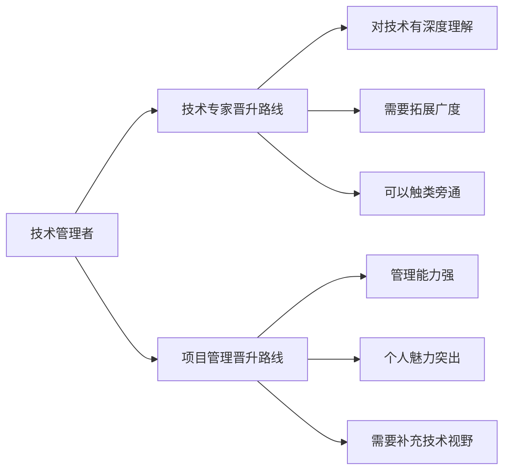

#### 技术能力要求

**广度优先原则**（两位嘉宾一致观点）

**技术专家路线**
- 了解各种架构的适用范围、优缺点、常见问题
- 不需要深入研究源码细节
- 利用已有技术深度触类旁通

**管理者路线**
- 增强技术视野和敏感度
- 掌握技术适用范围和优缺点
- 覆盖所负责的完整业务线

**深度应用场景**
- 解决典型故障和复杂案例
- 交给资深工程师负责
- 作为团队成员成长机会

#### 左新宇的实践观点

> "广度解决技术架构能力，深度解决典型故障和复杂案例。技术管理者需要在广度上扩大涉猎范围，为业务技术评审提供正确方向。"

---

### 1.3 需要具备的管理思维及典型误区

#### 四大管理思维维度

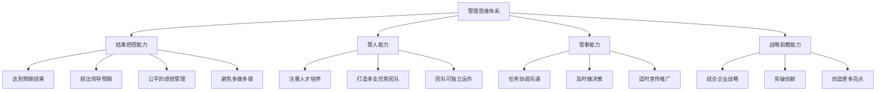

#### 1. 结果把控能力（最优先）

**目标**
- 确保任务完美达到预期结果
- 达到或超出上层领导心理预期
- 做好员工特质和绩效管理

**避免多做多错问题**
- 使用四象限法则排定优先级（重要紧急/重要不紧急/不重要紧急/不重要不紧急）
- 与领导沟通确认优先级
- 合理时间内达到优质结果
- 前提：团队成员能力需达标

#### 2. 管人能力：注重人才培养

**核心理念**
- 打造多支优秀团队
- 不依赖个人存在的团队优秀度
- 教练式辅导方法

#### 3. 管事能力：协调沟通与宣传

**关键点**
- 做好任务协调、沟通、决策
- 在适当时机做好宣传

> **重要提醒**：酒香也怕巷子深。不做宣传，无人知道你的工作成果，这是技术管理者的最大误区。

#### 4. 战略前瞻性

- 结合企业战略
- 有所突破和创新
- 提供更多亮点

---

#### 典型误区及应对

**误区1：角色认知不清**

**问题表现**
- 转管理后仍然冲到一线
- 抢走团队成员的成长机会

**正确做法**（左新宇）
- 时刻关注角色变化
- 目标是管好团队和业绩
- 一定要忍住手，给团队成员机会

**误区2：只看结果不管过程**

**问题表现**
- 定完目标只等结果
- 忽视过程管理

**正确做法**
- 过程管理更加重要
- 持续关注团队成员的问题、痛点、难点
- 借助自己的力量帮助解决问题
- 帮助团队成员成长

**误区3：下属不服技术能力**

**魏亚东的三步应对法**
1. 坦诚承认：每个人都有专长领域
2. 绩效面谈：探讨共赢方案
3. 任务分解：发挥其专长完成任务
4. 最后手段：如果无法解决，可以考虑调整人员

---

### 1.4 产品思维与商业思维的提升

#### 核心认知

> **魏亚东**："没有业务依托的技术实际上是无效的。不会带来业务价值的技术，即便再烧钱，最后也会被时代淘汰。"

#### 产品思维的应用

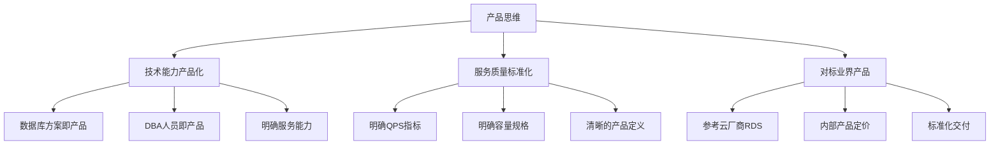

#### 左新宇的实践案例

**将DBA能力产品化**
- 参考阿里云RDS产品形态
- 明确提供的QPS和容量
- 清晰的产品定义和定价
- 业务方购买后知道能获得什么服务

#### 商业思维的培养

**魏亚东的方法**

1. **平衡资源投入与价值产出**
   - 价值产出 ≥ 资源投入 ✓ 继续投入
   - 价值产出 < 资源投入 ✗ 应该裁撤或缩小

2. **学习商业模式课程**
   - 参加专业培训（如商业模式画布）
   - 了解业界趋势
   - 研究客户需求

3. **关注技术趋势**
   - 跟踪Gartner等权威机构报告
   - 了解组装式应用、数据编织、安全等新趋势
   - 用科技赋能业务发展

4. **跨领域联动**
   - 与产品经理、总行业务部门共同探讨
   - 从科技趋势层面提供建议
   - 实现ToG、ToB、ToC三端联动生态

#### 商业化路径

**左新宇的建议**
- 内部产品孵化成熟后
- 满足业界需求
- 可以转化为ToB产品对外售卖

---

## 二、团队层面：管理的"内外兼修"

### 2.1 交付速度与质量的衡量

#### 魏亚东：DevOps时代的质量管理

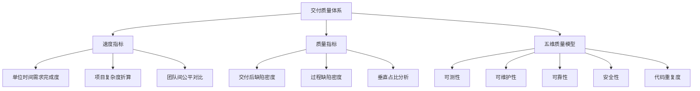

**交付速度衡量**

基础指标：单位时间内需求/项目完成度

**风险与公平性考量**
- 新系统建设 vs 需求修补的复杂度差异
- 引入折算比例：大项目折算成多少小需求
- 确保团队间公平对比

**质量指标体系**

1. **基础指标**
   - 交付后缺陷密度（垂直占比较高）
   - 过程缺陷密度

2. **五维质量评价模型**（魏亚东专利）
   - 可测性
   - 可维护性
   - 可靠性
   - 安全性
   - 代码重复度

**技术实现**
- 使用SonarQube、PMD、BetBox等工具
- 通过合适模型处理数据
- 使用RNN学习模型调优参数
- 实现应用横向对比和趋势分析

#### 左新宇：质量优先的实践

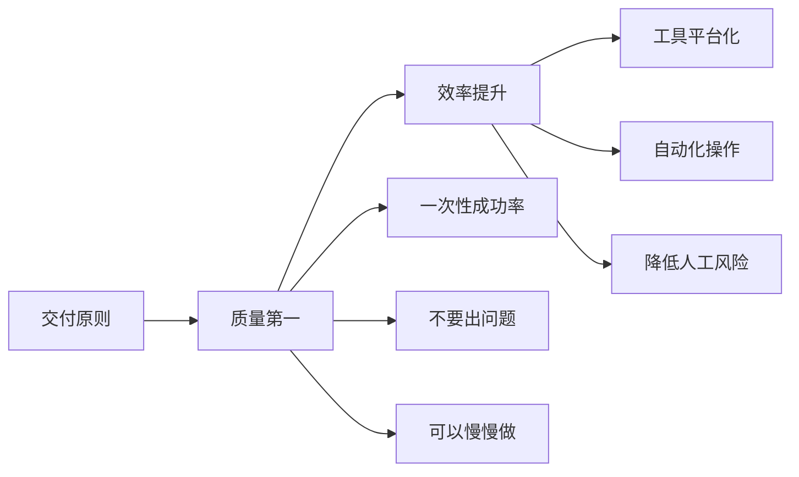

**核心理念**
> "交付效率的提升，建立在交付质量良好的前提下。"

**数据库运维特点**
- 对线上业务稳定性影响极大
- 质量要求：不要出问题，可以慢慢做
- 关键指标：**一次性成功率**

**效率提升方法**
- 通过工具和平台提升效率
- 避免依赖人工熟练度
- 减少线上操作风险

#### 创业公司的平衡之道

**挑战**
- 现金流压力
- 快速迭代需求
- 质量债务累积

**左新宇的建议**
- 理解快速迭代的必要性
- 但必须适时拉回平衡线
- 否则技术债务会越积越多
- 最终不得不停下业务进行重构
- 技术管理者需要把握介入时机

**魏亚东的观点**
- 速度与质量不是对立关系
- 采用敏捷开发Scrum方法
- 先完成最小需求集（Working Skeleton）
- 通过迭代满足上线需求
- 快速拿到投资
- 不应刻意制造对立

---

### 2.2 考核与奖惩机制的制定

#### 严格与宽松的平衡

**魏亚东：博弈论中的平衡**

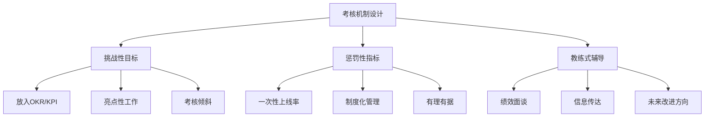

**奖励机制**
- 挑战性、亮点性工作纳入考核
- 完成后给予倾斜
- 设定明确的上限和下限

**惩罚机制**
- 如一次性上线率等质量指标
- 制度化管理，心知肚明
- 有理有据，不挫伤积极性

**沟通机制**
- 教练式辅导
- 绩效面谈
- 信息有效传达

#### 左新宇：重奖励轻处罚

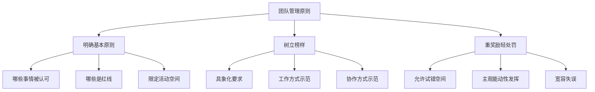

**基本原则**
- 明确哪些事情被认可
- 明确哪些是红线不能触碰
- 限定活动空间的上限和下限

**榜样力量**
- 树立1-2个榜样
- 具象化工作要求
- 示范如何工作、交互、协作

**宽容文化**
- 技术方案考虑不成熟时给予更多空间
- 允许试错
- 鼓励主观能动性

#### 共识：小团队从严是误区

**两位嘉宾一致观点**
- 无论大小团队都需要红线准则
- 都需要在合理范围内活动
- 小团队太严人会流失，团队无法存续
- 关键是合理合法、让团队开心、有成就感

---

### 2.3 应对"程序员35岁危机"

#### 本质分析

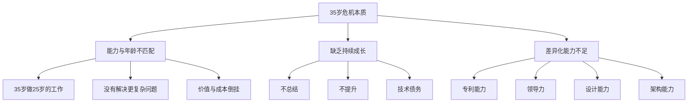

#### 左新宇的深刻洞察

> "什么时间点都有危机。只要自己不成长，20岁也有危机，25岁也有危机。"

**高速收费站案例启示**
- 40岁收费站撤销，员工找不到工作
- 危机出现时间取决于外部变化
- 但根源是自身能力没有随年龄增长

**正确的年龄价值观**
- 35岁、40岁应该具备更强的能力
- 应该具备更强的差异化能力
- 应该能解决更复杂的问题
- 不辜负年龄增长

**团队实践**
- 团队有35岁以上成员
- 根据特长和诉求安排工作
- 分配更有挑战性的工作
- 让他们发挥独特优势

#### 魏亚东：持续卷，让自己更独特

**能力差异化方向**
- 专利数量多
- 领导力强
- 设计能力强
- 架构能力强

**危机的真正原因**
- 年龄大但只做应做的事
- 从不总结
- 缺乏危机意识
- 没有持续学习

**应对策略**
1. 持续完善和改善自己的能力
2. 让自己更加独特
3. 持续学习和总结
4. 建立个人核心竞争力

#### 就业市场建议

**针对"高不成低不就"的困境**

**魏亚东的三点建议**
1. **大厂出身**：接受降薪，享受轻松生活
2. **小厂出身**：技术能力过硬才是王道
3. **预期调整**：匹配能力与预期

**左新宇的实践建议**
- 了解当前就业形势
- 找几个猎头深入沟通
- 了解市场需要什么能力
- 对比自己差在哪里
- 有针对性地提升

---

### 2.4 高效的跨团队/跨职能协作

#### 魏亚东：四个方面的协作策略

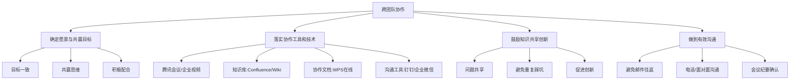

**1. 确定愿景与共赢目标**
- 让跨团队目标一致
- 共赢情况下才会积极配合
- 建立协作基础

**2. 落实协作工具和技术**

工具体系：
- **视频会议**：腾讯会议、企业视频系统
- **知识库**：Confluence、Wiki、SharePoint
- **协作文档**：在线WPS、Google Docs
- **即时通讯**：钉钉、企业微信、内部系统

**3. 鼓励知识共享与创新**
- 团队间分享遇到的问题
- 避免重复踩坑
- 促进创新

**4. 有效沟通原则**

> **重要提醒**：邮件往返6-7轮还没说清楚问题时，直接电话或面对面沟通！

正确的沟通流程：
1. 直接电话或面对面沟通
2. 快速达成共识
3. 写会议纪要确认
4. 发给相关方确认落实

**沟通本质**
- 不是为了沟通而沟通
- 是为了达成共赢目的
- 减轻时间成本

#### 左新宇：寻找共同点与高维思考

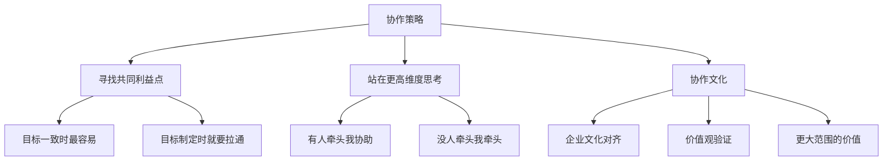

**共同利益点**
- 目标一致时最容易达成共识
- 如果目标不一致，问题往往在制定目标时没有拉通
- 需要在年初OKR制定时就做好协调

**高维思考**
- 站在更高维度思考问题
- 采用"有人牵头我协助，没人牵头我牵头"的思维
- 主动推动协作

**企业文化对齐**
- 遇事不决时，用企业文化判断
- 验证是否符合公司价值观
- 评估能给更大范围带来什么帮助
- 达成一致后更好推动协作

**工具依赖**
- 团队越大对协作工具依赖越重
- 多城市分布式团队尤其需要
- 视频会议、在线文档等必不可少

---

## 三、问答精选

### Q1: 下面的人不服你的技术能力，怎么破局？

**魏亚东的三步法**

1. **坦诚承认**
   - 不是每个人都是某一方向的专家
   - 承认自己在其他方面有优点

2. **绩效面谈**
   - 明确双方期望
   - 探讨共赢方案
   - 确认目标合理性

3. **任务分解**
   - 分解到具体的人
   - 让其发挥专长完成任务
   - 只要把事情做好就没问题

4. **最后手段**
   - 如果以上都解决不了
   - 这个人可以考虑更换

### Q2: 如何确定工作优先级？有什么工具或规则？

**左新宇的OKR管理法**

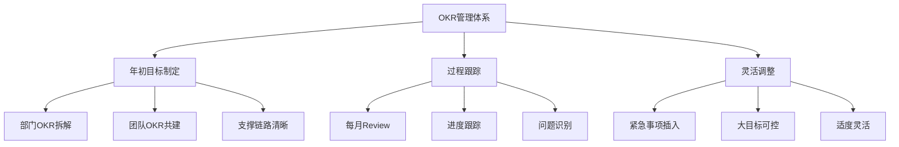

**年初规划**
- 从部门年度OKR拆解
- 团队共建自己的OKR
- 明确如何支撑部门和公司战略
- 链路清晰，轻重分明

**过程管理**
- 每月做一次进度跟踪
- 识别风险和问题
- 及时介入帮助

**灵活调整**
- 临时紧急事项可插入
- 前提是大目标基本可控
- 选择性调整

**魏亚东的补充**
- 遵照年初规划达成总目标
- 根据领导层级判断优先级（大领导、中级领导、小领导）
- 运用四象限法则处理

### Q3: 团队是否需要写日报/周报？

**两位嘉宾的一致做法：轻量化**

**左新宇**
- 个人不喜欢写日报
- 知识工作者不是流水线工作
- 有些工作3-5天才有结果
- 日报会影响工作感受
- **采用**：周报（不用于考核）+ 每月one-by-one沟通

**魏亚东**
- 没有日报、周报
- 只有月报（基层管理者汇报）
- **过程管理**：
  - 通过计划跟踪任务
  - 每周开周例会
  - 传达上层思路
  - 分享难点和解决方案
- **亮点汇报**：
  - 在合适时机汇报成果
  - 跨月项目完成时及时汇报
  - 让领导了解工作价值

### Q4: 如何降低团队人员流失率？

**左新宇的两点核心**

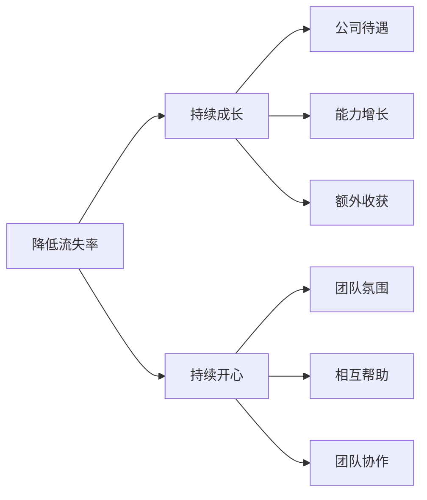

**1. 让团队成员持续成长**
- 公司待遇符合能力水平
- 快速吸收业务和技术
- 带来能力的增长
- 获得额外收获

**2. 让团队成员持续开心**
- 建立和谐的工作环境
- 相互帮助的团队精神
- 强大的团队协作能力
- 让每个人干得舒服

**魏亚东的补充**
- 银行相比互联网流动性小
- 钱可能少但满足感高
- 业务成就感是精神激励
- 团队开心、个人成就感和满足感是关键
- 有钱当然最好

### Q5: 如何避免事无巨细，又保证团队执行力？

**魏亚东：结果导向+阶段管控**

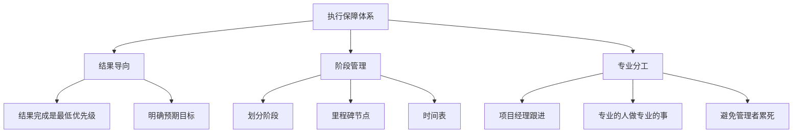

**原则**
- 结果导向是基础
- 事无巨细太累，精力无法承受

**方法**
1. 明确结果预期
2. 将过程划分阶段
3. 设置里程碑和时间表
4. 让项目经理跟进管理
5. 专业的人做专业的事

**左新宇：OKR + 月度Review**
- 年初制定个人OKR
- 包含阅读计划
- 每月做一次进度跟踪
- 了解进展、问题、风险
- 及时介入提供帮助

### Q6: 领导力和管理是什么关系？

**魏亚东的观点**
- 领导力是管理必须具备的品质
- 领导力决定个人魅力
- 本质是自身能力的提升
- 通过感动和感化别人来带动团队
- 有些人天生具有领导气质
- 管理是利用方法论把团队管起来
- **关系**：包含关系，不是对立关系

**左新宇的理解**
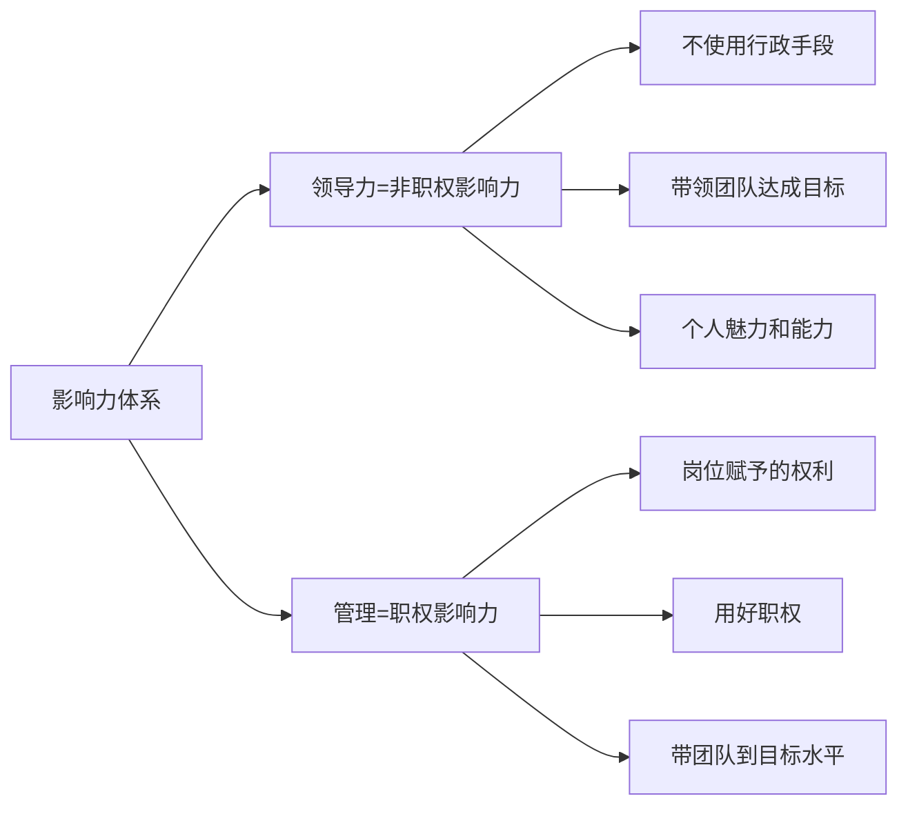

- **领导力** = 非职权影响力
  - 不使用行政手段
  - 凭个人魅力和能力
  - 带领团队达成业务目标

- **管理** = 职权影响力
  - 岗位赋予的权利
  - 如何用好这个权利
  - 把团队带到某个水平

### Q7: 作为基层人员，如何向上管理？

**魏亚东的"四做"原则**

1. **做好工作，展示亮点**
2. **做好备份，保护自己**
3. **做好总结，改善自己**
4. **积极学习，提升自己**

**左新宇的观点**
- 不需要刻意做这件事
- 技术管理者都有火眼金睛
- 能看到你的工作和亮点
- 不需要特别关注PPT包装
- 专注把工作做好即可

---

## 四、核心要点总结

### 技术与管理的平衡之道

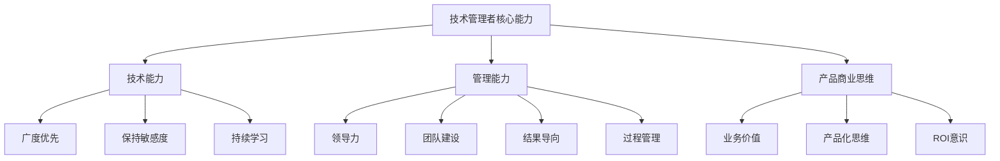

### 团队管理的黄金法则

1. **从个人成功到团队成功**
2. **质量优先，效率其次**
3. **重奖励，轻处罚，允许试错**
4. **持续成长，持续开心**
5. **有人牵头我协助，没人牵头我牵头**

### 避免的典型误区

- ❌ 不放权，冲到一线抢机会
- ❌ 只看结果，不管过程
- ❌ 只沟通不宣传
- ❌ 35岁还做25岁的工作
- ❌ 为了沟通而沟通

### 技术管理者的"镜子"与"尺子"

**镜子**：认清自身现状
- 技术能力的广度与深度
- 管理思维的完整性
- 产品商业意识的成熟度
- 团队建设的有效性

**尺子**：把控管理的度
- 严格与宽松的平衡
- 放权与管控的平衡
- 速度与质量的平衡
- 技术与业务的平衡

---

## 五、实践建议

### 对于即将转管理的技术人员

1. **确认意愿**：真正愿意承担管理责任
2. **系统学习**：参加管理培训，建立知识体系
3. **保持技术广度**：不需要深度钻研，但要保持视野
4. **培养软技能**：沟通、协调、决策能力
5. **建立方法论**：在实践中总结自己的管理方法

### 对于已经在管理岗位的人员

1. **定期自检**：用"镜子"审视自己的能力短板
2. **持续学习**：管理和技术都要学习
3. **培养团队**：让团队可以独立运作
4. **适时宣传**：让工作成果被看见
5. **保持平衡**：在各种矛盾中找到平衡点

### 对于技术团队成员

1. **持续成长**：不要让年龄成为危机
2. **建立特色**：打造差异化竞争力
3. **善于总结**：将经验转化为能力
4. **积极沟通**：与管理者保持良好沟通
5. **拥抱变化**：适应技术和业务的变化

---

## 结语

技术管理不是技术与管理的二选一，而是两者的有机结合。优秀的技术管理者需要：

- 用**镜子**时刻审视自己的技术能力、管理水平、产品思维和商业意识
- 用**尺子**把控好严格与宽松、速度与质量、放权与管控、技术与业务的平衡
- 从个人成功走向团队成功
- 从技术深度走向业务广度
- 从执行层面走向战略层面

记住：**没有业务依托的技术是无效的，没有技术支撑的管理是无力的。**

---

**分享嘉宾**
- 魏亚东 - 工商银行软件研发三中心三级经理
- 左新宇 - vivo互联网存储运维总监

**整理日期**：2024年

*本文档根据DBA Plus社群技术分享直播内容整理而成*

