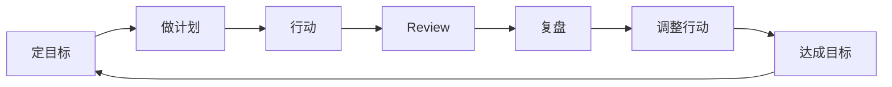

# 技术管理者如何提升团队及自身的效率和产能

> 来源：未核验 · 类型：分享 · 状态：draft

## 分享概述

## 一、管理者的核心职责

### 1.1 管理者的基本要求

> **核心观点**: 对管理者最基本的要求是对目标的承诺

管理者的职责分为三个层面：

- **对上（老板）**: 完成给定的业务目标或项目目标
- **对同事**: 为队友赋能
- **对下属**: 帮助解决问题、成长提升、搭舞台唱戏

### 1.2 岗位价值体现

管理者并不是拥有多大的权力，而是对多大目标的承诺：

- **CEO**: 对业务总体目标的承诺
- **CTO**: 对产研项目、产品系统交付的承诺
- **总监/经理**: 对交付质量、技术体系建设、组织能力建设的承诺
- **员工**: 对自己负责系统的稳定性、迭代、效率、质量的承诺

## 二、目标实现的方法论

### 2.1 计划管理的重要性

**核心观点**: 计划管理是一切管理的基础

目标实现的关键要素：

- 老板的支持
- 清晰的目标
- 下属给力
- 行动清晰
- 监督到位

### 2.2 计划管理流程

### 2.3 基础管理的三大支柱

#### 2.3.1 计划管理

- **解决问题**: 目标明确、任务合理分解、达成目标
- **适用场景**: 关注效率的非绩效部门（如研发团队）

#### 2.3.2 流程管理

- **解决问题**: 流程清晰、岗位清晰、人人有事做、事事有人做
- **核心要素**: 确定分工、设置岗位（产品、研发、测试、运维）

#### 2.3.3 组织管理

- **解决问题**: 权责清晰
- **核心原则**: 负责的人必须有权，有权的人必须负责

## 三、计划管理的五要素（TWWWH）

### 3.1 五要素详解

| 要素 | 英文   | 中文   | 关键要点                         |
| ---- | ------ | ------ | -------------------------------- |
| T    | Target | 目标   | 必须承接战略和部门职责           |
| W    | Why    | 为什么 | 管理者最容易忽略的沟通点         |
| W    | When   | 时间   | 尽量拆细力度，明确动作           |
| W    | Who    | 责任人 | 非常明确，做成了奖励，没做成负责 |
| H    | How    | 怎么做 | 行动计划制定，最重要讨论内容     |

### 3.2 五要素实施要点

#### Target（目标）

- 必须承接战略和部门职责
- 技术团队职责：高效、高质量、低成本、安全地交付

#### Why（为什么）

- 管理者最容易忽略的沟通点
- 需要让团队成员认同目标，避免执行阻力
- 解决"屁股决定脑袋"的问题

#### When（时间）

- 尽量拆细力度，明确动作
- 老板对完成计划的信心指数与时间拆解细致程度成正比

#### Who（责任人）

- 非常明确的责任人
- 做成了要奖励，没做成要负责

#### How（怎么做）

- **最重要讨论内容**
- 重点讨论行动计划制定
- 识别潜在困难和解决方案
- 配合定期执行、校验和行动计划更新

## 四、计划管理的两大特点

### 4.1 目标不合理性

**核心观点**: 不要花太多时间精准讨论目标

- 制定有挑战的目标（OKR式目标）
- 达成概率50%的目标是最合适的
- 体现专业手感，而非精确计算
- 避免持续降低目标到有把握的程度

### 4.2 行动计划合理性

**核心观点**: 行动计划必须合理

- 花最多时间讨论行动计划
- 资源匹配要合理
- 不能是不切实际的计划

## 五、复盘管理

### 5.1 错误复盘方式

- 重点说数据（订单增长、效能提升等）
- 找原因解释（推脱责任）

### 5.2 正确复盘方式

- 重点讨论后续行动计划
- 潜在风险解决方案
- 行动变更
- 做对了什么要继续做
- 做错了什么要停止
- 有迭代空间的要优化

## 六、技术团队管理实践

### 6.1 技术团队职责

- 高效、高质量、低成本、安全地交付系统
- 注重过程，注重效率
- 计划管理非常适合研发团队管理

### 6.2 管理实践案例

#### 案例1：效能提升项目

- **目标**: 交付吞吐量提升20%，线上bug降低
- **方法**: 找出主要矛盾（需求评审、项目设计、研发、联调、上线）
- **实施**: 重点抓主要矛盾环节

#### 案例2：容器化项目

- **目标**: Q2测试环境容器化全覆盖
- **拆解**: 200个集群，第一个月覆盖80个
- **管理**: 月为单位review，发现问题及时调整行动计划

## 七、管理者的核心能力

### 7.1 上传下达

- **向上**: 反馈问题，协调资源
- **向下**: 传递目标和战略
- **避免**: 欺上瞒下

### 7.2 人才培养

- 帮助下属成长和提升
- 帮助下属解决问题
- 帮助下属搭舞台唱戏
- 培养接班人

### 7.3 战略思维培养

- 具备外部视角
- 站在老板角度思考问题
- 随着级别提升，参加更多业务会议
- 学习优秀管理者的决策方式

## 八、常见管理问题解答

### 8.1 需求变更管理

- 让变化有代价
- 第一次变化：同意
- 第二次变化：需要双方leader同意
- 第三次变化：需要两级审批

### 8.2 资源不足问题

- 抓主要矛盾
- 列出所有项目，选择最重要的3个
- 避免"人永远不够"的陷阱

### 8.3 团队扩张管理

- 信息同步、目标一致
- 信息透传，增强归属感
- 避免把下属当资源使用

### 8.4 越级管理问题

- 培养接班人，提升下属能力
- 建设培训体系和接班人体系
- 避免事必躬亲

## 九、总结

### 9.1 核心要点回顾

1. **管理者基本要求**: 对目标的承诺
2. **计划管理**: 一切管理的基础
3. **五要素**: TWWWH（目标、为什么、时间、责任人、怎么做）
4. **两大特点**: 目标不合理性、行动计划合理性
5. **重点讨论**: 怎么做（行动计划）

### 9.2 成功管理的关键

- 养成做计划的习惯
- 重点讨论行动计划
- 定期review和复盘
- 培养团队能力
- 保持信息透明

### 9.3 管理者的价值体现

- 能够承诺多大的目标，岗位就有多大的价值
- 通过团队产出来拿结果
- 帮助团队成员成功

---

**注**: 本文档基于技术分享音频转录内容整理，旨在为SRE、运维及稳定性保障工程师提供技术管理实践指导。

