# B站应用降本增效与容量运营治理

> 来源：未核验 · 类型：分享 · 状态：draft · 原始线索：分享人 张赫

## 分享概述

**分享人**: 张赫（哔哩哔哩技术架构部）
**受众**: SRE、运维及稳定性保障工程师
**核心主题**: 容量管理、降本增效、弹性伸缩、容量运营
**关键词**: VPA、HPA、资源池核实、配额管理、容量可视化

## 一、背景介绍

### 1.1 分享人背景

- **加入时间**: 2020年加入B站
- **工作经历**:
  - 主站、直播、OGV、推广搜索相关SRE工作
  - 深度参与B站跨年晚会、拜年祭等活动保障
  - 混沌工程、流量管理建设
- **当前工作**: 推广搜索稳定性建设、PaaS治理

### 1.2 分享内容结构

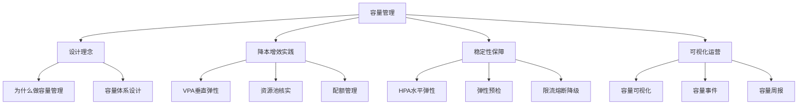

## 二、为什么要做容量管理

### 2.1 核心痛点

#### 2.1.1 资源水位不透明

**问题描述**:

- 基于Kubernetes云原生PaaS环境
- 集群、资源池、Node水位无法感知
- 是否需要采购资源难以判断
- 资源风险无法提前预警

#### 2.1.2 容量变化难追溯

**问题场景**:

- 发版迭代时发现资源突然不够
- 容量变化原因追溯困难
- 变更来源多且复杂

#### 2.1.3 业务稳定性挑战

**挑战点**:

- B站活动多、流量突发频繁
- HPA覆盖率低
- 业务稳定性难保障

#### 2.1.4 降本增效压力

**现状问题**:

- 资源使用率低
- 资源碎片化严重
- 无法充分利用

#### 2.1.5 资源分散管理

**问题描述**:

- 物理资源散列到各部门
- 直播有独立资源池
- 电商有独立资源池
- 平台统一协调能力弱

#### 2.1.6 治理目标不明确

**挑战**:

- 无法找到资源占用大头（二八原则）
- 20%业务占用80%资源
- 难以推动重点治理

### 2.2 不同角色关注点

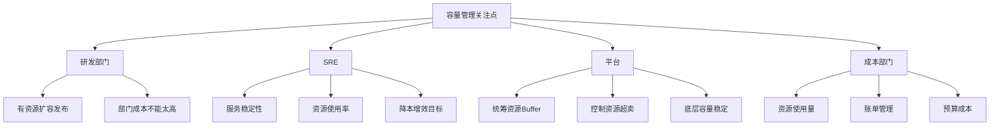

### 2.3 容量管理挑战

#### 2.3.1 内部因素复杂

**影响因素**:

- 代码变更
- 配置变更
- 压测活动
- 多活切量
- 定时任务
- 缓存过期

#### 2.3.2 场景复杂

**场景类型**:

- 大型活动（跨年晚会、拜年祭）
- 运营推广
- 热门事件（如佩洛西事件）
- 热点话题

#### 2.3.3 链路复杂

**链路特点**:

- 东西向流量
- 南北向流量
- 链路长
- 上游服务、下游服务
- 中间件瓶颈

**风险**:

- 人工应急可能打垮下游
- 容易引发二次故障

## 三、容量管理体系设计

### 3.1 整体架构

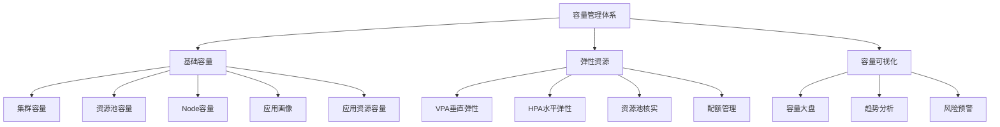

### 3.2 分层设计

#### 3.2.1 基础容量层

**平台和SRE关注**:

- 集群容量
- 资源池容量
- Node容量
- 应用画像数据

**业务关注**:

- 应用资源容量
- 发版资源需求

#### 3.2.2 弹性资源层

**核心能力**:

- VPA（垂直弹性）
- HPA（水平弹性）
- 资源池核实
- 配额管理

#### 3.2.3 可视化层

**功能**:

- 帮助业务和平台可视化资源数据
- 资源管理决策支持

## 四、降本增效实践

### 4.1 通用降本手段

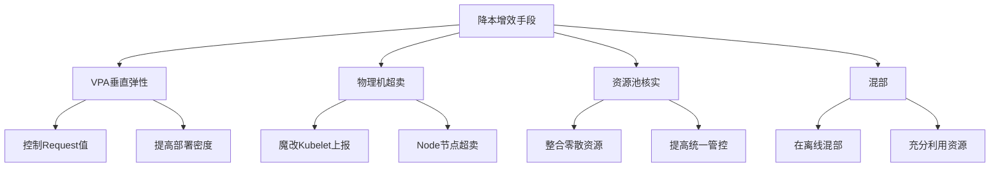

### 4.2 VPA（垂直弹性伸缩）

#### 4.2.1 核心问题

**Kubernetes资源概念**:

- **Request（软限）**: 调度依据
- **Limit（硬限）**: 资源上限
- **真实CPU使用量**: 实际消耗

**问题现状**:

- Request/Limit由业务拍脑袋设置
- 基于经验设置，往往不合理
- 导致分配率高但使用率低

**典型场景**:

- 分配率：90%
- 使用率：10%
- 资源充足但无法扩容

#### 4.2.2 VPA设计思路

**核心理念**:

> 研发不用关注Request，只关注需要多少资源（Limit）

**动态调整逻辑**:

- 基于应用真实CPU使用量
- 基于应用画像（服务等级、是否多活）
- 动态分配Request值

**收益**:

- 提高服务部署密度
- 提升资源池使用率

#### 4.2.3 VPA架构

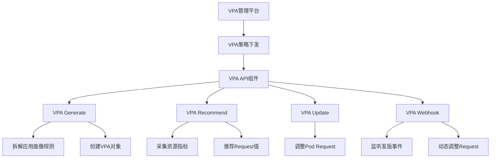

**组件说明**:

1. **VPA API组件**:

   - 中间代理
   - 实现VPA Generate的增删改查
   - 汇总可观测数据
2. **VPA Generate**:

   - 拆解应用画像规则
   - 例如：L0多活规则拆解为多个VPA对象
3. **VPA Recommend**:

   - 从监控系统采集应用资源指标
   - 推荐合适的Request调整值
4. **VPA Update**:

   - 调整Pod的Request资源
5. **VPA Webhook**:

   - 监听服务发版事件
   - 动态调整Pod Request

#### 4.2.4 VPA管理设计

**策略管理**:

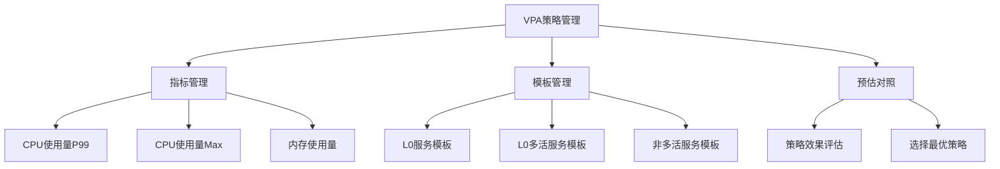

**数据运营**:

- VPA覆盖大盘
- 执行记录（调整前后对比）
- 异常识别（调整后问题）

**策略避障**:

- 黑名单机制
- 活动期间避免调整
- 压测期间避免调整
- 新功能上线避免调整

**策略预警**:

- 基于失败率预警
- 基于覆盖率预警
- 基于勇于度预警

#### 4.2.5 降级应用场景

**大型活动场景**:

- 分配率很高时
- 降级非核心服务（L2/L3）
- 降低Request值
- 为核心服务腾出资源

### 4.3 资源池核实与配额管理

#### 4.3.1 资源池核实背景

**问题场景**:

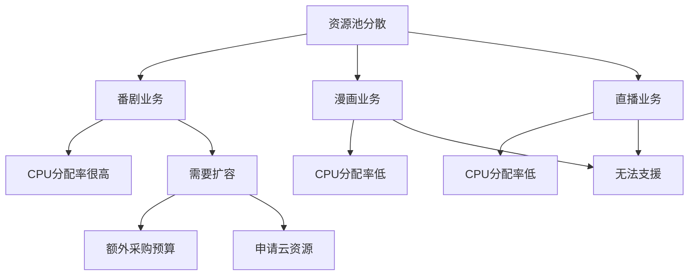

**核心问题**:

- 业务独立资源池
- 资源无法互相支援
- 采购周期长
- 资源利用率低

#### 4.3.2 核实设计思路

**核心理念**:

> 业务不关注底层物理资源，只关注逻辑配额

**架构转变**:

- 物理资源池核实
- 业务使用逻辑配额
- 平台统一管控底层资源

**收益**:

- 平台统一管控能力提升
- 资源灵活调度
- 降低采购成本

#### 4.3.3 核实前提条件

**标准化工作**:

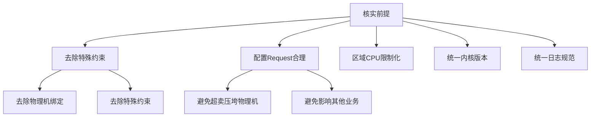

**注意事项**:

- 不同资源池历史配置不同
- 内核版本需统一
- 避免配置不合理导致物理机压力过大

#### 4.3.4 平台支撑

**配额管理**:

- 基于组织的逻辑配额
- 配额管控
- VPA覆盖

**老板支持**:

- 核实是自上而下推动
- 需要跨部门协同合作

#### 4.3.5 配额管理实现

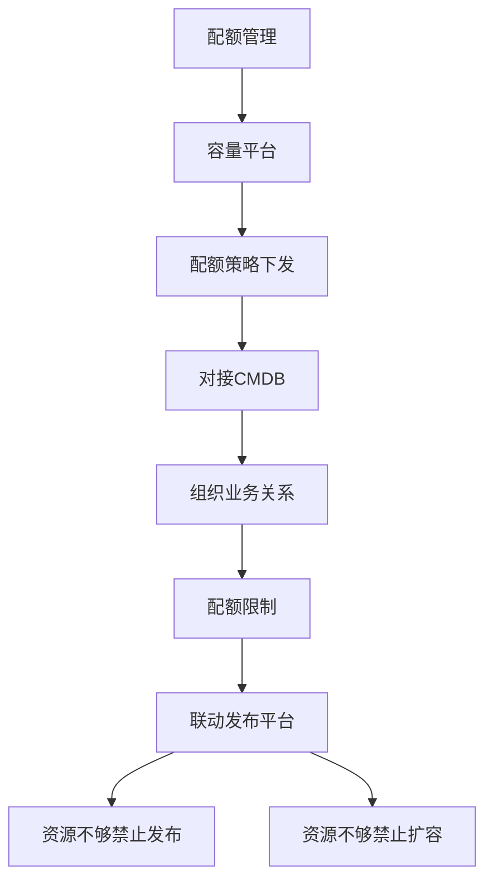

**实施效果**:

- 不同组织配额分配
- 用超自动限制
- 发布平台联动

#### 4.3.6 核实收益

**平台收益**:

- **2022H1**: 在线业务物理机零新增
- **S12活动**: 零采购
- 统一管控能力大幅提升
- 大型活动快速支撑（1-2小时 vs 1.5个月）
- PaaS整体使用率大幅提升

**业务收益**:

**小业务**:

- 原来资源池小，宕机影响大
- 核实后资源池大，服务分散
- 宕机影响降低

**所有业务**:

- 容量需求快速满足
- 资源紧张时临时蓝绿
- HPA超卖能力

## 五、容量管理与稳定性

### 5.1 在线业务特征

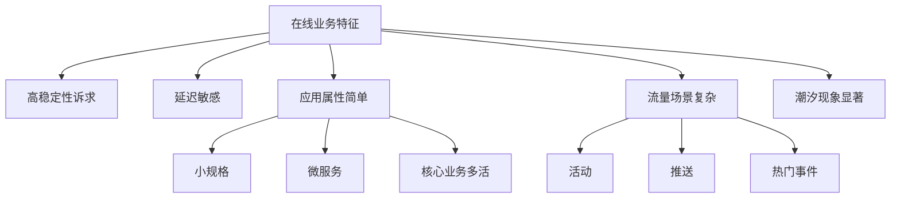

### 5.2 HPA（水平弹性伸缩）

#### 5.2.1 HPA设计理念

**与VPA类似的设计**:

- 策略管理
- 指标管理（CPU、内存、QPS）
- 模板管理（基于应用画像）

**策略示例**:

- L0多活服务：CPU 30%触发扩容
- 非多活服务：阈值更高

#### 5.2.2 HPA面临的问题

**核心问题**:

> 配了HPA不等于没问题

**潜在风险**:

- 下游服务承受能力
- 技术组件瓶颈（数据库连接池）
- 可能导致下游雪崩

#### 5.2.3 弹性预检

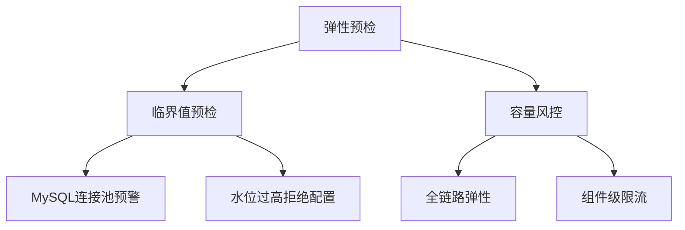

**MySQL连接池预检**:

- 扩容可能导致连接池水位高
- 预检提示风险
- 拒绝配置

**解决方案**:

- HPA预检
- 全链路弹性
- 超预期流量组件级限流

#### 5.2.4 HPA可观测

**可观测能力**:

- 异常记录
- 覆盖率统计
- L0服务覆盖率
- 弹性质量评估

**预警机制**:

- 扩缩容失败预警
- HPA失效预警
- 扩缩容事件通知

#### 5.2.5 HPA可视化

**平台管控**:

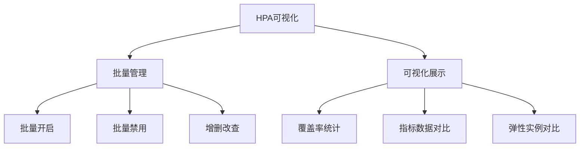

**批量管理场景**:

- 大型活动保障
- 稳态容量压测
- 关闭HPA后压测
- 看稳态承载量
- 最后一轮全开HPA

**弹性实例对比**:

- 当前实例数
- HPA应该弹到的实例数
- 受Max值限制的实例数
- 无限制时能弹到的实例数

**价值**: 判断HPA配置合理性

### 5.3 中间件瓶颈分析

#### 5.3.1 中间件风险评估

**评估结果**:

| 中间件类型      | 风险等级     | 原因                 |
| --------------- | ------------ | -------------------- |
| 消息队列        | 低           | 多活支持             |
| TiDB            | 低           | 集中式Proxy          |
| 泰山KV          | 低           | 集中式Proxy          |
| Redis/Memcache  | 低           | 连接数支持大         |
| **MySQL** | **高** | **连接池瓶颈** |

**MySQL风险**:

- 连接池限制
- 扩容容易打满连接池
- 可能导致故障

#### 5.3.2 解决方案

**整体思路**:

- HPA预检（MySQL连接池预警）
- 全链路弹性
- 超预期流量组件级限流

### 5.4 容量巡检

#### 5.4.1 不同角色关注点

**业务关注**:

- 应用维度使用率
- 有风险的应用列表
- 配额使用率
- 调度实例数

**平台关注**:

- 资源池分配率
- 可调度实例数
- 峰值使用率
- 单点资源池
- VPA调整失败率
- 冗余度

#### 5.4.2 风险区间大盘

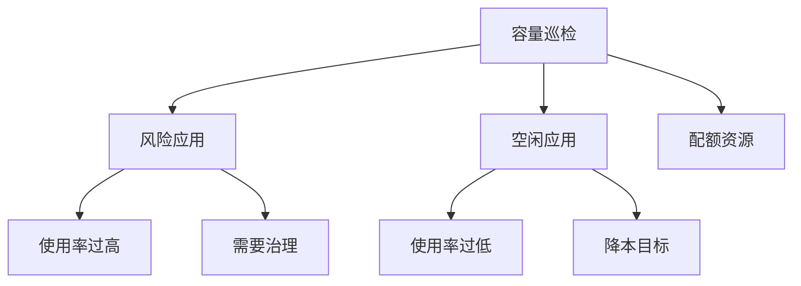

### 5.5 限流熔断降级

#### 5.5.1 流量突发应对

**背景**:

- 流量突发难以预期（如佩洛西事件）
- 仅靠弹性不够
- 需要基础组件保障

#### 5.5.2 限流策略

**限流类型**:

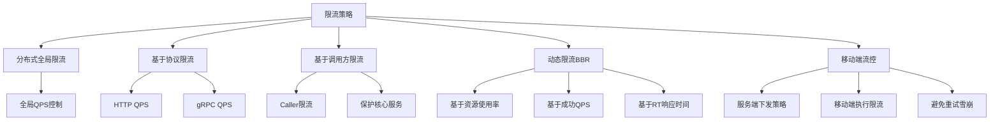

**Caller限流场景**:

- 账号服务被多业务调用
- 某业务流量突发
- 避免影响整个账号体系

#### 5.5.3 熔断策略

**熔断机制**:

- 基于滑动窗口
- 计算成功/失败率
- 熔断后执行降级操作

#### 5.5.4 降级策略

**降级类型**:

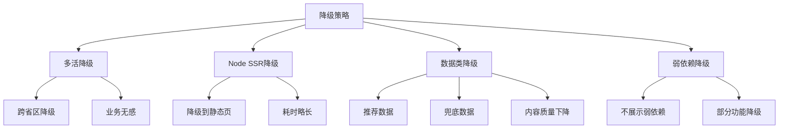

## 六、容量可视化与运营

### 6.1 基础容量可视化

#### 6.1.1 关注维度

**核心数据**:

- 集群容量
- 资源池容量
- Node容量
- 应用容量

**可视化能力**:

- 变化趋势图
- 数据保存2年+
- 比监控存储时间更长
- 数据点更分散

#### 6.1.2 各层级关注点

**资源池**:

- 容量水位
- 超卖率控制

**Node**:

- 资源水位
- 超卖率
- 热点识别
- 二次调度（热点服务迁移）

**应用**:

- 资源使用量
- 使用率
- 实例数
- 单实例容器数
- 容器数变化（Sidecar增加）

### 6.2 组织业务容量

#### 6.2.1 业务痛点

**核心问题**:

- 如何快速找到资源占用大头
- 优先治理哪些业务
- 哪些业务使用率低
- 成本突增原因
- 治理效果评估
- 哪些业务治理不达预期

#### 6.2.2 组织容量设计

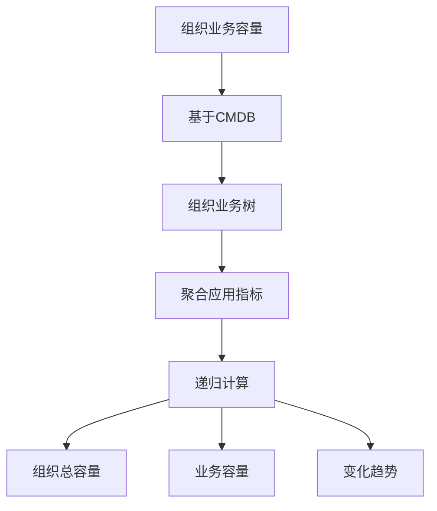

**示例**:

- 总容量：10000核
- 直播业务：占用XX核
  - 直播房间：XX核
  - 直播营收（礼物、抽奖）：XX核

**可视化效果**:

- 资源大头一目了然
- 红点标识使用率
- 变化趋势图
- 数据一键下载

### 6.3 容量事件

#### 6.3.1 容量变化追溯问题

**问题场景**:

- 资源突然变少
- 突然不能发版
- 资源突然变空

**追溯困难**:

- 需要翻多个平台
- 发布平台（扩缩容）
- HPA触发
- 管理平台临时加机器

#### 6.3.2 容量事件设计

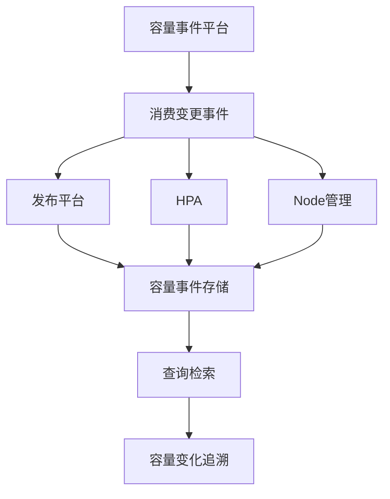

**功能**:

- 消费各平台变更事件
- 统一存储
- 快速定位容量变化
- 业务自助查询

**收益**:

- 业务不需要找SRE
- 快速找到变化原因
- 降低处理成本

### 6.4 容量周报

#### 6.4.1 部门周报

**关注内容**:

- 整体资源用量
- 与上周对比
- 使用率变化
- 风险应用列表
- 容量变化应用
- 新增服务
- 扩缩容应用

**价值**: 降本增效效果感知

#### 6.4.2 内部周报（SRE&平台）

**关注内容**:

- 各部门资源占用量
- 使用率排名
- 降本重点部门
- 排名靠前：治理好
- 排名靠后：治理差

**价值**: 推动重点治理

## 七、Q&A精选

### 7.1 弹性伸缩策略

**问题**: 容量云平台有哪些弹性伸缩策略？

**回答**:

1. **VPA**: 业务不用关心缩容，自动降本
2. **HPA**: 保证稳定性，应对流量突发
3. **弹性上云**: IDC资源不足时使用云资源补充

### 7.2 容量事件监控

**问题**: 容量事件是只要容量有变更就会监控吗？

**回答**:

- 会产生容量变更的平台发送变更事件到消息队列
- 容量平台服务消费变更事件
- 存储到底层数据库
- 提供查询、检索、聚合能力
- 快速定位容量变化根源

### 7.3 容量推荐

**问题**: 容量推荐如何实现？

**回答**:

- 通过VPA实现Request动态推荐
- 魔改Kubernetes源码
- 调整Request不触发Pod重启
- Limit由业务设置（关联账单）
- 峰值使用率50%+
- 平均使用率45%+

### 7.4 HPA Max值评估

**问题**: HPA的Max值怎么评估？

**回答**:

**L0多活服务**:

- 要求扛双倍流量（单机房故障）
- 基于双倍量留Buffer
- 计算合适的扩容实例数

**非多活服务**:

- 承载峰值量的2-3倍
- 基于容量系数计算

### 7.5 容量度量指标

**问题**: 容量度量除了CPU还有哪些？

**回答**:

- **CPU和内存**: 主要关注（账单体系基础）
- **磁盘**: 推广搜索相关（词表、索引文件）
- **GPU**: GPU类型机器

### 7.6 HPA实现方式

**问题**: HPA是自研还是开源？

**回答**:

- 使用开源HPA
- 没有过多二次开发
- 自研部分：
  - 弹性预检
  - 联动发布平台
  - 批量禁用启用管理

### 7.7 容量增长应对

**问题**: 容量增长好几倍，HPA效率不足如何处理？

**回答**:

**HPA局限性**:

- 扩容慢（扩容+启动接近1分钟）
- 不适合秒杀场景

**解决方案**:

1. **弹性预测**:

   - 结合历史容量数据
   - 预测流量增长
   - 提前扩容
2. **Cron HPA**:

   - 分时调度
   - 预期流量提前扩容
   - 流量过后收回
3. **非预期秒杀**:

   - 依靠流量扩容
   - 基础限流保障

### 7.8 取消VPA可能性

**问题**: 随着物理机超卖成熟，有考虑取消VPA吗？

**回答**:

- **不考虑取消**
- 物理机超卖也需要控制
- 超卖系数需要管理
- VPA运维成本不高
- 基于画像管理，不是服务级
- 只需维护策略模板

### 7.9 账单体系

**问题**: 账单体系是做成本度量分摊的平台吗？

**回答**:

- 所有资源归平台所有
- 各平台出账单（K8s、缓存、DB、ES等）
- 平台统一出账单
- 基于业务使用量计价

### 7.10 弹性预测

**问题**: 通过什么方式做弹性预测？

**回答**:

- 参考腾讯开源KEDA
- 包含弹性预测相关介绍

## 八、核心总结

### 8.1 容量管理核心理念

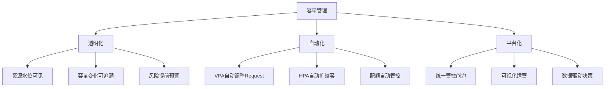

### 8.2 关键成功因素

#### 8.2.1 VPA核心价值

- 业务不关心Request
- 基于画像自动调整
- 提高资源利用率
- 降低人工运维成本

#### 8.2.2 资源池核实价值

- 打破资源壁垒
- 平台统一管控
- 快速响应需求
- 降低采购成本

#### 8.2.3 配额管理价值

- 逻辑配额管理
- 自动限制保护
- 公平资源分配

#### 8.2.4 可视化价值

- 快速定位问题
- 数据驱动决策
- 降本效果可见

### 8.3 降本与稳定性平衡

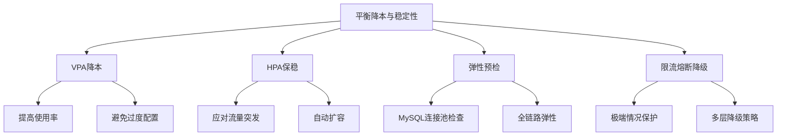

**核心思路**:

- VPA负责降本（垂直优化）
- HPA负责稳定性（水平扩展）
- 弹性预检防范风险
- 限流熔断降级兜底

### 8.4 实施收益总结

#### 8.4.1 降本收益

- **2022H1**: 在线业务物理机零新增
- **S12活动**: 零采购
- **资源使用率**: 峰值50%+，平均45%+
- **采购周期**: 1.5个月 → 1-2小时

#### 8.4.2 稳定性收益

- HPA覆盖率提升
- 小业务抗风险能力提升
- 大型活动快速支撑能力提升10倍+

#### 8.4.3 管理收益

- 平台统一管控能力大幅提升
- 容量变化透明可追溯
- 数据驱动运营决策

### 8.5 实践价值

本方案适用于：

- **云原生环境**: 基于Kubernetes的PaaS平台
- **降本增效**: 面临降本压力的组织
- **资源分散**: 资源分散在多个部门/业务
- **活动频繁**: 流量突发、活动保障需求多
- **微服务架构**: 大量微服务应用

### 8.6 关键挑战

#### 8.6.1 标准化挑战

- 不同资源池配置统一
- 内核版本统一
- 特殊约束清理

#### 8.6.2 协同挑战

- 跨部门协作
- 需要自上而下推动
- 老板支持至关重要

#### 8.6.3 技术挑战

- VPA不能触发Pod重启
- HPA与中间件瓶颈
- 弹性预检实现

## 九、议题要点回顾

### 9.1 容量弹性伸缩在业务稳定性提升上的落地

**VPA（垂直弹性）**:

- 基于应用画像自动调整Request
- 提高部署密度和资源利用率
- 支持大型活动降级非核心服务

**HPA（水平弹性）**:

- 基于应用画像配置弹性策略
- 不同等级服务不同阈值
- 配合弹性预检避免打垮下游

**弹性预检**:

- MySQL连接池预检
- 全链路弹性保障
- 组件级限流保护

### 9.2 降本增效背景下平衡稳定性和降本的关系

**降本手段**:

- VPA垂直优化（提高使用率）
- 物理机超卖（提高分配率）
- 资源池核实（统一管控）
- 配额管理（公平分配）

**稳定性保障**:

- HPA水平扩展（应对突发）
- 弹性预检（风险防范）
- 限流熔断降级（极端保护）
- 容量巡检（提前发现风险）

**平衡策略**:

- VPA负责降本，HPA负责稳定性
- 核心服务优先保障，非核心可降级
- 数据驱动决策，不盲目降本

### 9.3 容量运营落地难点与业务赋能

**落地难点**:

1. **资源分散**:

   - 解决：资源池核实
   - 赋能：业务不关心底层资源
2. **容量不透明**:

   - 解决：容量可视化
   - 赋能：风险应用一目了然
3. **变化难追溯**:

   - 解决：容量事件平台
   - 赋能：业务自助查询
4. **治理目标不明**:

   - 解决：组织业务容量
   - 赋能：快速找到治理重点
5. **标准化困难**:

   - 解决：自上而下推动
   - 赋能：统一标准降低成本

**业务赋能**:

- 不关心Request，只关心Limit
- 不关心物理资源，只关心配额
- 不关心扩容细节，HPA自动处理
- 不关心容量变化，平台可视化
- 快速找到治理目标，降本有方向

---

**注**: 本文档基于B站容量管理实践总结，旨在为SRE、运维及稳定性保障工程师提供降本增效和容量运营的实践参考。

