# B站FinOps优化实践与策略

> 来源：未核验 · 类型：分享 · 状态：draft


> 分享嘉宾：马永志 - B站基础架构部资源运营资深运维工程师

## 目录

- [一、为什么要做降本增效](#一为什么要做降本增效)
- [二、FinOps框架学习与落地](#二finops框架学习与落地)
- [三、资源效能管理体系](#三资源效能管理体系)
- [四、成本账单管理体系](#四成本账单管理体系)
- [五、成本优化实践案例](#五成本优化实践案例)
- [六、长期运营机制建设](#六长期运营机制建设)

## 一、为什么要做降本增效

### 1.1 外部挑战

- **云计算市场持续增长**：越来越多的业务部署在云上，带来运维便利和稳定性保障
- **云上成本浪费严重**：PaaS类和SaaS类产品的利用率无法有效监控
- **成本管理挑战加大**：资源利用率不透明，成本控制难度增加

### 1.2 内部压力

作为视频网站，B站面临的核心成本压力：

- **视频带宽和存储费用高昂**
- **IT成本随业务指标增长**
- **2024年目标：实现收支平衡**
- **所有技术项目需充分考虑ROI**

### 1.3 三大核心挑战

#### 1. 多活建设带来的资源增长

- 多地部署导致资源量从1.0倍增长到1.5-2.0倍
- 需要在保障高可用的同时控制成本

#### 2. 业务增长的边际效益递减

- 获客成本持续上升
- 原本1元获客成本可能增长到数倍
- 对成本控制压力巨大

#### 3. 新技术投入成本高

- 大模型、AGC相关项目
- GPU集群投入动辄上千万甚至上亿
- 需要精细化的投入产出分析

### 1.4 传统预算管理模式

**核心理念**：以预算为中心

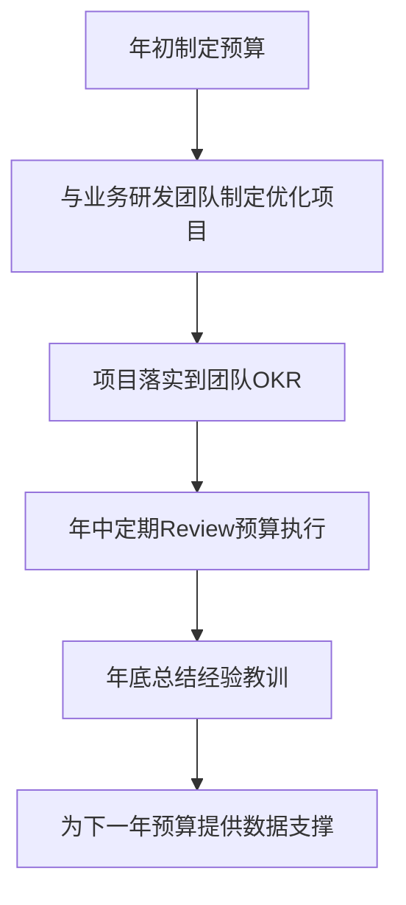

### 1.5 预算编制逻辑

**业务指标驱动的预算模型**：

| 业务线   | 核心指标         |
| -------- | ---------------- |
| 主站业务 | DAU、MAU         |
| 点播业务 | 播放量、投稿量   |
| 直播业务 | 主播数、观看时长 |

**转换流程**：

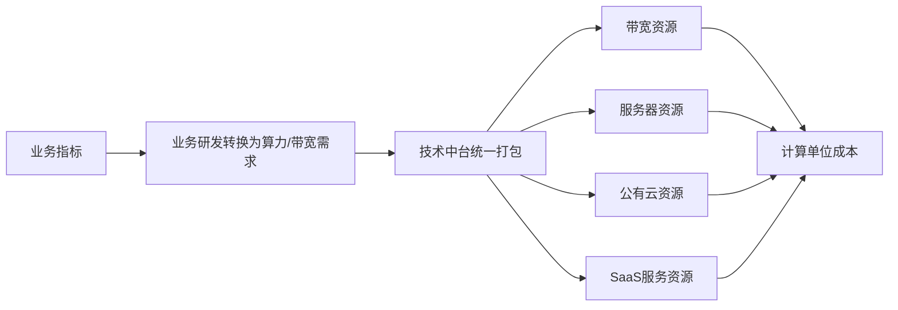

**关键指标**：

- 单DAU成本
- 单位播放成本
- 单VV播放成本

### 1.6 传统模式的三大问题

#### 问题1：缺乏方法论和体系

- 业务部门参与度不够
- 技术中台自身参与也不足
- 预算层层加码，每层留有余地
- 导致第一版预算与实际严重偏离

#### 问题2：预算控制方式僵化

- 采用白名单形式，年初做了预算就直接通过
- 无法实时反映业务指标变化
- 例如：预计增长50%，实际只增长10%，但预算仍按50%执行
- 造成资源浪费

#### 问题3：业务缺乏成本感知

- 未同步成本数据给业务
- 没有权责账单概念
- 业务不知道自己的应用和服务花费多少
- 难以自发参与成本控制

## 二、FinOps框架学习与落地

### 2.1 FinOps框架介绍

2021年底-2022年初，FinOps概念在中国市场流行，B站开始学习和借鉴FinOps框架。

**核心循环**：

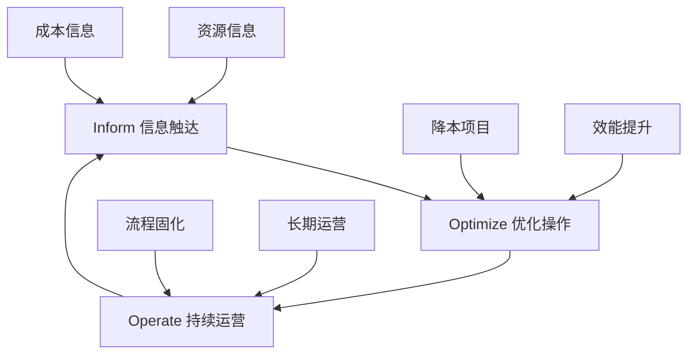

**关键要素**：

- **Inform（告知）**：将资源和成本信息触达给各干系人
- **Optimize（优化）**：执行实际的降本优化操作
- **Operate（运营）**：形成长期有效的运营流程

### 2.2 B站组织协同架构

**资源运营团队定位**：FinOps实践者，提升资源总体效能

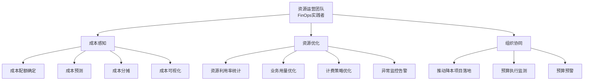

### 2.3 核心职能

#### 1. 成本感知

- **预算阶段**：确定项目成本配额
- **上线前**：成本预测和预期设定
- **运行中**：成本正确分摊
- **全流程**：成本可视化和展示

#### 2. 资源优化

- **资源维度统计**：全公司资源利用率和效率展示
- **业务用量优化**：参与业务资源使用优化
- **对外采购优化**：与云厂商协商计费策略
- **异常监控**：资源使用异常检测和策略制定

#### 3. 组织协同

- **项目推动**：跨团队降本项目落地
- **预算监测**：预算执行情况监控和预警
- **从白名单到精细化管理**：关注每笔预算的花费效率

### 2.4 相关方协作关系

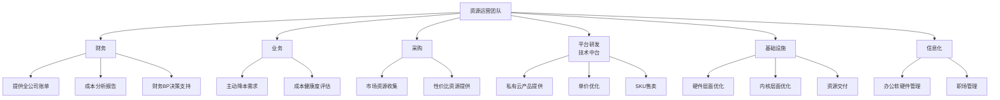

### 2.5 资源全生命周期管理

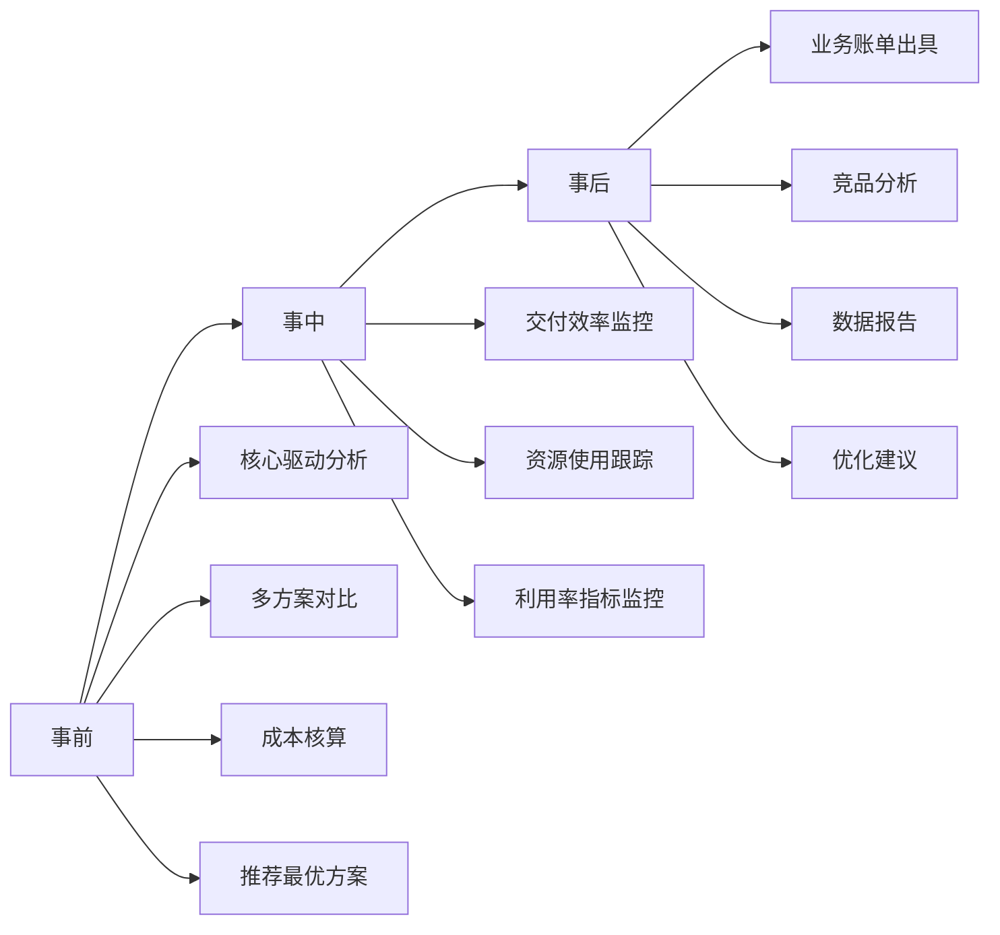

## 三、资源效能管理体系

### 3.1 资源效能公式

**核心公式**：

$$
资源效能 = \frac{业务收益}{TCO}
$$

其中：

- **TCO**（Total Cost of Ownership）：一台机器或服务在3-5年生命周期内产生的总成本
- **业务收益**：资源带来的实际业务价值

### 3.2 资源效能拆解

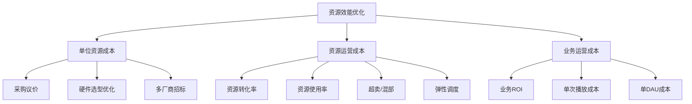

### 3.3 容器平台资源效能模型

**资源层级关系**：

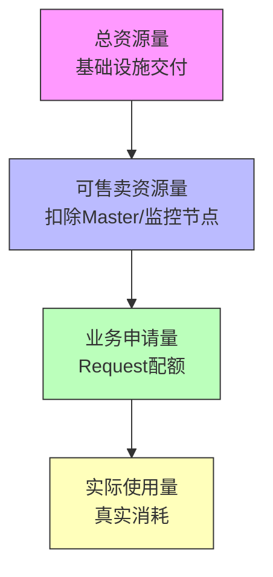

**优化方向**：

1. **提高可售卖资源量**

   - 潮汐填补
   - 超卖策略
   - 在总资源不变的情况下提升利用率
2. **提升实际使用率**

   - 弹性调度
   - 回收闲置资源
   - 分配给资源紧张的业务

### 3.4 不同资源类型的关注指标

| 资源类型    | 核心指标           | 优化方向           |
| ----------- | ------------------ | ------------------ |
| 容器/VM     | CPU利用率          | 混部、超卖、弹性   |
| 数据库/缓存 | 内存使用率、IOPS   | 规格优化、存算分离 |
| 存储        | 磁盘使用率         | 冷热分层、数据治理 |
| 带宽        | 端口利用率、95峰值 | 削峰填谷、廉价资源 |
| Kafka       | 消息吞吐量         | 集群规模优化       |
| Redis       | 内存命中率         | 缓存策略优化       |

### 3.5 数据支撑平台

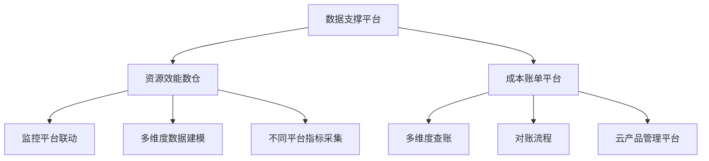

## 四、成本账单管理体系

### 4.1 资源归属设计

**核心理念**：以产品为最小粒度的归属单位

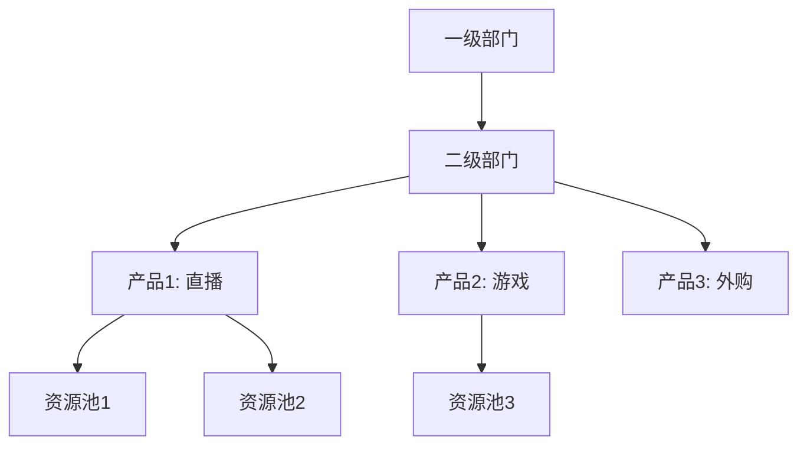

**优势**：

- 产品线相对稳定，不随组织架构频繁调整
- 组织架构调整时，只需重新映射产品到部门
- 避免频繁变更资源归属关系

### 4.2 资源映射体系

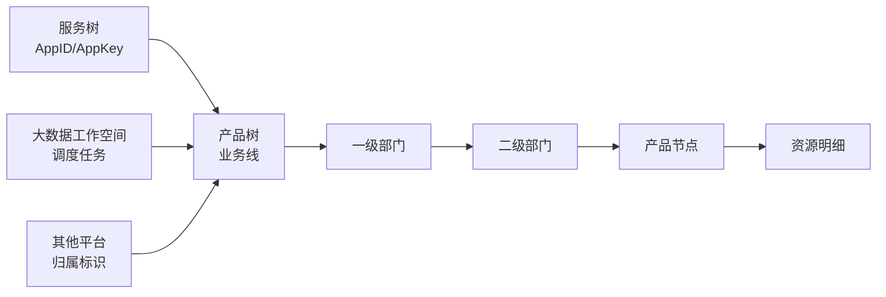

**映射关系**：

1. **在线业务**：通过AppID映射到产品节点

   - 支持到应用级别的细粒度拆分
   - 可统计每个容器、数据库的成本
2. **大数据业务**：通过工作空间映射

   - 按表、调度任务归属
   - 独立的映射规则
3. **其他平台**：各自的归属标识映射

   - 支持不同维度的统计需求
   - 灵活的规则配置

### 4.3 成本定价模型

#### TCO成本计算

**从CapEx到OpEx的转换**：

```
示例：
服务器采购价：36万元
折旧年限：3年（36个月）
月度OpEx成本 = 360,000 / 36 = 10,000元/月
```

**TCO总成本构成**：

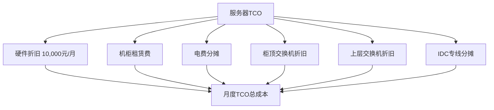

#### 单价计算公式

**容器平台示例**：

```
容器平台售卖两种产品：CPU、内存

假设资源成本占比：
- CPU占比：70%
- 内存占比：30%

CPU单价 = (集群总成本 × 70%) / 可售卖CPU总核数
内存单价 = (集群总成本 × 30%) / 可售卖内存总量

业务成本 = CPU单价 × CPU用量 + 内存单价 × 内存用量
```

### 4.4 降本协同模型

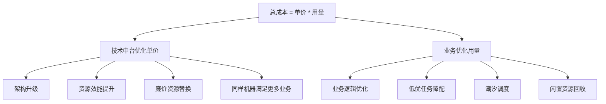

### 4.5 成本账单三大难点

#### 1. 资源归属管理

- 以产品为虚拟节点的最小粒度
- 产品一对一或一对多映射到部门
- 支持全公司业务线的明细和汇总
- 应对组织架构频繁调整

#### 2. 资源映射规则

- 服务树（AppID）映射
- 大数据工作空间映射
- 其他平台标识映射
- 形成宽表支持多维度拆分

#### 3. 定价策略

- CapEx转OpEx口径
- TCO总成本计算
- 资源成本占比分配
- 单价×用量的成本模型

## 五、成本优化实践案例

### 5.1 带宽优化

#### 点播带宽

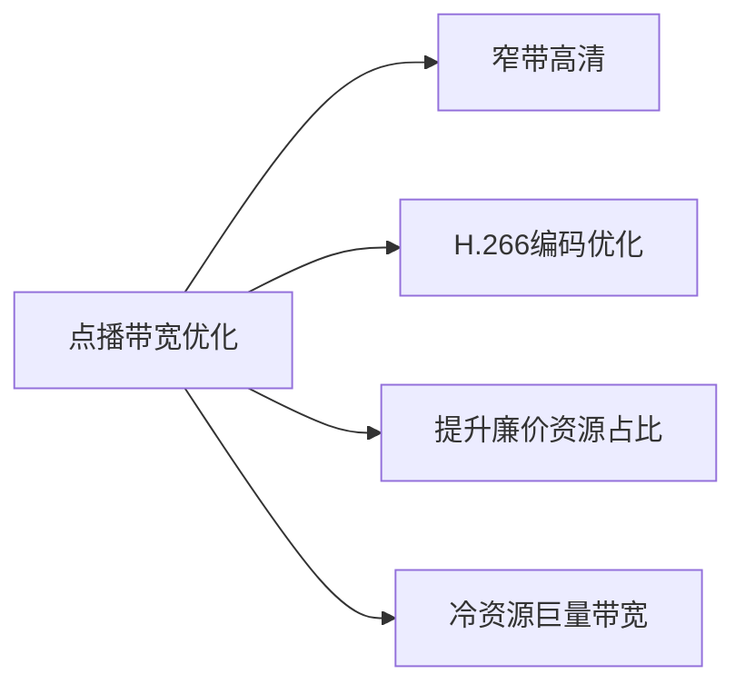

- **窄带高清**：在保证画质的前提下降低码率
- **H.266优化**：采用更先进的编码技术
- **廉价资源**：提升低成本CDN节点占比
- **巨量带宽**：冷门内容采用按量计费

#### 直播带宽

- **冷热分层调度**：热门直播间和冷门直播间差异化调度
- **自建+商业边缘计算**：混合架构优化成本
- **P2P技术**：用户间点对点传输减少带宽消耗
- **会话协议合并**：减少连接数降低成本

### 5.2 存储优化

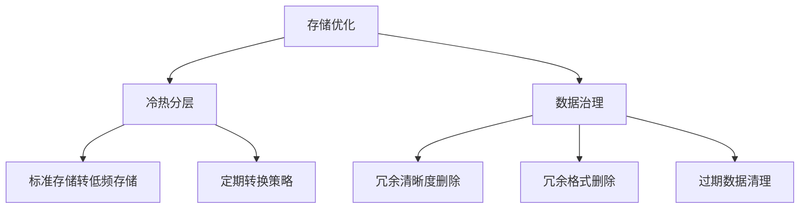

### 5.3 服务器优化

#### 硬件选型

- **年度配置优化**：每年进行服务器套餐选型
- **高密度方向**：优化单位算力成本、单核成本
- **新硬件拥抱**：国产GPU应用（训练、推理、转码）

#### 资源复用

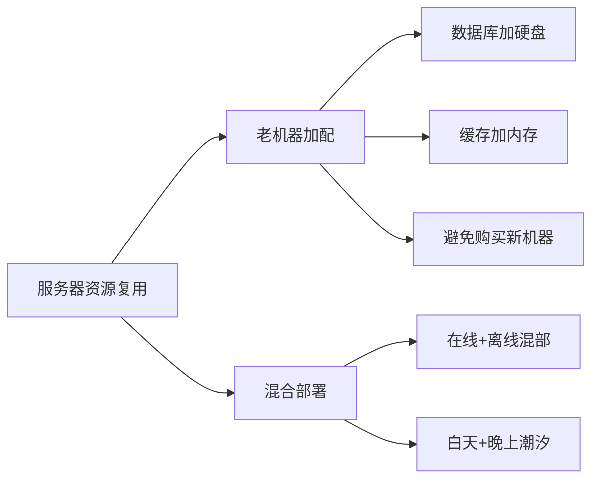

**潮汐混部策略**：

- 白天：整机集群给在线业务
- 晚上：迁移给离线计算业务（如转码）
- 第二天早上：归还给在线业务

### 5.4 PaaS层优化

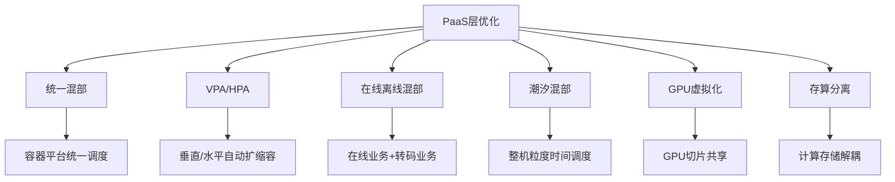

### 5.5 推荐搜索优化

**专用计算替换通用计算**：

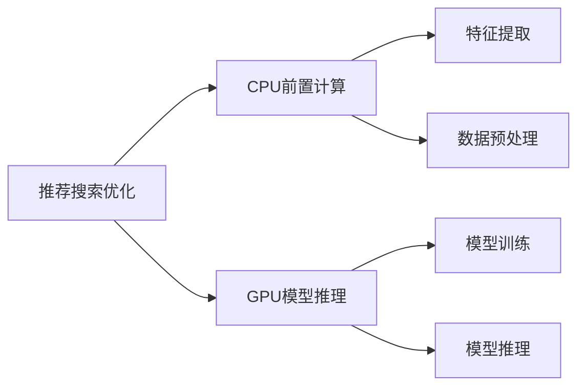

### 5.6 云服务优化

#### 混合云架构

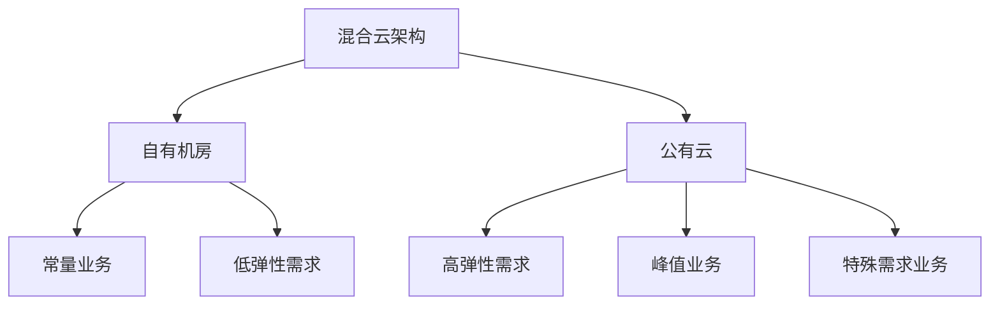

#### 云厂商合作

- **机型统一**：统一云上配置和机型
- **合作共赢**：与云厂商协商优化计费
- **上下云策略**：
  - 下云：常量业务、低弹性需求
  - 上云：峰值弹性高、特殊需求业务

### 5.7 SaaS服务优化

**核心策略**：有自研能力的尽可能替换成自研

原因：

- SaaS服务价格相对较贵
- 自研可控性更强
- 长期成本更低

### 5.8 网络服务优化

#### 公网带宽优化

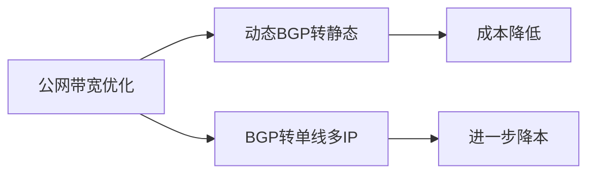

#### IDC网络升级

- **通用网络**：升级到25G
- **AI/大数据**：支持100G、400G网络环境
- **机柜优化**：提升PUE指标，挖潜机柜容量

### 5.9 短信服务优化

```mermaid
graph TD
    A[短信服务优化] --> B[通知短信]
    A --> C[营销短信]
  
    B --> B1[保障稳定性]
    B --> B2[不做优化]
  
    C --> C1[ROI分析]
    C --> C2[点击率分析]
    C --> C3[转化率分析]
    C --> C4[长度优化]
  
    C4 --> C5[3条变2条]
    C4 --> C6[2条变1条]
```

### 5.10 应用层优化

- **GPU利用率提升**：通过调度优化提升GPU使用效率
- **物料预下发**：通过错峰方式减少计费带宽
- **协议压缩**：减少传输数据量

### 5.11 大数据优化

- **计算引擎切换**：不同场景选择最优引擎
- **流式计算改造**：实时计算架构优化
- **存储优化**：数据治理、冷热分层

### 5.12 SDK优化

**核心策略**：与商业SaaS类似，有自研能力尽量自研

## 六、长期运营机制建设

### 6.1 成本运营全流程

```mermaid
graph TB
    A[成本运营] --> B[事前: 成本预测]
    A --> C[事中: 预算控制]
    A --> D[事后: 成本分析]
  
    B --> B1[旧业务历史监控]
    B --> B2[新项目方案核算]
    B --> B3[推荐最优方案]
  
    C --> C1[实时预算执行监控]
    C --> C2[超预算告警]
    C --> C3[及时调整]
  
    D --> D1[成本升降原因分析]
    D --> D2[定期分析报告]
    D --> D3[优化建议]
    D --> D4[账单解读]
```

### 6.2 事前：成本预测

#### 旧业务

- 监控历史业务情况
- 预测未来成本走势
- 分析波动原因

#### 新项目

- 要求架构师提供技术方案
- 核算每个方案成本
- 推荐成本最优方案

### 6.3 事中：预算控制

**从白名单到精细化管理**：

```mermaid
graph LR
    A[传统白名单模式] --> B[精细化管理模式]
  
    A --> A1[年初预算直接通过]
    A --> A2[无法动态调整]
  
    B --> B1[实时监控预算执行]
    B --> B2[超预算及时告警]
    B --> B3[动态调整策略]
```

**关键动作**：

- 定期掌握预算执行实际情况
- 超预算业务及时警告
- 根据业务指标变化动态调整

### 6.4 事后：成本分析

#### 账单解读

- **按月出账**：每月生成业务账单
- **业务Review**：业务方确认账单
- **解读服务**：帮助业务理解账单
- **优化建议**：从业务角度提供建议

#### 成本分析

- **升降原因**：分析每日/周/月成本变化
- **定期报告**：同步分析报告给业务
- **持续优化**：提供优化建议和依据

### 6.5 资源运营全流程

```mermaid
graph TB
    A[资源运营] --> B[资源规划]
    A --> C[资源交付]
    A --> D[资源使用]
    A --> E[资源优化]
    A --> F[资源清退]
  
    B --> B1[标准配置]
    B --> B2[尽可能收口]
  
    C --> C1[进入平台资源池]
    C --> C2[统一管理分配]
  
    D --> D1[制定资源基线]
    D --> D2[监控利用率]
    D --> D3[未达标限制新增]
  
    E --> E1[改配降规格]
    E --> E2[回收到备用池]
    E --> E3[混部提升利用率]
  
    F --> F1[项目完结清退]
    F --> F2[关联资源清理]
```

### 6.6 资源规划阶段

**核心原则**：标准化、收口

- **服务器**：尽可能使用标准配置
- **云资源**：使用标准产品规格
- **避免碎片化**：减少非标配置

### 6.7 资源交付阶段

**从业务直接持有到平台统一管理**：

```mermaid
graph LR
    A[传统模式] --> B[新模式]
  
    A --> A1[资源直接交付业务]
    A --> A2[归属在业务方]
    A --> A3[平台难以管理]
  
    B --> B1[资源进入平台池]
    B --> B2[技术中台统一管理]
    B --> B3[统一分配调度]
```

### 6.8 资源使用阶段

#### 资源基线制定

不同资源类型关注不同指标：

| 资源类型  | 瓶颈指标   | 基线要求 |
| --------- | ---------- | -------- |
| CPU密集型 | CPU利用率  | >60%     |
| 数据库    | 内存、IOPS | >70%     |
| 缓存      | 内存命中率 | >80%     |
| 存储      | 磁盘使用率 | >75%     |

#### 未达标管理

- 利用率未达标，优先使用存量资源满足新需求
- 限制新增资源申请
- 推动优化改造

### 6.9 资源优化阶段

```mermaid
graph TD
    A[资源优化] --> B[改配降规格]
    A --> C[回收到备用池]
    A --> D[混部提升利用率]
  
    B --> B1[8C16G降为4C8G]
  
    C --> C1[服务器回收]
    C --> C2[容器平台接入]
    C --> C3[批处理平台接入]
  
    D --> D1[在线+离线混部]
    D --> D2[潮汐调度]
```

### 6.10 资源清退阶段

#### 计费模式差异化

**共享资源池**：

- 按实际使用量计费
- 用多少算多少

**独占资源池**：

- 按规格计费
- 可能带有惩罚系数
- 引导业务切换到更合适的模式

#### 关联资源清理

云资源清退时需关注：

- 云服务器
- 公网IP
- 负载均衡（LB）
- 云硬盘
- 其他关联资源

### 6.11 不可能三角

```mermaid
graph TD
    A[资源管理不可能三角] --> B[交付效率]
    A --> C[稳定性]
    A --> D[成本]
  
    style A fill:#f96,stroke:#333
    style B fill:#9cf,stroke:#333
    style C fill:#9fc,stroke:#333
    style D fill:#fc9,stroke:#333
```

**核心理念**：

- 没有完美的通用配置
- 需要根据项目特点做取舍
- 重保项目：优先稳定性，成本其次
- 常规项目：平衡成本和效率
- 最适合当下的方案就是最好的方案

### 6.12 FinOps闭环

```mermaid
graph TB
    A[FinOps闭环] --> B[数据洞察]
    B --> C[问题发现]
    C --> D[项目落地]
    D --> E[效果反馈]
    E --> B
  
    B --> B1[资源利用率展示]
    B --> B2[成本账单分析]
  
    C --> C1[资源浪费识别]
    C --> C2[成本异常发现]
  
    D --> D1[降本项目推进]
    D --> D2[优化方案实施]
  
    E --> E1[下期账单验证]
    E --> E2[效能报表更新]
```

### 6.13 运营指标体系

#### 核心指标

- **资源浪费识别**：找出正在浪费的资源
- **问题根因分析**：明确优化方向
- **责任方确认**：找到相关业务和研发
- **流程可追溯**：记录每一步操作
- **成本变化观察**：验证优化效果

#### 激励机制

基于观察数据设计奖惩机制：

- 让业务自发参与成本控制
- 从"被推动"到"主动优化"
- 形成良性循环

### 6.14 持续运营的关键

```mermaid
graph LR
    A[持续运营] --> B[数据支撑]
    A --> C[流程固化]
    A --> D[激励机制]
    A --> E[文化建设]
  
    B --> B1[资源效能数仓]
    B --> B2[成本账单平台]
  
    C --> C1[预算管理流程]
    C --> C2[项目审批流程]
    C --> C3[资源申请流程]
  
    D --> D1[OKR考核]
    D --> D2[奖惩制度]
  
    E --> E1[成本意识培养]
    E --> E2[ROI思维]
```

## 七、总结与展望

### 7.1 核心要点回顾

1. **方法论建设**：借鉴FinOps框架，建立Inform-Optimize-Operate闭环
2. **组织协同**：资源运营团队作为PMO角色，协调多方参与
3. **数据驱动**：通过资源效能和成本账单双维度数据洞察
4. **项目落地**：涵盖带宽、存储、服务器、PaaS、应用等全方位优化
5. **长期运营**：建立事前-事中-事后的全流程管理机制

### 7.2 关键成功因素

```mermaid
graph TB
    A[FinOps成功要素] --> B[高层支持]
    A --> C[数据透明]
    A --> D[全员参与]
    A --> E[持续迭代]
  
    B --> B1[纳入公司战略]
    B --> B2[OKR考核]
  
    C --> C1[成本可视化]
    C --> C2[账单透明]
  
    D --> D1[业务参与]
    D --> D2[技术中台优化]
    D --> D3[基础设施支撑]
  
    E --> E1[定期Review]
    E --> E2[持续优化]
```

### 7.3 B站资源运营团队定位

**核心角色**：

- 降本项目的技术PMO
- 账单数据的核对和分析
- 资源利用率的数据支撑

**协作模式**：

- 具体降本项目由各领域专家在其团队落地
- 例如：容器VPA、大数据存储治理、日志平台优化、IDC夜间电等

### 7.4 未来展望

- **持续优化**：不断发现新的优化点
- **工具建设**：完善自动化工具和平台
- **文化培养**：建立全员成本意识
- **经验沉淀**：形成可复用的方法论

---

## 附录：相关资源

- 关注B站技术公众号获取更多技术干货
- 各领域降本项目详细实践（容器VPA、大数据治理、ES优化、IDC夜间电等）

---

**文档说明**：

- 本文档基于B站基础架构部资源运营团队的实践经验整理
- 内容涵盖FinOps框架落地、成本管理、资源优化等多个方面
- 适合SRE、运维及稳定性保障工程师学习参考
