# 降本增效持续深化，如何找准FinOps关键着力点

> 来源：未核验 · 类型：分享 · 状态：draft


## 分享嘉宾

- **尚梦辰** - 中国信通院云大所业务主管（主持人）
- **白璐** - 中国信通院云大所研究员
- **梁启晨** - 小红书基础架构部混合云资源管理负责人

---

## 一、FinOps概述与发展现状

### 1.1 FinOps核心理念

FinOps是通过对IT资源投入的全过程进行管理，以实现对IT资源投入的合理性以及实际效果进行整体客观清晰化的理解评价，提高IT业务和财务部门的整个沟通效率，实现IT资源的部署效率最大化，从而更好支撑企业的高质量可持续发展。

**FinOps三重属性：**
- 一种文化变革
- 一种团队协作
- 一个能力建设

### 1.2 2023年FinOps发展关键点

1. **国家政策支持**：二十大报告提出坚持高质量发展为主题，加快构建发展新格局
2. **搜索热度激增**：Google Trends上FinOps搜索量从2019年到2023年增长了400倍
3. **行业趋势明显**：CNCF云原生预测报告中，有4个热点趋势都与FinOps相关
4. **技术成熟度提升**：Gartner成熟度曲线显示，FinOps已从技术萌芽期进入期望膨胀期
5. **成本管理成为首要挑战**：Flexera 2023年云计算现状调查报告显示，云成本管理首次超过安全管理，成为企业用云最大挑战

### 1.3 中国信通院在FinOps生态建设中的工作

#### 标准建设

**1. 面向云计算的财务运营管理平台能力要求（2021-2022）**
- 从成本角度对云资源进行预算制定、成本核算、成本归集优化
- 建设三个阶段：应用级、全面级、卓越级
- 已通过认证企业：阿里云、北京中软国际

**2. IT基础设施资源运营能力成熟度模型（计划推进）**
- 从基础设施层面出发
- 涵盖产品管理、需求管理、成本管理、容量管理
- 参编企业：建行、百度、阿里云、华泰证券、招商银行等

#### 产业推进

- 成立FinOps产业推进方阵（工信部、云计算开源产业联盟指导）
- 与Linux Foundation基金会建立战略合作
- 目前已有45-50家国内知名企业加入

---

## 二、中国FinOps现状调查报告（2023）亮点解读

### 2.1 IT资源投入现状

#### 投资策略趋于审慎保守

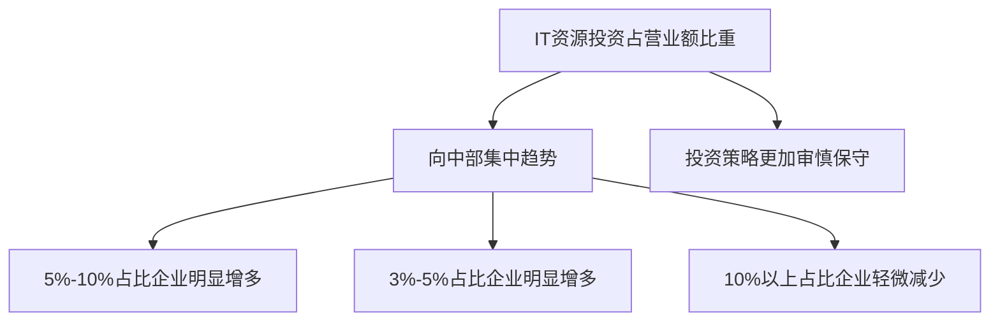

#### IT资源投资分布（按金额排序）

1. **云资源**（排名第一）
2. **服务器等计算资源**（排名第二）
3. **网络资源**（排名第三）
4. IT技术人力资源
5. 数据库
6. 平台软件

### 2.2 云服务使用现状

#### 云服务类型分布

| 云服务类型 | 占比 | 说明 |
|----------|------|------|
| 公有云+私有云混合云 | 33% | 最多企业采用 |
| 传统数据中心+部分公有云 | 13.9% | 未完全上云状态 |
| 构建组织私有云自管理 | 10% | 自建私有云 |
| 基于传统数据中心（未用云） | 9% | 完全未上云 |
| 全面使用公有云 | 8% | 全公有云 |
| 组织私有云托管方式 | 8% | 私有云托管 |

**关键发现：**
- 中国企业用云情况与国外差别较大
- 国外以公有云使用为主，中国私有云占比更高

### 2.3 IT资源使用效率

#### 资源浪费情况

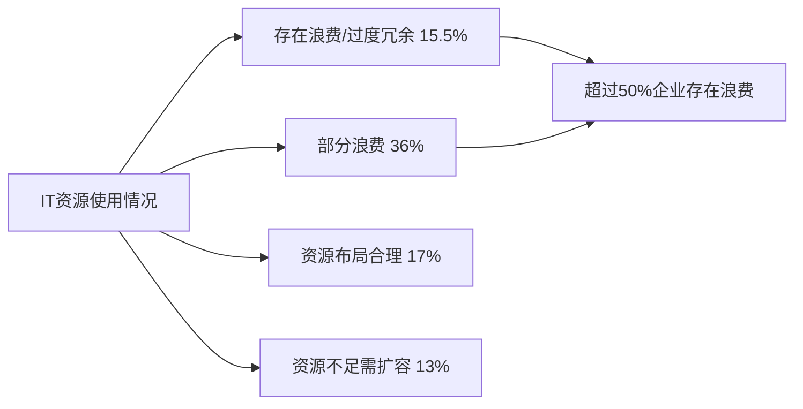

**结论：** 超过一半的企业IT资源存在浪费情况，展开FinOps和IT资源精细化管理迫在眉睫。

### 2.4 FinOps投入计划

- **超过40%企业**：未来将加大对FinOps的投入
- **21%企业**：视实际情况而定
- **11%企业**：计划保持现状
- **仅10%企业**：计划减少投入

**趋势：** FinOps在近两年内关注度持续升高

### 2.5 FinOps建设常用方法（按使用频率排序）

1. **建立统一的IT资源管理使用规范**
2. **通过财务部门的预算制度管理**
3. **通过独立组织对IT资源成本统一管理**
4. 通过工具管理
5. 团队/项目自己管理
6. 整体资源容量管理
7. 容量调度、弹性扩缩容等变动策略（高阶）
8. 用量标记定价和分摊方式（高阶）

**现状分析：**
- 大多数企业采用的方式比较基础
- 高阶的工具方面建设有所欠缺
- 整体FinOps建设程度处于初期阶段

### 2.6 降本增效成果

#### 2023年降本增效成效统计

| 成效区间 | 占比 | 说明 |
|---------|------|------|
| 3000万元以上 | 9% | 效果显著 |
| 1500万-3000万元 | 8% | 效果显著 |
| 500万-1500万元 | 20% | 效果显著 |
| 100万-500万元 | 42% | 有一定成效 |
| 低于100万元 | 21% | 初步成效 |

**关键数据：** 近40%的企业降本增效成效达到500万元以上，整体建设效果十分显著。

### 2.7 资源管理精细化程度

#### 时间管理维度分布

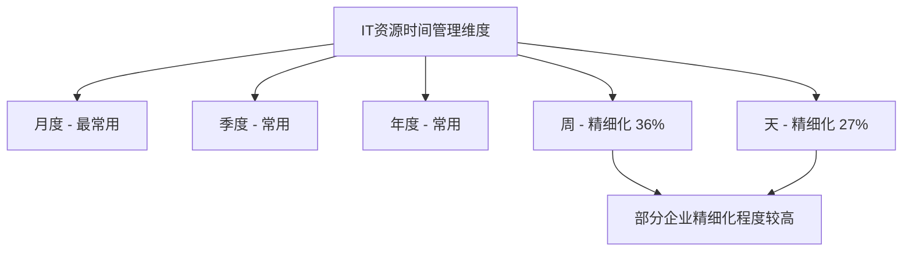

### 2.8 成本管理面临的主要问题

#### 核心挑战（按重要性排序）

1. **缺乏与业务关联的IT资源成本账单**
2. **无法及时监控IT成本的消耗情况**
3. **成本难以预测**
4. **IT资源单位成本的标准化度量困难**
5. 公共成本的分摊问题
6. IT成本核算维度和财务维度不统一
7. 缺乏工具和机制
8. 缺乏成本意识和人才

**分析：** 企业比较缺的是高级的解决办法，如与业务关联的细粒度账单、实时监控、标准化度量等。

---

## 三、小红书FinOps落地与实践

### 3.1 小红书用云基本情况

#### 基础信息

- **云策略**：多云架构，初创期即全面上云
- **云厂商**：6个以上供应商
- **地域分布**：全国多个地域
- **云产品**：120+款
- **算力规模**：
  - CPU核数：百万级
  - GPU卡数：万卡级

#### 面临的核心问题

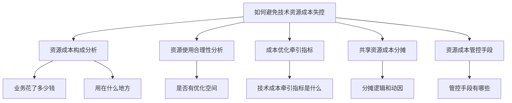

### 3.2 FinOps框架与六大原则

#### FinOps六大原则

1. **团队协作**：成本节省人人有责
2. **中心化驱动**：建立中心化团队驱动FinOps运营
3. **实时报表**：提供实时报表助力业务决策
4. **面向价值驱动**：驱动用云决策
5. **充分利用云的便利性**：云的最大便利在于弹性
6. **跨部门协同**：强调跨部门的协同业务流程

### 3.3 FinOps三大核心板块

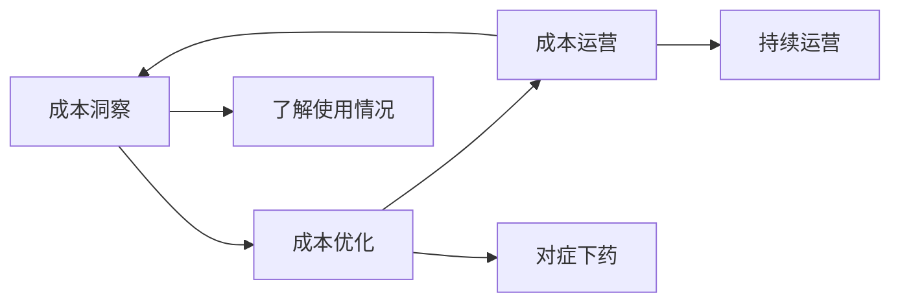

#### 成本洞察流程


---

## 四、小红书成本洞察实践

### 4.1 统一资源成本账单体系

#### 设计目标

- 实现多云场景下的可观测、可视化
- 支持内部产品出账
- 统一账单标准

#### 账单产出维度

| 维度类型 | 说明 | 用途 |
|---------|------|------|
| 日账单 | 2-3天滞后 | 预估成本、看趋势 |
| 月账单 | 月结关账后固定 | 准确成本核算 |

**重要提示：** 日账单只能作为预估成本的度量，云厂商日账单有滞后性且可能重跑；月账单关账后不再变动，更准确。

#### 观测维度

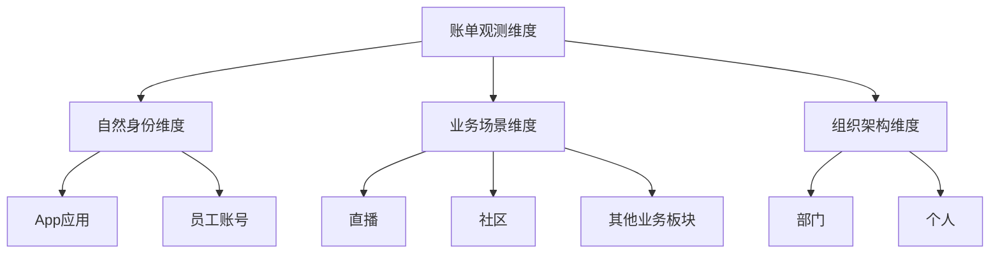

#### 账单产出逻辑

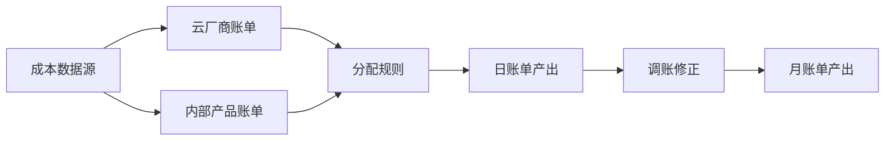

### 4.2 中台技术商品化

#### 设计目标

解决共享资源按比例分摊说不清楚的问题，通过量价对应的资源账单，看清内部资源使用情况。

#### 双方视角

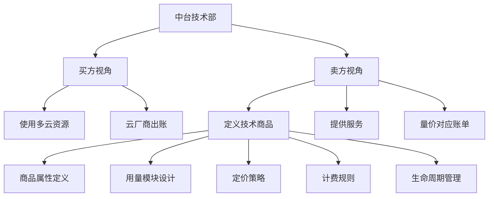

#### 核心价值

- **解决问题**：共享资源分摊逻辑不清
- **实现目标**：量价对应，而非按比例分摊
- **账单特点**：明细账单，看得到量也看得到价

### 4.3 资源归属匹配

#### 标签体系

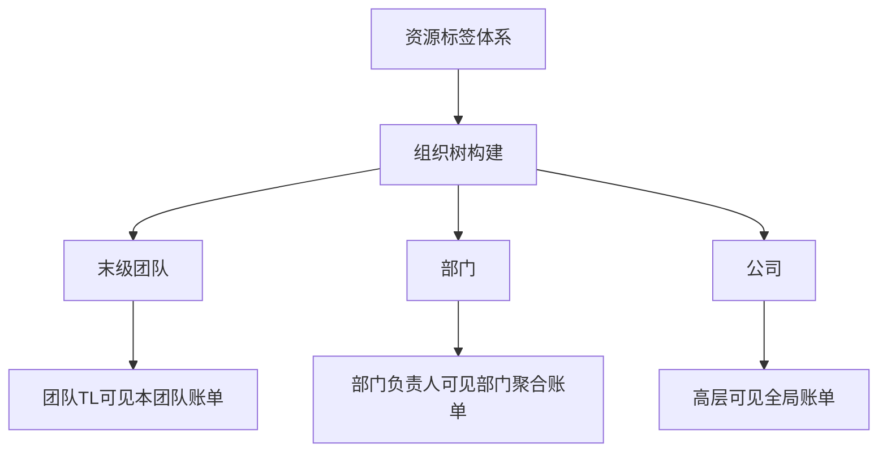

**实现方式：** 通过给资源打标签的方式构建组织树，支持不同角色从不同维度查看账单。

### 4.4 预算管理机制

#### Top-Down与Bottom-Up结合

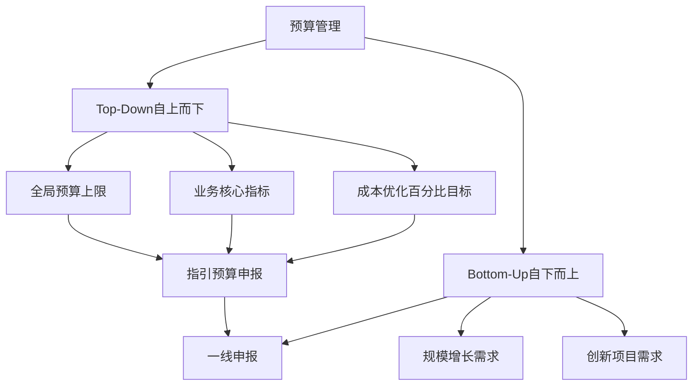

#### 预算执行与考核

- **发放方式**：按月发放配额
- **执行跟踪**：年度/月度预算执行度跟踪
- **风险预警**：及时发现超预算风险
- **限制措施**：超预算时限制新增资源，强制优化

---

## 五、小红书成本优化实践

### 5.1 优化方向总览

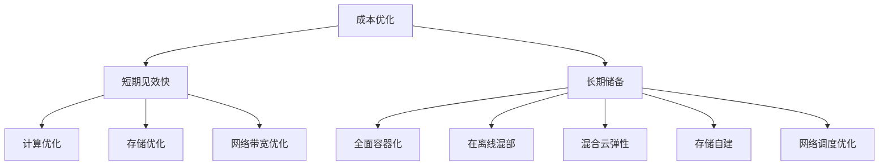

### 5.2 短期优化措施

#### 计算方向

1. **性能优化**
   - JDK升级（8→11/17/21）
   - RPC性能优化
   - 内核调参
   - CPU饱和动态调权

2. **弹性伸缩**
   - 缩小集群容量
   - 分时复用
   - 合并资源池减少碎片

**效果：** 提升有效工作负载占比，降低单位资源消耗

#### 存储方向

1. 过期冗余数据清理
2. 冷热存储转换
3. 数据生命周期管理

**关键：** 数据生命周期管理做好，成本节省相当可观

#### 网络带宽方向

1. 减少不合理的跨机房调用
2. 减少跨云厂商数据传输
3. 文件压缩预处理
4. CDN回源优化
5. 直播/点播场景自适应码率

### 5.3 长期储备措施

#### 计算方向

1. **全面容器化**
   - 在线服务容器化
   - 中间件容器化
   - 数据库容器化

2. **在离线混部**
   - 统一资源池
   - 混合负载调度

3. **混合云弹性**
   - 公有云+私有云组合
   - 充分利用云弹性能力

#### 存储方向

- 自建存储产品（达到一定规模后）
- 自建日志类产品
- 平衡自建成本与云产品成本

#### 网络方向

- CDN网络调度优化
- 业务高峰期精细化运营
- 视频编解码算法优化

### 5.4 在离线混部四阶段演进

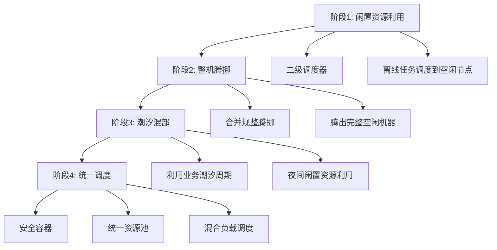

#### 各阶段收益

| 阶段 | 适用场景 | CPU利用率提升 | 说明 |
|-----|---------|--------------|------|
| 阶段1 | 在线集群 | +8%~15% | 利用完全空闲节点 |
| 阶段2 | 在线集群 | +10%~15% | 整机腾挪能力 |
| 阶段3 | 在线集群 | +10%~15% | 潮汐混部 |
| 阶段3 | 存储集群 | +20% | 潮汐混部 |
| 常态混部集群 | 混部集群 | 45% | 提供数百万核低成本算力 |

**关键技术：**
- 与开源社区合作（Koordinator）
- 离线调度资源视图
- QoS保障策略
- 在线服务优先保障

### 5.5 异构推理框架与训练系统

#### CPU+GPU异构推理

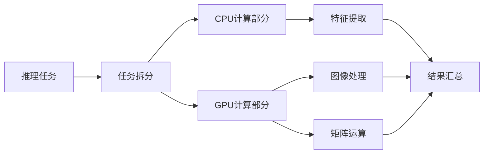

**优化效果：**
- CPU利用率提升至60%
- GPU使用率充分提高
- 整体节省20%算力资源

#### 大模型训练优化

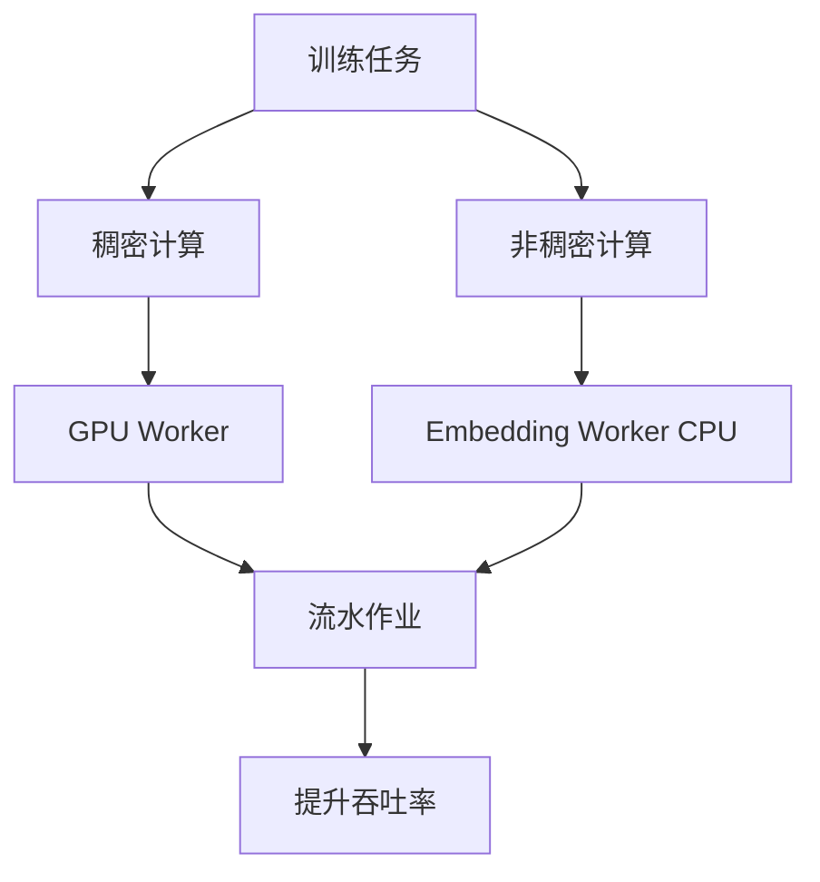

**优化手段：**
- 训练阶段拆分细化
- 不同计算任务分配到合适节点
- 混合精度数据压缩
- 减少数据传输

**优化效果：** 算力节省15%~20%

### 5.6 CDN带宽优化

#### 智能缓存策略

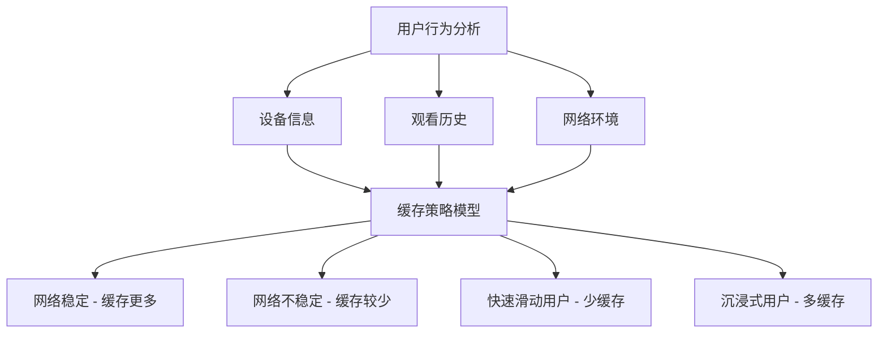

**优化方向：**
- 根据网络环境调整缓存大小
- 根据用户行为个性化缓存策略
- 提高缓存利用率

---

## 六、小红书成本运营实践

### 6.1 成本运营全流程

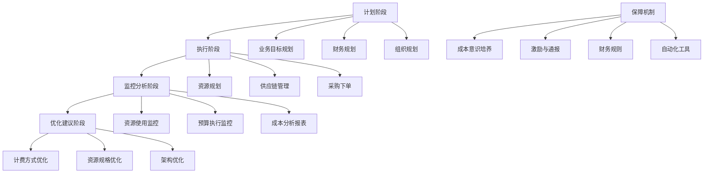

### 6.2 成本核算分析流程

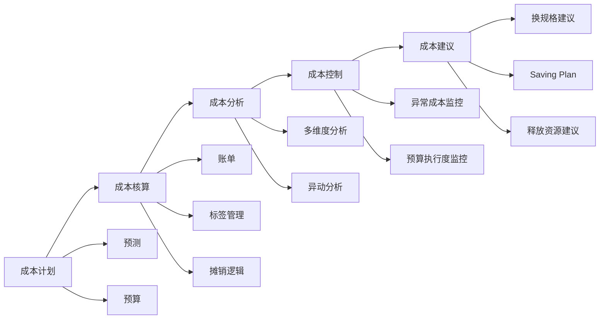

### 6.3 混合云资源管理平台

#### 云治理成熟度五级模型

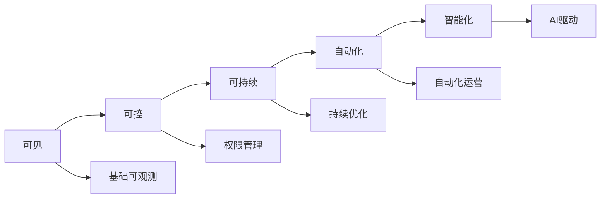

**小红书定位：** 对标自动化阶段

#### 平台核心能力

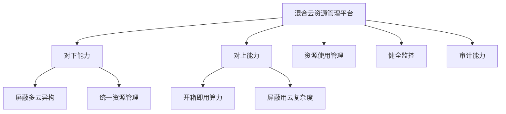

---

## 七、FinOps实施关键问题Q&A

### 7.1 资源预算控制超预期如何处理？

#### 事后分析（已超预算）

1. **稳定性第一**：优先保证线上稳定，扩容能解决的问题先扩容
2. **复盘分析**：
   - 分析超预算原因
   - 业务是否超预期增长
   - 资源使用是否合理
3. **治理优化**：该治理的治理，该优化的优化
4. **追加预算**：实在没招才追加预算（对团队绩效有影响）

#### 事中控制（预算执行中）

1. **实时监控**：预算执行度跟踪
2. **及时预警**：发现超预算风险
3. **过程干预**：及时止损和调整
4. **限制措施**：超预算时限制新增资源

#### 事前规划（预算编制）

1. **Top-Down**：全局预算控制上限
2. **Bottom-Up**：一线申报需求
3. **充分考虑**：把历史变量考虑进来
4. **持续迭代**：不断优化预算模型

### 7.2 如何打破部门信息壁垒？

#### 组织保障

```mermaid
graph TD
    A[打破信息壁垒] --> B[组建FinOps小组]
    B --> C[业务代表]
    B --> D[运维代表]
    B --> E[财务代表]
    B --> F[采购代表]
    
    A --> G[明确共同目标]
    A --> H[建立沟通机制]
    
    H --> I[定期周会/双周会]
    H --> J[提前准备议题]
    H --> K[高效讨论决策]
```

#### 实施要点

1. **达成共识**：明确共同目标和利益关系
2. **跨职能团队**：包含各领域专家
3. **常态化沟通**：定期会议机制
4. **项目化运作**：保证资源投入
5. **定向邀请**：根据议题邀请相关方

### 7.3 如何避免FinOps工作本身产生大成本？

#### 投入产出平衡

```mermaid
graph TD
    A[ROI考量] --> B[资源投入成本]
    A --> C[人员投入成本]
    
    B --> D[账单粒度选择]
    B --> E[监控精度选择]
    
    C --> F[自动化程度]
    C --> G[工具建设]
    
    D --> H[根据规模决定]
    E --> H
    F --> I[平衡点]
    G --> I
```

#### 实践建议

1. **量级匹配**：
   - 资源少：日账单/月账单足够
   - 资源多：考虑小时级账单
   
2. **成本权衡**：
   - 专线带宽本身成本 vs 流量染色成本
   - 避免本末倒置

3. **循序渐进**：
   - 先基础后高级
   - 先共性后个性

### 7.4 FinOps是否一定要结合云原生？

#### 核心观点

**答案：不一定**

```mermaid
graph TD
    A[FinOps实施] --> B[有云环境]
    A --> C[无云环境]
    
    B --> D[结合云原生更便利]
    C --> E[同样可以实施]
    
    E --> F[意识培养]
    E --> G[基础监控]
    E --> H[成本分析]
    E --> I[优化措施]
```

#### 实施建议

**未上云企业：**
1. **意识层面**：
   - 培养成本意识
   - 资源与费用对应关系
   - 换位思考

2. **基础建设**：
   - 资源监控
   - 数据生命周期管理
   - 打标签体系

3. **逐步提升**：
   - 资源监控 → 资源优化 → 成本核算 → 成本分摊

**已上云企业：**
- 充分利用云原生能力
- 工具支持更完善
- 自动化程度更高

### 7.5 如何理性对待上云与下云？

#### 成本对比分析

```mermaid
graph TD
    A[自建IDC成本] --> B[机房租赁]
    A --> C[服务器采购]
    A --> D[运维团队]
    
    E[云服务成本] --> F[机房租赁]
    E --> G[服务器采购]
    E --> H[虚拟化层]
    E --> I[云厂商利润]
    E --> J[运维团队]
    
    K[成本对比] --> L[自建 < 上云 纯成本角度]
    K --> M[上云优势在弹性]
```

#### 决策建议

1. **上云优势**：
   - 弹性能力强
   - 快速扩容
   - 适合业务快速增长
   - 减少固定资产投入

2. **下云考虑**：
   - 业务规模达到一定程度
   - 自建团队成本 < 云服务成本
   - 业务形态稳定

3. **混合云策略**：
   - 结合实际业务形态
   - 稳定业务自建
   - 弹性业务上云
   - 不是非黑即白

**关键结论：** 上云不一定省成本，上云的最大好处在于弹性。

### 7.6 是否推动业务程序优化以降低资源消耗？

#### 优化策略

```mermaid
graph TD
    A[资源利用率优化] --> B[整体优化]
    A --> C[局部优化]
    
    B --> D[先整体后局部]
    B --> E[先共性后个性]
    B --> F[先浅层后深层]
    
    D --> G[全局利用率分析]
    E --> H[JDK升级]
    E --> I[RPC优化]
    E --> J[内核调参]
    
    F --> K[容器化]
    F --> L[混部]
    F --> M[弹性伸缩]
    
    C --> N[个例问题分析]
    C --> O[Profile工具]
    C --> P[火焰图分析]
```

#### 实施层次

**1. 无需改代码（优先）：**
- JDK版本升级（8→11/17/21）
- 容器底层参数调整
- 冷热分离
- 混部技术

**2. 轻量适配：**
- 语法兼容性调整
- 容器化改造

**3. 深度优化：**
- 业务代码优化
- 架构调整
- 需要配套工具支持（Profile、火焰图等）

### 7.7 容器安全有哪些考量？

#### 核心决策

```mermaid
graph TD
    A[安全容器策略] --> B[选择1: 差生进安全容器]
    A --> C[选择2: 好生进安全容器]
    
    B --> D[保护其他工作负载]
    C --> E[保护核心业务]
    
    F[安全容器特点] --> G[独立微型操作系统]
    F --> H[更好的资源隔离]
    F --> I[一定的性能劣化]
```

**关键考虑：**
- 安全容器有独立的微型操作系统
- 资源隔离更好
- 存在一定性能损耗
- 需要根据业务特点选择策略

---

## 八、核心要点总结

### 8.1 FinOps不是银弹

- FinOps是方法论，不是具体解决方案
- 每个企业有不同的解法
- 需要结合自身情况实践

### 8.2 FinOps三要素

```mermaid
graph TD
    A[FinOps成功要素] --> B[意识培养]
    A --> C[组织保障]
    A --> D[技术支撑]
    
    B --> E[成本意识]
    B --> F[换位思考]
    B --> G[全员参与]
    
    C --> H[跨部门团队]
    C --> I[沟通机制]
    C --> J[激励机制]
    
    D --> K[监控工具]
    D --> L[自动化平台]
    D --> M[分析能力]
```

### 8.3 实施路径

**爬阶段（基础）：**
- 资源监控
- 数据打标
- 基础账单

**走阶段（进阶）：**
- 成本分摊
- 预算管理
- 优化建议

**跑阶段（高级）：**
- 自动化运营
- 智能优化
- 持续迭代

### 8.4 关键成功因素

1. **高层支持**：需要管理层重视和推动
2. **团队协作**：跨部门紧密配合
3. **持续运营**：长期投入，不是一次性项目
4. **工具支撑**：逐步建设自动化能力
5. **文化建设**：培养全员成本意识

---

## 九、相关资源

### 中国信通院资源

- **《中国FinOps现状调查报告（2023）》**
  - 发布时间：2023年12月15日
  - 发布会：2023第四届IT新治理领导力论坛
  - 获取方式：现场领取纸质版或关注公众号

- **标准与认证**
  - 面向云计算的财务运营管理平台能力要求
  - IT基础设施资源运营能力成熟度模型

- **产业生态**
  - FinOps产业推进方阵
  - 45-50家国内知名企业参与

### 联系方式

- **中国信通院**：关注"CAICT数字化治理"公众号
- **小红书技术**：关注"小红书技术REDtech"公众号

---

## 十、结语

FinOps不仅仅是为了省钱，更是通过数据驱动的决策，帮助组织获得最大化收益。在降本增效持续深化的背景下，找准FinOps关键着力点需要：

1. **建立正确认知**：FinOps是长期工程，不是一蹴而就
2. **培养成本意识**：从意识到行动，全员参与
3. **搭建组织保障**：跨部门协作，打破信息壁垒
4. **循序渐进实施**：从基础到高级，持续迭代
5. **平衡投入产出**：避免为了FinOps而产生更大成本
6. **结合实际情况**：没有银弹，适合自己的才是最好的

随着云计算的深入发展和企业数字化转型的推进，FinOps将成为企业IT治理的重要组成部分，帮助企业在保证业务稳定性的前提下，实现资源效率最大化和成本最优化。

---

*本文档整理自DBA+社群直播分享，感谢中国信通院和小红书的精彩分享。*

