# 基于K8S云原生架构成本优化实践

> 来源：未核验 · 类型：分享 · 状态：draft


> 分享嘉宾：郑航 - 货拉拉技术中心核心技术测试部架构师、容器化团队负责人

## 一、货拉拉基本情况与背景

### 1.1 基础设施特点

货拉拉在云原生时代下的基础设施具有以下特点：

- **100%公有云部署**：生产环境完全运行在公有云上，成本优化针对公有云场景
- **全球化多集群**：业务遍布新加坡、印度、拉美和国内，在不同云厂商上运行多个集群
- **方案通用性要求**：所有优化方案必须通用，不绑定任何云厂商

### 1.2 业务流量特点

货拉拉的业务流量具有显著的规律性：

- **流量规律明显**：高峰低谷分明，没有突发流量
- **日出而作、日落而息**：白天高峰期稳定，晚上低峰期流量极低
- **可预测性强**：简单的预测算法即可达到很好的预测效果
- **低峰期优化重点**：晚上流量低，成本优化空间大

### 1.3 资源使用特点

- **大数据离线服务占比高**：离线任务占公司约50%的计算资源
- **错峰运行**：离线任务高峰期正好是在线业务的低峰期
- **混合部署机会**：在离线混合部署可以提高整体资源利用率

## 二、云原生时代成本优化手段分类

### 2.1 主流优化手段四大类

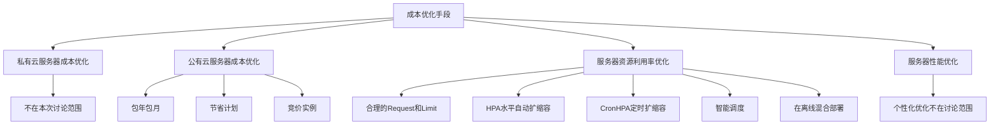

### 2.2 公有云服务器成本优化

#### 2.2.1 包年包月
- **优点**：稳定性高、价格实惠
- **缺点**：弹性不足，晚上缩容基本无法实现

#### 2.2.2 节省计划
- **机制**：承诺每小时最低消费换取折扣
- **优点**：稳定性有保障，服务器可随意伸缩
- **限制**：每小时总消费不能低于承诺消费，一般按最低需求购买

#### 2.2.3 竞价实例
- **定价**：云厂商闲置实例通过固定折扣或竞价方式出售
- **折扣力度**：通常1-2折
- **优点**：价格最便宜，按需部署灵活
- **缺点**：不稳定，随时可能被回收
- **要求**：对技术能力和服务质量要求较高

### 2.3 服务器资源利用率优化

#### 2.3.1 合理的Request和Limit

**配置策略（两步法）：**

**第一步：设置初始值**
- 根据应用画像和过往负载设置初始值
- 示例：某服务历史最高峰CPU使用2核
  - 核心服务：增加50%冗余 → Request = 3核
  - 非核心服务：增加30%冗余 → Request = 2.6核

**第二步：建立巡检机制**
- 定期巡检，根据实际负载和策略动态调整
- 官方VPA不适用生产环境的原因：
  - 缺乏个性化手段
  - 修改Request需要重启Pod（生产环境不可接受）
- 解决方案：二开或自研，实现原地升降配或优化计算算法

#### 2.3.2 HPA（水平自动扩缩容）

- **机制**：配置指标和阈值，超过阈值自动扩容，低于阈值自动缩容
- **示例**：CPU高于30%扩容，降到15%以下缩容
- **优点**：应对突发流量效果好
- **缺点**：扩容有滞后性，负载增长过快可能导致短时间故障或雪崩

#### 2.3.3 CronHPA（定时水平扩缩容）

- **机制**：设定时间点和副本数，到时间自动扩缩容
- **适用场景**：可预期或计划内的场景

#### 2.3.4 智能调度

- **核心思想**：根据公司实际需求增强调度器
- **优化方向**：
  - 增加实际负载感知
  - 增加权重计算
  - 增加更多维度
  - 优化队列算法
- **效果**：提升节点资源利用率

#### 2.3.5 在离线混合部署

- **原理**：利用离线任务可中断及高峰期与在线服务相反的特点
- **优点**：充分利用服务器资源，大幅提升利用率
- **挑战**：技术实现难度大

## 三、货拉拉成本优化演进路线

### 3.1 整体演进路径


**图例说明：**
- 绿色：已完成
- 黄色：进行中
- 橙色：规划中（2023年完成）

### 3.2 演进策略详解

1. **节省计划**：以优惠价格保证基础算力和稳定性
2. **竞价实例**：低价且弹性伸缩，保证弹性算力
3. **定时扩缩容**：解决低峰期资源浪费问题
4. **智能Request**：通过应用画像和历史指标计算合理的Request和Limit，提高高峰期节点利用率
5. **智能调度**：进一步优化资源分配
6. **在离线混合部署**：榨干服务器最后一滴性能（最后一公里，也是最难的）

## 四、竞价实例深度实践

### 4.1 竞价实例原理

#### 4.1.1 竞价实例的由来

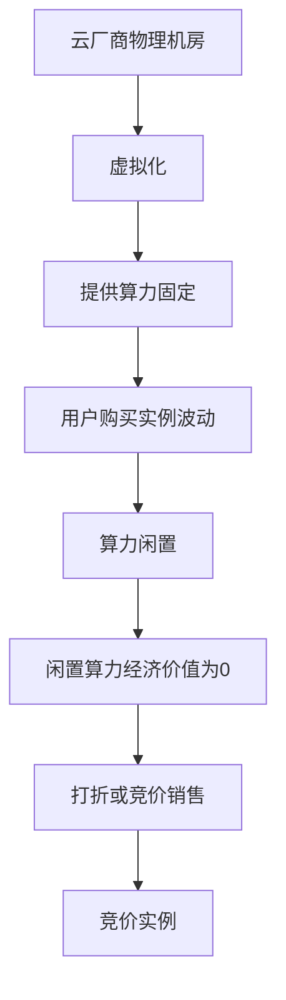

#### 4.1.2 竞价实例定价方式

**方式一：固定折扣**
- 目前基本都是2折
- 简单易理解

**方式二：竞价机制**

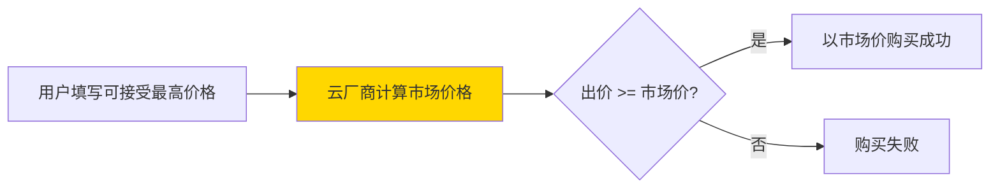

**竞价机制特点：**
- 定价算法是黑盒，只有云厂商知道
- 价格范围：最低1折，最高等于原价（早期可能超过原价，现已取消）

### 4.2 竞价实例工作流程

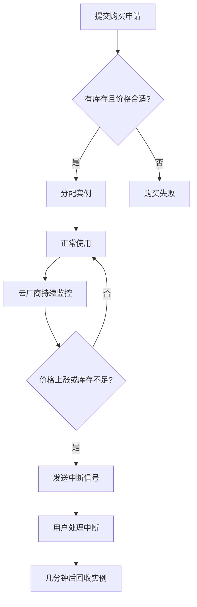

#### 4.2.1 不同云厂商回收机制差异

- **AWS**：有预测算法，预测到库存可能不足时提前通知，反应时间更多
- **阿里云**：提供1小时保护机制，第一个小时无论如何都不会被回收
- **共同点**：所有云厂商都不会等用户处理完再回收

**关键挑战：** 应对突然中断的措施必须足够快，才能避免对业务产生影响

### 4.3 竞价实例特点总结

| 特点 | 说明 | 影响 |
|------|------|------|
| **性价比高** | 相比按需实例10-20%，相比预留实例30-60% | ✅ 优化目标 |
| **库存无保障** | 闲置资源打折出售，没有闲置就无法购买 | ⚠️ 需要解决 |
| **随时中断** | 库存不足或出价低于市场价时随时回收 | ⚠️ 需要解决 |

### 4.4 竞价实例在K8s中的落地架构

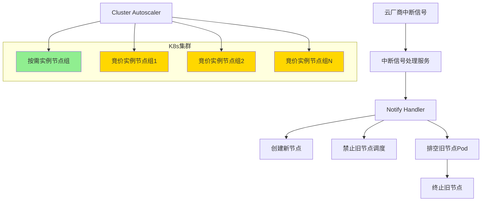

**架构说明：**

1. **节点组分类**：
   - 按需实例节点组：稳定节点，部署不适合竞价实例的服务
   - 竞价实例节点组：弹性节点，部署适合竞价实例的服务

2. **为什么需要按需实例节点组？**
   - 并非所有服务都适合部署在竞价实例上
   - 竞价实例库存不足时，按需实例提供算力支持

3. **中断处理**：
   - 托管集群：云厂商自动处理中断信号
   - 自建集群：需自己实现中断信号处理服务

4. **货拉拉的实践**：
   - 虽然是托管集群，仍自研Notify Handler
   - 目的：收集中断信号，监控中断频率，用于告警和应急预案

### 4.5 中断信号处理流程

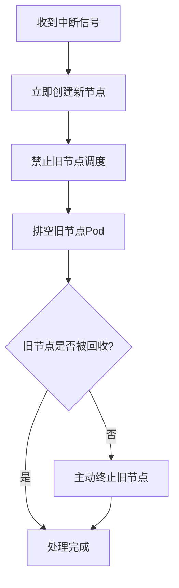

**流程说明：**
- 整个过程借助K8s相对简单
- 但实际使用中有不少优化点

### 4.6 竞价实例五大优化点

#### 优化点1：增加竞价实例型号

**背景：** 竞价实例库存无保障

**策略：** 扩大资源池，池子越大，库存不足概率越低

**实施方法：**
- 覆盖更多可用区
- 覆盖更多实例型号

**限制：** 受Cluster Autoscaler限制，同一节点组内CPU和内存必须一致

#### 优化点2：设置节点组优先级

**目标：**
- 资源不足时优先弹出竞价实例
- 竞价实例无法弹出时才弹出按需实例
- 最大化利用竞价实例，同时保证业务稳定

**实现方式：**

```yaml
# Cluster Autoscaler配置
nodeGroups:
  - name: spot-instance-group
    priority: 20  # 竞价实例优先级
  - name: on-demand-group
    priority: 10  # 按需实例优先级
```

**效果：** CA优先弹出竞价实例，弹不出时才使用按需实例

#### 优化点3：配置Pod亲和性

**背景：**
- 竞价实例随时可能中断
- 同一型号节点可能同时中断

**目标：** 避免同一服务所有Pod被同时驱逐，造成服务不可用

**策略：** 把鸡蛋放在不同篮子里，分散Pod到：
- 不同可用区
- 不同实例型号
- 不同实例

**实现方式：**

```yaml
affinity:
  podAntiAffinity:
    preferredDuringSchedulingIgnoredDuringExecution:
    - weight: 100  # 最大权重
      podAffinityTerm:
        topologyKey: topology.kubernetes.io/zone  # 可用区
    - weight: 80
      podAffinityTerm:
        topologyKey: node.kubernetes.io/instance-type  # 实例型号
    - weight: 60
      podAffinityTerm:
        topologyKey: kubernetes.io/hostname  # 实例名
```

**效果：** 尽量将同一App的Pod分散到不同可用区 → 不同实例类型 → 不同实例

#### 优化点4：配置PDB（Pod Disruption Budget）

**背景：** 前面措施无法百分之百避免同一服务Pod同时被驱逐

**目标：** 保证同一时间有足够副本可用

**实现方式：**

```yaml
apiVersion: policy/v1
kind: PodDisruptionBudget
metadata:
  name: app-pdb
spec:
  minAvailable: 70%  # 至少保证70%副本可用
  selector:
    matchLabels:
      app: myapp
```

**效果：**
- 保证至少70%副本正常
- 遇到同时驱逐情况，K8s滚动驱逐
- 整个过程服务保持可用

**注意事项：**
- 并发驱逐变成串行，影响排空节点时间
- 可能导致节点未排空就被回收
- 要求服务启动速度足够快，能在节点回收前完成迁移

#### 优化点5：利用低优先级Pod预留空间

**背景：**
- 竞价实例从收到中断信号到被回收只有2-3分钟
- 创建新节点需要几十秒到1-2分钟
- 等新节点准备好浪费很多时间

**目标：** 收到中断信号时直接排空旧节点，无需等待新节点

**原理：** K8s Pod优先级机制，高优先级Pod可抢占低优先级Pod

**实现架构：**

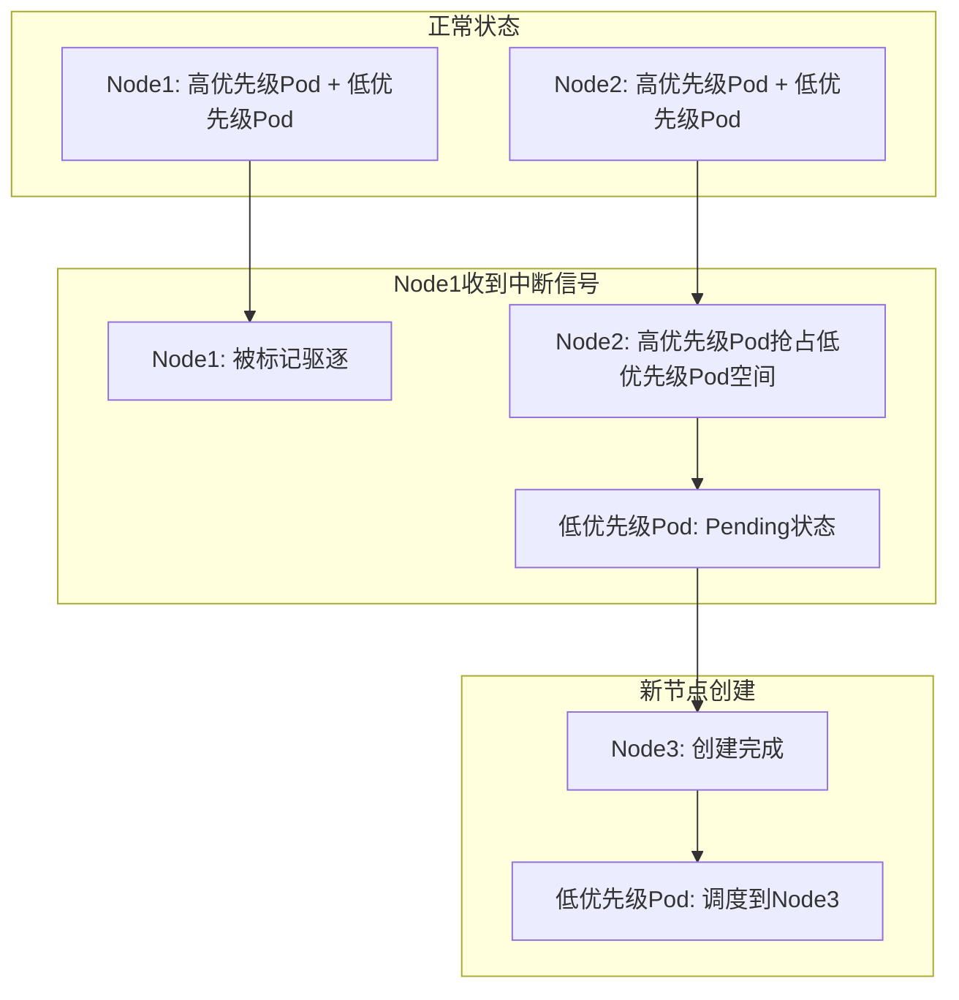

**低优先级Pod配置：**

```yaml
apiVersion: v1
kind: Pod
metadata:
  name: placeholder-pod
spec:
  priorityClassName: low-priority  # 低优先级
  containers:
  - name: pause
    image: pause
    resources:
      requests:
        cpu: "1"
        memory: "1Gi"
```

**PriorityClass配置：**

```yaml
apiVersion: scheduling.k8s.io/v1
kind: PriorityClass
metadata:
  name: low-priority
value: -1  # 负数优先级，可以是任何比正常Pod低的值
globalDefault: false
```

**关键点：**
- 低优先级Pod只运行阻塞进程，不消耗实际资源
- 但会占用节点Request份额
- 高优先级Pod可直接抢占，实现快速启动
- 低优先级Pod变为Pending，触发节点扩容，创建新的预留空间

### 4.7 不适合部署在竞价实例上的服务

| 服务类型 | 原因 |
|---------|------|
| **有状态服务** | 建立和恢复不够灵活，容易出现问题 |
| **启动时间过长的服务** | 无法在实例回收前启动完成 |
| **无法容忍非优雅停止的服务** | 无法完全杜绝实例未排空就被回收 |
| **大部分数据库** | 稳定性要求高，中断即挂 |

## 五、定时扩缩容（CronHPA）实践

### 5.1 优化背景

#### 5.1.1 未优化集群的CPU利用率

货拉拉某未优化集群的CPU利用率现状：

- **白天高峰期**：CPU利用率35%
- **半夜低峰期**：CPU利用率2.5%
- **凌晨2点小高峰**：大量定时任务执行（可暂不考虑）

**评估：**
- 虚拟机时代：勉强可接受
- 云原生时代：存在很大优化空间

#### 5.1.2 优化目标

- **高峰期CPU利用率**：提升到50%
- **低峰期CPU利用率**：提升到30%

#### 5.1.3 利用率低的原因分析

**高峰期利用率低（35%）的原因：**

1. **Request设置不合理**
   - 人工设置每个服务的Request
   - 为保证稳定性，有意无意往高预估
   - 缺乏弹性伸缩能力（未开启HPA）
   - 需要为突增流量增加额外buffer
   - 最终配置的Request是实际最高负载的2.8倍

2. **缺乏弹性伸缩**
   - 连HPA都没有开启
   - 无法应对流量变化

**低峰期利用率低（2.5%）的原因：**
- 流量降下来后，Pod数量没有相应减少
- 资源利用率极低

### 5.2 HPA实践中遇到的问题

#### 问题1：扩容滞后性

**现象：**
- 每天早上9点和下午2点流量迅速上升
- HPA需要等负载触发阈值后才扩容
- 大量扩容需要大量扩节点
- 扩容速度慢，产生报错和告警

#### 问题2：扩容阈值受限

**矛盾1：最小副本数设置困难**
- 白天需要100个Pod
- 不能晚上缩成2个（早上需扩容98个，太慢）
- 导致晚上CPU利用率升不上去

**矛盾2：CPU阈值设置困难**
- 阈值设置太高：扩容迟钝
- 阈值设置太低：高峰期利用率上不去
- 示例：阈值设为35%，Pod CPU使用率基本不超过35%（超过就扩容，利用率被拉下来）

#### 问题3：扩容策略不可控

**问题：**
- HPA完全根据指标和阈值扩容
- 无法根据企业特点定制策略

**货拉拉的需求：**
- 白天流量稳定，宁可浪费点资源，也不想频繁扩容影响稳定性
- HPA没有提供这样的配置

### 5.3 货拉拉的弹性伸缩方案

#### 5.3.1 方案组合

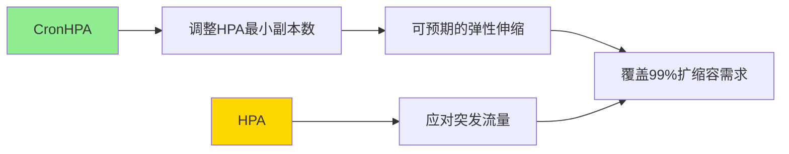

**核心思想：**
- **CronHPA**：根据设定时间点调整HPA最小副本数，实现可预期或计划内的弹性伸缩
- **HPA**：保留自动扩缩容能力，解决1%的偶发流量突增问题

#### 5.3.2 CronHPA的优势

**基于货拉拉流量规律特点：**
- 定时 + 过往指标分析 + 简单预测算法
- 实现高质量的预扩容和定时缩容

**具体实践：**

1. **预扩容**
   - 早上9点流量快速上升
   - 7-8点提前扩容到高峰期水平
   - 避免扩容滞后问题

2. **定时缩容**
   - 晚上10点后流量已降低
   - 放心缩容
   - 有预扩容打底，晚上可缩到极低水平，不担心白天来不及扩容

3. **操作HPA而非Deployment**
   - CronHPA不直接操作Deployment副本数
   - 而是操作HPA的最小副本数
   - 原因：CronHPA覆盖99%需求，但仍需HPA处理1%的偶发流量突增

4. **降低Buffer需求**
   - 有HPA兜底，缩容或设置最高峰副本数时无需为偶发流量突增增加额外buffer
   - 提升整体资源利用率

### 5.4 CronHPA架构设计

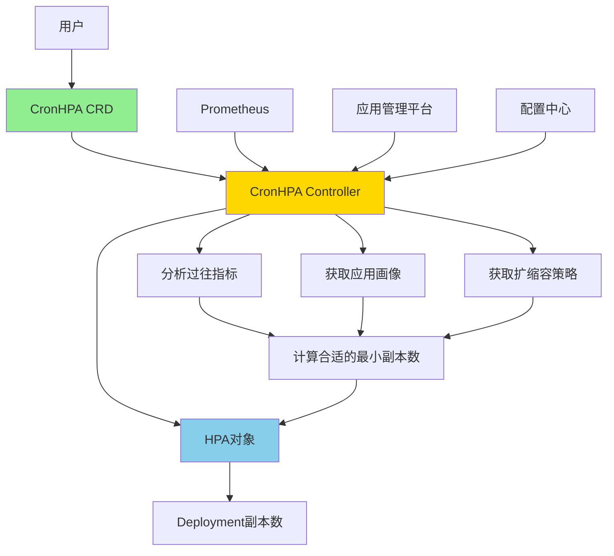

**架构说明：**

1. **CRD定义**：用户设置CronHPA CRD，不直接设置HPA和Deployment副本数

2. **Controller监听**：CronHPA Controller监听CRD对象变化

3. **同步HPA**：发现新增或更新时，同步修改或创建HPA对象
   - 除最小副本数外，其他配置直接透传
   - 所有业务逻辑体现在HPA最小副本数的变化上

4. **业务逻辑**：
   - 从Prometheus拉取过往指标
   - 从应用管理平台拉取应用画像
   - 从配置中心拉取扩缩容策略
   - 综合分析后，在合适时间点为HPA设置合适的最小副本数

#### 5.4.1 业务逻辑示例

**场景：** 某服务设置了晚上需要缩容

**分析过程：**

| 数据来源 | 分析结果 |
|---------|---------|
| 过往夜间资源利用率 | 晚上只需要2个副本 |
| 应用画像 | 该服务是核心服务 |
| 配置中心扩缩容策略 | 核心服务最低不能少于5个副本 |

**综合结论：** 夜间设置最小副本数为5个

### 5.5 CronHPA实现路线

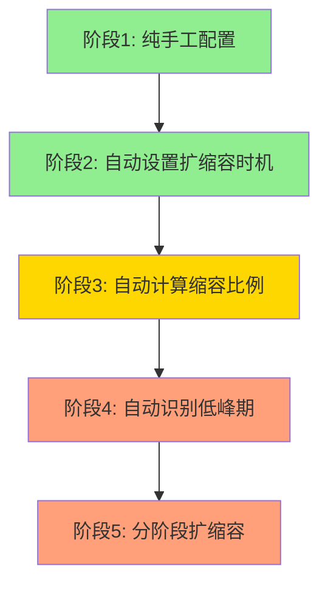

#### 阶段1：纯手工配置（已完成）

**实现方式：**
- 人肉分析流量，设置全局缩容和扩容时间点
- 每个服务根据经验人工估算缩容比例

**问题：**
- 全局同一时间点同时扩缩容，对基础设施压力大
- 人工估算的缩容比例过于保守

#### 阶段2：自动设置扩缩容时机（已完成）

**改进：**
- 根据过往指标分析，自动设置扩缩容时机
- 有效分散扩缩容压力
- 扩缩容时间更加合理

**示例：**
- 某服务6点已无流量
- 阶段1：需等到10点统一缩容
- 阶段2：6点即可缩容

#### 阶段3：自动计算缩容比例（进行中）

**背景：** 人工估算缩容比例过于保守

**示例：**
- 高峰期100个Pod
- 实际晚上只需10个Pod
- 人工评估：保守设为50个Pod
- 算法计算：科学计算为10个Pod

**持续优化：**
- 通过分析过往指标不断修正
- 示例：算法计算为2个Pod，但过去7天每晚都通过HPA扩到3个Pod
- 修正：将低峰期最小副本数直接设为3个

#### 阶段4：自动识别低峰期（规划中）

**改进：**
- 原来手动设置低峰期时间段，程序从中选择扩缩容时机
- 现在自动识别每个服务自己的业务低峰期
- 实现个性化缩容

#### 阶段5：分阶段扩缩容（规划中）

**背景：**
- 前面阶段都是确定一个时间点，直接扩缩到目标副本数
- 实际流量是逐渐变化的

**改进：**
- 高峰期来临前，随着流量上升，逐步提升副本数
- 低峰期，随着流量降低，逐步降低副本数

**与HPA的区别：**
- HPA：基于指标和阈值
- CronHPA：基于预测
- 能够预测的原因：货拉拉流量很有规律

### 5.6 弹性伸缩未来规划

**愿景：全自动弹性伸缩闭环**

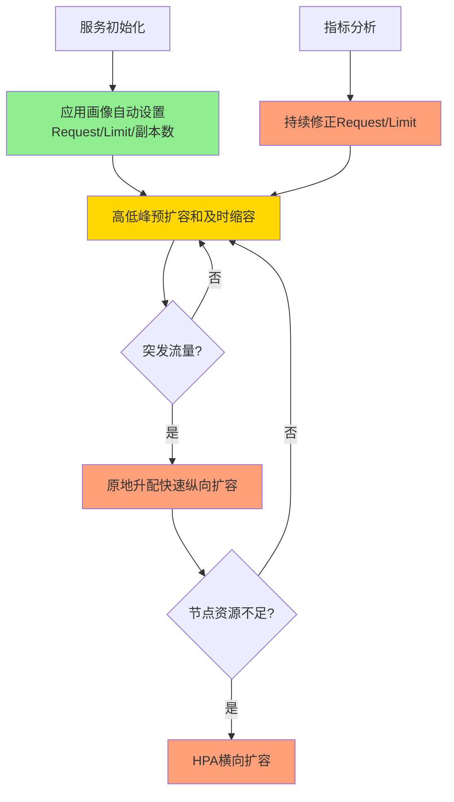

**核心机制：**

1. **服务初始化**：通过应用画像自动设置Request、Limit、副本数

2. **高低峰自动调整**：通过过往指标分析和算法，实现预扩容和及时缩容

3. **突发流量应对**：
   - 原地升配：快速纵向扩容（不需要重启Pod）
   - HPA：节点资源不足时横向扩容

4. **持续优化**：根据指标分析，不断修正服务的Request和Limit

5. **原地升配与VPA的区别**：
   - VPA：修改Request需要重启Pod
   - 原地升配：不需要重启Pod，直接修改cgroup限制

**目标：** 人工干预越少越好，最终实现全自动智能计算

## 六、成本优化效果总结

### 6.1 优化前后对比

| 指标 | 优化前 | 优化目标 | 优化效果 |
|------|--------|----------|----------|
| 高峰期CPU利用率 | 35% | 50% | 持续优化中 |
| 低峰期CPU利用率 | 2.5% | 30% | 持续优化中 |
| Request配置 | 实际负载的2.8倍 | 合理配置 | 通过智能Request优化中 |
| 服务器成本 | 按需实例价格 | 降低60-90% | 通过竞价实例实现 |

### 6.2 关键成果

1. **竞价实例应用**
   - 价格降至按需实例的10-20%
   - 价格降至预留实例的30-60%
   - 实现零故障运行

2. **定时扩缩容**
   - 解决低峰期资源浪费问题
   - 解决高峰期扩容滞后问题
   - 覆盖99%的扩缩容需求

3. **智能Request**（进行中）
   - 基于应用画像和历史指标
   - 自动计算合理的Request和Limit
   - 提高高峰期节点资源利用率

4. **未来规划**（2023年完成）
   - 智能调度
   - 在离线混合部署
   - 榨干服务器最后一滴性能

## 七、Q&A精选

### Q1: 中小企业怎么做容器化选型和架构改造？

**建议：**

1. **不建议自研K8s**
   - 中小企业特点：船小好掉头，但人力有限
   - 选择合适的云厂商，全部使用其产品

2. **聚焦核心**
   - 集中火力让服务稳定跑在K8s上
   - 吃透这方面后，再考虑从云厂商接手部分功能

3. **逐步定制**
   - 根据需要逐步自研和定制
   - 避免一开始就全面铺开

### Q2: Pod怎么实现原地升降配？

**实现原理：**

1. **cgroup限制**
   - Pod在节点上运行，本质上靠cgroup限制CPU和内存
   - 只要修改cgroup参数，就可以放大CPU和内存

2. **DaemonSet实现**
   - 每个节点部署DaemonSet
   - DaemonSet修改Pod的cgroup参数
   - 直接放大CPU和内存

3. **API Server同步**
   - 本地cgroup的Request总额与API Server不一致
   - 解决方案：往API Server上传一个假的Pod
   - 示例：从1核扩到2核，再往API Server丢一个1核的Pod
   - API Server以为有两个1核Pod，实际只有一个2核Pod

### Q3: 云原生架构下开发和运维的工作职责冲突怎么解决？

**解决方案：**

1. **运维开发团队**
   - 对开发屏蔽所有K8s细节
   - 让开发在稍微了解K8s的情况下就可以发代码

2. **职责划分**
   - 运维：维护K8s稳定性，做好监控告警和应急处理
   - 开发：专注业务开发

3. **降低门槛**
   - 通过工具和平台降低开发使用K8s的门槛

### Q4: CronHPA的预测算法具体是什么？

**算法说明：**

1. **算法简单**
   - 因为流量非常稳定，不需要高深算法

2. **计算方法示例**
   - 白天：10个Pod，每个2核，共20核
   - 晚上：总核数只用了4核
   - 结论：晚上只需2个Pod（4核/2核）
   - 直接缩成2个Pod

3. **为什么简单算法有效**
   - 货拉拉流量规律性强
   - 可预测性高
   - 简单算法即可达到很好效果

---

## 八、核心要点总结

### 8.1 成本优化三大支柱

1. **公有云服务器成本优化**
   - 节省计划保基础
   - 竞价实例降成本（1-2折）
   - 按需实例做兜底

2. **服务器资源利用率优化**
   - Request/Limit合理配置
   - CronHPA定时扩缩容
   - HPA应对突发流量
   - 智能调度（规划中）
   - 在离线混合部署（规划中）

3. **自动化与智能化**
   - 全自动弹性伸缩闭环
   - 人工干预最小化
   - 持续优化迭代

### 8.2 竞价实例成功应用的关键

1. **架构设计**
   - 按需实例 + 竞价实例混合
   - 节点组优先级配置
   - 中断信号处理机制

2. **五大优化措施**
   - 增加实例型号和可用区
   - 设置节点组优先级
   - 配置Pod亲和性
   - 配置PDB
   - 利用低优先级Pod预留空间

3. **服务筛选**
   - 识别不适合竞价实例的服务
   - 合理分配服务到不同节点组

### 8.3 CronHPA成功实践的关键

1. **结合业务特点**
   - 货拉拉流量规律明显
   - 可预测性强
   - 适合定时扩缩容

2. **与HPA配合**
   - CronHPA覆盖99%需求
   - HPA处理1%突发流量
   - 两者互补，效果最佳

3. **持续迭代**
   - 从手工配置到全自动
   - 从全局策略到个性化
   - 从一次性到分阶段

### 8.4 可借鉴的经验

1. **了解自身业务特点**
   - 流量规律
   - 资源使用特点
   - 业务稳定性要求

2. **选择合适的优化策略**
   - 不是所有策略都适合所有企业
   - 根据实际情况选择和组合

3. **循序渐进**
   - 先解决最明显的问题
   - 逐步深入优化
   - 持续迭代改进

4. **关注稳定性**
   - 成本优化不能以牺牲稳定性为代价
   - 做好监控和应急预案
   - 充分测试和验证

---

**分享总结：** 货拉拉通过竞价实例 + CronHPA + HPA的组合，在保证业务稳定性的前提下，实现了显著的成本优化。关键在于深入理解业务特点，选择合适的技术方案，并持续迭代优化。未来将继续在智能调度和在离线混合部署方向深入探索，进一步提升资源利用率。

