# 分布式链路追踪系统在中信银行的落地实践

> 来源：未核验 · 类型：分享 · 状态：draft


## 一、分布式追踪原理

### 1.1 分布式追踪概念

#### 1.1.1 定义与作用

**分布式追踪**是一个分布式请求追踪系统，用来监控应用，实现故障定位和性能分析的效果。

根据OpenTracing的定义，分布式追踪负责处理请求范围内的信息集合，获取的元数据局限于请求范围内。

#### 1.1.2 三大可观测性支柱

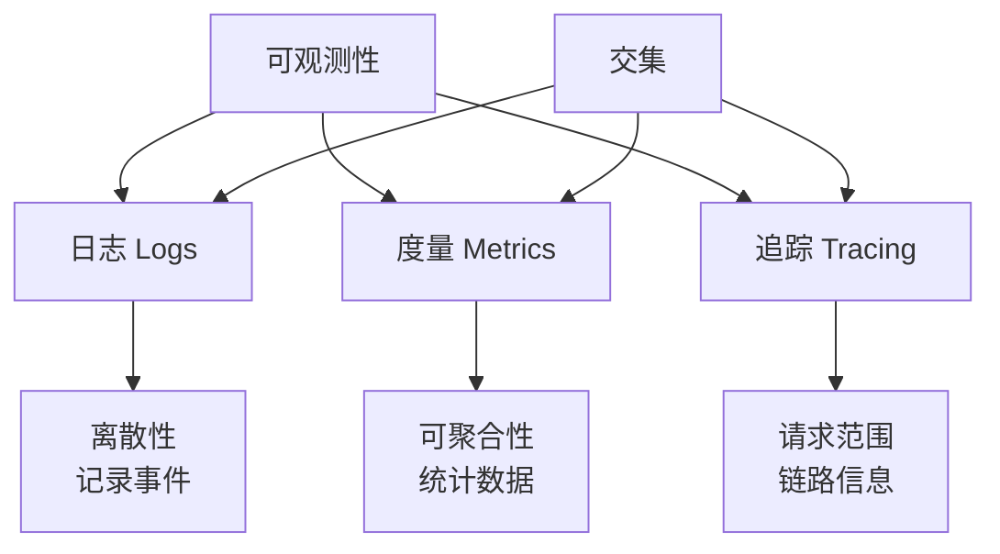

**三大支柱特点**:

- **日志**: 离散性，记录系统事件
- **度量**: 可聚合性，提供统计数据
- **追踪**: 处理请求范围内的信息集合

### 1.2 Dapper模型

#### 1.2.1 Dapper论文背景

2010年，谷歌将其分布式追踪系统Dapper的设计思想和工程实践作为论文发表，奠定了分布式追踪的基础。

#### 1.2.2 Span基本概念

**Span**是分布式追踪的基本单元，包含以下信息：

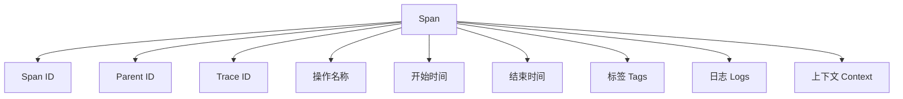

#### 1.2.3 链路串联原理

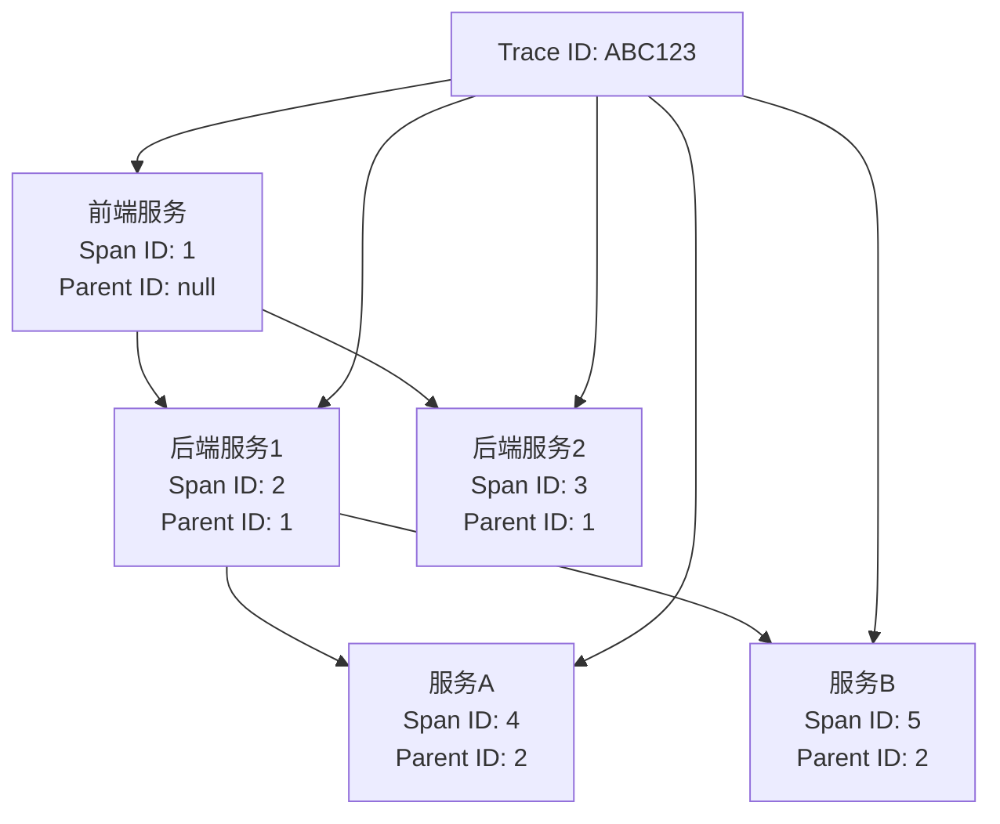

**关键要点**:

- 通过Span ID和Parent ID建立父子关系
- Trace ID贯穿整条链路，用于链路串联
- 根节点Span的Parent ID为null

### 1.3 OpenTracing模型

#### 1.3.1 模型特点

OpenTracing模型衍生于Dapper模型，很多概念都来自Dapper论文。

**重要说明**: OpenTracing已与OpenCensus合并为OpenTelemetry，由CNCF社区维护，OpenTracing项目已处于归档阶段。

#### 1.3.2 Span关系类型

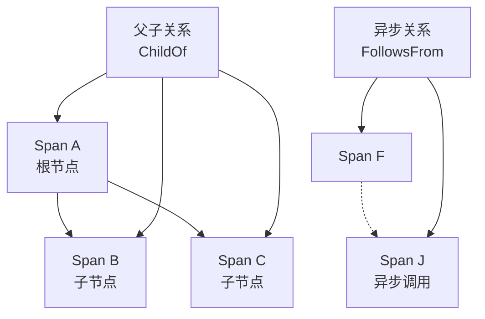

**关系类型**:

- **ChildOf**: 父子关系，同步调用
- **FollowsFrom**: 异步关系，异步调用

#### 1.3.3 Span组成要素

| 要素                | 说明                 | 示例               |
| ------------------- | -------------------- | ------------------ |
| **操作名称**  | Span的操作标识       | HTTP请求、RPC调用  |
| **开始时间**  | Span开始执行时间     | 时间戳             |
| **Tags**      | 请求过程中的元数据   | 交易流水号、用户ID |
| **Logs**      | 调用中发生的日志集合 | 错误堆栈信息       |
| **Context**   | Span上下文信息       | 用于链路信息传递   |
| **Reference** | Span之间的关系       | 父子关系、异步关系 |

### 1.4 SkyWalking Span信息获取

#### 1.4.1 代码埋点方式

SkyWalking采用代码埋点的方式进行链路信息采集：

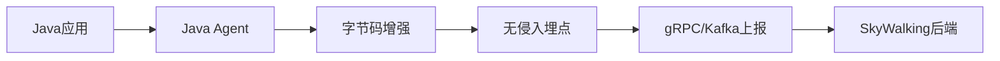

**上报方式**:

- **gRPC**: 中信银行采用的上报方式
- **Kafka**: 备选的上报方式，适用于大流量场景

#### 1.4.2 跨进程传输协议

SkyWalking设计了跨进程传输协议，实现Span上下文的传递：

- **SW8协议**: 跨进程传输协议
- **跨线程传输协议**: 处理跨线程调用
- **API支持**: 提供协议生成和解析API

#### 1.4.3 字节码增强技术

**技术特点**:

- 采用ByteBuddy字节码技术
- 设计了一套字节码增强框架
- **SPI扩展机制**: 通过SPI（Service Provider Interface）技术支持埋点多样性
- **插件化开发**: 用户可开发字节码插件，针对特定代码进行个性化拦截
- **无侵入埋点**: 无需修改应用代码即可实现埋点

#### 1.4.4 Span类型

SkyWalking定义了三种Span类型：

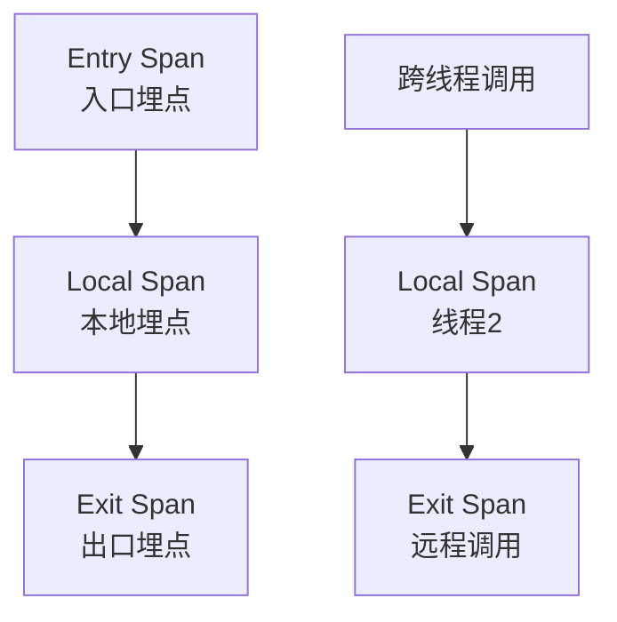

**Span类型说明**:

- **Entry**: 请求入口，服务接收请求
- **Local**: 进程内方法调用埋点（可选）
  - 用于跨线程调用场景
  - 如果线程内不发生远程调用，Local Span可有可无
  - 根据开发人员需要进行埋点
- **Exit**: 请求出口，远程调用

#### 1.4.5 跨线程调用处理

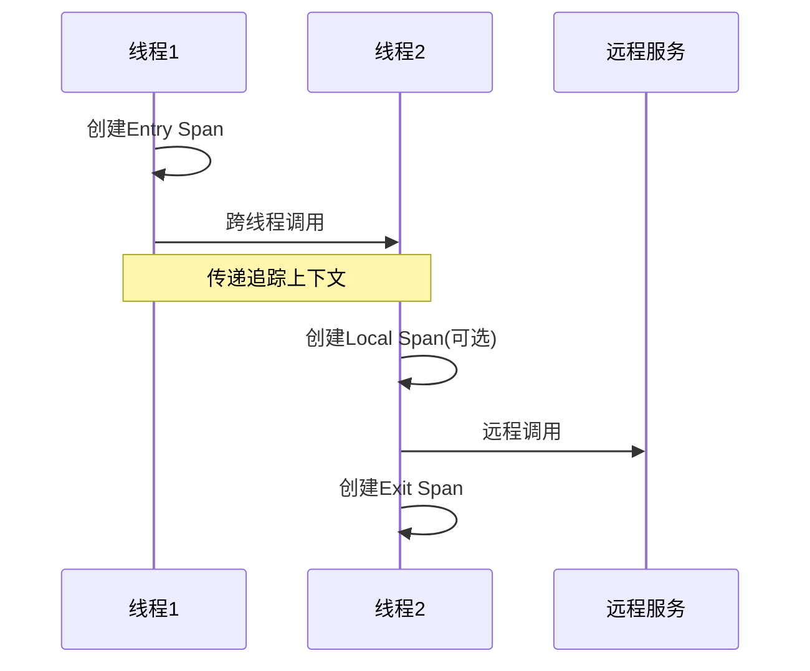

**跨线程调用说明**:

- 基于ThreadLocal保存Span Context
- 通过跨线程传输协议传递追踪上下文
- 线程2基于传递的上下文创建Local Span
- 如果线程2不发生远程调用，可跳过Local Span
- 发生远程调用时，基于Entry Span上下文创建Exit Span

## 二、分布式追踪落地实践

### 2.1 引入背景

#### 2.1.1 Service Mesh架构转型

中信银行总行软件开发中心引入Service Mesh，步入架构转型之路。分布式追踪是Service Mesh可观测性的重要组成部分。

#### 2.1.2 Service Mesh架构特点

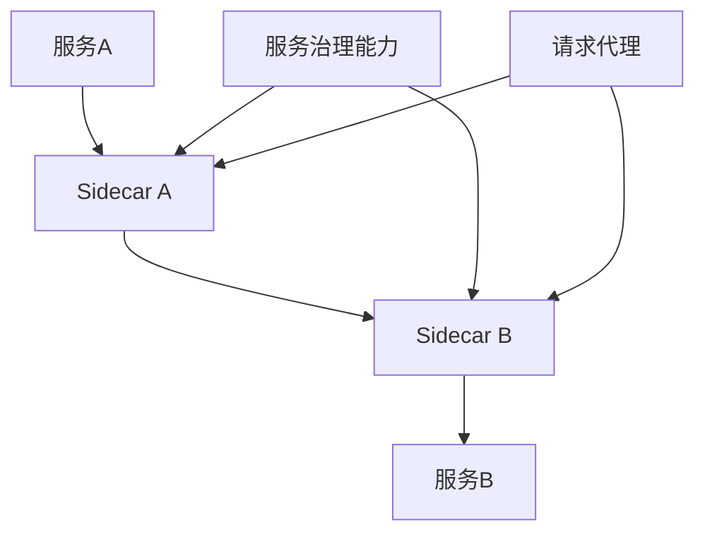

**Service Mesh特点**:

- 每个服务加入Sidecar代理
- Sidecar负责服务治理能力
- 增加调用链路长度，提升运维成本

#### 2.1.3 技术选型

**选择SkyWalking的原因**:

- 基于SkyWalking项目
- 贴合云原生OpenTracing标准
- 成熟度高
- 支持Java无侵入埋点

**落地成果**:

- **核心系统投产**: 中信银行交易量最大的核心交易系统已经接入Service Mesh
- **生产环境运行**: 已成功投产并稳定运行

### 2.2 引入价值

#### 2.2.1 故障定位

**核心价值**:

- 请求链路追踪
- 记录请求过程中的各种事件
- 根据异常或响应码判断服务状态
- 故障定位时间达到秒级

#### 2.2.2 依赖梳理

**功能特点**:

- 记录请求链路经过的服务
- 记录被调用接口信息
- 形成服务调用关系图
- 提供接口依赖关系数据源

#### 2.2.3 性能分析

**分析指标**:

- 服务响应时间
- 分段耗时统计
- 服务实例响应时间排序
- 服务慢接口排序

**应用场景**:

- 链路性能问题分析
- 生产性能瓶颈分析
- 智能运维数据源

### 2.3 部署架构

#### 2.3.1 整体架构

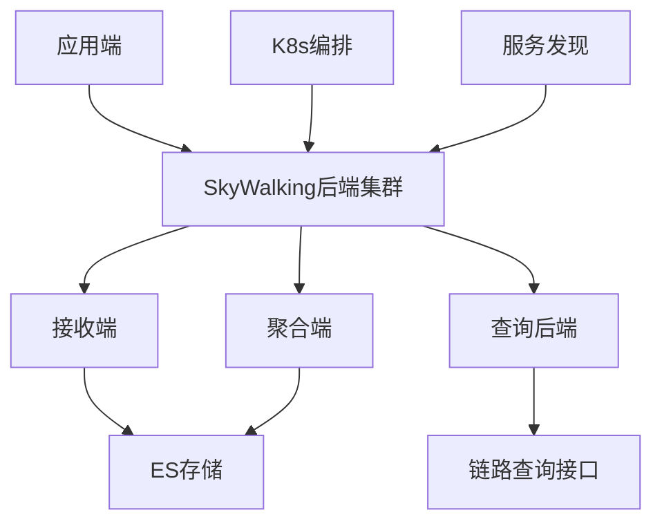

**部署特点**:

- 基于K8s容器编排
- 三个机房部署（同城机房+异地灾备）
- ES作为数据存储
- 动态域名实现双活

#### 2.3.2 组件功能

| 组件               | 功能               | 说明                           |
| ------------------ | ------------------ | ------------------------------ |
| **接收端**   | 数据收集与一次聚合 | 负责数据度量和追踪信息存储     |
| **聚合端**   | 度量数据二次聚合   | 对度量数据进行二次聚合并持久化 |
| **查询后端** | 数据查询接口       | 通过格式化API提供数据查询接口  |

### 2.4 系统接入

#### 2.4.1 Java应用接入

**接入要求**:

- JDK版本升级到1.8及以上
- 主要针对Java应用

#### 2.4.2 通信协议处理

**场景一：CRPC协议**

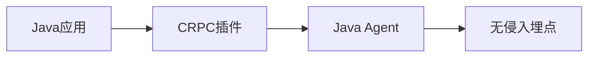

**场景二：自定义报文转换**

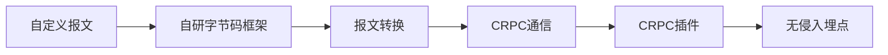

**场景三：Service Mesh Sidecar**

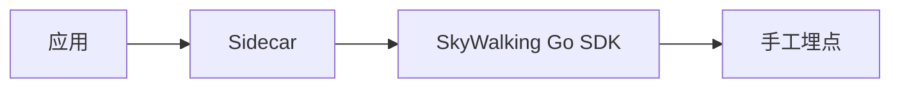

#### 2.4.3 容器环境接入

**接入方式**:

- **CI/CD集成**: 结合一站式开发作业平台
  - 提供创建服务、代码生成能力
  - CI/CD流程自动注入SkyWalking配置
  - 部署时引入SkyWalking Agent
- **WebHook注入**: 基于K8s WebHook机制在应用部署过程中透明注入（备选方案）

**K8s Sidecar特性**:

```yaml
apiVersion: v1
kind: Pod
spec:
  containers:
  - name: app
    env:
    - name: JAVA_OPTS
      value: "-javaagent:/skywalking/agent/skywalking-agent.jar"
    - name: APP_NAME
      value: "service-identifier"
    - name: POD_NAME
      valueFrom:
        fieldRef:
          fieldPath: metadata.name
    - name: APP_ENV
      value: "production"
  - name: skywalking-agent
    image: skywalking-agent:latest
    volumeMounts:
    - name: shared-volume
      mountPath: /shared
```

**环境变量说明**:

- **JAVA_OPTS**: JVM启动参数，加载Java Agent
- **APP_NAME**: 自定义变量，服务唯一标识
- **POD_NAME**: Pod名称作为实例名称
- **APP_ENV**: 环境标识（功能、性能、准投产）

**官方文档参考**:

- [SkyWalking容器环境部署文档](https://skywalking.apache.org/docs/)
- [SkyWalking官方Demo体验](https://skywalking.apache.org/zh/2020-04-19-skywalking-quick-start/)

### 2.5 使用实践

#### 2.5.1 Trace ID与日志集成

**集成价值**:

- 将Trace ID打印到日志中
- 实现追踪和日志的关联
- 便于从链路追踪页面跳转到日志系统
- 查看更详细的业务处理信息

**实现方式**:

- **官方SDK**: SkyWalking提供日志打印SDK
- **字节码技术**: 基于字节码技术实现无侵入
- **框架支持**: 支持Logback、Log4j等主流日志框架
- **自定义集成**: 可集成到行内自研日志组件，通过日志规范进行规约

#### 2.5.2 追踪功能

**追踪视图类型**:

- **列表视图**: 按时间维度展示Span
- **树结构**: 层级关系展示
- **表格视图**: 详细信息展示

**追踪信息包含**:

- Trace ID
- 链路起始时间
- 整个链路执行时间
- 包含Span数量
- 不同服务颜色区分
- 埋点类型展示

**Trace ID应用**:

- 结合公司内部日志框架，将Trace ID打印到日志中
- 实现追踪和日志的关联查询
- 从链路追踪页面跳转到日志系统进行深度分析

#### 2.5.3 故障定位

**故障定位流程**:


**错误信息包含**:

- 响应码
- 错误堆栈信息
- 故障注入信息

#### 2.5.4 拓扑功能

**拓扑图特点**:

- 服务间调用关系可视化
- 全局唯一服务名称标识
- 支持按组名和服务名搜索
- 虚拟User节点标记请求起点

**Service Mesh拓扑**:

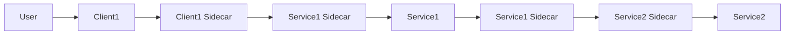

## 三、未来展望

### 3.1 Satellite方案

#### 3.1.1 当前方案vs Satellite方案

**当前方案架构**:


**当前方案采样率设置**:

- **Agent端**: 可在Agent端设置采样率
- **接收端**: 可在接收端设置采样率（官方推荐）

**Satellite方案架构**:


**Satellite方案采样率设置**:

- **Satellite端**: 采样率设置前移到Satellite这一段
- **靠近应用端**: 更接近数据源，减少数据传输量

#### 3.1.2 Satellite优势

**核心优势**:

- 减少Trace上报量
- 节约带宽资源
- 采样率设置前移到应用端
- 聚合能力下移到应用方

**Satellite项目信息**:

- **GitHub地址**: [apache/skywalking-satellite](https://github.com/apache/skywalking-satellite)
- **最新版本**: 0.5.0

### 3.2 定制化工作

#### 3.2.1 冷热存储分离

**存储策略**:

- **当前**: 生产数据存储4天
- **优化**: 热存储1天，冷存储长期保存
- **目标**: 提高ES性能

#### 3.2.2 管理控制台

**管控能力**:

- 接入SkyWalking应用情况监控
- 应用接入管控
- 产品化能力提升

#### 3.2.3 服务依赖关系展示

**功能扩展**:

- 服务上下游依赖关系
- Endpoint依赖关系展示
- 接口调用关系可视化

**集成实践**:

- **企业架构工具集成**: 将链路数据导出给企业架构设计工具
- **接口级别展示**: 展示每个服务的接口调用关系
- **数据源提供**: 为其他系统提供依赖关系数据

#### 3.2.4 数据价值挖掘

**应用场景**:

- 告警系统数据源
- 智能运维数据源
- 埋点间耗时统计趋势分析
- 网络耗时性能分析

**待开发功能**:

- **耗时趋势统计**: 埋点之间耗时统计的趋势图
- **性能分析**: 网络耗时分析，网络性能问题特别明显
- **瓶颈识别**: 基于耗时数据进行性能瓶颈识别

### 3.3 社区贡献

#### 3.3.1 代码贡献

**贡献方式**:

- 代码贡献
- SkyWalking宣传推广
- 技术分享

#### 3.3.2 技术交流

**交流渠道**:

- 个人微信交流
- 技术社区参与
- 开源项目贡献

**团队工作范围**:

中信银行软件开发中心团队负责的工作包括:

- **中间件开发**: Redis、MQ等中间件开发
- **组件封装**: Spring Boot组件封装
- **Service Mesh**: Service Mesh相关开发工作
- **容器平台**: K8s容器平台开发
- **可观测性**: 分布式链路追踪等可观测性系统建设

## 四、技术实践总结

### 4.1 核心价值

#### 4.1.1 故障定位能力

- **秒级定位**: 故障定位时间达到秒级
- **链路追踪**: 完整记录请求链路
- **状态判断**: 根据异常和响应码判断服务状态

#### 4.1.2 依赖梳理能力

- **调用关系**: 形成服务调用关系图
- **接口依赖**: 提供接口依赖关系数据源
- **变更识别**: 识别接口变更情况

#### 4.1.3 性能分析能力

- **响应时间**: 服务响应时间统计
- **分段耗时**: 各阶段耗时分析
- **瓶颈识别**: 识别性能瓶颈

### 4.2 技术选型经验

#### 4.2.1 SkyWalking优势

- **无侵入埋点**: 基于字节码增强技术
- **成熟度高**: 社区活跃，文档完善
- **标准兼容**: 符合OpenTracing标准
- **云原生**: 支持K8s等容器环境

#### 4.2.2 部署架构经验

- **多机房部署**: 保证高可用
- **容器化部署**: 基于K8s编排
- **动态域名**: 实现双活
- **ES存储**: 高性能数据存储

### 4.3 接入实践

#### 4.3.1 接入策略

- **无感接入**: 结合CI/CD流程
- **容器化**: 基于K8s Sidecar特性
- **配置管理**: 环境变量配置
- **版本管理**: JDK版本要求

#### 4.3.2 协议适配

- **CRPC协议**: 自研插件支持
- **自定义报文**: 字节码框架转换
- **Service Mesh**: Go SDK手工埋点

### 4.4 使用经验

#### 4.4.1 追踪使用

- **多视图支持**: 列表、树结构、表格
- **故障定位**: 错误链路快速定位
- **性能分析**: 耗时统计和排序

#### 4.4.2 拓扑使用

- **关系可视化**: 服务调用关系图
- **搜索功能**: 按组名和服务名搜索
- **环境区分**: 多环境拓扑展示

## 五、问答环节总结

### 5.1 关键技术问题

#### 5.1.1 Trace ID与日志结合

**问题**: 如何将Trace ID与日志系统结合？

**实现方式**:

- 官方提供日志打印SDK
- 基于字节码技术支持Logback、Log4j等主流框架
- 集成到行内日志组件，通过日志规范进行规约
- 在链路追踪页面添加跳转按钮，直接跳转到日志系统

**应用价值**:

- 定位故障后查看详细业务处理信息
- 日志记录更全面的服务事件信息
- 追踪只负责请求发生的信息，日志记录整个服务状态

#### 5.1.2 拓扑图绘制

**技术实现**:

- 前端基于Vue开发
- 具体组件可查看前端代码
- 支持服务关系可视化

#### 5.1.3 Trace ID生成

**问题**: 全链路日志中的Trace ID如何生成？

**生成机制**:

- SkyWalking自动生成Trace ID
- 通过日志SDK打印到日志
- 支持多种日志框架
- 可集成到自定义日志组件

**打印方式**:

- 官方提供日志打印SDK
- 基于字节码技术对日志框架进行增强
- 支持Logback、Log4j等主流日志框架
- 集成到行内自研日志组件，通过日志规范进行规约

### 5.2 实践建议

#### 5.2.1 接入建议

- **版本要求**: JDK 1.8及以上
- **协议适配**: 根据通信协议选择合适方案
- **容器化**: 充分利用K8s特性
- **配置管理**: 通过环境变量管理配置

#### 5.2.2 使用建议

- **故障定位**: 结合日志进行深度分析
- **性能优化**: 利用耗时统计进行性能调优
- **依赖管理**: 通过拓扑图管理服务依赖
- **监控告警**: 结合监控系统进行告警

## 六、总结

### 6.1 核心收获

1. **分布式追踪原理**: 深入理解Dapper模型和OpenTracing标准
2. **SkyWalking实践**: 掌握SkyWalking的部署、接入和使用
3. **Service Mesh集成**: 在Service Mesh体系下的链路追踪实践
4. **故障定位能力**: 秒级故障定位和性能分析能力

### 6.2 技术价值

- **可观测性**: 提升系统可观测性能力
- **运维效率**: 大幅提升故障定位效率
- **性能优化**: 为性能优化提供数据支撑
- **架构治理**: 支持微服务架构治理

### 6.3 未来方向

- **Satellite方案**: 探索更高效的链路追踪方案
- **智能化**: 结合AI技术提升运维智能化
- **标准化**: 推进OpenTelemetry标准落地
- **社区贡献**: 持续贡献开源社区

---

**注**: 本文档基于中信银行分布式链路追踪系统落地实践技术分享整理，旨在为SRE、运维及稳定性保障工程师提供分布式追踪系统建设实践指导。


