# 如何构建云原生可观测体系

> 来源：未核验 · 类型：分享 · 状态：draft


## 分享嘉宾

**陈曦宇** - 阿里云解决方案架构师

- 从事云架构相关工作超过6年
- 专注领域：企业上云、云原生、可观测性架构治理、DevOps治理
- 拥有多个方向的ACP及阿里云ACE认证

---

## 一、可观测性基础概念

### 1.1 可观测性技术发展趋势

当前可观测性技术正处于技术成熟度曲线的**期望膨胀期**，这说明：

- 该技术非常热门，各个团队都在积极探索
- 存在大量不同的建设方法和实践路径
- 需要警惕：如果大多数团队在探索中失败，可能导致技术兴趣度下降

因此，构建一个好的可观测性架构至关重要。

### 1.2 可观测性 vs 监控

#### 核心区别

| 维度 | 监控 (Monitoring) | 可观测性 (Observability) |
|------|------------------|------------------------|
| **关注点** | 告诉我们**什么**部分不工作了 | 告诉我们**为什么**这个部分不工作了 |
| **数据维度** | 主要依赖指标 | 指标 + 日志 + 链路追踪 |
| **与业务关系** | 往往与业务脱节 | 从业务视角出发 |
| **问题定位** | 发现问题 | 快速定位和修复问题 |
| **适用场景** | 传统单体应用 | 微服务、云原生架构 |

#### 传统监控的局限性

**问题1：与业务脱节**
- 业务真正关心的是服务可用性
- 集群中一台服务器宕机会产生大量告警，但业务可能完全正常
- 业务因依赖服务调用被阻塞而故障，但资源指标却一切正常

**问题2：信息维度单一**
- 仅依赖CPU、内存、磁盘等基础指标
- 缺乏应用层和业务层的深度信息
- 难以支撑快速问题定位

#### 可观测性的优势

- 服务于敏捷和DevOps理念下的全功能团队
- 提供指标、日志、链路追踪等多维度数据
- 支持快速定位和修复问题
- 从业务视角构建监控体系

---

## 二、可观测性三大数据支柱

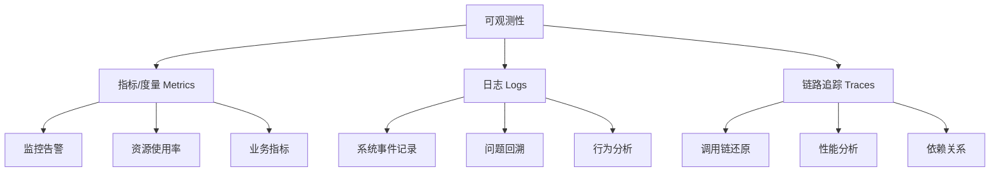

### 2.1 指标/度量 (Metrics)

#### 定义
对系统中一类信息的统计聚合，用于反映应用健康状况。

#### 典型指标

**基础设施层**
- 硬件使用率（CPU、内存、磁盘、网络）
- 资源占用情况

**应用运行时**
- 线程占用数量
- 垃圾回收频率
- JVM堆内存使用

**业务层**
- 访问量（PV、UV）
- 失败率
- 响应时间
- 业务转化率

#### 核心作用
- **监控和告警**：指标达到风险阈值时触发告警
- **自动化处理**：通过自动化方式响应
- **人工介入**：提醒团队进行排查
- **动态阈值**：云上工具可支持基于历史数据的智能阈值设定

### 2.2 日志 (Logs)

#### 定义
记录系统离散事件的详细信息，用于事后分析系统行为。

#### 典型内容
- 调用的方法
- 操作的数据
- 执行的流程
- 错误堆栈信息

#### 核心作用
- 详细记录系统运行过程
- 支持问题回溯和定位
- 帮助开发和运维人员快速定位错误

#### 日志工程化挑战

虽然输出日志很容易，但集中采集、存储、分析和使用日志却非常复杂：

- **规模挑战**：成千上万的集群节点
- **数据量挑战**：以TB计的快速滚动文本日志
- **技术挑战**：采集、存储、检索、分析
- **自动化挑战**：自动提取信息并告警

**日志输出规范**
- 避免打印敏感信息
- 避免引入慢操作
- 加入TraceID等关联标识

### 2.3 链路追踪 (Traces)

#### 定义
为故障排查和性能分析提供完整的调用链路还原。

#### 从单体到微服务

**单体应用时代**
- Debug调试
- 异常堆栈信息
- 单进程内的调用栈

**微服务时代**
- 一个外部请求流经多个内部服务
- 跨越多个服务的完整调用轨迹
- 包含服务间网络传输信息
- 各服务内部调用栈信息
- 国内常称为"全链路追踪"

#### 核心能力
- 完整调用链路还原
- 请求逻辑拓扑展示
- 应用依赖关系分析
- 性能瓶颈识别
- 快速诊断分布式系统故障

### 2.4 三大支柱总结

| 数据类型 | 主要用途 | 侧重点 |
|---------|---------|--------|
| **指标** | 监控和告警 | 发现问题 |
| **日志** | 问题排查和解决 | 详细记录 |
| **链路追踪** | 问题排查和解决 | 关联分析 |

---

## 三、云原生可观测性建设方法论

### 3.1 总体策略

#### 两大核心策略

**策略1：统一的可观测性平台**
- 统一采集三大支柱数据
- 统一存储和管理
- 统一分析和使用

**策略2：从业务出发**
- 梳理核心业务场景
- 根据业务场景定制指标
- 定制告警和大盘
- 配合应急流程保障业务连续性

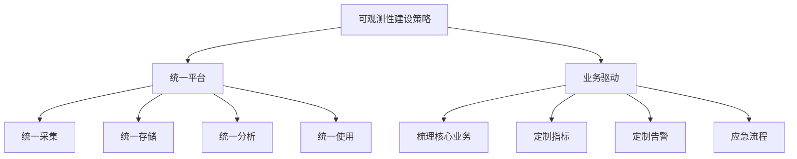

### 3.2 六大建设步骤

#### 前三步：技术架构建设

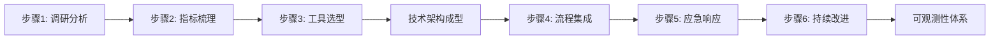

#### 步骤1：调研分析

**调研内容**
- 各层级架构调研
- 开发运维体系调研
- 监控和告警痛点分析
- 与业务/团队负责人沟通

**输出成果**
- 待观测对象清单
- 痛点问题列表
- 建设目标定义

#### 步骤2：指标梳理

**梳理原则**
- 从业务入手，自上而下
- 关注业务高层级指标
- 逐层分解到原始指标

**指标层级结构**

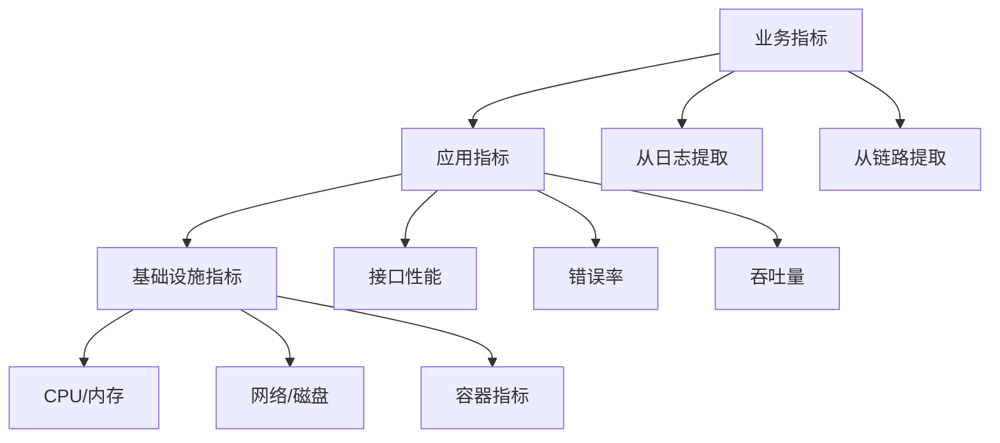

**梳理过程**
1. 与产品/业务逐个梳理核心指标
2. 确定业务负责人关心的高层级指标
3. 反推所需的原始指标
4. 确定指标聚合和提取方式
5. 形成完整的指标层级结构

**输出成果**
- 业务层指标清单
- 应用层指标清单
- 基础设施层指标清单
- 指标依赖关系图

#### 步骤3：工具选型

**选型原则**
- 覆盖三大数据支柱
- 支持数据采集、存储、分析
- 支持指标聚合和使用
- 考虑维护成本和高可用性

**输出成果**
- 技术架构设计
- 工具选型方案
- 部署架构图

#### 步骤4-6：流程治理

**主要内容**
- 事件定义和定级
- 故障响应流程
- 故障复盘机制
- On-Call机制
- 持续反馈和完善

> **注意**：可观测性体系 = 技术架构 + 流程治理

---

## 四、云原生可观测性技术架构

### 4.1 开源工具生态

#### CNCF可观测性工具全景

开源生态特点：
- ✅ 工具链非常丰富
- ✅ 社区特别活跃
- ✅ 标准开放，无供应商锁定
- ❌ 没有统一标准，选择困难
- ❌ 需要专业团队运维
- ❌ 高可用保障成本高

#### 典型开源架构

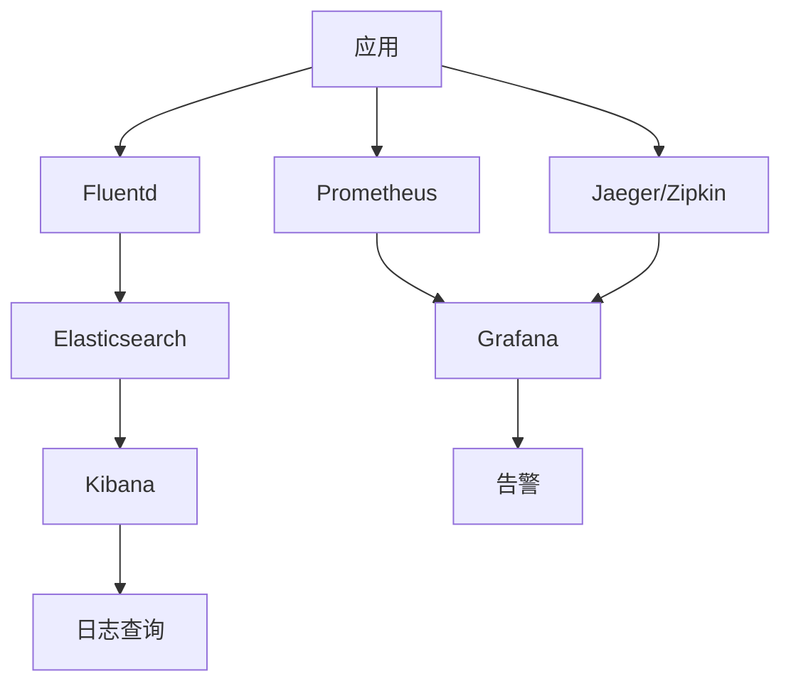

### 4.2 云原生架构设计

#### 设计思路

**核心理念**
- 借助开源工具的活跃社区
- 利用云托管服务提高可用性
- 降低维护成本
- 与云产品深度集成

#### 推荐架构

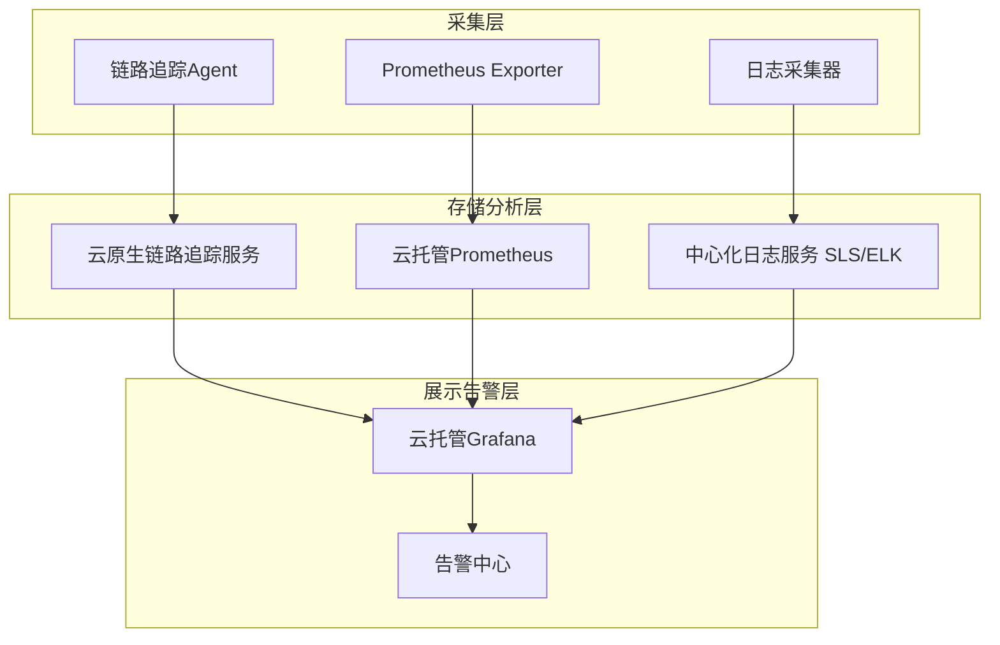

### 4.3 核心组件选型

#### 4.3.1 链路追踪

**推荐方案**
- 云原生链路追踪服务（托管）
- 兼容OpenTelemetry
- 兼容开源Agent（Jaeger、Zipkin等）

**优势**
- 高可用保障
- 与云产品集成
- 降低运维成本

#### 4.3.2 指标采集 - Prometheus

**为什么选择Prometheus**
- 事实标准，生态成熟
- 丰富的Exporter
- 支持自定义Exporter
- 强大的聚合能力

**覆盖范围**
- 基础设施层指标
- 应用层指标
- 业务层指标
- 研发态指标（CI/CD Pipeline）

**部署方式**
- 推荐：云托管Prometheus
- 优势：高可用、低维护成本

**架构模式：类联邦集群**

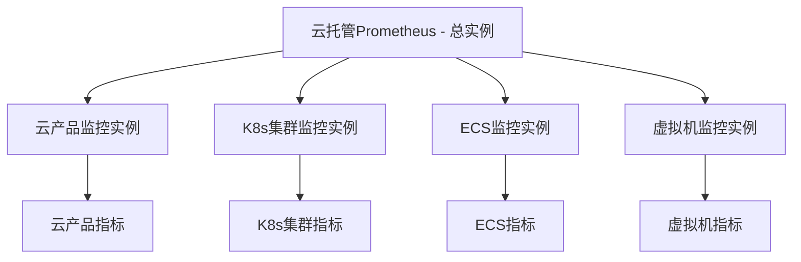

**多实例架构优势**
- 提高整体高可用性
- 功能区隔离
- 提升采集上限
- 增强可扩展性

#### 4.3.3 日志管理

**推荐方案**
- 云原生日志服务（SLS）
- 或托管ELK/EFK

**选型原则**
- 采集方便
- 维护成本低
- 信息处理能力强
- 支持自动化告警

#### 4.3.4 展示和告警 - Grafana

**为什么选择Grafana**
- 事实标准的可视化工具
- 支持多数据源集成
- 丰富的可视化组件

**推荐方案**
- 云托管Grafana

**数据源集成**
- Prometheus（指标）
- 链路追踪系统（Traces）
- 日志服务（Logs）

**云托管增强功能**
- 基于历史数据的环比/同比
- 智能告警阈值
- 动态阈值设定

### 4.4 混合云架构

#### 云上云下统一纳管

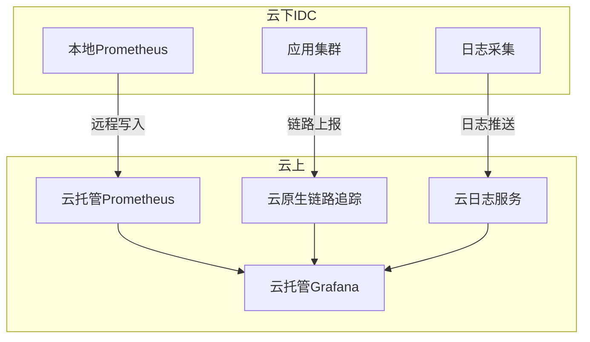

#### 云下指标采集方案

**方案1：远程写入（推荐）**
- 云下Prometheus采集指标
- 镜像一份到云上
- 适用于网络带宽受限场景

**方案2：直接采集**
- 云上Prometheus直接拉取云下指标
- 前提条件：
  - 云上云下网络打通
  - 带宽充足
- 注意：Prometheus采用Pull模式

---

## 五、实战案例分享

### 5.1 项目背景

#### 客户情况
- 从IDC上云的传统企业
- 业务需要敏捷迭代
- 进行了大量微服务化改造

#### 应用部署架构

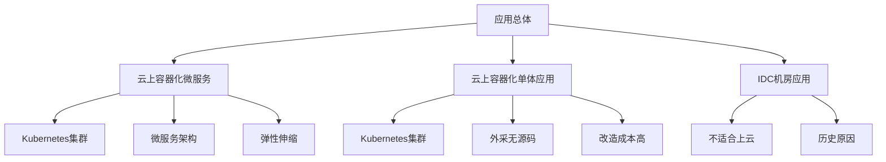

#### 复杂度挑战

**部署复杂度**
- 多种部署方式并存
- 容器化 + 虚拟机 + 物理机

**调用复杂度**
- 云上服务间调用
- 云上云下服务调用
- 云下服务间调用

**收益与挑战并存**
- ✅ 敏捷度提升
- ✅ 应用SLA提升
- ❌ 访问链路复杂
- ❌ 部署方式多样

### 5.2 指标体系设计

#### 指标层级结构

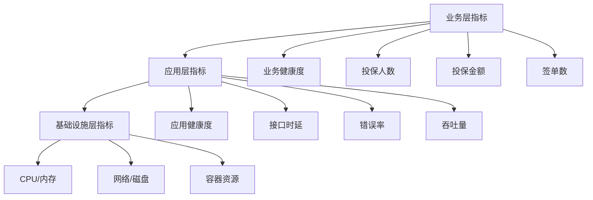

#### 业务层指标

**核心业务指标**
- 业务健康程度
- 投保人数
- 投保金额
- 投保签单数

**特点**
- 最具业务价值
- 最先与客户确定
- 驱动下层指标设计

#### 应用层指标

**健康度判断依据**
- 核心应用健康度
- 应用性能情况
- 关键接口指标

**核心应用指标**
- 接口请求时延
- 错误率
- 吞吐量
- 可用性

#### 研发态指标

**DevOps度量（DORA Metrics）**
- 构建次数
- 构建时长
- 构建成功率
- 部署频率
- 部署成功率
- 变更前置时间
- 服务恢复时间

**价值**
- 量化研发效能
- 支持持续改进
- 符合DevOps最佳实践

### 5.3 架构实施

#### 整体架构

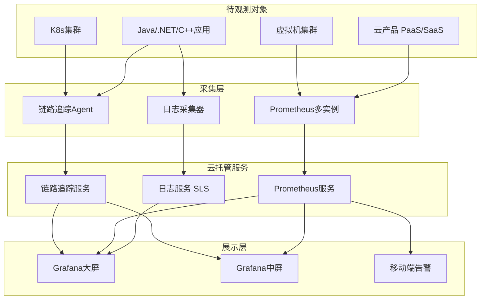

#### Prometheus功能区划分

**多实例架构**
- 云产品监控实例
- Kubernetes集群实例
- ECS监控实例
- 虚拟机监控实例

**云下指标采集**
- 采用远程写入方式
- 云下指标镜像到云上
- 实现统一纳管

### 5.4 实施效果

#### 三屏展示体系

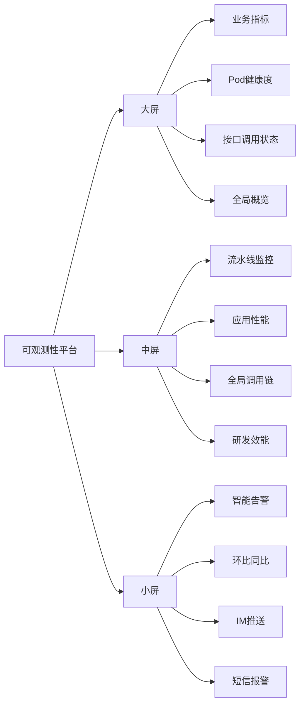

#### 大屏：决策支持

**展示内容**
- 业务核心指标
- 应用Pod健康度
- 接口调用状态
- 全局概览

**目标用户**
- 业务负责人
- 管理层
- 干系人

#### 中屏：研发效能

**展示内容**
- 流水线监控指标
- 应用性能指标
- 全局调用链
- 研发态度量

**目标用户**
- 研发团队
- DevOps团队

**价值**
- 提升开发效率
- 加速问题定位
- 优化研发流程

#### 小屏：移动告警

**功能特点**
- 基于历史数据环比/同比
- 智能告警阈值
- IM工具推送
- 短信报警

**价值**
- 及时发现问题
- 快速响应
- 移动化运维

---

## 六、核心要点总结

### 6.1 可观测性 vs 监控

| 对比维度 | 结论 |
|---------|------|
| **关系** | 可观测性是监控的升级和扩展 |
| **核心差异** | 监控发现问题，可观测性定位问题 |
| **数据维度** | 可观测性包含指标、日志、链路三大支柱 |
| **业务关联** | 可观测性从业务视角出发，更贴近实际需求 |

### 6.2 建设方法论

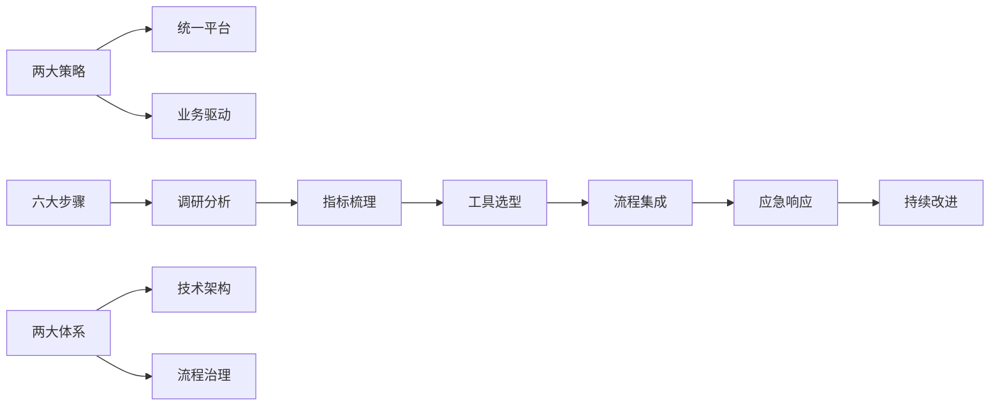

**关键原则**
1. 统一采集、存储、分析、使用
2. 从业务出发，自上而下设计
3. 技术架构与流程治理并重
4. 持续反馈和优化

### 6.3 技术架构要点

**核心组件**
- Prometheus：指标采集和存储
- Grafana：可视化和告警
- 链路追踪：分布式调用分析
- 日志服务：事件记录和分析

**架构原则**
- 优先选择云托管服务
- 保障高可用性
- 降低维护成本
- 与云产品深度集成

**多实例策略**
- 功能区隔离
- 提升可扩展性
- 增强高可用性

### 6.4 指标体系设计

**层级结构**
```
业务层指标
    ↓ 反推
应用层指标
    ↓ 反推
基础设施层指标
```

**设计原则**
- 从业务需求出发
- 逐层分解到原始指标
- 明确聚合和提取方式
- 形成完整的依赖关系

### 6.5 混合云场景

**云下指标采集**
- 方案1：远程写入（推荐）
- 方案2：直接拉取（需网络条件）

**统一纳管**
- 云上云下统一视图
- 统一告警和分析
- 统一运维管理

---

## 七、痛点与趋势

### 7.1 建设痛点

#### 技术层面
- 开源工具选择困难，缺乏统一标准
- 需要专业团队运维，成本高
- 高可用保障复杂
- 多工具集成复杂度高

#### 业务层面
- 传统监控与业务脱节
- 指标体系设计困难
- 从上到下梳理成本高
- 跨团队协作挑战

#### 数据层面
- 海量日志采集存储挑战
- 多维度数据关联困难
- 数据价值挖掘不足

### 7.2 发展趋势

#### 1. 云原生化
- 托管服务降低运维成本
- 与云产品深度集成
- 弹性伸缩能力

#### 2. 智能化
- 基于历史数据的智能告警
- 动态阈值设定
- 异常检测和根因分析

#### 3. 统一化
- 统一的可观测性平台
- 打通指标、日志、链路
- 统一的数据模型

#### 4. 业务化
- 从业务视角构建监控
- 业务指标优先
- 支撑业务决策

#### 5. 自动化
- 自动化问题发现
- 自动化告警
- 自动化响应和修复

---

## 八、实践建议

### 8.1 初期建设建议

**成本控制场景**

推荐开源工具组合：
- **指标**：Prometheus + Grafana
- **日志**：ELK/EFK Stack
- **链路**：Jaeger/SkyWalking/Zipkin
- **采集**：OpenTelemetry

**快速落地场景**

推荐云托管服务：
- 降低运维成本
- 快速上线
- 高可用保障
- 与云产品集成

### 8.2 分阶段实施

**第一阶段：基础监控**
- 搭建基础设施监控
- 建立告警机制
- 完善应急流程

**第二阶段：应用可观测**
- 接入应用指标
- 部署链路追踪
- 集中化日志管理

**第三阶段：业务可观测**
- 梳理业务指标
- 定制业务大盘
- 建立业务告警

**第四阶段：持续优化**
- 智能告警优化
- 自动化响应
- 效能度量和改进

### 8.3 团队协作

**跨团队协作要点**
- 业务团队：定义核心指标
- 开发团队：埋点和日志规范
- 运维团队：架构建设和维护
- SRE团队：流程治理和优化

---

## 九、Q&A精选

### Q1: 业务成本控制较高，初期哪些开源工具比较合适？

**推荐组合**
- **指标监控**：Prometheus + Grafana
- **日志管理**：ELK (Elasticsearch + Logstash + Kibana) 或 EFK (Fluentd替代Logstash)
- **链路追踪**：Jaeger / SkyWalking / Zipkin / OpenTelemetry

**选型建议**
- 优先选择社区活跃、文档完善的工具
- 考虑团队技术栈和学习成本
- 评估长期维护成本

### Q2: SLO要求越来越高，怎么整合云平台、云产品、日志、Tracing等各种数据？

**整合策略**
1. **统一数据平台**：采用Grafana作为统一展示层
2. **工具选型**：
   - Prometheus生态基本确定
   - 选择云原生的日志和链路追踪服务
   - 确保工具间良好集成
3. **数据关联**：
   - 通过TraceID关联日志和链路
   - 通过标签关联指标和应用
   - 建立统一的数据模型

### Q3: 业务层监控指标如何采集？

**采集方式**
1. **从应用日志提取**：通过日志分析提取业务指标
2. **从链路数据聚合**：基于调用链数据统计业务指标
3. **自定义Exporter**：开发业务指标采集器
4. **应用埋点**：在业务代码中主动上报指标

**实施建议**
- 与业务团队紧密协作
- 明确指标定义和计算方式
- 建立指标采集规范

---

## 十、参考资源

### 相关技术
- **CNCF**: Cloud Native Computing Foundation
- **OpenTelemetry**: 统一的可观测性数据采集标准
- **Prometheus**: 云原生监控事实标准
- **Grafana**: 可视化和告警平台
- **DORA Metrics**: DevOps研发效能度量

### 延伸阅读
- 《Observability Engineering》
- 《Site Reliability Engineering》
- CNCF可观测性白皮书
- Prometheus官方文档
- OpenTelemetry规范

---

## 总结

构建云原生可观测体系是一个系统工程，需要：

1. **正确的理念**：从业务出发，统一平台
2. **科学的方法**：六步建设法，技术+流程
3. **合适的工具**：云原生+开源，平衡成本和效能
4. **持续的优化**：反馈改进，不断演进

可观测性不仅仅是技术问题，更是组织和文化的变革。只有将技术架构和流程治理有机结合，才能真正提升运维效能，助力应用可持续运行。

---

*本文档整理自阿里云解决方案架构师陈曦宇的技术分享*
