# 光大银行监控系统的管理平台实践

> 来源：未核验 · 类型：分享 · 状态：draft

## 一、分享者介绍

从2002年毕业至今，近20年时间都在与监控系统打交道:

- 最初作为集成商从事监控系统项目建设
- 2011年开始参与光大银行监控项目
- 2013年加入光大银行，专注于光大银行监控系统建设
- 团队规模: 10人监控专业团队

**系统定位**: 服务全行科技条线的IT监控管理系统，被称为"运维之眼"

## 二、监控系统发展现状

### 2.1 金融科技面临的挑战

1. **业务对服务稳定性、可靠性要求越来越高**
2. **业务对IT支撑能力依赖性越来越强**
3. **IT架构复杂度越来越高**

### 2.2 运维模式演进

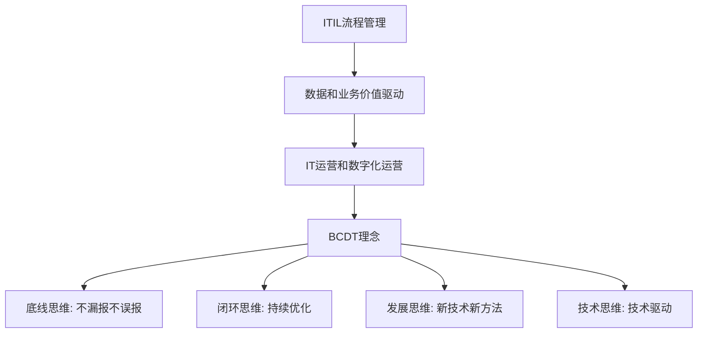

### 2.3 光大银行BCDT理念在监控系统的应用

| 维度               | 具体实践                                            |
| ------------------ | --------------------------------------------------- |
| **底线思维** | 不漏报、不误报、全覆盖、监控系统自身高可用          |
| **闭环思维** | 监控能力向开发测试前移，形成部署-处置-定位-分析闭环 |
| **发展思维** | 研究引入新监控手段和管理方法，适应新管理要求        |
| **技术思维** | 通过新技术带动监控能力提升                          |

### 2.4 光大银行监控系统建设历程

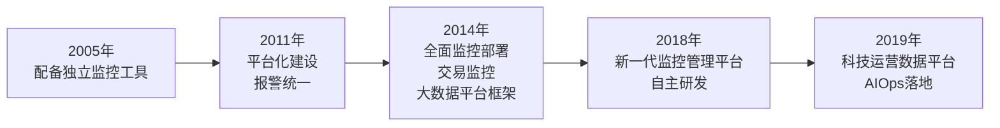

### 2.5 变与不变的思考

#### 不变的部分

1. **管理职能目标**: 保证IT系统稳定运行
2. **考核指标**: 主动发现率
3. **工作模式**: 事前预警 → 事中定位 → 事后分析
4. **管理模型**: 监控对象 + 监控指标 + 监控策略

#### 变化的部分

1. **监控对象**: 日益复杂
2. **技术和工具**: 日新月异
3. **监控范围**: 指标、Tracing、日志等更广泛
4. **数据价值**: 引入智能算法
5. **协作模式**: 运维与开发更紧密合作

## 三、光大银行监控体系总体架构

### 3.1 三层架构

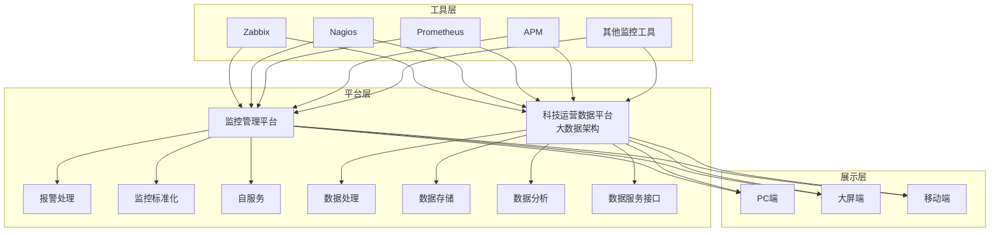

### 3.2 监控指标全覆盖

从底层机房设施到最上层应用交易，实现全覆盖:

- **关键指标采用双工具覆盖**，保证冗余和快速部署能力
- **多层次监控**: 基础设施 → 网络 → 主机 → 中间件 → 数据库 → 应用 → 交易

### 3.3 交易监控体系

光大银行通过多种手段实现端到端交易全方位监控:

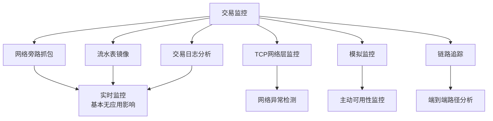

**关键特点**:

- 监控交易成功率、响应时间等关键指标
- 大部分手段对应用基本无影响
- 支持应用系统内部和系统间的交易路径追踪

### 3.4 大数据与智能算法应用

**两大典型场景**:

1. **交易监控智能异常检测**

   - 综合节假日、促销等因素
   - 实现动态异常检测和告警
   - 细化到每笔交易的异常检测
2. **批量任务时长智能分析**

   - 基于历史数据的智能分析
   - 提前预警，为夜间处置赢得时间
   - 相比传统固定阈值监控更灵活

### 3.5 数据展示层

- **多端支持**: PC端、大屏、移动端
- **场景化视图**: 日常运维、应急保障、重保运营
- **角色化展示**:
  - 一线: 故障发现、预案处置、事后验证
  - 二线: 故障解决、趋势分析、隐患排查

### 3.6 技术栈

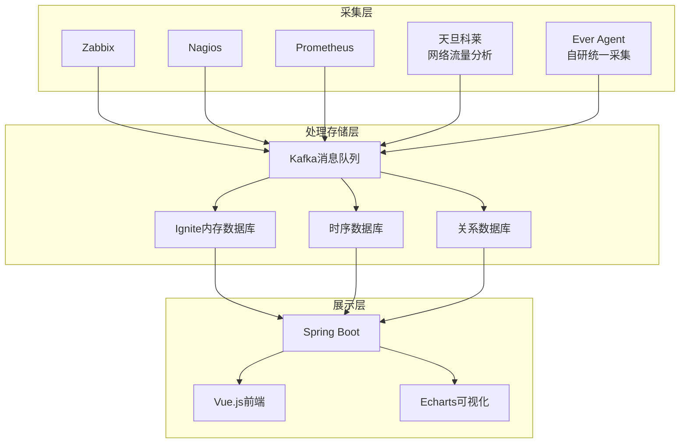

**核心原则**: 以开源为主，自主可控

## 四、监控管理平台建设实践

### 4.1 管理平台功能架构

六大核心功能:

1. **报警全生命周期管理和处理规则管理**
2. **标准化管理**(规则、对象、策略)
3. **自服务**(监控自动化管理)
4. **监控评价**(完备度度量)
5. **维护期管理**
6. **通知管理**

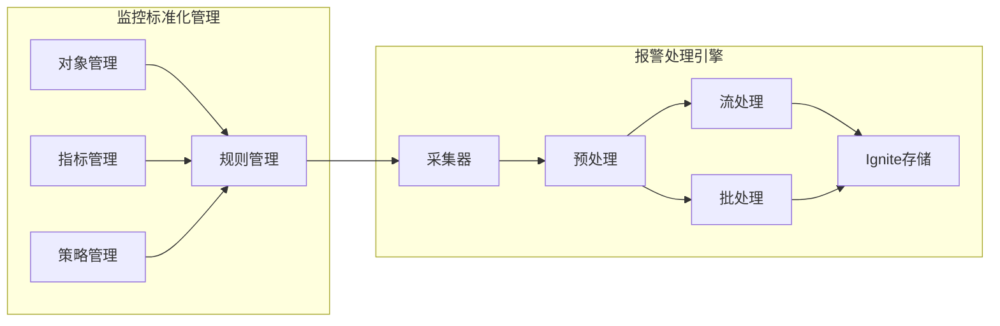

### 4.2 报警处理引擎

#### 4.2.1 业务特点分析

| 层次                 | 特点                                                                 |
| -------------------- | -------------------------------------------------------------------- |
| **事件采集层** | 数据源多样、报文格式多样、期望延迟秒级                               |
| **报警处理层** | 数据量大、存在风暴、相关性高、逻辑复杂、需扩展传统规则、延迟要求秒级 |
| **展示处置层** | 展现形式多样、高频刷新、服务器主动推送、保证时效性                   |

#### 4.2.2 设计目标

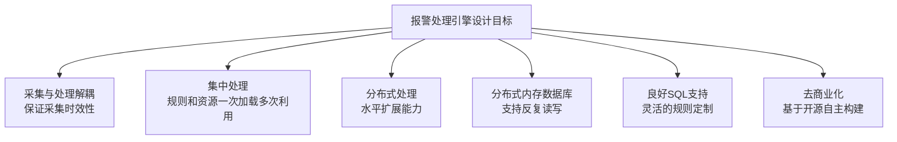

#### 4.2.3 技术选型

**从IBM OmegaBus迁移的背景**:

- 原系统为单节点单进程，处理能力有限(数万条报警即达瓶颈)
- 需要保留已有的优秀规则和经验
- 完全兼容原有triggers和rules

**核心技术选型**:

1. **Apache Ignite** - 分布式内存数据库

   - 基于Java开发
   - 支持分布式缓存和内存数据库
   - 数据存储在堆外，不受GC影响
   - 支持数据持久化到磁盘
   - 支持事务，可配置CP或AP模式
   - 支持SQL函数扩展
   - 支持消息订阅发布
2. **Dubbo** - 分布式开发框架

   - 轻量级、小巧
   - 用于引擎内部组件高性能交互

#### 4.2.4 处理引擎架构

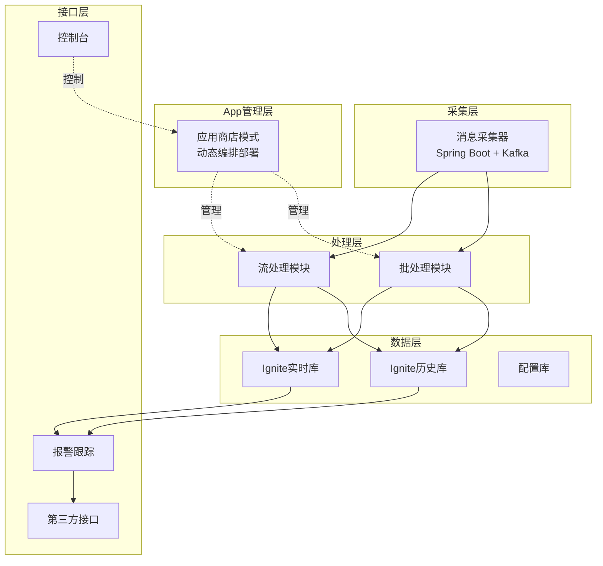

**技术实现要点**:

- ANTLR4: SQL语法分析
- Java动态编译(Tools)和动态执行
- JMX: 组件间通信
- Zookeeper: 服务发布订阅管理
- Ignite: 报警存储库

#### 4.2.5 应用商店模式

报警处理功能以App形式管理:

**App类型**:

- **流式App**: 实时处理报警流
- **调度App**: 定时批处理任务
- **广播App**: 分布式批量处理
- **订阅App**: 汇总前面处理结果
- **REST API App**: 动态生成访问接口，监控运行时数据

**App特性**:

- ✅ **动态性**: 动态编排、部署、修改、删除
- ✅ **协作性**: App间可编排协调
- ✅ **优雅启停**: 确保数据处理完成
- ✅ **热插拔**: 支持运行时更新
- ✅ **可扩展**: 支持自定义开发

#### 4.2.6 引擎核心特性

| 特性                   | 说明                              |
| ---------------------- | --------------------------------- |
| **分布式处理**   | 支持水平扩展                      |
| **高可用**       | 多节点部署，自动故障转移          |
| **完全兼容**     | 兼容IBM OmegaBus的rules和triggers |
| **热插拔部署**   | App可动态部署，无需重启           |
| **高并发高性能** | 性能比原系统提升10倍以上          |
| **自监控**       | 支持报警追踪和处理统计分析        |
| **多数据中心**   | 支持全备+增量的方式部署           |

#### 4.2.7 实际处理效果

**基础功能**:

- 报警丰富、压缩、恢复、关联
- 自动升降级
- 维护期管理

**关联分析场景**:

- 服务器宕机与前置应用拥堵关联
- 周边系统拥堵关系分析
- DWDM中断情况定位

**报警视图展示**:

- 层级化报警分布展示
- 多维度报警聚合
- 基于智能算法的报警压制

**实际数据规模**:

- 每天报警总量: 约10-20万条(含各级别)
- 需要人工干预的高级别报警: 每天数百条
- 中级别消息推送: 每天数千条(24小时内阅读即可)

### 4.3 监控标准化管理

#### 4.3.1 核心管理模型

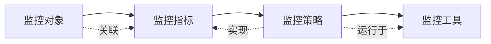

**概念定义**:

- **监控对象**: 被监控的实体(如服务器、应用系统)
- **监控指标**: 对象的动态属性(如CPU使用率)
- **监控策略**: 指标度量规则(如CPU使用率>80%持续5分钟)
- **监控工具**: 执行监控的技术平台

**监控标准**: 定义哪些对象用哪些策略监控哪些指标，汇总发布的企业级规范

#### 4.3.2 对象管理

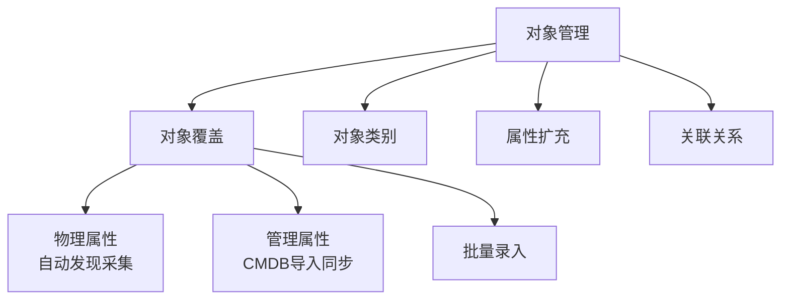

**关键特点**: 管理模型类似CMDB

#### 4.3.3 指标与策略管理

**指标管理**:

- 支持虚拟指标与工具指标的关联定义
- 一个通用指标(如CPU使用率)可对应多种工具的具体实现

**策略管理**:

- 管理平台提供通用公式编辑器
- 利用指标生成策略
- 支持从工具向上抽取策略(单向支持工具)

#### 4.3.4 规则与自动绑定

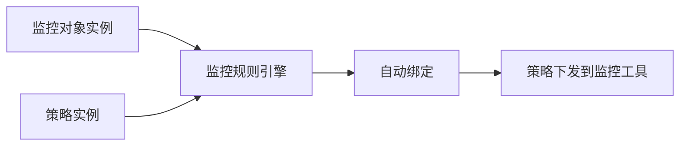

**实现方式**: 基于对象属性和规则自动化绑定对象与策略

### 4.4 自动化与自服务

#### 4.4.1 两个层次

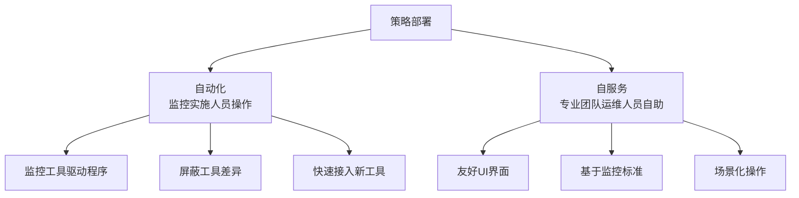

#### 4.4.2 工具驱动能力

| 驱动类型           | 说明                                           |
| ------------------ | ---------------------------------------------- |
| **全驱动**   | 所有操作都在平台完成，无需访问工具             |
| **半驱动**   | 标准化策略在平台部署，特殊策略需手工在工具完成 |
| **单向采集** | 无法驱动工具，仅采集策略信息到平台             |

**关键要求**: 即使是半驱动或单向采集，也必须通过策略采集器保证平台拥有完整的策略视图

#### 4.4.3 自服务典型流程

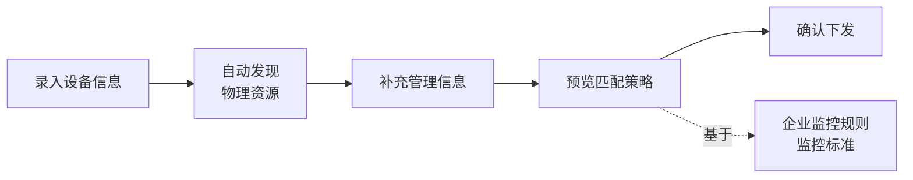

**核心原则**: 自服务必须基于监控标准化规则，不允许随意配置

**非标策略支持**:

- 支持个性化策略，但需走ITSM流程审批
- 由监控管理员执行部署
- 有评价机制跟踪非标策略

### 4.5 监控评价体系

#### 4.5.1 三大核心指标

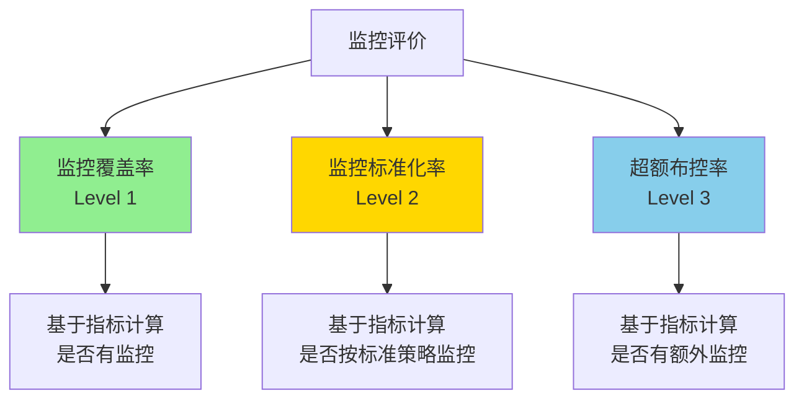

**指标说明**:

- **监控覆盖率**: 应监控指标中已部署监控的比例
- **监控标准化率**: 已监控指标中符合标准策略的比例
- **超额布控率**: 在标准之外额外增加的监控比例

#### 4.5.2 以评促改机制

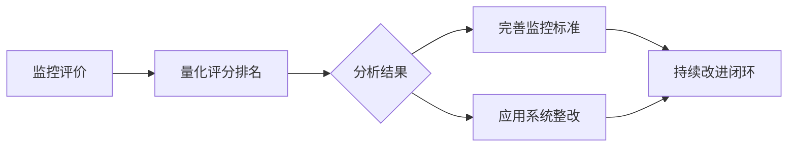

**管理机制**: 通过评价结果推动标准完善和系统整改

### 4.6 维护期管理

#### 4.6.1 维护期分类与入口

**分类**:

- **周期性**: 每天、每周固定频率重复
- **非周期性**: 临时维护窗口

**管理入口**:

- 移动端
- PC端
- ITSM流程端

#### 4.6.2 管理要点(来自经验教训)

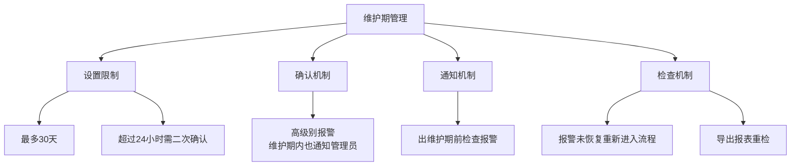

**关键原则**: 严格管理，防止因维护期设置不当导致漏报误报

#### 4.6.3 权限管理

- 一线运维: 操作权限
- 二线运维: 管理权限
- 监控管理员: 审核权限
- 支持模板化、场景化批量生成

### 4.7 监控有效性评价

#### 4.7.1 核心指标

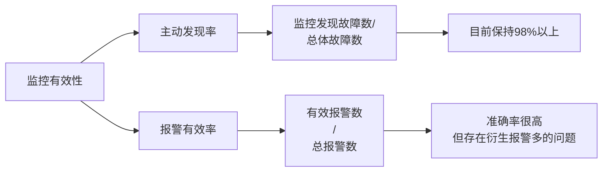

**主动发现率计算**:

- 分子: 监控主动发现的故障数
- 分母: 总故障数(含总行投诉、业务投诉、客户投诉)
- **目标**: 保持在98%以上

#### 4.7.2 报警有效率提升方向

当前挑战: 一个故障可能触发大量周边衍生报警

**解决思路**:

1. **基于规则和场景的分析**

   - 按报警根因分析维度
   - 按业务影响分析维度
   - 进行报警合并和关联
2. **基于算法的智能分析**

   - 研究图算法等技术
   - 智能识别根因报警
   - **状态**: 进行中

### 4.8 体系化运作

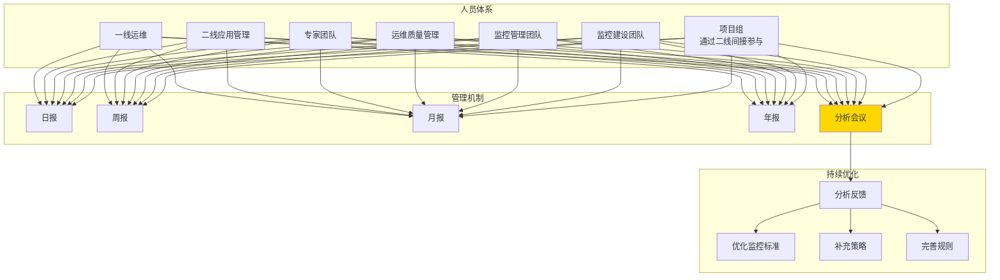

**核心要素**:

- **人员全覆盖**: 从一线到二线，从运维到开发
- **定期分析会**: 每日/周/月/年度报警分析会(已坚持10年)
- **反馈机制**: 持续优化监控标准和策略
- **成功关键**: **坚持**

## 五、未来发展展望

### 5.1 总体方向

**核心目标**: 向数字化运营转变，提升数字化运行态的洞察和智能分析能力

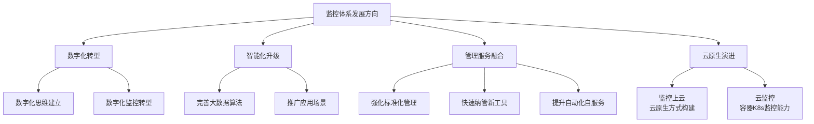

### 5.2 四大重点方向

#### 5.2.1 数字化监控转型

- 建立数字化思维
- 推动监控从告警驱动向数据驱动转变
- 增强数据洞察能力

#### 5.2.2 大数据与智能算法

- 进一步完善算法模型
- 推广更多应用场景
- 提升预测和分析能力

#### 5.2.3 管理与服务融合

- 强化监控标准化管理基础
- 快速纳管新监控技术和工具
- 提升自动化和自服务应用范围

#### 5.2.4 监控上云与云监控

**监控上云**:

- 以云原生方式构建监控系统
- 提升系统弹性和敏捷能力
- 加强与运维工具整合

**云监控**:

- 提升对容器、K8s、分布式应用的监控能力
- 通过APM等方式部署监控
- 打通运维与开发，提升云应用主动监控能力

## 六、核心经验总结

### 6.1 技术架构经验

1. ✅ **开源为主，自主可控**: 基于开源技术构建，避免厂商锁定
2. ✅ **分层解耦**: 采集层、处理层、展示层清晰分离
3. ✅ **平台化思维**: 监控工具专业化，管理平台统一化
4. ✅ **扩展性设计**: App商店模式，支持功能动态扩展

### 6.2 管理体系经验

1. ✅ **标准化先行**: 建立企业级监控标准
2. ✅ **以评促改**: 通过评价体系推动持续改进
3. ✅ **全员参与**: 从一线到二线，从运维到开发全覆盖
4. ✅ **持续优化**: 定期分析会机制，坚持10年不断优化

### 6.3 关键成功因素

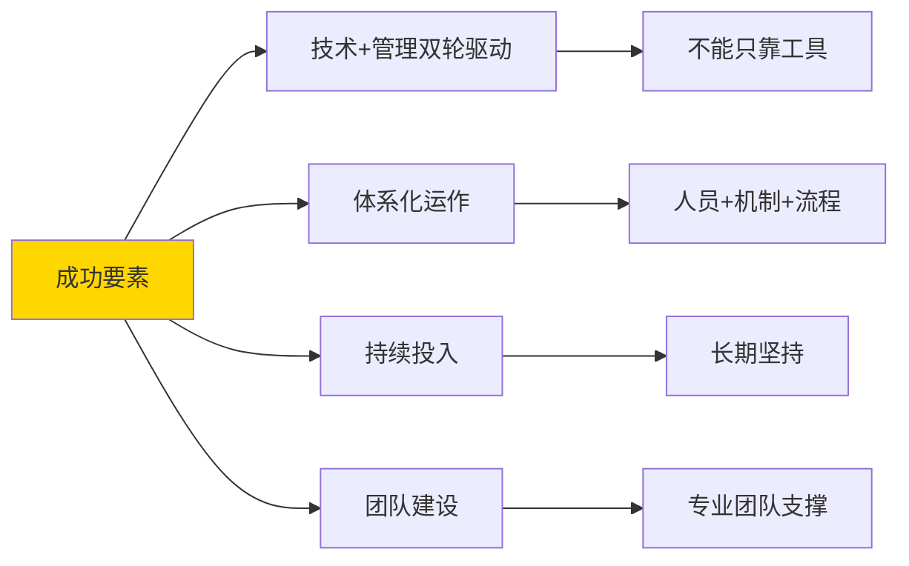

### 6.4 避坑指南

1. ⚠️ **维护期管理**: 严格限制和审核，防止漏报误报
2. ⚠️ **报警风暴**: 在预处理层就要做好压制
3. ⚠️ **工具选型**: 充分评估后再决定，注意兼容性
4. ⚠️ **自研投入**: 自研成本和代价较大，需充分评估资源投入

## 七、问答环节精选

### Q1: 是否使用规则引擎？

**A**: 目前未在监控管理平台使用。正在研究Drools规则引擎，计划在大数据平台的实时报警判断场景应用，作为新型监控工具。

### Q2: 哪些部分是自研的？

**A**: 监控管理子系统完全自研，包括报警处理引擎、标准化管理等。采集层仍使用商业/开源产品。正在自研Ever Agent统一采集代理。

### Q3: 每天数据量多大？

**A**:

- 总报警量: 10-20万条/天(含各级别)
- 需人工干预的高级别: 数百条/天
- 中级别消息推送: 数千条/天(24小时内阅读)

### Q4: TCP链路追踪如何实现？

**A**: 通过网络设备端口镜像实现旁路抓包，分析TCP头信息(非body内容)，监控网络层面问题如零窗口、丢包、重传等。

### Q5: 报警收敛如何做？

**A**:

- 定义细粒度的报警组件(按类型)
- 在预处理层抑制风暴报警
- 通知层面做抑制(如短信通道限流，但移动端推送全量)
- 基于应用系统、相似报警、相同IP等维度压制

### Q6: 与CMDB/ITSM如何集成？

**A**:

- 报警送入事件流程
- 变更流程触发维护期设置
- CMDB作为监控评价基准(分母)
- 监控对象信息与CMDB同步
