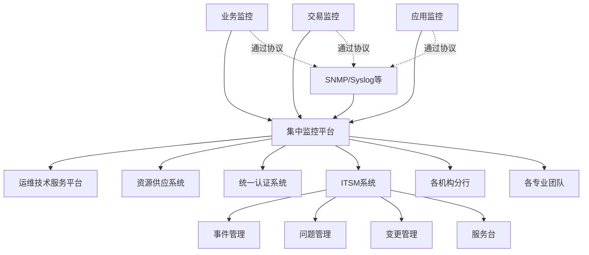
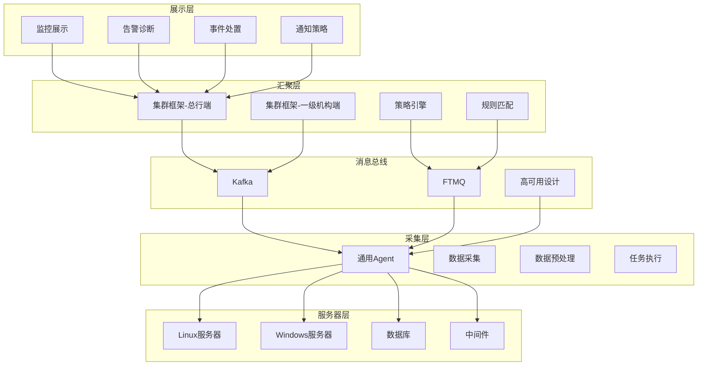
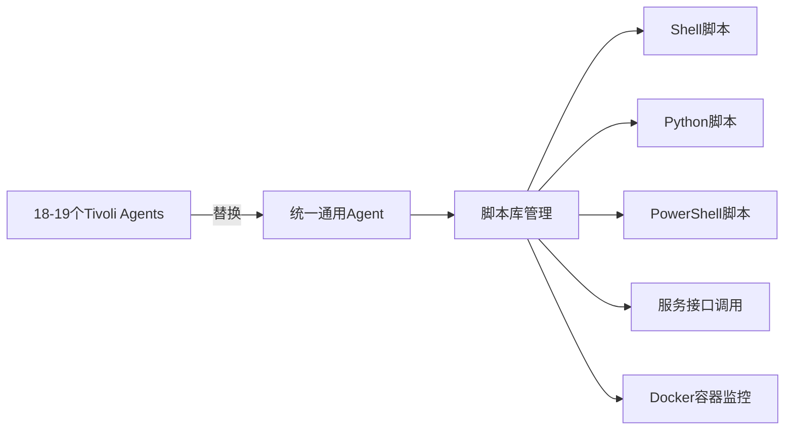
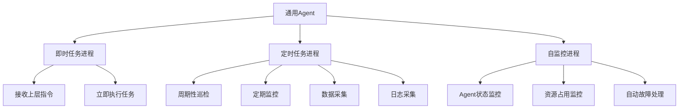
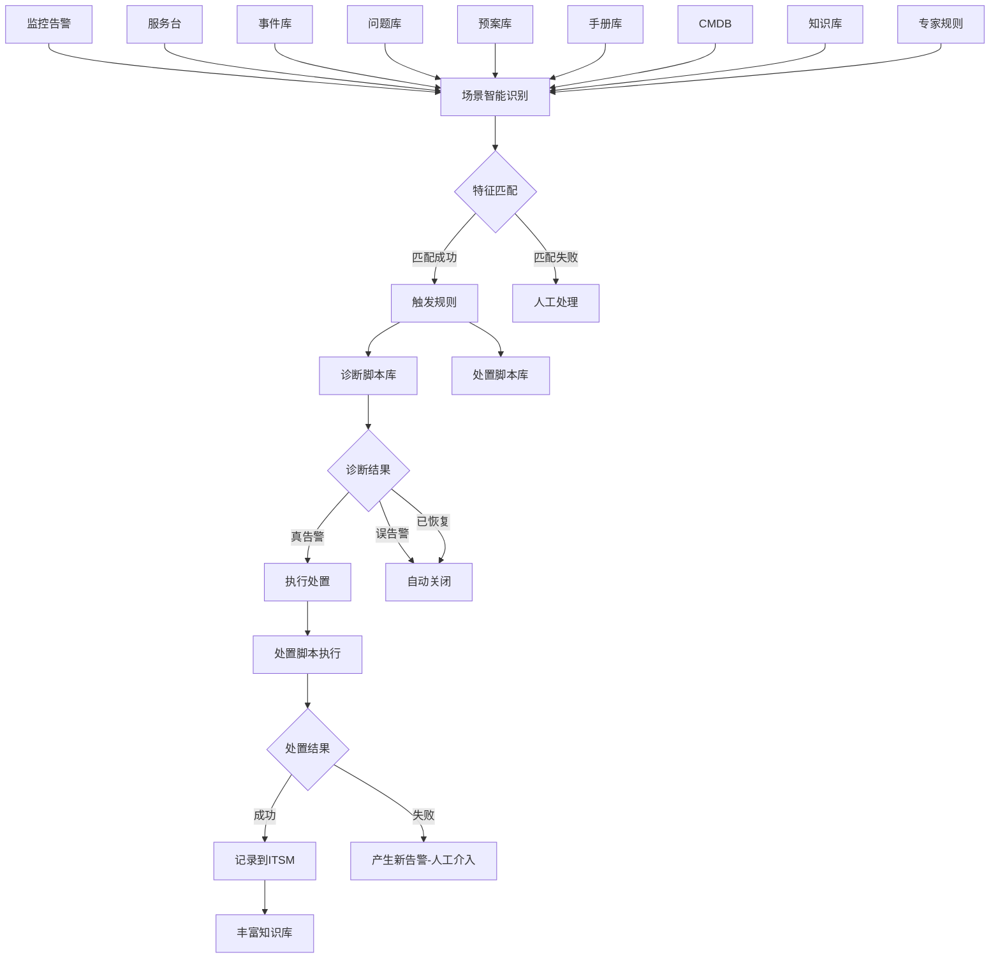
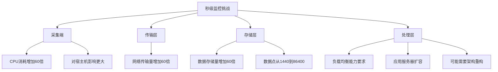
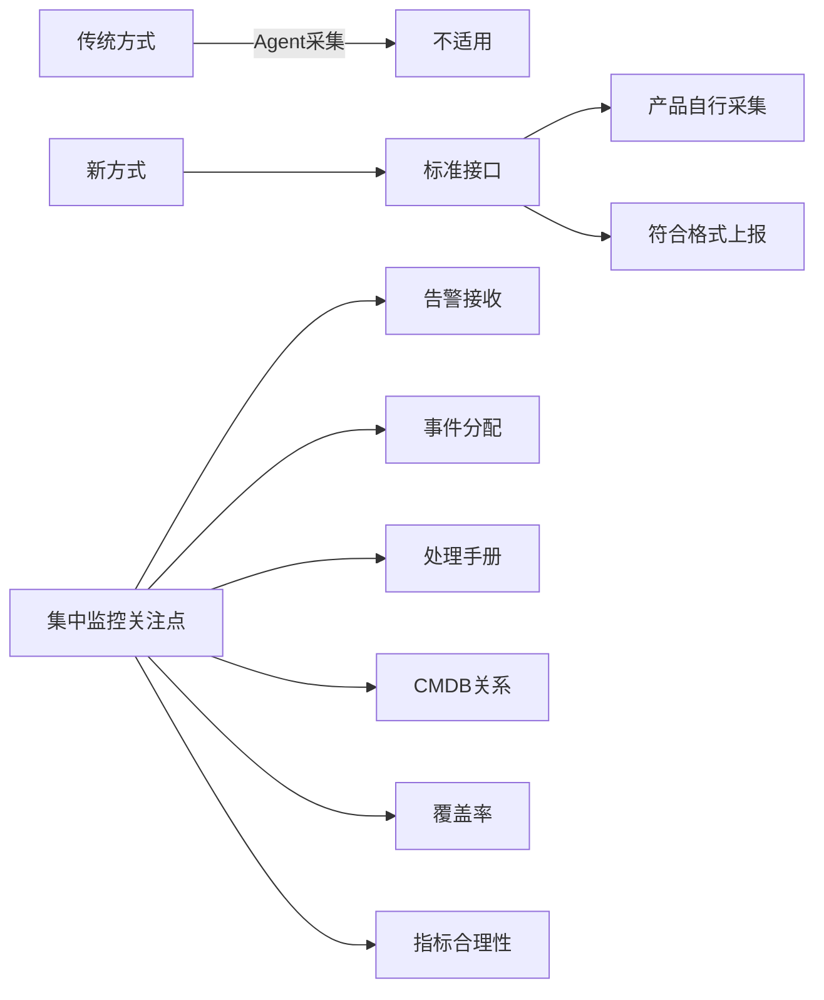
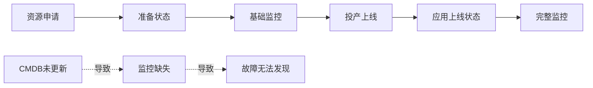
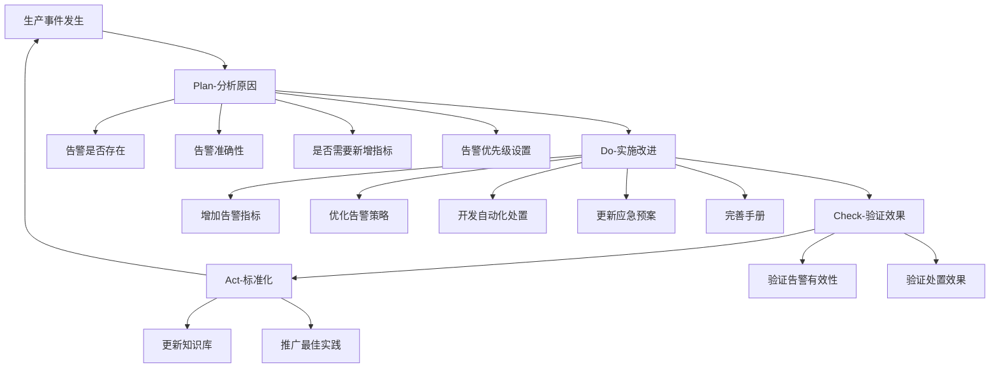

# 工商银行大规模监控系统新设计与落地实践

> 来源：未核验 · 类型：分享 · 状态：draft

## 一、背景介绍

### 1.1 部门职责

工商银行数据中心系统三部主要负责：

- 开放平台基础系统运维
- 操作系统、数据库、中间件管理
- 大规模基础设施云运维
- 大数据平台运维
- **运维规模：超过10万+服务器**

### 1.2 团队职责

- 运维工具研发
- 基础设施应用运维

## 二、监控系统面临的挑战

### 2.1 政策层面挑战

- 金融科技三年规划对高可用提出更高要求
- 从两地三中心向多地多中心演进
- 国产化替代要求

### 2.2 技术层面挑战

- 从传统ITIL事件管理向AIOps演进
- 大规模监控系统的性能瓶颈
- 监控覆盖率和准确性要求
- 告警风暴处理

### 2.3 运维理念转变

从传统的**事件驱动**运维模式，转向**AIOps能力层次模型**支持下的智能运维体系。

> **核心理念**：CMDB贯穿从计算到应用的所有层次，CMDB数据准确性是精细化管理能力的关键考验。

## 三、工行集中监控体系架构

### 3.1 体系总览

工行集中监控是一个**整体性平台级监控系统**，从平台到资源层面提供全面监控能力。

### 3.2 监控体系特点

- **集中化管理**：统一展示和事件分发
- **多源接入**：支持业务监控、交易监控、应用监控等多种监控源
- **协议标准化**：通过SNMP、Syslog等标准协议对接
- **分级处理**：按机构、分行、专业进行事件划分和处理

## 四、运维基础服务平台架构

### 4.1 设计理念

通过对运维对象、运维活动、运维场景、运维角色四个维块进行统一建模分析，总结出三个层面的自动化能力：

1. **面向资源的监控**（本次分享重点）
2. **面向应用的监控**
3. **面向业务的监控**

### 4.2 平台功能架构

### 4.3 高可用架构设计

#### 4.3.1 架构特点

- **Agent侧高可用**：每个Agent可连接三园区的消息总线
- **消息总线高可用**：每个消息总线都做了高可用设计
- **分级任务处理**：
  - 一级机构端：初级任务处理
  - 总行端：进一步处理和汇总
- **层次解耦**：各层之间相互透明，结偶设计

#### 4.3.2 架构优势

- ✅ 解决园区间高可用问题
- ✅ 支持任务高并发处理
- ✅ 实现负载均衡策略
- ✅ 支撑超10万级Agent管控规模
- ✅ 未来可扩展至多地多中心大几十万级规模

### 4.4 上层业务应用

#### 4.4.1 Agent管控台

实现能力：

- ✅ 十几万Agent一键式升级
- ✅ 版本更新
- ✅ 配置更新
- ✅ 脚本库更新
- ✅ 服务器参数调整

#### 4.4.2 安全控制机制

**多层安全识别**：

1. **任务安全性识别**：执行任务的安全性验证
2. **规模安全性识别**：执行规模的安全性验证

**灰度策略**（与CMDB深度对接）：

- 园区级灰度
- 应用级灰度
- 集群级灰度

**操作方式转变**：

- ❌ 消除黑屏操作
- ✅ 依赖接口方式
- ✅ 应用层能力建设
- ✅ 大规模批量分批操作

#### 4.4.3 流程引擎能力

通过流程引擎实现：

- 前期操作和后续操作的规则匹配
- 分批执行结果验证
- 自动化流程驱动

## 五、监控技术演进

### 5.1 传统监控架构（去IOE之前）

**采集层**：

- 使用IBM Tivoli产品
- 配置项繁多
- 多个Agent（18-19个）
- 管控台能力弱
- 需要手工登录服务器配置
- Windows下操作尤其困难

**汇聚层**：

- 使用Tivoli OMNIbus Server
- 本质是内存数据库
- 在内存中进行策略匹配

**展示层**：

- 工行自主研发

### 5.2 新一代监控架构

#### 5.2.1 采集层改造

**核心变化**：用通用Agent替换所有采集组件

**脚本库管理特点**：

- 集中管理控制台
- 脚本开发、测试、发版一体化
- 分批次、分灰度下发
- 插件化思想（类似Prometheus）

#### 5.2.2 汇聚层改造

- 使用开源软件替代
- 实现算法和策略匹配
- 支持AIOps能力

#### 5.2.3 展示层增强

新增功能：

- 告警诊断
- 事件处置
- 通知策略
- 事件全生命周期管理
  - 事件分配
  - 持续跟踪
  - 处理记录
  - 关闭确认

## 六、通用Agent详解

### 6.1 技术架构

**三进程架构**：

### 6.2 核心功能

#### 6.2.1 即时任务

- 接收上层应用指令
- 执行各类即时任务
- 支持脚本立即执行

#### 6.2.2 定时任务

- 周期性执行
- 巡检、监控、数据采集
- 提高监控敏感度

#### 6.2.3 自监控

**监控内容**：

- Agent进程状态（正常/异常）
- 系统资源占用
  - CPU使用率
  - 内存使用率
  - JVM使用情况
  - GC状态

**自适应能力**：

- 数据库繁忙时自动杀掉Agent
- 正常情况下自动启动Agent

### 6.3 部署和管理

#### 6.3.1 自动化部署

- ✅ 随计算资源供应自动安装
- ✅ 无需手动安装
- ✅ 批量服务器预装能力

#### 6.3.2 大规模并发能力

**应用场景示例**：

- 全量服务器巡检
- 安全漏洞扫描（如Log4j漏洞）
- 一键批量命令执行
- 结果自动汇总

### 6.4 性能指标

**资源占用**（Java版本）：

- **CPU使用率**：个位数（2-5%）
- **内存占用**：约200MB
- **稳定性**：经过多版本迭代，已解决GC、内存泄漏等问题

## 七、故障自动处置体系

### 7.1 核心理念

> **重要观点**：监控告警不是最终目的，把事件消灭掉才能达到SRE水平。

> **AIOps与监控的关系**：AIOps让监控更成熟，发现事件更精准，误报警更少，通过告警聚合和压缩减少值班人员工作量。

### 7.2 告警与处置结合

**工行经验**：

- ✅ 任何告警必须有对应的手册、方法或预案
- ✅ 必须有兜底策略

**示例**：CPU使用率高告警

- 方案1：进程终止
- 方案2：数据库切换
- 方案3：中间件重启

### 7.3 场景智能识别架构

### 7.4 脚本库体系

#### 7.4.1 两类脚本

**诊断脚本**：

- 判断告警真实性
- 识别误报
- 检查是否已自动恢复

**处置脚本**：

- 进程管理（杀进程、重启）
- 中间件操作
- 流量切换
- 数据库切换

#### 7.4.2 脚本管理

将文字化的应急预案、技术手册、知识库内容转化为可执行脚本。

### 7.5 ITSM系统对接

**记录内容**：

- 故障资源
- 发生时间
- 处理人员
- 处理依据
- 处理命令
- 处理结果

**价值**：

- 不断丰富知识库
- 经验积累和沉淀

### 7.6 故障自愈能力

**两种处理模式**：

1. **一键式处理**：值班人员点击鼠标执行
2. **全自动处置**：后台自动执行，不产生告警到监控视图

**当前成效**（开放平台）：

- ✅ **80%的告警**实现自动诊断和处置
- ✅ 无需人工参与或仅需点击鼠标
- ✅ 只有处置失败时才产生新告警需要人工介入

## 八、监控系统未来演进方向

### 8.1 高可用能力提升

**目标**：

- 从两地三中心向多地多中心演进
- 向互联网企业看齐学习
- 满足金融科技三年规划要求

### 8.2 监控指标采集频率提升

**目标**：提升到秒级采集

**成本考量**：

- ✅ **需要秒级**：CPU使用率、I/O性能、应用监控（微秒级）
- ❌ **无需秒级**：文件系统使用率（15-20分钟即可）

**技术难点**：

**工行实践案例**：

- 从10分钟级提升到分钟级
- 数据量急剧膨胀导致系统瓶颈
- 技术重构：HTTP协议改为TCP协议
- 去除报文解析过程，直接入库
- 性能提升数倍

### 8.3 AIOps落地场景丰富

**合作与学习**：

- 与清华大学裴丹团队合作
- 学习IBM Watson等产品能力
- 在某些场景已落地

**发展方向**：

- 丰富算法能力
- 提升真实故障发现能力
- 监控自愈手段成为AIOps落地的脚手架

### 8.4 积木块接式纳管新兴产品

**背景**：

- 国产化系统（如华为GaussDB）
- 分布式系统
- 云化产品

**新产品特点**：

- 自包含故障发现
- 自包含自愈处置
- 自包含性能容量监控
- 分布式架构，无需关注实例位置

**对接方式转变**：

**适用场景**：

- SaaS服务接入
- PaaS服务接入
- 国产服务器接入

## 九、监控运营的几点体会

### 9.1 规范先行

**重要性**：

- 新系统接入复杂度高
- 需要明确告警维度
- 需要覆盖核心关注点
- 需要关注SLA影响点

**工行实践**：

- 完整的规范手册
- 详细的接入指引
- 系统接入规范化

> **建议**：要做好监控，规范一定要完整。

### 9.2 高度重视监控覆盖率

**核心观点**：

> 数据中心70%的故障与变更相关，但100%的故障与告警系统相关。告警系统是第一道防线，覆盖率是重中之重。

**风险示例**：

- 一台服务器未覆盖
- 恰好该服务器在核心节点
- 发生故障导致业务受影响

### 9.3 监控覆盖率的几个维度

#### 9.3.1 CMDB准确性

**挑战**：

- CMDB准确性是业界难题
- 资源纳管不及时
- 状态调整不及时

**状态管理示例**：

**关键点**：

- ✅ 及时更新CMDB状态
- ✅ 根据状态调整监控策略
- ⚠️ 不仅是技术问题，更是管理问题

#### 9.3.2 指标覆盖率

**问题场景**：

- 10万台服务器都装了Agent ≠ 监控完整
- 某些指标未开启
- 某台服务器配置遗漏

**示例**：

- JVM使用率未开启
- GC收集频率未配置
- 中间件5个指标只开启了部分

**建议**：精细化管理指标覆盖率

### 9.4 监控系统优化的PDCA循环

**关键问题**：

1. 告警是否存在？
2. 告警是否准确？
3. 是否需要增加告警指标？
4. 告警优先级是否合理？
5. 值班人员能否及时发现？
6. 是否有自动化处置手段？
7. 处置手册是否完善？
8. 应急预案是否需要更新？

**价值**：

> 这个环越用，知识库越丰富。

## 十、技术栈总结

### 10.1 采集层

- **通用Agent**：完全自研（Java版本）
- **替代产品**：IBM Tivoli RTM（18-19个Agent）

### 10.2 消息层

- **Kafka**
- **FTMQ**

### 10.3 处理层

- **Flink**
- **Storm**
- 两个技术路线并行

### 10.4 展示层

- 完全自研
- 开源软件使用较少

### 10.5 特定场景

- **Prometheus**：用于PaaS、Docker、K8s等应用级监控
- **ELK**：用于日志集中和分析
- **Elasticsearch**：日志存储和规则判断

## 十一、Q&A精选

### Q1: 如何实施全链路日志监控？

**系统层面**：

1. 日志集中采集
2. 早期方案：Syslog集中到服务器，基于规则告警
3. 现代方案：ELK技术栈
   - 通过Agent采集
   - 送到运维数据服务总线
   - 入Elasticsearch
   - 规则判断和告警

**全链路业务监控**：

- 涉及应用监控、交易监控、业务监控
- 多专业协同
- 构建IT数据池
- 汇聚系统日志、业务日志、交易信息、网络拓扑
- 按业务维度构建全链路交易视图
- 大屏展示业务流经系统的状态、告警、性能容量

### Q2: 如何提高CMDB准确性？

**技术层面**：

- 提升CMDB系统能力
- 收集各专业需求
- 技术上满足需求

**管理层面**：

- 约束各专业、各部门
- 投产后N个工作日内必须更新CMDB
- 保证监控有效性

**自动化手段**：

- 通用Agent的CMDB自发现能力
- 定时脚本扫描
- 发现系统软件、端口、配置、版本
- 自动提交到总控端
- 与CMDB核心库比对
- 发现变化自动更新

### Q3: 通用Agent资源占用情况？

- **CPU使用率**：2-5%（个位数）
- **内存占用**：约200MB
- **版本**：Java版本
- **稳定性**：经多版本迭代，已解决JVM内存、GC等问题

### Q4: 如何应对告警风暴？

**场景**：分布式系统（如IaaS云）故障导致海量告警

**兜底监控策略**：

- Ping监控
- Agent掉线监控

**处理方法**：

1. **压缩**：在采集层进行告警压缩
2. **控制**：在汇聚层进行告警控制
3. **聚合**：相同类型告警聚合
4. **分级**：根据影响范围分级处理

### Q5: 国产化进展？

**现状**：

- 从硬件到软件全面国产化
- 2020-2021年已有完整国产化体系
- 监控系统完成适配（脚本、接口、应用）
- 比率逐步增加中
- 符合人民银行政策要求

**容器云**：

- 自研，基于开源软件改造
- 由开发中心负责

## 十二、关键指标与成效

### 12.1 规模指标

- **服务器规模**：超过10万台
- **Agent数量**：10万+
- **监控指标**：替换18-19个Tivoli Agent
- **未来规模**：多地多中心大几十万级

### 12.2 自动化成效

- **故障自愈率**：80%（开放平台）
- **无需人工介入**：大部分告警自动诊断处置
- **人工介入场景**：仅处置失败时

### 12.3 性能提升

- **协议优化**：HTTP改TCP，性能提升数倍
- **采集效率**：统一Agent替代多个Agent
- **管理效率**：一键式升级和配置更新

## 十三、总结与展望

### 13.1 核心价值

1. **大规模管控能力**：支撑10万+服务器监控
2. **高可用架构**：多层高可用设计
3. **自动化能力**：80%告警自动处置
4. **标准化接口**：支持多种监控源接入
5. **智能化演进**：AIOps逐步落地

### 13.2 成功要素

- ✅ **规范先行**：完整的规范和指引
- ✅ **覆盖率优先**：高度重视监控覆盖率
- ✅ **PDCA循环**：持续优化改进
- ✅ **知识沉淀**：预案、手册、脚本库
- ✅ **技术与管理并重**：不仅是技术问题

### 13.3 未来方向

1. **多地多中心高可用**
2. **秒级监控能力**
3. **AIOps深度应用**
4. **新兴技术纳管**（国产化、云化产品）
5. **持续优化和演进**

---

## 附录：关键术语

| 术语  | 说明                                                  |
| ----- | ----------------------------------------------------- |
| CMDB  | 配置管理数据库（Configuration Management Database）   |
| ITSM  | IT服务管理（IT Service Management）                   |
| AIOps | 智能运维（Artificial Intelligence for IT Operations） |
| SRE   | 站点可靠性工程（Site Reliability Engineering）        |
| PDCA  | 计划-执行-检查-行动循环（Plan-Do-Check-Act）          |
| SLA   | 服务等级协议（Service Level Agreement）               |
| IaaS  | 基础设施即服务（Infrastructure as a Service）         |
| PaaS  | 平台即服务（Platform as a Service）                   |
| SaaS  | 软件即服务（Software as a Service）                   |
